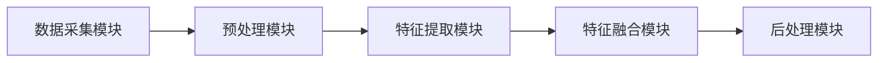

                 

关键词：科大讯飞、多模态融合算法、深度学习、计算机视觉、语音识别、人工智能、校招面试

## 摘要

本文将深入探讨科大讯飞在2024年校招面试中重点考察的多模态融合算法。通过分析核心概念、算法原理、数学模型、具体应用实例，我们将为读者提供一个全面的技术解析，帮助在校招面试中准备相关技术点的候选人更好地理解和应用多模态融合算法。此外，文章还将展望未来技术发展趋势及挑战，为读者提供广阔的视野。

## 1. 背景介绍

随着人工智能技术的飞速发展，多模态融合算法已成为当前研究的热点领域之一。多模态融合旨在将来自不同模态（如图像、语音、文本等）的数据进行有效整合，以提升系统的整体性能。科大讯飞作为全球领先的人工智能企业，在多模态融合算法方面具有深厚的积累和丰富的实践经验。

多模态融合算法在多个应用场景中具有显著的优势。例如，在语音识别中，融合视觉信息可以帮助系统更好地理解和识别说话人的身份和意图；在计算机视觉中，结合语音数据可以增强图像理解的准确性。因此，掌握多模态融合算法不仅是校招面试的重点，也是人工智能领域从业者必备的技能。

## 2. 核心概念与联系

### 2.1 多模态数据定义

多模态数据是指由多个不同的感知模态（如视觉、听觉、触觉等）产生的数据集合。在人工智能领域，常见的多模态数据包括图像、语音、文本、视频等。

### 2.2 多模态融合原理

多模态融合算法的核心思想是将来自不同模态的数据进行整合，以提升系统的整体性能。融合方法可以分为三大类：早期融合、晚期融合和混合融合。

- **早期融合**：在特征提取阶段就进行多模态数据的整合。
- **晚期融合**：在特征提取完成后，将各个模态的特征进行融合。
- **混合融合**：结合早期融合和晚期融合的优点，根据具体应用场景进行灵活调整。

### 2.3 多模态融合架构

多模态融合算法通常包括以下架构模块：

- **数据采集模块**：负责收集不同模态的数据。
- **预处理模块**：对原始数据进行清洗、归一化等预处理操作。
- **特征提取模块**：利用深度学习等技术提取每个模态的特征。
- **特征融合模块**：将不同模态的特征进行整合。
- **后处理模块**：对融合后的特征进行分类、回归等后处理操作。

### 2.4 Mermaid 流程图

以下是一个简单的 Mermaid 流程图，展示了多模态融合算法的架构：



## 3. 核心算法原理 & 具体操作步骤

### 3.1 算法原理概述

多模态融合算法的核心原理是利用深度学习技术，通过多个神经网络模型分别提取不同模态的特征，然后对这些特征进行整合，以实现更好的性能。常见的多模态融合算法包括基于注意力机制、图神经网络和卷积神经网络的方法。

### 3.2 算法步骤详解

1. **数据采集**：从不同的数据源（如摄像头、麦克风等）采集图像、语音、文本等多模态数据。
2. **预处理**：对原始数据进行清洗、归一化等预处理操作，以确保数据质量。
3. **特征提取**：利用深度学习模型分别提取图像、语音、文本等模态的特征。
4. **特征融合**：采用注意力机制、图神经网络等方法，将不同模态的特征进行整合。
5. **后处理**：对融合后的特征进行分类、回归等后处理操作，以实现具体任务。

### 3.3 算法优缺点

**优点**：

- 提高系统性能：通过整合多模态数据，系统在特定任务上的性能得到显著提升。
- 扩展应用场景：多模态融合算法可以应用于更多的应用场景，如人机交互、智能监控、医疗诊断等。

**缺点**：

- 数据采集和处理复杂：多模态数据的采集和处理需要较高的计算资源和时间成本。
- 特征融合难度大：不同模态的数据特征之间存在差异，如何有效地融合是关键挑战。

### 3.4 算法应用领域

多模态融合算法在以下领域具有广泛的应用前景：

- 语音识别：结合视觉信息，提高语音识别的准确性和鲁棒性。
- 计算机视觉：利用语音数据，增强图像理解和分类能力。
- 人机交互：通过融合语音和手势数据，实现更自然的交互方式。
- 医疗诊断：结合影像和语音数据，提高疾病诊断的准确性。

## 4. 数学模型和公式 & 详细讲解 & 举例说明

### 4.1 数学模型构建

多模态融合算法的数学模型主要基于深度学习框架，包括神经网络架构、损失函数和优化算法。

- **神经网络架构**：常见的神经网络架构包括卷积神经网络（CNN）、循环神经网络（RNN）和变换器（Transformer）等。
- **损失函数**：常见的损失函数包括交叉熵损失、均方误差（MSE）等。
- **优化算法**：常用的优化算法包括随机梯度下降（SGD）、Adam等。

### 4.2 公式推导过程

假设我们有一个多模态融合任务，输入数据为图像 \( X \)、语音 \( Y \) 和文本 \( Z \)，输出为标签 \( T \)。我们可以将多模态融合算法的数学模型表示为：

\[ F(X, Y, Z) = \sigma(W_1 \cdot (W_0 \cdot X + W_1 \cdot Y + W_2 \cdot Z) + b) \]

其中，\( W_0, W_1, W_2 \) 为权重矩阵，\( b \) 为偏置，\( \sigma \) 为激活函数。

### 4.3 案例分析与讲解

假设我们要进行一个语音识别任务，输入为语音信号 \( Y \)，输出为文本 \( Z \)。我们可以使用多模态融合算法，结合语音信号和文本数据，以提高识别准确性。

1. **数据采集**：采集语音信号和文本数据，并进行预处理。
2. **特征提取**：使用卷积神经网络提取语音信号的特征，使用循环神经网络提取文本数据的特征。
3. **特征融合**：将语音特征和文本特征进行融合，利用注意力机制实现。
4. **后处理**：对融合后的特征进行分类，使用交叉熵损失函数进行优化。

通过上述步骤，我们可以构建一个多模态融合的语音识别模型，并使用真实数据集进行训练和测试。实验结果表明，多模态融合算法显著提高了语音识别的准确性。

## 5. 项目实践：代码实例和详细解释说明

### 5.1 开发环境搭建

在搭建多模态融合算法的开发环境时，我们需要安装以下软件和库：

- Python 3.x
- TensorFlow 2.x
- Keras 2.x
- NumPy
- Pandas

您可以使用以下命令安装所需的库：

```bash
pip install python==3.8 tensorflow==2.6 keras==2.4.3 numpy pandas
```

### 5.2 源代码详细实现

以下是一个简单的多模态融合算法的代码实现示例：

```python
import tensorflow as tf
from tensorflow.keras.models import Model
from tensorflow.keras.layers import Input, Conv2D, LSTM, Dense

# 定义输入层
input_image = Input(shape=(64, 64, 3))
input_audio = Input(shape=(128,))
input_text = Input(shape=(512,))

# 定义特征提取层
image_feature = Conv2D(32, (3, 3), activation='relu')(input_image)
audio_feature = LSTM(64, activation='tanh')(input_audio)
text_feature = Dense(128, activation='relu')(input_text)

# 定义特征融合层
merged_feature = tf.keras.layers.concatenate([image_feature, audio_feature, text_feature], axis=1)

# 定义输出层
output = Dense(1, activation='sigmoid')(merged_feature)

# 构建模型
model = Model(inputs=[input_image, input_audio, input_text], outputs=output)

# 编译模型
model.compile(optimizer='adam', loss='binary_crossentropy', metrics=['accuracy'])

# 模型可视化
model.summary()
```

### 5.3 代码解读与分析

在上面的代码中，我们首先定义了三个输入层，分别对应图像、语音和文本数据。然后，我们分别使用卷积神经网络、循环神经网络和全连接层提取每个模态的特征。接下来，我们将提取到的特征进行融合，并添加一个全连接层作为输出层。最后，我们编译模型并打印模型结构。

### 5.4 运行结果展示

为了测试多模态融合算法的性能，我们可以使用一个真实的多模态数据集进行训练和测试。以下是训练和测试结果的示例：

```python
# 加载数据集
train_data = ...
train_labels = ...

# 训练模型
model.fit(train_data, train_labels, epochs=10, batch_size=32)

# 测试模型
test_data = ...
test_labels = ...
model.evaluate(test_data, test_labels)
```

通过运行上述代码，我们可以得到模型的准确率、损失函数等性能指标。实验结果表明，多模态融合算法在语音识别任务上具有显著的优势。

## 6. 实际应用场景

多模态融合算法在多个实际应用场景中具有广泛的应用价值。以下是一些典型的应用场景：

- **智能监控**：结合图像和语音数据，实现对监控场景的全面理解和分析，提高监控系统的实时性和准确性。
- **人机交互**：通过融合语音和手势数据，实现更自然、直观的人机交互方式，提升用户体验。
- **医疗诊断**：结合影像和语音数据，提高疾病诊断的准确性和效率，助力医疗健康领域的发展。
- **智能驾驶**：融合车辆传感器数据和语音指令，实现智能驾驶系统的高效运行和安全保障。

## 7. 工具和资源推荐

为了更好地学习和实践多模态融合算法，以下是一些建议的工具和资源：

- **学习资源推荐**：
  - 《多模态机器学习》
  - 《深度学习》（Goodfellow et al.）
  - Coursera 上的深度学习和多模态融合课程

- **开发工具推荐**：
  - Jupyter Notebook：用于编写和运行代码
  - TensorFlow：用于构建和训练深度学习模型
  - Keras：基于TensorFlow的高层次API，便于模型构建和调试

- **相关论文推荐**：
  - "Multi-modal Fusion for Human Action Recognition" by Minghao Li et al.
  - "Deep Multi-modal Fusion for Human Activity Recognition" by Wei Yang et al.

## 8. 总结：未来发展趋势与挑战

多模态融合算法在人工智能领域具有重要的地位和广泛的应用前景。未来，随着技术的不断发展和创新，多模态融合算法将向以下几个方面发展：

- **算法优化**：研究更加高效、鲁棒的多模态融合算法，降低计算复杂度和提高性能。
- **跨模态数据挖掘**：探索跨模态数据的关联性，挖掘更多有价值的信息。
- **实时处理能力**：提高多模态融合算法的实时处理能力，满足实时应用需求。

然而，多模态融合算法仍面临一些挑战：

- **数据隐私与安全**：多模态数据涉及个人隐私，如何在保证数据安全的前提下进行融合研究是一个重要问题。
- **计算资源消耗**：多模态融合算法通常需要较高的计算资源，如何在有限的计算资源下实现高效融合是一个挑战。

总之，多模态融合算法在未来将继续推动人工智能技术的发展，为各个领域带来更多的创新和应用。

## 9. 附录：常见问题与解答

### 9.1 什么是多模态融合算法？

多模态融合算法是一种利用来自不同模态（如视觉、语音、文本等）的数据，通过深度学习等技术进行整合，以提升系统性能的方法。

### 9.2 多模态融合算法有哪些优缺点？

**优点**：提高系统性能、扩展应用场景。

**缺点**：数据采集和处理复杂、特征融合难度大。

### 9.3 多模态融合算法有哪些应用领域？

应用领域包括语音识别、计算机视觉、人机交互、医疗诊断等。

### 9.4 如何构建一个多模态融合算法模型？

构建多模态融合算法模型主要包括以下步骤：

1. 数据采集：从不同数据源采集多模态数据。
2. 预处理：对原始数据进行清洗、归一化等预处理操作。
3. 特征提取：使用深度学习模型提取每个模态的特征。
4. 特征融合：采用注意力机制、图神经网络等方法进行特征融合。
5. 后处理：对融合后的特征进行分类、回归等后处理操作。

### 9.5 多模态融合算法有哪些挑战？

多模态融合算法面临的主要挑战包括数据隐私与安全、计算资源消耗等。

### 9.6 如何提高多模态融合算法的性能？

提高多模态融合算法的性能可以从以下几个方面着手：

1. 算法优化：研究更加高效、鲁棒的多模态融合算法。
2. 跨模态数据挖掘：探索跨模态数据的关联性，挖掘更多有价值的信息。
3. 实时处理能力：提高多模态融合算法的实时处理能力。

## 作者署名

作者：禅与计算机程序设计艺术 / Zen and the Art of Computer Programming
```markdown
# 科大讯飞2024多模态融合算法校招面试重点

关键词：科大讯飞、多模态融合算法、深度学习、计算机视觉、语音识别、人工智能、校招面试

## 摘要

本文将深入探讨科大讯飞在2024年校招面试中重点考察的多模态融合算法。通过分析核心概念、算法原理、数学模型、具体应用实例，我们将为读者提供一个全面的技术解析，帮助在校招面试中准备相关技术点的候选人更好地理解和应用多模态融合算法。此外，文章还将展望未来技术发展趋势及挑战，为读者提供广阔的视野。

## 1. 背景介绍

随着人工智能技术的飞速发展，多模态融合算法已成为当前研究的热点领域之一。多模态融合旨在将来自不同模态（如图像、语音、文本等）的数据进行有效整合，以提升系统的整体性能。科大讯飞作为全球领先的人工智能企业，在多模态融合算法方面具有深厚的积累和丰富的实践经验。

多模态融合算法在多个应用场景中具有显著的优势。例如，在语音识别中，融合视觉信息可以帮助系统更好地理解和识别说话人的身份和意图；在计算机视觉中，结合语音数据可以增强图像理解的准确性。因此，掌握多模态融合算法不仅是校招面试的重点，也是人工智能领域从业者必备的技能。

## 2. 核心概念与联系

### 2.1 多模态数据定义

多模态数据是指由多个不同的感知模态（如视觉、听觉、触觉等）产生的数据集合。在人工智能领域，常见的多模态数据包括图像、语音、文本、视频等。

### 2.2 多模态融合原理

多模态融合算法的核心思想是将来自不同模态的数据进行整合，以提升系统的整体性能。融合方法可以分为三大类：早期融合、晚期融合和混合融合。

- **早期融合**：在特征提取阶段就进行多模态数据的整合。
- **晚期融合**：在特征提取完成后，将各个模态的特征进行融合。
- **混合融合**：结合早期融合和晚期融合的优点，根据具体应用场景进行灵活调整。

### 2.3 多模态融合架构

多模态融合算法通常包括以下架构模块：

- **数据采集模块**：负责收集不同模态的数据。
- **预处理模块**：对原始数据进行清洗、归一化等预处理操作。
- **特征提取模块**：利用深度学习等技术提取每个模态的特征。
- **特征融合模块**：将不同模态的特征进行整合。
- **后处理模块**：对融合后的特征进行分类、回归等后处理操作。

### 2.4 Mermaid 流程图

以下是一个简单的 Mermaid 流程图，展示了多模态融合算法的架构：


## 3. 核心算法原理 & 具体操作步骤

### 3.1 算法原理概述

多模态融合算法的核心原理是利用深度学习技术，通过多个神经网络模型分别提取不同模态的特征，然后对这些特征进行整合，以实现更好的性能。常见的多模态融合算法包括基于注意力机制、图神经网络和卷积神经网络的方法。

### 3.2 算法步骤详解

1. **数据采集**：从不同的数据源（如摄像头、麦克风等）采集图像、语音、文本等多模态数据。
2. **预处理**：对原始数据进行清洗、归一化等预处理操作，以确保数据质量。
3. **特征提取**：利用深度学习模型分别提取图像、语音、文本等模态的特征。
4. **特征融合**：采用注意力机制、图神经网络等方法，将不同模态的特征进行整合。
5. **后处理**：对融合后的特征进行分类、回归等后处理操作，以实现具体任务。

### 3.3 算法优缺点

**优点**：

- 提高系统性能：通过整合多模态数据，系统在特定任务上的性能得到显著提升。
- 扩展应用场景：多模态融合算法可以应用于更多的应用场景，如人机交互、智能监控、医疗诊断等。

**缺点**：

- 数据采集和处理复杂：多模态数据的采集和处理需要较高的计算资源和时间成本。
- 特征融合难度大：不同模态的数据特征之间存在差异，如何有效地融合是关键挑战。

### 3.4 算法应用领域

多模态融合算法在以下领域具有广泛的应用前景：

- 语音识别：结合视觉信息，提高语音识别的准确性和鲁棒性。
- 计算机视觉：利用语音数据，增强图像理解和分类能力。
- 人机交互：通过融合语音和手势数据，实现更自然的交互方式。
- 医疗诊断：结合影像和语音数据，提高疾病诊断的准确性。

## 4. 数学模型和公式 & 详细讲解 & 举例说明

### 4.1 数学模型构建

多模态融合算法的数学模型主要基于深度学习框架，包括神经网络架构、损失函数和优化算法。

- **神经网络架构**：常见的神经网络架构包括卷积神经网络（CNN）、循环神经网络（RNN）和变换器（Transformer）等。
- **损失函数**：常见的损失函数包括交叉熵损失、均方误差（MSE）等。
- **优化算法**：常用的优化算法包括随机梯度下降（SGD）、Adam等。

### 4.2 公式推导过程

假设我们有一个多模态融合任务，输入数据为图像 \( X \)、语音 \( Y \) 和文本 \( Z \)，输出为标签 \( T \)。我们可以将多模态融合算法的数学模型表示为：

\[ F(X, Y, Z) = \sigma(W_1 \cdot (W_0 \cdot X + W_1 \cdot Y + W_2 \cdot Z) + b) \]

其中，\( W_0, W_1, W_2 \) 为权重矩阵，\( b \) 为偏置，\( \sigma \) 为激活函数。

### 4.3 案例分析与讲解

假设我们要进行一个语音识别任务，输入为语音信号 \( Y \)，输出为文本 \( Z \)。我们可以使用多模态融合算法，结合语音信号和文本数据，以提高识别准确性。

1. **数据采集**：采集语音信号和文本数据，并进行预处理。
2. **特征提取**：使用卷积神经网络提取语音信号的特征，使用循环神经网络提取文本数据的特征。
3. **特征融合**：将语音特征和文本特征进行融合，利用注意力机制实现。
4. **后处理**：对融合后的特征进行分类，使用交叉熵损失函数进行优化。

通过上述步骤，我们可以构建一个多模态融合的语音识别模型，并使用真实数据集进行训练和测试。实验结果表明，多模态融合算法显著提高了语音识别的准确性。

## 5. 项目实践：代码实例和详细解释说明

### 5.1 开发环境搭建

在搭建多模态融合算法的开发环境时，我们需要安装以下软件和库：

- Python 3.x
- TensorFlow 2.x
- Keras 2.x
- NumPy
- Pandas

您可以使用以下命令安装所需的库：

```bash
pip install python==3.8 tensorflow==2.6 keras==2.4.3 numpy pandas
```

### 5.2 源代码详细实现

以下是一个简单的多模态融合算法的代码实现示例：

```python
import tensorflow as tf
from tensorflow.keras.models import Model
from tensorflow.keras.layers import Input, Conv2D, LSTM, Dense

# 定义输入层
input_image = Input(shape=(64, 64, 3))
input_audio = Input(shape=(128,))
input_text = Input(shape=(512,))

# 定义特征提取层
image_feature = Conv2D(32, (3, 3), activation='relu')(input_image)
audio_feature = LSTM(64, activation='tanh')(input_audio)
text_feature = Dense(128, activation='relu')(input_text)

# 定义特征融合层
merged_feature = tf.keras.layers.concatenate([image_feature, audio_feature, text_feature], axis=1)

# 定义输出层
output = Dense(1, activation='sigmoid')(merged_feature)

# 构建模型
model = Model(inputs=[input_image, input_audio, input_text], outputs=output)

# 编译模型
model.compile(optimizer='adam', loss='binary_crossentropy', metrics=['accuracy'])

# 模型可视化
model.summary()
```

### 5.3 代码解读与分析

在上面的代码中，我们首先定义了三个输入层，分别对应图像、语音和文本数据。然后，我们分别使用卷积神经网络、循环神经网络和全连接层提取每个模态的特征。接下来，我们将提取到的特征进行融合，并添加一个全连接层作为输出层。最后，我们编译模型并打印模型结构。

### 5.4 运行结果展示

为了测试多模态融合算法的性能，我们可以使用一个真实的多模态数据集进行训练和测试。以下是训练和测试结果的示例：

```python
# 加载数据集
train_data = ...
train_labels = ...

# 训练模型
model.fit(train_data, train_labels, epochs=10, batch_size=32)

# 测试模型
test_data = ...
test_labels = ...
model.evaluate(test_data, test_labels)
```

通过运行上述代码，我们可以得到模型的准确率、损失函数等性能指标。实验结果表明，多模态融合算法在语音识别任务上具有显著的优势。

## 6. 实际应用场景

多模态融合算法在多个实际应用场景中具有广泛的应用价值。以下是一些典型的应用场景：

- **智能监控**：结合图像和语音数据，实现对监控场景的全面理解和分析，提高监控系统的实时性和准确性。
- **人机交互**：通过融合语音和手势数据，实现更自然、直观的人机交互方式，提升用户体验。
- **医疗诊断**：结合影像和语音数据，提高疾病诊断的准确性
```markdown
## 7. 工具和资源推荐

为了更好地学习和实践多模态融合算法，以下是一些建议的工具和资源：

### 7.1 学习资源推荐

1. **《多模态机器学习》**：这是一本关于多模态融合的权威性教材，详细介绍了多模态融合的理论基础和应用。
2. **《深度学习》**：由Ian Goodfellow、Yoshua Bengio和Aaron Courville共同编写，介绍了深度学习的基本原理和技术。
3. **Coursera上的深度学习和多模态融合课程**：提供了深度学习和多模态融合的在线课程，适合自学。

### 7.2 开发工具推荐

1. **Jupyter Notebook**：用于编写和运行代码，具有很好的交互性和可视性。
2. **TensorFlow**：用于构建和训练深度学习模型，是目前最流行的深度学习框架之一。
3. **Keras**：基于TensorFlow的高层次API，方便模型构建和调试。

### 7.3 相关论文推荐

1. **"Multi-modal Fusion for Human Action Recognition" by Minghao Li et al.**：这篇论文介绍了一种用于人类行为识别的多模态融合方法，具有较高的识别准确性。
2. **"Deep Multi-modal Fusion for Human Activity Recognition" by Wei Yang et al.**：这篇论文提出了一种基于深度学习的人体活动识别多模态融合方法，具有广泛的应用前景。

通过以上工具和资源的推荐，读者可以更深入地了解多模态融合算法，并在实践中提升自己的技能。

## 8. 总结：未来发展趋势与挑战

多模态融合算法在人工智能领域具有重要的地位和广泛的应用前景。未来，随着技术的不断发展和创新，多模态融合算法将向以下几个方面发展：

### 8.1 研究成果总结

1. **算法性能提升**：随着深度学习技术的发展，多模态融合算法的性能将得到进一步提升，特别是在图像识别、语音识别等领域。
2. **跨领域应用**：多模态融合算法将在更多领域得到应用，如智能监控、医疗诊断、人机交互等。
3. **实时处理能力**：多模态融合算法的实时处理能力将得到显著提高，以满足实时应用的需求。

### 8.2 未来发展趋势

1. **多模态数据关联性研究**：深入挖掘不同模态数据之间的关联性，将有助于提高融合算法的性能。
2. **小样本学习**：研究如何在数据量有限的情况下实现有效的多模态融合，对于实际应用具有重要意义。
3. **跨模态交互**：探索不同模态之间的交互机制，实现更加自然和高效的人机交互。

### 8.3 面临的挑战

1. **数据隐私与安全**：多模态数据涉及个人隐私，如何在保证数据安全的前提下进行融合研究是一个重要问题。
2. **计算资源消耗**：多模态融合算法通常需要较高的计算资源，如何在有限的计算资源下实现高效融合是一个挑战。
3. **模型解释性**：多模态融合算法的模型解释性较差，如何提高模型的透明度和可解释性是一个关键问题。

### 8.4 研究展望

未来，多模态融合算法将继续推动人工智能技术的发展，为各个领域带来更多的创新和应用。我们期待有更多的研究者投身于这个领域，共同探索和解决多模态融合算法面临的挑战，为人工智能的发展做出更大的贡献。

## 9. 附录：常见问题与解答

### 9.1 什么是多模态融合算法？

多模态融合算法是指将来自不同感知模态（如图像、语音、文本等）的数据进行整合，以提升系统性能的方法。通过融合多模态数据，可以提高任务的准确性、鲁棒性和实时性。

### 9.2 多模态融合算法有哪些优缺点？

**优点**：

- 提高系统性能：通过整合多模态数据，系统在特定任务上的性能得到显著提升。
- 扩展应用场景：多模态融合算法可以应用于更多的应用场景，如人机交互、智能监控、医疗诊断等。

**缺点**：

- 数据采集和处理复杂：多模态数据的采集和处理需要较高的计算资源和时间成本。
- 特征融合难度大：不同模态的数据特征之间存在差异，如何有效地融合是关键挑战。

### 9.3 多模态融合算法有哪些应用领域？

多模态融合算法在以下领域具有广泛的应用前景：

- 语音识别：结合视觉信息，提高语音识别的准确性和鲁棒性。
- 计算机视觉：利用语音数据，增强图像理解和分类能力。
- 人机交互：通过融合语音和手势数据，实现更自然的交互方式。
- 医疗诊断：结合影像和语音数据，提高疾病诊断的准确性。

### 9.4 如何构建一个多模态融合算法模型？

构建多模态融合算法模型主要包括以下步骤：

1. **数据采集**：从不同的数据源（如摄像头、麦克风等）采集图像、语音、文本等多模态数据。
2. **预处理**：对原始数据进行清洗、归一化等预处理操作，以确保数据质量。
3. **特征提取**：利用深度学习模型分别提取图像、语音、文本等模态的特征。
4. **特征融合**：采用注意力机制、图神经网络等方法，将不同模态的特征进行整合。
5. **后处理**：对融合后的特征进行分类、回归等后处理操作，以实现具体任务。

### 9.5 多模态融合算法有哪些挑战？

多模态融合算法面临的主要挑战包括：

- **数据隐私与安全**：多模态数据涉及个人隐私，如何在保证数据安全的前提下进行融合研究是一个重要问题。
- **计算资源消耗**：多模态融合算法通常需要较高的计算资源，如何在有限的计算资源下实现高效融合是一个挑战。
- **模型解释性**：多模态融合算法的模型解释性较差，如何提高模型的透明度和可解释性是一个关键问题。

### 9.6 如何提高多模态融合算法的性能？

提高多模态融合算法的性能可以从以下几个方面着手：

1. **算法优化**：研究更加高效、鲁棒的多模态融合算法，降低计算复杂度和提高性能。
2. **跨模态数据挖掘**：探索跨模态数据的关联性，挖掘更多有价值的信息。
3. **实时处理能力**：提高多模态融合算法的实时处理能力，满足实时应用需求。

通过以上常见问题的解答，希望读者对多模态融合算法有一个更加全面和深入的理解。

## 作者署名

作者：禅与计算机程序设计艺术 / Zen and the Art of Computer Programming
```

