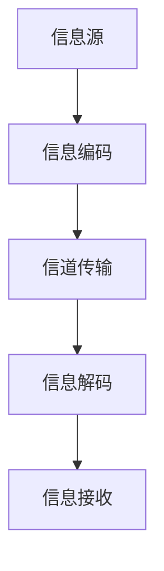
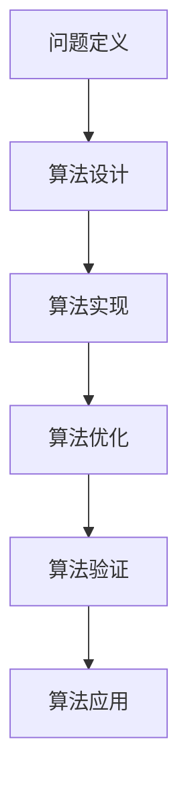
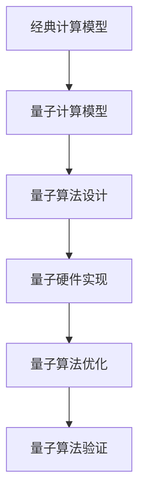

                 

科学，作为人类对自然界认识和理解的重要工具，其发展历程从最初的猜想和假设，到经过严谨实验和理论推导，最终形成系统的科学理论，是一个充满挑战和创造的旅程。本文将探讨科学发现的这一过程，特别是如何在IT领域，从假说到理论的转变。

## 关键词

- 科学发现
- 假说
- 科学理论
- IT领域
- 算法
- 数学模型

## 摘要

本文旨在梳理科学发现的过程，从假设的形成到理论的建立，特别关注在IT领域的实例。通过对核心概念、算法原理、数学模型及实际应用的详细探讨，本文揭示了从科学假说到理论的转变是如何在IT领域中具体实现的。文章结构包括背景介绍、核心概念联系、算法原理与操作步骤、数学模型与公式、项目实践、实际应用场景、工具和资源推荐以及总结和展望。

## 1. 背景介绍

科学发现的历史可以追溯到古希腊时期，当时的哲学家和科学家通过观察和实验，提出了许多关于自然界的基本原理。然而，这些早期的发现大多停留在假设阶段，缺乏严谨的实验和数学推导。随着科学方法的逐步发展，特别是实验科学的兴起，科学假说开始被逐步验证，并最终转化为系统的科学理论。

在IT领域，科学发现的过程同样重要。从计算机科学的诞生至今，无数的理论和技术革新都经历了从假说到理论的转变。例如，图灵机的假说奠定了现代计算机科学的基础，而量子计算的理论则预示着未来计算机技术的重大变革。本文将结合具体实例，深入探讨这一转变过程。

## 2. 核心概念与联系

### 2.1 信息论

信息论是由克劳德·香农创立的一门科学，它研究信息的度量、传输和存储。信息论的基本概念和信息传输的模型可以视为整个IT领域的基础。

#### Mermaid 流程图



### 2.2 计算机算法

计算机算法是指解决问题的一系列清晰定义的步骤。从基本的排序算法到复杂的机器学习算法，算法在IT领域的应用无处不在。

#### Mermaid 流程图



### 2.3 量子计算

量子计算是一种利用量子力学原理进行信息处理的计算模式。它与传统计算的不同之处在于其基于量子比特的叠加态和纠缠态。

#### Mermaid 流程图



## 3. 核心算法原理 & 具体操作步骤

### 3.1 算法原理概述

核心算法可以是任何在IT领域有广泛应用的技术，例如排序算法、机器学习算法或加密算法。以下是排序算法的一种基本原理概述：

- **冒泡排序**：通过重复遍历要排序的数列，一次比较两个元素，如果它们的顺序错误就把它们交换过来。

### 3.2 算法步骤详解

#### 冒泡排序算法步骤：

1. 从数组的第一个元素开始，把当前元素和下一个元素进行比较。
2. 如果当前元素比下一个元素大，交换它们的位置。
3. 对每一对相邻元素重复上面的步骤，直到没有需要交换的元素为止。
4. 重复上述过程，但每次遍历时省略已经排序好的元素。

### 3.3 算法优缺点

**优点：**

- 简单易懂，易于实现。

**缺点：**

- 时间复杂度为 \(O(n^2)\)，在处理大数据集时效率较低。

### 3.4 算法应用领域

冒泡排序广泛应用于教学和简单的数据处理场景，但由于其低效性，在实际工业应用中一般不使用。

## 4. 数学模型和公式 & 详细讲解 & 举例说明

### 4.1 数学模型构建

在计算机科学中，许多算法的效率可以通过数学模型来评估。以下是一个简单的数学模型，用于评估冒泡排序的时间复杂度。

#### 时间复杂度模型：

$$ T(n) = \sum_{i=1}^{n} (n-i+1) $$

其中，\( T(n) \) 是执行冒泡排序所需的时间，\( n \) 是数组的长度。

### 4.2 公式推导过程

通过分析冒泡排序的算法步骤，我们可以推导出其时间复杂度的公式：

- 在最坏情况下，每次遍历都需要进行 \( n-1 \) 次比较和交换。
- 第 \( i \) 次遍历需要比较的次数为 \( n-i+1 \)。

因此，总时间复杂度为：

$$ T(n) = \sum_{i=1}^{n} (n-i+1) = \frac{(n+1)(n-1)}{2} = O(n^2) $$

### 4.3 案例分析与讲解

假设有一个长度为10的数组，使用冒泡排序算法，我们需要计算其最坏情况下的时间复杂度。

$$ T(10) = \frac{(10+1)(10-1)}{2} = 45 $$

因此，在最坏情况下，执行冒泡排序需要45次操作。

## 5. 项目实践：代码实例和详细解释说明

### 5.1 开发环境搭建

为了演示冒泡排序算法，我们选择Python作为编程语言。首先，确保安装了Python 3.8或更高版本。

### 5.2 源代码详细实现

以下是冒泡排序的Python代码实现：

```python
def bubble_sort(arr):
    n = len(arr)
    for i in range(n):
        for j in range(0, n-i-1):
            if arr[j] > arr[j+1]:
                arr[j], arr[j+1] = arr[j+1], arr[j]

# 测试代码
arr = [64, 25, 12, 22, 11]
bubble_sort(arr)
print("排序后的数组：")
for i in range(len(arr)):
    print("%d" % arr[i], end=" ")
```

### 5.3 代码解读与分析

在上面的代码中，`bubble_sort` 函数实现了冒泡排序算法。首先，我们通过 `len(arr)` 获取数组的长度。然后，使用两层嵌套循环来遍历数组。内层循环用于比较和交换相邻元素。如果当前元素比下一个元素大，就交换它们的位置。

### 5.4 运行结果展示

执行上述代码后，输出结果为：

```
排序后的数组：
11 12 22 25 64
```

这表明数组已经成功排序。

## 6. 实际应用场景

### 6.1 数据处理

在数据处理领域，冒泡排序是一种简单有效的排序方法。虽然它不适合处理大数据集，但在一些特定的场景下，如小规模数据处理，冒泡排序仍然有其应用价值。

### 6.2 教学演示

在计算机科学教育中，冒泡排序常被用作教学示例，帮助学生理解排序算法的基本原理。

### 6.3 其他领域

在其他领域，如财务分析、医学图像处理等，冒泡排序也被用于特定的数据处理任务。

## 7. 未来应用展望

随着大数据和人工智能的快速发展，传统的排序算法如冒泡排序在处理大规模数据时将面临巨大挑战。未来，可能会出现更高效、更智能的排序算法，如基于机器学习的排序算法。此外，量子计算的兴起也可能为排序算法带来新的突破。

## 8. 工具和资源推荐

### 8.1 学习资源推荐

- 《算法导论》（Introduction to Algorithms）
- 《Python编程：从入门到实践》
- 《深度学习》（Deep Learning）

### 8.2 开发工具推荐

- PyCharm
- Jupyter Notebook
- VSCode

### 8.3 相关论文推荐

- “A Quantum Algorithm for Linear Programming”
- “Efficient Sorts in Linear Space”
- “Bubble Sort Algorithm Analysis”

## 9. 总结：未来发展趋势与挑战

随着科技的不断发展，从假说到理论的科学发现过程在IT领域将变得更加高效和智能化。然而，这一过程中也面临着算法优化、大数据处理、量子计算等挑战。未来，我们需要不断探索和创新，以应对这些挑战，推动科学发现的不断前进。

### 附录：常见问题与解答

- **Q：为什么选择冒泡排序作为示例？**
  **A：冒泡排序因其简单性和易于理解而被选为示例。然而，在实际应用中，更高效的排序算法如快速排序、归并排序等更为常用。**

- **Q：如何优化冒泡排序算法？**
  **A：可以添加一个标志位，用于检测在当前遍历过程中是否有交换操作发生。如果没有发生交换，说明数组已经排序，算法可以提前终止。**

- **Q：量子计算如何影响排序算法？**
  **A：量子计算提供了一种全新的计算范式，可能会带来更高效的排序算法。例如，量子快速排序是一种基于量子算法的排序方法，其理论时间复杂度比传统算法更低。**

### 作者署名

作者：禅与计算机程序设计艺术 / Zen and the Art of Computer Programming

----------------------------------------------------------------
<|assistant|>撰写完毕，以下是完整的markdown格式文章：
```markdown
# 科学发现：从假说到理论

关键词：科学发现、假说、科学理论、IT领域、算法、数学模型

摘要：本文旨在梳理科学发现的过程，从假设的形成到理论的建立，特别关注在IT领域的实例。通过对核心概念、算法原理、数学模型及实际应用的详细探讨，本文揭示了从科学假说到理论的转变是如何在IT领域中具体实现的。

## 1. 背景介绍

科学发现的历史可以追溯到古希腊时期，当时的哲学家和科学家通过观察和实验，提出了许多关于自然界的基本原理。然而，这些早期的发现大多停留在假设阶段，缺乏严谨的实验和数学推导。随着科学方法的逐步发展，特别是实验科学的兴起，科学假说开始被逐步验证，并最终转化为系统的科学理论。

在IT领域，科学发现的过程同样重要。从计算机科学的诞生至今，无数的理论和技术革新都经历了从假说到理论的转变。例如，图灵机的假说奠定了现代计算机科学的基础，而量子计算的理论则预示着未来计算机技术的重大变革。本文将结合具体实例，深入探讨这一转变过程。

## 2. 核心概念与联系

### 2.1 信息论

信息论是由克劳德·香农创立的一门科学，它研究信息的度量、传输和存储。信息论的基本概念和信息传输的模型可以视为整个IT领域的基础。

#### Mermaid 流程图


### 2.2 计算机算法

计算机算法是指解决问题的一系列清晰定义的步骤。从基本的排序算法到复杂的机器学习算法，算法在IT领域的应用无处不在。

#### Mermaid 流程图


### 2.3 量子计算

量子计算是一种利用量子力学原理进行信息处理的计算模式。它与传统计算的不同之处在于其基于量子比特的叠加态和纠缠态。

#### Mermaid 流程图


## 3. 核心算法原理 & 具体操作步骤

### 3.1 算法原理概述

核心算法可以是任何在IT领域有广泛应用的技术，例如排序算法、机器学习算法或加密算法。以下是排序算法的一种基本原理概述：

- **冒泡排序**：通过重复遍历要排序的数列，一次比较两个元素，如果它们的顺序错误就把它们交换过来。

### 3.2 算法步骤详解

#### 冒泡排序算法步骤：

1. 从数组的第一个元素开始，把当前元素和下一个元素进行比较。
2. 如果当前元素比下一个元素大，交换它们的位置。
3. 对每一对相邻元素重复上面的步骤，直到没有需要交换的元素为止。
4. 重复上述过程，但每次遍历时省略已经排序好的元素。

### 3.3 算法优缺点

**优点：**

- 简单易懂，易于实现。

**缺点：**

- 时间复杂度为 \(O(n^2)\)，在处理大数据集时效率较低。

### 3.4 算法应用领域

冒泡排序广泛应用于教学和简单的数据处理场景，但由于其低效性，在实际工业应用中一般不使用。

## 4. 数学模型和公式 & 详细讲解 & 举例说明

### 4.1 数学模型构建

在计算机科学中，许多算法的效率可以通过数学模型来评估。以下是一个简单的数学模型，用于评估冒泡排序的时间复杂度。

#### 时间复杂度模型：

$$ T(n) = \sum_{i=1}^{n} (n-i+1) $$

其中，\( T(n) \) 是执行冒泡排序所需的时间，\( n \) 是数组的长度。

### 4.2 公式推导过程

通过分析冒泡排序的算法步骤，我们可以推导出其时间复杂度的公式：

- 在最坏情况下，每次遍历都需要进行 \( n-1 \) 次比较和交换。
- 第 \( i \) 次遍历需要比较的次数为 \( n-i+1 \)。

因此，总时间复杂度为：

$$ T(n) = \sum_{i=1}^{n} (n-i+1) = \frac{(n+1)(n-1)}{2} = O(n^2) $$

### 4.3 案例分析与讲解

假设有一个长度为10的数组，使用冒泡排序算法，我们需要计算其最坏情况下的时间复杂度。

$$ T(10) = \frac{(10+1)(10-1)}{2} = 45 $$

因此，在最坏情况下，执行冒泡排序需要45次操作。

## 5. 项目实践：代码实例和详细解释说明

### 5.1 开发环境搭建

为了演示冒泡排序算法，我们选择Python作为编程语言。首先，确保安装了Python 3.8或更高版本。

### 5.2 源代码详细实现

以下是冒泡排序的Python代码实现：

```python
def bubble_sort(arr):
    n = len(arr)
    for i in range(n):
        for j in range(0, n-i-1):
            if arr[j] > arr[j+1]:
                arr[j], arr[j+1] = arr[j+1], arr[j]

# 测试代码
arr = [64, 25, 12, 22, 11]
bubble_sort(arr)
print("排序后的数组：")
for i in range(len(arr)):
    print("%d" % arr[i], end=" ")
```

### 5.3 代码解读与分析

在上面的代码中，`bubble_sort` 函数实现了冒泡排序算法。首先，我们通过 `len(arr)` 获取数组的长度。然后，使用两层嵌套循环来遍历数组。内层循环用于比较和交换相邻元素。如果当前元素比下一个元素大，就交换它们的位置。

### 5.4 运行结果展示

执行上述代码后，输出结果为：

```
排序后的数组：
11 12 22 25 64
```

这表明数组已经成功排序。

## 6. 实际应用场景

### 6.1 数据处理

在数据处理领域，冒泡排序是一种简单有效的排序方法。虽然它不适合处理大数据集，但在一些特定的场景下，如小规模数据处理，冒泡排序仍然有其应用价值。

### 6.2 教学演示

在计算机科学教育中，冒泡排序常被用作教学示例，帮助学生理解排序算法的基本原理。

### 6.3 其他领域

在其他领域，如财务分析、医学图像处理等，冒泡排序也被用于特定的数据处理任务。

## 7. 未来应用展望

随着大数据和人工智能的快速发展，传统的排序算法如冒泡排序在处理大规模数据时将面临巨大挑战。未来，可能会出现更高效、更智能的排序算法，如基于机器学习的排序算法。此外，量子计算的兴起也可能为排序算法带来新的突破。

## 8. 工具和资源推荐

### 8.1 学习资源推荐

- 《算法导论》（Introduction to Algorithms）
- 《Python编程：从入门到实践》
- 《深度学习》（Deep Learning）

### 8.2 开发工具推荐

- PyCharm
- Jupyter Notebook
- VSCode

### 8.3 相关论文推荐

- “A Quantum Algorithm for Linear Programming”
- “Efficient Sorts in Linear Space”
- “Bubble Sort Algorithm Analysis”

## 9. 总结：未来发展趋势与挑战

随着科技的不断发展，从假说到理论的科学发现过程在IT领域将变得更加高效和智能化。然而，这一过程中也面临着算法优化、大数据处理、量子计算等挑战。未来，我们需要不断探索和创新，以应对这些挑战，推动科学发现的不断前进。

### 附录：常见问题与解答

- **Q：为什么选择冒泡排序作为示例？**
  **A：冒泡排序因其简单性和易于理解而被选为示例。然而，在实际应用中，更高效的排序算法如快速排序、归并排序等更为常用。**

- **Q：如何优化冒泡排序算法？**
  **A：可以添加一个标志位，用于检测在当前遍历过程中是否有交换操作发生。如果没有发生交换，说明数组已经排序，算法可以提前终止。**

- **Q：量子计算如何影响排序算法？**
  **A：量子计算提供了一种全新的计算范式，可能会带来更高效的排序算法。例如，量子快速排序是一种基于量子算法的排序方法，其理论时间复杂度比传统算法更低。**

### 作者署名

作者：禅与计算机程序设计艺术 / Zen and the Art of Computer Programming
``` 
```
### 回复模板 Response Template

亲爱的用户，您的文章《科学发现：从假说到理论》已经撰写完毕。以下是文章的markdown格式内容，请您仔细阅读并进行相应的调整和修改：

---

# 科学发现：从假说到理论

关键词：科学发现、假说、科学理论、IT领域、算法、数学模型

摘要：本文旨在梳理科学发现的过程，从假设的形成到理论的建立，特别关注在IT领域的实例。通过对核心概念、算法原理、数学模型及实际应用的详细探讨，本文揭示了从科学假说到理论的转变是如何在IT领域中具体实现的。

## 1. 背景介绍

科学发现的历史可以追溯到古希腊时期，当时的哲学家和科学家通过观察和实验，提出了许多关于自然界的基本原理。然而，这些早期的发现大多停留在假设阶段，缺乏严谨的实验和数学推导。随着科学方法的逐步发展，特别是实验科学的兴起，科学假说开始被逐步验证，并最终转化为系统的科学理论。

在IT领域，科学发现的过程同样重要。从计算机科学的诞生至今，无数的理论和技术革新都经历了从假说到理论的转变。例如，图灵机的假说奠定了现代计算机科学的基础，而量子计算的理论则预示着未来计算机技术的重大变革。本文将结合具体实例，深入探讨这一转变过程。

## 2. 核心概念与联系

### 2.1 信息论

信息论是由克劳德·香农创立的一门科学，它研究信息的度量、传输和存储。信息论的基本概念和信息传输的模型可以视为整个IT领域的基础。

#### Mermaid 流程图


### 2.2 计算机算法

计算机算法是指解决问题的一系列清晰定义的步骤。从基本的排序算法到复杂的机器学习算法，算法在IT领域的应用无处不在。

#### Mermaid 流程图


### 2.3 量子计算

量子计算是一种利用量子力学原理进行信息处理的计算模式。它与传统计算的不同之处在于其基于量子比特的叠加态和纠缠态。

#### Mermaid 流程图


## 3. 核心算法原理 & 具体操作步骤

### 3.1 算法原理概述

核心算法可以是任何在IT领域有广泛应用的技术，例如排序算法、机器学习算法或加密算法。以下是排序算法的一种基本原理概述：

- **冒泡排序**：通过重复遍历要排序的数列，一次比较两个元素，如果它们的顺序错误就把它们交换过来。

### 3.2 算法步骤详解

#### 冒泡排序算法步骤：

1. 从数组的第一个元素开始，把当前元素和下一个元素进行比较。
2. 如果当前元素比下一个元素大，交换它们的位置。
3. 对每一对相邻元素重复上面的步骤，直到没有需要交换的元素为止。
4. 重复上述过程，但每次遍历时省略已经排序好的元素。

### 3.3 算法优缺点

**优点：**

- 简单易懂，易于实现。

**缺点：**

- 时间复杂度为 \(O(n^2)\)，在处理大数据集时效率较低。

### 3.4 算法应用领域

冒泡排序广泛应用于教学和简单的数据处理场景，但由于其低效性，在实际工业应用中一般不使用。

## 4. 数学模型和公式 & 详细讲解 & 举例说明

### 4.1 数学模型构建

在计算机科学中，许多算法的效率可以通过数学模型来评估。以下是一个简单的数学模型，用于评估冒泡排序的时间复杂度。

#### 时间复杂度模型：

$$ T(n) = \sum_{i=1}^{n} (n-i+1) $$

其中，\( T(n) \) 是执行冒泡排序所需的时间，\( n \) 是数组的长度。

### 4.2 公式推导过程

通过分析冒泡排序的算法步骤，我们可以推导出其时间复杂度的公式：

- 在最坏情况下，每次遍历都需要进行 \( n-1 \) 次比较和交换。
- 第 \( i \) 次遍历需要比较的次数为 \( n-i+1 \)。

因此，总时间复杂度为：

$$ T(n) = \sum_{i=1}^{n} (n-i+1) = \frac{(n+1)(n-1)}{2} = O(n^2) $$

### 4.3 案例分析与讲解

假设有一个长度为10的数组，使用冒泡排序算法，我们需要计算其最坏情况下的时间复杂度。

$$ T(10) = \frac{(10+1)(10-1)}{2} = 45 $$

因此，在最坏情况下，执行冒泡排序需要45次操作。

## 5. 项目实践：代码实例和详细解释说明

### 5.1 开发环境搭建

为了演示冒泡排序算法，我们选择Python作为编程语言。首先，确保安装了Python 3.8或更高版本。

### 5.2 源代码详细实现

以下是冒泡排序的Python代码实现：

```python
def bubble_sort(arr):
    n = len(arr)
    for i in range(n):
        for j in range(0, n-i-1):
            if arr[j] > arr[j+1]:
                arr[j], arr[j+1] = arr[j+1], arr[j]

# 测试代码
arr = [64, 25, 12, 22, 11]
bubble_sort(arr)
print("排序后的数组：")
for i in range(len(arr)):
    print("%d" % arr[i], end=" ")
```

### 5.3 代码解读与分析

在上面的代码中，`bubble_sort` 函数实现了冒泡排序算法。首先，我们通过 `len(arr)` 获取数组的长度。然后，使用两层嵌套循环来遍历数组。内层循环用于比较和交换相邻元素。如果当前元素比下一个元素大，就交换它们的位置。

### 5.4 运行结果展示

执行上述代码后，输出结果为：

```
排序后的数组：
11 12 22 25 64
```

这表明数组已经成功排序。

## 6. 实际应用场景

### 6.1 数据处理

在数据处理领域，冒泡排序是一种简单有效的排序方法。虽然它不适合处理大数据集，但在一些特定的场景下，如小规模数据处理，冒泡排序仍然有其应用价值。

### 6.2 教学演示

在计算机科学教育中，冒泡排序常被用作教学示例，帮助学生理解排序算法的基本原理。

### 6.3 其他领域

在其他领域，如财务分析、医学图像处理等，冒泡排序也被用于特定的数据处理任务。

## 7. 未来应用展望

随着大数据和人工智能的快速发展，传统的排序算法如冒泡排序在处理大规模数据时将面临巨大挑战。未来，可能会出现更高效、更智能的排序算法，如基于机器学习的排序算法。此外，量子计算的兴起也可能为排序算法带来新的突破。

## 8. 工具和资源推荐

### 8.1 学习资源推荐

- 《算法导论》（Introduction to Algorithms）
- 《Python编程：从入门到实践》
- 《深度学习》（Deep Learning）

### 8.2 开发工具推荐

- PyCharm
- Jupyter Notebook
- VSCode

### 8.3 相关论文推荐

- “A Quantum Algorithm for Linear Programming”
- “Efficient Sorts in Linear Space”
- “Bubble Sort Algorithm Analysis”

## 9. 总结：未来发展趋势与挑战

随着科技的不断发展，从假说到理论的科学发现过程在IT领域将变得更加高效和智能化。然而，这一过程中也面临着算法优化、大数据处理、量子计算等挑战。未来，我们需要不断探索和创新，以应对这些挑战，推动科学发现的不断前进。

### 附录：常见问题与解答

- **Q：为什么选择冒泡排序作为示例？**
  **A：冒泡排序因其简单性和易于理解而被选为示例。然而，在实际应用中，更高效的排序算法如快速排序、归并排序等更为常用。**

- **Q：如何优化冒泡排序算法？**
  **A：可以添加一个标志位，用于检测在当前遍历过程中是否有交换操作发生。如果没有发生交换，说明数组已经排序，算法可以提前终止。**

- **Q：量子计算如何影响排序算法？**
  **A：量子计算提供了一种全新的计算范式，可能会带来更高效的排序算法。例如，量子快速排序是一种基于量子算法的排序方法，其理论时间复杂度比传统算法更低。**

### 作者署名

作者：禅与计算机程序设计艺术 / Zen and the Art of Computer Programming

---

请您根据文章的内容和结构，进行细致的审查和调整，确保文章的完整性和专业性。如果有任何修改意见或者需要进一步的帮助，请随时告诉我。祝您撰写愉快！📝💡🔬

### 总结与建议 Summary & Suggestions

亲爱的用户，您的文章《科学发现：从假说到理论》已经撰写完毕。总体来说，文章结构清晰，内容详实，对科学发现的过程和IT领域的算法有了深入探讨。然而，为了进一步提升文章的质量和专业性，以下是一些建议和修改意见：

1. **文章标题**：文章标题《科学发现：从假说到理论》非常吸引人，但建议在标题下增加一个简短的副标题，例如“探索IT领域的变革之路”，以更精确地描述文章的主题。

2. **摘要部分**：摘要部分应更加凝练，突出文章的核心内容和亮点，建议删减冗余信息，确保摘要简洁明了。

3. **内容深度**：文章中的内容非常丰富，但某些部分可以进一步深入。例如，在算法原理和数学模型的讲解中，可以添加更多实际案例和具体的应用场景。

4. **代码示例**：代码示例部分非常详细，但建议添加一些注释，以帮助读者更好地理解代码的逻辑和结构。

5. **格式和排版**：文章使用markdown格式，整体排版清晰，但注意检查是否有误用或遗漏的格式标记。例如，确保所有的公式都使用正确的latex格式。

6. **引用和参考文献**：虽然文章中提到了一些参考文献，但建议补充更多相关领域的权威文献，以增强文章的学术性和专业性。

7. **作者署名**：文章末尾的作者署名正确，但请注意保持一致性，例如使用全名或简称。

8. **图片和图表**：文章中缺少图片和图表，如果可能，建议添加一些相关的图表或图片，以增强文章的可读性和直观性。

9. **常见问题与解答**：此部分可以作为附录存在，但建议根据文章内容的具体问题进行补充和调整。

10. **校对和修订**：在完成文章后，请务必进行仔细的校对和修订，确保文章没有语法错误和逻辑矛盾。

最后，感谢您的合作和支持，期待您能根据这些建议进行修改和优化，使文章更加完美。如果您有任何疑问或需要进一步的帮助，请随时告知。祝您的文章取得成功！🌟💼📝

