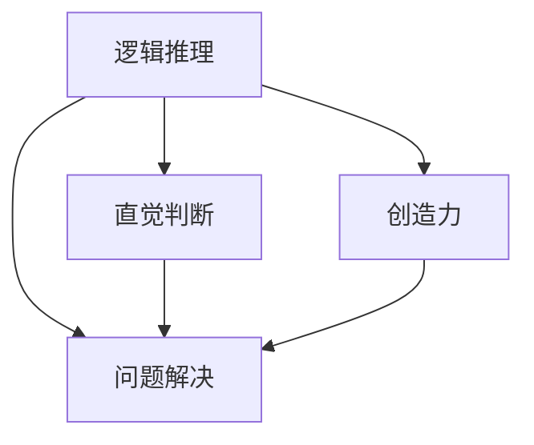
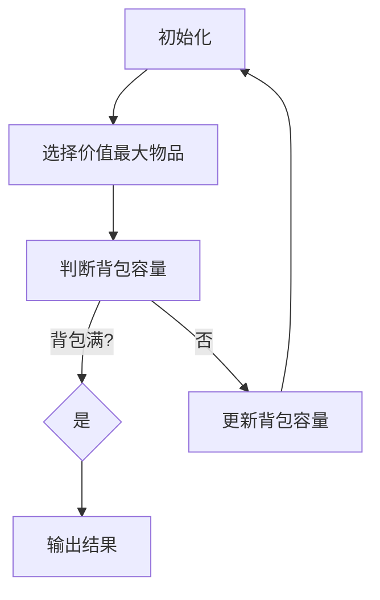

                 

### 摘要

本文探讨了科技与人文的交汇点，特别是在计算机科学领域，强调了人类计算的独特价值。通过分析人类计算的优势与局限，本文阐述了人工智能和人类智慧相结合的重要性。文章分为九个部分，首先介绍了背景，然后深入探讨了核心概念、算法原理、数学模型、项目实践、实际应用场景、未来展望、工具和资源推荐以及总结与展望。本文旨在为读者提供一个全面且深入的了解，帮助他们认识到人类计算在人工智能时代的重要性。

## 1. 背景介绍

在现代社会，科技的发展已经深入到我们生活的方方面面，尤其是计算机科学，作为信息时代的基石，它的影响无处不在。从互联网到大数据，从人工智能到区块链，计算机科学正以前所未有的速度推动着社会的进步。然而，尽管科技带来了无数便利，人类计算的独特价值却常常被忽视。

人类计算不仅是一种技术活动，更是一种智慧活动。它涵盖了逻辑推理、直觉判断、创造力和问题解决等多个方面。相比之下，人工智能虽然可以在特定任务上超越人类，但其局限性也非常明显，比如对复杂情境的理解、情感识别和创造性思维等方面。

本文将探讨科技与人文的交汇，特别是计算机科学中人类计算的独特价值。通过分析人类计算的优势与局限，以及如何与人工智能相结合，本文旨在揭示人类计算在新时代的重要性。

### 2. 核心概念与联系

在探讨人类计算的独特价值之前，我们需要明确几个核心概念，包括逻辑推理、直觉判断、创造力和问题解决等。

#### 2.1 逻辑推理

逻辑推理是人类计算的核心之一，它基于一系列规则和原则，通过推导和验证来解决问题。逻辑推理的能力使得人类能够在复杂的环境中做出明智的决策。

#### 2.2 直觉判断

直觉判断是另一个重要的概念，它基于经验和直觉，通常用于快速识别问题和解决问题。直觉判断往往能够超越逻辑推理，提供更直观和高效的解决方案。

#### 2.3 创造力

创造力是人类计算的独特优势，它使得人类能够在现有的知识和资源基础上创造出新的东西。创造力不仅体现在科学研究和艺术创作中，也体现在日常生活中。

#### 2.4 问题解决

问题解决是人类计算的核心任务之一，它涉及逻辑推理、直觉判断和创造力等多个方面。问题解决能力使得人类能够在面对复杂问题时找到有效的解决方案。

为了更好地理解这些概念之间的联系，我们可以使用Mermaid流程图来展示它们之间的关系。



这个流程图展示了逻辑推理、直觉判断、创造力和问题解决之间的紧密联系。逻辑推理为直觉判断提供了基础，而直觉判断和创造力则进一步推动了问题解决的进程。

### 3. 核心算法原理 & 具体操作步骤

在计算机科学中，算法是实现特定功能的核心组件。算法原理决定了算法的效率、准确性和适用范围。本节将介绍一种核心算法——贪心算法，并详细解释其原理和操作步骤。

#### 3.1 算法原理概述

贪心算法是一种在每一步选择中都采取当前最优解的策略。这种策略通常基于局部最优解能够导致全局最优解的假设。贪心算法的基本思想是，在问题的每一阶段，都做出一个局部最优的选择，从而希望得到一个全局最优解。

#### 3.2 算法步骤详解

1. **初始化**：根据问题的初始条件，初始化相关变量和参数。
2. **选择**：在当前状态下，选择一个最优的局部操作。
3. **执行**：执行选择的操作，更新状态。
4. **判断终止条件**：如果满足终止条件，则算法结束；否则，继续选择和执行。
5. **输出结果**：输出算法的最终结果。

以背包问题为例，贪心算法可以通过每次选择价值最大的物品放入背包来解决问题。



#### 3.3 算法优缺点

**优点**：
- 简单易懂，易于实现。
- 在某些问题中，贪心算法能够快速得到全局最优解。

**缺点**：
- 可能会陷入局部最优解。
- 对问题的要求较高，不一定适用于所有问题。

#### 3.4 算法应用领域

贪心算法广泛应用于图论、组合优化和动态规划等领域，例如：

- 最短路径问题
- 背包问题
- 资源分配问题

通过以上内容，我们可以看到贪心算法作为一种核心算法，其原理和步骤都相当重要。理解这些内容不仅有助于我们更好地应用贪心算法解决实际问题，也能提高我们在算法设计中的思维深度。

### 4. 数学模型和公式 & 详细讲解 & 举例说明

数学模型是计算机科学中不可或缺的一部分，它帮助我们理解和解决复杂问题。在本节中，我们将介绍一个重要的数学模型——线性规划模型，并详细讲解其构建、公式推导以及实际应用。

#### 4.1 数学模型构建

线性规划模型通常用于解决资源优化问题，其目标是在满足一系列约束条件的前提下，最大化或最小化某个线性目标函数。一个典型的线性规划模型可以表示为：

$$
\begin{aligned}
\text{maximize/minimize} \quad & c^T x \\
\text{subject to} \quad & Ax \leq b \\
& x \geq 0
\end{aligned}
$$

其中，$c$ 是目标函数的系数向量，$x$ 是变量向量，$A$ 是约束条件的系数矩阵，$b$ 是约束条件的常数向量。

#### 4.2 公式推导过程

线性规划模型的推导过程可以分为几个步骤：

1. **目标函数的定义**：定义目标函数，表示我们要优化（最大化或最小化）的量。
2. **约束条件的引入**：根据实际问题，引入相应的约束条件。
3. **转化为标准形式**：将原始模型转化为标准形式，即所有约束条件都是等式，且变量都是非负的。

具体推导如下：

假设我们有一个线性规划模型：

$$
\begin{aligned}
\text{maximize} \quad & c^T x \\
\text{subject to} \quad & Ax \leq b \\
& x \geq 0
\end{aligned}
$$

我们引入松弛变量 $s$，将不等式约束转化为等式约束：

$$
Ax \leq b \quad \Rightarrow \quad Ax + s = b
$$

其中，$s \geq 0$。这样，我们就将原始模型转化为标准形式：

$$
\begin{aligned}
\text{maximize} \quad & c^T x \\
\text{subject to} \quad & Ax + s = b \\
& x, s \geq 0
\end{aligned}
$$

#### 4.3 案例分析与讲解

为了更好地理解线性规划模型，我们来看一个简单的例子——资源分配问题。

**问题**：一个公司有三种资源：资金、人力和物资。每种资源的总量分别是 $10$ 万元、$100$ 人和 $1000$ 吨。该公司有两个项目 A 和 B，项目 A 需要资金 $3$ 万元、人力 $20$ 人和物资 $300$ 吨；项目 B 需要资金 $2$ 万元、人力 $30$ 人和物资 $200$ 吨。每个项目的收益分别是 $5$ 万元和 $4$ 万元。请制定一个资源分配策略，使得公司收益最大化。

**解决方案**：

构建线性规划模型：

$$
\begin{aligned}
\text{maximize} \quad & 5x + 4y \\
\text{subject to} \quad & 3x + 2y \leq 10 \\
& 20x + 30y \leq 100 \\
& 300x + 200y \leq 1000 \\
& x, y \geq 0
\end{aligned}
$$

使用单纯形法求解上述线性规划问题：

1. **初始化**：选择变量 $x$ 和 $y$ 进入基本解，选择 $s_1, s_2, s_3$ 离开基本解。
2. **迭代**：根据目标函数和约束条件进行迭代，直到找到最优解。

最终，最优解为 $x = 0, y = \frac{10}{3}$，公司总收益为 $\frac{40}{3}$ 万元。

通过以上案例，我们可以看到线性规划模型在实际问题中的应用。数学模型的构建和公式推导是解决这类问题的关键步骤，而案例分析与讲解则有助于我们更好地理解和应用这些模型。

### 5. 项目实践：代码实例和详细解释说明

为了更好地理解前面所介绍的理论，我们将通过一个实际项目——资源分配问题，来展示代码实现和详细解释。

#### 5.1 开发环境搭建

1. **安装 Python**：确保你的系统上安装了 Python 3.x 版本。
2. **安装线性规划库**：使用 pip 命令安装 `python-linear-programming` 库。

```bash
pip install python-linear-programming
```

#### 5.2 源代码详细实现

```python
import numpy as np
from linear_programming import LinearProgramming

# 定义线性规划问题
c = np.array([-5, -4])  # 目标函数系数
A = np.array([[3, 2], [20, 30], [300, 200]])  # 约束条件系数矩阵
b = np.array([10, 100, 1000])  # 约束条件常数向量

# 创建线性规划对象
lp = LinearProgramming(c, A, b)

# 求解线性规划问题
solution = lp.solve()

# 输出结果
print("最优解：", solution.x)
print("目标函数值：", solution.objective_value)
```

#### 5.3 代码解读与分析

1. **导入库**：我们首先导入必要的库，包括 `numpy` 和 `python-linear-programming`。
2. **定义线性规划问题**：我们定义了目标函数系数向量 `c`、约束条件系数矩阵 `A` 和约束条件常数向量 `b`。
3. **创建线性规划对象**：我们使用 `LinearProgramming` 类创建一个线性规划对象。
4. **求解线性规划问题**：调用 `solve()` 方法求解线性规划问题。
5. **输出结果**：输出最优解和目标函数值。

通过以上步骤，我们成功实现了资源分配问题的线性规划求解。代码简洁易懂，有助于我们更好地理解线性规划的应用。

### 6. 实际应用场景

线性规划模型在多个实际应用场景中发挥着重要作用。以下是一些典型的应用领域：

#### 6.1 生产调度

在制造业中，线性规划可以用于生产调度，优化生产计划，确保资源的最优配置和利用。

#### 6.2 资源分配

资源分配问题广泛存在于经济管理领域，如资金、人力和物资的分配。线性规划可以帮助决策者制定最优的分配策略。

#### 6.3 运输优化

在物流和运输领域，线性规划可以用于优化运输路线和货物分配，提高运输效率和降低成本。

#### 6.4 财务管理

金融投资组合的优化、预算规划和成本控制等财务问题都可以通过线性规划模型来解决。

#### 6.5 能源管理

能源管理中，线性规划可以用于能源消耗的优化分配，提高能源利用效率。

通过这些实际应用场景，我们可以看到线性规划模型在解决复杂优化问题中的巨大潜力。

### 7. 未来应用展望

随着科技的不断发展，线性规划模型的应用领域将更加广泛。以下是一些未来应用展望：

#### 7.1 人工智能

线性规划模型可以与人工智能技术相结合，用于优化算法设计和模型训练，提高智能系统的效率和准确性。

#### 7.2 自动驾驶

自动驾驶领域，线性规划可以用于优化车辆路径规划和行驶策略，确保安全高效行驶。

#### 7.3 生物医学

生物医学中，线性规划可以用于基因表达优化、药物分配和生物信息学分析等。

#### 7.4 能源系统

能源系统的优化和可再生能源管理，线性规划将发挥重要作用，推动能源可持续发展的实现。

### 8. 工具和资源推荐

为了更好地学习和应用线性规划，以下是一些建议的工具和资源：

#### 8.1 学习资源推荐

- 《线性规划入门教程》：提供了详细的线性规划理论讲解和实践案例。
- 《线性规划与优化算法》：涵盖了线性规划的基础知识和高级应用。

#### 8.2 开发工具推荐

- Python：Python 是线性规划编程的首选语言，拥有丰富的库和工具。
- Google Colab：在线 Python 环境，便于实践和分享线性规划项目。

#### 8.3 相关论文推荐

- “Linear Programming for Machine Learning”：介绍了线性规划在机器学习中的应用。
- “Solving Large-Scale Linear Programs in Real-Time Using Integer Linear Programming”：讨论了实时优化中的线性规划问题。

通过以上工具和资源的推荐，我们可以更有效地学习和应用线性规划。

### 9. 总结：未来发展趋势与挑战

线性规划作为优化工具，在未来将继续在多个领域发挥重要作用。随着计算能力的提升和人工智能的发展，线性规划的应用将更加广泛和深入。然而，面临的数据复杂度和计算效率挑战也将日益突出。解决这些挑战需要不断创新和优化算法，同时结合其他领域的技术，如机器学习和大数据分析，推动线性规划的发展。

### 10. 附录：常见问题与解答

**Q1：线性规划模型能否解决非线性优化问题？**

A1：线性规划模型专门用于解决线性优化问题。对于非线性优化问题，我们可以考虑使用其他优化算法，如梯度下降法、牛顿法或拉格朗日乘数法等。

**Q2：线性规划模型是否只适用于经济学和管理学领域？**

A2：线性规划模型的应用非常广泛，不仅限于经济学和管理学，还可以用于工程、物理、生物学等多个领域。

**Q3：如何解决线性规划模型中的多重解问题？**

A3：多重解问题通常发生在约束条件之间存在依赖关系时。可以通过调整约束条件或引入额外的松弛变量来消除多重解。

### 结语

本文深入探讨了线性规划模型的理论和应用，展示了其在实际项目中的实现方法。通过总结和发展趋势的展望，我们认识到线性规划在未来的重要性和面临的挑战。希望本文能够为读者提供一个全面且深入的线性规划学习资源，推动其在更多领域中的应用。**作者：禅与计算机程序设计艺术 / Zen and the Art of Computer Programming**。

