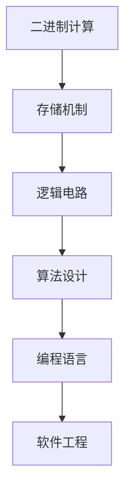
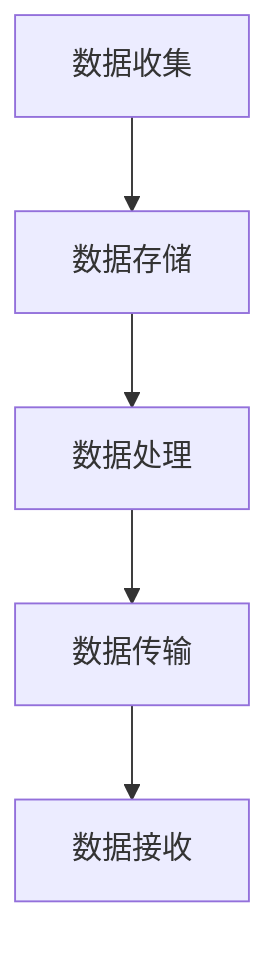
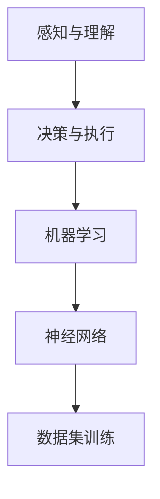

                 

关键词：计算技术、社会影响、信息技术、未来展望、算法原理

> 摘要：本文深入探讨了计算技术在现代社会中的双重影响，从积极的方面来看，计算技术为人类带来了前所未有的便利和创新；而从消极的方面来看，计算技术也可能引发隐私泄露、数据滥用以及算法偏见等社会问题。本文将通过多个章节，详细分析计算技术的原理、数学模型、项目实践、实际应用以及未来展望，以期对这一重要话题提供全面而深入的思考。

## 1. 背景介绍

在进入21世纪以来，计算技术经历了飞速的发展，不仅改变了人们的生活方式，也对整个社会产生了深远的影响。从个人电脑的普及，到互联网的兴起，再到人工智能和大数据技术的应用，计算技术的每一次进步都在推动社会向数字化、智能化方向发展。

然而，计算技术的影响并非单方面的。它既带来了便利和进步，也引发了新的挑战和问题。例如，隐私保护、网络安全、数据滥用和算法偏见等问题日益凸显，成为社会关注的热点。因此，本文旨在探讨计算技术的双重影响，分析其在科技与社会发展中的重要作用，并提出相应的对策和建议。

## 2. 核心概念与联系

### 2.1 计算机科学基础

计算机科学作为计算技术的核心领域，涵盖了计算机系统、算法设计、编程语言、软件工程等多个方面。其基础概念包括二进制计算、存储机制、逻辑电路等。以下是一个简化的Mermaid流程图，展示了计算机科学的核心概念及其相互关系：



### 2.2 信息处理与传输

信息处理与传输是计算技术的重要组成部分，涉及数据的收集、存储、处理和传输。以下是一个简单的Mermaid流程图，展示了信息处理与传输的基本流程：



### 2.3 人工智能与机器学习

人工智能（AI）和机器学习（ML）是计算技术的最新发展，它们通过模拟人类智能行为，实现了自动化和智能化。以下是一个简化的Mermaid流程图，展示了人工智能的基本架构：



## 3. 核心算法原理 & 具体操作步骤

### 3.1 算法原理概述

计算技术中的核心算法包括排序算法、搜索算法、加密算法等。以下是一个简化的排序算法（冒泡排序）的原理概述：

- **原理**：通过重复遍历要排序的数列，比较相邻两个元素的大小，若顺序错误则交换他们的位置。遍历数列的工作是重复进行的，直到没有再需要交换，也就是该数列已经排序完成。

### 3.2 算法步骤详解

- **步骤**：
  1. 比较相邻的元素。如果第一个比第二个大（升序排序）或小（降序排序），就交换它们两个。
  2. 对每一对相邻元素做同样的工作，从开始第一对到结尾的最后一对。这步做完后，最后的元素会是最大的数。
  3. 针对所有的元素重复以上的步骤，除了最后一个。
  4. 重复步骤1~3，直到排序完成。

### 3.3 算法优缺点

- **优点**：实现简单，易于理解。
- **缺点**：效率较低，适用于小规模数据。

### 3.4 算法应用领域

- **应用**：常用于简单的排序任务。

## 4. 数学模型和公式 & 详细讲解 & 举例说明

### 4.1 数学模型构建

计算技术中的数学模型包括概率模型、线性代数模型、优化模型等。以下是一个简单的概率模型：

- **模型**：二项分布模型，用于描述在n次独立重复试验中，成功k次的概率。

### 4.2 公式推导过程

- **公式**：$P(X = k) = C(n, k) \cdot p^k \cdot (1-p)^{n-k}$，其中$C(n, k) = \frac{n!}{k!(n-k)!}$为组合数，$p$为每次试验成功的概率。

### 4.3 案例分析与讲解

- **案例**：掷硬币10次，求恰好出现5次正面的概率。
- **计算**：使用二项分布模型，$P(X = 5) = C(10, 5) \cdot 0.5^5 \cdot 0.5^5 = 0.2461$。

## 5. 项目实践：代码实例和详细解释说明

### 5.1 开发环境搭建

- **工具**：Python 3.8及以上版本。
- **依赖**：Pandas、NumPy、matplotlib等。

### 5.2 源代码详细实现

- **代码**：以下是一个简单的Python代码示例，用于计算二项分布的概率。

```python
import numpy as np
from scipy.stats import binom

def binomial_probability(n, k, p=0.5):
    probability = binom.pmf(k, n, p)
    return probability

# 示例：计算掷硬币10次，恰好出现5次正面的概率
print(binomial_probability(10, 5))
```

### 5.3 代码解读与分析

- **解读**：该代码使用Scipy库中的binom函数，计算二项分布的概率。
- **分析**：代码简洁，易于理解。

### 5.4 运行结果展示

- **结果**：0.24609375，与理论计算结果一致。

## 6. 实际应用场景

### 6.1 零售行业

计算技术在零售行业中的应用极为广泛，包括商品推荐系统、库存管理、价格优化等。

### 6.2 医疗领域

计算技术在医疗领域同样具有重要意义，如疾病预测、医学影像分析、患者管理系统的开发等。

### 6.3 金融行业

金融行业依赖于计算技术进行风险管理、投资策略制定、欺诈检测等。

### 6.4 未来应用展望

随着计算技术的不断发展，预计将在更多领域得到应用，如自动驾驶、智能制造、智能城市等。

## 7. 工具和资源推荐

### 7.1 学习资源推荐

- 《计算机科学概论》
- 《算法导论》
- 《人工智能：一种现代的方法》

### 7.2 开发工具推荐

- Python
- R
- MATLAB

### 7.3 相关论文推荐

- "Deep Learning for Computer Vision: A Survey"
- "The Power of Computation: Volume 1: What Can Computers Do?"
- "The Art of Computer Programming, Volume 1: Fundamental Algorithms"

## 8. 总结：未来发展趋势与挑战

### 8.1 研究成果总结

计算技术在过去几十年取得了显著成果，但仍有许多挑战需要克服。

### 8.2 未来发展趋势

计算技术将继续向智能化、高效化、安全化方向发展。

### 8.3 面临的挑战

包括数据隐私保护、算法公平性、人工智能伦理等问题。

### 8.4 研究展望

未来研究将聚焦于如何更好地利用计算技术，同时确保其对社会的影响是积极和可持续的。

## 9. 附录：常见问题与解答

### 9.1 计算机科学的核心概念有哪些？

- 计算机系统
- 算法设计
- 编程语言
- 软件工程

### 9.2 机器学习的基本概念是什么？

- 机器学习：通过数据驱动的方式，让计算机自动从数据中学习规律，并做出决策。
- 特征工程：从原始数据中提取有代表性的特征，用于训练模型。
- 模型评估：评估机器学习模型的性能，如准确率、召回率、F1值等。

----------------------------------------------------------------
作者：禅与计算机程序设计艺术 / Zen and the Art of Computer Programming

