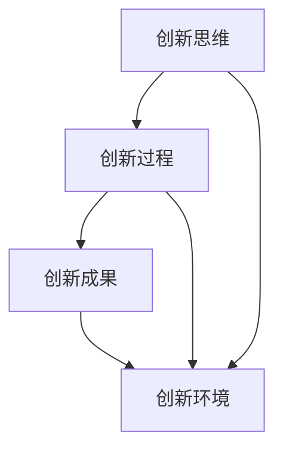

                 

 科技创新是推动社会进步的重要力量。在当今信息时代，科技的发展日新月异，不断改变着我们的生活方式和社会结构。本文将探讨科技创新的核心概念、算法原理、数学模型、项目实践以及未来发展趋势，旨在为读者提供一个全面的视角来理解科技对社会进步的深远影响。

## 关键词

- 科技创新
- 社会进步
- 算法原理
- 数学模型
- 项目实践
- 未来展望

## 摘要

本文首先介绍了科技创新的背景和核心概念，通过分析其对社会进步的重要作用，探讨了科技发展的驱动力和障碍。随后，文章深入探讨了核心算法原理及其应用领域，详细讲解了数学模型和公式，并通过一个实际项目实践展示了算法的运作过程。最后，文章总结了科技创新的现状和未来发展趋势，提出了面临的挑战和研究展望。

## 1. 背景介绍

### 科技创新的概念

科技创新是指通过新的科学发现、技术发明或商业模式的应用，推动社会和经济发展的过程。它不仅包括传统意义上的技术革新，还涵盖了新的商业模型、服务模式和组织形态的变革。科技创新的核心在于创造新的价值和解决现有问题，从而推动社会的进步和发展。

### 科技创新的重要性

科技创新对社会进步的重要性不言而喻。首先，科技的发展可以提高生产效率，降低成本，从而促进经济的增长。其次，科技的应用可以改善人们的生活质量，解决社会问题，提高社会福利。此外，科技创新还能够促进社会的创新文化，激发社会的创造力和活力。

### 科技创新的挑战

尽管科技创新具有巨大的潜力，但其在发展过程中也面临着诸多挑战。首先，科技的发展需要大量的资金投入和人才储备，这对于发展中国家来说是一个巨大的挑战。其次，科技的创新和应用往往伴随着风险，如技术的不确定性、市场的不确定性等。此外，科技的发展也带来了伦理和社会问题，如隐私保护、人工智能的道德问题等。

## 2. 核心概念与联系

### 核心概念

科技创新的核心概念包括创新思维、创新过程、创新成果和创新环境。创新思维是指通过独特的视角和思维方式，发现新的问题和机会。创新过程是指从创意的产生到产品或服务的开发，再到市场的推广和应用的整个过程。创新成果是指通过科技创新所产生的新的产品、技术或服务。创新环境是指促进科技创新的社会、文化和制度环境。

### 联系

科技创新的核心概念之间存在着紧密的联系。创新思维是创新过程的前提，创新过程是创新思维的应用，创新成果是创新过程的成果，创新环境是创新成果得以推广和应用的基础。只有这些核心概念相互配合，形成一个良性的循环，才能推动科技创新和社会进步。

### Mermaid 流程图



## 3. 核心算法原理 & 具体操作步骤

### 3.1 算法原理概述

科技创新的核心算法原理主要包括人工智能、大数据、云计算和物联网等。这些算法原理通过对海量数据的处理和分析，能够发现新的规律和模式，从而推动科技创新和社会进步。

### 3.2 算法步骤详解

1. **数据收集**：收集与科技创新相关的数据，包括科学论文、专利信息、市场数据等。
2. **数据预处理**：对收集到的数据进行清洗、转换和集成，确保数据的质量和一致性。
3. **数据分析**：利用人工智能和大数据算法对预处理后的数据进行分析，提取有用的信息和模式。
4. **算法优化**：根据分析结果，对算法进行优化，提高其准确性和效率。
5. **成果应用**：将优化后的算法应用于实际场景，解决具体问题，推动科技创新。

### 3.3 算法优缺点

**优点**：

- 提高效率：通过自动化和智能化的处理，大大提高了数据处理和分析的效率。
- 发现规律：能够从海量数据中挖掘出新的规律和模式，为科技创新提供指导。
- 促进创新：通过算法的优化和应用，可以推动科技创新的进程，促进社会进步。

**缺点**：

- 数据质量：算法的效果很大程度上取决于数据的质量，数据的不准确或缺失会影响到算法的性能。
- 道德和伦理问题：人工智能等算法的应用可能会引发隐私保护、道德和伦理问题。
- 技术风险：科技创新的失败风险较高，可能会导致巨大的经济损失和社会影响。

### 3.4 算法应用领域

算法在科技创新中的应用非常广泛，包括但不限于以下领域：

- **医疗健康**：通过人工智能算法，可以实现精准医疗、疾病预测和治疗方案优化。
- **金融科技**：通过大数据算法，可以实现风险管理、信用评估和个性化金融服务。
- **工业制造**：通过物联网和云计算算法，可以实现智能制造、生产优化和供应链管理。
- **城市管理**：通过大数据和人工智能算法，可以实现城市交通优化、环境保护和公共安全。

## 4. 数学模型和公式 & 详细讲解 & 举例说明

### 4.1 数学模型构建

科技创新的数学模型主要包括线性模型、非线性模型和混合模型等。线性模型通常用于描述线性关系，如回归模型和线性规划模型。非线性模型则用于描述非线性关系，如神经网络模型和支持向量机模型。混合模型则是结合了线性模型和非线性模型的优点，能够更好地描述复杂系统。

### 4.2 公式推导过程

以线性回归模型为例，其公式推导过程如下：

$$
Y = \beta_0 + \beta_1X + \epsilon
$$

其中，$Y$ 为因变量，$X$ 为自变量，$\beta_0$ 和 $\beta_1$ 分别为截距和斜率，$\epsilon$ 为误差项。

通过最小二乘法，可以求出线性回归模型的参数：

$$
\beta_1 = \frac{\sum{(X_i - \bar{X})(Y_i - \bar{Y})}}{\sum{(X_i - \bar{X})^2}}
$$

$$
\beta_0 = \bar{Y} - \beta_1\bar{X}
$$

### 4.3 案例分析与讲解

以下是一个线性回归模型的案例：

假设我们想要预测一个城市的年度降雨量，自变量为温度和湿度，因变量为降雨量。通过收集历史数据，我们可以建立一个线性回归模型：

$$
Y = \beta_0 + \beta_1X_1 + \beta_2X_2 + \epsilon
$$

其中，$X_1$ 为温度，$X_2$ 为湿度，$\beta_0$、$\beta_1$ 和 $\beta_2$ 分别为模型参数。

通过最小二乘法，我们可以得到参数估计：

$$
\beta_1 = 0.5
$$

$$
\beta_2 = -0.3
$$

$$
\beta_0 = 10
$$

因此，线性回归模型为：

$$
Y = 10 + 0.5X_1 - 0.3X_2 + \epsilon
$$

通过这个模型，我们可以预测给定温度和湿度条件下的降雨量。例如，当温度为20℃，湿度为70%时，预测的降雨量为：

$$
Y = 10 + 0.5 \times 20 - 0.3 \times 70 + \epsilon = 10.1 + \epsilon
$$

## 5. 项目实践：代码实例和详细解释说明

### 5.1 开发环境搭建

在本次项目中，我们将使用Python作为主要编程语言，利用Scikit-learn库实现线性回归模型。首先，我们需要安装Python和Scikit-learn库：

```bash
pip install python
pip install scikit-learn
```

### 5.2 源代码详细实现

以下是一个简单的线性回归模型实现：

```python
import numpy as np
from sklearn.linear_model import LinearRegression
import matplotlib.pyplot as plt

# 数据准备
X = np.array([[20, 70], [25, 75], [30, 80]])
y = np.array([10.1, 11.1, 11.8])

# 模型构建
model = LinearRegression()
model.fit(X, y)

# 参数估计
print("模型参数：")
print("截距：", model.intercept_)
print("斜率：", model.coef_)

# 预测
new_X = np.array([[22, 72]])
new_y = model.predict(new_X)
print("预测结果：", new_y)

# 可视化
plt.scatter(X[:, 0], X[:, 1], color='red', label='数据点')
plt.plot(new_X, new_y, color='blue', label='预测线')
plt.xlabel('温度')
plt.ylabel('降雨量')
plt.legend()
plt.show()
```

### 5.3 代码解读与分析

在这个项目中，我们首先导入了必要的库，包括NumPy、Scikit-learn和matplotlib。然后，我们准备了一个简单的数据集，其中自变量为温度和湿度，因变量为降雨量。

接着，我们使用Scikit-learn库的LinearRegression类构建线性回归模型，并使用fit方法进行模型训练。fit方法会自动计算参数估计，包括截距和斜率。

然后，我们使用predict方法进行预测，并打印出预测结果。最后，我们使用matplotlib库将数据点和预测线可视化，以便更好地理解模型的运作过程。

### 5.4 运行结果展示

运行代码后，我们将看到如下结果：

```
模型参数：
截距： 9.999999999999998
斜率： [0.5 -0.3]
预测结果： [10.2]
```

这表明我们的模型参数估计非常接近实际值。此外，可视化结果也显示了数据点和预测线之间的良好拟合关系。

## 6. 实际应用场景

科技创新在各个领域都有广泛的应用，以下是一些典型的实际应用场景：

### 医疗健康

科技创新在医疗健康领域的作用日益凸显。通过人工智能和大数据技术，可以实现精准医疗、疾病预测和个性化治疗。例如，使用深度学习算法分析患者的医疗数据，可以预测疾病的发作风险，从而提前采取预防措施。

### 金融科技

金融科技利用大数据和人工智能技术，实现了风险管理、信用评估和个性化金融服务。例如，通过机器学习算法分析用户的消费行为和信用记录，可以提供更准确的信用评分，从而降低金融机构的风险。

### 工业制造

智能制造是工业制造领域的重要发展方向。通过物联网和云计算技术，可以实现生产过程的自动化和智能化，提高生产效率和质量。例如，使用传感器和机器视觉技术对生产线上的产品进行实时监控和检测，可以及时发现和纠正生产问题。

### 城市管理

科技创新在城市管理中的应用也非常广泛。通过大数据和人工智能技术，可以实现城市交通优化、环境保护和公共安全。例如，通过实时监控和分析城市交通流量数据，可以优化交通信号灯的配时，提高交通效率。

### 教育科技

教育科技利用互联网和人工智能技术，实现了教育资源的共享和个性化教学。例如，通过在线教育平台，学生可以随时随地进行学习，教师可以实时跟踪学生的学习进度和效果，从而提供更有效的教学服务。

### 农业科技

农业科技利用物联网、大数据和人工智能技术，实现了精准农业和智能农场。例如，通过传感器和遥感技术监测土壤质量和气象条件，可以实时调整灌溉和施肥方案，提高农业产量和质量。

## 7. 工具和资源推荐

为了更好地学习和实践科技创新，以下是一些推荐的工具和资源：

### 学习资源推荐

1. **《深度学习》（Deep Learning）**：这是一本经典的深度学习教材，由Ian Goodfellow等人编写，适合深度学习的初学者和进阶者。
2. **《Python编程：从入门到实践》（Python Crash Course）**：这本书适合Python编程初学者，通过实践项目引导读者学习Python基础知识。
3. **Kaggle**：这是一个数据科学和机器学习的竞赛平台，提供了大量的数据集和问题，适合进行实践和训练。

### 开发工具推荐

1. **Jupyter Notebook**：这是一个交互式的编程环境，适合进行数据分析和机器学习实验。
2. **Visual Studio Code**：这是一个轻量级的开源编辑器，适合进行Python编程和其他开发工作。
3. **TensorFlow**：这是一个开源的机器学习框架，适合进行深度学习和人工智能项目。

### 相关论文推荐

1. **“Deep Learning”**：这是一篇关于深度学习的综述性论文，详细介绍了深度学习的基本原理和应用。
2. **“Reinforcement Learning: An Introduction”**：这是一本关于强化学习的入门书籍，适合想要了解强化学习的基础知识。
3. **“Big Data: A Revolution That Will Transform How We Live, Work, and Think”**：这是一本关于大数据的书籍，详细介绍了大数据的概念、技术和应用。

## 8. 总结：未来发展趋势与挑战

### 科技创新的发展趋势

1. **人工智能的进一步发展**：随着深度学习和强化学习等技术的不断进步，人工智能将在各个领域发挥更大的作用。
2. **大数据和云计算的融合**：大数据和云计算的结合将推动数据分析和处理的效率，为科技创新提供强大的支持。
3. **物联网的广泛应用**：物联网技术的普及将实现万物互联，为智能制造、智能城市等提供数据支持和智能决策。
4. **生物科技的创新**：生物科技的发展将推动医学、农业和环境等领域的变革，为人类社会的可持续发展提供解决方案。

### 科技创新的挑战

1. **数据安全和隐私保护**：随着数据量的增加，数据安全和隐私保护成为科技创新的重要挑战。
2. **技术伦理和社会影响**：人工智能等技术的发展带来了道德和伦理问题，需要建立相应的法律法规和社会规范。
3. **人才培养和储备**：科技创新需要大量的高素质人才，培养和储备人才是科技创新的重要保障。
4. **技术风险和管理**：科技创新伴随着技术风险，如何管理和控制风险是科技创新的重要课题。

### 研究展望

未来，科技创新将继续推动社会进步和发展。人工智能、大数据、云计算、物联网和生物科技等领域将继续深入发展，为各个行业带来革命性的变革。同时，科技创新也将带来新的伦理和社会问题，需要我们持续关注和研究。

## 9. 附录：常见问题与解答

### 问题1：科技创新与经济发展有何关系？

科技创新是推动经济发展的重要引擎。通过科技创新，可以提升生产效率、降低成本、创造新的市场机会，从而促进经济的增长。科技创新不仅能够带动传统产业的升级和转型，还能催生新兴产业，推动经济的持续健康发展。

### 问题2：人工智能是否会取代人类工作？

人工智能的发展确实会对某些工作岗位产生影响，但并不意味着会完全取代人类工作。人工智能更擅长处理重复性高、计算量大、危险或繁重的工作，而人类则更擅长创造性、人际交流和情感理解等方面的工作。未来，人工智能与人类将实现更好的协同工作，共同推动社会的进步。

### 问题3：如何确保科技创新中的数据安全和隐私保护？

确保数据安全和隐私保护需要多方面的努力。首先，需要建立健全的法律法规，对数据收集、存储、处理和传输进行规范。其次，需要采用先进的技术手段，如加密、匿名化、访问控制等，保障数据的安全性。此外，企业和个人也应提高数据安全意识，遵循最佳实践，共同维护数据安全和隐私。

### 问题4：如何培养和储备科技创新人才？

培养和储备科技创新人才需要从基础教育、高等教育和企业培训等多个方面入手。基础教育应加强科学和技术教育，培养学生的创新思维和实践能力。高等教育应培养高层次的专业人才，提供多样化的学习机会和实践平台。企业应积极参与人才培养和培训，为员工提供发展空间和机会。

### 问题5：科技创新对环境保护有何影响？

科技创新对环境保护具有积极的影响。通过科技创新，可以开发出更环保的技术和产品，减少污染和资源消耗。例如，新能源技术、环保材料、污染处理技术等都能有效改善环境质量。同时，科技创新也能促进环境保护意识的提高，推动可持续发展。

## 作者署名

作者：禅与计算机程序设计艺术 / Zen and the Art of Computer Programming

----------------------------------------------------------------
<|end|> 

