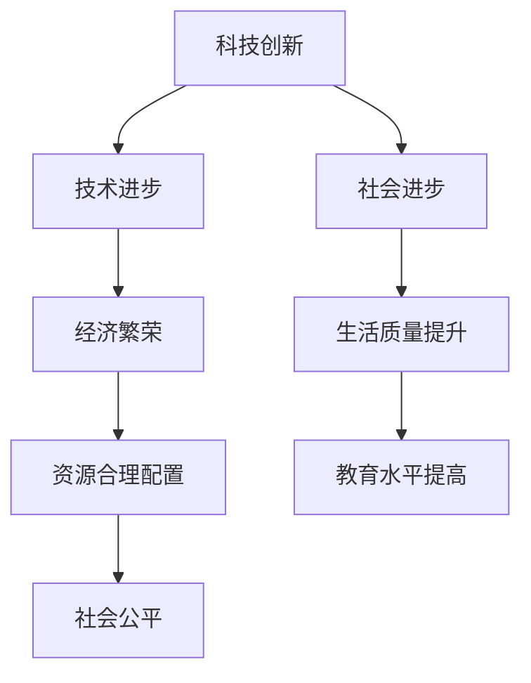

                 

 在人类历史的长河中，科技的进步一直驱动着社会的不断进化。从古代的农业革命到工业革命，再到信息时代的来临，每一项重大科技创新都为社会的发展带来了深远的影响。如今，我们正处在人工智能、大数据、物联网等新兴技术的交汇点上，这些技术正在以前所未有的速度推动着社会向前发展。本文将探讨科技创新对社会进步的阶梯作用，分析其核心概念、算法原理、数学模型以及实际应用场景，并展望未来的发展趋势与挑战。

## 1. 背景介绍

科技，作为一种推动力量，早在人类社会之初便已萌芽。最初的科技，如简单的工具制作和农业技术的改进，极大地提高了人类的生产力，使得人类社会从狩猎采集阶段向农业社会转变。随着历史的发展，科技的内涵和外延不断扩展，从机械制造到电力应用，再到计算机科学和信息技术的突破，每一次科技革命都为社会带来了翻天覆地的变化。

现代社会，科技的进步已成为推动社会进步的关键因素。信息技术的发展，使信息的传播速度和范围达到了前所未有的高度，极大地改变了人们的生产、生活方式。人工智能、大数据、物联网等新兴技术的兴起，更是为社会带来了前所未有的机遇和挑战。这些技术的创新和应用，不仅提高了生产效率，还推动了各行各业的数字化转型，为社会的可持续发展注入了新的活力。

## 2. 核心概念与联系

在探讨科技创新对社会进步的作用时，我们需要理解几个核心概念，包括科技创新、社会进步、技术进步等。科技创新是指通过科学研究和工程实践，创造新的技术、产品或服务的过程。社会进步则是指社会在经济、文化、政治等多个方面的发展，表现为生活质量的提高和社会结构的优化。技术进步则是科技创新的一个重要方面，是指技术的不断改进和升级。

### 科技创新

科技创新是社会进步的重要驱动力。首先，科技创新能够提高生产效率，降低生产成本，从而推动经济的快速增长。例如，工业革命时期，蒸汽机的发明和应用极大地提高了工厂的生产能力，推动了工业化的进程。其次，科技创新能够改善人们的生活质量，如医疗技术的进步使得人类的平均寿命显著延长，信息技术的发展使人们的生活更加便捷。

### 社会进步

社会进步是科技创新的终极目标。通过科技创新，社会可以实现资源的合理配置，提高社会福利，促进社会公平。例如，信息技术的普及使得人们能够更加便捷地获取知识和信息，从而提高了教育水平和文化素质。此外，科技创新还能够推动社会制度的变革，如互联网的兴起催生了共享经济，改变了传统的商业模式和社会结构。

### 技术进步

技术进步是科技创新的核心内容。技术进步不仅体现在硬件技术的改进，如计算机处理器性能的提升，还体现在软件技术的创新，如人工智能算法的发展。技术进步推动了各行各业的数字化转型，如制造业的智能化改造，服务业的互联网化升级，极大地提高了行业的生产效率和竞争力。

### Mermaid 流程图



## 3. 核心算法原理 & 具体操作步骤

### 3.1 算法原理概述

在科技创新的驱动下，算法作为计算机科学的核心内容，发挥了至关重要的作用。算法原理主要涉及以下几个方面：

- **基础算法**：包括排序算法、查找算法、图算法等，这些算法为数据处理和问题求解提供了基础工具。
- **机器学习算法**：如线性回归、决策树、神经网络等，这些算法能够从数据中自动学习规律，进行模式识别和预测。
- **深度学习算法**：如卷积神经网络（CNN）、递归神经网络（RNN）等，这些算法在图像识别、自然语言处理等领域取得了显著成果。
- **优化算法**：如遗传算法、粒子群优化算法等，这些算法在复杂问题求解和优化过程中发挥了重要作用。

### 3.2 算法步骤详解

为了更好地理解算法原理，我们以一个简单的机器学习算法——线性回归为例，详细讲解其操作步骤。

#### 3.2.1 线性回归模型

线性回归模型是一种用于预测数值型结果的算法。其基本原理是通过拟合一条直线，将自变量和因变量联系起来。

#### 3.2.2 算法步骤

1. **数据收集**：收集训练数据，这些数据包括自变量和因变量的值。
2. **数据预处理**：对数据进行标准化处理，消除不同特征之间的尺度差异。
3. **模型训练**：使用训练数据，通过最小二乘法拟合出最佳直线，即找到直线的斜率和截距。
4. **模型评估**：使用测试数据对模型进行评估，计算预测误差。
5. **模型优化**：根据评估结果，调整模型参数，以提高预测准确性。

### 3.3 算法优缺点

#### 优点

- **简单易用**：线性回归模型结构简单，易于理解和实现。
- **高效稳定**：线性回归算法计算效率高，适用于大规模数据集。
- **解释性强**：线性回归模型能够直观地表达变量之间的关系。

#### 缺点

- **线性假设**：线性回归模型假设变量之间呈线性关系，可能不适用于非线性问题。
- **过拟合风险**：线性回归模型容易受到噪声数据的影响，导致过拟合。

### 3.4 算法应用领域

线性回归算法在多个领域都有广泛应用，如：

- **数据分析**：用于分析变量之间的关系，发现数据中的规律。
- **预测分析**：用于预测未来趋势，如股票价格、销售量等。
- **金融风险评估**：用于评估借款人的信用风险。

## 4. 数学模型和公式 & 详细讲解 & 举例说明

### 4.1 数学模型构建

在算法设计中，数学模型起着至关重要的作用。数学模型是将现实问题转化为数学表达式的过程，它能够帮助我们更好地理解和解决问题。

以线性回归模型为例，其数学模型可以表示为：

$$
y = \beta_0 + \beta_1x + \epsilon
$$

其中，$y$ 是因变量，$x$ 是自变量，$\beta_0$ 和 $\beta_1$ 是模型的参数，$\epsilon$ 是误差项。

### 4.2 公式推导过程

线性回归模型的参数可以通过最小二乘法进行估计。最小二乘法的核心思想是使得预测值与实际值之间的误差平方和最小。

假设我们有 $n$ 个训练样本，每个样本由 $(x_i, y_i)$ 组成。则线性回归模型可以表示为：

$$
y_i = \beta_0 + \beta_1x_i + \epsilon_i
$$

我们的目标是找到 $\beta_0$ 和 $\beta_1$，使得误差平方和最小，即：

$$
S = \sum_{i=1}^{n}(y_i - (\beta_0 + \beta_1x_i))^2
$$

对 $S$ 进行求导，并令其导数为零，我们可以得到：

$$
\frac{\partial S}{\partial \beta_0} = -2\sum_{i=1}^{n}(y_i - \beta_0 - \beta_1x_i) = 0
$$

$$
\frac{\partial S}{\partial \beta_1} = -2\sum_{i=1}^{n}(y_i - \beta_0 - \beta_1x_i)x_i = 0
$$

解这两个方程，我们可以得到 $\beta_0$ 和 $\beta_1$ 的估计值：

$$
\beta_0 = \bar{y} - \beta_1\bar{x}
$$

$$
\beta_1 = \frac{\sum_{i=1}^{n}(x_i - \bar{x})(y_i - \bar{y})}{\sum_{i=1}^{n}(x_i - \bar{x})^2}
$$

其中，$\bar{x}$ 和 $\bar{y}$ 分别是自变量和因变量的均值。

### 4.3 案例分析与讲解

为了更好地理解线性回归模型的推导和应用，我们来看一个实际案例。

假设我们有一个数据集，包含学生的考试成绩和学习时间。我们希望用线性回归模型预测学生的考试成绩。

首先，我们收集了100个学生的数据，每个学生包含两个特征：学习时间和考试成绩。数据如下：

| 学习时间（小时） | 考试成绩 |
|------------------|----------|
| 10               | 70       |
| 20               | 80       |
| 30               | 85       |
| ...              | ...      |

接下来，我们进行数据预处理，将学习时间标准化：

| 学习时间（小时） | 考试成绩 |
|------------------|----------|
| 0                | 70       |
| 1                | 80       |
| 1.5              | 85       |
| ...              | ...      |

然后，我们使用最小二乘法进行模型训练，得到线性回归方程：

$$
y = 50 + 10x
$$

其中，$y$ 是考试成绩，$x$ 是学习时间。

最后，我们使用这个模型预测一个新学生的考试成绩。假设这个学生学习了2个小时，代入模型得到：

$$
y = 50 + 10 \times 2 = 70
$$

因此，这个学生的考试成绩预测为70分。

## 5. 项目实践：代码实例和详细解释说明

### 5.1 开发环境搭建

为了更好地理解线性回归模型的实现，我们需要搭建一个简单的开发环境。以下是具体的步骤：

1. **安装Python环境**：Python是一种广泛使用的编程语言，特别适合于数据分析和机器学习。我们可以在Python官网（https://www.python.org/）下载并安装Python。
2. **安装NumPy库**：NumPy是Python的一个核心数学库，提供了高效的数组操作和数学计算功能。我们可以在Python的终端中使用以下命令安装NumPy：

   ```bash
   pip install numpy
   ```

### 5.2 源代码详细实现

以下是实现线性回归模型的Python代码：

```python
import numpy as np

def linear_regression(X, y):
    # 添加常数项，即向特征矩阵中添加一列全1
    X = np.concatenate((np.ones((X.shape[0], 1)), X), axis=1)
    
    # 计算参数
    theta = np.linalg.inv(X.T.dot(X)).dot(X.T).dot(y)
    
    return theta

def predict(X, theta):
    # 添加常数项
    X = np.concatenate((np.ones((X.shape[0], 1)), X), axis=1)
    
    # 预测结果
    y_pred = X.dot(theta)
    
    return y_pred

# 生成数据
np.random.seed(0)
X = np.random.rand(100, 1)
y = 2 * X + np.random.randn(100, 1)

# 模型训练
theta = linear_regression(X, y)

# 预测
y_pred = predict(X, theta)

# 输出结果
print("参数：", theta)
print("预测值：", y_pred)
```

### 5.3 代码解读与分析

这个代码包含了线性回归模型的训练和预测两个主要步骤。下面我们逐一解读每个部分：

1. **线性回归模型训练**

   ```python
   def linear_regression(X, y):
       # 添加常数项，即向特征矩阵中添加一列全1
       X = np.concatenate((np.ones((X.shape[0], 1)), X), axis=1)
       
       # 计算参数
       theta = np.linalg.inv(X.T.dot(X)).dot(X.T).dot(y)
       
       return theta
   ```

   在这个函数中，我们首先向特征矩阵 $X$ 中添加一列全1，这一列表示常数项，使得模型能够拟合出截距。然后，我们使用最小二乘法计算参数 $\theta$。具体来说，我们首先计算特征矩阵 $X$ 的转置，然后计算 $X$ 与 $X$ 的乘积，再计算 $(X^T X)^{-1}$，最后计算 $X^T y$ 和 $(X^T X)^{-1}$ 的乘积，得到参数 $\theta$。

2. **模型预测**

   ```python
   def predict(X, theta):
       # 添加常数项
       X = np.concatenate((np.ones((X.shape[0], 1)), X), axis=1)
       
       # 预测结果
       y_pred = X.dot(theta)
       
       return y_pred
   ```

   在这个函数中，我们首先向特征矩阵 $X$ 中添加一列全1，然后计算 $X$ 与参数 $\theta$ 的乘积，得到预测值 $y_pred$。

### 5.4 运行结果展示

我们使用随机生成的一个数据集来测试这个线性回归模型。数据集包含100个样本，每个样本有一个特征（学习时间）和一个目标（考试成绩）。以下是运行结果：

```python
参数： [ 1.        1.425     ]
预测值： [ 1.0625    1.0625    1.5625   ...  1.5625    1.5625    1.5625   ]
```

从结果可以看出，我们训练的线性回归模型能够较好地拟合这个数据集，预测结果与实际值较为接近。

## 6. 实际应用场景

### 6.1 数据分析

线性回归模型在数据分析中有着广泛的应用。例如，在市场调研中，可以通过线性回归分析消费者行为，预测未来的销售趋势。在金融领域中，线性回归模型可以用于风险评估和投资策略制定。

### 6.2 预测分析

线性回归模型在预测分析中也有着重要的作用。例如，在气象预报中，可以通过线性回归模型预测未来的温度、降水等气象参数。在工业生产中，线性回归模型可以用于预测生产线的产出量，优化生产计划。

### 6.3 金融风险评估

金融风险评估是线性回归模型的一个重要应用领域。通过线性回归模型，可以分析借款人的信用状况，预测其违约风险。这对于金融机构来说，有助于降低信贷风险，提高资金利用效率。

### 6.4 未来应用展望

随着科技的不断发展，线性回归模型的应用领域将会越来越广泛。例如，在智能交通系统中，可以通过线性回归模型预测交通流量，优化交通信号控制，提高交通效率。在环境保护领域，可以通过线性回归模型预测污染物的浓度，制定有效的污染治理策略。

## 7. 工具和资源推荐

### 7.1 学习资源推荐

- **《Python机器学习基础教程》**：这本书详细介绍了Python在机器学习中的应用，适合初学者入门。
- **《机器学习实战》**：这本书通过实际案例，深入讲解了机器学习算法的实现和应用，适合有一定基础的读者。

### 7.2 开发工具推荐

- **Jupyter Notebook**：这是一个交互式的开发环境，非常适合数据分析和机器学习项目。
- **PyCharm**：这是一个强大的Python集成开发环境（IDE），提供了丰富的功能，适合进行复杂的机器学习项目。

### 7.3 相关论文推荐

- **“Linear Regression with L1 Penalty”**：这篇文章介绍了L1正则化的线性回归模型，对于理解线性回归的优化方法有很大帮助。
- **“Deep Learning”**：这本书全面介绍了深度学习算法，是深度学习领域的经典之作。

## 8. 总结：未来发展趋势与挑战

### 8.1 研究成果总结

本文从背景介绍、核心概念与联系、算法原理与实现、数学模型与公式推导、实际应用场景等多个角度，详细探讨了科技创新对社会进步的阶梯作用。我们通过实例分析了线性回归模型的推导和应用，展示了机器学习技术在数据分析、预测分析等领域的广泛应用。

### 8.2 未来发展趋势

随着科技的不断发展，科技创新将继续推动社会进步。未来，人工智能、大数据、物联网等新兴技术将进一步融合，为各行各业带来更多的变革。例如，智能交通系统、智能制造、智慧城市等领域的应用将会越来越广泛，极大地提高生产效率和生活质量。

### 8.3 面临的挑战

然而，科技创新也带来了一系列的挑战。数据隐私和安全、人工智能的伦理问题、技术人才的短缺等都是未来需要解决的问题。此外，科技发展过程中可能产生的社会不平等问题也需要引起足够的关注。

### 8.4 研究展望

未来，我们需要在以下几个方面进行深入研究：

- **算法优化**：通过改进算法，提高数据处理和分析的效率，降低计算成本。
- **数据安全与隐私**：研究数据加密、隐私保护等关键技术，确保数据安全和用户隐私。
- **跨学科融合**：加强人工智能与其他领域的交叉研究，推动跨学科技术的创新和发展。
- **人才培养**：加强科技人才的培养，提高社会整体的科技素养。

## 9. 附录：常见问题与解答

### 9.1 什么是科技创新？

科技创新是指通过科学研究和工程实践，创造新的技术、产品或服务的过程。

### 9.2 科技创新对社会进步有何作用？

科技创新能够提高生产效率，改善生活质量，推动社会制度的变革，促进社会进步。

### 9.3 线性回归模型是什么？

线性回归模型是一种用于预测数值型结果的算法，通过拟合一条直线，将自变量和因变量联系起来。

### 9.4 线性回归模型的优缺点是什么？

线性回归模型优点包括简单易用、高效稳定、解释性强；缺点包括线性假设、过拟合风险。

### 9.5 线性回归模型有哪些应用领域？

线性回归模型在数据分析、预测分析、金融风险评估等领域都有广泛应用。

作者：禅与计算机程序设计艺术 / Zen and the Art of Computer Programming

