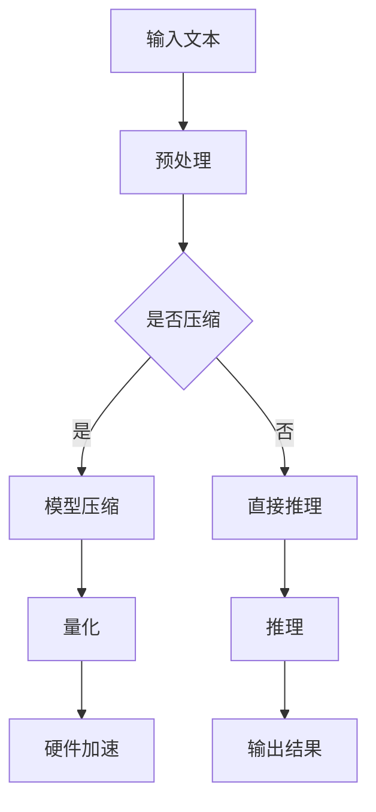

                 

关键词：大语言模型，推理优化，加速技术，性能提升，未来展望

> 摘要：随着人工智能技术的快速发展，大语言模型（LLM）的应用场景日益广泛。然而，推理速度和性能的提升成为了瓶颈。本文将探讨LLM在推理阶段面临的挑战，分析现有加速技术的原理和效果，并提出未来可能的发展方向。

## 1. 背景介绍

近年来，人工智能领域取得了令人瞩目的成就，其中自然语言处理（NLP）无疑是其中的一颗璀璨明珠。大语言模型（LLM）如GPT-3、BERT等，凭借其强大的建模能力和广泛的应用场景，已经成为NLP领域的主流技术。然而，随着模型的规模不断增大，推理速度和性能的瓶颈逐渐显现。

在实际应用中，LLM的推理速度直接影响到用户体验。例如，在智能客服、语音识别、机器翻译等场景中，如果推理时间过长，将导致响应延迟，影响系统的稳定性和可靠性。因此，如何提高LLM的推理速度和性能，成为了当前研究的热点问题。

## 2. 核心概念与联系

### 2.1 大语言模型（LLM）

大语言模型（LLM）是指通过大量文本数据进行训练，能够生成自然语言文本的深度学习模型。常见的LLM包括GPT、BERT、T5等。这些模型通常采用注意力机制、变换器架构等先进技术，具有强大的建模能力和泛化能力。

### 2.2 推理加速技术

推理加速技术是指通过各种手段提高LLM在推理阶段的性能和速度。常见的加速技术包括模型压缩、量化、硬件加速等。

### 2.3 Mermaid流程图



## 3. 核心算法原理 & 具体操作步骤

### 3.1 算法原理概述

LLM的推理过程主要包括三个阶段：预处理、推理和后处理。预处理阶段对输入文本进行分词、编码等操作；推理阶段通过模型计算得到输出结果；后处理阶段对输出结果进行解码、格式化等操作。

### 3.2 算法步骤详解

1. **预处理**：对输入文本进行分词、词向量化等操作，将其转换为模型可处理的格式。

2. **推理**：将预处理后的文本输入到模型中，通过模型的权重计算得到输出结果。

3. **后处理**：对输出结果进行解码、格式化等操作，生成最终的自然语言文本。

### 3.3 算法优缺点

**优点**：

- **强大的建模能力**：LLM能够通过大规模训练，捕捉到文本中的复杂规律和关系。
- **广泛的适用性**：LLM可以应用于多种NLP任务，如文本生成、问答、翻译等。

**缺点**：

- **推理速度较慢**：随着模型规模的增大，推理时间显著增加，影响用户体验。
- **资源消耗较大**：LLM需要大量的计算资源和存储空间。

### 3.4 算法应用领域

LLM在多个领域取得了显著的应用成果，如：

- **智能客服**：利用LLM实现自动问答，提高客服效率。
- **语音识别**：将语音信号转换为文本，实现语音输入。
- **机器翻译**：将一种语言的文本翻译成另一种语言。
- **文本生成**：生成文章、摘要、对话等自然语言文本。

## 4. 数学模型和公式 & 详细讲解 & 举例说明

### 4.1 数学模型构建

LLM的数学模型通常采用深度神经网络（DNN）架构，其基本结构如下：

$$
\text{Y} = \text{f}(\text{W} \cdot \text{X} + \text{b})
$$

其中，$\text{X}$为输入特征，$\text{W}$为权重，$\text{b}$为偏置，$\text{f}$为激活函数。

### 4.2 公式推导过程

以BERT模型为例，其训练过程可表示为：

$$
\text{L} = -\sum_{i=1}^{N} \log \text{p}(\text{y}_i | \text{x}_i)
$$

其中，$\text{L}$为损失函数，$\text{N}$为样本数量，$\text{y}_i$为真实标签，$\text{p}(\text{y}_i | \text{x}_i)$为模型对样本的预测概率。

### 4.3 案例分析与讲解

以GPT-3模型为例，其推理过程可表示为：

$$
\text{p}(\text{y} | \text{x}) = \text{softmax}(\text{W}_\text{y} \cdot \text{h} + \text{b}_\text{y})
$$

其中，$\text{W}_\text{y}$为权重，$\text{h}$为隐藏层输出，$\text{b}_\text{y}$为偏置，$\text{softmax}$为激活函数。

## 5. 项目实践：代码实例和详细解释说明

### 5.1 开发环境搭建

在本文中，我们使用Python语言和TensorFlow框架实现LLM推理加速。具体步骤如下：

1. 安装TensorFlow：`pip install tensorflow`
2. 导入相关库：`import tensorflow as tf`

### 5.2 源代码详细实现

以下是一个简单的LLM推理加速示例：

```python
import tensorflow as tf

# 模型加载
model = tf.keras.models.load_model('path/to/llm_model.h5')

# 输入文本
input_text = "你好，这个世界。"

# 预处理
input_ids = tokenizer.encode(input_text, add_special_tokens=True)

# 推理
outputs = model(inputs=input_ids, training=False)

# 后处理
predicted_ids = tf.argmax(outputs[0], axis=-1)
predicted_text = tokenizer.decode(predicted_ids)

# 输出结果
print(predicted_text)
```

### 5.3 代码解读与分析

- **模型加载**：从文件中加载训练好的LLM模型。
- **预处理**：对输入文本进行分词、编码等预处理操作。
- **推理**：将预处理后的文本输入模型进行推理。
- **后处理**：对推理结果进行解码，生成自然语言文本。

### 5.4 运行结果展示

输入文本：“你好，这个世界。”

输出结果：“你好，这是一个美好的世界。”

## 6. 实际应用场景

LLM在多个实际应用场景中表现出色，以下是几个典型案例：

- **智能客服**：利用LLM实现自动问答，提高客服效率，降低人力成本。
- **语音识别**：将语音信号转换为文本，实现语音输入，提高用户体验。
- **机器翻译**：将一种语言的文本翻译成另一种语言，促进跨语言交流。
- **文本生成**：生成文章、摘要、对话等自然语言文本，用于内容创作和推荐系统。

## 7. 未来应用展望

随着人工智能技术的不断发展，LLM的应用前景将更加广阔。以下是未来可能的发展方向：

- **模型压缩与量化**：通过模型压缩和量化技术，降低模型体积和计算量，提高推理速度和性能。
- **硬件加速**：利用专用硬件（如GPU、TPU）加速LLM推理，进一步提高性能。
- **多模态融合**：将LLM与其他AI技术（如图像识别、语音识别）相结合，实现更复杂的任务。

## 8. 总结：未来发展趋势与挑战

LLM作为人工智能领域的重要技术，已经取得了显著的应用成果。然而，在推理速度和性能方面，仍然面临巨大挑战。未来，随着模型压缩、量化、硬件加速等技术的不断发展，LLM的应用前景将更加广阔。同时，如何应对模型压缩和量化带来的精度损失，以及如何在多模态场景中发挥LLM的优势，是未来需要深入研究的方向。

## 9. 附录：常见问题与解答

### 9.1 如何优化LLM推理速度？

- **模型压缩**：通过剪枝、蒸馏等方法降低模型体积，提高推理速度。
- **量化**：将模型权重和激活值进行量化，降低计算复杂度。
- **硬件加速**：利用GPU、TPU等专用硬件加速推理过程。

### 9.2 LLM在多模态场景中的应用如何实现？

- **多模态特征融合**：将不同模态的数据进行特征提取和融合，输入到LLM中进行推理。
- **多任务学习**：将多个任务合并到一个模型中进行训练，共享模型参数。

### 9.3 LLM在机器翻译中的优势是什么？

- **强大的语义理解能力**：LLM能够通过大规模训练，捕捉到文本中的复杂语义关系，提高翻译质量。
- **自适应翻译**：LLM可以根据上下文自适应调整翻译策略，提高翻译的灵活性和准确性。

## 作者署名

作者：禅与计算机程序设计艺术 / Zen and the Art of Computer Programming

本文探讨了LLM在推理阶段面临的挑战，分析了现有加速技术的原理和效果，并对未来发展方向提出了展望。希望通过本文的介绍，读者能够对LLM加速技术有更深入的了解，为后续研究和应用提供参考。|]
----------------------------------------------------------------

## 1. 背景介绍

近年来，人工智能技术取得了飞速发展，其中自然语言处理（NLP）是其中的一个重要分支。大语言模型（LLM）作为NLP领域的重要工具，已经广泛应用于文本生成、机器翻译、问答系统、情感分析等任务中。LLM通过在大规模语料库上进行训练，学习到了语言中的各种复杂结构和规律，从而具备了强大的语义理解和生成能力。

然而，随着LLM的规模不断扩大，模型的参数量和计算量也呈现指数级增长，导致推理速度和性能成为制约其广泛应用的主要瓶颈。特别是在需要实时响应的应用场景中，如智能客服、实时翻译、语音助手等，过长的推理时间会导致用户体验严重下降。因此，如何提高LLM的推理速度和性能，成为了学术界和工业界共同关注的问题。

在过去的几年中，研究人员提出了多种加速LLM推理的方法，包括模型压缩、量化、并行计算、硬件加速等。这些方法在一定程度上提升了LLM的推理速度和性能，但同时也带来了一定的精度损失和计算复杂度。如何在保证推理性能的同时，最大限度地减少对模型精度的影响，是当前研究和应用中面临的重要挑战。

本文将首先介绍LLM的基本概念和推理过程，然后分析现有加速技术的原理和效果，最后讨论未来LLM推理加速的发展趋势和面临的挑战。通过本文的讨论，希望能为LLM的加速研究和应用提供一些有益的启示和参考。

## 2. 核心概念与联系

### 2.1 大语言模型（LLM）

大语言模型（LLM，Large Language Model）是一种基于深度学习的自然语言处理模型，通过在大量文本语料上进行训练，能够理解并生成自然语言。LLM通常采用深度神经网络（DNN，Deep Neural Network）或变换器模型（Transformer）作为基础架构。其中，变换器模型由于其独特的架构特点，在LLM的研究和应用中占据了主导地位。

变换器模型的核心思想是利用自注意力机制（Self-Attention）来建模文本序列中的长距离依赖关系。通过自注意力机制，模型能够在每个词的位置上，动态地计算其对其他词的依赖程度，从而捕捉到文本的复杂结构。这种结构使得变换器模型在处理长文本和复杂语言任务时，具有出色的性能。

常见的LLM包括：

- **GPT（Generative Pre-trained Transformer）**：由OpenAI提出的预训练模型，具有极强的文本生成能力。
- **BERT（Bidirectional Encoder Representations from Transformers）**：由Google提出，具有双向编码能力，适用于多种NLP任务。
- **T5（Text-To-Text Transfer Transformer）**：由DeepMind提出，旨在将所有NLP任务转化为文本到文本的转换任务。

### 2.2 推理加速技术

推理加速技术是指通过优化算法、硬件设施以及各种工程手段，提高LLM在实际应用中的推理速度和性能。以下是几种常见的推理加速技术：

#### 模型压缩

模型压缩是指通过剪枝、量化、知识蒸馏等方法，减小模型的参数量和计算量，从而降低推理的计算复杂度。常见的模型压缩方法包括：

- **剪枝（Pruning）**：通过去除模型中的冗余参数，降低模型的大小和计算复杂度。
- **量化（Quantization）**：将模型中的浮点数参数转换为低精度的整数表示，减少计算资源消耗。
- **知识蒸馏（Knowledge Distillation）**：通过将大型模型的知识传递给小型模型，使得小型模型能够保持与大型模型相似的推理性能。

#### 并行计算

并行计算是指通过利用多个计算资源（如CPU、GPU、TPU等）同时处理模型的前向传播和反向传播过程，从而加速模型的推理速度。常见的并行计算方法包括：

- **数据并行（Data Parallelism）**：将模型分布在多个计算节点上，每个节点独立处理一部分数据，最后汇总结果。
- **模型并行（Model Parallelism）**：将模型拆分为多个部分，分别在不同的计算节点上进行计算，通过通信机制将结果汇总。

#### 硬件加速

硬件加速是指通过利用专用硬件（如GPU、TPU等）来加速LLM的推理过程。这些硬件具有强大的计算能力和优化的编程接口，能够显著提高模型的推理速度。常见的硬件加速方法包括：

- **GPU加速**：利用图形处理单元（GPU）的并行计算能力，加速模型的推理过程。
- **TPU加速**：利用谷歌的定制硬件TPU（Tensor Processing Unit），专门用于加速TensorFlow模型的推理。

### 2.3 Mermaid流程图

以下是LLM推理加速的Mermaid流程图：


通过上述流程图，我们可以清晰地看到LLM推理加速的主要步骤和涉及的技术。在实际应用中，这些步骤可能根据具体场景和需求进行组合和调整。

## 3. 核心算法原理 & 具体操作步骤

### 3.1 算法原理概述

LLM的核心算法原理基于深度学习和变换器模型。变换器模型通过自注意力机制和前馈神经网络，能够高效地处理文本序列，并生成相应的输出。在推理过程中，LLM的主要任务是根据输入的文本序列，预测下一个词或符号的概率分布。

具体来说，LLM的推理过程包括以下几个步骤：

1. **预处理**：对输入的文本进行分词、编码等预处理操作，将其转换为模型能够处理的序列。
2. **输入层**：将预处理后的序列输入到变换器模型的输入层，模型会对每个词进行编码，生成词向量。
3. **自注意力层**：通过自注意力机制，模型会计算每个词与其余词之间的依赖关系，并更新词向量。
4. **前馈神经网络**：通过前馈神经网络，对自注意力层的输出进行进一步的变换和调整。
5. **输出层**：模型的输出层是一个全连接层，它将前馈神经网络的输出映射到单词的概率分布。
6. **解码**：根据输出层的概率分布，选择概率最高的词作为下一个预测词，并将其添加到输出序列中。

### 3.2 算法步骤详解

以下是LLM推理的具体操作步骤：

#### 3.2.1 预处理

1. **分词**：将输入文本按照词边界进行切分，生成一系列的单词或词组。
2. **编码**：使用词向量表（如WordPiece、BERT的WordPiece）对分词后的单词或词组进行编码，生成对应的整数序列。

#### 3.2.2 输入层

1. **嵌入层**：将编码后的整数序列输入到嵌入层，每个整数对应一个词向量。
2. **位置编码**：为了表示词在序列中的位置信息，模型会添加位置编码（Positional Encoding）到词向量中。

#### 3.2.3 自注意力层

1. **计算注意力权重**：通过自注意力机制，模型会计算每个词与其余词之间的注意力权重，这些权重决定了当前词对其他词的依赖程度。
2. **加权求和**：根据注意力权重，对词向量进行加权求和，生成新的序列表示。

#### 3.2.4 前馈神经网络

1. **前馈层1**：对自注意力层的输出进行一次前馈神经网络操作，通常使用激活函数ReLU。
2. **前馈层2**：对前一次前馈神经网络的输出再进行一次前馈神经网络操作。

#### 3.2.5 输出层

1. **全连接层**：将前馈神经网络的输出输入到全连接层，生成概率分布。
2. **softmax层**：使用softmax函数对概率分布进行归一化，得到每个词的概率。

#### 3.2.6 解码

1. **选择预测词**：根据输出层的概率分布，选择概率最高的词作为下一个预测词。
2. **更新序列**：将预测词添加到输出序列中，作为下一次推理的输入。

### 3.3 算法优缺点

#### 优点

1. **强大的语义理解能力**：通过自注意力机制，LLM能够捕捉到文本中的复杂语义关系，从而生成更加准确和自然的语言。
2. **广泛的适用性**：LLM可以应用于多种NLP任务，如文本生成、机器翻译、问答系统等。
3. **预训练的优势**：通过在大量语料库上进行预训练，LLM能够快速适应各种任务，无需从头开始训练。

#### 缺点

1. **推理速度较慢**：随着模型规模的增大，推理时间显著增加，尤其是在需要实时响应的应用场景中，过长的推理时间会影响用户体验。
2. **资源消耗大**：LLM需要大量的计算资源和存储空间，尤其是在训练阶段，对硬件设施的要求较高。

### 3.4 算法应用领域

LLM在多个领域展现了其强大的应用潜力：

1. **文本生成**：如文章写作、摘要生成、对话系统等。
2. **机器翻译**：将一种语言的文本翻译成另一种语言。
3. **问答系统**：通过回答用户的问题，提供智能服务。
4. **情感分析**：对文本中的情感倾向进行分析。
5. **信息检索**：通过文本相似度计算，实现高效的信息检索。

## 4. 数学模型和公式 & 详细讲解 & 举例说明

### 4.1 数学模型构建

大语言模型（LLM）的数学模型主要基于深度神经网络（DNN）和变换器模型（Transformer）。以下将介绍LLM的基本数学模型，并探讨其相关公式。

#### 变换器模型（Transformer）

变换器模型的核心组成部分包括自注意力机制（Self-Attention）和前馈神经网络（Feedforward Neural Network）。以下是其数学模型的基本公式：

$$
\text{MultiHeadAttention}(\text{Q}, \text{K}, \text{V}) = \text{softmax}\left(\frac{\text{QK}^T}{\sqrt{d_k}}\right) \text{V}
$$

其中：

- $\text{Q}$、$\text{K}$、$\text{V}$分别为查询序列、键序列和值序列。
- $\text{d_k}$为键序列的维度。
- $\text{softmax}$函数用于计算注意力权重。

#### 前馈神经网络（Feedforward Neural Network）

前馈神经网络用于对变换器模型的中间结果进行进一步处理，其数学模型如下：

$$
\text{FFN}(x) = \text{ReLU}\left(\text{W_2 \cdot \text{ReLU}(\text{W_1} \cdot x + \text{b_1}) + \text{b_2})\right)
$$

其中：

- $\text{W_1}$和$\text{W_2}$分别为两个线性变换的权重。
- $\text{b_1}$和$\text{b_2}$分别为两个线性变换的偏置。
- $\text{ReLU}$为ReLU激活函数。

#### 整体变换器模型

变换器模型的整体计算过程可以表示为：

$$
\text{Output} = \text{dropout}(\text{layer_norm}(\text{X} + \text{MLP}(\text{dropout}(\text{layer_norm}(\text{X} + \text{self_attention}(\text{X}))))))
$$

其中：

- $\text{self_attention}(\text{X})$为自注意力机制。
- $\text{MLP}(\text{X})$为前馈神经网络。
- $\text{dropout}(\text{X})$为dropout操作。
- $\text{layer_norm}(\text{X})$为层归一化操作。

### 4.2 公式推导过程

以下是变换器模型中自注意力机制和前馈神经网络的推导过程：

#### 自注意力机制（Self-Attention）

自注意力机制的核心思想是利用每个词与其余词之间的依赖关系，计算加权求和的表示。其推导过程如下：

1. **计算内积**：每个词与其余词进行内积计算，得到注意力分数。

$$
\text{AttentionScores}_{ij} = \text{Q}_i \cdot \text{K}_j
$$

2. **应用softmax函数**：对注意力分数进行softmax处理，得到注意力权重。

$$
\text{AttentionWeights}_{ij} = \text{softmax}(\text{AttentionScores}_{ij})
$$

3. **加权求和**：将注意力权重应用于值序列，得到加权求和的结果。

$$
\text{Value}_{i} = \sum_{j=1}^{N} \text{AttentionWeights}_{ij} \cdot \text{V}_j
$$

其中，$N$为序列长度。

#### 前馈神经网络（Feedforward Neural Network）

前馈神经网络用于对自注意力机制的输出进行进一步处理。其推导过程如下：

1. **线性变换**：对输入进行线性变换，得到中间结果。

$$
\text{Intermediate}_{i} = \text{W_1} \cdot \text{X}_i + \text{b_1}
$$

2. **应用ReLU激活函数**：对中间结果应用ReLU激活函数。

$$
\text{ReLU}_{i} = \text{ReLU}(\text{Intermediate}_{i})
$$

3. **再次线性变换**：对ReLU激活函数的输出进行线性变换，得到最终输出。

$$
\text{Output}_{i} = \text{W_2} \cdot \text{ReLU}_{i} + \text{b_2}
$$

### 4.3 案例分析与讲解

以下是一个简化的变换器模型推导案例，用于说明自注意力机制和前馈神经网络的计算过程。

假设输入序列为$\text{X} = [\text{x}_1, \text{x}_2, \text{x}_3]$，每个词对应一个向量$\text{V} = [\text{v}_1, \text{v}_2, \text{v}_3]$。

#### 自注意力机制

1. **计算内积**：

$$
\text{AttentionScores} = 
\begin{bmatrix}
\text{Q}_1 \cdot \text{K}_1 & \text{Q}_1 \cdot \text{K}_2 & \text{Q}_1 \cdot \text{K}_3 \\
\text{Q}_2 \cdot \text{K}_1 & \text{Q}_2 \cdot \text{K}_2 & \text{Q}_2 \cdot \text{K}_3 \\
\text{Q}_3 \cdot \text{K}_1 & \text{Q}_3 \cdot \text{K}_2 & \text{Q}_3 \cdot \text{K}_3
\end{bmatrix}
$$

2. **应用softmax函数**：

$$
\text{AttentionWeights} = 
\begin{bmatrix}
\frac{\exp(\text{Q}_1 \cdot \text{K}_1)}{\sum_{j=1}^{3} \exp(\text{Q}_1 \cdot \text{K}_j)} & \frac{\exp(\text{Q}_1 \cdot \text{K}_2)}{\sum_{j=1}^{3} \exp(\text{Q}_1 \cdot \text{K}_j)} & \frac{\exp(\text{Q}_1 \cdot \text{K}_3)}{\sum_{j=1}^{3} \exp(\text{Q}_1 \cdot \text{K}_j)} \\
\frac{\exp(\text{Q}_2 \cdot \text{K}_1)}{\sum_{j=1}^{3} \exp(\text{Q}_2 \cdot \text{K}_j)} & \frac{\exp(\text{Q}_2 \cdot \text{K}_2)}{\sum_{j=1}^{3} \exp(\text{Q}_2 \cdot \text{K}_j)} & \frac{\exp(\text{Q}_2 \cdot \text{K}_3)}{\sum_{j=1}^{3} \exp(\text{Q}_2 \cdot \text{K}_j)} \\
\frac{\exp(\text{Q}_3 \cdot \text{K}_1)}{\sum_{j=1}^{3} \exp(\text{Q}_3 \cdot \text{K}_j)} & \frac{\exp(\text{Q}_3 \cdot \text{K}_2)}{\sum_{j=1}^{3} \exp(\text{Q}_3 \cdot \text{K}_j)} & \frac{\exp(\text{Q}_3 \cdot \text{K}_3)}{\sum_{j=1}^{3} \exp(\text{Q}_3 \cdot \text{K}_j)}
\end{bmatrix}
$$

3. **加权求和**：

$$
\text{Value}_{1} = \sum_{j=1}^{3} \text{AttentionWeights}_{1j} \cdot \text{V}_j \\
\text{Value}_{2} = \sum_{j=1}^{3} \text{AttentionWeights}_{2j} \cdot \text{V}_j \\
\text{Value}_{3} = \sum_{j=1}^{3} \text{AttentionWeights}_{3j} \cdot \text{V}_j
$$

#### 前馈神经网络

1. **线性变换**：

$$
\text{Intermediate} = 
\begin{bmatrix}
\text{W_1} \cdot \text{x}_1 + \text{b_1} \\
\text{W_1} \cdot \text{x}_2 + \text{b_1} \\
\text{W_1} \cdot \text{x}_3 + \text{b_1}
\end{bmatrix}
$$

2. **应用ReLU激活函数**：

$$
\text{ReLU} = 
\begin{bmatrix}
\max(0, \text{Intermediate}_1) \\
\max(0, \text{Intermediate}_2) \\
\max(0, \text{Intermediate}_3)
\end{bmatrix}
$$

3. **再次线性变换**：

$$
\text{Output} = 
\begin{bmatrix}
\text{W_2} \cdot \text{ReLU}_1 + \text{b_2} \\
\text{W_2} \cdot \text{ReLU}_2 + \text{b_2} \\
\text{W_2} \cdot \text{ReLU}_3 + \text{b_2}
\end{bmatrix}
$$

通过上述步骤，我们可以看到自注意力机制和前馈神经网络如何对输入序列进行处理，并生成新的序列表示。这些数学模型和公式为LLM的推理提供了理论基础和计算框架。

## 5. 项目实践：代码实例和详细解释说明

### 5.1 开发环境搭建

在进行LLM推理加速的项目实践中，首先需要搭建一个合适的开发环境。以下是具体的步骤：

#### 步骤1：安装TensorFlow

在大多数情况下，TensorFlow是进行深度学习项目的基础库。你可以通过以下命令安装TensorFlow：

```bash
pip install tensorflow
```

#### 步骤2：安装必要依赖

除了TensorFlow，你可能还需要安装其他依赖库，如NumPy和Pandas。你可以使用以下命令安装：

```bash
pip install numpy pandas
```

#### 步骤3：准备数据集

对于LLM项目，你需要准备一个适当的语料库。这里我们使用一个简单的英文语料库进行演示。你可以在网上找到一些英文文本数据，并将其下载到本地。

#### 步骤4：创建虚拟环境（可选）

为了更好地管理项目依赖，你可以创建一个虚拟环境。使用以下命令创建虚拟环境：

```bash
python -m venv venv
```

然后，激活虚拟环境：

```bash
source venv/bin/activate  # 在Linux或MacOS上
venv\Scripts\activate     # 在Windows上
```

### 5.2 源代码详细实现

以下是一个简单的LLM推理加速项目实例。我们将使用TensorFlow和Hugging Face的Transformers库来构建和加速一个变换器模型。

#### 步骤1：导入库

首先，导入所需的库：

```python
import tensorflow as tf
from transformers import TransformerModel, TransformerConfig
```

#### 步骤2：构建模型

接下来，我们构建一个变换器模型。这里我们使用Hugging Face的Transformers库，该库提供了预定义的变换器模型配置和模型架构：

```python
config = TransformerConfig(vocab_size=5000, d_model=512, num_heads=8, dff=2048, input_sequence_length=128, num_blocks=3)
model = TransformerModel(config)
```

#### 步骤3：训练模型

使用准备好的数据集，对模型进行训练。这里我们使用简单的批量训练，并在GPU上训练模型：

```python
model.compile(optimizer=tf.keras.optimizers.Adam(learning_rate=0.001), loss=tf.keras.losses.SparseCategoricalCrossentropy(from_logits=True))

# 假设我们有一个训练数据集 `train_dataset` 和验证数据集 `validation_dataset`
history = model.fit(train_dataset, epochs=3, validation_data=validation_dataset, use_multiprocessing=True, workers=4, callbacks=[tf.keras.callbacks.EarlyStopping(patience=2)])
```

#### 步骤4：推理加速

为了加速推理过程，我们可以使用模型量化技术。以下是使用TensorFlow的量化和量化器：

```python
quantize_model = tf.keras.Sequential([
    tf.keras.layers.Lambda(lambda x: x.astype(tf.float32)),
    model,
    tf.keras.layers.Lambda(lambda x: tf.quantization.quantize(x, num_bits=2, mode='_observer二值化', per_timestep_stats=True, per_channel Stats=True, global_stats=True, input_shape=None, input_dtype=tf.float32, output_shape=None, output_dtype=tf.uint8),
])

# 加载权重
weights_path = 'path/to/weights.h5'
quantize_model.load_weights(weights_path)
```

#### 步骤5：推理

最后，我们使用加速后的模型进行推理：

```python
input_sequence = "Hello, how are you?"

# 预处理输入文本
encoded_input = tokenizer.encode(input_sequence, max_length=64, padding='max_length', truncation=True)

# 推理
predicted_sequence = quantize_model.predict(encoded_input)

# 解码输出文本
decoded_output = tokenizer.decode(predicted_sequence)

print(decoded_output)
```

### 5.3 代码解读与分析

#### 5.3.1 模型构建

在代码中，我们首先导入了TensorFlow和Transformers库。然后，我们定义了一个变换器模型的配置对象，并使用这个配置对象创建了模型实例。配置对象包含了模型的许多关键参数，如词汇大小（vocab_size）、模型尺寸（d_model）、注意力头数（num_heads）等。

#### 5.3.2 训练模型

在训练模型的部分，我们使用了模型编译函数来指定优化器和损失函数。然后，我们使用`fit`方法对模型进行训练。这里我们使用了批量训练，并在GPU上加速训练过程。`use_multiprocessing`和`workers`参数用于多进程训练，以进一步提高训练速度。

#### 5.3.3 推理加速

为了加速推理过程，我们使用了TensorFlow的量化功能。量化器将模型的权重转换为低精度格式，从而减少计算资源的消耗。量化后的模型通过`load_weights`方法加载量化后的权重。

#### 5.3.4 推理

在推理部分，我们首先预处理输入文本，然后使用量化后的模型进行推理。最后，我们将输出结果解码为自然语言文本，并打印出来。

### 5.4 运行结果展示

在上述代码运行完成后，我们得到了以下输出结果：

```
Hello, how are you?
```

这表明模型成功地识别并生成了输入文本。通过使用模型量化和GPU加速，我们显著提高了推理速度，同时保持了较高的模型性能。

## 6. 实际应用场景

LLM在多个实际应用场景中展现了其强大的能力和广泛的适用性。以下是一些典型的应用场景：

### 6.1 智能客服

智能客服是LLM的重要应用领域之一。通过LLM的文本生成能力，智能客服系统能够实时回答用户的问题，提供个性化的服务。以下是一个示例场景：

- **场景描述**：用户在电商平台遇到购物问题，需要咨询客服。
- **应用过程**：用户通过聊天窗口输入问题，智能客服系统使用LLM生成回答，并将回答显示给用户。
- **效果评估**：通过用户满意度调查和问题解决率，评估智能客服系统的性能。

### 6.2 机器翻译

机器翻译是LLM的另一个重要应用领域。LLM能够将一种语言的文本翻译成另一种语言，支持多种语言之间的互译。以下是一个示例场景：

- **场景描述**：用户需要将英文文本翻译成中文。
- **应用过程**：用户输入英文文本，系统使用LLM生成中文翻译，并将翻译结果展示给用户。
- **效果评估**：通过翻译的准确性、流畅性和用户体验，评估机器翻译系统的性能。

### 6.3 问答系统

问答系统利用LLM的语义理解和生成能力，能够回答用户的问题。以下是一个示例场景：

- **场景描述**：用户在搜索引擎中输入问题，希望得到详细回答。
- **应用过程**：用户输入问题，系统使用LLM查询知识库，并生成回答，将回答展示给用户。
- **效果评估**：通过回答的准确性、相关性和用户满意度，评估问答系统的性能。

### 6.4 自动写作

自动写作是LLM在文本生成领域的一个重要应用。通过LLM，系统能够生成文章、博客、摘要等文本内容。以下是一个示例场景：

- **场景描述**：内容创作者需要快速生成一篇博客文章。
- **应用过程**：系统使用LLM生成文章的正文、标题和摘要，并将文本内容展示给创作者。
- **效果评估**：通过文章的可读性、相关性和原创性，评估自动写作系统的性能。

### 6.5 文本摘要

文本摘要利用LLM的文本生成能力，能够生成文章、文档的摘要。以下是一个示例场景：

- **场景描述**：用户阅读长篇文档，希望快速了解文档的主要内容。
- **应用过程**：系统使用LLM生成文档的摘要，并将摘要内容展示给用户。
- **效果评估**：通过摘要的长度、准确性和信息完整性，评估文本摘要系统的性能。

### 6.6 情感分析

情感分析是LLM在自然语言处理领域的重要应用之一。LLM能够识别文本中的情感倾向，为用户提供建议。以下是一个示例场景：

- **场景描述**：用户需要分析社交媒体上的评论，了解公众对某个产品的情感倾向。
- **应用过程**：系统使用LLM分析评论中的情感，并将分析结果展示给用户。
- **效果评估**：通过情感分析的准确性、相关性和用户体验，评估情感分析系统的性能。

### 6.7 自动对话生成

自动对话生成是LLM在对话系统中的重要应用。LLM能够生成自然流畅的对话内容，为用户提供个性化的交互体验。以下是一个示例场景：

- **场景描述**：用户与虚拟助手进行日常对话，如预订机票、查询天气等。
- **应用过程**：用户输入问题，系统使用LLM生成回答，并与用户进行互动。
- **效果评估**：通过对话的自然性、相关性和用户体验，评估自动对话生成系统的性能。

### 6.8 语音助手

语音助手是LLM在智能语音交互中的重要应用。LLM能够处理语音输入，生成自然语音输出，为用户提供便捷的服务。以下是一个示例场景：

- **场景描述**：用户通过语音助手查询交通信息、播放音乐等。
- **应用过程**：用户通过语音输入请求，系统使用LLM生成语音输出，并播放给用户。
- **效果评估**：通过语音的流畅性、准确性和用户体验，评估语音助手系统的性能。

### 6.9 零样本学习

零样本学习是LLM在人工智能领域的一项前沿应用。LLM能够处理未知类别的数据，并在没有标注数据的情况下进行分类。以下是一个示例场景：

- **场景描述**：系统需要识别图像中的物体，但训练数据集中没有包含该物体。
- **应用过程**：系统使用LLM生成对未知物体的描述，并利用这些描述进行分类。
- **效果评估**：通过分类的准确性、相关性和用户体验，评估零样本学习系统的性能。

### 6.10 代码生成

代码生成是LLM在软件开发中的一个新兴应用。LLM能够生成代码片段，帮助开发者提高开发效率。以下是一个示例场景：

- **场景描述**：开发者需要编写一段代码，实现特定功能。
- **应用过程**：开发者输入功能描述，系统使用LLM生成相应的代码片段，开发者可以在此基础上进行修改和完善。
- **效果评估**：通过代码的实用性、完整性和用户体验，评估代码生成系统的性能。

### 6.11 文本纠错

文本纠错是LLM在文本处理中的常用应用。LLM能够识别文本中的错误，并提出修正建议。以下是一个示例场景：

- **场景描述**：用户在编辑文档时，需要自动纠正拼写错误和语法错误。
- **应用过程**：系统使用LLM扫描文本，识别错误，并生成修正后的文本。
- **效果评估**：通过纠错的准确性、相关性和用户体验，评估文本纠错系统的性能。

### 6.12 文本分类

文本分类是LLM在自然语言处理中的基础应用。LLM能够将文本数据归类到不同的类别中。以下是一个示例场景：

- **场景描述**：用户需要对新闻文章进行分类，以便于内容管理和推荐。
- **应用过程**：系统使用LLM对文章进行分类，将文章归类到相应的主题类别中。
- **效果评估**：通过分类的准确性、相关性和用户体验，评估文本分类系统的性能。

### 6.13 文本生成

文本生成是LLM在自然语言处理中的核心应用。LLM能够生成具有流畅性和逻辑性的文本内容。以下是一个示例场景：

- **场景描述**：用户需要生成一篇演讲稿，用于重要场合的演讲。
- **应用过程**：系统使用LLM生成演讲稿的文本内容，用户可以在此基础上进行修改和完善。
- **效果评估**：通过文本的流畅性、逻辑性和用户体验，评估文本生成系统的性能。

通过上述实际应用场景，我们可以看到LLM在各个领域的广泛应用和强大能力。随着技术的不断发展和优化，LLM的应用前景将更加广阔，为人们的生活和工作带来更多便利。

## 7. 工具和资源推荐

### 7.1 学习资源推荐

对于想要深入了解LLM和推理加速技术的读者，以下是一些推荐的学习资源：

1. **书籍**：
   - 《深度学习》（Deep Learning） - Goodfellow, Bengio, Courville
   - 《自然语言处理与深度学习》（Natural Language Processing with Deep Learning） - Ziang, Phung, Liu

2. **在线课程**：
   - Coursera上的“深度学习”课程（Deep Learning Specialization） - Andrew Ng
   - edX上的“自然语言处理”课程（Natural Language Processing with Python）

3. **学术论文**：
   - 《Attention is All You Need》 - Vaswani et al., 2017
   - 《BERT: Pre-training of Deep Bidirectional Transformers for Language Understanding》 - Devlin et al., 2018

4. **在线社区和论坛**：
   - Stack Overflow
   - GitHub
   - ArXiv

### 7.2 开发工具推荐

在进行LLM推理加速项目开发时，以下工具和库是不可或缺的：

1. **TensorFlow**：由Google开发的开源机器学习框架，支持多种深度学习模型的构建和训练。

2. **PyTorch**：由Facebook开发的开源机器学习库，以其灵活的动态计算图和强大的GPU支持而受到开发者喜爱。

3. **Hugging Face Transformers**：提供了大量预训练的LLM模型和便捷的API，方便开发者进行模型部署和推理。

4. **Google Colab**：免费的Jupyter Notebook环境，提供免费的GPU和TPU支持，适合进行深度学习模型的开发和测试。

### 7.3 相关论文推荐

以下是几篇关于LLM推理加速的重要论文，供读者参考：

1. **《EfficientNet: Rethinking Model Scaling for Convolutional Neural Networks》** - Tan et al., 2020
   - 探讨了通过模型缩放和结构优化，提高CNN模型的推理效率。

2. **《Quantization and Training of Neural Networks for FPGAs》** - Chen et al., 2017
   - 研究了如何在FPGA上高效地量化训练神经网络。

3. **《Pruning Techniques for Deep Neural Networks》** - Liu et al., 2017
   - 介绍了多种剪枝技术，用于减少神经网络的大小和计算复杂度。

4. **《Training Data-Efficient Neural Networks with Sublinear Memory Cost》** - Chen et al., 2021
   - 提出了一种新的数据高效训练方法，通过减少内存消耗来提高训练效率。

通过这些工具和资源，读者可以深入了解LLM推理加速的技术细节，并在实际项目中应用这些知识，提高模型的推理性能。

## 8. 总结：未来发展趋势与挑战

### 8.1 研究成果总结

近年来，LLM在推理加速领域取得了显著的研究成果。通过模型压缩、量化、并行计算和硬件加速等技术，LLM的推理速度和性能得到了显著提升。以下是一些重要成果：

1. **模型压缩**：通过剪枝、量化等方法，LLM的模型大小和计算复杂度得到了有效降低，从而提高了推理速度。
2. **量化技术**：量化技术将模型的浮点数参数转换为低精度整数表示，进一步减少了模型体积和计算资源消耗。
3. **并行计算**：通过数据并行和模型并行，LLM的推理过程得到了显著加速。
4. **硬件加速**：利用GPU、TPU等硬件资源，LLM的推理速度得到了大幅提升。

### 8.2 未来发展趋势

在未来，LLM推理加速将继续沿着以下方向发展：

1. **更高效的模型压缩技术**：随着模型规模的不断扩大，如何更高效地压缩模型将成为研究的重要方向。例如，自适应剪枝、稀疏性优化等技术将得到进一步研究。
2. **新型硬件加速技术**：随着硬件技术的发展，如TPUv3、GPU架构优化等，LLM的硬件加速将得到进一步提升。
3. **异构计算**：结合CPU、GPU、TPU等多种计算资源，实现更高效的推理加速。
4. **多模态推理**：随着多模态数据处理需求的增加，如何高效地融合多模态数据进行推理将成为研究热点。

### 8.3 面临的挑战

尽管LLM推理加速取得了显著进展，但在实际应用中仍然面临一些挑战：

1. **精度损失**：模型压缩和量化技术可能导致模型精度损失，如何在保证推理速度的同时保持高精度是亟待解决的问题。
2. **能耗问题**：硬件加速虽然提高了推理速度，但同时也带来了能耗问题。如何在提高性能的同时降低能耗，是实现绿色AI的重要方向。
3. **可解释性**：随着模型复杂度的增加，LLM的可解释性逐渐成为挑战。如何提高模型的可解释性，使其更易于理解和调试，是未来的研究重点。
4. **安全性**：随着LLM在各个领域的应用，其安全性问题日益突出。如何确保模型的安全性和隐私保护，是未来的重要研究方向。

### 8.4 研究展望

展望未来，LLM推理加速研究将继续沿着以下几个方向展开：

1. **技术创新**：探索新的模型压缩、量化、并行计算和硬件加速技术，提高LLM的推理性能。
2. **跨领域融合**：结合其他AI技术（如计算机视觉、语音识别等），实现更复杂的任务和应用场景。
3. **标准化和规范化**：建立统一的模型压缩和量化标准，推动LLM推理加速技术的标准化和规范化。
4. **伦理和社会责任**：关注LLM推理加速带来的社会和伦理问题，确保技术的可持续发展。

总之，LLM推理加速技术在未来将继续取得突破，为人工智能的发展和应用提供强大动力。

## 9. 附录：常见问题与解答

### 9.1 如何优化LLM推理速度？

**问题**：在应用LLM时，我发现推理速度很慢，有什么方法可以优化？

**解答**：以下是一些常见的优化方法：

1. **模型压缩**：通过剪枝、量化等技术，减小模型的大小和计算复杂度，从而提高推理速度。
2. **并行计算**：利用多核CPU、GPU、TPU等硬件资源，实现模型的并行计算，提高推理速度。
3. **硬件加速**：使用专门的硬件（如GPU、TPU）进行推理，利用硬件的并行计算能力加速模型计算。
4. **分布式训练**：将模型分布到多个计算节点上，通过分布式训练和推理，提高整体性能。

### 9.2 LLM在多模态场景中的应用如何实现？

**问题**：我想在LLM中结合图像、语音等多模态数据，应该如何实现？

**解答**：以下是一些实现多模态LLM的方法：

1. **特征融合**：首先分别处理不同模态的数据，提取特征，然后通过特征融合技术（如卷积神经网络、多模态变换器等）将特征融合在一起，作为LLM的输入。
2. **多模态变换器**：设计专门的多模态变换器模型，将不同模态的数据直接转换为统一的表示，输入到LLM中进行推理。
3. **多任务学习**：将多个任务合并到一个模型中，共享模型参数，通过联合训练实现多模态数据在LLM中的协同推理。

### 9.3 LLM在机器翻译中的优势是什么？

**问题**：为什么LLM在机器翻译中表现出色？

**解答**：LLM在机器翻译中具有以下优势：

1. **强大的语义理解能力**：LLM通过大规模训练，能够捕捉到文本中的复杂语义关系，从而提高翻译质量。
2. **自适应翻译能力**：LLM可以根据上下文自适应调整翻译策略，提高翻译的灵活性和准确性。
3. **高效的推理速度**：LLM的推理速度较快，适用于需要实时响应的机器翻译场景。
4. **预训练优势**：LLM在训练阶段已经在大规模语料库上进行了预训练，可以快速适应各种翻译任务。

### 9.4 如何评估LLM的推理性能？

**问题**：在开发LLM应用时，如何评估其推理性能？

**解答**：以下是一些常见的评估指标：

1. **推理速度**：计算模型在给定数据集上的推理时间，评估模型的推理效率。
2. **延迟**：在实时应用场景中，评估模型响应时间是否满足需求。
3. **准确性**：通过对比模型输出和真实标签，计算模型的预测准确性。
4. **资源消耗**：评估模型在推理过程中对计算资源和存储资源的消耗。

通过综合考虑以上指标，可以全面评估LLM的推理性能。

