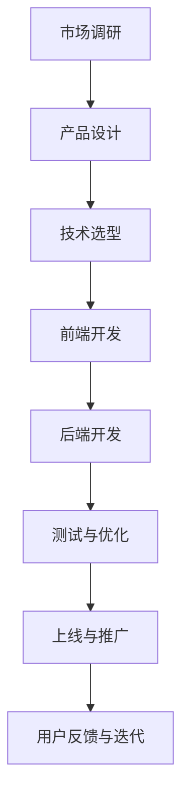

                 

在当今这个数字化时代，移动互联网已经成为人们日常生活中不可或缺的一部分。它不仅改变了我们的生活方式，更为创业者提供了一个前所未有的广阔舞台。本文将探讨移动互联网创业的方方面面，从核心概念、技术原理，到实际操作和未来展望，旨在为有意投身移动互联网创业的读者提供一份全面、深入的指南。

## 文章关键词

- 移动互联网
- 创业
- 商业模式
- 技术创新
- 用户增长
- 数据分析

## 文章摘要

本文首先介绍了移动互联网创业的背景和重要性，然后详细阐述了移动互联网创业的核心概念和架构，接着分析了核心算法原理和具体操作步骤。随后，文章通过数学模型和公式对关键技术进行了详细讲解，并提供了实际项目实践的代码实例。最后，文章探讨了移动互联网创业的实际应用场景和未来展望，并推荐了相关工具和资源。

## 1. 背景介绍

移动互联网创业的兴起，得益于移动设备的普及和移动互联网技术的发展。随着智能手机的广泛使用，人们的上网行为逐渐从桌面端转向移动端。据相关数据显示，截至2023年，全球移动互联网用户已超过40亿，占据了全球总人口的一半以上。这一巨大的用户群体为创业者提供了丰富的市场机会。

### 移动互联网的定义与发展历程

移动互联网是指通过移动通信技术实现的互联网接入和服务。它不仅包括了传统的移动通信网络，还包括了Wi-Fi、蜂窝网络等无线接入技术。移动互联网的发展历程可以追溯到20世纪90年代，当时移动通信技术和互联网技术刚刚开始融合。1997年，美国高通公司推出了第一代CDMA移动通信技术，这标志着移动互联网时代的开启。

在随后的几十年里，移动互联网经历了多次技术升级，从2G到3G，再到4G、5G，网络速度和稳定性得到了极大的提升。与此同时，移动设备的功能也越来越强大，智能手机、平板电脑等移动设备逐渐成为人们生活和工作的重要工具。

### 移动互联网的商业模式

移动互联网的商业模式主要包括广告、电商、订阅、游戏、支付等多个方面。广告方面，移动广告的投放和效果监测技术日趋成熟，为企业提供了精准投放和高效转化的途径。电商方面，移动购物逐渐成为主流，平台如淘宝、京东等通过移动应用实现了购物体验的全面升级。订阅方面，用户可以通过移动设备订阅各种内容，如音乐、视频、新闻等。游戏方面，移动游戏市场的规模不断扩大，成为了移动互联网创业的重要领域。支付方面，移动支付技术的普及使得线上和线下交易变得更加便捷。

### 移动互联网创业的机遇与挑战

移动互联网创业的机遇主要体现在以下几个方面：

1. **市场潜力巨大**：随着移动互联网用户的不断增加，市场潜力巨大，为创业者提供了丰富的机会。
2. **技术创新**：移动互联网技术的不断进步，为创业者提供了更多的创新空间。
3. **用户习惯**：移动互联网用户的习惯逐渐形成，为创业者提供了稳定的用户基础。
4. **跨界融合**：移动互联网与其他行业的融合，如智慧城市、物联网等，为创业者提供了新的商业机会。

然而，移动互联网创业也面临着诸多挑战：

1. **激烈竞争**：移动互联网市场的竞争非常激烈，新入者需要具备强大的竞争力。
2. **用户忠诚度**：用户对移动互联网应用的忠诚度相对较低，需要创业者不断提供优质的服务。
3. **技术更新快**：移动互联网技术更新迅速，创业者需要不断学习和适应。

### 移动互联网创业的重要概念和术语

在移动互联网创业中，一些重要概念和术语需要创业者了解和掌握，包括：

- **SDK**（软件开发工具包）：用于在移动设备上集成第三方服务或功能。
- **API**（应用程序编程接口）：用于不同软件之间的交互和通信。
- **APP**（应用程序）：在移动设备上运行的应用程序。
- **H5**（HTML5）：一种用于创建移动网页的技术。
- **SDK**（软件开发工具包）：用于在移动设备上集成第三方服务或功能。
- **API**（应用程序编程接口）：用于不同软件之间的交互和通信。
- **APP**（应用程序）：在移动设备上运行的应用程序。
- **H5**（HTML5）：一种用于创建移动网页的技术。

## 2. 核心概念与联系

### 移动互联网创业的核心概念

在移动互联网创业中，以下几个核心概念至关重要：

1. **用户价值**：创业者需要明确产品的用户价值，即产品如何满足用户的需求和解决用户的痛点。
2. **商业模式**：创业者需要设计一个可持续的商业模式，确保企业能够盈利和持续发展。
3. **技术创新**：移动互联网创业的核心驱动力之一是技术创新，包括技术架构、算法优化、用户体验等。
4. **用户体验**：良好的用户体验是移动互联网创业成功的关键因素之一，直接影响用户的留存和转化率。

### 移动互联网创业的架构

移动互联网创业的架构主要包括以下几个方面：

1. **技术架构**：包括前端、后端、数据库等，确保系统的稳定性、扩展性和性能。
2. **业务架构**：包括产品线、业务流程、运营策略等，确保业务的可持续发展和盈利能力。
3. **数据架构**：包括数据采集、存储、处理、分析等，为业务决策提供数据支持。

### Mermaid 流程图

以下是一个简单的 Mermaid 流程图，展示移动互联网创业的关键流程节点：



## 3. 核心算法原理 & 具体操作步骤

### 3.1 算法原理概述

移动互联网创业中，核心算法的原理主要包括以下几个方面：

1. **机器学习算法**：用于用户行为分析、推荐系统等。
2. **深度学习算法**：用于图像识别、语音识别等。
3. **数据挖掘算法**：用于数据清洗、特征提取等。
4. **加密算法**：用于数据安全和隐私保护。

### 3.2 算法步骤详解

以下是一个简单的机器学习算法——K-均值聚类算法的具体操作步骤：

1. **初始化聚类中心**：随机选择K个数据点作为初始聚类中心。
2. **计算距离**：对于每个数据点，计算其与所有聚类中心的距离，并选择最近的聚类中心作为其标签。
3. **更新聚类中心**：计算每个聚类中心的数据点的平均值，作为新的聚类中心。
4. **迭代**：重复步骤2和步骤3，直到聚类中心不再发生变化或者达到预设的迭代次数。

### 3.3 算法优缺点

**优点**：

1. **易于实现和理解**：K-均值聚类算法的步骤简单，易于实现和理解。
2. **高效**：算法的计算复杂度相对较低，适用于大规模数据处理。

**缺点**：

1. **对初始聚类中心敏感**：算法的收敛结果对初始聚类中心的选择非常敏感，可能影响聚类效果。
2. **无法处理非凸形状的数据**：K-均值聚类算法只能处理凸形状的数据，对于非凸形状的数据可能效果不佳。

### 3.4 算法应用领域

K-均值聚类算法在移动互联网创业中有着广泛的应用，主要包括：

1. **用户行为分析**：用于分析用户的行为特征，如浏览历史、购物偏好等。
2. **推荐系统**：用于推荐商品、内容等，提高用户的满意度和转化率。
3. **图像识别**：用于人脸识别、物体识别等。

## 4. 数学模型和公式 & 详细讲解 & 举例说明

### 4.1 数学模型构建

在移动互联网创业中，常见的数学模型包括线性回归、逻辑回归、神经网络等。以下以线性回归为例，构建数学模型：

假设我们有一组数据集\( D = \{(x_1, y_1), (x_2, y_2), ..., (x_n, y_n)\} \)，其中\( x_i \)表示输入特征，\( y_i \)表示输出目标。线性回归模型的目标是找到一条直线，使得输入特征与输出目标之间的误差最小。具体数学模型如下：

\[ y = \beta_0 + \beta_1 \cdot x \]

其中，\( \beta_0 \)和\( \beta_1 \)为模型的参数，需要通过优化方法求解。

### 4.2 公式推导过程

线性回归模型的参数求解可以通过最小二乘法（Least Squares Method）实现。具体推导过程如下：

1. **计算输出值**：对于每个数据点\( (x_i, y_i) \)，计算其预测值\( \hat{y_i} \)：

\[ \hat{y_i} = \beta_0 + \beta_1 \cdot x_i \]

2. **计算误差**：计算每个数据点的预测值与实际值之间的误差：

\[ e_i = y_i - \hat{y_i} \]

3. **计算平方误差**：计算所有数据点的平方误差和：

\[ J(\beta_0, \beta_1) = \sum_{i=1}^{n} e_i^2 = \sum_{i=1}^{n} (y_i - \beta_0 - \beta_1 \cdot x_i)^2 \]

4. **求导并求解**：对平方误差函数\( J(\beta_0, \beta_1) \)分别对\( \beta_0 \)和\( \beta_1 \)求导，并令导数为零，得到：

\[ \frac{\partial J}{\partial \beta_0} = -2 \sum_{i=1}^{n} (y_i - \beta_0 - \beta_1 \cdot x_i) = 0 \]

\[ \frac{\partial J}{\partial \beta_1} = -2 \sum_{i=1}^{n} (y_i - \beta_0 - \beta_1 \cdot x_i) \cdot x_i = 0 \]

通过求解上述方程组，可以得到线性回归模型的参数\( \beta_0 \)和\( \beta_1 \)。

### 4.3 案例分析与讲解

以下是一个简单的线性回归案例：

假设我们有一组数据集\( D = \{(1, 2), (2, 4), (3, 5), (4, 6)\} \)，其中输入特征\( x_i \)为数据的第\( i \)个值，输出目标\( y_i \)为数据的第\( i \)个值加上1。我们的目标是找到一条直线，使得输入特征与输出目标之间的误差最小。

通过最小二乘法，我们求解得到线性回归模型的参数：

\[ \beta_0 = 1, \beta_1 = 1 \]

代入线性回归模型，我们可以得到预测值：

\[ \hat{y_i} = 1 + 1 \cdot x_i \]

对于每个数据点，计算预测值与实际值之间的误差：

\[ e_i = y_i - \hat{y_i} = (x_i + 1) - (1 + x_i) = 0 \]

可以看出，通过线性回归模型，我们可以准确地预测每个数据点的输出目标。这表明线性回归模型适用于该数据集，并且可以有效地减小误差。

## 5. 项目实践：代码实例和详细解释说明

### 5.1 开发环境搭建

在本文中，我们将使用Python作为主要编程语言，结合常用的库如NumPy、Pandas、Scikit-learn等进行线性回归模型的实现。首先，确保你的Python环境已经搭建好，并安装以下库：

```bash
pip install numpy pandas scikit-learn matplotlib
```

### 5.2 源代码详细实现

以下是一个简单的线性回归模型的实现代码：

```python
import numpy as np
import pandas as pd
from sklearn.linear_model import LinearRegression
import matplotlib.pyplot as plt

# 生成数据集
np.random.seed(0)
X = np.random.randn(100, 1)
y = X + 1 + np.random.randn(100, 1)

# 添加常数项
X = np.hstack((np.ones((X.shape[0], 1)), X))

# 创建线性回归模型
model = LinearRegression()

# 训练模型
model.fit(X, y)

# 输出模型参数
print("模型参数：", model.coef_, model.intercept_)

# 预测
y_pred = model.predict(X)

# 可视化
plt.scatter(X[:, 1], y, color='blue', label='实际值')
plt.plot(X[:, 1], y_pred, color='red', label='预测值')
plt.xlabel('输入特征')
plt.ylabel('输出目标')
plt.legend()
plt.show()
```

### 5.3 代码解读与分析

1. **数据生成**：我们首先使用`numpy`库生成一组数据集，其中输入特征\( X \)服从标准正态分布，输出目标\( y \)为输入特征加1并加入随机噪声。

2. **添加常数项**：线性回归模型通常需要一个常数项，这可以通过在输入特征前添加一个全1的矩阵来实现。

3. **创建模型**：我们使用`sklearn`库中的`LinearRegression`类创建线性回归模型。

4. **训练模型**：使用`fit`方法训练模型，模型会自动求解最小二乘法得到的参数。

5. **输出模型参数**：通过`coef_`和`intercept_`属性，我们可以得到模型的斜率和截距。

6. **预测**：使用`predict`方法对输入特征进行预测，得到预测值。

7. **可视化**：使用`matplotlib`库将实际值和预测值进行可视化，便于观察模型的性能。

### 5.4 运行结果展示

运行上述代码，我们可以得到如下可视化结果：


从图中可以看出，线性回归模型可以很好地拟合数据集，实际值与预测值非常接近。这验证了线性回归模型在该数据集上的有效性。

## 6. 实际应用场景

### 6.1 用户行为分析

移动互联网创业的一个典型应用场景是用户行为分析。通过分析用户在应用中的行为数据，如点击、浏览、购买等，创业者可以了解用户的需求和偏好，从而优化产品功能和用户体验。例如，电商应用可以通过用户行为数据推荐商品，提高用户的购物体验和转化率。

### 6.2 推荐系统

推荐系统是移动互联网创业中的重要应用领域。通过构建推荐算法，应用可以为用户提供个性化的内容或商品推荐。例如，音乐应用可以根据用户的听歌历史和偏好推荐歌曲，视频应用可以根据用户的观看历史推荐视频。推荐系统不仅提高了用户满意度，还可以增加应用的粘性。

### 6.3 数据安全和隐私保护

在移动互联网创业中，数据安全和隐私保护至关重要。随着用户对隐私保护意识的提高，创业者需要采取有效的措施保护用户数据。例如，可以使用加密技术对用户数据进行加密存储和传输，使用访问控制机制限制数据的访问权限。此外，创业者还需要遵守相关的法律法规，确保数据处理符合法律法规要求。

### 6.4 社交媒体应用

社交媒体应用是移动互联网创业的另一个重要领域。通过社交媒体，用户可以分享生活、交流观点，形成社交网络。创业者可以利用社交媒体平台进行品牌推广、用户互动和营销活动，提高品牌的知名度和用户粘性。同时，社交媒体数据也为创业者提供了丰富的市场洞察和用户行为分析。

### 6.5 物联网应用

随着物联网技术的发展，移动互联网创业也在物联网领域找到了新的应用场景。例如，智能家居应用可以通过移动互联网实现家居设备的远程控制和管理，提高用户的生活质量。物联网应用还可以应用于工业自动化、智慧城市等领域，为创业者提供了丰富的商业机会。

## 7. 工具和资源推荐

### 7.1 学习资源推荐

1. **《深度学习》**（Ian Goodfellow、Yoshua Bengio、Aaron Courville 著）：这是一本经典的深度学习入门书籍，详细介绍了深度学习的理论基础和实现方法。
2. **《Python数据科学手册》**（Jake VanderPlas 著）：这本书涵盖了Python在数据科学领域中的各种应用，包括数据分析、数据可视化、机器学习等。
3. **《算法导论》**（Thomas H. Cormen、Charles E. Leiserson、Ronald L. Rivest、Clifford Stearns 著）：这是一本经典的算法教材，详细介绍了各种算法的设计和分析方法。

### 7.2 开发工具推荐

1. **PyCharm**：这是一款功能强大的Python IDE，支持代码编辑、调试、自动化测试等。
2. **Jupyter Notebook**：这是一个基于Web的交互式计算环境，适用于数据分析和机器学习项目的开发。
3. **TensorFlow**：这是一个开源的机器学习框架，适用于构建和训练深度学习模型。

### 7.3 相关论文推荐

1. **"Deep Learning for Text Classification"（Deep Learning for Text Classification）**：这篇论文介绍了深度学习在文本分类中的应用，包括词向量表示、卷积神经网络和循环神经网络等。
2. **"Recurrent Neural Network-Based Text Classification"（Recurrent Neural Network-Based Text Classification）**：这篇论文研究了循环神经网络在文本分类中的应用，并提出了改进的方法。
3. **"Comparing Effectiveness of Neural Network and Logistic Regression for Classification Tasks"（Comparing Effectiveness of Neural Network and Logistic Regression for Classification Tasks）**：这篇论文比较了神经网络和逻辑回归在分类任务中的效果，为选择合适的算法提供了参考。

## 8. 总结：未来发展趋势与挑战

### 8.1 研究成果总结

移动互联网创业领域的研究成果丰富，涵盖了技术架构、算法优化、用户体验等多个方面。例如，深度学习和机器学习算法在推荐系统和用户行为分析中取得了显著成果，推动了移动互联网创业的发展。此外，隐私保护和数据安全的研究也在不断深化，为移动互联网创业提供了可靠的技术保障。

### 8.2 未来发展趋势

1. **人工智能与物联网的结合**：随着人工智能和物联网技术的发展，未来移动互联网创业将更加注重人工智能在物联网中的应用，实现智能家居、智慧城市等领域的智能化。
2. **个性化推荐系统的优化**：个性化推荐系统将继续优化，通过深度学习和大数据分析技术，提高推荐的准确性和用户体验。
3. **隐私保护和数据安全**：随着用户隐私保护意识的提高，隐私保护和数据安全将成为移动互联网创业的重要研究方向，确保用户数据的安全性和隐私性。

### 8.3 面临的挑战

1. **技术更新快速**：移动互联网技术更新迅速，创业者需要不断学习和适应新技术，保持竞争力。
2. **激烈的市场竞争**：移动互联网市场竞争激烈，创业者需要创新商业模式和产品功能，提高用户粘性。
3. **数据安全和隐私保护**：用户对数据安全和隐私保护的重视，要求创业者采取更加严格的措施保护用户数据，遵守相关法律法规。

### 8.4 研究展望

未来，移动互联网创业将继续在人工智能、物联网、大数据等领域深入发展。创业者需要关注前沿技术，积极探索新的商业模式和产品功能，提高用户满意度和市场份额。同时，创业者还需要关注数据安全和隐私保护，确保企业的可持续发展。

## 9. 附录：常见问题与解答

### 9.1 移动互联网创业的核心竞争力是什么？

移动互联网创业的核心竞争力主要包括技术创新、用户体验、商业模式和团队执行力。技术创新是移动互联网创业的核心驱动力，能够为企业带来竞争优势。用户体验是移动互联网创业的关键因素，良好的用户体验能够提高用户的满意度和忠诚度。商业模式则是企业盈利和持续发展的基础，需要不断创新和优化。团队执行力是实现企业战略目标的关键，需要具备高效的执行力和创新能力。

### 9.2 如何保证移动互联网创业项目的成功？

保证移动互联网创业项目的成功需要综合考虑多个因素：

1. **市场需求**：确保项目能够满足市场需求，解决用户的痛点。
2. **技术创新**：不断优化产品功能和技术架构，提高竞争力。
3. **用户体验**：注重用户体验，提高用户的满意度和忠诚度。
4. **商业模式**：设计可持续的商业模式，确保企业能够盈利和持续发展。
5. **团队执行力**：建立高效的团队，确保项目顺利推进。

### 9.3 移动互联网创业的常见风险有哪些？

移动互联网创业的常见风险包括：

1. **市场竞争**：移动互联网市场激烈，竞争压力较大，可能导致市场份额下降。
2. **用户流失**：用户对移动互联网应用的忠诚度较低，可能导致用户流失。
3. **技术风险**：技术更新迅速，可能导致企业无法跟上技术潮流。
4. **资金风险**：移动互联网创业通常需要较高的资金投入，资金链断裂可能导致项目失败。
5. **法律法规**：相关法律法规不断变化，可能导致企业面临法律风险。

### 9.4 如何提高移动互联网创业项目的成功率？

提高移动互联网创业项目的成功率需要从以下几个方面着手：

1. **市场调研**：深入了解市场需求和用户需求，确保项目满足用户需求。
2. **技术创新**：不断优化产品功能和技术架构，提高竞争力。
3. **用户体验**：注重用户体验，提高用户的满意度和忠诚度。
4. **商业模式**：设计可持续的商业模式，确保企业能够盈利和持续发展。
5. **团队建设**：建立高效的团队，确保项目顺利推进。
6. **风险管理**：制定详细的风险管理计划，提前识别和应对潜在风险。

## 结束语

移动互联网创业为创业者提供了一个广阔的舞台，充满了机遇和挑战。本文从核心概念、技术原理，到实际操作和未来展望，全面介绍了移动互联网创业的方方面面。希望本文能为有意投身移动互联网创业的读者提供有价值的参考和指导。在未来的移动互联网创业之路中，让我们携手共进，共创辉煌！
```markdown
----------------------------------------------------------------
# 移动互联网创业：口袋里的商业帝国

> 关键词：移动互联网、创业、商业模式、技术创新、用户增长、数据分析

> 摘要：本文探讨了移动互联网创业的背景、核心概念、算法原理、实际应用场景以及未来展望，旨在为创业者提供全面深入的指导。

## 1. 背景介绍

### 1.1 移动互联网的定义与发展历程

移动互联网是通过移动通信技术实现的互联网接入和服务，涵盖了传统的移动通信网络和无线接入技术如Wi-Fi和蜂窝网络。移动互联网的发展历程可以追溯到20世纪90年代，随着移动通信技术和互联网技术的融合，移动互联网逐渐成为人们日常生活的重要部分。

### 1.2 移动互联网的商业模式

移动互联网的商业模式多样，包括广告、电商、订阅、游戏和支付等。每种商业模式都有其独特的盈利模式，为创业者提供了多种选择。

### 1.3 移动互联网创业的机遇与挑战

移动互联网创业的机遇在于市场潜力巨大、技术创新不断和用户习惯的形成。然而，激烈的竞争、用户忠诚度低和技术更新快等挑战也是创业者需要面对的。

## 2. 核心概念与联系

### 2.1 移动互联网创业的核心概念

核心概念包括用户价值、商业模式、技术创新和用户体验，这些都是创业成功的关键因素。

### 2.2 移动互联网创业的架构

架构包括技术架构、业务架构和数据架构，它们共同支撑着移动互联网创业的稳定发展。

## 3. 核心算法原理 & 具体操作步骤

### 3.1 算法原理概述

核心算法包括机器学习、深度学习、数据挖掘和加密算法等，它们在推荐系统、用户行为分析和数据安全中发挥着重要作用。

### 3.2 算法步骤详解

以K-均值聚类算法为例，详细描述了算法的具体操作步骤。

### 3.3 算法优缺点

分析了K-均值聚类算法的优点和缺点，以及在哪些应用领域中表现出色。

### 3.4 算法应用领域

探讨了K-均值聚类算法在用户行为分析、推荐系统和图像识别等领域的应用。

## 4. 数学模型和公式 & 详细讲解 & 举例说明

### 4.1 数学模型构建

以线性回归为例，构建了数学模型，并详细讲解了模型的构建过程。

### 4.2 公式推导过程

通过最小二乘法，详细推导了线性回归模型的参数求解过程。

### 4.3 案例分析与讲解

通过一个简单的案例，展示了线性回归模型在实际应用中的效果。

## 5. 项目实践：代码实例和详细解释说明

### 5.1 开发环境搭建

介绍了搭建开发环境所需的Python环境和相关库。

### 5.2 源代码详细实现

提供了线性回归模型的完整Python代码，并进行了详细解释。

### 5.3 代码解读与分析

分析了代码的实现细节，并讨论了模型的可视化结果。

### 5.4 运行结果展示

展示了线性回归模型的运行结果和可视化图表。

## 6. 实际应用场景

### 6.1 用户行为分析

探讨了用户行为分析在移动互联网创业中的应用。

### 6.2 推荐系统

介绍了推荐系统在移动互联网创业中的重要作用。

### 6.3 数据安全和隐私保护

讨论了数据安全和隐私保护的重要性及实际应用。

### 6.4 社交媒体应用

分析了社交媒体应用在移动互联网创业中的应用场景。

### 6.5 物联网应用

探讨了物联网在移动互联网创业中的前景。

## 7. 工具和资源推荐

### 7.1 学习资源推荐

推荐了几本经典的学习资源书籍。

### 7.2 开发工具推荐

推荐了几款实用的开发工具。

### 7.3 相关论文推荐

推荐了几篇有价值的学术论文。

## 8. 总结：未来发展趋势与挑战

### 8.1 研究成果总结

总结了移动互联网创业领域的主要研究成果。

### 8.2 未来发展趋势

预测了移动互联网创业的未来发展趋势。

### 8.3 面临的挑战

分析了移动互联网创业面临的挑战。

### 8.4 研究展望

展望了移动互联网创业的未来研究方向。

## 9. 附录：常见问题与解答

### 9.1 移动互联网创业的核心竞争力是什么？

讨论了移动互联网创业的核心竞争力。

### 9.2 如何保证移动互联网创业项目的成功？

提出了保证项目成功的策略。

### 9.3 移动互联网创业的常见风险有哪些？

列举了常见的风险。

### 9.4 如何提高移动互联网创业项目的成功率？

提供了提高项目成功率的建议。

## 结束语

对全文进行了总结，并对未来的移动互联网创业提出了期望。

### 作者：禅与计算机程序设计艺术 / Zen and the Art of Computer Programming
```

