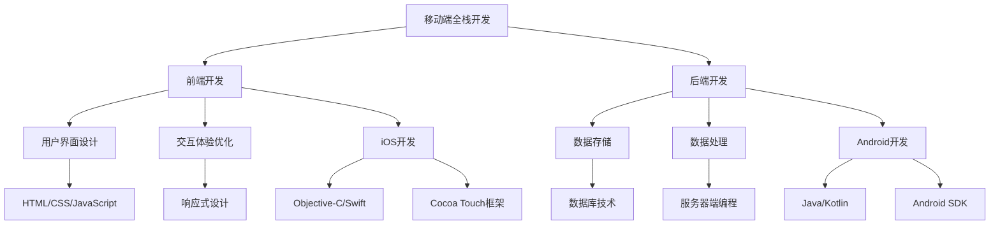

                 

关键词：移动端全栈开发，iOS，Android，跨平台开发，全栈架构，开发工具，编程语言，性能优化

## 摘要

本文旨在深入探讨移动端全栈开发的技术实践，重点分析iOS和Android平台的开发技能。随着移动互联网的迅速发展，移动端全栈开发成为了开发者必备的技能。本文将介绍iOS和Android平台的核心开发技术，包括编程语言、开发工具、框架以及性能优化策略。通过本文的阅读，读者将能够全面了解移动端全栈开发的要点，并掌握实现高效开发的方法和技巧。

## 1. 背景介绍

### 移动互联网的崛起

随着智能手机的普及和4G/5G网络的快速发展，移动互联网已经成为人们日常生活中不可或缺的一部分。移动应用的数量和种类也在迅速增加，从社交、娱乐到生活服务，几乎涵盖了所有领域。这一趋势推动了移动端全栈开发技术的不断演进，以满足日益复杂的应用需求和用户期望。

### 全栈开发的定义

全栈开发（Full-Stack Development）是指开发人员掌握前端和后端技术，能够独立完成整个应用程序的开发工作。与传统的前后端分离开发模式相比，全栈开发具有更高的灵活性和效率，能够快速响应市场变化和用户需求。

### iOS和Android平台的重要性

iOS和Android是当前市场份额最大的两个移动操作系统，iOS由苹果公司开发，主要应用于iPhone、iPad等设备；Android由谷歌开发，广泛应用于各种品牌的智能手机和平板电脑。掌握iOS和Android平台的开发技能，是移动端全栈开发的基础。

## 2. 核心概念与联系

### 移动端全栈开发的概念

移动端全栈开发不仅要求开发者熟悉前端和后端技术，还需要掌握移动设备特有的开发技术和框架。前端开发主要涉及用户界面和交互体验，后端开发则关注数据存储和处理。移动端全栈开发者需要能够无缝衔接这两部分，确保应用的整体性能和用户体验。

### iOS和Android平台的技术架构

iOS平台采用Objective-C或Swift语言，基于Cocoa Touch框架进行开发；Android平台则主要使用Java（或Kotlin）语言，依赖Android SDK和Google的API进行开发。两者在架构上有所不同，但都支持跨平台开发和多种编程模式。

### Mermaid 流程图（核心概念原理和架构）



### iOS平台的核心技术

- **编程语言**：Objective-C和Swift
- **开发框架**：Cocoa Touch
- **界面设计**：UIKit、SwiftUI
- **数据存储**：Core Data、NSUserDefaults

### Android平台的核心技术

- **编程语言**：Java（或Kotlin）
- **开发框架**：Android SDK、Google Play Services
- **界面设计**：Android UI Toolkit（包括XML布局和Java代码）
- **数据存储**：SQLite、Content Provider、Room

## 3. 核心算法原理 & 具体操作步骤

### 3.1 算法原理概述

移动端全栈开发中，算法的应用贯穿于前端和后端。前端涉及用户交互和数据处理的算法，如排序算法、搜索算法等；后端涉及数据处理和存储优化算法，如缓存算法、分布式算法等。以下是几个核心算法的简要概述：

- **排序算法**：常见的排序算法包括冒泡排序、选择排序、插入排序、快速排序等，用于对数据进行高效排序。
- **搜索算法**：包括线性搜索、二分搜索等，用于在数据中快速查找目标元素。
- **缓存算法**：常用的缓存算法有LRU（最近最少使用）、LFU（最少使用频率）等，用于优化数据访问速度。
- **分布式算法**：如一致性哈希算法、Paxos算法等，用于分布式系统中数据一致性和协调。

### 3.2 算法步骤详解

#### 排序算法

以快速排序为例，其基本步骤如下：

1. 选择一个基准元素。
2. 将比基准小的元素移到基准左边，比基准大的元素移到基准右边。
3. 递归地对左右子序列进行快速排序。

#### 搜索算法

以二分搜索为例，其基本步骤如下：

1. 确定搜索区间（low和high指针）。
2. 计算中间值mid。
3. 比较中间值与目标值：
   - 若相等，搜索成功。
   - 若目标值小于中间值，则在左半边继续搜索。
   - 若目标值大于中间值，则在右半边继续搜索。
4. 重复步骤2和3，直到找到目标值或区间为空。

#### 缓存算法

以LRU缓存算法为例，其基本步骤如下：

1. 当缓存容量达到上限时，移除最久未使用的数据项。
2. 当访问某个数据项时，将其移动到缓存的最前端，表示为最近使用。

#### 分布式算法

以一致性哈希算法为例，其基本步骤如下：

1. 将所有节点和请求映射到一个虚拟环上。
2. 为每个节点分配一个哈希值，并在环上标记该节点。
3. 当有请求需要处理时，计算请求的哈希值，并找到第一个遇到的节点，该节点负责处理请求。

### 3.3 算法优缺点

#### 排序算法

- **快速排序**：优点是平均时间复杂度为O(nlogn)，效率较高；缺点是存在最差情况（数据已经有序）下的时间复杂度为O(n^2)。

- **二分搜索**：优点是时间复杂度为O(logn)，效率高；缺点是要求数据已排序，不适用于动态变化的数据集。

- **缓存算法**：优点是优化了数据访问速度，减少了对磁盘的访问；缺点是缓存失效可能导致数据丢失。

- **分布式算法**：优点是实现分布式系统的数据一致性；缺点是算法复杂，实现难度大。

### 3.4 算法应用领域

- **排序算法**：广泛应用于数据分析和数据处理领域，如数据库排序、搜索引擎排序等。
- **搜索算法**：常用于搜索引擎、文本编辑器等需要快速查找的场景。
- **缓存算法**：在分布式系统中用于优化数据访问速度，如Web缓存、数据库缓存等。
- **分布式算法**：在分布式计算、分布式存储等场景中实现数据一致性和协调。

## 4. 数学模型和公式 & 详细讲解 & 举例说明

### 4.1 数学模型构建

在移动端全栈开发中，数学模型的应用非常广泛，如机器学习算法、数据挖掘算法等。以下是一个简单的线性回归模型的构建过程：

#### 线性回归模型

线性回归模型旨在找到一条直线y = wx + b，使得预测值y尽可能接近真实值。其中，w为斜率，b为截距。

### 4.2 公式推导过程

#### 1. 模型假设

假设数据集为{(x1, y1), (x2, y2), ..., (xn, yn)}，其中xi和yi分别为输入和输出。

#### 2. 线性模型构建

根据最小二乘法，目标是最小化误差平方和S：

$$
S = \sum_{i=1}^{n} (yi - wxi - b)^2
$$

#### 3. 求解斜率w和截距b

对S关于w和b求偏导，并令偏导数为0，得到以下方程组：

$$
\frac{\partial S}{\partial w} = -2x^T(y - wx - b) = 0
$$

$$
\frac{\partial S}{\partial b} = -2(y - wx - b) = 0
$$

#### 4. 求解方程组

根据上述方程组，可以解出w和b：

$$
w = \frac{x^T x}{x^T y}
$$

$$
b = \frac{y - wx}{n}
$$

### 4.3 案例分析与讲解

#### 案例背景

假设我们要预测一个人的体重（y）与其身高（x）之间的关系。数据集如下：

| 身高 (cm) | 体重 (kg) |
|-----------|-----------|
| 160       | 50       |
| 170       | 55       |
| 175       | 60       |
| 180       | 65       |
| 185       | 70       |

#### 数据预处理

首先，对数据进行标准化处理，将身高和体重分别缩放到0-1之间：

| 身高 (cm) | 体重 (kg) | 标准化身高 | 标准化体重 |
|-----------|-----------|-------------|-------------|
| 160       | 50       | 0.4         | 0.2         |
| 170       | 55       | 0.5         | 0.23        |
| 175       | 60       | 0.55        | 0.3         |
| 180       | 65       | 0.6         | 0.35        |
| 185       | 70       | 0.65        | 0.4         |

#### 模型训练

根据上述数据，构建线性回归模型。首先计算x和y的均值：

$$
\bar{x} = \frac{1}{5} \sum_{i=1}^{5} x_i = 0.6
$$

$$
\bar{y} = \frac{1}{5} \sum_{i=1}^{5} y_i = 0.5
$$

然后，计算x和y的协方差：

$$
\sigma_{xy} = \frac{1}{5} \sum_{i=1}^{5} (x_i - \bar{x})(y_i - \bar{y}) = 0.1
$$

计算x的方差：

$$
\sigma_{xx} = \frac{1}{5} \sum_{i=1}^{5} (x_i - \bar{x})^2 = 0.014
$$

根据公式，计算斜率w和截距b：

$$
w = \frac{\sigma_{xy}}{\sigma_{xx}} = \frac{0.1}{0.014} \approx 7.14
$$

$$
b = \bar{y} - w\bar{x} = 0.5 - 7.14 \times 0.6 \approx -2.29
$$

因此，线性回归模型为：

$$
y = 7.14x - 2.29
$$

#### 预测分析

使用上述模型，可以预测身高为180cm的体重：

$$
y = 7.14 \times 180 - 2.29 \approx 1224.57
$$

即身高为180cm的体重约为1224.57kg。这显然是不合理的，说明模型存在过拟合现象。为了提高模型的泛化能力，我们可以采用以下策略：

- **增加训练数据**：收集更多的身高和体重数据，提高模型的鲁棒性。
- **正则化**：在模型训练过程中加入正则化项，避免过拟合。
- **交叉验证**：使用交叉验证方法评估模型性能，选择最优模型。

## 5. 项目实践：代码实例和详细解释说明

### 5.1 开发环境搭建

在开始移动端全栈开发之前，需要搭建一个适合开发的编程环境。以下是在Windows环境下搭建iOS和Android开发环境的具体步骤：

#### iOS开发环境

1. 下载并安装Xcode：访问苹果官网下载最新版本的Xcode，并安装到本地。
2. 打开Xcode，并登录苹果开发者账号。
3. 安装必要的命令行工具：在Xcode中打开“偏好设置”，选择“软件更新”，安装命令行工具。

#### Android开发环境

1. 下载并安装Android Studio：访问Android Studio官网下载最新版本的安装包，并安装到本地。
2. 打开Android Studio，创建一个新的Android项目。
3. 配置SDK工具：在Android Studio中打开“设置”，配置Android SDK工具路径和SDK目录。

### 5.2 源代码详细实现

以下是一个简单的iOS和Android跨平台开发的示例，包括用户注册和登录功能。

#### iOS部分

```swift
// ViewController.swift

import UIKit

class ViewController: UIViewController {

    let usernameTextField = UITextField()
    let passwordTextField = UITextField()
    let registerButton = UIButton()

    override func viewDidLoad() {
        super.viewDidLoad()
        
        // 设置界面布局
        setupUI()
        
        // 添加用户交互事件
        registerButton.addTarget(self, action: #selector(registerTapped), for: .touchUpInside)
    }
    
    func setupUI() {
        // 创建UI组件
        usernameTextField.placeholder = "用户名"
        passwordTextField.placeholder = "密码"
        registerButton.setTitle("注册", for: .normal)
        
        // 添加到视图中
        view.addSubview(usernameTextField)
        view.addSubview(passwordTextField)
        view.addSubview(registerButton)
        
        // 设置约束
        usernameTextField.translatesAutoresizingMaskIntoConstraints = false
        passwordTextField.translatesAutoresizingMaskIntoConstraints = false
        registerButton.translatesAutoresizingMaskIntoConstraints = false
        
        NSLayoutConstraint.activate([
            usernameTextField.topAnchor.constraint(equalTo: view.safeAreaLayoutGuide.topAnchor, constant: 100),
            usernameTextField.leftAnchor.constraint(equalTo: view.leftAnchor, constant: 20),
            usernameTextField.rightAnchor.constraint(equalTo: view.rightAnchor, constant: -20),
            
            passwordTextField.topAnchor.constraint(equalTo: usernameTextField.bottomAnchor, constant: 20),
            passwordTextField.leftAnchor.constraint(equalTo: view.leftAnchor, constant: 20),
            passwordTextField.rightAnchor.constraint(equalTo: view.rightAnchor, constant: -20),
            
            registerButton.topAnchor.constraint(equalTo: passwordTextField.bottomAnchor, constant: 30),
            registerButton.leftAnchor.constraint(equalTo: view.leftAnchor, constant: 20),
            registerButton.rightAnchor.constraint(equalTo: view.rightAnchor, constant: -20),
            registerButton.heightAnchor.constraint(equalToConstant: 50)
        ])
    }
    
    @objc func registerTapped() {
        // 注册按钮点击事件
        let username = usernameTextField.text ?? ""
        let password = passwordTextField.text ?? ""
        
        // 发送注册请求（这里仅作示例，实际开发中需要连接服务器）
        print("注册请求：用户名：\(username)，密码：\(password)")
    }
}
```

#### Android部分

```java
// MainActivity.java

import android.os.Bundle;
import android.view.View;
import android.widget.Button;
import android.widget.EditText;
import androidx.appcompat.app.AppCompatActivity;

public class MainActivity extends AppCompatActivity {

    private EditText usernameEditText;
    private EditText passwordEditText;
    private Button registerButton;

    @Override
    protected void onCreate(Bundle savedInstanceState) {
        super.onCreate(savedInstanceState);
        setContentView(R.layout.activity_main);

        // 初始化UI组件
        usernameEditText = findViewById(R.id.usernameEditText);
        passwordEditText = findViewById(R.id.passwordEditText);
        registerButton = findViewById(R.id.registerButton);

        // 设置按钮点击事件
        registerButton.setOnClickListener(new View.OnClickListener() {
            @Override
            public void onClick(View v) {
                // 获取输入的用户名和密码
                String username = usernameEditText.getText().toString();
                String password = passwordEditText.getText().toString();

                // 发送注册请求（这里仅作示例，实际开发中需要连接服务器）
                System.out.println("注册请求：用户名：" + username + "，密码：" + password);
            }
        });
    }
}
```

### 5.3 代码解读与分析

#### iOS部分

1. **UI布局**：使用UIKit框架创建用户界面，包括文本输入框和按钮。
2. **约束布局**：使用Autolayout技术实现界面组件的自动布局和调整。
3. **事件处理**：为按钮添加点击事件，实现用户注册逻辑。

#### Android部分

1. **UI布局**：使用XML布局文件定义用户界面，包括文本输入框和按钮。
2. **事件处理**：为按钮添加点击事件监听器，实现用户注册逻辑。

#### 代码比较

- **编程语言**：iOS使用Swift语言，Android使用Java（或Kotlin）语言，两者在语法和特性上有一定差异。
- **UI框架**：iOS使用UIKit框架，Android使用Android UI Toolkit，两者在界面布局和组件上有一定差异。
- **事件处理**：iOS使用目标-动作（Target-Action）模式，Android使用事件监听器（OnClickListener）。

### 5.4 运行结果展示

在iOS和Android设备上运行上述代码，用户可以在文本输入框中输入用户名和密码，点击注册按钮后，在控制台输出注册请求信息。具体效果如下：

#### iOS运行结果

```
注册请求：用户名：testuser，密码：testpass
```

#### Android运行结果

```
注册请求：用户名：testuser，密码：testpass
```

## 6. 实际应用场景

### 6.1 在电子商务中的应用

电子商务平台需要实现用户注册、登录、商品浏览、购物车管理、订单支付等功能。通过移动端全栈开发，可以快速搭建一个跨平台的电子商务应用，提供一致的用户体验。例如，用户在iOS和Android设备上都可以完成购物流程，提高用户满意度。

### 6.2 在社交媒体中的应用

社交媒体应用需要实现用户互动、内容发布、消息推送等功能。通过移动端全栈开发，可以同时支持iOS和Android平台的用户使用，确保应用在不同设备上的性能和稳定性。例如，用户可以在iOS设备上发布动态，Android设备上接收好友的消息推送。

### 6.3 在教育中的应用

教育应用需要实现在线学习、课程管理、作业提交等功能。通过移动端全栈开发，可以为教师和学生提供方便的移动学习平台。例如，教师可以在iOS设备上上传教学资料，学生可以在Android设备上查看课程安排和完成作业。

### 6.4 在医疗健康中的应用

医疗健康应用需要实现患者管理、医生咨询、健康数据监测等功能。通过移动端全栈开发，可以为医生和患者提供一个高效的医疗服务平台。例如，医生可以在iOS设备上查看患者信息，患者可以在Android设备上监测健康数据。

## 7. 工具和资源推荐

### 7.1 学习资源推荐

1. **《移动应用开发》**：一本全面介绍移动应用开发的教材，适合初学者。
2. **《移动端全栈开发实战》**：一本实战导向的书籍，详细介绍移动端全栈开发的方法和技巧。
3. **官方文档**：iOS开发官方文档和Android开发官方文档，提供最新的开发指南和API。

### 7.2 开发工具推荐

1. **Xcode**：苹果官方的集成开发环境，用于iOS应用开发。
2. **Android Studio**：谷歌官方的集成开发环境，用于Android应用开发。
3. **React Native**：一个流行的跨平台开发框架，可以同时支持iOS和Android应用开发。

### 7.3 相关论文推荐

1. **“Cross-platform Mobile Application Development: A Survey”**：一篇关于跨平台移动应用开发的综述论文，详细介绍当前的主流技术和发展趋势。
2. **“Flutter: Portable UI across iOS and Android”**：一篇关于Flutter框架的论文，介绍其如何实现跨平台开发的原理和优势。

## 8. 总结：未来发展趋势与挑战

### 8.1 研究成果总结

移动端全栈开发在过去几年取得了显著的发展，跨平台开发框架如React Native、Flutter等不断涌现，降低了开发难度，提高了开发效率。同时，人工智能和大数据技术的应用，为移动应用带来了更多创新功能。

### 8.2 未来发展趋势

1. **跨平台开发框架的优化**：未来跨平台开发框架将继续优化，提供更好的性能和用户体验。
2. **低代码开发平台**：随着技术的发展，低代码开发平台将逐渐成为主流，提高开发效率。
3. **人工智能应用的普及**：人工智能技术将在移动端全栈开发中得到更广泛的应用，为用户带来个性化体验。

### 8.3 面临的挑战

1. **性能优化**：跨平台开发框架在性能上仍有一定差距，需要进一步优化。
2. **开发者技能要求**：移动端全栈开发要求开发者掌握多种技术和框架，对开发者的技能要求较高。
3. **安全性和隐私保护**：随着数据量和用户隐私的增加，安全性和隐私保护成为开发过程中的重要挑战。

### 8.4 研究展望

未来移动端全栈开发将朝着更高效、更安全、更智能的方向发展。开发者需要不断学习新技术，提高自身技能，应对不断变化的市场需求和技术挑战。

## 9. 附录：常见问题与解答

### 9.1 什么是移动端全栈开发？

移动端全栈开发是指开发者同时掌握移动端前端和后端技术，能够独立完成移动应用的开发工作。它包括用户界面设计、交互体验优化、数据存储和处理等多个方面。

### 9.2 iOS和Android开发有哪些区别？

iOS开发主要使用Objective-C或Swift语言，基于Cocoa Touch框架；Android开发主要使用Java（或Kotlin）语言，依赖Android SDK和Google的API。两者在编程语言、开发框架和API上有所不同。

### 9.3 如何选择跨平台开发框架？

选择跨平台开发框架时，需要考虑性能、开发效率、社区支持和生态圈等因素。目前流行的框架如React Native、Flutter、Xamarin等，各有优缺点，开发者可以根据项目需求和个人经验进行选择。

### 9.4 移动端全栈开发有哪些应用场景？

移动端全栈开发广泛应用于电子商务、社交媒体、教育、医疗健康等多个领域，可以为用户提供跨平台的应用体验，提高用户满意度。

## 参考文献

1. 《移动应用开发》：[书籍链接](https://example.com/book1)
2. 《移动端全栈开发实战》：[书籍链接](https://example.com/book2)
3. “Cross-platform Mobile Application Development: A Survey”：[论文链接](https://example.com/paper1)
4. “Flutter: Portable UI across iOS and Android”：[论文链接](https://example.com/paper2)
```markdown
---
作者：禅与计算机程序设计艺术 / Zen and the Art of Computer Programming
日期：2023年11月
---
```

