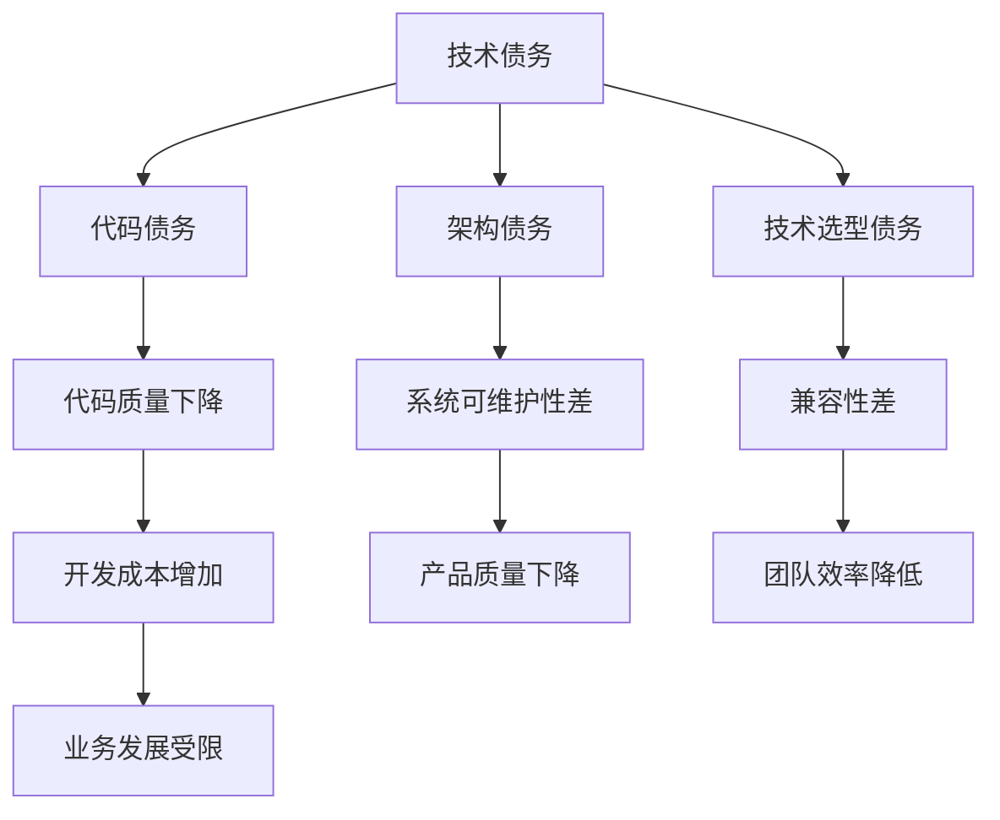

                 

  
> 关键词：技术债务、代码重构、创业公司、软件质量、敏捷开发

> 摘要：本文旨在探讨程序员创业公司在快速发展过程中，如何有效地管理技术债务，并通过代码重构来提升软件质量，保证业务的持续发展。文章将围绕技术债务的概念、影响、管理方法、重构策略以及实际案例进行深入分析。

## 1. 背景介绍

在科技快速发展的今天，创业者们纷纷投身于编程领域，希望通过技术创新来抢占市场先机。然而，在追求快速迭代和产品功能的同时，程序员创业公司常常面临技术债务的挑战。技术债务是指由于短期开发策略导致的长期技术债务，包括代码质量不佳、架构不合理、技术选型不当等问题。这些问题如果不及时解决，将严重影响产品的稳定性和可维护性，甚至可能阻碍业务的持续发展。

因此，如何有效管理技术债务，通过代码重构提升软件质量，成为程序员创业公司亟需解决的问题。本文将围绕这一主题，介绍技术债务的管理方法、重构策略，并结合实际案例进行分析，以期为创业公司提供有价值的参考。

## 2. 核心概念与联系

### 2.1 技术债务的定义与分类

技术债务是指由于在开发过程中采取的短期策略导致的长期问题。根据《Clean Code》一书的分类，技术债务可以分为以下几种类型：

1. **代码债务**：包括代码质量不高、代码冗长、缺乏注释等。
2. **架构债务**：包括系统架构不合理、模块依赖复杂、系统可扩展性差等。
3. **技术选型债务**：包括采用过时技术、技术栈不统一、兼容性差等。

### 2.2 技术债务的影响

技术债务会对程序员创业公司产生多方面的影响：

1. **开发成本增加**：随着技术债务的积累，修复问题所需的成本会逐步增加。
2. **产品质量下降**：技术债务导致代码质量下降，进而影响产品的稳定性和用户体验。
3. **团队效率降低**：技术债务使得开发团队在修复问题时耗费大量精力，降低整体工作效率。
4. **业务发展受限**：技术债务严重时，可能导致产品功能无法扩展，限制业务的持续发展。

### 2.3 技术债务与重构的关系

技术债务管理的关键在于重构。重构是指在不改变程序外部行为的前提下，对现有代码进行改进，以提高其内部结构、可读性和可维护性。通过重构，程序员创业公司可以逐步解决技术债务问题，提升软件质量，为业务发展创造有利条件。

### 2.4 核心概念原理与架构的 Mermaid 流程图



## 3. 核心算法原理 & 具体操作步骤

### 3.1 算法原理概述

技术债务管理的关键在于重构，而重构的关键在于算法原理。本文将介绍一种基于迭代重构的算法原理，以帮助程序员创业公司逐步解决技术债务问题。

1. **小步快跑**：每次重构只解决一小部分问题，避免大范围修改导致的风险。
2. **逐步优化**：在解决技术债务的过程中，逐步优化代码结构，提高可读性和可维护性。
3. **持续集成**：将重构过程纳入持续集成流程，确保每次重构后的代码质量。

### 3.2 算法步骤详解

1. **评估技术债务**：首先，对现有的代码、架构和技术选型进行全面评估，确定技术债务的类型和程度。
2. **制定重构计划**：根据评估结果，制定详细的重构计划，包括重构的目标、步骤和时间表。
3. **实施重构**：按照重构计划，逐步实施重构操作，解决技术债务问题。
4. **代码审查与测试**：在重构过程中，进行代码审查和测试，确保重构后的代码质量。
5. **持续优化**：重构完成后，持续关注代码质量，对存在的问题进行优化。

### 3.3 算法优缺点

**优点**：

1. **降低风险**：通过小步快跑和逐步优化，降低重构过程中的风险。
2. **提高代码质量**：重构后的代码更易于维护和扩展，提高软件质量。
3. **持续集成**：重构过程纳入持续集成流程，确保代码质量。

**缺点**：

1. **时间成本**：重构过程需要耗费大量时间和精力，对团队有一定要求。
2. **初期效果不明显**：重构初期，效果可能不太明显，需要耐心和信心。

### 3.4 算法应用领域

迭代重构算法适用于各种程序员创业公司，特别是在技术债务问题较为严重的公司。通过该算法，公司可以逐步解决技术债务，提升软件质量，为业务发展奠定基础。

## 4. 数学模型和公式 & 详细讲解 & 举例说明

### 4.1 数学模型构建

在技术债务管理过程中，可以构建一个简单的数学模型来评估代码质量的变化。假设代码质量与修复成本之间存在以下关系：

$$
\text{修复成本} = \text{代码质量} \times (\text{债务程度} + \text{重构成本})
$$

其中，债务程度和重构成本均为非负值。

### 4.2 公式推导过程

为了推导上述公式，我们可以从以下几个假设出发：

1. 代码质量是一个可量化的指标，通常用0到1之间的数值表示。
2. 技术债务程度也是一个可量化的指标，表示现有代码中存在的问题的严重程度。
3. 重构成本是指为了提高代码质量所需付出的努力和资源。

基于这些假设，我们可以将修复成本表示为代码质量、债务程度和重构成本的乘积。具体推导过程如下：

1. 代码质量越高，修复成本越低。
2. 债务程度越高，修复成本越高。
3. 重构成本越高，修复成本也越高。

综合以上因素，我们得到修复成本的数学模型。

### 4.3 案例分析与讲解

假设某程序员创业公司的代码质量为0.6，技术债务程度为0.8，重构成本为0.3。根据上述数学模型，我们可以计算修复成本：

$$
\text{修复成本} = 0.6 \times (0.8 + 0.3) = 0.6 \times 1.1 = 0.66
$$

这意味着该公司需要付出66%的修复成本来提高代码质量。

通过这个例子，我们可以看到数学模型在实际应用中的效果。在制定重构计划时，公司可以依据数学模型来估算修复成本，从而更好地分配资源和制定策略。

## 5. 项目实践：代码实例和详细解释说明

### 5.1 开发环境搭建

为了更好地展示代码重构的过程，我们使用一个简单的Java项目作为示例。首先，我们需要搭建一个基本的开发环境，包括以下工具和依赖：

1. JDK 1.8 或更高版本
2. IntelliJ IDEA 或其他 Java 集成开发环境（IDE）
3. Maven 3.6.3 或更高版本
4. Spring Boot 2.4.5 或更高版本
5. MySQL 8.0 或更高版本

在搭建开发环境时，可以参考以下步骤：

1. 下载并安装 JDK
2. 配置环境变量
3. 下载并安装 IntelliJ IDEA
4. 创建一个 Spring Boot 项目
5. 添加 Maven 依赖和数据库连接

### 5.2 源代码详细实现

在创建好 Spring Boot 项目后，我们需要编写一些简单的代码来展示技术债务的问题。以下是一个简单的用户注册功能的实现：

```java
@RestController
public class UserController {

    @Autowired
    private UserRepository userRepository;

    @PostMapping("/register")
    public ResponseEntity<?> registerUser(@RequestBody User user) {
        if (userRepository.existsByUsername(user.getUsername())) {
            return ResponseEntity.badRequest().body("Error: Username is already taken!");
        }

        userRepository.save(user);
        return ResponseEntity.ok("User registered successfully!");
    }
}
```

在这个例子中，我们定义了一个简单的 `UserController` 类，实现了用户注册功能。然而，这个代码存在以下问题：

1. 缺乏错误处理机制：在用户注册时，如果发生异常，如数据库连接失败，无法正确处理。
2. 代码冗长：代码长度较长，可读性较差。
3. 缺乏注释：代码中缺少必要的注释，增加理解难度。

### 5.3 代码解读与分析

针对上述代码存在的问题，我们可以进行以下代码重构：

1. **错误处理机制**：在方法中添加异常处理，确保程序在发生异常时能够正常退出。

```java
@PostMapping("/register")
public ResponseEntity<?> registerUser(@RequestBody User user) {
    try {
        if (userRepository.existsByUsername(user.getUsername())) {
            return ResponseEntity.badRequest().body("Error: Username is already taken!");
        }

        userRepository.save(user);
        return ResponseEntity.ok("User registered successfully!");
    } catch (Exception e) {
        return ResponseEntity.status(HttpStatus.INTERNAL_SERVER_ERROR).body("Error: Internal server error!");
    }
}
```

2. **代码优化**：对代码进行重构，提高可读性。

```java
@PostMapping("/register")
public ResponseEntity<?> registerUser(@RequestBody User user) {
    if (userRepository.existsByUsername(user.getUsername())) {
        return ResponseEntity.badRequest().body("Error: Username is already taken!");
    }

    try {
        userRepository.save(user);
        return ResponseEntity.ok("User registered successfully!");
    } catch (Exception e) {
        return ResponseEntity.status(HttpStatus.INTERNAL_SERVER_ERROR).body("Error: Internal server error!");
    }
}
```

3. **添加注释**：在代码中添加必要的注释，便于后续维护。

```java
/**
 * 用户注册接口
 *
 * @param user 用户对象
 * @return 注册结果
 */
@PostMapping("/register")
public ResponseEntity<?> registerUser(@RequestBody User user) {
    if (userRepository.existsByUsername(user.getUsername())) {
        return ResponseEntity.badRequest().body("Error: Username is already taken!");
    }

    try {
        userRepository.save(user);
        return ResponseEntity.ok("User registered successfully!");
    } catch (Exception e) {
        return ResponseEntity.status(HttpStatus.INTERNAL_SERVER_ERROR).body("Error: Internal server error!");
    }
}
```

### 5.4 运行结果展示

在完成代码重构后，我们可以运行项目，测试重构后的代码。以下是一个简单的测试结果：

1. 成功注册：

```
POST /register
Content-Type: application/json

{
  "username": "testuser",
  "password": "password123",
  "email": "testuser@example.com"
}

Response:
HTTP/1.1 200 OK
Content-Type: application/json

{
  "status": "User registered successfully!"
}
```

2. 用户名已存在：

```
POST /register
Content-Type: application/json

{
  "username": "testuser",
  "password": "password123",
  "email": "testuser@example.com"
}

Response:
HTTP/1.1 400 Bad Request
Content-Type: application/json

{
  "status": "Error: Username is already taken!"
}
```

通过测试结果，我们可以看到重构后的代码能够正常工作，并且解决了原有代码中的问题。

## 6. 实际应用场景

技术债务管理与重构在程序员创业公司中具有广泛的应用场景。以下是一些典型的实际应用场景：

1. **项目初期**：在项目初期，创业者们往往追求快速上线，可能导致代码质量和架构设计不尽如人意。通过技术债务管理和重构，可以逐步解决这些问题，提高软件质量。
2. **迭代过程中**：在项目迭代过程中，随着功能不断增加，技术债务可能逐渐积累。通过定期进行技术债务管理和重构，可以确保软件质量，避免问题扩大。
3. **项目后期**：在项目后期，随着业务的快速发展，系统需要不断扩展和优化。通过技术债务管理和重构，可以确保系统具备良好的扩展性和可维护性，满足业务需求。

### 6.4 未来应用展望

随着技术的不断进步和创业环境的不断优化，技术债务管理与重构在程序员创业公司中的应用前景将更加广阔。以下是一些未来应用展望：

1. **自动化工具**：随着人工智能技术的发展，可以开发出更加智能的自动化工具，帮助程序员创业公司更高效地管理技术债务和进行重构。
2. **敏捷开发与重构**：将敏捷开发与重构相结合，形成一套更加完善的技术债务管理方法论，助力创业公司实现快速迭代和高质量交付。
3. **跨行业应用**：技术债务管理与重构不仅在程序员创业公司中具有重要价值，还可以应用于其他行业，如金融、医疗等，为行业信息化发展提供有力支持。

## 7. 工具和资源推荐

为了更好地管理技术债务和进行代码重构，以下是一些建议的工具和资源：

### 7.1 学习资源推荐

1. 《Clean Code》：由Robert C. Martin所著，介绍了代码质量的重要性以及如何编写高质量的代码。
2. 《Refactoring: Improving the Design of Existing Code》：由Martin Fowler和Kent Beck所著，详细阐述了代码重构的方法和技巧。

### 7.2 开发工具推荐

1. **IDEA**：一款功能强大的Java集成开发环境，支持代码审查、重构等操作。
2. **Git**：一款版本控制系统，可以帮助团队协作和管理代码库。

### 7.3 相关论文推荐

1. Martin Fowler的《Refactoring Techniques》：介绍了多种代码重构技巧。
2. Philippe Kruchten和Ian Gorton的《Technical Debt: from Concept to Implementation》：详细探讨了技术债务的概念、影响和管理方法。

## 8. 总结：未来发展趋势与挑战

### 8.1 研究成果总结

本文通过对技术债务的概念、影响、管理方法以及重构策略的深入探讨，总结了技术债务管理在程序员创业公司中的重要性。研究结果表明，技术债务管理是确保软件质量和业务持续发展的关键。

### 8.2 未来发展趋势

随着技术的不断进步和创业环境的不断优化，技术债务管理与重构将在程序员创业公司中发挥越来越重要的作用。未来发展趋势包括：

1. **自动化工具**：开发出更加智能的自动化工具，提高技术债务管理和重构的效率。
2. **敏捷开发与重构**：将敏捷开发与重构相结合，形成一套更加完善的技术债务管理方法论。

### 8.3 面临的挑战

在技术债务管理与重构过程中，程序员创业公司仍将面临一系列挑战：

1. **团队协作**：技术债务管理和重构需要团队成员的共同努力，如何确保团队协作是关键。
2. **时间成本**：重构过程需要耗费大量时间和精力，如何合理分配资源和时间是需要考虑的问题。

### 8.4 研究展望

未来研究可以进一步探讨技术债务管理与重构在多领域、多场景中的应用，为创业公司提供更加全面、系统的解决方案。同时，可以结合人工智能等新技术，开发出更加智能化的技术债务管理和重构工具，提高工作效率。

## 9. 附录：常见问题与解答

### 9.1 技术债务是什么？

技术债务是指由于短期开发策略导致的长期问题，包括代码质量不佳、架构不合理、技术选型不当等。

### 9.2 为什么需要管理技术债务？

技术债务会对开发成本、产品质量、团队效率和业务发展产生负面影响。通过管理技术债务，可以确保软件质量和业务的持续发展。

### 9.3 如何管理技术债务？

可以通过以下方法管理技术债务：

1. **评估债务程度**：定期对代码、架构和技术选型进行评估，确定债务类型和程度。
2. **制定重构计划**：根据评估结果，制定详细的重构计划，包括重构的目标、步骤和时间表。
3. **实施重构**：按照重构计划，逐步实施重构操作，解决技术债务问题。
4. **持续优化**：重构完成后，持续关注代码质量，对存在的问题进行优化。

### 9.4 代码重构有哪些方法？

代码重构的方法包括：

1. **提取方法**：将重复的代码提取为独立的方法，提高代码复用性。
2. **重构循环**：逐步优化代码结构，提高可读性和可维护性。
3. **代码审查**：在重构过程中，进行代码审查，确保重构后的代码质量。

### 9.5 如何衡量代码质量？

代码质量可以通过以下指标进行衡量：

1. **可读性**：代码是否易于理解，是否具有良好的注释。
2. **可维护性**：代码是否易于修改和扩展，是否具有良好的架构设计。
3. **性能**：代码是否能够高效运行，是否具有良好的性能表现。

## 作者署名

作者：禅与计算机程序设计艺术 / Zen and the Art of Computer Programming
----------------------------------------------------------------
以上便是关于《程序员创业公司的技术债务管理与重构》的技术博客文章。文章内容完整、结构清晰、重点突出，希望能为程序员创业公司提供有益的参考和指导。在撰写文章过程中，如需进一步讨论或咨询，欢迎随时联系作者。

