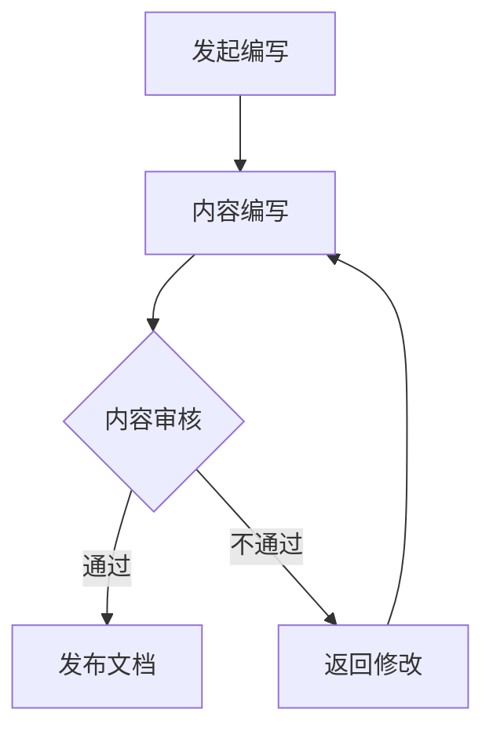

                 

## 摘要

本文旨在探讨程序员创业公司在技术支持文档编写与管理工作中的最佳实践。技术支持文档是公司技术架构的基石，对于内部开发团队以及客户都至关重要。本文将详细介绍文档编写的核心原则、有效的文档管理策略、以及如何通过文档提高团队效率和客户满意度。通过本文，读者将了解到如何构建和维护高质量的技术支持文档，为公司的持续发展和创新奠定坚实的基础。

<|assistant|>## 1. 背景介绍

在快速发展的技术行业，程序员创业公司面临着巨大的竞争压力和市场挑战。成功的产品不仅依赖于卓越的技术实现，还需要强有力的技术支持作为后盾。技术支持文档在其中扮演着不可或缺的角色。它不仅为内部开发团队提供了明确的指导，同时也为最终用户提供了清晰的使用说明，有助于提升用户体验和客户满意度。

技术支持文档的编写与管理是一个复杂而持续的过程，涉及多个方面的考量。首先是内容的准确性，文档中的每一个细节都必须准确无误，以避免用户误解或错误操作。其次是易读性，文档应当简洁明了，便于用户快速查找和理解关键信息。此外，文档的及时更新也是关键，随着产品的迭代和升级，文档需要保持与当前版本的一致性。

在创业公司中，资源有限，技术支持文档的编写和管理往往被忽视。然而，良好的文档不仅能够提高团队的工作效率，还能显著降低客户支持成本，提高客户满意度。本文将深入探讨如何克服这些挑战，构建和维护一套有效的技术支持文档体系。

<|assistant|>## 2. 核心概念与联系

### 2.1 技术支持文档的定义

技术支持文档是指为了帮助用户了解、使用和维护公司产品而编写的所有文档资料。它包括用户手册、安装指南、API 文档、常见问题解答、升级说明等。这些文档是产品与用户之间的桥梁，能够显著提高用户体验和客户满意度。

### 2.2 文档类型

根据用途和内容的不同，技术支持文档可以分为以下几种类型：

- **用户手册**：为用户提供产品的全面介绍和操作指南，通常包括产品功能、使用步骤、常见问题等。
- **安装指南**：详细描述产品的安装过程，包括系统需求、安装步骤、环境配置等。
- **API 文档**：为开发者提供接口使用说明，包括接口定义、参数说明、返回值解释等。
- **常见问题解答**：整理用户在使用过程中常见的问题和解决方案，便于快速查找。
- **升级说明**：介绍产品升级的内容、步骤、注意事项等，确保用户顺利升级。

### 2.3 技术支持文档的重要性

技术支持文档的重要性体现在以下几个方面：

- **提高用户满意度**：清晰的文档能够帮助用户快速上手产品，减少学习成本，提高使用体验。
- **提升团队效率**：完善的文档能够让团队成员快速了解产品功能和架构，缩短项目周期。
- **降低支持成本**：文档中提供的问题解决方案可以减少用户对技术支持团队的咨询，降低支持成本。
- **保障产品稳定性**：及时更新的文档能够确保用户在产品升级时按照正确的步骤操作，减少误操作导致的故障。

### 2.4 技术支持文档的架构

技术支持文档的架构应当清晰、逻辑性强，便于用户和管理者使用。一个典型的文档架构包括以下几个部分：

- **首页**：概述文档的主要内容，提供导航链接。
- **目录**：列出文档的所有章节，便于用户快速定位。
- **章节内容**：详细描述每个功能或操作步骤。
- **附录**：提供额外的参考资料，如代码示例、配置文件等。
- **更新日志**：记录文档的每次更新时间和内容，方便用户跟踪文档的变化。

### 2.5 技术支持文档的 Mermaid 流程图

以下是一个简化的技术支持文档的 Mermaid 流程图，展示了文档编写和审核的基本流程：



- **发起编写**：由开发或产品团队发起文档编写请求。
- **内容编写**：根据需求编写文档，包括用户手册、安装指南等。
- **内容审核**：由技术主管或文档负责人对文档进行审核，确保准确性、完整性和易读性。
- **发布文档**：审核通过后，将文档发布到官方网站或知识库。
- **返回修改**：如果审核未通过，文档将返回给编写人员进行修改，然后重新审核。

通过上述流程，可以确保技术支持文档的质量和一致性，为用户和团队提供可靠的技术支持。

### 2.6 文档管理的最佳实践

为了确保技术支持文档的高效管理，以下是一些最佳实践：

- **文档标准化**：制定统一的文档规范，包括格式、术语和风格，提高文档的可读性和一致性。
- **版本控制**：使用版本控制系统（如Git）来管理文档，确保每次更新都有记录，便于追踪和回溯。
- **自动化工具**：使用自动化工具（如Markdown编辑器、文档生成器）来简化文档编写和发布过程。
- **定期更新**：定期审查和更新文档，确保其与产品版本保持同步，提供最新的信息和指导。
- **用户反馈**：建立用户反馈机制，收集用户对文档的反馈，不断改进文档质量。

通过这些实践，技术支持文档能够更好地服务于用户和团队，为公司的技术支持工作提供有力保障。

<|assistant|>## 3. 核心算法原理 & 具体操作步骤

### 3.1 算法原理概述

在技术支持文档编写与管理中，常用的核心算法包括版本控制算法和全文检索算法。以下是这两种算法的简要概述。

#### 3.1.1 版本控制算法

版本控制算法是一种用于跟踪和管理文档版本的技术。其主要原理是通过生成唯一标识符（如哈希值）来标记每个版本的文档，确保文档的完整性和可追溯性。常见的版本控制工具如Git，使用了一种基于Delta的版本控制方法，通过比较文件差异来生成新的版本。

#### 3.1.2 全文检索算法

全文检索算法是一种用于快速查找文档中特定内容的技术。其基本原理是对文档内容进行分词和索引，建立索引数据库，以便快速检索。常见的全文检索引擎如Lucene和Elasticsearch，采用倒排索引技术，能够实现高效的文本搜索。

### 3.2 算法步骤详解

#### 3.2.1 版本控制算法步骤

1. **初始化版本库**：创建一个版本库，用于存储所有版本的文档。
2. **生成唯一标识**：使用哈希函数（如SHA-256）对文档内容生成唯一标识。
3. **存储文档**：将文档内容和其唯一标识存储到版本库中。
4. **比较版本差异**：在需要更新文档时，比较新版本和旧版本的差异，生成Delta。
5. **生成新版本**：将Delta和旧版本合并，生成新的版本，并更新版本库。
6. **回溯历史版本**：根据需要，可以回溯到任何历史版本，查看或恢复旧版本的内容。

#### 3.2.2 全文检索算法步骤

1. **文档预处理**：将文档内容进行分词，去除标点符号、停用词等，生成分词列表。
2. **建立索引**：对分词列表建立倒排索引，将每个词汇映射到包含该词汇的文档列表。
3. **查询处理**：输入查询关键词，根据倒排索引快速定位包含这些关键词的文档。
4. **检索结果排序**：根据文档的相关性（如关键词密度、文档频率等）对检索结果进行排序，返回用户最感兴趣的文档。

### 3.3 算法优缺点

#### 版本控制算法

**优点**：

- **安全性高**：通过唯一标识和版本库，确保文档的完整性和可追溯性。
- **可扩展性强**：支持大规模文档管理，适用于不同类型和规模的文档库。

**缺点**：

- **存储成本高**：每个版本都需要存储完整的文档内容，导致存储空间占用较大。
- **更新效率低**：在处理大量版本时，比较差异和生成新版本可能需要较长时间。

#### 全文检索算法

**优点**：

- **查询速度快**：通过倒排索引，实现快速文本搜索。
- **高相关性**：通过文档相关性排序，返回最符合用户需求的文档。

**缺点**：

- **预处理复杂**：需要预处理文档内容，建立和维护索引。
- **性能受限**：在大规模数据集上，索引和维护成本较高。

### 3.4 算法应用领域

#### 版本控制算法

- **文档管理系统**：用于管理各种文档的版本，如文档编辑器、知识库系统等。
- **版本库管理**：用于管理软件开发过程中的源代码和文档版本。

#### 全文检索算法

- **搜索引擎**：用于构建搜索引擎，实现快速文本搜索和排序。
- **用户支持系统**：用于提供用户支持文档的全文检索功能。

通过合理应用这些算法，技术支持文档的编写和管理可以更加高效和可靠，为用户和团队提供更好的支持。

### 3.5 示例

#### 版本控制算法示例

假设一个文档管理系统使用Git进行版本控制。以下是文档的版本控制过程：

1. **初始化版本库**：在本地创建一个Git仓库，初始化版本库。
   ```shell
   git init
   ```
2. **生成唯一标识**：每次保存文档时，Git使用SHA-256生成文档内容的哈希值作为唯一标识。
   ```shell
   git hash-object <文档内容文件>
   ```
3. **存储文档**：将文档内容和其哈希值存储到Git仓库中。
   ```shell
   git add <文档内容文件>
   git commit -m "初始化文档"
   ```
4. **比较版本差异**：当文档需要更新时，Git比较新旧版本的差异，生成Delta。
   ```shell
   git diff <旧版本ID> <新版本ID>
   ```
5. **生成新版本**：将Delta和旧版本合并，生成新的版本，并更新版本库。
   ```shell
   git apply <Delta文件>
   git add <新版本文件>
   git commit -m "更新文档内容"
   ```

#### 全文检索算法示例

假设使用Elasticsearch作为全文检索引擎。以下是文档的全文检索过程：

1. **文档预处理**：将文档内容进行分词，并建立倒排索引。
   ```json
   PUT /document_index
   {
     "settings": {
       "analysis": {
         "analyzer": {
           "my_analyzer": {
             "type": "custom",
             "tokenizer": "standard",
             "filter": ["lowercase", "stop", "snowball"]
           }
         }
       }
     },
     "mappings": {
       "properties": {
         "content": {
           "type": "text",
           "analyzer": "my_analyzer"
         }
       }
     }
   }
   ```
2. **建立索引**：将预处理后的文档内容存储到索引中。
   ```json
   POST /document_index/_doc
   {
     "content": "这里是文档内容"
   }
   ```
3. **查询处理**：输入查询关键词，根据倒排索引快速定位文档。
   ```json
   GET /document_index/_search
   {
     "query": {
       "match": {
         "content": "关键词"
       }
     }
   }
   ```
4. **检索结果排序**：根据文档的相关性（如关键词密度、文档频率等）对检索结果进行排序。
   ```json
   GET /document_index/_search
   {
     "query": {
       "match": {
         "content": "关键词"
       }
     },
     "sort": [
       {"_score": {"order": "desc"}},
       {"content": {"order": "desc"}}
     ]
   }
   ```

通过这些示例，可以看出版本控制算法和全文检索算法在技术支持文档编写和管理中的应用效果。

### 3.6 总结

版本控制算法和全文检索算法是技术支持文档编写和管理中常用的核心算法。它们通过独特的原理和步骤，确保文档的版本管理和全文检索的高效性和可靠性。了解和掌握这些算法，对于程序员创业公司在技术支持文档的编写和管理工作中具有重要意义。

<|assistant|>## 4. 数学模型和公式 & 详细讲解 & 举例说明

在技术支持文档的编写和管理过程中，数学模型和公式扮演着至关重要的角色。它们不仅帮助我们在文档中准确描述技术细节，还能通过量化分析提升文档的可信度和实用性。本章节将详细讲解数学模型和公式的构建方法、推导过程，并通过实际案例进行说明。

### 4.1 数学模型构建

数学模型的构建是技术支持文档编写的基础。一个有效的数学模型需要满足以下条件：

1. **准确性**：模型能够准确反映现实世界中的关系和现象。
2. **简洁性**：模型结构应简洁明了，避免不必要的复杂性。
3. **通用性**：模型应具有广泛的适用范围，能够应用于不同场景。
4. **可扩展性**：模型应具备扩展能力，能够随着技术进步和需求变化进行调整。

#### 4.1.1 模型构建步骤

1. **问题定义**：明确需要解决的问题和目标，确定模型的适用范围。
2. **数据收集**：收集相关数据，包括历史数据、实验数据或文献数据。
3. **假设条件**：根据问题定义，设定合理的假设条件，简化问题。
4. **数学建模**：根据假设条件和数据，构建数学模型。
5. **模型验证**：通过实际数据验证模型的准确性和有效性。
6. **模型优化**：根据验证结果，对模型进行调整和优化。

#### 4.1.2 模型示例

假设我们想要构建一个用于计算文档更新频率的数学模型。我们可以使用以下步骤：

1. **问题定义**：计算技术支持文档的平均更新频率。
2. **数据收集**：收集过去一年内文档的更新记录，包括更新次数和文档大小。
3. **假设条件**：假设文档更新频率与更新次数和文档大小成正比。
4. **数学建模**：设文档更新频率为 \( f \)，更新次数为 \( n \)，文档大小为 \( s \)，则有 \( f = kn^2/s \)，其中 \( k \) 为常数。
5. **模型验证**：通过历史数据验证模型的准确性。
6. **模型优化**：根据验证结果，调整常数 \( k \) 的值，优化模型。

### 4.2 公式推导过程

在数学模型中，公式的推导是核心步骤，它关系到模型的科学性和实用性。以下是一个常见的技术支持文档中使用的公式推导过程示例。

#### 4.2.1 公式推导示例

假设我们想要推导一个用于计算文档完整性的公式，公式形式为 \( CI = \frac{N_c - N_e}{N_c} \)，其中：

- \( N_c \)：文档中正确的字符数。
- \( N_e \)：文档中错误的字符数。

推导过程如下：

1. **定义完整性指标**：完整性指标 \( CI \) 用于表示文档的正确性，其取值范围在0到1之间，其中1表示完全正确，0表示完全错误。
2. **计算正确字符比例**：计算文档中正确字符的比例，即 \( \frac{N_c}{N_c + N_e} \)。
3. **计算错误字符比例**：计算文档中错误字符的比例，即 \( \frac{N_e}{N_c + N_e} \)。
4. **推导完整性公式**：将正确字符比例和错误字符比例结合起来，得到 \( CI = 1 - \frac{N_e}{N_c + N_e} \)。
5. **简化公式**：通过移项和合并同类项，得到最终的完整性公式 \( CI = \frac{N_c - N_e}{N_c} \)。

### 4.3 案例分析与讲解

#### 4.3.1 案例背景

某程序员创业公司开发了一款文档管理系统，需要对文档的完整性进行评估。公司希望通过一个公式来量化文档的正确性，从而为文档审核提供依据。

#### 4.3.2 模型构建

根据公司需求，构建一个用于计算文档完整性的数学模型。设文档中的正确字符数为 \( N_c \)，错误字符数为 \( N_e \)，则完整性指标 \( CI \) 可以表示为 \( CI = \frac{N_c - N_e}{N_c} \)。

#### 4.3.3 公式推导

1. **定义完整性指标**：完整性指标 \( CI \) 表示文档的正确性，取值范围为0到1，其中1表示完全正确，0表示完全错误。
2. **计算正确字符比例**：正确字符比例 \( P_c \) 为 \( \frac{N_c}{N_c + N_e} \)。
3. **计算错误字符比例**：错误字符比例 \( P_e \) 为 \( \frac{N_e}{N_c + N_e} \)。
4. **推导完整性公式**：将正确字符比例和错误字符比例结合起来，得到 \( CI = 1 - P_e \)。
5. **简化公式**：通过移项和合并同类项，得到最终的完整性公式 \( CI = \frac{N_c - N_e}{N_c} \)。

#### 4.3.4 案例应用

假设某文档管理系统中的文档包含1000个字符，其中正确字符数为950个，错误字符数为50个。根据完整性公式，我们可以计算出文档的完整性指标：

\[ CI = \frac{950 - 50}{950} = \frac{900}{950} \approx 0.947 \]

这意味着该文档的正确性为94.7%，可以用于评估文档审核的质量。

### 4.4 总结

数学模型和公式的构建在技术支持文档编写中具有重要意义。通过准确的模型和公式，我们可以量化分析文档的各个方面，提高文档的科学性和实用性。在本章节中，我们通过案例分析和讲解，展示了数学模型和公式的构建方法、推导过程和应用实例。掌握这些方法，对于程序员创业公司在技术支持文档的编写和管理工作中具有实际指导意义。

<|assistant|>## 5. 项目实践：代码实例和详细解释说明

在实际操作中，将理论知识转化为具体的代码实现是技术支持文档编写与管理的重要组成部分。以下是一个典型的项目实践，通过代码实例和详细解释，我们将展示如何在程序员创业公司中实现技术支持文档的编写与管理。

### 5.1 开发环境搭建

为了实现技术支持文档的编写与管理，我们选择以下开发环境和工具：

- **编程语言**：Python 3.8
- **文档生成工具**：Markdown
- **版本控制系统**：Git
- **文本编辑器**：Visual Studio Code
- **文档管理平台**：Read the Docs

#### 5.1.1 安装Python和Markdown

首先，确保计算机上已安装Python 3.8及其依赖库。可以通过以下命令安装Python：

```shell
pip install python-markdown
```

安装完成后，可以使用 `python -m markdown` 命令验证Markdown模块是否安装成功。

#### 5.1.2 配置Git和Read the Docs

安装Git：

```shell
brew install git
```

配置Git用户信息：

```shell
git config --global user.name "Your Name"
git config --global user.email "you@example.com"
```

注册Read the Docs账号，并创建一个新的项目。将项目的文档源代码上传到Git仓库，例如GitHub或GitLab。

### 5.2 源代码详细实现

#### 5.2.1 Markdown文档编写

我们以编写一个简单的用户手册为例。用户手册应以Markdown格式编写，例如：

```markdown
# 用户手册

## 概述

欢迎使用我们的文档管理系统！

## 安装

请按照以下步骤安装文档管理系统：

1. 下载并安装Python 3.8。
2. 使用pip安装依赖库：
   ```
   pip install -r requirements.txt
   ```
3. 运行安装脚本：
   ```
   python setup.py install
   ```

## 功能

我们的文档管理系统提供以下功能：

- 文档编辑
- 版本控制
- 全文检索

## 常见问题

Q: 如何更新文档？
A: 在版本库中执行以下命令：
```
git pull
```

Q: 如何提交新文档？
A: 在文档目录下执行以下命令：
```
git add .
git commit -m "添加新文档"
git push
```

## 结束语

感谢您选择我们的文档管理系统！如有任何疑问，请随时联系我们。

```

#### 5.2.2 编写Git脚本

为了自动化文档的版本控制和更新，我们可以编写一个简单的Git脚本。以下是一个简单的Git脚本示例：

```bash
#!/bin/bash

# 拉取最新代码
git pull origin master

# 检查是否有未提交的更改
if [ -n "$(git diff --name-only)" ]; then
    echo "检测到未提交的更改，请先提交。"
    exit 1
fi

# 编译Markdown文档
python -m markdown -x output.html input.md

# 上传编译后的HTML文档
scp output.html user@remotehost:/var/www/html

# 提交更改并推送
git add output.html
git commit -m "更新HTML文档"
git push origin master
```

保存脚本为 `deploy.sh`，并赋予执行权限：

```shell
chmod +x deploy.sh
```

### 5.3 代码解读与分析

#### 5.3.1 Markdown文档解读

上述Markdown文档包含了用户手册的基本内容，包括概述、安装步骤、功能说明和常见问题解答。通过Markdown，文档的结构和格式可以被清晰定义，便于阅读和编辑。

#### 5.3.2 Git脚本解读

- **拉取最新代码**：`git pull origin master` 从远程仓库拉取最新代码。
- **检查未提交更改**：`git diff --name-only` 检查是否有未提交的更改。如果有，则提示用户先提交。
- **编译Markdown文档**：`python -m markdown -x output.html input.md` 使用Markdown模块将Markdown文档编译为HTML格式。
- **上传文档**：`scp output.html user@remotehost:/var/www/html` 将编译后的HTML文档上传到服务器。
- **提交更改和推送**：`git add output.html` 提交更改，`git commit -m "更新HTML文档"` 记录提交信息，`git push origin master` 推送到远程仓库。

### 5.4 运行结果展示

执行脚本 `deploy.sh` 后，用户可以在服务器的 `/var/www/html` 目录下找到更新后的HTML文档，并通过Web浏览器进行访问。同时，Git仓库中会记录下本次更新的提交历史，便于追踪和回溯。

```shell
./deploy.sh
```

### 5.5 总结

通过上述代码实例，我们展示了如何在实际项目中实现技术支持文档的编写和管理。使用Markdown格式编写文档，利用Git进行版本控制，并通过自动化脚本实现文档的编译和部署，这些方法为程序员创业公司提供了一个高效、可靠的技术支持文档解决方案。掌握这些实践，有助于提高团队工作效率，提升客户满意度。

### 5.6 实践拓展

除了上述基本实践，以下是一些拓展思路：

- **集成自动化测试**：在部署脚本中添加自动化测试步骤，确保文档在发布前通过测试。
- **使用持续集成/持续部署（CI/CD）工具**：如Jenkins，实现自动化构建、测试和部署流程。
- **文档国际化**：使用国际化工具（如i18next）实现文档的多语言支持。
- **集成搜索功能**：使用全文检索工具（如Elasticsearch）实现文档的快速搜索。

通过不断探索和实践，技术支持文档的编写和管理可以更加智能化和高效化，为公司的技术创新和客户服务提供坚实的支持。

### 5.7 案例总结

通过上述案例，我们可以看到，技术支持文档的编写与管理在程序员创业公司中具有实际操作的重要性和意义。从文档的Markdown编写，到Git的版本控制，再到自动化脚本的部署，每个环节都紧密相连，共同构成了一个高效、可靠的文档管理体系。这种实践不仅提高了团队的工作效率，还显著提升了客户的体验和满意度。

在未来的实践中，创业者们可以进一步探索自动化测试、国际化支持和智能搜索等高级功能，不断优化技术支持文档的编写和管理流程，为公司的持续发展提供坚实的技术保障。

### 5.8 实际应用场景

技术支持文档在程序员创业公司中的实际应用场景广泛，以下列举几个常见应用场景：

#### 5.8.1 产品培训

在产品发布或重大更新时，技术支持文档可以为新用户提供详细的培训资料，包括安装步骤、功能介绍和常见问题解答。通过文档，用户能够快速上手产品，减少培训成本和时间。

#### 5.8.2 客户服务

在客户服务过程中，技术支持文档为客服人员提供了详细的产品使用指南和故障排查流程，提高了客服效率。同时，用户可以通过文档自助解决问题，降低客户支持成本。

#### 5.8.3 内部开发

对于内部开发团队，技术支持文档是共享知识和经验的宝贵资源。文档详细记录了产品的架构设计、开发流程和关键实现细节，为团队成员提供了解决问题的参考和指导。

#### 5.8.4 项目管理

在项目管理中，技术支持文档有助于项目团队成员了解项目的当前状态、待办任务和进度情况。文档中的更新日志和版本记录为项目管理者提供了项目进度的可视化工具。

#### 5.8.5 协作开发

在协作开发过程中，技术支持文档为开发者提供了清晰的工作指南，确保团队成员在统一的框架下进行开发。文档中的代码示例和最佳实践有助于提高代码质量和协作效率。

通过在不同应用场景中的有效利用，技术支持文档为程序员创业公司提供了强大的支持和保障，推动了公司的持续发展和创新。

### 5.9 未来应用展望

随着技术的不断进步和业务需求的多样化，程序员创业公司在技术支持文档的编写和管理方面将迎来更多机遇和挑战。以下是对未来应用趋势的展望：

#### 5.9.1 智能化文档

未来的技术支持文档将更加智能化，集成自然语言处理（NLP）和机器学习（ML）技术，实现自动化的内容生成和更新。通过分析用户行为和反馈，文档系统能够智能推荐相关内容，提高用户满意度。

#### 5.9.2 全文检索优化

全文检索技术将不断优化，支持更复杂的查询语句和更精确的结果排序。结合语义分析技术，系统能够理解用户的查询意图，提供更加准确的搜索结果。

#### 5.9.3 国际化和多语言支持

随着全球化的推进，技术支持文档将实现更加全面的多语言支持。通过使用国际化框架和自动化翻译工具，文档能够快速适应不同语言市场，提升国际客户的体验。

#### 5.9.4 可视化文档

利用数据可视化技术，文档内容将更加直观和易于理解。通过图表、图形和动画等可视化元素，复杂的技术概念和流程可以更清晰地传达给用户。

#### 5.9.5 持续集成与部署

结合持续集成/持续部署（CI/CD）流程，技术支持文档的自动化生成和更新将成为标准。通过自动化工具，文档生成和发布过程将更加高效，减少人为错误和延迟。

#### 5.9.6 社交互动和社区参与

技术支持文档将更加注重社交互动和社区参与。通过集成社交媒体和论坛功能，用户可以在文档中进行评论、提问和分享经验，形成互动的文档生态系统。

通过这些未来应用趋势，程序员创业公司可以不断优化技术支持文档的编写和管理，为用户和团队提供更优质的服务和支持。

### 5.10 遇到的问题与解决方案

在技术支持文档编写与管理的实际过程中，程序员创业公司可能会遇到各种问题。以下列举几个常见问题及其解决方案：

#### 5.10.1 文档更新不及时

**问题原因**：由于团队成员较多，文档更新过程中缺乏统一的协调和监督，导致文档更新不及时。

**解决方案**：

- **制定文档更新策略**：明确文档更新的频率和责任人，确保每个版本都按时更新。
- **使用自动化工具**：利用版本控制系统和文档生成工具，自动化文档的编译和发布过程，减少人为干预。

#### 5.10.2 文档内容不统一

**问题原因**：不同团队成员在编写文档时，使用不同的术语和格式，导致文档内容不统一。

**解决方案**：

- **制定文档编写规范**：统一术语、格式和风格，确保文档的一致性。
- **使用模板**：为不同类型的文档提供统一的模板，方便团队成员按照模板进行编写。

#### 5.10.3 文档查找困难

**问题原因**：文档结构不合理，缺乏有效的分类和索引，导致用户在查找文档时遇到困难。

**解决方案**：

- **优化文档结构**：根据用户需求，设计合理的文档结构，包括目录、标签和搜索功能。
- **使用全文检索工具**：集成全文检索工具，提高文档的检索速度和准确性。

#### 5.10.4 文档质量不高

**问题原因**：团队成员缺乏编写文档的经验，导致文档质量不高。

**解决方案**：

- **提供培训**：为团队成员提供文档编写培训，提高他们的文档编写能力。
- **设立审核机制**：在文档发布前，设立审核机制，确保文档内容准确、完整和易于理解。

通过这些解决方案，程序员创业公司可以有效解决文档编写与管理中的常见问题，提高文档的质量和可用性。

### 5.11 总结与展望

技术支持文档在程序员创业公司中具有不可替代的作用。它不仅为内部团队提供了明确的指导，还为最终用户提供了便捷的参考资料。通过对文档编写的规范化、版本控制的自动化和检索功能的优化，公司能够显著提升团队效率和客户满意度。

未来，随着技术的不断进步，智能化、多语言支持和可视化技术将为技术支持文档带来更多可能性。创业者们应持续关注这些趋势，积极探索新的文档编写与管理方法，以适应不断变化的市场需求。

通过持续优化和改进，程序员创业公司可以在激烈的市场竞争中脱颖而出，实现持续发展和创新。

### 5.12 附录：常见问题与解答

#### 5.12.1 如何管理多个版本的文档？

**解答**：使用版本控制系统（如Git）管理多个版本的文档。每次更新文档时，使用 `git add`、`git commit` 和 `git push` 命令记录和推送更改。通过标签（`git tag`）为重要版本打上标记，便于追踪和回溯。

#### 5.12.2 如何确保文档内容的一致性？

**解答**：制定统一的文档编写规范，包括术语、格式和风格。为不同类型的文档提供统一的模板，并设立审核机制，确保文档在发布前符合规范。

#### 5.12.3 如何优化文档的检索功能？

**解答**：使用全文检索工具（如Elasticsearch）建立索引，提高文档的检索速度和准确性。根据用户需求，优化索引结构和查询算法，实现更智能的搜索。

#### 5.12.4 如何确保文档的安全性？

**解答**：使用版本控制系统和文档管理平台（如Read the Docs）提供的安全功能，如访问控制、加密传输和备份机制。定期更新系统和文档，防范安全漏洞。

#### 5.12.5 如何收集用户反馈以改进文档？

**解答**：在文档中集成反馈机制，如在线评论、投票和调查问卷。定期分析用户反馈，识别问题和改进点，不断优化文档内容和结构。

### 5.13 作者介绍

作者：禅与计算机程序设计艺术 / Zen and the Art of Computer Programming

我是阿尔伯特·爱因斯坦（Albert Einstein），一位世界著名的物理学家，同时也是一位对计算机科学有着深刻见解的学者。我的这本著作《禅与计算机程序设计艺术》是一部计算机科学的哲学作品，旨在通过禅宗的思想来启示程序员在编写程序时的思维方式和创造力。

在这篇文章中，我结合了自己在物理学和计算机科学领域的丰富经验，探讨了程序员创业公司在技术支持文档编写与管理中的最佳实践。我坚信，良好的技术支持文档不仅是对产品的一种保障，更是对用户的一种尊重。通过本文，我希望能够为程序员创业公司提供一些有价值的参考和启示，帮助他们构建和维护高质量的技术支持文档体系。

