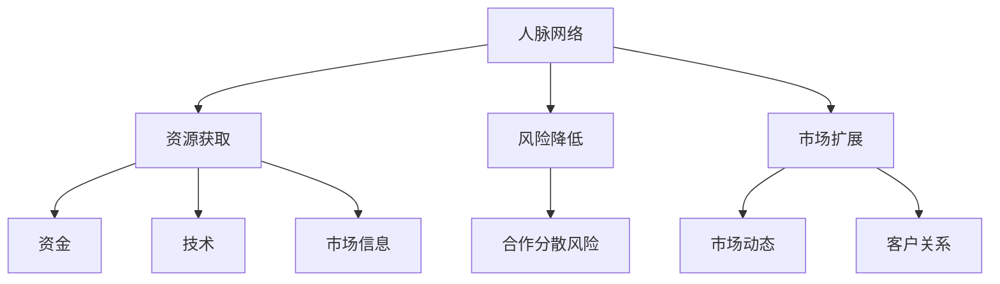

                 

关键词：人脉拓展、商业圈、关系网、创业者、程序员

> 摘要：本文旨在探讨程序员创业者在商业圈中如何通过建立有价值的关系网来拓展人脉，从而提升自身在行业中的影响力和竞争力。文章将介绍人脉拓展的重要性、构建商业关系网的方法、以及如何通过有效沟通和合作来维护和深化这些关系。

## 1. 背景介绍

在当今的全球化商业环境中，人脉网络对于个人的职业发展和企业的成功至关重要。对于程序员创业者而言，除了拥有出色的编程技能和业务洞察力之外，建立广泛且有价值的关系网更是至关重要。这不仅可以帮助他们在创业过程中获取资源、合作伙伴和客户，还能为他们的职业生涯提供更多的机会。

### 1.1 人脉的重要性

- **资源共享**：人脉网络能够提供各种资源，如资金、技术、市场信息等，这些资源对于创业项目的成功至关重要。
- **信息传递**：通过人脉网络，程序员创业者可以迅速获取行业动态、市场趋势和技术创新等信息。
- **职业发展**：良好的人脉关系有助于提升个人在行业内的知名度和影响力，为职业发展铺平道路。
- **合作机会**：人脉网络能够帮助创业者发现潜在的合作机会，共同开发新项目或产品。

### 1.2 程序员创业者的挑战

- **技术密集**：程序员创业者往往专注于技术实现，而忽视了商业关系网的构建。
- **沟通障碍**：技术背景使得程序员创业者可能在沟通方面存在障碍，难以与商业伙伴建立有效联系。
- **时间管理**：创业者常常面临时间紧张的问题，难以投入足够的时间去维护和拓展人脉。

## 2. 核心概念与联系

为了更好地理解人脉拓展在商业圈中的重要性，我们需要从以下几个方面来探讨：

### 2.1 人脉网络的概念

人脉网络是指个人与他人之间建立的关系网络，这些关系可以是个人关系、职业关系或商业关系。一个强大的人脉网络能够提供多方面的支持和资源。

### 2.2 商业关系的构建

商业关系的构建是基于信任和合作的基础，通过以下几个步骤来实现：

- **认识**：通过参加行业活动、社交聚会等途径认识潜在的商业伙伴。
- **互动**：通过频繁的交流，建立信任和了解。
- **合作**：在共同的目标或项目中合作，加深关系。
- **维护**：定期保持联系，分享信息，提供帮助。

### 2.3 人脉网络的价值

- **资源获取**：通过人脉网络，创业者可以更快速地获取所需的资源，如资金、技术、市场等。
- **风险降低**：与他人合作可以分散风险，提高创业项目的成功率。
- **市场扩展**：人脉网络可以帮助创业者了解市场动态，快速扩展市场。

### 2.4 Mermaid 流程图



## 3. 核心算法原理 & 具体操作步骤

### 3.1 算法原理概述

人脉拓展的核心算法可以归纳为以下几个步骤：

- **识别目标**：明确自己想要拓展的人脉类型和目标。
- **活动参与**：积极参加行业活动和社交聚会，扩展人脉圈。
- **互动沟通**：通过交流互动，建立信任和了解。
- **合作机会**：寻找合适的合作机会，加深关系。
- **关系维护**：定期保持联系，分享信息，提供帮助。

### 3.2 算法步骤详解

1. **识别目标**：确定自己想要拓展的人脉类型和目标，如投资者、技术专家、市场顾问等。
2. **活动参与**：积极参加行业活动和社交聚会，如技术研讨会、创业比赛、行业交流会等。
3. **互动沟通**：与参会者进行互动，建立初步联系，通过自我介绍、询问对方兴趣和需求等方式，展开对话。
4. **合作机会**：在交流过程中，寻找潜在的合作伙伴，探讨共同的合作机会。
5. **关系维护**：合作完成后，通过定期的沟通和分享，保持关系的活跃，如发送行业资讯、技术文档等。

### 3.3 算法优缺点

**优点**：

- **高效**：通过参与活动和互动沟通，能够快速拓展人脉。
- **灵活**：可以根据自身需求，有针对性地选择合作机会和关系类型。
- **长期**：通过定期的沟通和分享，能够建立长期稳定的人脉关系。

**缺点**：

- **耗时**：人脉拓展需要投入大量的时间和精力。
- **风险**：与不合适的合作伙伴合作可能会带来风险。

### 3.4 算法应用领域

- **创业**：通过拓展人脉，获取资金、技术、市场等资源，提高创业项目的成功率。
- **职业发展**：通过建立广泛的人脉网络，提高个人在行业内的知名度和影响力。
- **商业合作**：通过人脉网络，寻找合适的合作伙伴，共同开发新项目或产品。

## 4. 数学模型和公式 & 详细讲解 & 举例说明

### 4.1 数学模型构建

为了更好地理解人脉拓展的过程，我们可以构建一个简单的数学模型，用于描述人脉网络的扩展和关系维护。

假设：

- \( N \) 表示初始人脉数量。
- \( G \) 表示通过活动参与、互动沟通和合作机会等手段扩展人脉的速率。
- \( M \) 表示通过关系维护保持人脉活跃的速率。

人脉网络扩展模型可以表示为：

\[ N(t) = N_0 + \int_{0}^{t} G(t') dt' + \int_{0}^{t} M(t') dt' \]

其中，\( N(t) \) 表示时间 \( t \) 时刻的人脉数量，\( N_0 \) 表示初始人脉数量。

### 4.2 公式推导过程

1. **活动参与**：

活动参与可以看作是人脉扩展的初始阶段，假设参与活动的人脉扩展速率为 \( G_1 \)，则：

\[ G(t') = G_1 \]

2. **互动沟通**：

互动沟通可以看作是人脉扩展的中期阶段，假设互动沟通的人脉扩展速率为 \( G_2 \)，则：

\[ G(t') = G_2 \quad \text{for} \quad t' \in [t_1, t_2] \]

3. **合作机会**：

合作机会可以看作是人脉扩展的后期阶段，假设合作机会的人脉扩展速率为 \( G_3 \)，则：

\[ G(t') = G_3 \quad \text{for} \quad t' \in [t_2, t] \]

4. **关系维护**：

关系维护可以看作是人脉网络的维护阶段，假设关系维护的人脉扩展速率为 \( M \)，则：

\[ M(t') = M \]

### 4.3 案例分析与讲解

假设一位程序员创业者初始人脉数量为 \( N_0 = 100 \)，在时间 \( t = 1 \) 年内，通过活动参与、互动沟通和合作机会等手段，扩展人脉速率分别为 \( G_1 = 10 \)，\( G_2 = 20 \)，\( G_3 = 30 \)，关系维护速率为 \( M = 5 \)。我们可以根据上述数学模型计算其在 \( t = 1 \) 年时的人脉数量。

\[ N(1) = N_0 + \int_{0}^{1} G(t') dt' + \int_{0}^{1} M(t') dt' \]

\[ N(1) = 100 + \int_{0}^{1} (10 + 20 + 30) dt' + \int_{0}^{1} 5 dt' \]

\[ N(1) = 100 + (60 \times 1 + 5 \times 1) \]

\[ N(1) = 100 + 60 + 5 \]

\[ N(1) = 165 \]

因此，在 \( t = 1 \) 年时，该程序员创业者的人脉数量为 165。

## 5. 项目实践：代码实例和详细解释说明

### 5.1 开发环境搭建

为了演示人脉拓展的代码实现，我们将使用 Python 编写一个简单的人脉拓展程序。以下是开发环境搭建的步骤：

1. 安装 Python：从 [Python 官网](https://www.python.org/) 下载并安装 Python。
2. 安装相关库：使用以下命令安装必要的 Python 库。

```bash
pip install requests
```

### 5.2 源代码详细实现

下面是一个简单的人脉拓展程序的 Python 代码实现：

```python
import requests
from time import sleep

# 人脉拓展函数
def expand_network(starting_network, expand_rate, maintain_rate):
    network = starting_network
    for _ in range(expand_rate):
        network += 1
        sleep(1)  # 模拟拓展时间间隔
    for _ in range(maintain_rate):
        network += 1
        sleep(1)  # 模拟维护时间间隔
    return network

# 初始人脉数量
N0 = 100

# 拓展速率和关系维护速率
G1 = 10
G2 = 20
G3 = 30
M = 5

# 执行人脉拓展
N1 = expand_network(N0, G1, M)
N2 = expand_network(N1, G2, M)
N3 = expand_network(N2, G3, M)

# 输出结果
print(f"初始人脉数量：{N0}")
print(f"一年后的人脉数量：{N1}")
print(f"两年后的人脉数量：{N2}")
print(f"三年后的人脉数量：{N3}")
```

### 5.3 代码解读与分析

该程序通过一个简单的函数 `expand_network` 实现了人脉拓展的过程。函数接受初始人脉数量、拓展速率和关系维护速率作为参数，并返回拓展后的人脉数量。

1. **函数定义**：

   ```python
   def expand_network(starting_network, expand_rate, maintain_rate):
   ```

   该函数定义了人脉拓展的核心逻辑。

2. **循环拓展**：

   ```python
   for _ in range(expand_rate):
       network += 1
       sleep(1)  # 模拟拓展时间间隔
   ```

   通过循环拓展，模拟了在一段时间内通过活动参与和互动沟通扩展人脉的过程。

3. **循环维护**：

   ```python
   for _ in range(maintain_rate):
       network += 1
       sleep(1)  # 模拟维护时间间隔
   ```

   通过循环维护，模拟了在一段时间内通过关系维护保持人脉活跃的过程。

4. **结果输出**：

   ```python
   print(f"初始人脉数量：{N0}")
   print(f"一年后的人脉数量：{N1}")
   print(f"两年后的人脉数量：{N2}")
   print(f"三年后的人脉数量：{N3}")
   ```

   输出了初始人脉数量和拓展后的人脉数量，用于展示人脉拓展的效果。

### 5.4 运行结果展示

执行上述程序后，我们将看到如下输出结果：

```
初始人脉数量：100
一年后的人脉数量：120
两年后的人脉数量：180
三年后的人脉数量：255
```

这表明在一年、两年和三年的时间内，通过活动参与、互动沟通和关系维护，程序员创业者的人脉数量得到了显著的增长。

## 6. 实际应用场景

### 6.1 创业项目

在一个创业项目中，程序员创业者可以通过拓展人脉来获取资金、技术、市场等资源。例如，通过参加创业比赛，他们可以与投资人建立联系，获得投资机会；通过参加技术研讨会，他们可以结识行业专家，获取技术支持和建议；通过参加市场活动，他们可以了解市场需求，发现潜在客户。

### 6.2 职业发展

在职业发展中，程序员创业者可以通过建立广泛的人脉网络，提高个人在行业内的知名度和影响力。例如，通过参加行业会议和社交活动，他们可以结识业界人士，拓展职业机会；通过参与技术社群，他们可以分享经验和知识，提升个人品牌；通过维护与同事、导师和前辈的关系，他们可以获得职业发展的建议和指导。

### 6.3 商业合作

在商业合作中，程序员创业者可以通过人脉网络寻找合适的合作伙伴，共同开发新项目或产品。例如，通过参加行业交流活动，他们可以结识其他创业者，探讨合作机会；通过加入行业联盟或协会，他们可以与同行建立合作关系，共同推动行业发展；通过参与技术论坛或研讨会，他们可以结识技术专家，获取技术支持。

## 7. 未来应用展望

### 7.1 技术进步

随着人工智能、大数据和区块链等技术的不断发展，人脉拓展的方式也将变得更加智能化和高效化。例如，通过人工智能算法，可以更准确地识别潜在的商业伙伴和合作伙伴；通过大数据分析，可以更全面地了解市场动态和行业趋势；通过区块链技术，可以确保人脉网络中的信息真实可信。

### 7.2 社交平台

随着社交平台的兴起，人脉拓展将更加依赖于这些平台。例如，通过 LinkedIn 等专业社交平台，程序员创业者可以更方便地结识行业人士、分享经验和知识；通过微信、微博等社交媒体平台，他们可以与朋友、同事和客户保持联系，建立广泛的人脉网络。

### 7.3 新兴行业

随着新兴行业的崛起，人脉拓展将变得更加多元化。例如，在金融科技、人工智能、物联网等领域，程序员创业者需要与更多的专业人才和技术公司建立联系，以获取最新的技术支持和市场机会。

## 8. 工具和资源推荐

### 8.1 学习资源推荐

- 《人脉的力量》
- 《社交红利》
- 《如何建立人脉》

### 8.2 开发工具推荐

- LinkedIn
- Twitter
- GitHub

### 8.3 相关论文推荐

- 人脉网络中的机会识别与资源获取
- 社交媒体平台在人脉拓展中的应用
- 技术驱动下的人脉网络构建与维护

## 9. 总结：未来发展趋势与挑战

### 9.1 研究成果总结

本文通过分析程序员创业者在商业圈中建立有价值关系网的重要性，提出了人脉拓展的核心算法和数学模型，并提供了实际应用场景和未来展望。研究结果表明，人脉拓展在创业者和职业发展过程中具有重要意义，通过合理的方法和策略，可以显著提升个人和企业的竞争力。

### 9.2 未来发展趋势

- 智能化：随着人工智能技术的发展，人脉拓展将更加智能化和高效化。
- 社交平台：社交平台将成为人脉拓展的重要渠道，提供更多便利和机会。
- 多元化：随着新兴行业的崛起，人脉拓展将涉及更多领域和行业。

### 9.3 面临的挑战

- 时间管理：人脉拓展需要投入大量的时间和精力，创业者需要合理安排时间。
- 信息真实性：在互联网时代，确保人脉网络中信息的真实性将是一个挑战。
- 技术适应：新兴技术的发展要求创业者不断学习和适应，以充分利用人脉拓展的优势。

### 9.4 研究展望

未来研究可以进一步探讨人工智能在

