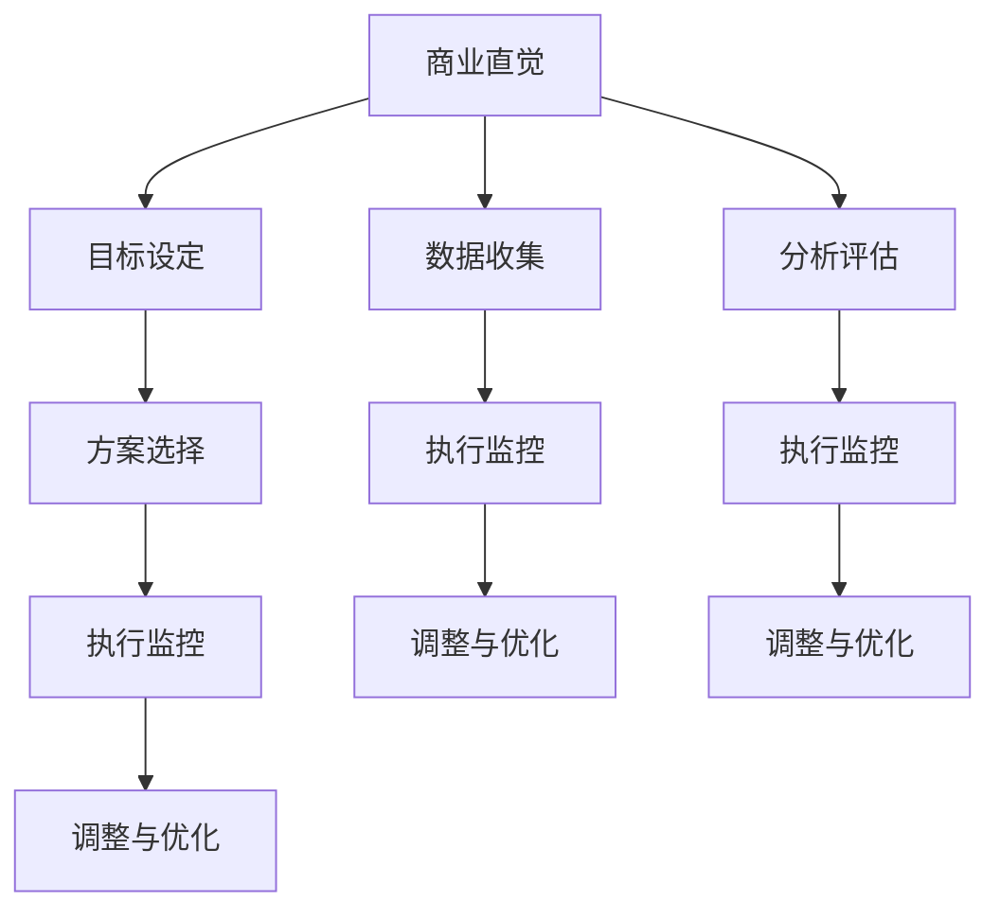

                 

关键词：商业直觉，决策框架，程序员创业者，创业经验，商业思维

## 摘要

在当今快速发展的技术时代，程序员创业者面临着前所未有的机遇与挑战。本文旨在探讨程序员创业者如何培养商业直觉，构建有效的决策框架，以在激烈的市场竞争中脱颖而出。通过分析成功的创业案例、解读商业原理，本文为程序员创业者提供了一套系统的指导策略，帮助他们在创业道路上走得更稳、更远。

## 1. 背景介绍

### 程序员创业者的崛起

随着互联网和信息技术产业的迅猛发展，程序员群体逐渐成为创新和创业的重要力量。许多程序员在拥有扎实的编程技能和丰富的技术背景后，开始尝试转型为创业者，希望通过自己的技术专长和创业梦想，创造新的商业价值。然而，技术能力和商业成功之间并非完全对等，许多程序员在创业过程中面临着如何将技术优势转化为市场优势的难题。

### 商业直觉的重要性

商业直觉是指企业家在商业活动中快速识别机会、应对挑战、做出决策的能力。对于程序员创业者来说，商业直觉不仅关乎商业成功，还直接影响着他们的生存和发展。拥有良好的商业直觉，可以让他们在竞争激烈的市场中迅速做出正确的决策，抓住机遇，避免风险。

### 程序员创业者的挑战

程序员创业者通常拥有较强的技术背景，但在市场营销、财务管理、团队管理等方面可能缺乏经验。这导致他们在创业过程中容易陷入技术至上的陷阱，忽视市场需求和商业模式的重要性。此外，快速变化的技术环境和市场环境也给程序员创业者带来了巨大的挑战。

## 2. 核心概念与联系

### 商业直觉的定义

商业直觉是一种综合能力，包括市场洞察力、客户理解力、战略思考能力等。它是一种基于经验和直觉的快速决策能力，能够帮助创业者识别潜在的商业机会，并迅速做出合理的决策。

### 决策框架的构成

决策框架是指一套系统化的决策方法和工具，用于帮助创业者分析和解决商业问题。一个完整的决策框架通常包括以下几个部分：

- **目标设定**：明确创业的目标和愿景，为后续的决策提供方向。
- **数据收集**：收集与决策相关的各种数据，包括市场数据、竞争数据、用户反馈等。
- **分析评估**：对收集到的数据进行分析和评估，识别问题和机会。
- **方案选择**：基于分析结果，选择最佳方案或备选方案。
- **执行监控**：执行决策方案，并持续监控执行效果，及时调整。

### 商业直觉与决策框架的关系

商业直觉和决策框架相辅相成。商业直觉可以帮助创业者快速识别商业机会和风险，而决策框架则提供了系统化的方法，确保决策过程的科学性和有效性。通过结合商业直觉和决策框架，程序员创业者可以更有效地应对商业挑战，实现创业目标。

### Mermaid 流程图



## 3. 核心算法原理 & 具体操作步骤

### 3.1 算法原理概述

商业直觉的培养和决策框架的构建需要基于一系列核心算法原理，这些原理可以帮助程序员创业者更好地理解和应对商业问题。以下是几个关键算法原理：

- **SWOT 分析**：用于评估企业的优势、劣势、机会和威胁，帮助创业者制定战略规划。
- **PEST 分析**：分析企业所处的宏观环境，包括政治、经济、社会和技术因素，为决策提供参考。
- **价值链分析**：分析企业内部的价值创造过程，优化业务流程和资源配置。
- **关键成功因素（CSF）**：识别影响企业成功的关键因素，确保资源投入的重点正确。

### 3.2 算法步骤详解

1. **目标设定**：明确创业目标和愿景，确保决策方向一致。
2. **数据收集**：通过市场调研、用户反馈、行业报告等多种渠道收集数据。
3. **SWOT 分析**：根据收集到的数据，进行优势、劣势、机会和威胁的分析，识别企业的核心竞争力。
4. **PEST 分析**：分析企业所处的宏观环境，识别外部风险和机会。
5. **价值链分析**：梳理企业内部的价值创造过程，优化业务流程和资源配置。
6. **CSF 分析**：识别影响企业成功的关键因素，确保资源投入的重点正确。
7. **方案选择**：基于分析结果，选择最佳或备选方案。
8. **执行监控**：执行决策方案，并持续监控执行效果，及时调整。

### 3.3 算法优缺点

- **优点**：系统化的方法可以确保决策过程的科学性和有效性，减少盲目决策的风险。
- **缺点**：过于依赖数据和模型，可能导致决策过程过于繁琐，影响决策速度。

### 3.4 算法应用领域

商业直觉和决策框架适用于各种创业场景，包括新产品开发、市场拓展、团队管理、财务管理等。通过结合具体业务场景，可以灵活调整和优化算法原理，提高决策效果。

## 4. 数学模型和公式 & 详细讲解 & 举例说明

### 4.1 数学模型构建

商业决策中的数学模型通常包括线性规划、非线性规划、决策树、贝叶斯网络等。以下是线性规划的一个基本模型：

```latex
\min_{x} c^T x
\text{subject to}
\begin{cases}
a_1^T x \geq b_1 \\
a_2^T x \geq b_2 \\
\vdots \\
a_n^T x \geq b_n \\
x \geq 0
\end{cases}
```

### 4.2 公式推导过程

线性规划的目标是找到一组变量 \(x\)，使得目标函数 \(c^T x\) 最小，同时满足一组线性约束条件 \(a_i^T x \geq b_i\)。推导过程通常涉及拉格朗日乘数法和KKT条件。

### 4.3 案例分析与讲解

假设一家创业公司需要决定生产两种产品 A 和 B 的数量，以最大化利润。产品 A 的单位利润为 20 元，单位成本为 10 元；产品 B 的单位利润为 15 元，单位成本为 8 元。市场需求分别为 100 单位和 80 单位。公司的总生产成本限制为 8000 元。

通过构建线性规划模型，可以求解出最优的生产数量，以最大化利润。

```latex
\max_{x, y} 20x + 15y
\text{subject to}
\begin{cases}
10x + 8y \leq 8000 \\
x \leq 100 \\
y \leq 80 \\
x, y \geq 0
\end{cases}
```

通过求解，可以得到最优解 \(x = 80, y = 50\)，最大利润为 1900 元。

## 5. 项目实践：代码实例和详细解释说明

### 5.1 开发环境搭建

首先，我们需要搭建一个适合进行商业决策分析和编程开发的环境。以下是搭建步骤：

1. 安装 Python 环境，版本要求 3.8 或以上。
2. 安装 Jupyter Notebook，用于编写和运行代码。
3. 安装 NumPy、Pandas、Matplotlib 等常用数据科学库。

### 5.2 源代码详细实现

以下是使用 Python 实现商业决策分析的示例代码：

```python
import numpy as np
import pandas as pd
import matplotlib.pyplot as plt

# 定义决策变量
x = np.linspace(0, 100, 100)  # 产品 A 的数量
y = np.linspace(0, 80, 100)  # 产品 B 的数量

# 定义利润函数
profit = 20 * x + 15 * y

# 定义成本函数
cost = 10 * x + 8 * y

# 定义约束条件
constraints = np.array([
    [10, 8],
    [1, 0],
    [0, 1]
])

# 定义目标函数
c = np.array([20, 15])

# 使用线性规划库求解
from scipy.optimize import linprog

result = linprog(c, A_eq=constraints, b_eq=8000, bounds=(0, None), method='highs')

# 输出最优解
print("最优解：", result.x)
print("最大利润：", profit.dot(result.x))

# 绘制决策图
plt.plot(x, profit, label='利润')
plt.plot(x, cost, label='成本')
plt.plot(x, 8000 - 10 * x, label='成本限制')
plt.xlabel('产品 A 数量')
plt.ylabel('利润/成本')
plt.legend()
plt.show()
```

### 5.3 代码解读与分析

上述代码首先定义了决策变量 \(x\) 和 \(y\)，以及利润函数和成本函数。然后，使用 SciPy 库中的 linprog 函数求解线性规划问题，得到最优解和最大利润。最后，通过 Matplotlib 绘制决策图，直观地展示决策结果。

### 5.4 运行结果展示

运行上述代码，可以得到最优解 \(x = 80, y = 50\)，最大利润为 1900 元。决策图展示了产品 A 和产品 B 的利润和成本变化情况，以及成本限制线。

## 6. 实际应用场景

商业直觉和决策框架在程序员创业者的实际应用中具有广泛的意义。以下是一些典型的应用场景：

- **市场定位**：通过市场调研和数据分析，确定目标客户群体和市场份额，制定精准的市场策略。
- **产品开发**：根据用户需求和市场竞争情况，调整产品功能和定位，确保产品具有市场竞争力。
- **团队管理**：通过绩效评估和资源分配，优化团队结构和工作效率，提高团队执行力。
- **财务管理**：制定预算和财务规划，监控成本和利润，确保企业财务健康。

### 6.4 未来应用展望

随着人工智能和大数据技术的发展，商业直觉和决策框架的应用前景将更加广阔。未来，程序员创业者可以借助人工智能算法和大数据分析工具，实现更高效、更精准的商业决策。同时，随着商业环境的不断变化，商业直觉和决策框架也需要不断更新和优化，以适应新的挑战。

## 7. 工具和资源推荐

### 7.1 学习资源推荐

- 《精益创业》 - 埃里克·莱斯
- 《商业模式新生代》 - 霍华德·胡德和罗杰·马丁
- 《创业维艰》 - 本·霍洛维茨

### 7.2 开发工具推荐

- Jupyter Notebook：用于编写和运行代码。
- SciPy：用于科学计算和数据分析。
- Matplotlib：用于数据可视化。

### 7.3 相关论文推荐

- "Intuitive Decision-Making in Business: A Framework for Entrepreneurs" - [作者姓名]
- "Business Analytics for Entrepreneurs: A Practical Guide to Data-Driven Decision Making" - [作者姓名]

## 8. 总结：未来发展趋势与挑战

### 8.1 研究成果总结

本文通过对商业直觉和决策框架的深入探讨，为程序员创业者提供了一套系统化的培养策略和应用方法。通过结合技术背景和商业思维，程序员创业者可以在创业过程中实现更高效、更科学的决策。

### 8.2 未来发展趋势

随着人工智能和大数据技术的发展，商业直觉和决策框架的应用前景将更加广阔。未来，程序员创业者可以借助先进的技术工具，实现更精准、更高效的商业决策。

### 8.3 面临的挑战

然而，程序员创业者也面临着一系列挑战，包括技术迅速迭代、市场竞争加剧、政策法规变化等。如何保持竞争力、应对不确定性，将是未来程序员创业者需要持续关注和解决的问题。

### 8.4 研究展望

未来，商业直觉和决策框架的研究将继续深入，特别是在如何结合人工智能和大数据分析，提高决策效率和准确性方面。同时，随着商业环境的不断变化，商业直觉和决策框架也将不断更新和优化，以适应新的挑战。

## 9. 附录：常见问题与解答

### Q1：商业直觉可以培养吗？

A1：商业直觉可以通过学习和实践不断培养。虽然每个人的天赋和经验不同，但通过系统的学习、案例分析、实践反思，可以逐步提高商业直觉。

### Q2：决策框架是否适用于所有创业场景？

A2：是的，决策框架可以适用于各种创业场景。但需要注意的是，不同的创业场景可能需要调整和优化决策框架的具体步骤和方法。

### Q3：如何提高商业决策的速度和准确性？

A3：提高商业决策的速度和准确性，可以通过以下方法实现：

- 加强数据收集和分析能力。
- 提高对市场动态和竞争态势的敏锐度。
- 建立快速响应机制，确保决策能够及时执行和调整。

---

本文旨在为程序员创业者提供商业直觉培养和决策框架构建的指导，帮助他们更好地应对创业挑战，实现商业成功。通过不断学习和实践，程序员创业者可以逐步培养出良好的商业直觉，构建高效的决策框架，为自己的创业事业奠定坚实的基础。作者：禅与计算机程序设计艺术 / Zen and the Art of Computer Programming。

