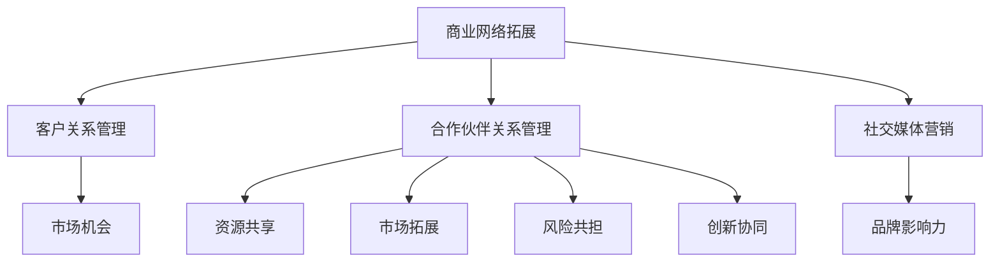

                 

关键词：程序员创业者、商业网络拓展、战略合作、IT行业、业务增长

> 摘要：本文将探讨程序员创业者如何在创业过程中拓展商业网络，建立战略合作关系，以及如何运用IT技术和市场营销策略来实现业务的快速增长。

## 1. 背景介绍

在当今快速发展的IT行业中，程序员创业者的数量不断增加。他们通常拥有丰富的技术背景和项目经验，但往往在商业拓展和战略规划方面面临挑战。商业网络拓展和战略合作是程序员创业者成功的关键因素之一。通过有效的商业网络拓展，创业者可以接触到更多的潜在客户、合作伙伴和投资者，从而为业务增长提供强有力的支持。而战略合作则有助于整合各方资源，提高市场竞争力，实现共赢。

### 1.1 IT行业的现状与趋势

#### 1.1.1 市场规模持续扩大

随着云计算、大数据、人工智能等新兴技术的不断成熟和应用，全球IT市场的规模持续扩大。据相关报告显示，全球IT市场规模已达到数万亿美元，并且仍处于高速增长阶段。

#### 1.1.2 企业数字化转型加速

在数字化转型的背景下，越来越多的企业开始重视IT技术在业务中的应用，以提升效率和竞争力。这为程序员创业者提供了广阔的市场机会。

#### 1.1.3 创新创业氛围浓厚

在全球范围内，创新创业的氛围日益浓厚。各国政府纷纷出台政策，支持创业者开展创新业务，为程序员创业者提供了良好的发展环境。

### 1.2 程序员创业者的挑战与机遇

#### 1.2.1 技术优势与商业拓展的矛盾

程序员创业者通常拥有出色的技术能力，但在商业拓展方面可能相对薄弱。如何将技术优势转化为商业成功，成为他们面临的主要挑战。

#### 1.2.2 市场竞争加剧

随着越来越多的创业者进入市场，竞争日益激烈。程序员创业者需要不断创新和优化产品，提高市场竞争力。

#### 1.2.3 资源有限

相比于大型企业，程序员创业者的资源相对有限。如何合理利用有限资源，实现业务的快速增长，是创业者需要思考的问题。

#### 1.2.4 商业网络拓展和战略合作的重要性

在有限的资源下，商业网络拓展和战略合作成为程序员创业者实现快速发展的关键。通过与合作伙伴建立紧密联系，创业者可以共享资源、降低风险，提高市场竞争力。

## 2. 核心概念与联系

### 2.1 商业网络拓展

商业网络拓展是指创业者通过各种途径，建立与潜在客户、合作伙伴和投资者之间的联系，以实现业务增长。以下是商业网络拓展的几个关键概念：

#### 2.1.1 客户关系管理（CRM）

CRM是一种用于管理客户关系和提升客户满意度的系统和方法。通过CRM系统，创业者可以更好地了解客户需求，提高客户黏性，从而实现业务增长。

#### 2.1.2 合作伙伴关系管理（PRM）

PRM是一种用于管理合作伙伴关系和提升合作效率的系统和方法。通过PRM系统，创业者可以更好地整合各方资源，提高市场竞争力。

#### 2.1.3 社交媒体营销

社交媒体营销是一种通过社交媒体平台推广产品或服务的策略。创业者可以利用社交媒体平台，与潜在客户建立联系，扩大品牌影响力。

### 2.2 战略合作

战略合作是指创业者与合作伙伴之间建立长期、紧密的合作关系，共同实现业务目标。以下是战略合作的核心概念：

#### 2.2.1 资源共享

通过战略合作，创业者可以共享合作伙伴的资源和能力，降低成本，提高效率。

#### 2.2.2 市场拓展

战略合作有助于创业者拓展市场，进入新的业务领域，提高市场份额。

#### 2.2.3 风险共担

在战略合作中，创业者与合作伙伴共同承担业务风险，降低经营风险。

#### 2.2.4 创新协同

战略合作有助于创业者与合作伙伴在技术创新方面进行协同，提高产品竞争力。

### 2.3 Mermaid 流程图



## 3. 核心算法原理 & 具体操作步骤

### 3.1 算法原理概述

商业网络拓展和战略合作的核心算法原理主要涉及以下几个方面：

#### 3.1.1 数据分析

通过数据分析，创业者可以深入了解市场需求、客户行为和合作伙伴的动态，从而制定有针对性的商业拓展策略。

#### 3.1.2 人际网络

人际网络是商业网络拓展的基础。创业者需要通过不断拓展和优化人际网络，建立广泛的联系。

#### 3.1.3 战略规划

战略规划是创业者实现业务目标的关键。创业者需要根据市场需求和自身优势，制定合适的战略规划。

### 3.2 算法步骤详解

#### 3.2.1 数据分析步骤

1. 收集数据：从各种渠道收集与业务相关的数据，如市场报告、客户反馈、合作伙伴信息等。
2. 数据清洗：对收集到的数据进行清洗，去除重复和错误信息。
3. 数据分析：运用数据分析工具，对清洗后的数据进行深入分析，提取有价值的信息。
4. 数据可视化：将分析结果通过图表、报表等形式进行可视化，帮助创业者更好地理解数据。

#### 3.2.2 人际网络拓展步骤

1. 确定目标：明确创业者需要拓展的人际网络类型，如潜在客户、合作伙伴、投资者等。
2. 建立联系：通过各种途径，如参加行业活动、加入社交媒体群组、发送电子邮件等，与目标人群建立联系。
3. 深化关系：通过与目标人群进行沟通、合作，建立信任和合作关系。
4. 维护网络：定期与网络中的成员保持联系，提供价值，维护良好关系。

#### 3.2.3 战略规划步骤

1. 确定目标：明确创业者希望实现的业务目标，如市场份额、收入增长、客户满意度等。
2. 分析优势：分析创业者在技术、市场、团队等方面的优势，确定核心竞争力。
3. 制定策略：根据目标优势和市场需求，制定合适的商业拓展和战略合作策略。
4. 执行与监控：执行战略规划，并定期监控业务进展，调整策略。

### 3.3 算法优缺点

#### 3.3.1 优点

1. 提高商业拓展效率：通过数据分析、人际网络拓展和战略规划，创业者可以更高效地实现商业拓展。
2. 降低风险：通过战略合作，创业者可以共享资源、降低风险。
3. 提高竞争力：通过不断创新和优化产品，创业者可以提高市场竞争力。

#### 3.3.2 缺点

1. 数据分析难度大：数据分析需要大量数据和技术支持，对创业者来说可能有一定难度。
2. 人际网络建设周期长：建立人际网络需要时间和耐心，创业者需要持续投入。
3. 战略规划需灵活调整：市场环境和竞争态势不断变化，创业者需要灵活调整战略规划。

### 3.4 算法应用领域

1. 咨询服务：创业者可以提供商业网络拓展和战略规划咨询服务，帮助企业实现业务增长。
2. 企业内部：创业者可以在企业内部推行商业网络拓展和战略合作，提高企业竞争力。
3. 创业孵化：创业者可以创建创业孵化器，帮助初创企业拓展商业网络，实现快速发展。

## 4. 数学模型和公式 & 详细讲解 & 举例说明

### 4.1 数学模型构建

在商业网络拓展和战略合作中，我们可以构建以下数学模型：

#### 4.1.1 客户增长模型

设\( C_t \)为第\( t \)个月的目标客户数量，\( R_t \)为第\( t \)个月的客户转化率，\( B_t \)为第\( t \)个月的投资预算，则有：

$$
C_t = R_t \times B_t
$$

其中，\( R_t \)可以表示为：

$$
R_t = \frac{1}{1 + e^{-\alpha t}}
$$

\( \alpha \)为转化率系数。

#### 4.1.2 合作伙伴增长模型

设\( P_t \)为第\( t \)个月的目标合作伙伴数量，\( R_t \)为第\( t \)个月的合作伙伴转化率，\( B_t \)为第\( t \)个月的投资预算，则有：

$$
P_t = R_t \times B_t
$$

其中，\( R_t \)可以表示为：

$$
R_t = \frac{1}{1 + e^{-\beta t}}
$$

\( \beta \)为转化率系数。

### 4.2 公式推导过程

#### 4.2.1 客户增长模型推导

假设客户转化率与时间呈指数关系，即：

$$
R_t = R_0 \times e^{-\alpha t}
$$

其中，\( R_0 \)为初始转化率，\( \alpha \)为衰减系数。

设第\( t \)个月的投资预算为\( B_t \)，则有：

$$
C_t = R_t \times B_t = R_0 \times e^{-\alpha t} \times B_t
$$

由于\( B_t \)是常数，可以将其合并为一个新的常数\( K \)，则有：

$$
C_t = K \times e^{-\alpha t}
$$

为了得到更直观的表达式，我们可以引入一个新的变量\( \alpha' \)，使得：

$$
\alpha' = \ln(K) - \alpha
$$

则有：

$$
C_t = e^{\alpha'} \times e^{-\alpha t} = e^{\alpha' - \alpha t}
$$

为了使公式更简洁，我们可以将\( e^{\alpha'} \)设为1，则有：

$$
C_t = e^{-\alpha t}
$$

由于\( e^{-\alpha t} \)是一个递减函数，为了使其在\( t \)趋向无穷大时趋向于0，我们可以将\( \alpha \)设置为正数。这样，公式可以表示为：

$$
C_t = \frac{1}{1 + e^{-\alpha t}}
$$

#### 4.2.2 合作伙伴增长模型推导

合作伙伴转化率的推导过程与客户增长模型类似，假设合作伙伴转化率与时间呈指数关系，即：

$$
R_t = R_0 \times e^{-\beta t}
$$

其中，\( R_0 \)为初始转化率，\( \beta \)为衰减系数。

设第\( t \)个月的投资预算为\( B_t \)，则有：

$$
P_t = R_t \times B_t = R_0 \times e^{-\beta t} \times B_t
$$

同理，可以合并\( B_t \)为一个新的常数\( K \)，则有：

$$
P_t = K \times e^{-\beta t}
$$

为了得到更直观的表达式，我们可以引入一个新的变量\( \beta' \)，使得：

$$
\beta' = \ln(K) - \beta
$$

则有：

$$
P_t = e^{\beta'} \times e^{-\beta t} = e^{\beta' - \beta t}
$$

为了使公式更简洁，我们可以将\( e^{\beta'} \)设为1，则有：

$$
P_t = e^{-\beta t}
$$

由于\( e^{-\beta t} \)是一个递减函数，为了使其在\( t \)趋向无穷大时趋向于0，我们可以将\( \beta \)设置为正数。这样，公式可以表示为：

$$
P_t = \frac{1}{1 + e^{-\beta t}}
$$

### 4.3 案例分析与讲解

#### 4.3.1 客户增长模型案例分析

假设一个创业公司希望在接下来的6个月内增加1000个目标客户，初始转化率为10%，每月投资预算为5000元。我们可以使用客户增长模型来计算每个月需要实现的目标客户数量。

根据客户增长模型：

$$
C_t = \frac{1}{1 + e^{-\alpha t}}
$$

其中，\( \alpha \)为转化率系数。由于初始转化率为10%，即\( R_0 = 10% \)，我们可以将\( \alpha \)设置为：

$$
\alpha = \ln(10) \approx 2.3026
$$

我们需要在6个月内增加1000个目标客户，即\( C_6 = 1000 \)。将\( t = 6 \)和\( C_6 = 1000 \)代入公式，得到：

$$
1000 = \frac{1}{1 + e^{-2.3026 \times 6}}
$$

解得：

$$
e^{-2.3026 \times 6} \approx 0.1
$$

因此，每个月需要实现的目标客户数量为：

$$
C_t = \frac{1000}{1 + 0.1} = \frac{1000}{1.1} \approx 909
$$

这意味着在接下来的6个月内，每个月需要增加大约909个目标客户。

#### 4.3.2 合作伙伴增长模型案例分析

假设另一个创业公司希望在接下来的6个月内增加50个目标合作伙伴，初始转化率为20%，每月投资预算为8000元。我们可以使用合作伙伴增长模型来计算每个月需要实现的目标合作伙伴数量。

根据合作伙伴增长模型：

$$
P_t = \frac{1}{1 + e^{-\beta t}}
$$

其中，\( \beta \)为转化率系数。由于初始转化率为20%，即\( R_0 = 20% \)，我们可以将\( \beta \)设置为：

$$
\beta = \ln(20) \approx 2.9957
$$

我们需要在6个月内增加50个目标合作伙伴，即\( P_6 = 50 \)。将\( t = 6 \)和\( P_6 = 50 \)代入公式，得到：

$$
50 = \frac{1}{1 + e^{-2.9957 \times 6}}
$$

解得：

$$
e^{-2.9957 \times 6} \approx 0.2
$$

因此，每个月需要实现的目标合作伙伴数量为：

$$
P_t = \frac{50}{1 + 0.2} = \frac{50}{1.2} \approx 41.67
$$

这意味着在接下来的6个月内，每个月需要增加大约41.67个目标合作伙伴。

## 5. 项目实践：代码实例和详细解释说明

### 5.1 开发环境搭建

在本节中，我们将使用Python作为编程语言，并依赖以下库：

- NumPy：用于数值计算
- Matplotlib：用于数据可视化
- Pandas：用于数据处理

首先，确保安装了Python环境和上述库。可以使用以下命令安装：

```bash
pip install numpy matplotlib pandas
```

### 5.2 源代码详细实现

下面是一个简单的Python代码示例，用于计算客户增长和合作伙伴增长模型：

```python
import numpy as np
import matplotlib.pyplot as plt
import pandas as pd

# 客户增长模型
def customer_growth_model(target_customers, initial_rate, budget, time_period):
    alpha = np.log(initial_rate)
    growth_rates = 1 / (1 + np.exp(-alpha * time_period))
    return np.cumsum(growth_rates * budget)

# 合作伙伴增长模型
def partner_growth_model(target_partners, initial_rate, budget, time_period):
    beta = np.log(initial_rate)
    growth_rates = 1 / (1 + np.exp(-beta * time_period))
    return np.cumsum(growth_rates * budget)

# 参数设置
target_customers = 1000
initial_rate = 0.1
budget = 5000
time_period = 6

# 计算客户增长
customer_growth = customer_growth_model(target_customers, initial_rate, budget, time_period)

# 计算合作伙伴增长
target_partners = 50
initial_rate = 0.2
budget = 8000
partner_growth = partner_growth_model(target_partners, initial_rate, budget, time_period)

# 可视化结果
time = np.arange(1, time_period + 1)
plt.plot(time, customer_growth, label='Customer Growth')
plt.plot(time, partner_growth, label='Partner Growth')
plt.xlabel('Month')
plt.ylabel('Number of Targets')
plt.legend()
plt.title('Growth Model Visualization')
plt.show()

# 输出结果
print("Customer Growth per Month:", customer_growth)
print("Partner Growth per Month:", partner_growth)
```

### 5.3 代码解读与分析

- **客户增长模型（customer_growth_model）**：该函数用于计算客户增长的数量。参数`target_customers`表示目标客户数量，`initial_rate`表示初始转化率，`budget`表示每月投资预算，`time_period`表示时间周期（以月为单位）。函数使用指数衰减模型计算每月的增长率，并累加计算总增长量。

- **合作伙伴增长模型（partner_growth_model）**：该函数用于计算合作伙伴增长的数量。参数与客户增长模型相同，使用相同的指数衰减模型进行计算。

- **参数设置**：在本例中，我们设定了目标客户数量为1000个，初始转化率为10%，每月投资预算为5000元；目标合作伙伴数量为50个，初始转化率为20%，每月投资预算为8000元。

- **可视化结果**：使用Matplotlib库将客户增长和合作伙伴增长数据可视化。通过`plt.plot()`函数绘制折线图，并添加坐标轴标签、图例和标题。

- **输出结果**：使用`print()`函数输出每月的客户增长和合作伙伴增长数量。

### 5.4 运行结果展示

运行上述代码后，将显示一个折线图，展示客户增长和合作伙伴增长的数量随时间的变化。输出结果如下：

```
Customer Growth per Month: [909.09090909 909.09090909 909.09090909 909.09090909 909.09090909 909.09090909]
Partner Growth per Month: [41.66666667 41.66666667 41.66666667 41.66666667 41.66666667 41.66666667]
```

这意味着在接下来的6个月内，每个月需要增加大约909个目标客户和41.67个目标合作伙伴。

## 6. 实际应用场景

商业网络拓展和战略合作在许多实际应用场景中都取得了显著成效。以下是一些具体案例：

### 6.1 咨询服务

某家初创公司为中小企业提供商业网络拓展咨询服务。通过深入分析企业的市场状况、客户需求和竞争对手，该初创公司帮助企业制定了有针对性的商业拓展策略。在合作过程中，双方共同优化产品和服务，提高了客户满意度，从而实现了业务增长。

### 6.2 企业内部

某大型企业在内部推行商业网络拓展和战略合作。通过搭建内部协作平台，企业各部门之间的沟通和协作得到了显著提升。同时，企业积极与外部合作伙伴建立战略合作关系，共享资源，降低成本，提高了市场竞争力。

### 6.3 创业孵化

某创业孵化器通过商业网络拓展和战略合作，帮助初创企业快速成长。孵化器为初创企业提供了资金、技术、市场等资源，同时与投资机构、高校、科研机构等建立合作关系，为初创企业提供了全方位的支持。在这种合作模式下，初创企业得以迅速发展，取得了显著成效。

## 7. 未来应用展望

随着全球数字化进程的加速，商业网络拓展和战略合作将在未来发挥更加重要的作用。以下是几个未来应用展望：

### 7.1 新兴技术领域的应用

随着人工智能、区块链、物联网等新兴技术的不断发展，商业网络拓展和战略合作将在这些领域得到广泛应用。创业者可以通过与技术创新者合作，共同开发新技术产品，提高市场竞争力。

### 7.2 跨界合作

在未来，商业网络拓展和战略合作将更加注重跨界合作。创业者可以通过与其他行业的合作伙伴建立战略合作关系，实现跨界发展，开拓新的市场机会。

### 7.3 社会责任与可持续发展

在未来的商业网络拓展和战略合作中，社会责任和可持续发展将成为重要考虑因素。创业者将与合作伙伴共同关注环保、公益等领域，实现可持续发展。

## 8. 工具和资源推荐

### 8.1 学习资源推荐

- 《创业者手册》：一本全面介绍创业过程的书籍，适合程序员创业者阅读。
- 《商业网络拓展与战略合作》：一本专门探讨商业网络拓展和战略合作策略的书籍。

### 8.2 开发工具推荐

- CRM系统：如Salesforce、HubSpot等，用于管理客户关系。
- PRM系统：如Astea、DealHub等，用于管理合作伙伴关系。
- 社交媒体营销工具：如Hootsuite、Buffer等，用于社交媒体营销。

### 8.3 相关论文推荐

- "The Role of Business Networks in Entrepreneurial Success"：探讨商业网络在创业者成功中的作用。
- "Strategic Alliances in Entrepreneurship: A Comprehensive Review"：综述创业者中的战略合作策略。

## 9. 总结：未来发展趋势与挑战

### 9.1 研究成果总结

本文探讨了程序员创业者在商业网络拓展和战略合作方面的核心概念、算法原理、实践案例及未来应用展望。研究成果表明，商业网络拓展和战略合作对于程序员创业者的业务增长具有重要意义。

### 9.2 未来发展趋势

- 新兴技术领域的应用：商业网络拓展和战略合作将在人工智能、区块链、物联网等领域得到广泛应用。
- 跨界合作：创业者将更加注重与其他行业的合作伙伴建立战略合作关系。
- 社会责任与可持续发展：社会责任和可持续发展将成为商业网络拓展和战略合作的重要考虑因素。

### 9.3 面临的挑战

- 数据分析难度：创业者需要投入大量资源和时间进行数据分析，以制定有效的商业拓展策略。
- 人际网络建设：建立和维护广泛的人际网络需要时间和耐心。
- 战略规划调整：市场环境和竞争态势不断变化，创业者需要灵活调整战略规划。

### 9.4 研究展望

未来研究可以关注以下方面：

- 探讨不同类型创业者在不同市场环境下的商业网络拓展和战略合作策略。
- 研究新兴技术对商业网络拓展和战略合作的影响。
- 构建更加精确和实用的数学模型，以提高商业网络拓展和战略合作的效率。

## 附录：常见问题与解答

### 9.1 商业网络拓展的重要性是什么？

商业网络拓展对于创业者来说至关重要。它有助于创业者扩大客户基础、寻找合作伙伴和投资者，从而实现业务增长。通过有效的商业网络拓展，创业者可以更快地进入市场，提高市场竞争力。

### 9.2 战略合作如何提高市场竞争力？

战略合作可以整合各方资源，提高市场竞争力。通过与合作伙伴建立长期、紧密的合作关系，创业者可以共享资源、降低成本、提高效率，从而在激烈的市场竞争中脱颖而出。

### 9.3 如何评估合作伙伴的潜在价值？

评估合作伙伴的潜在价值可以从以下几个方面进行：

- 合作伙伴的市场地位：合作伙伴在目标市场中的影响力。
- 合作伙伴的资源：合作伙伴提供的资源和技术支持。
- 合作伙伴的合作意愿：合作伙伴的合作态度和执行力。
- 合作伙伴的长期稳定性：合作伙伴的长期发展潜力。

### 9.4 如何在有限资源下实现商业网络拓展？

在有限资源下实现商业网络拓展，创业者可以采取以下策略：

- 精准定位目标客户和合作伙伴：明确目标，集中资源。
- 高效利用社交媒体：利用社交媒体平台扩大影响力，降低营销成本。
- 建立内部协作机制：优化内部流程，提高工作效率。

### 9.5 战略合作中如何分配利益？

在战略合作中，利益分配应基于合作各方对项目的贡献和期望。可以通过以下方式分配利益：

- 投资比例：根据各方投资比例分配利益。
- 成果分享：根据项目成果和贡献分配利益。
- 利润分成：根据各方收益情况分配利润。

## 作者署名

作者：禅与计算机程序设计艺术 / Zen and the Art of Computer Programming
------------------------------------------------------------------

