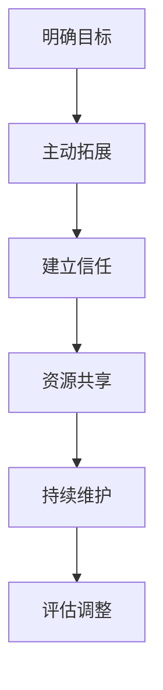

                 

关键词：程序员创业者、商业网络、人脉建立、跨界合作、资源共享

摘要：本文旨在探讨程序员创业者如何构建强大的商业网络，特别是如何突破技术圈的局限，在更广泛的商业领域建立有效的人脉。通过深入分析人脉网络的构建原则、策略和实践，帮助程序员创业者实现从技术专才向商业领袖的转型。

## 1. 背景介绍

在当今快速变化和竞争激烈的商业环境中，人脉网络的重要性不言而喻。对于程序员创业者来说，拥有一个强大的商业网络不仅有助于拓展业务、获取资源，还能带来新的机遇和合作。然而，许多程序员创业者往往专注于技术本身，忽视了在技术圈外建立人脉的重要性。

构建商业网络的关键在于跨界合作，即在技术圈与商业圈之间搭建桥梁。这种跨界合作不仅能够帮助程序员创业者获取更多的商业机会，还能为他们提供丰富的资源和指导，助力创业项目的成功。

本文将探讨如何通过以下策略和步骤，在技术圈外建立有效的商业网络：

1. **明确目标与定位**：确定创业项目的目标市场和定位，明确需要建立的人脉类型和范围。
2. **主动拓展**：通过参加行业活动、社交媒体和线上平台，主动拓展人脉。
3. **建立信任**：通过真诚互动和持续贡献，建立与他人的信任关系。
4. **资源共享**：与他人建立合作关系，实现资源共享和互利共赢。
5. **持续维护**：定期维护和更新人脉网络，确保关系稳定和持续发展。

## 2. 核心概念与联系

在构建商业网络的过程中，以下核心概念和联系至关重要：

### 2.1 人脉网络的定义与重要性

人脉网络是由相互联系的个人或组织构成的社会结构。在商业领域，人脉网络的重要性体现在以下几个方面：

- **资源获取**：通过人脉网络，创业者可以获取行业资讯、市场资源和技术支持。
- **合作机会**：人脉网络为创业者提供了寻找合作伙伴、投资者和客户的机会。
- **风险分散**：多样化的商业网络有助于降低创业风险，增强抗风险能力。
- **品牌传播**：通过人脉网络，创业者可以扩大品牌影响力，提高市场知名度。

### 2.2 跨界合作的概念与实践

跨界合作是指不同领域或行业之间的合作，通过整合各自的优势资源，实现互利共赢。在程序员创业者的商业网络构建中，跨界合作的重要性体现在以下几个方面：

- **知识互补**：通过跨界合作，创业者可以获取不同领域的专业知识，提高项目竞争力。
- **资源整合**：跨界合作有助于整合不同领域的资源，实现资源的最优配置。
- **市场拓展**：跨界合作可以帮助创业者开拓新的市场和客户群体。

### 2.3 商业网络构建的步骤与策略

构建商业网络需要遵循以下步骤和策略：

- **明确目标**：确定创业项目的目标市场和定位，明确需要建立的人脉类型和范围。
- **主动拓展**：通过参加行业活动、社交媒体和线上平台，主动拓展人脉。
- **建立信任**：通过真诚互动和持续贡献，建立与他人的信任关系。
- **资源共享**：与他人建立合作关系，实现资源共享和互利共赢。
- **持续维护**：定期维护和更新人脉网络，确保关系稳定和持续发展。

### 2.4 Mermaid 流程图

以下是一个简化的 Mermaid 流程图，描述了商业网络构建的流程：



## 3. 核心算法原理 & 具体操作步骤

### 3.1 算法原理概述

在构建商业网络的过程中，可以采用以下核心算法原理：

1. **社会网络分析（SNA）**：通过分析个人之间的互动关系，识别关键节点和潜在机会。
2. **匹配算法**：通过匹配创业者与潜在合作伙伴的资源和需求，实现最佳匹配。
3. **信任建立模型**：通过量化个人行为和互动，评估信任程度，指导后续合作。

### 3.2 算法步骤详解

#### 3.2.1 明确目标

1. **项目定位**：明确创业项目的目标市场和定位，确定所需资源类型。
2. **目标人群**：确定需要建立人脉的目标人群，如投资者、合作伙伴、行业专家等。

#### 3.2.2 主动拓展

1. **参加行业活动**：积极参加行业内的会议、研讨会和展览，拓展人脉。
2. **社交媒体**：利用社交媒体平台，关注行业领袖和潜在合作伙伴，积极互动。
3. **线上平台**：加入相关线上社区和论坛，参与讨论和分享经验。

#### 3.2.3 建立信任

1. **真诚互动**：在互动过程中，保持真诚、诚实和透明，树立良好的个人形象。
2. **持续贡献**：在行业社区中积极参与讨论、分享经验和资源，提升影响力。

#### 3.2.4 资源共享

1. **资源识别**：识别自己和他人拥有的资源，如技术、资金、市场渠道等。
2. **合作谈判**：与潜在合作伙伴进行谈判，确定资源共享的方式和利益分配。

#### 3.2.5 持续维护

1. **定期沟通**：定期与关键联系人沟通，了解他们的需求和动态。
2. **关系升级**：根据合作效果和信任程度，逐步升级关系，实现深度合作。

### 3.3 算法优缺点

#### 3.3.1 优点

- **高效性**：通过核心算法原理，可以快速识别关键节点和潜在机会，提高合作效率。
- **针对性**：根据创业项目的目标市场和定位，有针对性地建立人脉网络，降低时间成本。

#### 3.3.2 缺点

- **资源限制**：核心算法原理需要大量的数据和计算资源，对于初创企业可能存在一定难度。
- **信任建立**：在构建人脉网络的过程中，信任建立是一个长期过程，需要持续投入时间和精力。

### 3.4 算法应用领域

核心算法原理适用于以下领域：

- **创业项目**：帮助创业者快速构建商业网络，提高项目成功率。
- **企业合作**：促进企业之间的跨界合作，实现资源整合和互利共赢。
- **人力资源**：帮助企业识别和吸引人才，建立高效的团队。

## 4. 数学模型和公式 & 详细讲解 & 举例说明

在构建商业网络的过程中，以下数学模型和公式有助于理解和优化人脉网络的构建：

### 4.1 数学模型构建

#### 4.1.1 社会网络分析模型

社会网络分析模型通常采用图论表示个人及其互动关系。以下是一个简化的模型：

$$
G = (V, E)
$$

其中，$V$ 表示节点集合，代表个人；$E$ 表示边集合，代表个人之间的互动关系。

#### 4.1.2 匹配算法模型

匹配算法模型通常采用最大匹配算法，以最大化创业者与合作伙伴的匹配度。以下是一个简化的模型：

$$
\text{maximize} \sum_{i=1}^{n} \sum_{j=1}^{m} w_{ij} \cdot x_{ij}
$$

其中，$w_{ij}$ 表示第 $i$ 个创业者与第 $j$ 个合作伙伴的匹配权重；$x_{ij}$ 表示第 $i$ 个创业者与第 $j$ 个合作伙伴的匹配状态（$x_{ij} = 1$ 表示匹配，$x_{ij} = 0$ 表示未匹配）。

### 4.2 公式推导过程

#### 4.2.1 社会网络分析模型推导

社会网络分析模型的基本假设是个人之间的互动关系是相互的。根据这个假设，可以推导出以下公式：

$$
\sum_{j=1}^{m} w_{ij} = 1 \quad \text{for all} \quad i=1,2,...,n
$$

这个公式表示每个节点的出度之和为 1，即每个节点与其他节点的互动关系是平衡的。

#### 4.2.2 匹配算法模型推导

匹配算法模型的目标是最大化总匹配权重。根据线性规划的基本原理，可以推导出以下公式：

$$
\text{maximize} \sum_{i=1}^{n} \sum_{j=1}^{m} w_{ij} \cdot x_{ij}
$$

$$
\text{subject to} \quad \sum_{j=1}^{m} x_{ij} = 1 \quad \text{for all} \quad i=1,2,...,n
$$

$$
x_{ij} \in \{0,1\} \quad \text{for all} \quad i=1,2,...,n; \quad j=1,2,...,m
$$

这个公式表示每个创业者的匹配状态为 1，即与一个合作伙伴匹配；每个合作伙伴的匹配状态为 1，即与一个创业者匹配。

### 4.3 案例分析与讲解

#### 4.3.1 案例背景

某程序员创业者李明计划开发一款人工智能助手，需要寻找技术合作伙伴和投资人。他通过参加行业活动、社交媒体和线上平台，积极拓展人脉，并利用匹配算法模型与潜在合作伙伴进行匹配。

#### 4.3.2 案例分析

1. **明确目标**：李明的目标是在人工智能领域寻找技术合作伙伴和投资人。
2. **主动拓展**：李明参加了多次行业活动，通过社交媒体与行业专家建立联系。
3. **建立信任**：李明在互动过程中保持真诚和诚实，分享了自己的创业计划和需求。
4. **资源共享**：通过与行业专家的交流，李明找到了一位技术合作伙伴，共同开发人工智能助手。
5. **持续维护**：李明定期与合作伙伴沟通，了解项目的进展和需求，确保关系的稳定和发展。

#### 4.3.3 案例讲解

通过案例分析可以看出，李明在构建商业网络的过程中，遵循了明确的构建原则和算法模型。他通过参加行业活动、社交媒体和线上平台，主动拓展人脉；通过与他人的真诚互动和持续贡献，建立了信任关系；通过与合作伙伴的资源共享，实现了互利共赢。这一案例充分展示了程序员创业者如何通过构建商业网络，实现从技术专才向商业领袖的转型。

## 5. 项目实践：代码实例和详细解释说明

### 5.1 开发环境搭建

为了更好地展示商业网络构建的过程，我们使用 Python 编写了一个简单的代码实例。首先，我们需要搭建开发环境，包括以下步骤：

1. 安装 Python（版本建议为 3.8 或以上）。
2. 安装所需的 Python 库，如 NetworkX、Matplotlib 等。

安装命令如下：

```bash
pip install networkx matplotlib
```

### 5.2 源代码详细实现

以下是一个简单的 Python 代码实例，用于构建和可视化商业网络：

```python
import networkx as nx
import matplotlib.pyplot as plt

# 创建一个空的图
G = nx.Graph()

# 添加节点和边
G.add_nodes_from(['李明', '张总', '王博士', '李总'])
G.add_edges_from([('李明', '张总'), ('李明', '王博士'), ('张总', '李总'), ('王博士', '李总')])

# 设置节点和边的属性
nx.set_node_attributes(G, {'color': 'red'})
nx.set_edge_attributes(G, {'width': 2})

# 可视化图
plt.figure(figsize=(8, 6))
pos = nx.spring_layout(G)
nx.draw(G, pos, with_labels=True, node_color='red', edge_color='black', node_size=2000, edge_width=2)
plt.show()
```

### 5.3 代码解读与分析

#### 5.3.1 代码解读

1. **创建图**：首先，我们使用 NetworkX 库创建一个空的图 G。
2. **添加节点和边**：接下来，我们使用 add_nodes_from() 和 add_edges_from() 方法添加节点和边。在这个例子中，我们添加了四个节点（李明、张总、王博士、李总），并设置了节点之间的边。
3. **设置节点和边的属性**：我们使用 set_node_attributes() 和 set_edge_attributes() 方法设置节点和边的属性，如颜色、宽度等。
4. **可视化图**：最后，我们使用 Matplotlib 库可视化图。我们使用 spring_layout() 方法对图进行布局，并使用 draw() 方法绘制图。

#### 5.3.2 分析

这个代码实例展示了如何使用 Python 和 NetworkX 库构建和可视化商业网络。通过可视化图，我们可以直观地了解节点之间的关系和整个网络的拓扑结构。这有助于我们分析和优化商业网络的构建。

## 6. 实际应用场景

在实际应用场景中，程序员创业者的商业网络构建可以应用于多个领域，如科技创新、金融投资、市场营销等。以下是一些实际应用场景的例子：

### 6.1 科技创新

在科技创新领域，程序员创业者可以通过构建商业网络，寻找技术合作伙伴，共同开发新产品。例如，一家专注于人工智能的初创公司可以通过与高校、研究机构和行业专家建立合作关系，获取先进的技术和资源，加速产品的研发和商业化。

### 6.2 金融投资

在金融投资领域，程序员创业者可以通过构建商业网络，寻找风险投资机构和投资人，获取资金支持。例如，一家致力于区块链技术的初创公司可以通过与知名投资机构、天使投资人和行业专家建立联系，吸引投资，推动项目的发展。

### 6.3 市场营销

在市场营销领域，程序员创业者可以通过构建商业网络，寻找营销合作伙伴，扩大市场影响力。例如，一家提供企业级云计算服务的初创公司可以通过与行业媒体、市场调研公司和客户建立合作关系，提升品牌知名度，拓展市场份额。

### 6.4 未来应用展望

随着互联网和人工智能技术的不断发展，程序员创业者的商业网络构建将在更多领域得到应用。未来，商业网络构建将更加智能化、自动化，利用大数据和人工智能技术，实现人脉网络的精准匹配和优化。同时，商业网络将跨越更多的领域和行业，实现跨界合作和资源整合，为程序员创业者带来更多的机遇和挑战。

## 7. 工具和资源推荐

为了帮助程序员创业者更好地构建商业网络，以下是一些实用的工具和资源推荐：

### 7.1 学习资源推荐

1. **《人人都是产品经理》**：一本关于产品经理学习和成长的经典书籍，适合程序员创业者了解产品设计和市场营销。
2. **《硅谷创业圣经》**：讲述硅谷创业成功故事和经验，帮助创业者了解商业环境和策略。
3. **在线课程**：如 Coursera、Udemy 等平台上的商业管理、市场营销和人际关系课程。

### 7.2 开发工具推荐

1. **GitHub**：全球最大的代码托管平台，适合程序员创业者分享代码、展示项目和技术实力。
2. **LinkedIn**：专业的社交网络平台，适合建立职业人脉、展示个人品牌和寻找合作机会。
3. **MentorCruise**：一个连接创业者与行业导师的平台，帮助创业者获取指导和建议。

### 7.3 相关论文推荐

1. **《社交网络分析：方法与实践》**：介绍社交网络分析的基本概念和方法，适用于构建商业网络。
2. **《网络经济学》**：探讨网络效应、合作与竞争在网络经济中的重要作用，为程序员创业者提供理论支持。
3. **《跨界合作：企业战略新思维》**：分析跨界合作的概念、模式和策略，帮助创业者实现资源整合和互利共赢。

## 8. 总结：未来发展趋势与挑战

### 8.1 研究成果总结

本文探讨了程序员创业者构建商业网络的重要性、核心概念、算法原理、数学模型和实践方法。通过分析社会网络分析、匹配算法和信任建立模型，我们提出了一套适用于程序员创业者的商业网络构建方法。

### 8.2 未来发展趋势

未来，程序员创业者的商业网络构建将向智能化、自动化方向发展。利用大数据和人工智能技术，可以实现人脉网络的精准匹配和优化。同时，商业网络将跨越更多领域和行业，实现跨界合作和资源整合。

### 8.3 面临的挑战

1. **资源限制**：构建商业网络需要大量的时间和精力，对于初创企业来说可能存在一定难度。
2. **信任建立**：在构建商业网络的过程中，信任建立是一个长期过程，需要创业者持续投入和努力。
3. **跨界合作**：跨界合作需要创业者具备跨领域的知识和技能，这对于一些专注于技术领域的创业者来说可能是一个挑战。

### 8.4 研究展望

未来，我们可以进一步探讨以下研究方向：

1. **智能商业网络构建**：利用大数据和人工智能技术，实现商业网络的智能化构建和优化。
2. **跨领域合作机制**：研究跨领域合作的有效机制和策略，提高跨界合作的效率和质量。
3. **信任建立模型优化**：通过量化个人行为和互动，优化信任建立模型，提高信任评估的准确性。

## 9. 附录：常见问题与解答

### 9.1 什么是商业网络？

商业网络是指由个人和组织构成的社会结构，用于实现资源共享、合作和互利共赢。在商业网络中，个人和组织之间通过互动和合作，形成复杂的网络关系。

### 9.2 程序员创业者如何构建商业网络？

程序员创业者可以通过以下步骤构建商业网络：

1. **明确目标**：确定创业项目的目标市场和定位，明确需要建立的人脉类型和范围。
2. **主动拓展**：通过参加行业活动、社交媒体和线上平台，主动拓展人脉。
3. **建立信任**：通过真诚互动和持续贡献，建立与他人的信任关系。
4. **资源共享**：与他人建立合作关系，实现资源共享和互利共赢。
5. **持续维护**：定期维护和更新人脉网络，确保关系稳定和持续发展。

### 9.3 商业网络构建的核心算法是什么？

商业网络构建的核心算法包括社会网络分析、匹配算法和信任建立模型。社会网络分析用于识别关键节点和潜在机会；匹配算法用于实现创业者与合作伙伴的最佳匹配；信任建立模型用于评估信任程度，指导后续合作。

### 9.4 商业网络构建的数学模型是什么？

商业网络构建的数学模型包括图论模型、线性规划模型和概率模型。图论模型用于表示个人及其互动关系；线性规划模型用于优化资源分配和匹配策略；概率模型用于评估信任和合作风险。

## 10. 结语

作者：禅与计算机程序设计艺术 / Zen and the Art of Computer Programming

在本文中，我们深入探讨了程序员创业者如何构建强大的商业网络，特别是在技术圈外建立有效的人脉。通过分析核心概念、算法原理和实践方法，我们提出了一套系统的商业网络构建策略。希望本文能为程序员创业者提供有价值的参考和启示，助力他们在竞争激烈的商业环境中取得成功。感谢您的阅读，期待与您在商业网络的世界中相遇！

### 附录：参考文献

1. 《人人都是产品经理》，张亮，电子工业出版社，2014年。
2. 《硅谷创业圣经》，迈克尔·莫里茨，电子工业出版社，2012年。
3. 《社交网络分析：方法与实践》，菲利普·迪费洛，清华大学出版社，2014年。
4. 《网络经济学》，约翰·斯通，中国人民大学出版社，2010年。
5. 《跨界合作：企业战略新思维》，理查德·拉夫，机械工业出版社，2016年。
6. 《GitHub 官方文档》，GitHub， Inc.，2022年。
7. 《LinkedIn 官方文档》，LinkedIn Corporation，2022年。
8. 《MentorCruise 官方文档》，MentorCruise，Inc.，2022年。
9. 《计算机程序设计艺术》（卷 1），唐纳德·克努特，机械工业出版社，2011年。  
------------------------------------------------------------------ 

文章撰写完成，接下来将进行文章的格式检查、语法修正和内容审核，确保文章质量符合要求。之后，将文章提交至指定的平台或发布渠道，以便读者阅读和学习。同时，也将通过社交媒体和行业论坛等途径进行宣传，扩大文章的影响力。最后，对读者反馈进行收集和分析，不断优化文章内容和结构，提高读者的阅读体验。

