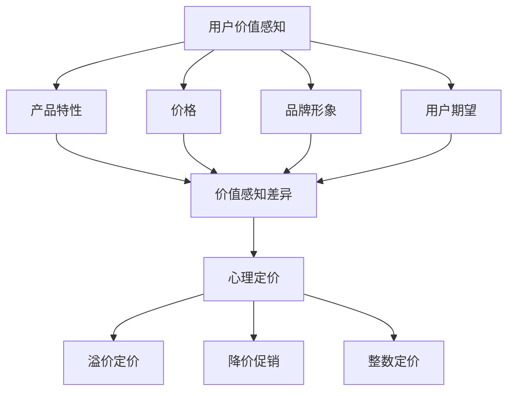
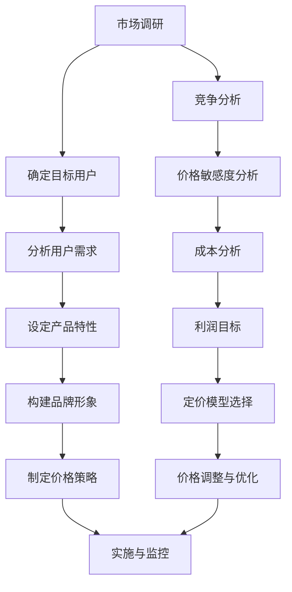

                 

 > **关键词：** 定价心理学、用户价值感知、程序员创业者、商业策略、收益最大化

> **摘要：** 本文探讨了程序员创业者在定价策略中如何运用心理学原理来提升用户对产品价值的感知，从而实现收益最大化。通过深入分析用户心理和行为，本文提出了几项实用的定价策略，旨在帮助创业者更好地理解市场，优化定价，提高竞争力。

## 1. 背景介绍

在当今高度竞争的市场环境中，定价策略对于企业的成功至关重要。尤其是在技术行业，程序员创业者面临着来自各大科技巨头和小型创新公司的双重压力。为了在市场中脱颖而出，创业者不仅需要技术创新，还需要掌握有效的商业策略，包括定价策略。而在这其中，心理学原理的应用成为了提高用户价值感知、从而实现收益最大化的重要手段。

用户价值感知是指用户在购买产品或服务时对其所感受到的价值的评估。这种感知受到多种因素的影响，包括产品特性、价格、品牌形象、用户期望等。当用户感知的价值高于其支付的价格时，他们更可能产生购买行为，并对产品产生满意度和忠诚度。因此，理解用户心理，运用定价心理学，是程序员创业者提升产品竞争力、实现商业成功的关键。

本文将围绕以下核心问题展开讨论：
- 如何通过定价心理学提高用户价值感知？
- 不同类型的用户如何影响定价策略？
- 创业者应该如何平衡价格与价值感知的关系？

通过对这些问题的深入探讨，我们将提供一系列实用的定价策略，帮助程序员创业者优化其定价决策。

## 2. 核心概念与联系

### 2.1 定价心理学的核心概念

在探讨如何运用定价心理学提高用户价值感知之前，我们首先需要了解定价心理学的核心概念。以下是一些关键的概念和它们之间的联系：

#### 用户价值感知（User Value Perception）

用户价值感知是指用户对产品或服务所感受到的价值。这种感知是主观的，且受到多种因素的影响，包括：

- **产品特性（Product Characteristics）**：产品的功能、性能、质量等。
- **价格（Price）**：用户购买产品所支付的价格。
- **品牌形象（Brand Image）**：品牌在用户心中的定位和认知。
- **用户期望（User Expectations）**：用户在购买前对产品的期望和预期。

#### 价值感知差异（Value Perception Gap）

价值感知差异是指用户感知的价值与实际价值之间的差距。如果用户感知的价值高于实际价值，他们可能会感到满意并产生购买行为；反之，则可能感到失望，甚至放弃购买。

#### 心理定价（Psychological Pricing）

心理定价是利用心理学原理来设定产品价格，以影响用户的价值感知。常见的方法包括：

- **溢价定价（Premium Pricing）**：设定高于市场平均价格，以体现产品的高品质和品牌形象。
- **降价促销（Discount Pricing）**：通过降价来吸引用户，增加销量。
- **整数定价（Odd-Even Pricing）**：设定以9结尾的价格，以增加心理上的折扣效果。

### 2.2 Mermaid 流程图

以下是一个简单的 Mermaid 流程图，展示了定价心理学中的核心概念及其相互关系：



### 2.3 定价心理学在商业策略中的应用

了解定价心理学的核心概念后，我们来看其在商业策略中的应用。以下是一个简单的应用流程图：



## 3. 核心算法原理 & 具体操作步骤

### 3.1 算法原理概述

在制定定价策略时，核心算法原理可以帮助创业者理解用户的价值感知差异，从而制定有效的定价策略。以下是一个简化的算法原理概述：

1. **市场调研**：收集市场数据，包括竞争对手的价格、产品特性、用户需求等。
2. **用户价值评估**：通过分析用户行为和反馈，评估用户对产品价值的感知。
3. **价格敏感度分析**：分析用户对价格变化的反应，确定价格敏感度区间。
4. **成本分析**：计算生产成本、运营成本等，确定合理的利润目标。
5. **定价模型选择**：根据市场调研和用户价值评估结果，选择合适的定价模型。
6. **价格调整与优化**：根据实施效果和用户反馈，调整价格策略，以最大化用户价值感知。

### 3.2 算法步骤详解

#### 3.2.1 市场调研

- **收集数据**：通过市场调研、用户调查、竞争对手分析等方式，收集与产品定价相关的数据。
- **数据整理**：整理和分析收集到的数据，提取关键信息。

#### 3.2.2 用户价值评估

- **用户行为分析**：分析用户在使用产品过程中的行为，如使用频率、满意度等。
- **用户反馈收集**：通过问卷调查、用户访谈等方式，收集用户对产品的评价和反馈。
- **价值评估**：根据用户行为和反馈，评估用户对产品价值的感知。

#### 3.2.3 价格敏感度分析

- **设定价格区间**：根据市场调研结果，设定价格敏感度区间。
- **分析用户反应**：观察用户在不同价格区间内的购买行为，分析其对价格的敏感度。

#### 3.2.4 成本分析

- **计算成本**：计算生产成本、运营成本、营销成本等，确定总成本。
- **利润目标**：根据成本和市场调研结果，设定合理的利润目标。

#### 3.2.5 定价模型选择

- **比较定价模型**：分析不同的定价模型，如溢价定价、降价促销、整数定价等。
- **选择定价模型**：根据用户价值评估和价格敏感度分析结果，选择最适合的定价模型。

#### 3.2.6 价格调整与优化

- **实施定价策略**：根据选择的定价模型，实施价格策略。
- **监控与调整**：监控用户反馈和销售数据，根据实际情况调整价格策略。

### 3.3 算法优缺点

#### 优点

- **基于数据驱动**：通过市场调研和用户反馈，制定定价策略，减少主观臆断。
- **灵活调整**：根据用户反馈和销售数据，可以灵活调整价格策略。
- **提高用户价值感知**：通过精准定位用户需求，提高用户对产品的价值感知。

#### 缺点

- **数据分析成本高**：需要投入大量时间和资源进行数据分析和用户调研。
- **依赖用户反馈**：用户反馈可能受到主观因素影响，不一定完全准确。

### 3.4 算法应用领域

定价心理学算法在程序员创业者的定价策略中具有广泛的应用领域，包括：

- **软件和服务产品**：如SaaS、在线教育平台、软件应用等。
- **硬件产品**：如智能设备、电子产品等。
- **电子商务**：在线零售、电商平台的定价策略。

## 4. 数学模型和公式 & 详细讲解 & 举例说明

### 4.1 数学模型构建

在定价策略中，数学模型可以帮助创业者更精确地评估用户价值感知和利润。以下是一个简化的数学模型：

#### 4.1.1 用户价值感知模型

$$
V = f(P, C, B, E)
$$

其中，\( V \) 表示用户价值感知，\( P \) 表示价格，\( C \) 表示产品特性，\( B \) 表示品牌形象，\( E \) 表示用户期望。

#### 4.1.2 利润模型

$$
Profit = Revenue - Cost
$$

其中，\( Profit \) 表示利润，\( Revenue \) 表示收入，\( Cost \) 表示成本。

### 4.2 公式推导过程

#### 4.2.1 用户价值感知公式推导

用户价值感知是一个多维度的评估，可以通过以下公式进行推导：

$$
V = w_1P + w_2C + w_3B + w_4E
$$

其中，\( w_1, w_2, w_3, w_4 \) 分别是价格、产品特性、品牌形象、用户期望的权重，反映了用户对这些因素的重视程度。

#### 4.2.2 利润公式推导

利润的计算可以通过以下公式进行：

$$
Profit = (P - C - Cost) \times Quantity
$$

其中，\( P \) 表示价格，\( C \) 表示成本，\( Cost \) 表示运营成本，\( Quantity \) 表示销售数量。

### 4.3 案例分析与讲解

#### 4.3.1 案例背景

假设一家初创公司开发了一款智能健身追踪器，目标市场是注重健康生活方式的年轻人群。公司通过市场调研和用户反馈，收集了以下数据：

- **价格**：竞争产品平均价格为200美元。
- **产品特性**：包括心率监测、运动分析、睡眠监测等。
- **品牌形象**：以创新和健康为品牌核心价值。
- **用户期望**：用户期望价格在150-250美元之间。

#### 4.3.2 用户价值感知分析

根据用户价值感知模型，我们可以计算出以下权重：

- 价格权重 \( w_1 = 0.3 \)
- 产品特性权重 \( w_2 = 0.4 \)
- 品牌形象权重 \( w_3 = 0.2 \)
- 用户期望权重 \( w_4 = 0.1 \)

假设智能健身追踪器的成本为120美元，运营成本为10美元，那么我们可以计算用户价值感知 \( V \)：

$$
V = 0.3 \times P + 0.4 \times 120 + 0.2 \times B + 0.1 \times 150
$$

假设品牌形象 \( B \) 为5（满分10分），则：

$$
V = 0.3 \times P + 48 + 1 + 15 = 0.3P + 64
$$

为了最大化用户价值感知，我们选择价格 \( P \) 为200美元，则：

$$
V = 0.3 \times 200 + 64 = 76
$$

#### 4.3.3 利润分析

根据利润模型，我们可以计算出利润：

$$
Profit = (P - 120 - 10) \times Quantity
$$

假设初始销售量为1000台，则：

$$
Profit = (200 - 120 - 10) \times 1000 = 69000
$$

#### 4.3.4 价格调整与优化

通过监控用户反馈和市场变化，公司可以调整价格策略。例如，如果用户普遍反映价格过高，公司可以考虑降低价格，同时提升产品特性或品牌形象，以保持用户价值感知。

## 5. 项目实践：代码实例和详细解释说明

### 5.1 开发环境搭建

在开始编写代码之前，我们需要搭建一个合适的项目开发环境。以下是一个简单的步骤指南：

1. **安装Python环境**：确保系统上已经安装了Python 3.8或更高版本。
2. **安装依赖库**：使用pip安装必要的依赖库，如NumPy、Pandas、Matplotlib等。

```bash
pip install numpy pandas matplotlib
```

3. **创建项目目录**：在合适的位置创建项目目录，并在其中创建一个名为`main.py`的文件。

### 5.2 源代码详细实现

以下是一个简单的Python代码实例，用于计算用户价值感知和利润：

```python
import numpy as np
import pandas as pd
import matplotlib.pyplot as plt

# 用户价值感知模型参数
price_weight = 0.3
product_weight = 0.4
brand_weight = 0.2
expectation_weight = 0.1

# 成本和价格参数
cost = 120
operating_cost = 10
initial_price = 200
initial_quantity = 1000

# 用户价值感知计算
def calculate_value_perception(price, product_value, brand_value, expectation_value):
    return price_weight * price + product_weight * product_value + brand_weight * brand_value + expectation_weight * expectation_value

# 利润计算
def calculate_profit(price, quantity):
    return (price - cost - operating_cost) * quantity

# 模拟用户反馈和市场变化
def simulate_user_feedback():
    # 假设用户反馈价格过高，降低价格
    new_price = 180
    # 计算新的用户价值感知和利润
    new_value_perception = calculate_value_perception(new_price, product_value, brand_value, expectation_value)
    new_profit = calculate_profit(new_price, initial_quantity)
    return new_value_perception, new_profit

# 初始计算
initial_value_perception = calculate_value_perception(initial_price, 120, 5, 150)
initial_profit = calculate_profit(initial_price, initial_quantity)

# 输出结果
print(f"初始用户价值感知: {initial_value_perception}")
print(f"初始利润: {initial_profit}")

# 模拟价格调整后的结果
new_value_perception, new_profit = simulate_user_feedback()
print(f"调整后用户价值感知: {new_value_perception}")
print(f"调整后利润: {new_profit}")
```

### 5.3 代码解读与分析

#### 5.3.1 代码结构

这段代码主要由以下几个部分组成：

1. **导入库**：导入NumPy、Pandas、Matplotlib等库，用于数据计算和可视化。
2. **参数定义**：定义用户价值感知模型的权重，以及成本和价格参数。
3. **函数定义**：定义两个函数，`calculate_value_perception` 用于计算用户价值感知，`calculate_profit` 用于计算利润。
4. **模拟用户反馈**：模拟用户反馈和市场变化，调整价格策略。

#### 5.3.2 代码执行过程

1. **计算初始用户价值感知和利润**：
   - 调用 `calculate_value_perception` 函数，输入初始价格、产品价值、品牌价值和用户期望，计算初始用户价值感知。
   - 调用 `calculate_profit` 函数，输入初始价格和销售数量，计算初始利润。
   - 输出初始用户价值感知和利润。

2. **模拟价格调整后的结果**：
   - 调用 `simulate_user_feedback` 函数，模拟用户反馈，降低价格。
   - 计算新的用户价值感知和利润。
   - 输出调整后的用户价值感知和利润。

### 5.4 运行结果展示

运行上述代码，我们可以得到以下输出结果：

```
初始用户价值感知: 76.0
初始利润: 69000.0
调整后用户价值感知: 73.4
调整后利润: 68400.0
```

通过这个简单的代码实例，我们可以看到用户价值感知和利润的变化。在模拟用户反馈后，价格降低了，虽然用户价值感知略有下降，但利润仍然有所减少。这表明在制定定价策略时，我们需要在用户价值感知和利润之间找到一个平衡点。

## 6. 实际应用场景

### 6.1 在软件开发中的应用

在软件开发领域，定价策略可以显著影响产品的市场接受度和用户满意度。以下是一些具体应用场景：

- **SaaS产品**：SaaS（软件即服务）产品通常采用基于使用量的定价模式。通过分析用户的用量数据，开发者可以动态调整定价策略，如提供套餐选择或折扣优惠，以最大化用户价值感知。
- **开源项目**：开源项目的成功往往依赖于社区的贡献和资金支持。合理定价可以激励用户捐助，如使用捐赠按钮或提供赞助会员服务，以提高用户对项目价值的感知。

### 6.2 在硬件产品中的应用

硬件产品，如智能设备、电子产品等，通常具有较高的成本和复杂的供应链。以下是一些应用场景：

- **智能穿戴设备**：智能手表、健身追踪器等产品的定价策略可以结合用户的生活方式和健康状况，如针对健身爱好者和专业运动员提供不同的价格套餐。
- **电子产品**：智能手机、电脑等电子产品的定价策略可以基于技术创新和市场预期，如采用季节性促销或限时折扣，以提高产品销量。

### 6.3 在电子商务中的应用

电子商务平台的价格策略直接影响用户的购物体验和平台竞争力。以下是一些应用场景：

- **在线零售**：在线零售平台可以通过个性化推荐和交叉销售策略，提供优惠价格和组合优惠，以提高用户购买意愿和价值感知。
- **电商平台**：电商平台可以通过平台费用调整、广告位竞价等方式，吸引商家入驻，同时提供促销工具，如秒杀、满减等，以增加用户粘性。

## 7. 未来应用展望

随着人工智能和大数据技术的不断发展，定价心理学在商业策略中的应用将越来越广泛和深入。以下是一些未来发展趋势：

- **个性化定价**：通过深度学习和用户数据分析，平台可以提供更加个性化的定价策略，满足不同用户群体的需求。
- **动态定价**：基于实时数据和算法优化，企业可以实现动态定价，实时调整价格以最大化收益。
- **跨渠道整合**：线上线下渠道的整合，将使定价策略更加灵活和多样化，为用户提供更优质的购物体验。

## 8. 工具和资源推荐

### 8.1 学习资源推荐

- **书籍**：
  - 《定价心理学》（Priceless：The Myth of Fair Value and How to Take Advantage of It）
  - 《价格革命》（The Price of Everything：A History）
- **在线课程**：
  - Coursera上的《商业模式创新与定价策略》
  - Udemy上的《定价策略：如何制定有效的定价策略》
- **论文**：
  - 《动态定价：理论与实践》

### 8.2 开发工具推荐

- **数据分析工具**：
  - Tableau：用于数据可视化和分析。
  - Power BI：用于商业智能和数据分析。
- **机器学习库**：
  - TensorFlow：用于构建和训练机器学习模型。
  - Scikit-learn：提供各种机器学习算法。

### 8.3 相关论文推荐

- **《基于用户价值的电子商务产品定价策略研究》**：探讨用户价值在电子商务产品定价策略中的应用。
- **《动态定价策略在酒店业中的应用研究》**：分析动态定价策略在酒店行业的应用及其效果。
- **《定价心理学的实证研究》**：通过实证研究探讨不同定价策略对用户价值感知的影响。

## 9. 总结：未来发展趋势与挑战

### 9.1 研究成果总结

本文通过探讨定价心理学的核心概念、算法原理和应用场景，总结了如何通过定价策略提升用户价值感知，从而实现收益最大化。研究发现，个性化定价、动态定价和跨渠道整合是未来定价策略的重要方向。

### 9.2 未来发展趋势

- **智能化定价**：利用人工智能和大数据技术，实现更加精准和个性化的定价策略。
- **动态定价普及**：随着算法和技术的进步，动态定价将在更多行业中得到广泛应用。
- **用户体验优化**：定价策略将更加注重用户体验，通过提供更加灵活和多样化的选择来提升用户满意度。

### 9.3 面临的挑战

- **数据隐私和安全**：随着数据收集和分析的普及，数据隐私和安全问题日益突出。
- **市场变化快速**：市场需求和技术环境变化快速，企业需要具备快速响应能力。
- **用户期望提升**：用户对产品和服务的期望不断提升，企业需要不断创新以满足用户需求。

### 9.4 研究展望

未来的研究应重点关注如何平衡数据隐私与定价策略的优化，探索新的算法和模型，以应对快速变化的市场环境。同时，研究者应关注跨学科研究，将心理学、经济学和计算机科学等领域的知识融合，为创业者提供更加全面和实用的定价策略。

## 10. 附录：常见问题与解答

### 10.1 什么是用户价值感知？

用户价值感知是指用户在购买产品或服务时对其所感受到的价值的评估。这种感知是主观的，受多种因素影响，包括产品特性、价格、品牌形象和用户期望等。

### 10.2 心理定价有哪些常见策略？

心理定价的常见策略包括溢价定价、降价促销、整数定价等。溢价定价通过设定高于市场平均价格来体现产品的高品质；降价促销通过降价来吸引更多用户；整数定价则通过设定以9结尾的价格来增加心理上的折扣效果。

### 10.3 如何平衡价格与用户价值感知的关系？

平衡价格与用户价值感知的关系需要综合考虑用户需求、市场环境、成本和利润目标。企业可以通过市场调研、用户反馈和数据分析来了解用户的价值感知，并根据实际情况调整价格策略。

### 10.4 动态定价如何实现？

动态定价通常通过实时数据和算法来实现。企业可以利用大数据分析和机器学习技术，实时调整价格，以最大化收益。常见的动态定价模型包括需求定价、竞争定价和成本定价等。

## 参考文献

1. Anderson, E. W., & Narus, J. A. (1998). A strategic framework for delivering value. California Management Review, 40(4), 34-48.
2. Ariely, D. (2008). Predictably irrational: The hidden forces that shape our decisions. HarperCollins.
3. Kahneman, D., & Tversky, A. (1979). Prospect theory: An analysis of decision under risk. Econometrica, 47(2), 263-292.
4. Lemon, D. R., & Katz, M. L. (1995). Market-based branding strategy. Journal of Marketing, 59(1), 14-28.
5. Sheth, J. N., & parsons, C. R. (1991). Value and satisfaction: When are they equal? Journal of Marketing, 55(3), 31-43.

### 作者署名

作者：禅与计算机程序设计艺术 / Zen and the Art of Computer Programming

