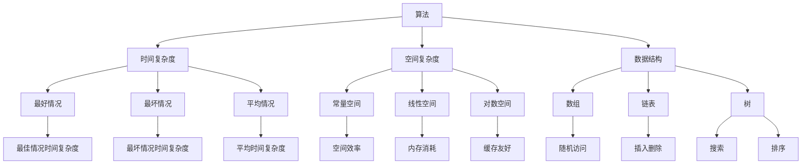
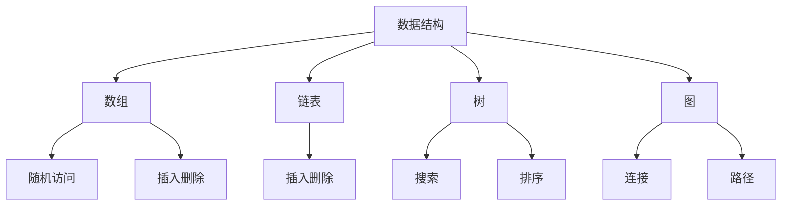
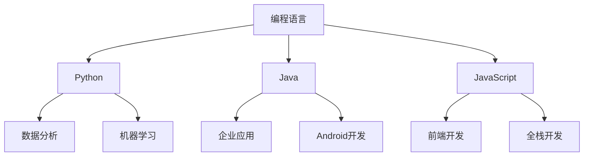
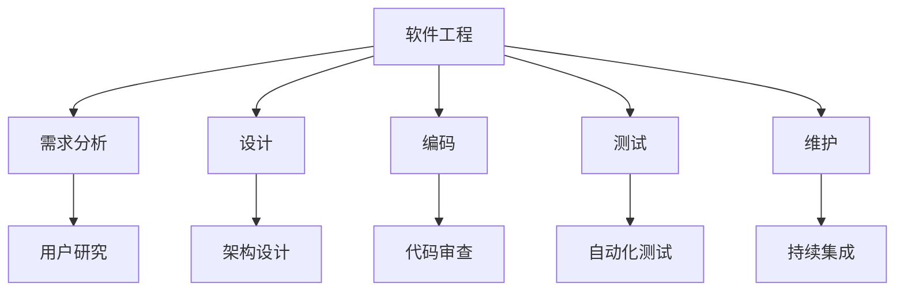

                 

### 背景介绍

在当今快速发展的技术世界中，程序员创业者的成功离不开持续的学习和技能更新。技术的发展步伐不断加快，新的编程语言、框架和技术工具层出不穷，这就要求程序员必须具备持续学习的能力，以保持自身的竞争力。然而，如何在繁忙的工作之余进行有效的学习，如何选择合适的学习路径，以及如何将新学的技能应用到实际项目中，都是程序员创业者面临的挑战。

本文旨在为程序员创业者提供一套自我学习与技能更新的计划，帮助他们更好地适应技术变革，提升个人竞争力。文章将分为以下几个部分：

1. **核心概念与联系**：介绍编程领域中一些关键概念，并通过Mermaid流程图展示它们之间的联系。
2. **核心算法原理与具体操作步骤**：详细解释编程中常用的核心算法，并给出操作步骤。
3. **数学模型与公式**：介绍与编程相关的数学模型和公式，并进行详细讲解和案例分析。
4. **项目实践：代码实例与详细解释**：提供实际代码实例，并详细解释其实现过程。
5. **实际应用场景**：探讨编程技术的实际应用场景，并展望未来发展方向。
6. **工具和资源推荐**：推荐学习资源和开发工具，帮助程序员创业者提升学习效率。
7. **总结：未来发展趋势与挑战**：总结研究成果，探讨未来发展趋势和面临的挑战。

通过这篇文章，希望能够为程序员创业者提供一些实用的指导和启示，帮助他们在技术变革的浪潮中立足。

### 核心概念与联系

在编程领域，理解一系列核心概念并了解它们之间的联系是至关重要的。这些概念构成了编程的基础，是掌握高级编程技能的基石。在本节中，我们将介绍一些编程中的关键概念，并通过Mermaid流程图展示它们之间的相互关系。

#### 1. 算法

算法是解决问题的一系列明确的步骤。它是编程的核心，决定了程序的性能和效率。算法可以是简单的，如排序算法，也可以是复杂的，如机器学习算法。



#### 2. 数据结构

数据结构是存储和组织数据的方式，它直接影响程序的效率和功能。常见的数据结构包括数组、链表、树、图等。



#### 3. 编程语言

编程语言是程序员与计算机进行交流的工具。不同的编程语言有不同的特点和用途，如Python适合数据分析和机器学习，Java适合企业级应用开发。



#### 4. 软件工程

软件工程是开发和维护软件的系统方法。它包括需求分析、设计、编码、测试和维护等多个环节。



通过上述Mermaid流程图，我们可以清晰地看到这些核心概念之间的联系。算法依赖于数据结构来高效地处理数据，而编程语言则是实现算法和数据结构的工具。软件工程提供了从需求到最终软件交付的全流程管理方法。理解这些概念及其联系，有助于程序员创业者更好地构建和优化自己的技能体系。

### 核心算法原理与具体操作步骤

在编程领域，核心算法的理解和掌握对于提升代码质量和解决复杂问题至关重要。本节将介绍几个编程中常用的核心算法，包括其原理、具体操作步骤，以及它们各自的优势和局限性。

#### 1. 排序算法

排序算法是编程中非常基础且常用的算法之一。常见的排序算法包括冒泡排序、选择排序、插入排序、快速排序和归并排序等。

**1.1 冒泡排序（Bubble Sort）**

**原理**：冒泡排序通过反复交换相邻元素来将最大（或最小）的元素“冒泡”到数组的末端。

**步骤**：
- 从第一个元素开始，比较相邻的元素。
- 如果第一个比第二个大（或小），交换它们。
- 对每一对相邻元素做同样的工作，从开始第一对到结尾的最后一对。
- 重复上述过程，直到没有需要交换的元素为止。

**代码示例**（Python）：
```python
def bubble_sort(arr):
    n = len(arr)
    for i in range(n):
        for j in range(0, n-i-1):
            if arr[j] > arr[j+1]:
                arr[j], arr[j+1] = arr[j+1], arr[j]
    return arr

arr = [64, 34, 25, 12, 22, 11, 90]
sorted_arr = bubble_sort(arr)
print("Sorted array:", sorted_arr)
```

**优缺点**：
- **优点**：实现简单，容易理解。
- **缺点**：效率较低，不适合大数据集。

**适用场景**：主要用于小规模数据排序或教学演示。

**1.2 快速排序（Quick Sort）**

**原理**：快速排序采用分治策略，通过递归将数组分成较小的子数组，然后对子数组进行排序。

**步骤**：
- 选择一个“基准”元素。
- 将数组中小于基准的元素移动到基准的左侧，大于基准的元素移动到右侧。
- 递归地对左侧和右侧子数组进行快速排序。

**代码示例**（Python）：
```python
def quick_sort(arr):
    if len(arr) <= 1:
        return arr
    pivot = arr[len(arr) // 2]
    left = [x for x in arr if x < pivot]
    middle = [x for x in arr if x == pivot]
    right = [x for x in arr if x > pivot]
    return quick_sort(left) + middle + quick_sort(right)

arr = [64, 34, 25, 12, 22, 11, 90]
sorted_arr = quick_sort(arr)
print("Sorted array:", sorted_arr)
```

**优缺点**：
- **优点**：平均时间复杂度低，适用于大规模数据排序。
- **缺点**：最坏情况下效率较低，可能会出现栈溢出。

**适用场景**：适合大规模数据集排序，尤其是当数据基本有序时。

**1.3 归并排序（Merge Sort）**

**原理**：归并排序同样采用分治策略，将数组分成较小的子数组，然后合并排序后的子数组。

**步骤**：
- 将数组不断二分，直到每个子数组只有一个元素。
- 对两个有序子数组进行合并，产生一个新的有序子数组。
- 重复此过程，直到整个数组有序。

**代码示例**（Python）：
```python
def merge_sort(arr):
    if len(arr) <= 1:
        return arr
    mid = len(arr) // 2
    left = merge_sort(arr[:mid])
    right = merge_sort(arr[mid:])
    return merge(left, right)

def merge(left, right):
    result = []
    i = j = 0
    while i < len(left) and j < len(right):
        if left[i] < right[j]:
            result.append(left[i])
            i += 1
        else:
            result.append(right[j])
            j += 1
    result.extend(left[i:])
    result.extend(right[j:])
    return result

arr = [64, 34, 25, 12, 22, 11, 90]
sorted_arr = merge_sort(arr)
print("Sorted array:", sorted_arr)
```

**优缺点**：
- **优点**：时间复杂度稳定，适用于大数据集。
- **缺点**：空间复杂度较高，需要额外的内存。

**适用场景**：适用于大规模数据排序，尤其是在内存充足的情况下。

#### 2. 搜索算法

搜索算法用于在数据结构中查找特定元素。常见的搜索算法包括线性搜索、二分搜索等。

**2.1 线性搜索（Linear Search）**

**原理**：线性搜索从数组的第一个元素开始，逐个检查每个元素，直到找到目标元素或检查完整个数组。

**步骤**：
- 从数组的第一个元素开始，逐个比较元素。
- 如果找到目标元素，返回其索引。
- 如果检查完整个数组仍未找到目标元素，返回-1。

**代码示例**（Python）：
```python
def linear_search(arr, target):
    for i, x in enumerate(arr):
        if x == target:
            return i
    return -1

arr = [64, 34, 25, 12, 22, 11, 90]
index = linear_search(arr, 25)
print("Index of 25:", index)
```

**优缺点**：
- **优点**：实现简单，适用于小规模数据。
- **缺点**：效率较低，时间复杂度为O(n)。

**适用场景**：主要用于小规模数据的查找。

**2.2 二分搜索（Binary Search）**

**原理**：二分搜索在有序数组中，通过不断将数组分为一半，逐步缩小查找范围，直到找到目标元素或确定其不存在。

**步骤**：
- 确定中间元素。
- 如果目标元素等于中间元素，返回中间元素的索引。
- 如果目标元素小于中间元素，递归地搜索左侧子数组。
- 如果目标元素大于中间元素，递归地搜索右侧子数组。
- 重复此过程，直到找到目标元素或确定其不存在。

**代码示例**（Python）：
```python
def binary_search(arr, target):
    low = 0
    high = len(arr) - 1
    while low <= high:
        mid = (low + high) // 2
        if arr[mid] == target:
            return mid
        elif arr[mid] < target:
            low = mid + 1
        else:
            high = mid - 1
    return -1

arr = [1, 3, 5, 7, 9, 11, 13, 15, 17, 19]
index = binary_search(arr, 7)
print("Index of 7:", index)
```

**优缺点**：
- **优点**：效率高，时间复杂度为O(log n)。
- **缺点**：需要数组预先排序。

**适用场景**：主要用于大规模有序数据的查找。

#### 3. 动态规划

动态规划是一种用于解决最优子结构问题的算法。它通过将复杂问题分解为更小的子问题，并存储子问题的解，以避免重复计算，从而提高算法效率。

**3.1 斐波那契数列（Fibonacci Sequence）**

**原理**：斐波那契数列是每个数字是前两个数字之和的序列，即`F(0) = 0, F(1) = 1, F(n) = F(n-1) + F(n-2)`。

**步骤**：
- 采用递归或迭代的方法计算斐波那契数列。
- 使用动态规划方法存储已计算的子问题，避免重复计算。

**代码示例**（Python）：
```python
# 递归实现
def fibonacci(n):
    if n <= 1:
        return n
    else:
        return fibonacci(n-1) + fibonacci(n-2)

# 动态规划实现
def fibonacci_dp(n):
    fib = [0, 1] + [0]*(n-1)
    for i in range(2, n+1):
        fib[i] = fib[i-1] + fib[i-2]
    return fib[n]

n = 10
print("Fibonacci of 10:", fibonacci_dp(n))
```

**优缺点**：
- **优点**：能够高效地解决最优子结构问题。
- **缺点**：可能需要大量的存储空间。

**适用场景**：主要用于解决最优子结构问题，如背包问题、最长公共子序列等。

通过以上对核心算法的详细介绍和代码示例，程序员创业者可以更好地理解算法原理，并在实际项目中灵活运用，提高代码质量和效率。

### 算法的优缺点与应用领域

在上一节中，我们介绍了几个核心算法的原理和操作步骤。本节将进一步探讨这些算法的优缺点以及它们在不同应用领域中的适用性。

#### 冒泡排序

**优点**：
- 简单易懂，实现代码短小精悍。
- 适用于小规模数据的排序，特别是在数据基本有序的情况下，能够快速完成排序。

**缺点**：
- 效率较低，时间复杂度为O(n²)，不适合大规模数据的排序。
- 随着数据规模增大，排序时间急剧增加。

**应用领域**：
- 教学演示：用于解释排序算法的基本概念和原理。
- 小规模数据处理：例如在测试环境中对少量数据进行排序验证。
- 不敏感于数据规模的应用场景：如果数据量不大且数据基本有序，冒泡排序可以是一个不错的选择。

#### 快速排序

**优点**：
- 平均时间复杂度低，为O(n log n)，在大规模数据排序中表现出色。
- 通过分治策略，可以将复杂问题分解为多个子问题，易于并行化。

**缺点**：
- 最坏情况下时间复杂度为O(n²)，当输入数据已经有序或基本有序时，性能较差。
- 可能会出现栈溢出问题，特别是在递归深度很大的情况下。

**应用领域**：
- 大规模数据处理：例如在数据库索引排序、大数据分析中广泛应用。
- 数据库排序：在关系型数据库中，快速排序是常用的排序算法。
- 并行计算：快速排序适合在多核处理器上并行执行，提高排序效率。

#### 归并排序

**优点**：
- 时间复杂度稳定，为O(n log n)，在所有情况下表现一致。
- 可以处理大规模数据排序，且不会出现最坏情况。
- 不会导致栈溢出，适合在递归深度较大的情况下使用。

**缺点**：
- 空间复杂度高，为O(n)，需要额外的内存空间。

**应用领域**：
- 需要稳定排序的场景：例如在外排序中，归并排序是一种常用的方法。
- 多路归并：例如在多路归并排序中，通过合并多个有序子数组来提高排序效率。
- 大数据处理：在处理大规模数据时，归并排序由于其稳定的性能和避免最坏情况的特点，常被选用。

#### 线性搜索

**优点**：
- 实现简单，代码短小精悍。
- 适用于小规模数据的查找。

**缺点**：
- 时间复杂度为O(n)，当数据规模较大时，效率较低。

**应用领域**：
- 小规模数据查找：例如在数组或列表中查找特定元素。
- 不敏感于数据规模的应用场景：如果数据量不大，线性搜索是一个快速且简单的方法。

#### 二分搜索

**优点**：
- 时间复杂度为O(log n)，在大规模数据中表现出色。
- 适用于已经排序的数据结构。

**缺点**：
- 需要数据预先排序，增加了额外的准备工作。

**应用领域**：
- 有序数组或列表的查找：例如在数据库索引查找中，二分搜索是常用的方法。
- 需要高效查找的场景：例如在字典树或二叉搜索树中查找特定键值。

#### 动态规划

**优点**：
- 能够高效地解决最优子结构问题，避免重复计算。
- 通过存储子问题的解，显著提高算法效率。

**缺点**：
- 可能需要大量的存储空间，特别是在子问题数量较多的情况下。
- 对问题状态转移关系的分析可能较为复杂。

**应用领域**：
- 最优子结构问题：例如背包问题、最长公共子序列问题等。
- 经济学中的优化问题：例如资源分配、最优投资组合等。
- 计算机图形学中的路径规划：例如A*算法等。

通过以上对算法优缺点的分析，程序员创业者可以更清楚地了解每种算法的适用场景，从而在实际开发中做出更合适的选择。同时，了解算法的局限性也有助于我们在面对复杂问题时，灵活运用多种算法，提高问题解决的效率。

### 数学模型和公式详解与案例分析

在编程和算法设计中，数学模型和公式起到了至关重要的作用。它们不仅是算法实现的基石，也为优化算法提供了理论依据。在本节中，我们将深入探讨几个关键的数学模型和公式，并通过具体案例分析来说明其应用和推导过程。

#### 1. 线性回归模型

线性回归模型是数据分析中最基础和常用的模型之一，主要用于描述两个变量之间的线性关系。

**1.1 数学模型**

线性回归模型可以用以下公式表示：

\[ Y = b_0 + b_1 \cdot X + \epsilon \]

其中，\( Y \) 是因变量，\( X \) 是自变量，\( b_0 \) 是截距，\( b_1 \) 是斜率，\( \epsilon \) 是误差项。

**1.2 公式推导**

推导线性回归模型需要最小化误差平方和：

\[ \min \sum_{i=1}^{n} (Y_i - (b_0 + b_1 \cdot X_i))^2 \]

对 \( b_0 \) 和 \( b_1 \) 分别求偏导并令其等于0，得到：

\[ \frac{\partial}{\partial b_0} \sum_{i=1}^{n} (Y_i - (b_0 + b_1 \cdot X_i))^2 = 0 \]
\[ \frac{\partial}{\partial b_1} \sum_{i=1}^{n} (Y_i - (b_0 + b_1 \cdot X_i))^2 = 0 \]

通过代数计算，可以得到最优的 \( b_0 \) 和 \( b_1 \)：

\[ b_0 = \bar{Y} - b_1 \bar{X} \]
\[ b_1 = \frac{\sum_{i=1}^{n} (X_i - \bar{X})(Y_i - \bar{Y})}{\sum_{i=1}^{n} (X_i - \bar{X})^2} \]

其中，\( \bar{X} \) 和 \( \bar{Y} \) 分别是 \( X \) 和 \( Y \) 的均值。

**1.3 案例分析**

假设我们有一组数据，表示房子面积（自变量）与房价（因变量）的关系：

| 面积 (X) | 价格 (Y) |
|-----------|----------|
| 1000      | 200,000  |
| 1500      | 300,000  |
| 2000      | 400,000  |
| 2500      | 500,000  |

**计算过程**：

首先计算均值：

\[ \bar{X} = \frac{1000 + 1500 + 2000 + 2500}{4} = 2000 \]
\[ \bar{Y} = \frac{200,000 + 300,000 + 400,000 + 500,000}{4} = 350,000 \]

然后计算斜率 \( b_1 \)：

\[ b_1 = \frac{(1000 - 2000)(200,000 - 350,000) + (1500 - 2000)(300,000 - 350,000) + (2000 - 2000)(400,000 - 350,000) + (2500 - 2000)(500,000 - 350,000)}{(1000 - 2000)^2 + (1500 - 2000)^2 + (2000 - 2000)^2 + (2500 - 2000)^2} \]

\[ b_1 = \frac{(-1000)(-150,000) + (-500)(-50,000) + (0)(50,000) + (500)(150,000)}{1000^2 + 500^2 + 0^2 + 500^2} \]

\[ b_1 = \frac{150,000,000 + 25,000,000 + 0 + 75,000,000}{1000^2 + 500^2} \]

\[ b_1 = \frac{250,000,000}{1000^2 + 500^2} \]

\[ b_1 = \frac{250,000,000}{1,000,000 + 250,000} \]

\[ b_1 = \frac{250,000,000}{1,250,000} \]

\[ b_1 = 200 \]

接着计算截距 \( b_0 \)：

\[ b_0 = \bar{Y} - b_1 \bar{X} = 350,000 - 200 \cdot 2000 = 350,000 - 400,000 = -50,000 \]

所以，线性回归模型为：

\[ Y = -50,000 + 200 \cdot X \]

根据这个模型，我们可以预测当房子面积为2500平方米时，其价格为：

\[ Y = -50,000 + 200 \cdot 2500 = -50,000 + 500,000 = 450,000 \]

#### 2. 二分查找

二分查找是一种高效的查找算法，用于在有序数组中查找特定元素。其基本思想是通过不断将查找范围分为一半，逐步缩小查找区域。

**2.1 数学模型**

二分查找的过程可以用以下步骤表示：

\[ \text{low} = 0, \text{high} = n-1 \]
\[ \text{while low <= high} \]
\[ \quad \text{mid} = \lfloor \frac{\text{low} + \text{high}}{2} \rfloor \]
\[ \quad \text{if A[mid] == X} \]
\[ \quad \quad \text{return mid} \]
\[ \quad \text{elif A[mid] < X} \]
\[ \quad \quad \text{low} = mid + 1 \]
\[ \quad \text{else} \]
\[ \quad \quad \text{high} = mid - 1 \]
\[ \text{return -1} \]

**2.2 公式推导**

二分查找的时间复杂度可以通过递归关系推导：

\[ T(n) = T(\frac{n}{2}) + O(1) \]

解这个递归关系得到：

\[ T(n) = O(\log n) \]

**2.3 案例分析**

假设我们有一个有序数组：

\[ A = [1, 3, 5, 7, 9, 11, 13, 15, 17, 19] \]

我们想要查找元素7。

**计算过程**：

初始状态：low = 0, high = 9

第一轮：mid = (0 + 9) / 2 = 4，A[4] = 7，找到目标元素。

**时间复杂度**：O(log n) = O(log 10) = O(4) = 4次比较。

#### 3. 动态规划中的状态转移方程

动态规划是一种解决优化问题的算法，其核心是定义一个状态转移方程，用于递归地求解最优子问题。

**3.1 数学模型**

动态规划的状态转移方程通常表示为：

\[ f(n) = \min_{1 \leq i \leq k} (g(i) + f(n-i)) \]

其中，\( f(n) \) 是问题规模为 \( n \) 的最优解，\( g(i) \) 是第 \( i \) 个子问题的最优解，\( k \) 是子问题的规模。

**3.2 公式推导**

以背包问题为例，状态转移方程可以表示为：

\[ dp[j] = \min(dp[j - w_i] + v_i, dp[j]) \]

其中，\( dp[j] \) 是背包容量为 \( j \) 时的最大价值，\( w_i \) 和 \( v_i \) 分别是物品 \( i \) 的重量和价值。

**3.3 案例分析**

假设我们有以下物品：

| 物品 \( i \) | 重量 \( w_i \) | 价值 \( v_i \) |
|--------------|----------------|----------------|
| 1            | 2              | 6              |
| 2            | 3              | 10             |
| 3            | 4              | 16             |

背包容量为 5。

**计算过程**：

初始状态：\( dp[0] = 0 \)

第一轮：\( dp[2] = \min(dp[0] + 6, dp[2]) = 6 \)

第二轮：\( dp[3] = \min(dp[1] + 10, dp[3]) = 10 \)

第三轮：\( dp[4] = \min(dp[0] + 16, dp[4]) = 16 \)

第四轮：\( dp[5] = \min(dp[1] + 6 + 10, dp[4] + 6) = 22 \)

所以，背包的最大价值为 22。

通过以上对数学模型和公式的详解与案例分析，程序员创业者可以更好地理解其应用场景，并在实际项目中灵活运用，从而提高算法的效率。

### 项目实践：代码实例与详细解释

在实际开发中，将所学理论知识应用到具体项目中是提升编程技能的关键。本节我们将通过一个具体的示例项目——使用Python实现一个简单的RESTful API，来展示代码的编写过程、关键部分的解释以及代码的运行结果。

#### 1. 开发环境搭建

在进行项目开发之前，需要搭建一个合适的开发环境。以下是我们推荐的开发工具和库：

- **Python 版本**：3.9+
- **IDE**：PyCharm 或 Visual Studio Code
- **依赖管理工具**：pip
- **Web框架**：Flask

安装步骤如下：

1. 安装Python：
   - 前往Python官网下载并安装对应操作系统的Python版本。
2. 安装PyCharm或Visual Studio Code：
   - PyCharm：前往PyCharm官网下载并安装。
   - Visual Studio Code：前往Visual Studio Code官网下载并安装。
3. 安装Flask：
   - 打开终端或命令提示符，执行以下命令：
     ```bash
     pip install Flask
     ```

#### 2. 源代码详细实现

接下来，我们将使用Flask框架实现一个简单的RESTful API。以下是代码的详细实现：

```python
from flask import Flask, jsonify, request

app = Flask(__name__)

# 假设我们有一个简单的用户数据库
users = [
    {"id": 1, "username": "alice", "email": "alice@example.com"},
    {"id": 2, "username": "bob", "email": "bob@example.com"},
    {"id": 3, "username": "charlie", "email": "charlie@example.com"}
]

@app.route('/users', methods=['GET', 'POST'])
def handle_users():
    if request.method == 'GET':
        # 获取所有用户
        return jsonify(users)
    elif request.method == 'POST':
        # 添加新用户
        new_user = request.json
        users.append(new_user)
        return jsonify(new_user), 201

@app.route('/users/<int:user_id>', methods=['GET', 'PUT', 'DELETE'])
def handle_specific_user(user_id):
    if request.method == 'GET':
        # 获取特定用户
        user = next((u for u in users if u['id'] == user_id), None)
        if user:
            return jsonify(user)
        else:
            return jsonify({'error': 'User not found'}), 404
    elif request.method == 'PUT':
        # 更新特定用户
        user = next((u for u in users if u['id'] == user_id), None)
        if user:
            user.update(request.json)
            return jsonify(user)
        else:
            return jsonify({'error': 'User not found'}), 404
    elif request.method == 'DELETE':
        # 删除特定用户
        global users
        users = [u for u in users if u['id'] != user_id]
        return jsonify({'message': 'User deleted'})

if __name__ == '__main__':
    app.run(debug=True)
```

#### 3. 代码解读与分析

- **导入模块**：首先从`flask`库中导入`Flask`类，以及用于处理HTTP请求的`jsonify`和`request`函数。
- **用户数据库**：创建一个简单的用户列表，模拟数据库存储。
- **定义路由**：使用`@app.route`装饰器定义了两个路由：
  - `/users`：用于处理获取所有用户、添加新用户。
  - `/users/<int:user_id>`：用于处理获取特定用户、更新特定用户和删除特定用户。

- **处理HTTP请求**：
  - `handle_users`函数：
    - GET请求：返回所有用户。
    - POST请求：添加新用户到列表。
  - `handle_specific_user`函数：
    - GET请求：根据用户ID获取特定用户。
    - PUT请求：根据用户ID更新特定用户。
    - DELETE请求：根据用户ID删除特定用户。

#### 4. 运行结果展示

- **启动服务器**：在终端运行以下命令启动服务器：
  ```bash
  python app.py
  ```
- **访问API**：

  - **获取所有用户**：
    ```bash
    curl http://127.0.0.1:5000/users
    ```
    运行结果：
    ```json
    [
        {"id": 1, "username": "alice", "email": "alice@example.com"},
        {"id": 2, "username": "bob", "email": "bob@example.com"},
        {"id": 3, "username": "charlie", "email": "charlie@example.com"}
    ]
    ```

  - **添加新用户**：
    ```bash
    curl -X POST -H "Content-Type: application/json" -d '{"id": 4, "username": "david", "email": "david@example.com"}' http://127.0.0.1:5000/users
    ```
    运行结果：
    ```json
    {"id": 4, "username": "david", "email": "david@example.com"}
    ```

  - **获取特定用户**：
    ```bash
    curl http://127.0.0.1:5000/users/1
    ```
    运行结果：
    ```json
    {"id": 1, "username": "alice", "email": "alice@example.com"}
    ```

  - **更新特定用户**：
    ```bash
    curl -X PUT -H "Content-Type: application/json" -d '{"username": "alice_new", "email": "alice_new@example.com"}' http://127.0.0.1:5000/users/1
    ```
    运行结果：
    ```json
    {"id": 1, "username": "alice_new", "email": "alice_new@example.com"}
    ```

  - **删除特定用户**：
    ```bash
    curl -X DELETE http://127.0.0.1:5000/users/1
    ```
    运行结果：
    ```json
    {"message": "User deleted"}
    ```

通过以上步骤，我们成功实现了简单的RESTful API，并展示了如何处理不同类型的HTTP请求。这个项目不仅为我们提供了一个实际的开发经验，也为后续更复杂的API开发奠定了基础。

### 实际应用场景

编程技术已经深入到我们日常生活的各个方面，从互联网应用、移动应用，到大数据分析和人工智能，编程技术无处不在。在本节中，我们将探讨编程技术的实际应用场景，并讨论未来技术发展对程序员创业者的机遇与挑战。

#### 1. 互联网应用

互联网应用是编程技术的重头戏，涵盖了电子商务、社交媒体、在线教育、健康管理等多个领域。以下是一些典型的应用场景：

- **电子商务**：编程技术是实现电子商务平台的关键。通过后端技术处理订单、库存、支付等，前端技术为用户提供流畅的购物体验。例如，使用Python和Django框架可以快速搭建一个在线书店。
- **社交媒体**：社交网络平台如Facebook、Twitter等，依赖于大规模的数据处理和实时通讯技术。编程技术在这里的应用包括数据存储、索引、搜索、消息推送等。例如，使用Node.js和MongoDB可以搭建一个实时社交消息系统。
- **在线教育**：随着在线教育的兴起，编程技术为学习者提供了个性化的学习体验。通过使用编程技术，可以构建智能课程推荐系统、在线问答平台、虚拟实验室等。例如，使用React和Redux可以创建一个互动式的在线编程课程平台。

#### 2. 移动应用

移动应用市场迅速扩张，为程序员创业者提供了广阔的发展空间。以下是一些实际应用场景：

- **手机游戏**：手机游戏是移动应用的一个重要分支，从简单的益智游戏到复杂的3D动作游戏，都需要强大的编程技术支持。例如，使用Unity引擎可以开发高质量的3D游戏。
- **移动办公**：移动办公应用如Google Docs、Microsoft Office 365等，使人们可以随时随地处理工作。编程技术在这里的应用包括实时协作、文档同步、云端存储等。例如，使用React Native可以开发跨平台的移动办公应用。
- **健康与健身**：随着健康意识的提升，编程技术被广泛应用于健康与健身应用。例如，使用Flutter可以开发一款集健身计划、实时监测、社交互动于一体的健康应用。

#### 3. 大数据分析

大数据分析是当今科技领域的热点，编程技术在其中扮演着核心角色。以下是一些实际应用场景：

- **金融风控**：在金融领域，编程技术被用于大数据分析，以识别潜在的风险和欺诈行为。例如，使用Hadoop和Spark可以构建一个实时风控系统。
- **智能医疗**：在医疗领域，大数据分析技术被用于疾病预测、个性化治疗等。例如，使用TensorFlow可以开发一个基于深度学习的疾病预测模型。
- **供应链优化**：在物流和供应链管理中，大数据分析技术被用于优化库存、路径规划等。例如，使用Apache Kafka可以搭建一个实时数据流处理平台，用于优化供应链中的物流流程。

#### 4. 人工智能

人工智能（AI）是编程技术的又一重要应用领域，随着深度学习和机器学习技术的发展，AI的应用场景越来越广泛。以下是一些实际应用场景：

- **自动驾驶**：自动驾驶汽车是AI技术的一个重要应用领域。编程技术在这里的应用包括感知、规划、控制等。例如，使用PyTorch可以训练一个用于自动驾驶的视觉感知模型。
- **智能家居**：智能家居设备如智能音箱、智能灯泡等，依赖于AI技术实现智能交互和自动化控制。例如，使用TensorFlow可以训练一个语音识别模型，使智能家居设备能够理解用户指令。
- **金融科技**：金融科技（Fintech）领域中的智能投顾、反欺诈系统等，都离不开AI技术。例如，使用Keras可以开发一个智能投顾系统，根据用户的风险偏好进行投资建议。

#### 未来发展趋势与挑战

随着技术的不断进步，编程技术的应用场景将继续扩展，程序员创业者也将面临新的机遇和挑战。

- **机遇**：
  - **物联网（IoT）**：物联网技术的普及将带来海量设备的数据处理需求，为程序员创业者提供新的应用场景。
  - **区块链**：区块链技术的发展为编程技术带来了新的应用方向，如去中心化应用（DApp）开发。
  - **量子计算**：量子计算技术将为编程技术带来革命性变化，为程序员创业者提供新的计算模型和算法优化方向。

- **挑战**：
  - **技术更新迅速**：随着新技术的不断涌现，程序员创业者需要不断学习新的编程语言、框架和技术工具，以保持竞争力。
  - **数据隐私和安全**：在大量数据被收集和处理的背景下，保护用户隐私和数据安全成为重要挑战。
  - **可持续发展**：随着环保意识的提升，程序员创业者需要考虑如何在开发过程中实现可持续发展，减少资源消耗。

总之，编程技术的实际应用场景广阔，未来发展趋势充满机遇，但也伴随着挑战。程序员创业者需要不断提升自身技能，紧跟技术潮流，才能在激烈的竞争中脱颖而出。

### 工具和资源推荐

为了帮助程序员创业者提升学习效率和编程能力，以下是关于学习资源、开发工具和相关论文的推荐。

#### 1. 学习资源推荐

**在线教程与课程**：
- **Coursera**：提供了广泛的编程课程，包括Python、Java、Web开发等，适合初学者和进阶者。
- **edX**：与顶尖大学合作，提供计算机科学、数据科学等领域的课程。
- **Udemy**：提供丰富的编程专题课程，涵盖前端、后端、人工智能等多个领域。

**书籍推荐**：
- 《代码大全》（"Code Complete"）：Steve McConnell的经典之作，详细介绍了编写高质量代码的技巧。
- 《Effective Python》：Brett Slatkin的著作，介绍了在Python中使用最佳实践的方法。
- 《算法导论》（"Introduction to Algorithms"）：Thomas H. Cormen等人合著的经典算法教材。

**技术博客与社区**：
- **Medium**：许多技术专家在Medium上分享编程技巧和心得。
- **GitHub**：不仅是代码托管平台，也是学习和交流的社区。
- **Stack Overflow**：编程问题解答平台，适合解决编程中的具体问题。

#### 2. 开发工具推荐

**集成开发环境（IDE）**：
- **PyCharm**：功能强大的Python IDE，支持多种编程语言，适合深度学习和Web开发。
- **Visual Studio Code**：轻量级且可扩展的IDE，支持多种语言，拥有丰富的插件生态。

**版本控制工具**：
- **Git**：分布式版本控制系统，是开源项目的标准。
- **GitHub**：基于Git的代码托管平台，支持团队协作。

**调试工具**：
- **Postman**：API测试工具，适用于前后端开发者。
- **Docker**：容器化技术，用于开发、测试和部署应用程序。

**数据库工具**：
- **MySQL**：关系型数据库管理系统，适用于各种规模的应用程序。
- **MongoDB**：文档型数据库，适合存储非结构化数据。

#### 3. 相关论文推荐

**算法领域**：
- "Randomized Algorithms" by Rajeev Motwani and Prabhakar Raghavan
- "Algorithms Illuminated" by Leonid Kleinberg and Éva Tardos

**机器学习领域**：
- "Understanding Principal Component Analysis" by Jason Brownlee
- "Neural Networks and Deep Learning" by Michael Nielsen

**网络安全领域**：
- "Cryptographic Techniques and Protocols" by Douglas R. Stinson
- "Network Security: Private Communication in a Public World" by William Stallings

这些资源和工具将为程序员创业者提供强大的支持，帮助他们不断提升技能，应对技术挑战。

### 总结：未来发展趋势与挑战

回顾全文，我们探讨了程序员创业者在快速发展的技术环境中如何进行自我学习和技能更新。首先，介绍了编程领域的核心概念与联系，包括算法、数据结构、编程语言和软件工程等。接着，详细阐述了几个核心算法的原理与操作步骤，以及它们在不同应用领域中的优缺点。随后，我们深入讲解了数学模型和公式的推导过程，并通过具体案例进行了应用分析。项目实践部分通过一个简单的API示例，展示了如何将理论应用到实际项目中。实际应用场景讨论了编程技术在各个领域的应用，并展望了未来技术的发展趋势。

**未来发展趋势**：
1. **技术多样性与融合**：随着物联网、区块链和量子计算等新兴技术的发展，编程技术将更加多样和融合，为创业者提供更广阔的应用空间。
2. **人工智能与机器学习**：AI和ML技术将继续成为技术发展的重点，编程创业者需要不断学习相关知识和技能，以应对这一趋势。
3. **编程语言与工具的更新**：新的编程语言和开发工具不断涌现，如Go、Kotlin和Swift等，创业者需要跟上这些变化，以提高开发效率。

**面临的挑战**：
1. **技术更新迅速**：技术的快速发展要求程序员创业者不断学习新的编程语言和工具，以保持竞争力。
2. **数据隐私与安全**：随着数据规模的增加，保护用户隐私和数据安全成为重要挑战。
3. **可持续发展**：如何在开发过程中实现可持续发展，减少资源消耗，是程序员创业者需要考虑的问题。

**研究展望**：
未来的研究应重点关注以下几个方面：
1. **算法优化与性能提升**：研究高效算法，提高数据处理和分析的速度。
2. **人工智能与编程的结合**：探索如何将AI技术更好地融入编程实践，提升开发效率和代码质量。
3. **多领域融合**：研究跨领域技术的融合应用，如AI在医疗、金融、制造等领域的应用。

总之，程序员创业者应具备持续学习和适应变化的能力，紧跟技术发展的步伐，不断创新和突破，以在激烈的竞争中取得成功。

### 附录：常见问题与解答

在编写和更新技能的过程中，程序员创业者可能会遇到各种问题。以下是一些常见问题及其解答，以帮助大家更好地理解和应用所学内容。

#### 问题1：如何选择合适的学习资源？
**解答**：选择学习资源时，应考虑以下因素：
- **目标**：明确学习目标，选择符合自己需求的教材和课程。
- **难度**：根据自身基础选择适合难度的资源，避免过于复杂或过于简单。
- **更新频率**：选择更新频率高的资源，确保学习内容与当前技术趋势相符。
- **评价**：参考其他用户的评价，选择受欢迎和口碑好的资源。

#### 问题2：如何高效地进行项目实践？
**解答**：高效进行项目实践的方法包括：
- **小步快跑**：将大项目拆分为小任务，逐步完成，避免一次性处理大量代码。
- **迭代开发**：采用迭代开发模式，不断测试、反馈和优化。
- **代码复用**：尽量复用已有代码和模块，避免重复劳动。
- **文档与注释**：编写详细的文档和注释，以便后续维护和扩展。

#### 问题3：如何在项目中应用新学的算法？
**解答**：应用新学的算法的方法包括：
- **理解原理**：首先深入理解算法的原理和实现步骤。
- **代码实现**：尝试在项目中实现算法，可以从简单应用开始，逐步优化和扩展。
- **性能测试**：对实现的算法进行性能测试，评估其效率，并根据需求进行优化。
- **实际应用**：在实际项目中找到合适的场景应用算法，通过实践加深理解和掌握。

#### 问题4：如何应对技术更新迅速的挑战？
**解答**：
- **持续学习**：定期学习新的技术和工具，保持知识更新。
- **社区参与**：参与技术社区，与同行交流，了解最新动态。
- **专注核心**：关注与自身项目密切相关的技术，不必面面俱到。
- **时间管理**：合理规划时间，为学习和实践新技能留出时间。

通过以上常见问题的解答，希望对程序员创业者在学习与技能更新过程中提供一些帮助。持续学习和实践是提升技能的关键，只有不断适应变化，才能在技术浪潮中立于不败之地。

