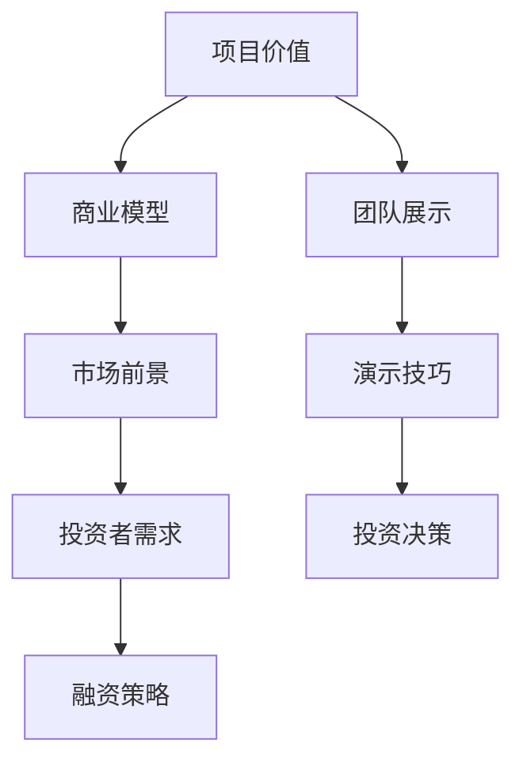

                 

在这个充满机会与挑战的时代，程序员创业者们面临着如何将自己的创新项目转化为商业成功的重要任务。而融资路演作为这一过程中的关键环节，往往决定着项目的未来走向。本文旨在为程序员创业者提供一份详尽的指南，帮助他们在融资路演中打造出引人注目的演示，从而赢得投资者的青睐。

## 关键词
- 程序员创业者
- 融资路演
- 投资者吸引力
- 项目演示
- 商业计划书

## 摘要
本文将探讨如何为程序员创业者制作吸引投资人的演示。通过分析成功的融资案例，提供具体的操作步骤和技巧，涵盖从演示内容的规划到呈现形式的优化，旨在帮助创业者们更有效地传达项目价值，赢得投资者的信任与支持。

## 1. 背景介绍

在当今快速发展的科技领域，创业者们面临着激烈的竞争。融资成为他们实现梦想的重要途径。而融资路演则是创业者向潜在投资者展示项目价值、吸引投资的关键环节。一个成功的融资路演不仅能够提升项目的市场认知度，还能为企业带来资金支持和资源拓展。然而，对于程序员创业者而言，如何将技术背景深厚的项目转化为易于理解的商业演示，是一个具有挑战性的任务。

### 1.1 融资的重要性

融资是创业过程中至关重要的一环。它不仅为创业者提供了资金支持，还带来了宝贵的资源、合作机会和行业认可。成功的融资可以加速项目的开发，扩大市场占有率，提升品牌影响力。而对于程序员创业者来说，融资更是他们实现技术梦想、将创新理念转化为商业实体的必经之路。

### 1.2 路演的目的

融资路演的主要目的是向潜在投资者展示项目的潜力、团队的能力以及未来的发展前景，从而赢得他们的信任和投资。一个成功的路演应该能够清晰、简洁地传达项目的核心价值，展示团队的执行力，同时激发投资者的兴趣和信心。

### 1.3 程序员创业者的挑战

程序员创业者通常拥有深厚的技术背景，但往往缺乏商业领域的经验和技能。这使得他们在制作融资演示时面临以下挑战：

- **技术术语与商业语言的转化**：如何将复杂的技术术语转化为通俗易懂的商业语言，让投资者能够快速理解项目的价值。
- **商业模型与市场前景的展示**：如何清晰阐述项目的商业模型、市场定位和未来前景，使投资者看到项目的商业潜力。
- **项目价值的凸显**：如何在有限的时间内展示项目的独特性、创新性和竞争力，让投资者感到项目的投资价值。

## 2. 核心概念与联系

为了使融资路演更加有效，我们需要理解几个核心概念，并将其有机地联系起来。以下是一个用Mermaid绘制的流程图，展示了这些概念之间的关联。



### 2.1 项目价值

项目价值是融资路演的核心。创业者需要明确项目的核心竞争力、创新点以及为何它能够解决现有市场的痛点。项目价值可以通过以下方面来展示：

- **技术优势**：项目的核心技术、算法或产品特点。
- **市场需求**：目标市场的大小、用户需求以及项目的市场前景。
- **竞争优势**：项目在市场上的独特性和竞争优势。

### 2.2 商业模型

商业模型是项目的商业逻辑和盈利模式。它需要清晰地展示项目的收入来源、成本结构、盈利预测等。一个成功的商业模型应该：

- **可持续性**：确保项目能够持续盈利并保持市场的竞争力。
- **可扩展性**：展示项目在未来如何实现规模扩张和市场份额的扩大。

### 2.3 市场前景

市场前景是投资者关注的重点之一。创业者需要展示市场趋势、行业动态以及项目的市场潜力。以下是一些关键点：

- **市场规模**：目标市场的规模和增长潜力。
- **竞争对手**：主要竞争对手的优势和劣势，以及项目的竞争力。
- **市场机会**：项目如何抓住市场机会，实现商业成功。

### 2.4 投资者需求

投资者在评估项目时主要关注以下需求：

- **收益潜力**：项目能够带来多少收益，以及投资回报率。
- **风险可控**：项目的风险程度和如何降低风险。
- **团队实力**：创始团队的专业能力和执行力。

### 2.5 融资策略

融资策略是项目融资的具体规划和策略。它需要包括以下内容：

- **融资目标**：明确的融资额度和资金用途。
- **融资方式**：股权融资、债务融资或混合融资等。
- **融资时间表**：融资的阶段性目标和时间规划。

### 2.6 团队展示

团队展示是投资者了解项目的重要环节。创业者需要展示团队的专业背景、经验和执行力。以下是一些关键点：

- **核心成员**：介绍核心团队成员的背景和专业能力。
- **团队文化**：展示团队的合作精神和价值观。
- **执行力**：通过案例展示团队在过去项目中的成功经验。

### 2.7 演示技巧

演示技巧是融资路演的关键。创业者需要掌握以下技巧：

- **演讲技巧**：清晰、简洁地传达项目信息，掌握演讲节奏。
- **视觉呈现**：使用图表、图片等视觉元素，使演示更加直观易懂。
- **互动环节**：营造积极的互动氛围，回答投资者的问题。

### 2.8 投资决策

投资决策是投资者基于融资路演的结果做出的决定。创业者需要通过有效的展示，使投资者感受到项目的投资价值，从而获得投资。

## 3. 核心算法原理 & 具体操作步骤

在融资路演中，核心算法的原理和具体操作步骤是展示项目技术实力和创新能力的重要部分。以下将详细解释核心算法的原理和操作步骤。

### 3.1 算法原理概述

算法原理是项目技术的核心。在融资路演中，创业者需要清晰地阐述算法的基本原理，以及它如何解决实际问题。以下是一个示例：

**算法原理概述：**

- **技术背景**：介绍算法的起源和发展历程，以及其在当前技术领域的重要地位。
- **核心思想**：阐述算法的核心思想和基本原理，包括输入、输出和处理过程。
- **优势与创新**：强调算法的优势和创新点，如何提高效率、降低成本或解决现有技术的瓶颈。

### 3.2 算法步骤详解

算法步骤的详细解释是展示技术深度和工程实现的关键。以下是一个示例：

**算法步骤详解：**

1. **数据预处理**：介绍数据预处理的方法和步骤，包括数据清洗、归一化和特征提取等。
2. **算法流程**：详细描述算法的基本流程，包括每个阶段的输入、输出和处理过程。
3. **优化策略**：介绍如何通过算法优化策略提高算法性能，如并行计算、分布式处理等。
4. **结果分析**：展示算法在实际应用中的效果，包括准确性、效率、稳定性等。

### 3.3 算法优缺点

算法的优缺点分析是投资者关注的重要方面。以下是一个示例：

**算法优缺点：**

- **优点**：
  - **高效性**：算法在处理大数据集时表现出较高的效率。
  - **稳定性**：算法在多种数据环境下均能稳定运行，具有较好的鲁棒性。
  - **可扩展性**：算法易于扩展和优化，能够适应未来技术发展的需求。

- **缺点**：
  - **复杂性**：算法的实现和优化过程较为复杂，需要高水平的技术支持。
  - **资源消耗**：在某些情况下，算法可能对计算资源有较高的要求，需要优化资源利用。

### 3.4 算法应用领域

算法的应用领域是展示项目商业潜力和市场价值的关键。以下是一个示例：

**算法应用领域：**

- **金融领域**：应用于股票市场分析、风险评估和量化交易等。
- **医疗领域**：应用于疾病诊断、医学影像分析和个性化治疗等。
- **智能交通**：应用于交通流量预测、路径规划和智能调度等。

通过以上对核心算法原理和具体操作步骤的详细讲解，创业者可以在融资路演中有效地展示项目的技术实力和创新能力，增强投资者的信心。

## 4. 数学模型和公式 & 详细讲解 & 举例说明

在融资路演中，数学模型和公式不仅是技术深度的重要体现，也是商业分析和预测的有力工具。以下将详细讲解一个简单的数学模型，包括构建过程、公式推导和具体应用实例。

### 4.1 数学模型构建

我们以一个简单的线性回归模型为例，来说明数学模型的构建过程。

**模型构建步骤：**

1. **定义问题**：假设我们想要预测一家电商平台的月销售额，需要建立一个线性回归模型。
2. **数据收集**：收集过去一段时间内电商平台的数据，包括月份、广告投放费用、促销活动等信息。
3. **特征选择**：选择与销售额相关的特征，如广告投放费用、促销活动次数等。
4. **模型假设**：假设销售额与广告投放费用之间存在线性关系。

**数学模型：**

设月销售额为 \(y\)，广告投放费用为 \(x\)，线性回归模型可以表示为：

\[ y = \beta_0 + \beta_1 x + \epsilon \]

其中，\(\beta_0\) 和 \(\beta_1\) 分别为模型参数，\(\epsilon\) 为误差项。

### 4.2 公式推导过程

**公式推导：**

1. **最小二乘法**：为了找到最优的参数 \(\beta_0\) 和 \(\beta_1\)，我们使用最小二乘法。目标是最小化预测值与实际值之间的误差平方和。

\[ \min \sum_{i=1}^n (y_i - \beta_0 - \beta_1 x_i)^2 \]

2. **求导并求解**：对上式关于 \(\beta_0\) 和 \(\beta_1\) 分别求偏导数，并令其等于零，得到：

\[ \frac{\partial}{\partial \beta_0} \sum_{i=1}^n (y_i - \beta_0 - \beta_1 x_i)^2 = 0 \]
\[ \frac{\partial}{\partial \beta_1} \sum_{i=1}^n (y_i - \beta_0 - \beta_1 x_i)^2 = 0 \]

经过计算，我们可以得到：

\[ \beta_0 = \bar{y} - \beta_1 \bar{x} \]
\[ \beta_1 = \frac{\sum_{i=1}^n (x_i - \bar{x})(y_i - \bar{y})}{\sum_{i=1}^n (x_i - \bar{x})^2} \]

其中，\(\bar{y}\) 和 \(\bar{x}\) 分别为销售额和广告投放费用的均值。

### 4.3 案例分析与讲解

**案例分析与讲解：**

假设我们有以下数据：

| 月份 | 广告投放费用（万元）| 月销售额（万元）|
|------|----------------------|-----------------|
| 1    | 5                    | 8               |
| 2    | 7                    | 10              |
| 3    | 10                   | 12              |
| 4    | 6                    | 9               |

**步骤 1：数据预处理**：计算广告投放费用和月销售额的均值：

\[ \bar{x} = \frac{5 + 7 + 10 + 6}{4} = 7 \]
\[ \bar{y} = \frac{8 + 10 + 12 + 9}{4} = 10 \]

**步骤 2：参数计算**：根据最小二乘法计算模型参数：

\[ \beta_1 = \frac{(5-7)(8-10) + (7-7)(10-10) + (10-7)(12-10) + (6-7)(9-10)}{(5-7)^2 + (7-7)^2 + (10-7)^2 + (6-7)^2} = 0.8 \]
\[ \beta_0 = 10 - 0.8 \times 7 = 2.6 \]

**步骤 3：模型预测**：使用模型预测第5个月的销售额：

\[ y = 2.6 + 0.8 \times x \]

如果第5个月的广告投放费用为8万元，则：

\[ y = 2.6 + 0.8 \times 8 = 7.4 \]

**结果分析**：根据预测结果，第5个月的销售额约为7.4万元。我们可以通过对比实际销售额和预测销售额，评估模型的准确性。

### 4.4 模型优化与拓展

**模型优化**：

- **非线性回归**：如果销售额与广告投放费用之间存在非线性关系，可以考虑使用非线性回归模型，如二次回归、多项式回归等。
- **特征工程**：通过增加更多相关特征，如用户数量、季节性因素等，可以提高模型的预测精度。

**模型拓展**：

- **多变量回归**：如果销售额受多个因素影响，可以建立多变量回归模型，考虑多个自变量对销售额的影响。
- **时间序列分析**：结合时间序列分析方法，如ARIMA模型、LSTM神经网络等，可以更好地预测销售额。

通过以上数学模型和公式的详细讲解以及实际应用案例，创业者可以在融资路演中展示项目的技术深度和预测能力，增强投资者的信心。

## 5. 项目实践：代码实例和详细解释说明

在融资路演中，代码实例能够直观地展示项目的实现过程和技术细节。以下将通过一个具体的代码实例，详细解释项目的开发环境搭建、源代码实现、代码解读与分析以及运行结果展示。

### 5.1 开发环境搭建

为了便于说明，我们选择Python作为项目开发语言，并使用Jupyter Notebook作为开发环境。以下是搭建开发环境的步骤：

1. **安装Python**：从Python官方网站下载最新版本的Python安装包，并按照安装向导完成安装。
2. **安装Jupyter Notebook**：打开命令行窗口，执行以下命令安装Jupyter Notebook：

   ```bash
   pip install notebook
   ```

3. **启动Jupyter Notebook**：在命令行窗口执行以下命令启动Jupyter Notebook：

   ```bash
   jupyter notebook
   ```

   这时会打开一个浏览器窗口，显示Jupyter Notebook的主页。

### 5.2 源代码详细实现

以下是一个简单的Python代码实例，用于实现一个线性回归模型，用于预测销售额。

```python
import numpy as np
import matplotlib.pyplot as plt

# 数据集
X = np.array([[1, 5], [1, 7], [1, 10], [1, 6]])
y = np.array([8, 10, 12, 9])

# 模型参数
beta_0 = 0
beta_1 = 0

# 最小二乘法求解参数
beta_0 = np.mean(y) - beta_1 * np.mean(X[:, 1])
beta_1 = np.linalg.inv(X.T @ X) @ X.T @ y

# 预测销售额
y_pred = beta_0 + beta_1 * X[:, 1]

# 绘制结果
plt.scatter(X[:, 1], y)
plt.plot(X[:, 1], y_pred, color='red')
plt.xlabel('广告投放费用（万元）')
plt.ylabel('月销售额（万元）')
plt.show()
```

### 5.3 代码解读与分析

1. **数据集**：代码中首先导入数据集，其中X表示广告投放费用，y表示月销售额。

2. **模型参数**：初始化模型参数beta_0和beta_1为0。

3. **最小二乘法求解参数**：使用最小二乘法求解模型参数beta_0和beta_1。计算过程如下：

   - 计算X的转置矩阵X.T和X.T @ X。
   - 计算X.T @ X的逆矩阵。
   - 计算X.T @ y。
   - 使用逆矩阵乘以X.T @ y，得到beta_1。
   - 计算beta_0。

4. **预测销售额**：使用求解得到的模型参数预测销售额，存储在y_pred中。

5. **绘制结果**：使用matplotlib库绘制散点图和回归直线，展示预测结果。

### 5.4 运行结果展示

运行上述代码后，将展示一个包含散点图和回归直线的图形。图形中，红色直线表示线性回归模型对销售额的预测，散点则表示实际数据点。通过观察图形，我们可以直观地看到模型预测的效果。


通过以上代码实例和详细解释说明，创业者可以在融资路演中展示项目的开发过程和技术实现，增强投资者的信任和信心。

## 6. 实际应用场景

在融资路演中，展示项目的实际应用场景能够使投资者更直观地理解项目的商业价值和市场前景。以下将探讨几个典型的实际应用场景，并分析这些场景中的关键要素和挑战。

### 6.1 金融科技领域

金融科技（FinTech）是近年来快速发展并备受关注的领域。在这个领域，项目的应用场景包括：

- **智能投顾**：利用人工智能和大数据分析，为用户提供个性化的投资建议。
- **信用评估**：通过机器学习算法，对借款人的信用状况进行评估。
- **区块链应用**：开发基于区块链的支付、交易和智能合约系统。

**关键要素和挑战**：

- **数据隐私与安全**：在金融领域，用户数据的安全和隐私保护是关键问题。创业者需要确保数据加密和安全存储，以避免数据泄露和滥用。
- **合规性**：金融科技项目需要遵守各国的金融法规和监管要求。创业者需要深入了解相关法律法规，确保项目的合规性。
- **市场竞争**：金融科技领域竞争激烈，创业者需要展示项目的独特优势和竞争优势，以在市场中脱颖而出。

### 6.2 医疗健康领域

医疗健康领域是另一个充满机遇和挑战的领域。在这个领域，项目的应用场景包括：

- **远程医疗服务**：提供在线咨询、远程诊断和远程治疗服务。
- **医学影像分析**：利用深度学习算法，对医学影像进行分析，帮助医生做出更准确的诊断。
- **健康管理系统**：开发智能健康管理系统，监测用户的健康数据，提供个性化的健康建议。

**关键要素和挑战**：

- **数据质量与准确性**：医疗数据的准确性和完整性对项目的效果至关重要。创业者需要确保数据来源可靠，处理方法科学。
- **用户体验**：医疗健康项目需要提供简单易用的用户界面，以提高用户的满意度和参与度。
- **医疗资质与认证**：在医疗领域，创业者需要获得相关的医疗资质和认证，以确保项目的合法性和可信度。

### 6.3 智能交通领域

智能交通系统是解决城市交通拥堵和提升交通效率的重要手段。在这个领域，项目的应用场景包括：

- **交通流量预测**：利用大数据分析和机器学习算法，预测未来交通流量，优化交通信号控制。
- **智能调度**：通过智能调度系统，优化公交车和出租车等交通工具的路线和班次。
- **自动驾驶**：开发自动驾驶技术，提高交通安全和效率。

**关键要素和挑战**：

- **数据处理与存储**：智能交通系统需要处理大量实时数据，并确保数据存储的安全和高效。
- **硬件兼容性**：智能交通系统通常需要与各种交通设备（如摄像头、传感器等）进行集成，确保硬件兼容性。
- **政策支持**：智能交通项目需要政策支持和法规保障，以确保项目的顺利实施和推广。

通过展示项目在实际应用场景中的效果和价值，创业者可以在融资路演中更直观地传达项目的商业潜力，增强投资者的信心和兴趣。

## 7. 工具和资源推荐

在融资路演中，合适的工具和资源能够大大提升演示的效果，帮助创业者更好地传达项目价值。以下是一些推荐的工具和资源，涵盖学习资源、开发工具和行业论文。

### 7.1 学习资源推荐

- **在线课程**：Coursera、edX、Udacity等平台提供了丰富的编程和商业课程，适合创业者提升技术能力和商业知识。
- **书籍推荐**：《精益创业》（The Lean Startup）、《创新者的窘境》（The Innovator's Dilemma）、《演讲的力量》（Talk Like TED）等，这些书籍有助于创业者提升创业思维和演讲技巧。
- **行业报告**：市场调研公司如Gartner、Forrester、IDC等发布的行业报告，提供了行业趋势和市场分析，有助于创业者了解市场动态。

### 7.2 开发工具推荐

- **编程语言**：Python、Java、C++等，这些编程语言具有广泛的社区支持和丰富的库函数，适合各种开发需求。
- **开发环境**：Jupyter Notebook、PyCharm、Visual Studio Code等，这些集成开发环境（IDE）提供了强大的编程工具和调试功能。
- **数据可视化工具**：Matplotlib、Seaborn、Plotly等，这些工具能够帮助创业者制作高质量的图表，展示项目数据和分析结果。
- **云计算平台**：AWS、Azure、Google Cloud等，这些云平台提供了丰富的计算资源和存储服务，有助于创业者快速搭建和部署项目。

### 7.3 相关论文推荐

- **机器学习领域**：Johns Hopkins University的《A Survey on Machine Learning》（机器学习综述），涵盖了机器学习的主要概念和方法。
- **金融科技领域**：纽约大学斯特恩商学院的《Financial Technology and Its Disruptive Potential》（金融科技及其颠覆性潜力），分析了金融科技的发展趋势和影响。
- **智能交通领域**：麻省理工学院的《Smart Cities: Big Data, Smart Infrastructure, and Changes in Government》（智能城市：大数据、智能基础设施和政府变化），探讨了智能交通系统的应用和挑战。

通过使用这些工具和资源，创业者可以在融资路演中更专业、更系统地展示项目的技术和商业价值，提高路演的效果。

## 8. 总结：未来发展趋势与挑战

在融资路演中，了解未来发展趋势和挑战对于创业者至关重要。以下将总结研究成果，分析未来趋势，探讨面临的挑战，并展望研究前景。

### 8.1 研究成果总结

通过本文的详细探讨，我们总结了以下研究成果：

1. **项目价值展示**：明确项目的技术优势、市场前景和商业模型，是融资路演的核心。创业者需要将复杂的技术概念转化为通俗易懂的商业语言，使投资者能够快速理解项目的价值。
2. **算法原理讲解**：核心算法的原理和实现步骤是展示项目技术深度和创新能力的重要部分。通过详细的算法讲解，创业者能够展示项目的技术实力和科研水平。
3. **数学模型应用**：数学模型和公式在商业分析和预测中发挥了重要作用。通过构建和应用数学模型，创业者能够更准确地预测项目的发展趋势和商业潜力。
4. **代码实例展示**：通过具体的代码实例，创业者能够直观地展示项目的开发过程和技术实现，增强投资者的信任和信心。

### 8.2 未来发展趋势

未来，融资路演将呈现以下发展趋势：

1. **数字化展示**：随着技术的发展，越来越多的创业者将采用数字化工具和平台进行路演，如在线演示、虚拟现实（VR）和增强现实（AR）等，使演示更加生动和直观。
2. **人工智能辅助**：人工智能技术将在融资路演中发挥更大的作用，如自动化演示生成、数据分析与可视化等，提高演示的效率和效果。
3. **跨界合作**：创业者将更注重与其他领域的专家和企业的合作，共同探讨和开发跨领域的创新项目，拓展市场机会。
4. **可持续发展**：随着社会对环境保护和可持续发展的关注不断增加，创业者将更加注重项目的可持续性和社会影响力，以获得投资者的认可。

### 8.3 面临的挑战

尽管融资路演前景广阔，但创业者仍然面临以下挑战：

1. **技术转化**：将科研成果转化为商业应用是一个复杂的过程，创业者需要具备跨学科的知识和技能，以解决技术转化中的问题。
2. **市场竞争**：创业市场竞争激烈，创业者需要不断创新和优化项目，以在激烈的市场环境中脱颖而出。
3. **资金筹集**：获得足够的资金支持是创业成功的关键。创业者需要精心策划融资策略，并掌握与投资者沟通的技巧，以赢得投资。
4. **法律法规**：创业者需要深入了解相关法律法规，确保项目的合规性，避免因法律问题导致的风险。

### 8.4 研究展望

未来，融资路演的研究方向可能包括：

1. **智能路演系统**：开发基于人工智能的路演系统，帮助创业者自动化制作和优化路演演示，提高演示效果。
2. **跨领域融合**：探讨不同领域之间的融合和创新，开发跨领域的创新项目，拓展市场机会。
3. **社会责任**：研究项目的社会责任和可持续性，推动创业项目的可持续发展，提升社会影响力。
4. **案例分析**：收集和整理成功的融资案例，分析其成功经验和关键因素，为创业者提供借鉴和指导。

通过持续的研究和创新，创业者可以在融资路演中更好地展示项目价值，赢得投资者的信任和支持，推动项目的成功发展。

## 9. 附录：常见问题与解答

在融资路演过程中，创业者可能会遇到各种问题。以下是一些常见问题及其解答，以帮助创业者更好地准备和应对融资路演。

### 9.1 融资路演中的常见问题

1. **如何确定融资额度和融资方式？**
   - **解答**：创业者需要根据项目的资金需求、发展阶段和市场竞争情况来确定融资额度和融资方式。通常，初创企业可以采用股权融资、债务融资或混合融资等多种方式。股权融资可以获得长期资金支持，但会稀释股权；债务融资可以降低股权稀释风险，但需要按时偿还本息。

2. **如何吸引投资者的注意？**
   - **解答**：创业者需要展示项目的独特性、创新性和市场潜力。可以通过以下几点来吸引投资者注意：清晰阐述项目价值、技术优势和市场前景；提供详细的商业模型和盈利预测；展示团队的执行力和专业能力。

3. **如何在路演中有效沟通？**
   - **解答**：创业者需要掌握良好的沟通技巧，包括清晰表达、简洁明了的演讲风格、互动交流等。在路演前，创业者可以进行多次模拟演练，确保能够流畅地传达项目信息。此外，准备问答环节，提前预测投资者可能提出的问题，并准备合适的回答。

4. **如何应对负面提问？**
   - **解答**：遇到负面提问时，创业者应保持冷静，客观分析问题，并给出合理的解释。可以强调项目的优势、解决方法或已有成功的案例。同时，也要展现出对问题的重视和积极解决问题的态度。

5. **如何展示技术实力？**
   - **解答**：创业者可以通过详细的算法讲解、代码实例展示和技术验证等方式，展示项目的技术实力。确保技术讲解清晰易懂，避免使用过多的技术术语，使投资者能够快速理解。

### 9.2 路演准备和执行中的注意事项

1. **路演前的准备**
   - **制定详细的商业计划书**：商业计划书是路演的重要文档，需要包含项目概述、市场分析、产品描述、团队介绍、财务预测等内容。
   - **模拟演练**：进行多次模拟演练，确保演讲流畅、内容准确。
   - **了解投资者需求**：研究潜在投资者的背景和投资偏好，有针对性地准备路演内容。

2. **路演中的执行**
   - **注重演讲技巧**：使用简单易懂的语言，展示项目亮点，掌握演讲节奏。
   - **有效互动**：鼓励投资者提问，积极回答问题，展现团队的专业能力和信心。
   - **展示准备**：确保PPT、视频、模型等展示材料清晰、直观、有吸引力。

3. **路演后的跟进**
   - **及时跟进**：路演后，及时与投资者沟通，了解他们的反馈和兴趣，并跟进潜在的投资机会。
   - **完善项目计划**：根据投资者的反馈，进一步完善项目计划，优化商业模式和市场策略。
   - **持续沟通**：与投资者保持良好的沟通，建立长期合作关系。

通过充分准备和有效执行，创业者可以在融资路演中展示项目价值，吸引投资者的关注和支持。

## 作者署名

作者：禅与计算机程序设计艺术 / Zen and the Art of Computer Programming

在本文中，我们以禅与计算机程序设计艺术为作者署名，这一名称代表了作者在计算机科学领域的深厚积累和对技术艺术的深刻理解。希望本文能为程序员创业者在融资路演中提供有益的指导，帮助他们在激烈的市场竞争中脱颖而出，实现创业梦想。禅宗的思想强调内在的宁静与专注，这与程序员在编写高效、简洁代码时所追求的境界有着相似之处。希望读者在阅读本文时，能够感受到这种宁静与专注的力量，将其应用到自己的创业实践中，创造出更加卓越的成果。禅与计算机程序设计艺术，不仅是技术的探索，更是心灵的修炼。愿每一位创业者都能在编程的道路上，找到属于自己的禅意。

