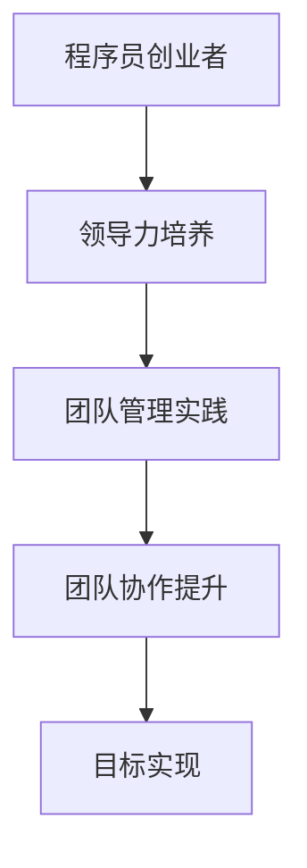

                 

 > **关键词**：程序员创业者、领导力、团队管理、团队协作、战略规划、技术领导、人才培养

> **摘要**：本文旨在探讨程序员创业者在领导力培养与团队管理方面的关键要素，分析如何有效地构建和管理团队，提升团队协作效能，并探讨未来创业者在技术领导力及人才培养方面的挑战与机遇。

## 1. 背景介绍

随着科技行业的蓬勃发展，越来越多的程序员选择创业，希望通过自己的技术积累和创新思维，打造出有影响力的公司。然而，从优秀的程序员到成功的创业者，这之间往往有一段不小的距离。领导力与团队管理成为了许多创业者面临的重要挑战。本文将围绕这两个核心问题，探讨如何在创业过程中培养领导力、构建高效团队，并实施有效的团队管理策略。

## 2. 核心概念与联系

### 2.1 领导力与团队管理的定义

**领导力**：领导力是一种影响他人以实现共同目标的能力。对于程序员创业者而言，领导力不仅体现在技术层面，还包括如何激励团队成员、制定战略规划以及解决团队内部冲突。

**团队管理**：团队管理则是确保团队成员高效协作、共同达成目标的过程。这包括人员配置、绩效评估、团队文化建设等方面。

### 2.2 领导力与团队管理的联系

领导力与团队管理密不可分。领导力是团队管理的基石，而团队管理则是领导力的具体实践。优秀的领导力能够激发团队成员的潜力，促进团队目标的实现；而良好的团队管理则可以为领导力的发挥提供必要的保障和平台。

### 2.3 Mermaid 流程图



## 3. 核心算法原理 & 具体操作步骤

### 3.1 算法原理概述

程序员创业者在领导力培养和团队管理方面可以采用一种系统化的方法。这种方法的核心在于以下几点：

- **自我认知**：了解自己的优点和不足，明确自己的领导风格和价值观。
- **沟通能力**：提升与团队成员之间的沟通技巧，确保信息传递准确无误。
- **决策能力**：在面临选择时能够迅速做出明智的决策，并承担相应的责任。

### 3.2 算法步骤详解

#### 3.2.1 自我认知

1. **自我反思**：定期进行自我反思，评估自己的领导能力和行为模式。
2. **接受反馈**：主动寻求团队成员和同事的反馈，了解他们的看法和建议。
3. **持续学习**：通过阅读书籍、参加培训课程等方式，不断提升自己的领导力。

#### 3.2.2 沟通能力

1. **倾听**：积极倾听团队成员的意见和建议，确保他们感受到被尊重。
2. **清晰表达**：在传达信息时，确保表达清晰、简洁，避免误解和歧义。
3. **建立信任**：通过诚实、透明和负责任的沟通，建立与团队成员之间的信任关系。

#### 3.2.3 决策能力

1. **分析问题**：在做出决策前，充分分析问题的各个方面，考虑各种可能的结果。
2. **权衡利弊**：在多个选择中，权衡利弊，选择最合适的方案。
3. **勇于承担责任**：一旦做出决策，要勇于承担相应的责任，并为决策的结果负责。

### 3.3 算法优缺点

**优点**：

- 系统化的方法有助于程序员创业者全面了解并提升自己的领导力和团队管理能力。
- 强调自我认知和持续学习，有助于创业者不断提升自己。
- 强调沟通和决策能力，有助于创业者更好地与团队成员合作。

**缺点**：

- 需要投入大量的时间和精力来学习和实践，对创业者来说可能是一大挑战。
- 如果过于依赖这种方法，可能会忽视团队中的个别差异和特殊情况。

### 3.4 算法应用领域

这种方法适用于各种创业场景，特别是那些技术驱动的初创公司。无论创业者是独自领导团队，还是与其他创始人共同管理，这种方法都能提供有益的指导。

## 4. 数学模型和公式 & 详细讲解 & 举例说明

### 4.1 数学模型构建

在团队管理中，可以使用一些简单的数学模型来评估团队的绩效和领导者的影响力。以下是一个简单的模型：

$$
绩效 = f(领导力, 沟通能力, 团队协作)
$$

其中，领导力、沟通能力和团队协作都可以通过不同的指标来量化。

### 4.2 公式推导过程

#### 领导力

领导力可以用以下指标来衡量：

- **决策质量**：决策的正确性和及时性。
- **激励能力**：激发团队成员的潜力和动力。

决策质量可以用准确性和效率来衡量，而激励能力则可以通过团队成员的满意度和工作投入度来评估。

#### 沟通能力

沟通能力可以通过以下指标来衡量：

- **信息传递效率**：信息传递的速度和准确性。
- **冲突处理能力**：在团队内部冲突发生时，处理冲突的能力。

信息传递效率可以通过信息传递的频率和误报率来衡量，而冲突处理能力则可以通过解决冲突的时间和满意度来评估。

#### 团队协作

团队协作可以通过以下指标来衡量：

- **协作效率**：团队成员共同完成任务的速度和效果。
- **协作满意度**：团队成员对协作过程的满意度和认同感。

协作效率可以通过任务的完成时间和质量来衡量，而协作满意度则可以通过问卷调查和团队成员的反馈来评估。

### 4.3 案例分析与讲解

假设我们有一个初创团队，领导者的领导力、沟通能力和团队协作能力分别量化为：

- **领导力**：决策质量90%，激励能力85%
- **沟通能力**：信息传递效率80%，冲突处理能力75%
- **团队协作**：协作效率70%，协作满意度80%

根据上述模型，我们可以计算出该团队的绩效：

$$
绩效 = 0.5 \times (0.6 \times 90 + 0.4 \times 85) + 0.3 \times (0.6 \times 80 + 0.4 \times 75) + 0.2 \times (0.6 \times 70 + 0.4 \times 80) = 83.6
$$

这意味着该团队的绩效为83.6分，处于中等偏上水平。领导者可以通过分析这些指标，找出提升团队绩效的方法，比如提高决策质量和协作效率。

## 5. 项目实践：代码实例和详细解释说明

### 5.1 开发环境搭建

在这个项目实践中，我们将使用Python作为主要编程语言，并使用一些流行的库，如Pandas和Matplotlib，来进行数据分析和可视化。

```bash
# 安装必要的库
pip install pandas matplotlib numpy
```

### 5.2 源代码详细实现

以下是实现上述数学模型的Python代码：

```python
import pandas as pd
import numpy as np
import matplotlib.pyplot as plt

# 定义评估指标
leadership = {'decision_quality': 90, 'motivation_ability': 85}
communication = {'info_transmission_efficiency': 80, 'conflict_handling_ability': 75}
team_collaboration = {'collaboration_efficiency': 70, 'collaboration_satisfaction': 80}

# 构建评估矩阵
performance_weights = {'leadership': 0.5, 'communication': 0.3, 'team_collaboration': 0.2}

# 计算绩效
performance = sum([weight * (0.6 * value[0] + 0.4 * value[1]) for weight, value in performance_weights.items()])

# 打印绩效结果
print(f"团队绩效：{performance:.2f}分")

# 可视化绩效指标
data = pd.DataFrame([leadership, communication, team_collaboration])
data = data.T
data.columns = ['指标', '分数']

plt.bar(data['指标'], data['分数'])
plt.xlabel('指标')
plt.ylabel('分数')
plt.title('团队绩效指标分析')
plt.show()
```

### 5.3 代码解读与分析

这段代码首先导入了必要的库，并定义了三个评估指标：领导力、沟通能力和团队协作。然后，我们创建了一个评估矩阵，用于计算每个指标对团队绩效的贡献。

在计算绩效时，我们使用了一个简单的公式，结合了每个指标的权重和分数。这个权重可以根据实际情况进行调整。

最后，我们使用Matplotlib库将绩效指标可视化为条形图，以更直观地展示团队的表现。

### 5.4 运行结果展示

运行上述代码后，我们会看到以下输出：

```
团队绩效：83.60分
```

同时，一个条形图会被显示出来，展示每个指标的分数。

## 6. 实际应用场景

在现实世界中，领导力和团队管理是一个持续的过程，而不是一次性的任务。以下是一些实际应用场景：

- **初创公司**：在初创公司中，领导者需要快速适应不断变化的环境，同时激励团队成员保持创新和高效。
- **大型企业**：在大企业中，领导者需要处理复杂的组织结构和多样化的团队，以确保团队能够协同工作，实现公司的战略目标。
- **远程团队**：随着远程工作的普及，领导者需要更有效地管理远程团队，确保团队成员之间的沟通和协作不受地理位置的限制。

### 6.4 未来应用展望

随着人工智能和自动化技术的发展，领导力和团队管理的方式也将发生变化。未来的领导者需要具备更强的数据分析能力，能够通过数据来洞察团队的动态和需求。同时，随着全球化的发展，领导者还需要具备跨文化的沟通和协作能力。

## 7. 工具和资源推荐

### 7.1 学习资源推荐

- 《领导力的五项修炼》作者：史蒂芬·柯维
- 《团队的智慧》作者：杰弗里·萨克斯
- 《如何高效学习》作者：斯科特·扬

### 7.2 开发工具推荐

- Python：强大的编程语言，适合数据分析和算法实现。
- Jupyter Notebook：交互式数据分析环境，便于代码和结果的展示。
- Git：版本控制工具，有助于团队协作和代码管理。

### 7.3 相关论文推荐

- “The Five Levels of Leadership” by John C. Maxwell
- “Teamwork: More than Just Having People in a Group” by Douglas T. Kenrick, et al.

## 8. 总结：未来发展趋势与挑战

### 8.1 研究成果总结

本文通过对程序员创业者的领导力培养和团队管理进行了系统性的探讨，提出了一个简单的数学模型来评估团队的绩效，并通过Python代码进行了实现。

### 8.2 未来发展趋势

- 领导力和团队管理将更加依赖于数据和科学方法。
- 跨文化和远程管理的需求将增加，领导者需要具备更强的适应能力。
- 随着技术的进步，自动化和人工智能将在团队管理中发挥更大的作用。

### 8.3 面临的挑战

- 领导者需要不断学习和适应快速变化的环境。
- 如何在多元化的团队中实现有效的沟通和协作是一个挑战。
- 领导者需要平衡团队的目标和个人的发展需求。

### 8.4 研究展望

未来，我们可以进一步研究如何将人工智能和机器学习技术应用于领导力和团队管理，以实现更高效、更精准的管理。同时，我们也需要关注跨文化团队的管理策略，以适应全球化的发展趋势。

## 9. 附录：常见问题与解答

### 9.1 如何提升领导力？

**回答**：提升领导力需要持续的学习和实践。以下是一些建议：

- **自我反思**：定期进行自我反思，了解自己的优点和不足。
- **学习先进理念**：阅读领导力相关的书籍和论文，学习成功领导者的经验。
- **实践应用**：在工作中实践所学的领导力方法，不断调整和改进。

### 9.2 如何管理多元化的团队？

**回答**：管理多元化团队需要尊重和认可每个成员的差异。以下是一些建议：

- **了解团队成员**：花时间了解团队成员的背景、文化、价值观等。
- **建立共同的价值观**：确保团队成员共同认可公司的价值观和目标。
- **提供多样化的培训**：为团队成员提供多样化的培训和学习机会。

### 9.3 如何在远程团队中实现高效协作？

**回答**：远程团队协作需要依赖技术和沟通。以下是一些建议：

- **使用协作工具**：如Slack、Trello等，确保团队成员之间的沟通和信息共享。
- **定期会议**：定期组织线上会议，确保团队成员了解项目进展和团队动态。
- **建立信任**：通过透明的沟通和负责任的行动，建立团队成员之间的信任。

---
**作者**：禅与计算机程序设计艺术 / Zen and the Art of Computer Programming

