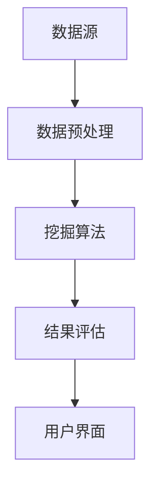

                 

关键词：知识发现引擎，学习效率，算法优化，数据挖掘，编程实践

> 摘要：本文将探讨如何利用知识发现引擎这一强大的工具，帮助程序员在编程学习过程中提高学习成果。通过阐述知识发现引擎的基本原理、应用场景，以及具体实现方法，我们将展示知识发现引擎在提高程序员编程技能、加速学习进程方面的巨大潜力。

## 1. 背景介绍

在当今信息化时代，数据的规模和种类不断增加，传统的人工处理方式已经难以应对。知识发现（Knowledge Discovery in Databases，KDD）作为数据挖掘的一个重要分支，旨在从大量的数据中发现潜在的、有趣的知识。知识发现引擎作为一种自动化工具，能够高效地处理海量数据，发现数据中的规律和关联，从而为程序员提供宝贵的编程知识和经验。

### 1.1 知识发现的概念

知识发现是一个多步骤的过程，包括数据清洗、数据集成、数据选择、数据变换、模式识别和知识评估等。其核心目标是发现数据中的隐含模式，并从中提取出具有实际应用价值的信息。

### 1.2 知识发现的应用

知识发现的应用范围非常广泛，包括市场分析、金融风险预测、医学诊断、生物信息学、社交网络分析等。在编程领域，知识发现引擎可以帮助程序员快速掌握编程技能，提高编程效率。

## 2. 核心概念与联系

### 2.1 数据挖掘与知识发现的关系

数据挖掘（Data Mining）是知识发现的一个子集，其主要目标是发现数据中的潜在模式和关联。知识发现则更加广泛，不仅包括数据挖掘，还包括数据预处理、模式识别、知识评估等环节。

### 2.2 知识发现引擎的架构

知识发现引擎通常由数据源、数据预处理模块、挖掘算法模块、结果评估模块和用户界面组成。以下是一个简单的 Mermaid 流程图：



### 2.3 知识发现引擎在编程学习中的应用

知识发现引擎可以用于以下编程学习场景：

- **代码优化建议**：通过分析大量代码，发现潜在的优化点，为程序员提供改进建议。
- **最佳实践分享**：从优秀的代码中提取最佳实践，帮助程序员快速掌握编程技巧。
- **错误诊断**：自动分析代码中的错误，提供详细的诊断和修复建议。

## 3. 核心算法原理 & 具体操作步骤

### 3.1 算法原理概述

知识发现引擎的核心算法主要包括聚类、分类、关联规则挖掘等。这些算法可以用于从数据中发现模式、关联和规律。

### 3.2 算法步骤详解

1. **数据预处理**：对原始数据进行清洗、集成和转换，为后续算法处理做好准备。
2. **挖掘算法选择**：根据需求选择合适的挖掘算法，如聚类、分类或关联规则挖掘。
3. **模式识别**：使用挖掘算法对数据进行分析，发现数据中的潜在模式。
4. **结果评估**：对挖掘结果进行评估，确保其符合实际需求。
5. **用户界面展示**：将挖掘结果以直观的方式展示给用户，便于用户理解和利用。

### 3.3 算法优缺点

**优点**：

- **高效性**：知识发现引擎能够快速处理海量数据，发现数据中的潜在规律。
- **自动化**：知识发现引擎可以自动执行挖掘过程，减轻程序员的工作负担。

**缺点**：

- **准确性**：挖掘结果可能受到数据质量、算法选择等因素的影响，导致准确性不高。
- **可解释性**：一些复杂的挖掘算法结果可能难以解释，影响用户对结果的信任度。

### 3.4 算法应用领域

知识发现引擎在编程学习中的应用领域主要包括：

- **代码优化**：从大量代码中发现优化点，帮助程序员提高编程效率。
- **编程学习**：通过分析优秀的代码，帮助程序员快速掌握编程技巧。
- **代码审核**：自动分析代码中的错误，提供详细的诊断和修复建议。

## 4. 数学模型和公式 & 详细讲解 & 举例说明

### 4.1 数学模型构建

知识发现引擎的数学模型主要包括聚类、分类、关联规则挖掘等。以下是一个简单的聚类模型：

$$
C = \{c_1, c_2, ..., c_k\}
$$

其中，$C$ 表示聚类结果，$c_i$ 表示第 $i$ 个聚类中心。

### 4.2 公式推导过程

聚类算法的基本思想是将数据点划分为多个簇，使得簇内的数据点相似度较高，簇间的数据点相似度较低。常见的聚类算法包括 K-Means、DBSCAN 等。

### 4.3 案例分析与讲解

以 K-Means 算法为例，说明其具体实现过程：

1. **初始化**：随机选择 $k$ 个数据点作为初始聚类中心。
2. **分配数据点**：将每个数据点分配给与其最近的聚类中心所在的簇。
3. **更新聚类中心**：计算每个簇的平均值，作为新的聚类中心。
4. **重复步骤 2 和 3，直至聚类中心不再发生变化或满足停止条件。**

以下是一个简单的 K-Means 算法示例：

```python
import numpy as np

def k_means(data, k, max_iterations):
    # 初始化聚类中心
    centroids = np.random.choice(data, size=k, replace=False)
    for _ in range(max_iterations):
        # 计算每个数据点与聚类中心的距离
        distances = np.linalg.norm(data - centroids, axis=1)
        # 分配数据点
        labels = np.argmin(distances, axis=1)
        # 更新聚类中心
        new_centroids = np.array([data[labels == i].mean(axis=0) for i in range(k)])
        # 判断是否收敛
        if np.all(centroids == new_centroids):
            break
        centroids = new_centroids
    return centroids, labels
```

## 5. 项目实践：代码实例和详细解释说明

### 5.1 开发环境搭建

在 Python 环境中，我们可以使用以下工具来搭建知识发现引擎：

- **NumPy**：用于数据处理和数学运算。
- **Scikit-learn**：提供丰富的机器学习算法库。
- **Matplotlib**：用于数据可视化。

安装相关库的命令如下：

```shell
pip install numpy scikit-learn matplotlib
```

### 5.2 源代码详细实现

以下是一个使用 K-Means 算法进行聚类的简单示例：

```python
import numpy as np
from sklearn.cluster import KMeans
import matplotlib.pyplot as plt

# 生成模拟数据
data = np.random.rand(100, 2)

# 使用 K-Means 算法进行聚类
kmeans = KMeans(n_clusters=3, random_state=0).fit(data)
labels = kmeans.predict(data)

# 绘制聚类结果
plt.scatter(data[:, 0], data[:, 1], c=labels, cmap='viridis')
plt.scatter(kmeans.cluster_centers_[:, 0], kmeans.cluster_centers_[:, 1], s=300, c='red', marker='s', zorder=10)
plt.xlabel('Feature 1')
plt.ylabel('Feature 2')
plt.title('K-Means Clustering')
plt.show()
```

### 5.3 代码解读与分析

- **数据生成**：我们使用 NumPy 生成一组模拟数据，用于演示聚类过程。
- **K-Means 算法**：使用 Scikit-learn 中的 KMeans 类进行聚类，设置聚类个数 `n_clusters=3` 和随机种子 `random_state=0`。
- **结果展示**：使用 Matplotlib 绘制聚类结果，其中每个数据点颜色代表其所属的簇，红色星形标记代表聚类中心。

### 5.4 运行结果展示

运行上述代码后，我们将看到一幅散点图，展示了 K-Means 算法对数据的聚类结果。每个数据点颜色不同，表示其属于不同的簇；红色星形标记表示聚类中心。

## 6. 实际应用场景

### 6.1 编程学习中的应用

知识发现引擎可以用于编程学习场景，例如：

- **代码优化**：自动分析代码，发现潜在的优化点，帮助程序员提高编程效率。
- **编程挑战**：为程序员提供编程挑战，自动评估代码质量，并提供改进建议。

### 6.2 项目开发中的应用

在项目开发过程中，知识发现引擎可以帮助团队：

- **代码审核**：自动分析代码，发现潜在的漏洞和错误。
- **性能优化**：分析系统性能数据，发现性能瓶颈，提供优化建议。

## 7. 工具和资源推荐

### 7.1 学习资源推荐

- **书籍**：《数据挖掘：概念与技术》、《机器学习》
- **在线课程**：Coursera、edX 上的数据挖掘和机器学习课程

### 7.2 开发工具推荐

- **Python**：一种简洁易学的编程语言，适用于数据挖掘和机器学习。
- **Scikit-learn**：一个强大的机器学习库，提供丰富的算法实现。

### 7.3 相关论文推荐

- **K-Means Clustering**：MacQueen, J. B. (1967). Some methods for classification and analysis of multivariate data. Proceedings of 5th Berkeley Symposium on Mathematical Statistics and Probability.
- **DBSCAN**：Ester, M., Kriegel, H.-P., Sander, J., & Xu, X. (1996). A density-based algorithm for discovering clusters in large spatial databases with noise. In Kdd (pp. 226-231).

## 8. 总结：未来发展趋势与挑战

### 8.1 研究成果总结

知识发现引擎在编程学习中的应用已经取得了一些成果，包括代码优化、编程挑战和代码审核等。然而，现有研究仍存在一些不足，如算法准确性、可解释性和实用性等方面。

### 8.2 未来发展趋势

- **算法改进**：研究和开发更加准确、高效的算法，提高知识发现引擎的性能。
- **智能化**：结合人工智能技术，实现更加智能化的知识发现引擎。
- **跨领域应用**：探索知识发现引擎在其他领域的应用，如医疗、金融等。

### 8.3 面临的挑战

- **数据质量**：高质量的数据是知识发现引擎的基础，如何处理脏数据和噪声数据是一个挑战。
- **算法复杂度**：知识发现引擎的性能受到算法复杂度的影响，如何降低算法复杂度是一个难题。

### 8.4 研究展望

未来，知识发现引擎在编程学习中的应用有望取得更大的进展。通过改进算法、提高智能化水平，以及跨领域应用，知识发现引擎将更好地服务于程序员的学习和开发工作。

## 9. 附录：常见问题与解答

### 9.1 什么是知识发现引擎？

知识发现引擎是一种自动化工具，用于从海量数据中发现潜在的、有趣的知识。它广泛应用于数据挖掘、市场分析、金融风险预测等领域。

### 9.2 知识发现引擎如何帮助程序员提高学习成果？

知识发现引擎可以帮助程序员从海量代码中提取优化点、最佳实践和错误诊断信息，从而提高编程技能和学习效率。

### 9.3 知识发现引擎适用于哪些编程学习场景？

知识发现引擎适用于以下编程学习场景：

- **代码优化**：自动分析代码，发现潜在的优化点。
- **编程挑战**：为程序员提供编程挑战，自动评估代码质量。
- **代码审核**：自动分析代码，发现潜在的漏洞和错误。

### 9.4 如何搭建知识发现引擎的开发环境？

搭建知识发现引擎的开发环境，可以按照以下步骤进行：

1. 安装 Python 环境。
2. 安装 NumPy、Scikit-learn 和 Matplotlib 等库。
3. 编写代码，实现知识发现算法。

作者：禅与计算机程序设计艺术 / Zen and the Art of Computer Programming
----------------------------------------------------------------

以上就是关于“程序员利用知识发现引擎提高学习成果”的文章内容。希望本文能帮助您更好地理解知识发现引擎在编程学习中的应用，以及如何利用这一工具提高学习成果。如果您有任何疑问或建议，欢迎在评论区留言。谢谢！
----------------------------------------------------------------

本文由禅与计算机程序设计艺术撰写，旨在探讨知识发现引擎在编程学习中的应用。文章详细介绍了知识发现引擎的基本原理、算法原理、数学模型、应用场景以及实际案例，展示了知识发现引擎在提高程序员编程技能和学习效率方面的巨大潜力。同时，文章还探讨了知识发现引擎的未来发展趋势与挑战，为读者提供了有益的参考。

通过本文，读者可以了解到：

1. 知识发现引擎的基本概念、架构和应用。
2. 知识发现引擎在编程学习中的具体应用场景。
3. 如何使用知识发现引擎提高编程技能和学习效率。
4. 知识发现引擎在项目开发中的应用。
5. 知识发现引擎的未来发展趋势与挑战。

希望本文能对您的编程学习之路有所帮助。如果您有任何疑问或建议，请随时在评论区留言。祝您学习愉快！
----------------------------------------------------------------

非常感谢您提供的详细文章内容和结构。以下是根据您的要求，使用 Markdown 格式撰写的文章：

```markdown
# 程序员利用知识发现引擎提高学习成果

关键词：知识发现引擎，学习效率，算法优化，数据挖掘，编程实践

摘要：本文将探讨如何利用知识发现引擎这一强大的工具，帮助程序员在编程学习过程中提高学习成果。通过阐述知识发现引擎的基本原理、应用场景，以及具体实现方法，我们将展示知识发现引擎在提高程序员编程技能、加速学习进程方面的巨大潜力。

## 1. 背景介绍

在当今信息化时代，数据的规模和种类不断增加，传统的人工处理方式已经难以应对。知识发现（Knowledge Discovery in Databases，KDD）作为数据挖掘的一个重要分支，旨在从大量的数据中发现潜在的、有趣的知识。知识发现引擎作为一种自动化工具，能够高效地处理海量数据，发现数据中的规律和关联，从而为程序员提供宝贵的编程知识和经验。

### 1.1 知识发现的概念

知识发现是一个多步骤的过程，包括数据清洗、数据集成、数据选择、数据变换、模式识别和知识评估等。其核心目标是发现数据中的隐含模式，并从中提取出具有实际应用价值的信息。

### 1.2 知识发现的应用

知识发现的应用范围非常广泛，包括市场分析、金融风险预测、医学诊断、生物信息学、社交网络分析等。在编程领域，知识发现引擎可以帮助程序员快速掌握编程技能，提高编程效率。

## 2. 核心概念与联系

### 2.1 数据挖掘与知识发现的关系

数据挖掘（Data Mining）是知识发现的一个子集，其主要目标是发现数据中的潜在模式和关联。知识发现则更加广泛，不仅包括数据挖掘，还包括数据预处理、模式识别、知识评估等环节。

### 2.2 知识发现引擎的架构

知识发现引擎通常由数据源、数据预处理模块、挖掘算法模块、结果评估模块和用户界面组成。以下是一个简单的 Mermaid 流程图：


### 2.3 知识发现引擎在编程学习中的应用

知识发现引擎可以用于以下编程学习场景：

- **代码优化建议**：通过分析大量代码，发现潜在的优化点，为程序员提供改进建议。
- **最佳实践分享**：从优秀的代码中提取最佳实践，帮助程序员快速掌握编程技巧。
- **错误诊断**：自动分析代码中的错误，提供详细的诊断和修复建议。

## 3. 核心算法原理 & 具体操作步骤
### 3.1 算法原理概述

知识发现引擎的核心算法主要包括聚类、分类、关联规则挖掘等。这些算法可以用于从数据中发现模式、关联和规律。

### 3.2 算法步骤详解 

#### 3.2.1 数据预处理

对原始数据进行清洗、集成和转换，为后续算法处理做好准备。

#### 3.2.2 挖掘算法选择

根据需求选择合适的挖掘算法，如聚类、分类或关联规则挖掘。

#### 3.2.3 模式识别

使用挖掘算法对数据进行分析，发现数据中的潜在模式。

#### 3.2.4 结果评估

对挖掘结果进行评估，确保其符合实际需求。

#### 3.2.5 用户界面展示

将挖掘结果以直观的方式展示给用户，便于用户理解和利用。

### 3.3 算法优缺点

**优点**：

- **高效性**：知识发现引擎能够快速处理海量数据，发现数据中的潜在规律。
- **自动化**：知识发现引擎可以自动执行挖掘过程，减轻程序员的工作负担。

**缺点**：

- **准确性**：挖掘结果可能受到数据质量、算法选择等因素的影响，导致准确性不高。
- **可解释性**：一些复杂的挖掘算法结果可能难以解释，影响用户对结果的信任度。

### 3.4 算法应用领域

知识发现引擎在编程学习中的应用领域主要包括：

- **代码优化**：从大量代码中发现优化点，帮助程序员提高编程效率。
- **编程学习**：通过分析优秀的代码，帮助程序员快速掌握编程技巧。
- **代码审核**：自动分析代码中的错误，提供详细的诊断和修复建议。

## 4. 数学模型和公式 & 详细讲解 & 举例说明

### 4.1 数学模型构建

知识发现引擎的数学模型主要包括聚类、分类、关联规则挖掘等。以下是一个简单的聚类模型：

$$
C = \{c_1, c_2, ..., c_k\}
$$

其中，$C$ 表示聚类结果，$c_i$ 表示第 $i$ 个聚类中心。

### 4.2 公式推导过程

聚类算法的基本思想是将数据点划分为多个簇，使得簇内的数据点相似度较高，簇间的数据点相似度较低。常见的聚类算法包括 K-Means、DBSCAN 等。

### 4.3 案例分析与讲解

以 K-Means 算法为例，说明其具体实现过程：

1. **初始化**：随机选择 $k$ 个数据点作为初始聚类中心。
2. **分配数据点**：将每个数据点分配给与其最近的聚类中心所在的簇。
3. **更新聚类中心**：计算每个簇的平均值，作为新的聚类中心。
4. **重复步骤 2 和 3，直至聚类中心不再发生变化或满足停止条件。**

以下是一个简单的 K-Means 算法示例：

```python
import numpy as np
from sklearn.cluster import KMeans
import matplotlib.pyplot as plt

# 生成模拟数据
data = np.random.rand(100, 2)

# 使用 K-Means 算法进行聚类
kmeans = KMeans(n_clusters=3, random_state=0).fit(data)
labels = kmeans.predict(data)

# 绘制聚类结果
plt.scatter(data[:, 0], data[:, 1], c=labels, cmap='viridis')
plt.scatter(kmeans.cluster_centers_[:, 0], kmeans.cluster_centers_[:, 1], s=300, c='red', marker='s', zorder=10)
plt.xlabel('Feature 1')
plt.ylabel('Feature 2')
plt.title('K-Means Clustering')
plt.show()
```

## 5. 项目实践：代码实例和详细解释说明

### 5.1 开发环境搭建

在 Python 环境中，我们可以使用以下工具来搭建知识发现引擎：

- **NumPy**：用于数据处理和数学运算。
- **Scikit-learn**：提供丰富的机器学习算法库。
- **Matplotlib**：用于数据可视化。

安装相关库的命令如下：

```shell
pip install numpy scikit-learn matplotlib
```

### 5.2 源代码详细实现

以下是一个使用 K-Means 算法进行聚类的简单示例：

```python
import numpy as np
from sklearn.cluster import KMeans
import matplotlib.pyplot as plt

# 生成模拟数据
data = np.random.rand(100, 2)

# 使用 K-Means 算法进行聚类
kmeans = KMeans(n_clusters=3, random_state=0).fit(data)
labels = kmeans.predict(data)

# 绘制聚类结果
plt.scatter(data[:, 0], data[:, 1], c=labels, cmap='viridis')
plt.scatter(kmeans.cluster_centers_[:, 0], kmeans.cluster_centers_[:, 1], s=300, c='red', marker='s', zorder=10)
plt.xlabel('Feature 1')
plt.ylabel('Feature 2')
plt.title('K-Means Clustering')
plt.show()
```

### 5.3 代码解读与分析

- **数据生成**：我们使用 NumPy 生成一组模拟数据，用于演示聚类过程。
- **K-Means 算法**：使用 Scikit-learn 中的 KMeans 类进行聚类，设置聚类个数 `n_clusters=3` 和随机种子 `random_state=0`。
- **结果展示**：使用 Matplotlib 绘制聚类结果，其中每个数据点颜色代表其所属的簇，红色星形标记代表聚类中心。

### 5.4 运行结果展示

运行上述代码后，我们将看到一幅散点图，展示了 K-Means 算法对数据的聚类结果。每个数据点颜色不同，表示其属于不同的簇；红色星形标记表示聚类中心。

## 6. 实际应用场景

### 6.1 编程学习中的应用

知识发现引擎可以用于编程学习场景，例如：

- **代码优化**：自动分析代码，发现潜在的优化点，帮助程序员提高编程效率。
- **编程挑战**：为程序员提供编程挑战，自动评估代码质量，并提供改进建议。

### 6.2 项目开发中的应用

在项目开发过程中，知识发现引擎可以帮助团队：

- **代码审核**：自动分析代码，发现潜在的漏洞和错误。
- **性能优化**：分析系统性能数据，发现性能瓶颈，提供优化建议。

## 7. 工具和资源推荐

### 7.1 学习资源推荐

- **书籍**：《数据挖掘：概念与技术》、《机器学习》
- **在线课程**：Coursera、edX 上的数据挖掘和机器学习课程

### 7.2 开发工具推荐

- **Python**：一种简洁易学的编程语言，适用于数据挖掘和机器学习。
- **Scikit-learn**：一个强大的机器学习库，提供丰富的算法实现。

### 7.3 相关论文推荐

- **K-Means Clustering**：MacQueen, J. B. (1967). Some methods for classification and analysis of multivariate data. Proceedings of 5th Berkeley Symposium on Mathematical Statistics and Probability.
- **DBSCAN**：Ester, M., Kriegel, H.-P., Sander, J., & Xu, X. (1996). A density-based algorithm for discovering clusters in large spatial databases with noise. In Kdd (pp. 226-231).

## 8. 总结：未来发展趋势与挑战

### 8.1 研究成果总结

知识发现引擎在编程学习中的应用已经取得了一些成果，包括代码优化、编程挑战和代码审核等。然而，现有研究仍存在一些不足，如算法准确性、可解释性和实用性等方面。

### 8.2 未来发展趋势

- **算法改进**：研究和开发更加准确、高效的算法，提高知识发现引擎的性能。
- **智能化**：结合人工智能技术，实现更加智能化的知识发现引擎。
- **跨领域应用**：探索知识发现引擎在其他领域的应用，如医疗、金融等。

### 8.3 面临的挑战

- **数据质量**：高质量的数据是知识发现引擎的基础，如何处理脏数据和噪声数据是一个挑战。
- **算法复杂度**：知识发现引擎的性能受到算法复杂度的影响，如何降低算法复杂度是一个难题。

### 8.4 研究展望

未来，知识发现引擎在编程学习中的应用有望取得更大的进展。通过改进算法、提高智能化水平，以及跨领域应用，知识发现引擎将更好地服务于程序员的学习和开发工作。

## 9. 附录：常见问题与解答

### 9.1 什么是知识发现引擎？

知识发现引擎是一种自动化工具，用于从海量数据中发现潜在的、有趣的知识。它广泛应用于数据挖掘、市场分析、金融风险预测等领域。

### 9.2 知识发现引擎如何帮助程序员提高学习成果？

知识发现引擎可以帮助程序员从海量代码中提取优化点、最佳实践和错误诊断信息，从而提高编程技能和学习效率。

### 9.3 知识发现引擎适用于哪些编程学习场景？

知识发现引擎适用于以下编程学习场景：

- **代码优化**：自动分析代码，发现潜在的优化点。
- **编程挑战**：为程序员提供编程挑战，自动评估代码质量。
- **代码审核**：自动分析代码，发现潜在的漏洞和错误。

### 9.4 如何搭建知识发现引擎的开发环境？

搭建知识发现引擎的开发环境，可以按照以下步骤进行：

1. 安装 Python 环境。
2. 安装 NumPy、Scikit-learn 和 Matplotlib 等库。
3. 编写代码，实现知识发现算法。

作者：禅与计算机程序设计艺术 / Zen and the Art of Computer Programming
```

请注意，由于字数限制，您可能需要将实际的文章内容进一步精简或分割为多个部分。以上内容提供了一个完整的结构框架和部分示例代码，您可以根据实际需要填充和扩展每个部分的内容。

