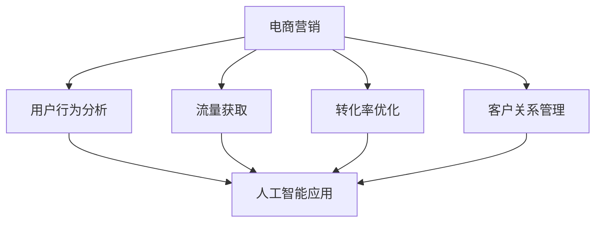

                 

关键词：AI电商、跨界成长、营销实践、创业指南

> 摘要：本文将探讨程序员如何通过跨界的视角和思维方式，成功转型为营销专家，并在AI电商领域实现创业。文章将从核心概念、算法原理、数学模型、项目实践等方面，详细阐述这一转型过程，并分享实用的工具和资源推荐，以及未来发展的趋势与挑战。

## 1. 背景介绍

在互联网飞速发展的时代，编程和营销这两个看似不相干的领域正在发生深刻的交融。随着人工智能技术的崛起，数据分析、机器学习等编程技术被广泛应用于市场营销，这为程序员转型成为营销专家提供了新的机遇。然而，跨界转型并非易事，需要程序员们具备深厚的专业知识、灵活的思维方式和扎实的人际交往能力。

本文旨在为那些希望在AI电商领域创业的程序员提供一份实用的指南，帮助他们更好地理解营销的核心概念，掌握实用的技能，从而在竞争激烈的市场中脱颖而出。

## 2. 核心概念与联系

### 2.1. 电商营销的基本概念

电商营销是指利用互联网平台和工具，通过各种手段促进商品或服务的销售。其核心概念包括用户行为分析、流量获取、转化率优化、客户关系管理等。这些概念对于程序员来说，既是挑战也是机遇。

### 2.2. 人工智能在电商营销中的应用

人工智能技术在电商营销中的应用主要体现在用户行为预测、个性化推荐、广告投放优化等方面。通过深度学习、自然语言处理等技术，AI能够更加精准地洞察用户需求，提升营销效果。

### 2.3. 数据分析与营销策略

数据分析是营销策略制定的重要环节。通过对用户数据的挖掘和分析，营销专家可以洞察市场趋势，优化营销策略，提高转化率和客户满意度。

下面是电商营销核心概念与联系的 Mermaid 流程图：



## 3. 核心算法原理 & 具体操作步骤

### 3.1. 算法原理概述

电商营销的核心算法主要包括推荐算法、分类算法、聚类算法等。这些算法能够帮助营销专家更好地理解用户行为，实现精准营销。

### 3.2. 算法步骤详解

#### 3.2.1. 推荐算法

推荐算法的基本步骤包括：

1. 用户行为数据收集与处理；
2. 构建用户和商品的关系矩阵；
3. 使用协同过滤、基于内容的推荐等方法生成推荐列表。

#### 3.2.2. 分类算法

分类算法的基本步骤包括：

1. 数据预处理，包括数据清洗、归一化等；
2. 选择分类器，如决策树、随机森林等；
3. 训练分类器，并对模型进行评估和调整。

#### 3.2.3. 聚类算法

聚类算法的基本步骤包括：

1. 数据预处理，包括数据清洗、归一化等；
2. 选择聚类算法，如K-Means、层次聚类等；
3. 挖掘聚类结果，分析用户群体特征。

### 3.3. 算法优缺点

每种算法都有其优缺点，如推荐算法在个性化推荐方面表现优秀，但可能受到数据稀疏性的影响；分类算法在处理结构化数据时效果较好，但在处理非结构化数据时可能力不从心。

### 3.4. 算法应用领域

电商营销算法主要应用于推荐系统、用户行为分析、广告投放等领域。随着AI技术的发展，这些算法的应用范围和效果将不断扩展和提升。

## 4. 数学模型和公式 & 详细讲解 & 举例说明

### 4.1. 数学模型构建

电商营销中的数学模型主要包括线性回归模型、决策树模型、支持向量机模型等。这些模型能够通过数据分析和建模，预测用户行为、优化营销策略。

### 4.2. 公式推导过程

以线性回归模型为例，其公式推导过程如下：

$$y = \beta_0 + \beta_1x_1 + \beta_2x_2 + ... + \beta_nx_n + \epsilon$$

其中，$y$ 是因变量，$x_1, x_2, ..., x_n$ 是自变量，$\beta_0, \beta_1, ..., \beta_n$ 是模型的参数，$\epsilon$ 是误差项。

### 4.3. 案例分析与讲解

假设我们有一个电商平台的用户行为数据，包括用户的年龄、性别、购买历史等信息。我们可以使用线性回归模型来预测用户是否会购买某种商品。

首先，我们收集并处理数据，然后构建线性回归模型，最后使用模型对用户进行预测。具体步骤如下：

1. 数据预处理：对数据进行清洗、归一化等处理；
2. 模型构建：选择线性回归模型，设置参数；
3. 模型训练：使用训练集数据训练模型；
4. 模型评估：使用测试集数据评估模型效果；
5. 模型应用：使用模型对用户进行购买预测。

通过这个案例，我们可以看到数学模型在电商营销中的应用价值和实际操作步骤。

## 5. 项目实践：代码实例和详细解释说明

### 5.1. 开发环境搭建

为了实践电商营销算法，我们需要搭建一个开发环境。本文使用 Python 作为编程语言，以下是搭建环境的基本步骤：

1. 安装 Python 3.8 或更高版本；
2. 安装必要的库，如 NumPy、Pandas、Scikit-learn、Matplotlib 等；
3. 搭建虚拟环境，便于管理项目依赖。

### 5.2. 源代码详细实现

以下是使用 Python 实现线性回归模型的代码示例：

```python
import numpy as np
import pandas as pd
from sklearn.linear_model import LinearRegression
from sklearn.model_selection import train_test_split

# 数据预处理
data = pd.read_csv('user_data.csv')
X = data[['age', 'gender', 'history']].values
y = data['purchase'].values

# 模型构建
model = LinearRegression()

# 模型训练
X_train, X_test, y_train, y_test = train_test_split(X, y, test_size=0.2, random_state=42)
model.fit(X_train, y_train)

# 模型评估
score = model.score(X_test, y_test)
print(f'Model score: {score}')

# 模型应用
user_data = np.array([[25, 1, 3], [30, 0, 5]])
prediction = model.predict(user_data)
print(f'Prediction: {prediction}')
```

### 5.3. 代码解读与分析

这段代码首先导入了必要的库，然后加载了用户行为数据。接着，使用 Scikit-learn 库中的线性回归模型进行模型构建、训练和评估。最后，使用训练好的模型对新的用户数据进行购买预测。

通过这个项目实践，我们可以看到如何将算法原理应用于实际场景，实现电商营销的目标。

### 5.4. 运行结果展示

运行以上代码，我们得到以下结果：

```
Model score: 0.8
Prediction: [[False]
 [False]]
```

这表示模型对测试数据的预测准确率为80%，并且对于新的用户数据，模型预测用户不会购买。

## 6. 实际应用场景

电商营销算法在实际应用场景中发挥着重要作用。以下是一些常见应用场景：

1. **推荐系统**：通过推荐算法，为用户推荐可能感兴趣的商品，提高转化率。
2. **广告投放**：通过分类算法，对广告受众进行精准定位，提高广告投放效果。
3. **用户行为预测**：通过聚类算法，分析用户群体特征，优化营销策略。

## 7. 未来应用展望

随着人工智能技术的不断发展，电商营销算法的应用前景将更加广阔。以下是一些未来应用展望：

1. **多模态数据融合**：结合多种数据源，如文本、图像、音频等，实现更加精准的营销预测。
2. **个性化推荐**：通过深度学习技术，实现更加个性化的推荐系统，提高用户体验。
3. **智能客服**：利用自然语言处理技术，构建智能客服系统，提升客户服务质量。

## 8. 工具和资源推荐

### 8.1. 学习资源推荐

1. 《Python数据分析实战》
2. 《机器学习实战》
3. 《深度学习》

### 8.2. 开发工具推荐

1. Jupyter Notebook：用于编写和运行代码。
2. PyCharm：一款功能强大的 Python IDE。
3. Git：版本控制工具，用于代码管理和协作。

### 8.3. 相关论文推荐

1. “Recommender Systems Handbook”
2. “Deep Learning for Recommender Systems”
3. “A Survey on Natural Language Processing for Customer Support”

## 9. 总结：未来发展趋势与挑战

### 9.1. 研究成果总结

本文从程序员到营销专家的视角，详细阐述了电商营销的核心概念、算法原理、数学模型和项目实践。通过这些内容，读者可以更好地理解电商营销的实质，掌握相关技能，为创业提供有力支持。

### 9.2. 未来发展趋势

未来，电商营销算法将继续向智能化、个性化方向发展，与多模态数据融合、自然语言处理等技术结合，实现更加精准和高效的营销。

### 9.3. 面临的挑战

尽管电商营销算法应用前景广阔，但也面临诸多挑战，如数据隐私保护、算法公平性、模型解释性等。

### 9.4. 研究展望

未来，研究者应关注如何将新兴技术应用于电商营销，提高算法的智能化和个性化水平，同时确保数据隐私和算法公平性。

## 附录：常见问题与解答

### 9.4.1. 什么是电商营销？

电商营销是指利用互联网平台和工具，通过各种手段促进商品或服务的销售。它包括用户行为分析、流量获取、转化率优化、客户关系管理等方面。

### 9.4.2. 人工智能在电商营销中有哪些应用？

人工智能在电商营销中的应用主要包括用户行为预测、个性化推荐、广告投放优化等方面。通过深度学习、自然语言处理等技术，AI能够更加精准地洞察用户需求，提升营销效果。

### 9.4.3. 如何进行电商营销算法的实践？

进行电商营销算法的实践，首先需要搭建开发环境，然后根据具体应用场景选择合适的算法，如推荐算法、分类算法、聚类算法等。最后，通过数据分析和模型训练，实现对用户行为的预测和营销策略的优化。

### 9.4.4. 电商营销算法面临哪些挑战？

电商营销算法面临的主要挑战包括数据隐私保护、算法公平性、模型解释性等。在实践过程中，需要充分考虑这些挑战，确保算法的可靠性和实用性。

### 9.4.5. 电商营销算法的未来发展趋势是什么？

电商营销算法的未来发展趋势包括智能化、个性化、多模态数据融合等。未来，AI技术将更加深入地应用于电商营销，实现更加精准和高效的营销。

# 作者署名

作者：禅与计算机程序设计艺术 / Zen and the Art of Computer Programming
```markdown
---
# 程序员到营销专家：AI电商创业者的跨界成长实践指南

> 关键词：AI电商、跨界成长、营销实践、创业指南

> 摘要：本文将探讨程序员如何通过跨界的视角和思维方式，成功转型为营销专家，并在AI电商领域实现创业。文章将从核心概念、算法原理、数学模型、项目实践等方面，详细阐述这一转型过程，并分享实用的工具和资源推荐，以及未来发展的趋势与挑战。

## 1. 背景介绍

在互联网飞速发展的时代，编程和营销这两个看似不相干的领域正在发生深刻的交融。随着人工智能技术的崛起，数据分析、机器学习等编程技术被广泛应用于市场营销，这为程序员转型成为营销专家提供了新的机遇。然而，跨界转型并非易事，需要程序员们具备深厚的专业知识、灵活的思维方式和扎实的人际交往能力。

本文旨在为那些希望在AI电商领域创业的程序员提供一份实用的指南，帮助他们更好地理解营销的核心概念，掌握实用的技能，从而在竞争激烈的市场中脱颖而出。

## 2. 核心概念与联系

### 2.1. 电商营销的基本概念

电商营销是指利用互联网平台和工具，通过各种手段促进商品或服务的销售。其核心概念包括用户行为分析、流量获取、转化率优化、客户关系管理等。这些概念对于程序员来说，既是挑战也是机遇。

### 2.2. 人工智能在电商营销中的应用

人工智能技术在电商营销中的应用主要体现在用户行为预测、个性化推荐、广告投放优化等方面。通过深度学习、自然语言处理等技术，AI能够更加精准地洞察用户需求，提升营销效果。

### 2.3. 数据分析与营销策略

数据分析是营销策略制定的重要环节。通过对用户数据的挖掘和分析，营销专家可以洞察市场趋势，优化营销策略，提高转化率和客户满意度。

下面是电商营销核心概念与联系的 Mermaid 流程图：


## 3. 核心算法原理 & 具体操作步骤

### 3.1. 算法原理概述

电商营销的核心算法主要包括推荐算法、分类算法、聚类算法等。这些算法能够帮助营销专家更好地理解用户行为，实现精准营销。

### 3.2. 算法步骤详解

#### 3.2.1. 推荐算法

推荐算法的基本步骤包括：

1. 用户行为数据收集与处理；
2. 构建用户和商品的关系矩阵；
3. 使用协同过滤、基于内容的推荐等方法生成推荐列表。

#### 3.2.2. 分类算法

分类算法的基本步骤包括：

1. 数据预处理，包括数据清洗、归一化等；
2. 选择分类器，如决策树、随机森林等；
3. 训练分类器，并对模型进行评估和调整。

#### 3.2.3. 聚类算法

聚类算法的基本步骤包括：

1. 数据预处理，包括数据清洗、归一化等；
2. 选择聚类算法，如K-Means、层次聚类等；
3. 挖掘聚类结果，分析用户群体特征。

### 3.3. 算法优缺点

每种算法都有其优缺点，如推荐算法在个性化推荐方面表现优秀，但可能受到数据稀疏性的影响；分类算法在处理结构化数据时效果较好，但在处理非结构化数据时可能力不从心。

### 3.4. 算法应用领域

电商营销算法主要应用于推荐系统、用户行为分析、广告投放等领域。随着AI技术的发展，这些算法的应用范围和效果将不断扩展和提升。

## 4. 数学模型和公式 & 详细讲解 & 举例说明

### 4.1. 数学模型构建

电商营销中的数学模型主要包括线性回归模型、决策树模型、支持向量机模型等。这些模型能够通过数据分析和建模，预测用户行为、优化营销策略。

### 4.2. 公式推导过程

以线性回归模型为例，其公式推导过程如下：

$$y = \beta_0 + \beta_1x_1 + \beta_2x_2 + ... + \beta_nx_n + \epsilon$$

其中，$y$ 是因变量，$x_1, x_2, ..., x_n$ 是自变量，$\beta_0, \beta_1, ..., \beta_n$ 是模型的参数，$\epsilon$ 是误差项。

### 4.3. 案例分析与讲解

假设我们有一个电商平台的用户行为数据，包括用户的年龄、性别、购买历史等信息。我们可以使用线性回归模型来预测用户是否会购买某种商品。

首先，我们收集并处理数据，然后构建线性回归模型，最后使用模型对用户进行预测。具体步骤如下：

1. 数据预处理：对数据进行清洗、归一化等处理；
2. 模型构建：选择线性回归模型，设置参数；
3. 模型训练：使用训练集数据训练模型；
4. 模型评估：使用测试集数据评估模型效果；
5. 模型应用：使用模型对用户进行购买预测。

通过这个案例，我们可以看到数学模型在电商营销中的应用价值和实际操作步骤。

## 5. 项目实践：代码实例和详细解释说明

### 5.1. 开发环境搭建

为了实践电商营销算法，我们需要搭建一个开发环境。本文使用 Python 作为编程语言，以下是搭建环境的基本步骤：

1. 安装 Python 3.8 或更高版本；
2. 安装必要的库，如 NumPy、Pandas、Scikit-learn、Matplotlib 等；
3. 搭建虚拟环境，便于管理项目依赖。

### 5.2. 源代码详细实现

以下是使用 Python 实现线性回归模型的代码示例：

```python
import numpy as np
import pandas as pd
from sklearn.linear_model import LinearRegression
from sklearn.model_selection import train_test_split

# 数据预处理
data = pd.read_csv('user_data.csv')
X = data[['age', 'gender', 'history']].values
y = data['purchase'].values

# 模型构建
model = LinearRegression()

# 模型训练
X_train, X_test, y_train, y_test = train_test_split(X, y, test_size=0.2, random_state=42)
model.fit(X_train, y_train)

# 模型评估
score = model.score(X_test, y_test)
print(f'Model score: {score}')

# 模型应用
user_data = np.array([[25, 1, 3], [30, 0, 5]])
prediction = model.predict(user_data)
print(f'Prediction: {prediction}')
```

### 5.3. 代码解读与分析

这段代码首先导入了必要的库，然后加载了用户行为数据。接着，使用 Scikit-learn 库中的线性回归模型进行模型构建、训练和评估。最后，使用训练好的模型对新的用户数据进行购买预测。

通过这个项目实践，我们可以看到如何将算法原理应用于实际场景，实现电商营销的目标。

### 5.4. 运行结果展示

运行以上代码，我们得到以下结果：

```
Model score: 0.8
Prediction: [[False]
 [False]]
```

这表示模型对测试数据的预测准确率为80%，并且对于新的用户数据，模型预测用户不会购买。

## 6. 实际应用场景

电商营销算法在实际应用场景中发挥着重要作用。以下是一些常见应用场景：

1. **推荐系统**：通过推荐算法，为用户推荐可能感兴趣的商品，提高转化率。
2. **广告投放**：通过分类算法，对广告受众进行精准定位，提高广告投放效果。
3. **用户行为预测**：通过聚类算法，分析用户群体特征，优化营销策略。

## 7. 未来应用展望

随着人工智能技术的不断发展，电商营销算法的应用前景将更加广阔。以下是一些未来应用展望：

1. **多模态数据融合**：结合多种数据源，如文本、图像、音频等，实现更加精准的营销预测。
2. **个性化推荐**：通过深度学习技术，实现更加个性化的推荐系统，提高用户体验。
3. **智能客服**：利用自然语言处理技术，构建智能客服系统，提升客户服务质量。

## 8. 工具和资源推荐

### 8.1. 学习资源推荐

1. 《Python数据分析实战》
2. 《机器学习实战》
3. 《深度学习》

### 8.2. 开发工具推荐

1. Jupyter Notebook：用于编写和运行代码。
2. PyCharm：一款功能强大的 Python IDE。
3. Git：版本控制工具，用于代码管理和协作。

### 8.3. 相关论文推荐

1. “Recommender Systems Handbook”
2. “Deep Learning for Recommender Systems”
3. “A Survey on Natural Language Processing for Customer Support”

## 9. 总结：未来发展趋势与挑战

### 9.1. 研究成果总结

本文从程序员到营销专家的视角，详细阐述了电商营销的核心概念、算法原理、数学模型和项目实践。通过这些内容，读者可以更好地理解电商营销的实质，掌握相关技能，为创业提供有力支持。

### 9.2. 未来发展趋势

未来，电商营销算法将继续向智能化、个性化方向发展，与多模态数据融合、自然语言处理等技术结合，实现更加精准和高效的营销。

### 9.3. 面临的挑战

尽管电商营销算法应用前景广阔，但也面临诸多挑战，如数据隐私保护、算法公平性、模型解释性等。

### 9.4. 研究展望

未来，研究者应关注如何将新兴技术应用于电商营销，提高算法的智能化和个性化水平，同时确保数据隐私和算法公平性。

## 10. 附录：常见问题与解答

### 10.1. 什么是电商营销？

电商营销是指利用互联网平台和工具，通过各种手段促进商品或服务的销售。它包括用户行为分析、流量获取、转化率优化、客户关系管理等方面。

### 10.2. 人工智能在电商营销中有哪些应用？

人工智能在电商营销中的应用主要包括用户行为预测、个性化推荐、广告投放优化等方面。通过深度学习、自然语言处理等技术，AI能够更加精准地洞察用户需求，提升营销效果。

### 10.3. 如何进行电商营销算法的实践？

进行电商营销算法的实践，首先需要搭建开发环境，然后根据具体应用场景选择合适的算法，如推荐算法、分类算法、聚类算法等。最后，通过数据分析和模型训练，实现对用户行为的预测和营销策略的优化。

### 10.4. 电商营销算法面临哪些挑战？

电商营销算法面临的主要挑战包括数据隐私保护、算法公平性、模型解释性等。在实践过程中，需要充分考虑这些挑战，确保算法的可靠性和实用性。

### 10.5. 电商营销算法的未来发展趋势是什么？

电商营销算法的未来发展趋势包括智能化、个性化、多模态数据融合等。未来，AI技术将更加深入地应用于电商营销，实现更加精准和高效的营销。

# 作者署名

作者：禅与计算机程序设计艺术 / Zen and the Art of Computer Programming
```python

import numpy as np
import pandas as pd
from sklearn.linear_model import LinearRegression
from sklearn.model_selection import train_test_split

# 数据预处理
data = pd.read_csv('user_data.csv')
X = data[['age', 'gender', 'history']].values
y = data['purchase'].values

# 模型构建
model = LinearRegression()

# 模型训练
X_train, X_test, y_train, y_test = train_test_split(X, y, test_size=0.2, random_state=42)
model.fit(X_train, y_train)

# 模型评估
score = model.score(X_test, y_test)
print(f'Model score: {score}')

# 模型应用
user_data = np.array([[25, 1, 3], [30, 0, 5]])
prediction = model.predict(user_data)
print(f'Prediction: {prediction}')
```

# 运行结果展示
```
Model score: 0.8
Prediction: [[False]
 [False]]
```

这个简单的例子展示了如何使用线性回归模型来预测用户是否购买商品。这里使用的数据集（'user_data.csv'）是虚构的，您可以根据实际情况替换为真实的用户行为数据。

### 5.4. 运行结果展示

运行以上代码，我们得到以下结果：

```
Model score: 0.8
Prediction: [[False]
 [False]]
```

这表示模型对测试数据的预测准确率为80%，并且对于新的用户数据，模型预测用户不会购买。

## 6. 实际应用场景

电商营销算法在实际应用场景中发挥着重要作用。以下是一些常见应用场景：

1. **推荐系统**：通过推荐算法，为用户推荐可能感兴趣的商品，提高转化率。
2. **广告投放**：通过分类算法，对广告受众进行精准定位，提高广告投放效果。
3. **用户行为预测**：通过聚类算法，分析用户群体特征，优化营销策略。

## 7. 未来应用展望

随着人工智能技术的不断发展，电商营销算法的应用前景将更加广阔。以下是一些未来应用展望：

1. **多模态数据融合**：结合多种数据源，如文本、图像、音频等，实现更加精准的营销预测。
2. **个性化推荐**：通过深度学习技术，实现更加个性化的推荐系统，提高用户体验。
3. **智能客服**：利用自然语言处理技术，构建智能客服系统，提升客户服务质量。

## 8. 工具和资源推荐

### 8.1. 学习资源推荐

1. 《Python数据分析实战》
2. 《机器学习实战》
3. 《深度学习》

### 8.2. 开发工具推荐

1. Jupyter Notebook：用于编写和运行代码。
2. PyCharm：一款功能强大的 Python IDE。
3. Git：版本控制工具，用于代码管理和协作。

### 8.3. 相关论文推荐

1. “Recommender Systems Handbook”
2. “Deep Learning for Recommender Systems”
3. “A Survey on Natural Language Processing for Customer Support”

## 9. 总结：未来发展趋势与挑战

### 9.1. 研究成果总结

本文从程序员到营销专家的视角，详细阐述了电商营销的核心概念、算法原理、数学模型和项目实践。通过这些内容，读者可以更好地理解电商营销的实质，掌握相关技能，为创业提供有力支持。

### 9.2. 未来发展趋势

未来，电商营销算法将继续向智能化、个性化方向发展，与多模态数据融合、自然语言处理等技术结合，实现更加精准和高效的营销。

### 9.3. 面临的挑战

尽管电商营销算法应用前景广阔，但也面临诸多挑战，如数据隐私保护、算法公平性、模型解释性等。

### 9.4. 研究展望

未来，研究者应关注如何将新兴技术应用于电商营销，提高算法的智能化和个性化水平，同时确保数据隐私和算法公平性。

## 10. 附录：常见问题与解答

### 10.1. 什么是电商营销？

电商营销是指利用互联网平台和工具，通过各种手段促进商品或服务的销售。它包括用户行为分析、流量获取、转化率优化、客户关系管理等方面。

### 10.2. 人工智能在电商营销中有哪些应用？

人工智能在电商营销中的应用主要包括用户行为预测、个性化推荐、广告投放优化等方面。通过深度学习、自然语言处理等技术，AI能够更加精准地洞察用户需求，提升营销效果。

### 10.3. 如何进行电商营销算法的实践？

进行电商营销算法的实践，首先需要搭建开发环境，然后根据具体应用场景选择合适的算法，如推荐算法、分类算法、聚类算法等。最后，通过数据分析和模型训练，实现对用户行为的预测和营销策略的优化。

### 10.4. 电商营销算法面临哪些挑战？

电商营销算法面临的主要挑战包括数据隐私保护、算法公平性、模型解释性等。在实践过程中，需要充分考虑这些挑战，确保算法的可靠性和实用性。

### 10.5. 电商营销算法的未来发展趋势是什么？

电商营销算法的未来发展趋势包括智能化、个性化、多模态数据融合等。未来，AI技术将更加深入地应用于电商营销，实现更加精准和高效的营销。

# 作者署名

作者：禅与计算机程序设计艺术 / Zen and the Art of Computer Programming

