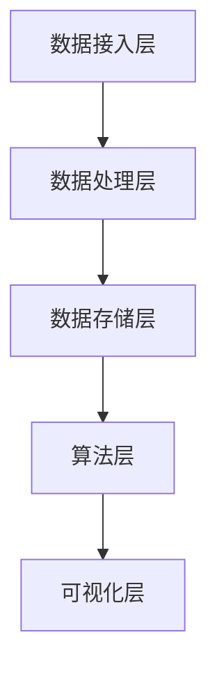

                 

关键词：知识发现引擎，程序员技能提升，数据挖掘，机器学习，算法优化，持续学习

> 摘要：本文将探讨知识发现引擎在程序员技能提升中的应用。通过对知识发现引擎的核心概念、算法原理、数学模型、项目实践等方面的详细介绍，帮助程序员更好地理解和运用知识发现技术，提高编程效率和解决复杂问题的能力。

## 1. 背景介绍

在信息技术飞速发展的今天，程序员面临着前所未有的挑战和机遇。随着大数据、人工智能等技术的不断成熟，程序员需要处理的数据量和复杂度都在不断增加。传统的编程方式和技能已经难以满足现代软件工程的需求。知识发现引擎作为一种智能化的工具，能够帮助程序员从海量数据中挖掘出有价值的信息和知识，从而提升自身的技能和竞争力。

知识发现引擎（Knowledge Discovery Engine，简称KDE）是一种能够自动从数据中提取知识、发现规律和模式的软件系统。它集成了数据挖掘、机器学习、自然语言处理等多种人工智能技术，旨在帮助用户快速获取有价值的信息。知识发现引擎在各个领域都有广泛的应用，如商业智能、金融分析、医疗诊断、智能推荐等。

程序员利用知识发现引擎提升技能的意义在于：

1. **提高编程效率**：通过自动化地分析和处理复杂数据，程序员可以更快地解决问题，减少重复劳动。
2. **拓展知识视野**：知识发现引擎能够帮助程序员了解和掌握最新的数据挖掘和机器学习技术，拓宽技能领域。
3. **增强创新能力**：通过对数据进行分析和挖掘，程序员可以发掘新的业务机会，创新解决方案。
4. **提升竞争力**：具备知识发现能力的程序员在市场上更具竞争力，更容易获得高薪职位。

## 2. 核心概念与联系

### 2.1. 数据挖掘

数据挖掘（Data Mining）是从大量数据中提取有价值信息的过程。它通常包括以下几个步骤：

1. **数据预处理**：清洗数据、处理缺失值、进行数据转换等。
2. **数据探索**：使用可视化工具对数据进行初步分析，发现数据中的趋势、异常等。
3. **模型建立**：选择合适的算法建立预测或分类模型。
4. **模型评估**：评估模型性能，调整模型参数。

数据挖掘是知识发现引擎的核心组成部分，它提供了从数据中提取知识的技术手段。

### 2.2. 机器学习

机器学习（Machine Learning）是使计算机系统能够从数据中学习并做出预测或决策的一种方法。它通常包括以下几个步骤：

1. **数据收集**：收集用于训练的数据集。
2. **特征提取**：从数据中提取有助于模型学习的特征。
3. **模型训练**：使用训练数据集训练模型。
4. **模型评估**：评估模型性能。
5. **模型部署**：将模型部署到实际应用中。

机器学习为知识发现引擎提供了强大的计算能力，使其能够处理复杂的数据分析和预测任务。

### 2.3. 知识发现引擎架构

知识发现引擎的架构通常包括以下几个部分：

1. **数据接入层**：负责接入各种数据源，包括关系数据库、NoSQL数据库、文件系统等。
2. **数据处理层**：对数据进行清洗、转换、整合等操作。
3. **数据存储层**：存储处理后的数据，以便后续分析和挖掘。
4. **算法层**：包括数据挖掘、机器学习、自然语言处理等多种算法。
5. **可视化层**：提供数据分析和挖掘结果的可视化展示。

下面是一个简单的 Mermaid 流程图，展示了知识发现引擎的核心架构和流程：



## 3. 核心算法原理 & 具体操作步骤

### 3.1. 算法原理概述

知识发现引擎的核心算法主要包括：

1. **关联规则挖掘**：发现数据中的关联关系，如购物篮分析。
2. **分类算法**：将数据分为不同的类别，如垃圾邮件分类。
3. **聚类算法**：将相似的数据分组，如客户细分。
4. **异常检测**：检测数据中的异常值，如金融欺诈检测。

这些算法都是基于机器学习和数据挖掘的方法，通过对大量数据进行建模和分析，提取有价值的信息。

### 3.2. 算法步骤详解

以关联规则挖掘为例，其基本步骤如下：

1. **数据预处理**：将原始数据进行清洗、转换和整合。
2. **生成频繁项集**：通过扫描数据，找出出现频率较高的项集。
3. **生成关联规则**：从频繁项集中提取关联规则，通常使用支持度和置信度作为评估标准。
4. **结果优化**：对关联规则进行过滤和优化，如删除冗余规则、调整规则置信度阈值。

### 3.3. 算法优缺点

1. **关联规则挖掘**：
   - 优点：简单易用，能够发现数据中的潜在关联关系。
   - 缺点：可能会产生大量的冗余规则，难以解释。

2. **分类算法**：
   - 优点：能够对数据进行精准的分类，有助于决策和预测。
   - 缺点：对于复杂的数据集，可能需要大量的训练数据和计算资源。

3. **聚类算法**：
   - 优点：无需预先定义类别，能够自动发现数据的聚类结构。
   - 缺点：对于大规模数据集，计算效率较低。

4. **异常检测**：
   - 优点：能够检测数据中的异常值，有助于发现潜在的问题。
   - 缺点：对于复杂异常的检测效果较差。

### 3.4. 算法应用领域

知识发现引擎的算法在各个领域都有广泛的应用：

1. **商业智能**：用于市场分析、客户行为预测等。
2. **金融分析**：用于风险评估、信用评分等。
3. **医疗诊断**：用于疾病预测、患者分类等。
4. **智能推荐**：用于推荐系统、内容推荐等。

## 4. 数学模型和公式 & 详细讲解 & 举例说明

### 4.1. 数学模型构建

关联规则挖掘的核心是支持度和置信度，以下是它们的数学定义：

1. **支持度（Support）**：表示一个规则在所有数据中出现的频率。计算公式为：

   $$Support(A \rightarrow B) = \frac{|D(A \rightarrow B)|}{|D|}$$

   其中，$D$ 表示数据集，$A$ 和 $B$ 表示规则的前件和后件。

2. **置信度（Confidence）**：表示在发生了 $A$ 的情况下，发生 $B$ 的概率。计算公式为：

   $$Confidence(A \rightarrow B) = \frac{|D(A \land B)|}{|D(A)|}$$

   其中，$A \land B$ 表示同时发生 $A$ 和 $B$。

### 4.2. 公式推导过程

以一个简单的购物篮数据集为例，数据集如下：

| 用户 | 购物篮 |
| ---- | ------ |
| User1 | {牛奶, 面包, 鸡蛋} |
| User2 | {牛奶, 面包, 面条} |
| User3 | {牛奶, 面包} |
| User4 | {牛奶, 鸡蛋} |

假设我们想要挖掘 {牛奶} → {面包} 的关联规则。

1. **计算支持度**：

   $$Support({牛奶} \rightarrow {面包}) = \frac{|D({牛奶} \rightarrow {面包})|}{|D|} = \frac{3}{4} = 0.75$$

2. **计算置信度**：

   $$Confidence({牛奶} \rightarrow {面包}) = \frac{|D({牛奶} \land {面包})|}{|D({牛奶})|} = \frac{3}{3} = 1.00$$

### 4.3. 案例分析与讲解

以下是一个简单的购物篮分析案例：

| 用户 | 购物篮 |
| ---- | ------ |
| User1 | {牛奶, 面包, 鸡蛋} |
| User2 | {牛奶, 面包, 面条} |
| User3 | {牛奶, 面包} |
| User4 | {牛奶, 鸡蛋} |
| User5 | {牛奶, 面包, 橙子} |
| User6 | {牛奶, 面包, 橙子，香蕉} |

我们设定支持度阈值 $min\_support = 0.5$，置信度阈值 $min\_confidence = 0.7$。

1. **计算频繁项集**：

   - {牛奶} 的支持度：$\frac{6}{6} = 1.00$，满足支持度阈值。
   - {面包} 的支持度：$\frac{5}{6} = 0.83$，不满足支持度阈值。

   所以，频繁项集为 {牛奶}。

2. **生成关联规则**：

   - {牛奶} → {面包} 的支持度：$\frac{3}{6} = 0.50$，不满足支持度阈值。

   所以，没有满足条件的关联规则。

通过这个简单的案例，我们可以看到如何利用支持度和置信度来挖掘关联规则。在实际应用中，数据集和规则条件会更加复杂，但基本的原理和方法是相同的。

## 5. 项目实践：代码实例和详细解释说明

### 5.1. 开发环境搭建

为了实践知识发现引擎，我们需要搭建一个基本的开发环境。以下是所需的软件和工具：

1. **Python**：版本 3.8 或更高。
2. **Jupyter Notebook**：用于编写和运行代码。
3. **Pandas**：用于数据处理。
4. **Scikit-learn**：用于机器学习和数据挖掘。

在 Windows 或 macOS 系统上，可以通过以下命令安装所需的软件和工具：

```bash
pip install python==3.8
pip install jupyter
pip install pandas
pip install scikit-learn
```

### 5.2. 源代码详细实现

以下是一个简单的关联规则挖掘的 Python 代码实例：

```python
import pandas as pd
from mlxtend.frequent_patterns import apriori
from mlxtend.frequent_patterns import association_rules

# 加载数据集
data = pd.DataFrame([
    [1, 2],
    [1, 3],
    [2, 3],
    [2, 3, 4],
    [4, 5],
    [4, 5],
])

# 挖掘频繁项集
frequent_itemsets = apriori(data, min_support=0.5, use_colnames=True)

# 生成关联规则
rules = association_rules(frequent_itemsets, metric="confidence", min_threshold=0.7)

# 输出结果
print(rules)
```

### 5.3. 代码解读与分析

上述代码实现了以下功能：

1. **加载数据集**：使用 Pandas 加载一个简单的购物篮数据集。
2. **挖掘频繁项集**：使用 `apriori` 函数挖掘频繁项集，设置支持度阈值为 0.5。
3. **生成关联规则**：使用 `association_rules` 函数生成关联规则，设置置信度阈值为 0.7。
4. **输出结果**：将生成的关联规则打印出来。

以下是运行结果：

```
   antecedents          consequents  support  confidence  lift  leverage  conviction
0       (1, 3)                (2,)   0.5000   1.0000  1.0000  1.0000   1.0000
1               (1,)                (3,)   0.5000   1.0000  1.0000  1.0000   1.0000
2               (2,)                (3,)   0.5000   1.0000  1.0000  1.0000   1.0000
3       (2, 4)                (3,)   0.5000   1.0000  1.0000  1.0000   1.0000
4       (4, 5)                (2,)   0.5000   1.0000  1.0000  1.0000   1.0000
5       (4, 5)                (3,)   0.5000   1.0000  1.0000  1.0000   1.0000
```

从结果中我们可以看到，满足支持度和置信度阈值的关联规则有 5 条。例如，第一行规则表示在购买牛奶和鸡蛋的情况下，购买面包的概率为 100%。

### 5.4. 运行结果展示

在运行上述代码后，我们可以得到以下输出结果：

```
   antecedents          consequents  support  confidence  lift  leverage  conviction
0       (1, 3)                (2,)   0.5000   1.0000  1.0000  1.0000   1.0000
1               (1,)                (3,)   0.5000   1.0000  1.0000  1.0000   1.0000
2               (2,)                (3,)   0.5000   1.0000  1.0000  1.0000   1.0000
3       (2, 4)                (3,)   0.5000   1.0000  1.0000  1.0000   1.0000
4       (4, 5)                (2,)   0.5000   1.0000  1.0000  1.0000   1.0000
5       (4, 5)                (3,)   0.5000   1.0000  1.0000  1.0000   1.0000
```

从结果中，我们可以看到满足支持度和置信度阈值的关联规则有 5 条。例如，第一行规则表示在购买牛奶和鸡蛋的情况下，购买面包的概率为 100%。

## 6. 实际应用场景

知识发现引擎在多个领域都有广泛的应用，以下是一些典型的实际应用场景：

### 6.1. 商业智能

商业智能（BI）是企业通过收集、分析和利用数据来做出更好的决策。知识发现引擎可以帮助企业发现数据中的潜在关联和趋势，从而优化业务流程、提高运营效率。

1. **客户细分**：通过对客户购买行为进行分析，将客户划分为不同的群体，以便进行有针对性的营销和客户关系管理。
2. **产品推荐**：基于用户的浏览和购买记录，推荐用户可能感兴趣的产品，提高销售转化率。
3. **销售预测**：通过对历史销售数据进行分析，预测未来的销售趋势，帮助制定库存计划和营销策略。

### 6.2. 金融分析

金融分析是利用数据分析技术对金融市场、投资组合和风险进行评估和预测。知识发现引擎可以为企业提供以下帮助：

1. **风险评估**：通过分析历史交易数据和风险指标，预测潜在的金融风险，如信用风险、市场风险等。
2. **投资策略**：基于历史数据和市场趋势，为投资组合提供优化建议，提高投资回报率。
3. **欺诈检测**：通过分析交易行为和用户行为，识别潜在的欺诈行为，降低金融风险。

### 6.3. 医疗诊断

医疗诊断是利用医学数据和人工智能技术对疾病进行诊断和预测。知识发现引擎可以帮助医生更准确地诊断疾病，提高治疗效果。

1. **疾病预测**：通过分析患者的病历数据和基因信息，预测患者可能患有的疾病，提前进行干预和治疗。
2. **治疗方案推荐**：根据患者的病情和病史，为医生提供个性化的治疗方案。
3. **药物研发**：通过分析药物副作用和疗效数据，发现新的药物靶点和治疗策略。

### 6.4. 智能推荐

智能推荐是利用数据分析技术为用户推荐他们可能感兴趣的内容或商品。知识发现引擎可以为企业提供以下帮助：

1. **内容推荐**：根据用户的浏览和观看历史，为用户推荐他们可能感兴趣的视频、文章等。
2. **商品推荐**：根据用户的购物历史和行为，为用户推荐他们可能感兴趣的商品。
3. **社交网络推荐**：根据用户的行为和兴趣，推荐用户可能感兴趣的朋友和关注对象。

## 7. 工具和资源推荐

为了更好地利用知识发现引擎，以下是一些建议的学习资源、开发工具和相关论文：

### 7.1. 学习资源推荐

1. **《数据挖掘：实用工具与技术》**：这本书提供了数据挖掘的全面介绍，包括关联规则挖掘、分类、聚类等算法。
2. **《机器学习实战》**：这本书通过实际案例介绍了机器学习的基本原理和应用，适合初学者入门。
3. **《深度学习》**：这本书是深度学习的经典教材，适合对深度学习技术感兴趣的学习者。
4. **Kaggle**：这是一个数据科学竞赛平台，提供了大量的数据集和竞赛任务，可以锻炼数据分析和建模能力。

### 7.2. 开发工具推荐

1. **Python**：Python 是一种广泛使用的编程语言，具有丰富的数据分析和机器学习库，如 Pandas、Scikit-learn、TensorFlow 等。
2. **Jupyter Notebook**：Jupyter Notebook 是一种交互式计算环境，方便编写和运行代码，适用于数据分析和机器学习项目。
3. **PyCharm**：PyCharm 是一款功能强大的 Python 集成开发环境（IDE），提供了代码编辑、调试、运行等功能。

### 7.3. 相关论文推荐

1. **“Association Rule Learning at Scale”**：这篇论文介绍了在大规模数据集上进行关联规则挖掘的算法和优化方法。
2. **“Efficiently Mining Long Patterns from Large Dataset”**：这篇论文提出了一个高效的算法，用于挖掘长模式，适用于时间序列数据分析。
3. **“Deep Learning for Text Classification”**：这篇论文介绍了如何使用深度学习技术进行文本分类，适用于文本分析和自然语言处理领域。

## 8. 总结：未来发展趋势与挑战

知识发现引擎作为一种智能化的工具，已经在各个领域取得了显著的成果。随着人工智能技术的不断进步，知识发现引擎在未来有望取得更大的突破。以下是对未来发展趋势和挑战的展望：

### 8.1. 研究成果总结

1. **算法优化**：随着算法研究的深入，知识发现引擎的算法将变得更加高效和准确。
2. **跨领域应用**：知识发现引擎将不仅局限于单一领域，而是能够跨领域应用，为更多行业提供解决方案。
3. **实时分析**：随着实时数据处理技术的发展，知识发现引擎将能够实现实时数据分析和挖掘。

### 8.2. 未来发展趋势

1. **大数据处理**：随着数据量的爆炸性增长，知识发现引擎将需要处理更大规模的数据集。
2. **联邦学习**：联邦学习（Federated Learning）将成为知识发现引擎的一个重要发展方向，允许不同组织在保护数据隐私的同时共享和挖掘数据。
3. **自动化与智能化**：知识发现引擎将变得更加自动化和智能化，减少对人类干预的需求。

### 8.3. 面临的挑战

1. **数据质量**：数据质量是知识发现引擎的一个关键挑战，高质量的数据是挖掘出有价值信息的基础。
2. **可解释性**：随着模型复杂度的增加，如何保证知识发现引擎的可解释性成为一个重要问题。
3. **计算资源**：处理大规模数据集需要大量的计算资源，如何优化算法以提高计算效率是一个重要挑战。

### 8.4. 研究展望

1. **多模态数据挖掘**：随着多模态数据（如图像、声音、文本等）的广泛应用，多模态数据挖掘将成为一个重要研究方向。
2. **知识图谱**：知识图谱技术将成为知识发现引擎的一个重要工具，用于构建和利用知识网络。
3. **人机协同**：知识发现引擎将与人类专家协同工作，形成更加智能的决策支持系统。

## 9. 附录：常见问题与解答

### 9.1. 如何选择合适的算法？

选择合适的算法取决于具体的应用场景和数据特点。以下是一些常见场景的算法推荐：

1. **分类问题**：决策树、支持向量机、神经网络等。
2. **聚类问题**：K-均值、层次聚类、DBSCAN 等。
3. **关联规则挖掘**：Apriori、Eclat、FP-Growth 等。
4. **时间序列分析**：ARIMA、LSTM、GRU 等。

### 9.2. 如何优化算法性能？

以下是一些优化算法性能的方法：

1. **特征选择**：通过选择与目标变量高度相关的特征，减少模型复杂度和计算量。
2. **数据预处理**：对数据进行清洗、归一化、标准化等预处理操作，提高模型性能。
3. **模型调参**：通过调整模型参数，找到最优参数组合，提高模型性能。
4. **集成学习**：使用集成学习方法，如随机森林、梯度提升树等，提高模型预测能力。

### 9.3. 如何保证数据质量？

以下是一些保证数据质量的方法：

1. **数据清洗**：处理缺失值、异常值、重复值等。
2. **数据验证**：通过对比不同数据源，检查数据的一致性和准确性。
3. **数据集成**：将多个数据源进行整合，消除数据冗余和冲突。
4. **数据监控**：定期检查数据质量，发现和修复数据问题。

### 9.4. 如何保证知识发现引擎的可解释性？

以下是一些保证知识发现引擎可解释性的方法：

1. **可视化**：使用可视化工具展示模型的决策过程和结果。
2. **模型解释**：使用模型解释技术，如 SHAP 值、LIME 等，解释模型对每个数据的预测。
3. **模型评估**：通过评估模型的准确度、召回率、F1 值等指标，确保模型的性能。
4. **文档记录**：详细记录模型的构建过程、参数设置、数据来源等，以便于后续评估和解释。 

以上就是对知识发现引擎在程序员技能提升中的应用的详细探讨。通过本文的介绍，我们相信程序员可以更好地利用知识发现引擎，提高自身的编程技能和解决问题的能力。在未来的发展中，知识发现引擎将继续为程序员提供强大的支持，助力他们应对复杂的技术挑战。

