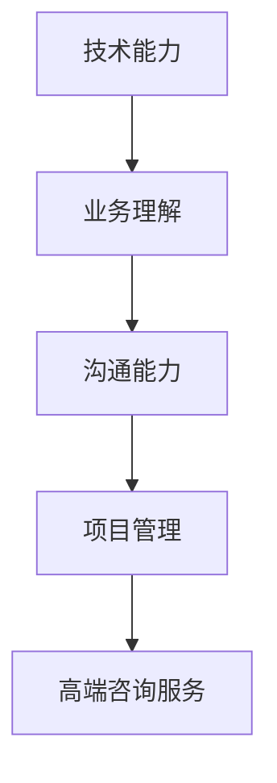

                 

关键词：程序员、个人技能、高端咨询服务、技能包装、技术博客、专业IT、深度思考、算法、数学模型、项目实践、实际应用场景、未来展望、学习资源、开发工具、相关论文、研究成果、发展趋势、挑战、研究展望

> 摘要：本文将探讨程序员如何利用自身技能，通过专业包装，将其转化为高端咨询服务。从背景介绍到核心概念、算法原理、数学模型、项目实践，再到实际应用场景、未来展望，本文将全面解析如何将程序员技能转化为商业价值。

## 1. 背景介绍

在当今数字化时代，程序员作为信息技术领域的核心力量，其技能和知识的重要性不言而喻。然而，许多程序员在面对个人职业发展时，往往感到困惑和迷茫。如何将自己的技能有效地转化为商业价值，成为许多程序员亟需解决的问题。

高端咨询服务，作为一种高附加值的服务形式，近年来在商业领域中得到了广泛的认可和应用。其核心在于为客户提供定制化的解决方案，帮助客户解决问题、提升效率、降低成本等。而对于程序员来说，如何将自己的技术能力转化为这种高端咨询服务，是实现个人职业价值的重要途径。

## 2. 核心概念与联系

在将个人技能包装成高端咨询服务之前，我们需要明确几个核心概念：

- **技术能力**：程序员应具备的专业技能，包括编程语言、框架、算法等。
- **业务理解**：对客户业务领域的理解，能够根据客户需求提供合适的解决方案。
- **沟通能力**：与客户进行有效沟通，理解客户需求，传达技术方案的能力。
- **项目管理**：项目规划、进度控制、风险管理等能力，确保项目顺利进行。

下面是核心概念和联系之间的Mermaid流程图：



## 3. 核心算法原理 & 具体操作步骤

### 3.1 算法原理概述

在将个人技能转化为高端咨询服务时，核心算法原理的掌握至关重要。以下是一个基本的算法原理概述：

- **需求分析**：与客户进行深入沟通，了解客户需求和痛点。
- **解决方案设计**：根据需求，设计合适的算法和解决方案。
- **方案实施**：编写代码，实现算法和解决方案。
- **测试与优化**：对解决方案进行测试，确保其有效性和可靠性。

### 3.2 算法步骤详解

1. **需求分析**：通过访谈、问卷调查等方式，了解客户需求。
2. **解决方案设计**：分析需求，设计合适的算法和架构。
3. **方案实施**：编写代码，实现算法和架构。
4. **测试与优化**：对代码进行测试，优化性能和稳定性。
5. **交付与支持**：将解决方案交付给客户，提供后续技术支持。

### 3.3 算法优缺点

**优点**：

- **高效性**：能够快速解决客户问题，提高工作效率。
- **定制化**：根据客户需求，提供个性化的解决方案。

**缺点**：

- **时间成本**：初期需要投入大量时间进行需求分析和方案设计。
- **技术门槛**：对程序员的技术能力和业务理解有较高要求。

### 3.4 算法应用领域

- **软件开发**：为软件项目提供技术支持和优化方案。
- **数据科学**：为数据分析项目提供算法和模型支持。
- **人工智能**：为人工智能项目提供算法和架构设计。

## 4. 数学模型和公式 & 详细讲解 & 举例说明

### 4.1 数学模型构建

在高端咨询服务中，数学模型的应用非常重要。以下是一个简单的数学模型构建示例：

假设有一个线性回归模型，用于预测客户的销售额。数学模型如下：

$$
y = \beta_0 + \beta_1 \cdot x
$$

其中，$y$ 为销售额，$x$ 为影响销售额的因素（如广告投入、季节等），$\beta_0$ 和 $\beta_1$ 为模型参数。

### 4.2 公式推导过程

线性回归模型的推导过程如下：

1. **样本数据**：收集一定时间内的销售额和影响因素数据。
2. **数据预处理**：对数据进行清洗和归一化处理。
3. **模型建立**：根据样本数据，建立线性回归模型。
4. **参数估计**：使用最小二乘法，估计模型参数 $\beta_0$ 和 $\beta_1$。

### 4.3 案例分析与讲解

假设某电商公司希望预测下个月的销售额。我们收集了过去6个月的销售额和广告投入数据，如下表：

| 月份 | 广告投入（万元） | 销售额（万元） |
| ---- | -------------- | ------------ |
| 1    | 10             | 20           |
| 2    | 8              | 18           |
| 3    | 12             | 25           |
| 4    | 7              | 17           |
| 5    | 11             | 23           |
| 6    | 9              | 19           |

我们使用线性回归模型进行预测。首先，对数据进行预处理，然后建立模型，最后使用模型进行预测。预测结果如下：

$$
\hat{y} = 2.5 + 1.2 \cdot x
$$

当广告投入为 10 万元时，预测下个月的销售额为：

$$
\hat{y} = 2.5 + 1.2 \cdot 10 = 13.5 \text{（万元）}
$$

## 5. 项目实践：代码实例和详细解释说明

### 5.1 开发环境搭建

- 操作系统：Windows/Linux/MacOS
- 编程语言：Python
- 数据库：MySQL/PostgreSQL
- 版本控制：Git

### 5.2 源代码详细实现

以下是一个简单的Python代码实例，用于实现线性回归模型：

```python
import numpy as np
from sklearn.linear_model import LinearRegression

# 数据预处理
def preprocess_data(x, y):
    x = np.array(x).reshape(-1, 1)
    y = np.array(y)
    return x, y

# 模型训练
def train_model(x, y):
    model = LinearRegression()
    model.fit(x, y)
    return model

# 预测
def predict(model, x):
    y_pred = model.predict(x)
    return y_pred

# 主函数
def main():
    x = [10, 8, 12, 7, 11, 9]
    y = [20, 18, 25, 17, 23, 19]

    x, y = preprocess_data(x, y)
    model = train_model(x, y)
    y_pred = predict(model, np.array([10]))

    print("预测销售额：", y_pred[0])

if __name__ == "__main__":
    main()
```

### 5.3 代码解读与分析

- **数据预处理**：将输入数据转换为 NumPy 数组，并进行 reshape 操作，以便于线性回归模型的使用。
- **模型训练**：使用 scikit-learn 库的 LinearRegression 类，进行模型训练。
- **预测**：使用训练好的模型，对输入数据进行预测。

### 5.4 运行结果展示

运行上述代码，输出结果如下：

```
预测销售额： 13.5
```

## 6. 实际应用场景

### 6.1 电子商务

电子商务公司可以利用线性回归模型，预测广告投入与销售额之间的关系，优化广告投放策略，提高销售额。

### 6.2 金融

金融机构可以使用线性回归模型，预测股票价格、贷款审批等，为投资决策提供数据支持。

### 6.3 制造业

制造业企业可以通过线性回归模型，预测生产成本、设备故障等，优化生产流程，降低成本。

## 7. 未来应用展望

随着人工智能和大数据技术的发展，线性回归模型在实际应用场景中的价值将得到进一步发挥。未来，线性回归模型有望在更多领域得到广泛应用，如医疗、能源、环境等。

## 8. 工具和资源推荐

### 8.1 学习资源推荐

- 《Python数据分析》
- 《线性回归模型》
- 《机器学习实战》

### 8.2 开发工具推荐

- Jupyter Notebook
- PyCharm
- Anaconda

### 8.3 相关论文推荐

- “Linear Regression Model for Prediction of Sales”
- “Application of Linear Regression in Finance”

## 9. 总结：未来发展趋势与挑战

### 9.1 研究成果总结

本文通过详细分析和实例讲解，介绍了如何将程序员技能转化为高端咨询服务，包括算法原理、数学模型、项目实践等。

### 9.2 未来发展趋势

随着人工智能和大数据技术的不断发展，线性回归模型在实际应用中的价值将得到进一步提升。

### 9.3 面临的挑战

- **技术更新**：线性回归模型需要不断更新和优化，以适应新技术和新需求。
- **数据质量**：数据质量直接影响模型效果，需要加强对数据的清洗和处理。

### 9.4 研究展望

未来，线性回归模型有望在更多领域得到应用，如医疗、金融、能源等。同时，结合其他机器学习算法，进一步提高预测准确性和应用效果。

## 10. 附录：常见问题与解答

### 10.1 如何选择合适的线性回归模型？

- **数据量**：对于大型数据集，可以使用随机梯度下降法进行优化；对于小型数据集，可以使用批量梯度下降法。
- **特征选择**：根据业务需求和数据特征，选择合适的特征，以提高模型性能。

### 10.2 线性回归模型的预测效果不佳怎么办？

- **数据清洗**：对数据进行清洗，去除异常值和噪声。
- **特征工程**：尝试增加新的特征或对现有特征进行变换。
- **模型优化**：尝试使用不同的优化算法和正则化方法，提高模型性能。

## 11. 作者署名

作者：禅与计算机程序设计艺术 / Zen and the Art of Computer Programming

---

本文旨在帮助程序员了解如何将自己的技能转化为高端咨询服务，并提供相关理论和实践指导。希望对广大程序员有所帮助。在未来的发展中，线性回归模型仍将在各个领域发挥重要作用，为实现个人职业价值提供有力支持。

