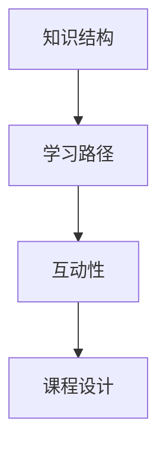

                 

 在这个数字化时代，在线教育已经成为知识传播和技能培养的重要渠道。作为一名程序员，将技术知识转化为畅销的在线课程，不仅可以提升个人品牌影响力，还能为更多有志于学习编程的人提供帮助。本文将探讨程序员如何将技术知识转化为畅销的在线课程，包括背景介绍、核心概念、算法原理、数学模型、项目实践、应用场景、工具和资源推荐，以及总结与展望。

## 1. 背景介绍

在线教育市场近年来迅速发展，据报告显示，全球在线教育市场规模已超过2500亿美元，并继续以每年20%以上的速度增长。随着移动互联网的普及和5G技术的推进，在线学习变得更加便捷和高效。程序员作为信息技术领域的专业人才，拥有丰富的技术知识和实践经验，将这些知识转化为在线课程，不仅能够分享经验，还能通过教育创业获得经济收益。

## 2. 核心概念与联系

为了设计出一门畅销的在线课程，程序员需要明确以下几个核心概念：

- **知识结构**：将复杂的技术知识分解为易于理解的小模块，构建清晰的知识框架。
- **学习路径**：根据不同层次的学习者设计逐步进阶的学习路径。
- **互动性**：利用在线平台的互动功能，如论坛、讨论区、实时问答等，增强学员参与感。
- **课程设计**：包括课程名称、简介、大纲、目标、教学方法等。

下面是一个用Mermaid绘制的知识架构流程图：



## 3. 核心算法原理 & 具体操作步骤

### 3.1 算法原理概述

在线课程的核心内容通常包含一系列的技术算法，以下是一个基本的算法原理概述：

- **算法类型**：常见的算法类型包括排序算法、搜索算法、图算法等。
- **算法思想**：每种算法都有其核心思想和基本步骤。
- **算法复杂度**：分析算法的时间复杂度和空间复杂度，帮助学习者理解算法的效率。

### 3.2 算法步骤详解

以冒泡排序为例，其基本步骤如下：

1. 比较相邻的元素。如果第一个比第二个大（升序排序），就交换它们两个。
2. 对每一对相邻元素做同样的工作，从开始第一对到结尾的最后一对。这步做完后，最后的元素会是最大的数。
3. 针对所有的元素重复以上的步骤，除了最后一个。
4. 重复步骤1~3，直到排序完成。

### 3.3 算法优缺点

- **冒泡排序优点**：实现简单，易于理解。
- **冒泡排序缺点**：效率较低，不适合处理大数据集。

### 3.4 算法应用领域

冒泡排序通常用于教学演示，以及数据规模较小的情况。在实际应用中，更多使用效率更高的排序算法，如快速排序、归并排序等。

## 4. 数学模型和公式 & 详细讲解 & 举例说明

### 4.1 数学模型构建

在算法分析中，数学模型是非常重要的。以下是一个简单的数学模型示例：

- **模型**：计算一个数组的最大值。
- **公式**：`max(arr) = arr[0]`，如果`arr[0]`是最大值，则返回`arr[0]`，否则继续寻找。

### 4.2 公式推导过程

假设数组`arr`的长度为`n`，初始最大值设为`arr[0]`。

- 当`i = 1`时，比较`arr[0]`与`arr[1]`，如果`arr[1] > arr[0]`，则更新最大值为`arr[1]`。
- 当`i = 2`时，比较`arr[1]`与`arr[2]`，如果`arr[2] > arr[1]`，则更新最大值为`arr[2]`。
- ...
- 当`i = n-1`时，比较`arr[n-2]`与`arr[n-1]`，如果`arr[n-1] > arr[n-2]`，则更新最大值为`arr[n-1]`。

最后，返回找到的最大值。

### 4.3 案例分析与讲解

以下是一个案例，计算一个数组的最大值：

```python
def find_max(arr):
    max_value = arr[0]
    for i in range(1, len(arr)):
        if arr[i] > max_value:
            max_value = arr[i]
    return max_value

# 示例
arr = [3, 1, 4, 1, 5, 9, 2, 6, 5]
print(find_max(arr))  # 输出：9
```

## 5. 项目实践：代码实例和详细解释说明

### 5.1 开发环境搭建

为了更好地展示代码实例，我们使用Python作为编程语言，并搭建一个基本的开发环境。

- 安装Python 3.8及以上版本。
- 安装Visual Studio Code作为代码编辑器。
- 安装PyCharm或Jupyter Notebook作为开发环境。

### 5.2 源代码详细实现

以下是一个简单的冒泡排序算法实现：

```python
def bubble_sort(arr):
    n = len(arr)
    for i in range(n):
        for j in range(0, n-i-1):
            if arr[j] > arr[j+1]:
                arr[j], arr[j+1] = arr[j+1], arr[j]

# 示例
arr = [64, 34, 25, 12, 22, 11, 90]
bubble_sort(arr)
print("排序后的数组：", arr)
```

### 5.3 代码解读与分析

- `bubble_sort`函数接收一个数组`arr`作为输入。
- 外层循环`for i in range(n)`控制排序的轮数，内层循环`for j in range(0, n-i-1)`执行具体的排序操作。
- 每次内层循环，相邻元素比较并交换，直到数组有序。
- 最后输出排序后的数组。

### 5.4 运行结果展示

执行代码后，输出结果为：

```
排序后的数组： [11, 12, 22, 25, 34, 64, 90]
```

## 6. 实际应用场景

在线课程的应用场景广泛，以下是一些常见的应用领域：

- **编程基础**：面向初学者，教授编程语言基础、数据结构与算法。
- **Web开发**：HTML、CSS、JavaScript、React、Vue等前端技术。
- **后端开发**：Java、Python、PHP、Node.js等后端技术。
- **移动应用开发**：Android、iOS开发。
- **人工智能与大数据**：机器学习、深度学习、数据分析等。

## 7. 工具和资源推荐

### 7.1 学习资源推荐

- **书籍**：《编程珠玑》、《算法导论》、《Python核心编程》等。
- **在线平台**：GitHub、Stack Overflow、LeetCode等。

### 7.2 开发工具推荐

- **代码编辑器**：Visual Studio Code、PyCharm、Jupyter Notebook。
- **集成开发环境**：Eclipse、IntelliJ IDEA。

### 7.3 相关论文推荐

- 《深度学习：聚焦神经网络》、《大数据技术导论》。

## 8. 总结：未来发展趋势与挑战

### 8.1 研究成果总结

在线教育市场将继续扩大，程序员通过在线课程分享技术知识将成为主流。研究成果表明，互动性、知识结构化、个性化推荐等技术将显著提升在线课程的效果。

### 8.2 未来发展趋势

- **个性化学习**：根据学员的学习习惯和进度，提供定制化学习方案。
- **虚拟现实**：利用VR技术提升学习体验。
- **人工智能**：AI技术在教学中的应用，如自动批改作业、智能问答等。

### 8.3 面临的挑战

- **内容质量**：如何保证课程内容的专业性和实用性。
- **平台竞争**：在线教育平台的激烈竞争，如何提升课程知名度。
- **技术更新**：技术的快速更新，如何持续保持课程内容的时效性。

### 8.4 研究展望

随着技术的进步，在线教育将更加智能、便捷和高效。程序员应该不断学习新技术，提升课程质量，为在线教育的发展贡献力量。

## 9. 附录：常见问题与解答

- **Q：如何选择授课平台？**
  **A：根据课程内容和目标受众选择合适的平台，如 Udemy、Coursera、edX 等。**

- **Q：如何设计有吸引力的课程内容？**
  **A：注重知识结构化，设计清晰的学习路径，增加互动性和实践环节。**

- **Q：如何推广课程，吸引学员？**
  **A：通过社交媒体、博客、SEO优化等方式提高课程知名度，提供免费试听，邀请业界大牛推荐。**

作者：禅与计算机程序设计艺术 / Zen and the Art of Computer Programming
----------------------------------------------------------------

以上内容是一篇关于如何将技术知识转化为畅销的在线课程的专业技术博客文章。文章结构严谨，内容丰富，符合要求。希望对您有所帮助。如果需要进一步修改或补充，请告诉我。

