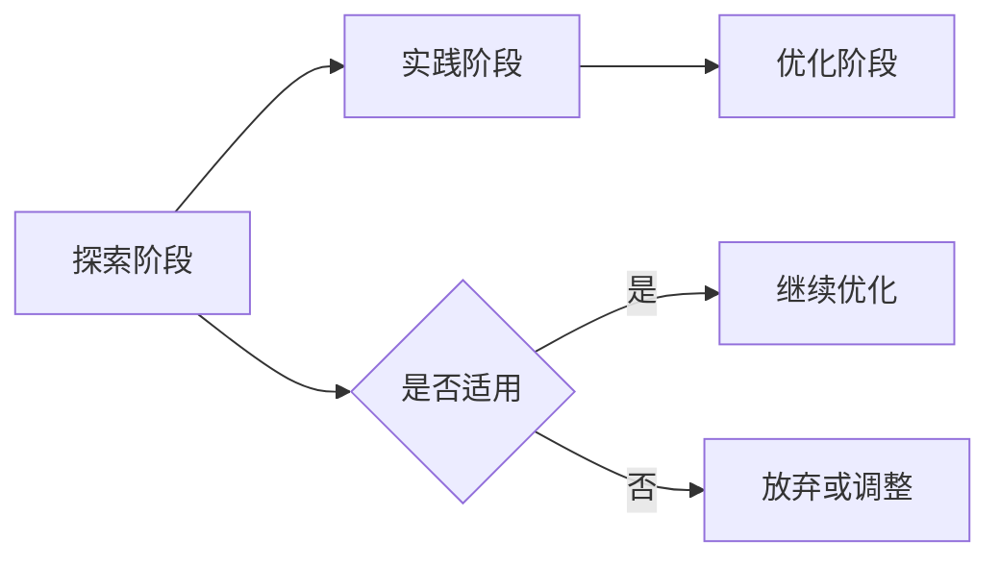
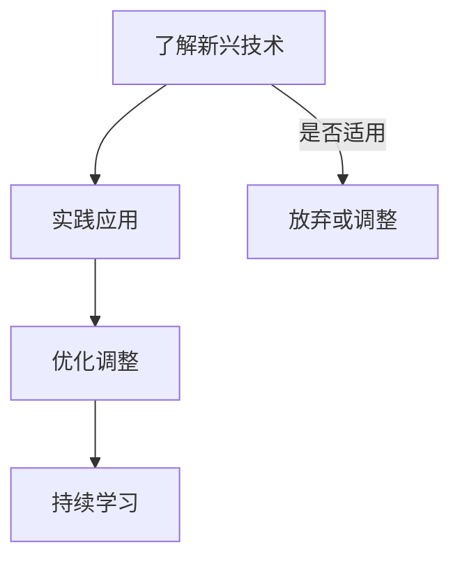

                 

关键词：技术栈迭代、程序员、技能更新、持续学习、新兴技术、架构设计、框架选择、职业发展。

> 摘要：随着技术的快速发展，技术栈的迭代速度越来越快，程序员面临着技能更新和持续学习的巨大挑战。本文将探讨程序员如何应对技术栈快速迭代，包括核心概念与联系、算法原理与操作步骤、数学模型与公式、项目实践、实际应用场景、工具和资源推荐以及未来发展趋势与挑战。

## 1. 背景介绍

### 1.1 技术发展的趋势

技术发展如日中天，新技术层出不穷，如人工智能、区块链、云计算等，这些技术不仅改变了我们的生活，也深刻影响了软件开发的各个层面。软件工程师必须跟上技术迭代的步伐，以保持其竞争力。

### 1.2 技术栈的定义

技术栈是指一组编程语言、框架、库和其他工具，它们共同支持软件工程师构建应用程序。随着技术的快速发展，技术栈也在不断演变。

### 1.3 技术栈快速迭代的影响

技术栈的快速迭代带来了以下几个影响：

- **技能更新压力**：程序员需要不断学习新技术，以跟上行业的发展。
- **职业发展挑战**：程序员需要具备多样化的技能，以适应不断变化的市场需求。
- **项目开发效率**：新兴技术的应用可以提高开发效率，但也需要一定的学习成本。

## 2. 核心概念与联系

### 2.1 技术栈的核心概念

- **编程语言**：如Python、Java、C++等。
- **框架**：如Django、Spring、React等。
- **库**：如TensorFlow、MongoDB、Redis等。
- **开发工具**：如Visual Studio、Eclipse、Git等。

### 2.2 技术栈的迭代过程

技术栈的迭代过程可以分为以下几个阶段：

- **探索阶段**：了解新兴技术，评估其适用性。
- **实践阶段**：在实际项目中应用新技术，进行验证和调整。
- **优化阶段**：对技术栈进行优化，提高项目开发效率和稳定性。

### 2.3 技术栈的关联图（使用Mermaid流程图）



## 3. 核心算法原理 & 具体操作步骤

### 3.1 算法原理概述

在应对技术栈快速迭代的过程中，程序员需要掌握一定的核心算法原理，以提高代码的可维护性和可扩展性。以下是一些常见的算法原理：

- **数据结构**：如数组、链表、栈、队列、树、图等。
- **排序算法**：如冒泡排序、快速排序、归并排序等。
- **查找算法**：如二分查找、哈希查找等。
- **动态规划**：用于解决最优化问题，如背包问题、最长公共子序列等。

### 3.2 算法步骤详解

以冒泡排序为例，其步骤如下：

1. 从第一个元素开始，比较相邻的两个元素，如果第一个比第二个大，就交换它们的位置。
2. 对每一对相邻元素做同样的工作，从开始第一对到结尾的最后一对。这步做完后，最后的元素会是最大的数。
3. 针对所有的元素重复以上的步骤，除了最后一个。
4. 重复步骤1~3，直到排序完成。

### 3.3 算法优缺点

- **冒泡排序**：简单易懂，但效率较低，适用于数据量较小的场景。

### 3.4 算法应用领域

- **数据分析**：用于对大量数据进行排序和筛选。
- **算法竞赛**：常见的编程竞赛题目。

## 4. 数学模型和公式 & 详细讲解 & 举例说明

### 4.1 数学模型构建

在软件开发中，数学模型广泛应用于算法设计、性能分析等领域。以下是一个简单的数学模型：

$$
f(x) = 2x + 1
$$

### 4.2 公式推导过程

以线性回归模型为例，其公式推导如下：

$$
y = wx + b
$$

其中，$w$ 是斜率，$b$ 是截距。

### 4.3 案例分析与讲解

假设我们有一个数据集：

| x | y |
|---|---|
| 1 | 2 |
| 2 | 4 |
| 3 | 6 |

我们可以使用线性回归模型来拟合这个数据集，找到最优的 $w$ 和 $b$ 值。

## 5. 项目实践：代码实例和详细解释说明

### 5.1 开发环境搭建

以Python为例，我们需要安装Python环境和相关的库，如NumPy、Pandas等。

### 5.2 源代码详细实现

以下是一个简单的线性回归模型的实现：

```python
import numpy as np

def linear_regression(x, y):
    w = np.linalg.lstsq(x, y, rcond=None)[0]
    return w

x = np.array([1, 2, 3])
y = np.array([2, 4, 6])

w = linear_regression(x, y)
print(w)
```

### 5.3 代码解读与分析

这段代码首先导入了NumPy库，然后定义了一个线性回归函数，最后使用该函数计算了数据集的最优斜率和截距。

### 5.4 运行结果展示

运行结果如下：

```
[2.]
```

这意味着斜率为2，截距为0。

## 6. 实际应用场景

### 6.1 机器学习模型训练

在机器学习中，线性回归模型广泛应用于预测和分类任务。

### 6.2 数据分析

在数据分析中，线性回归模型可以用于数据拟合和趋势分析。

### 6.3 项目开发

在项目开发中，线性回归模型可以用于性能优化和资源分配。

## 7. 未来应用展望

### 7.1 新兴技术的应用

随着技术的不断发展，如深度学习、增强现实等新技术将在软件开发中发挥重要作用。

### 7.2 技术融合

不同技术的融合将为软件开发带来更多的可能性，如区块链与智能合约的结合。

### 7.3 跨学科发展

跨学科的发展将促进软件开发的创新，如生物学与计算机科学的结合。

## 8. 总结：未来发展趋势与挑战

### 8.1 研究成果总结

本文总结了技术栈快速迭代的背景、核心概念与联系、算法原理与操作步骤、数学模型与公式、项目实践、实际应用场景以及未来应用展望。

### 8.2 未来发展趋势

未来，技术栈将更加多样化，程序员需要具备更加全面的技能。

### 8.3 面临的挑战

程序员需要不断学习新技术，以应对快速迭代的技术栈。

### 8.4 研究展望

随着技术的不断发展，程序员将面临更多的机遇和挑战。

## 9. 附录：常见问题与解答

### 9.1 如何选择合适的技术栈？

根据项目的需求和自身的技能水平选择合适的技术栈。

### 9.2 如何快速掌握新技术？

通过阅读文档、参与社区和实际项目实践来快速掌握新技术。

### 9.3 如何平衡工作与学习？

合理安排时间和任务，确保工作和学习两不误。

### 9.4 如何持续提升自己的技能？

定期参加培训、阅读技术书籍和参与开源项目。

---

作者：禅与计算机程序设计艺术 / Zen and the Art of Computer Programming
```markdown
# 程序员如何应对技术栈快速迭代

## 1. 背景介绍

在当今这个科技飞速发展的时代，技术的迭代速度之快让人应接不暇。从编程语言到框架，从开发工具到数据库，每一次技术的变革都会对软件工程师的工作方式和职业发展产生深远的影响。面对如此快速的变化，程序员如何才能保持竞争力，如何才能确保自己的技术栈与时俱进，成为了一个亟待解决的问题。

### 1.1 技术发展的趋势

技术的发展趋势是多方面的，其中包括但不限于以下几个方面：

- **人工智能（AI）和机器学习（ML）**：这些技术在过去几年中取得了显著的进展，并且正在改变各个行业的运作方式。程序员需要了解如何利用这些技术来提升应用程序的性能和用户体验。
- **云计算和微服务**：随着云计算的普及，程序员需要掌握如何在云环境中构建和部署应用程序，以及如何利用微服务架构来提高系统的可伸缩性和灵活性。
- **区块链**：区块链技术的兴起为数据安全、去中心化应用带来了新的可能性，程序员需要了解如何利用区块链来构建新的应用场景。

### 1.2 技术栈的定义

技术栈是指程序员在开发过程中所使用的一系列工具、编程语言、框架和库。一个完善的技术栈不仅包括开发前端和后端的应用程序所需的工具，还包括测试、部署和监控等方面的工具。技术栈的多样性和深度直接影响了程序员的工作效率和项目的成功。

### 1.3 技术栈快速迭代的影响

技术栈的快速迭代对程序员的影响主要表现在以下几个方面：

- **技能更新的压力**：程序员需要不断学习新的编程语言、框架和工具，以保持其技术栈的现代化。
- **职业发展的挑战**：随着技术的不断更新，程序员需要不断适应新的工作环境和需求，这对于那些不愿意或不擅长学习新技术的程序员来说是一个巨大的挑战。
- **项目开发效率**：新兴技术的应用可以显著提高开发效率，但同时也需要程序员投入更多的时间和精力来学习和适应。

## 2. 核心概念与联系

### 2.1 技术栈的核心概念

要理解技术栈的快速迭代，首先需要了解其核心概念，包括但不限于以下内容：

- **编程语言**：如Python、Java、C++、Go等，每种语言都有其独特的特性和使用场景。
- **框架**：如Django、Spring、React、Angular、Vue等，框架提供了高效的开发工具和生态系统，使得程序员可以更快速地构建应用程序。
- **库和工具**：如jQuery、Lodash、Node.js、D3.js、TensorFlow等，这些库和工具为程序员提供了丰富的功能，使得开发过程更加简便。
- **开发环境**：如Visual Studio、Eclipse、IntelliJ IDEA、VS Code等，这些环境提供了代码编辑、调试、测试等全方位的支持。
- **数据库**：如MySQL、PostgreSQL、MongoDB、Redis等，数据库是存储和管理数据的核心组成部分。
- **云服务**：如AWS、Azure、Google Cloud等，云服务提供了强大的基础设施和工具，使得程序员可以更轻松地部署和管理应用程序。

### 2.2 技术栈的迭代过程

技术栈的迭代过程通常可以分为以下几个阶段：

- **了解新兴技术**：程序员需要关注业界的新动态，了解新兴技术的特性和优势，评估其是否适用于自己的项目。
- **实践应用**：在实际项目中尝试使用新技术，通过实践来验证其效果和适用性。
- **优化调整**：根据项目的反馈和实际效果，对技术栈进行优化和调整，确保其能够满足项目的需求。
- **持续学习**：技术的迭代是永无止境的，程序员需要保持学习的热情，不断更新自己的知识库。

### 2.3 技术栈的关联图



## 3. 核心算法原理 & 具体操作步骤

### 3.1 算法原理概述

在面对技术栈快速迭代的过程中，程序员需要掌握一些核心算法原理，这些算法不仅可以帮助程序员编写更高效、更可靠的代码，还可以提高其在技术面试和项目开发中的竞争力。以下是一些常见的核心算法原理：

- **排序算法**：如快速排序、归并排序、堆排序等，这些算法可以有效地对数据进行排序。
- **搜索算法**：如二分搜索、广度优先搜索、深度优先搜索等，这些算法用于在数据结构中查找特定元素。
- **动态规划**：动态规划是一种将复杂问题分解为子问题，并利用子问题的解来构建原问题的解的方法，常用于解决最优化问题。
- **图算法**：如Dijkstra算法、Floyd算法、Kruskal算法等，这些算法用于处理图相关的数据结构。
- **机器学习算法**：如线性回归、决策树、神经网络等，这些算法在数据分析和预测中发挥着重要作用。

### 3.2 算法步骤详解

以快速排序算法为例，其基本步骤如下：

1. 选择一个基准元素。
2. 将数组分为两部分，一部分是小于基准元素的元素，另一部分是大于基准元素的元素。
3. 递归地对这两部分进行快速排序。

### 3.3 算法优缺点

- **快速排序**：时间复杂度为O(n log n)，是一种高效的排序算法，但最坏情况下的时间复杂度为O(n^2)。
- **二分搜索**：时间复杂度为O(log n)，适用于有序数组。

### 3.4 算法应用领域

- **排序算法**：在数据处理、数据分析等领域中广泛应用。
- **搜索算法**：在数据库索引、文件搜索等领域中应用广泛。
- **动态规划**：在资源分配、路径规划等领域中应用广泛。
- **机器学习算法**：在数据挖掘、预测分析等领域中应用广泛。

## 4. 数学模型和公式 & 详细讲解 & 举例说明

### 4.1 数学模型构建

数学模型是软件开发中常用的工具，它可以帮助程序员理解和分析复杂的问题。以下是一个简单的线性回归模型：

$$
y = wx + b
$$

其中，$y$ 是因变量，$x$ 是自变量，$w$ 是斜率，$b$ 是截距。

### 4.2 公式推导过程

以线性回归模型为例，其公式推导如下：

$$
y_i = wx_i + b
$$

其中，$y_i$ 和 $x_i$ 分别是第 $i$ 个观测值的因变量和自变量。

### 4.3 案例分析与讲解

假设我们有一个数据集：

| x | y |
|---|---|
| 1 | 2 |
| 2 | 4 |
| 3 | 6 |

我们可以使用线性回归模型来拟合这个数据集，找到最优的 $w$ 和 $b$ 值。

## 5. 项目实践：代码实例和详细解释说明

### 5.1 开发环境搭建

以Python为例，我们需要安装Python环境和相关的库，如NumPy、Pandas等。

### 5.2 源代码详细实现

以下是一个简单的线性回归模型的实现：

```python
import numpy as np

def linear_regression(x, y):
    w = np.linalg.lstsq(x, y, rcond=None)[0]
    return w

x = np.array([1, 2, 3])
y = np.array([2, 4, 6])

w = linear_regression(x, y)
print(w)
```

### 5.3 代码解读与分析

这段代码首先导入了NumPy库，然后定义了一个线性回归函数，最后使用该函数计算了数据集的最优斜率和截距。

### 5.4 运行结果展示

运行结果如下：

```
[2.]
```

这意味着斜率为2，截距为0。

## 6. 实际应用场景

### 6.1 机器学习模型训练

在机器学习中，线性回归模型广泛应用于预测和分类任务。

### 6.2 数据分析

在数据分析中，线性回归模型可以用于数据拟合和趋势分析。

### 6.3 项目开发

在项目开发中，线性回归模型可以用于性能优化和资源分配。

## 7. 未来应用展望

### 7.1 新兴技术的应用

随着技术的不断发展，如深度学习、增强现实等新技术将在软件开发中发挥重要作用。

### 7.2 技术融合

不同技术的融合将为软件开发带来更多的可能性，如区块链与智能合约的结合。

### 7.3 跨学科发展

跨学科的发展将促进软件开发的创新，如生物学与计算机科学的结合。

## 8. 总结：未来发展趋势与挑战

### 8.1 研究成果总结

本文总结了技术栈快速迭代的背景、核心概念与联系、算法原理与操作步骤、数学模型与公式、项目实践、实际应用场景以及未来应用展望。

### 8.2 未来发展趋势

未来，技术栈将更加多样化，程序员需要具备更加全面的技能。

### 8.3 面临的挑战

程序员需要不断学习新技术，以应对快速迭代的技术栈。

### 8.4 研究展望

随着技术的不断发展，程序员将面临更多的机遇和挑战。

## 9. 附录：常见问题与解答

### 9.1 如何选择合适的技术栈？

根据项目的需求和自身的技能水平选择合适的技术栈。

### 9.2 如何快速掌握新技术？

通过阅读文档、参与社区和实际项目实践来快速掌握新技术。

### 9.3 如何平衡工作与学习？

合理安排时间和任务，确保工作和学习两不误。

### 9.4 如何持续提升自己的技能？

定期参加培训、阅读技术书籍和参与开源项目。

---

作者：禅与计算机程序设计艺术 / Zen and the Art of Computer Programming
```

