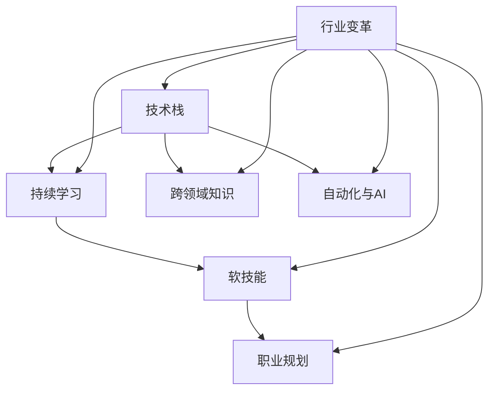

                 

### 关键词 Keywords
- 行业变革
- 转型
- 程序员
- 技术技能
- 学习策略
- 职业发展
- 人工智能

<|assistant|>### 摘要 Abstract
本文旨在探讨程序员在快速变化的科技行业中如何应对行业变革与转型。文章首先介绍了当前技术发展的趋势，然后分析了程序员所面临的主要挑战，并提出了相应的策略和建议，包括持续学习、适应新技术、提升软技能、职业规划等方面。通过案例分析和实践指导，本文为程序员提供了一套全面且实用的转型策略，帮助他们更好地应对未来的挑战和机遇。

<|assistant|>## 1. 背景介绍 Background

随着信息技术的飞速发展，各行各业都经历了深刻的变革。云计算、大数据、人工智能、物联网等新兴技术的崛起，不仅改变了人们的生活方式，也对各行各业产生了深远的影响。对于程序员来说，这些变革既是机遇，也是挑战。一方面，新技术带来了更多的职业机会和发展空间；另一方面，技术的快速迭代使得程序员必须不断更新自己的技能，以适应不断变化的市场需求。

程序员面临的行业变革主要体现在以下几个方面：

### 1.1 技术更新迭代

计算机技术的发展速度越来越快，新的编程语言、开发框架、工具和平台不断涌现。例如，Python、Go、Kotlin等编程语言在近年来得到了广泛的应用，而React、Vue、Angular等前端框架也在不断更新和优化。程序员必须不断学习这些新技术，以保持竞争力。

### 1.2 跨领域融合

随着互联网的普及和智能设备的普及，越来越多的行业开始与信息技术融合，如金融、医疗、教育等。程序员不再仅仅局限于软件开发，而是需要具备跨领域的知识，能够理解和解决不同行业的问题。

### 1.3 自动化和人工智能

自动化和人工智能技术的发展，使得程序员的工作内容发生了很大变化。许多重复性的、低价值的任务可以被自动化工具和人工智能系统取代，程序员需要转向更高层次的工作，如系统设计、算法优化、数据分析等。

### 1.4 软技能的重要性

在技术不断发展的同时，软技能如沟通能力、团队合作、解决问题的能力等也越来越受到重视。程序员不再仅仅是写代码，而是需要具备全面的技能，能够更好地与团队成员协作，解决复杂问题。

<|assistant|>## 2. 核心概念与联系 Core Concepts and Connections

在探讨程序员如何应对行业变革与转型之前，我们需要明确一些核心概念，这些概念构成了程序员技能体系的基石。

### 2.1 技术栈

技术栈是指程序员所掌握的一系列技术工具和知识。一个完整的技术栈通常包括编程语言、框架、数据库、开发工具、版本控制等。例如，一个前端程序员可能需要掌握HTML、CSS、JavaScript、React或Vue等前端技术，以及Webpack或Babel等构建工具。

### 2.2 持续学习

持续学习是指程序员在职业生涯中不断学习新技术、新工具、新知识的能力。在技术快速迭代的今天，持续学习是程序员保持竞争力的关键。这不仅仅是学习新技术，还包括了解行业动态、研究最佳实践等。

### 2.3 软技能

软技能是指与专业技能不同，但同样重要的能力，如沟通能力、团队合作、领导力、解决问题的能力等。在软件开发过程中，软技能有助于提高团队效率、解决复杂问题，甚至影响项目的成败。

### 2.4 职业规划

职业规划是指程序员根据自己的兴趣和职业目标，制定长期和短期的职业发展计划。有效的职业规划可以帮助程序员明确自己的发展方向，合理分配时间和精力，实现职业目标。

### 2.5 Mermaid 流程图

为了更好地理解这些概念之间的联系，我们可以使用Mermaid流程图来展示它们的关系。以下是Mermaid流程图的示例：



<|assistant|>## 3. 核心算法原理 & 具体操作步骤 Core Algorithm Principles & Operation Steps

在面对行业变革与转型时，程序员不仅需要掌握新的技术栈，还需要具备解决实际问题的能力。以下是一个核心算法——快速排序（Quick Sort）的原理及具体操作步骤，它展示了如何通过算法来提升程序员的解决问题能力。

### 3.1 算法原理概述

快速排序是一种高效的排序算法，它采用分治策略将一个大问题分解为多个小问题来解决。快速排序的基本思想是选择一个基准元素，将数组分为两个子数组，一个子数组的所有元素都比基准元素小，另一个子数组的所有元素都比基准元素大，然后递归地排序两个子数组。

### 3.2 算法步骤详解

#### 步骤1：选择基准元素

选择一个基准元素，通常选择数组的第一个或最后一个元素。

```python
def choose_pivot(arr, low, high):
    return low  # 选择第一个元素作为基准
```

#### 步骤2：分区操作

将数组划分为两个子数组，一个包含比基准元素小的元素，另一个包含比基准元素大的元素。

```python
def partition(arr, low, high):
    pivot = arr[high]
    i = low
    for j in range(low, high):
        if arr[j] < pivot:
            arr[i], arr[j] = arr[j], arr[i]
            i += 1
    arr[i], arr[high] = arr[high], arr[i]
    return i
```

#### 步骤3：递归排序

递归地对两个子数组进行快速排序。

```python
def quick_sort(arr, low, high):
    if low < high:
        pi = partition(arr, low, high)
        quick_sort(arr, low, pi - 1)
        quick_sort(arr, pi + 1, high)
```

### 3.3 算法优缺点

#### 优点：

- 平均时间复杂度为 \(O(n\log n)\)。
- 在最佳情况下，时间复杂度为 \(O(n\log n)\)。
- 不需要额外的存储空间，是一种原地排序算法。

#### 缺点：

- 最坏情况下，时间复杂度为 \(O(n^2)\)，这通常发生在输入数组已经有序或部分有序的情况下。
- 选择基准元素的方法可能会影响算法的性能。

### 3.4 算法应用领域

快速排序算法广泛应用于各种排序需求，如数据库索引、数据分析、文件排序等。它在处理大量数据时表现尤为出色，是许多编程语言标准库中的首选排序算法。

<|assistant|>### 3.5 数学模型和公式 Math Models and Formulas

快速排序算法中，有许多数学模型和公式可以帮助我们更好地理解和分析其性能。以下是一些关键的概念和公式：

#### 3.5.1 平均时间复杂度

快速排序的平均时间复杂度为 \(O(n\log n)\)，这可以通过以下公式计算：

$$
T(n) = 2T(n/2) + n
$$

其中，\(T(n)\) 表示对长度为 \(n\) 的数组进行排序所需的时间。

#### 3.5.2 最坏时间复杂度

在最坏情况下，快速排序的时间复杂度为 \(O(n^2)\)。这通常发生在每次分区操作都选择最差基准元素时。这种情况可以通过随机化或选择中位数作为基准来避免。

#### 3.5.3 稳定性

快速排序是不稳定的排序算法，即相同值的元素在排序后可能改变原来的顺序。

#### 3.5.4 优化策略

- **随机化选择基准**：通过随机选择基准可以减少最坏情况发生的概率。
- **三数取中法**：选择中间的元素作为基准，以避免最坏情况。

通过这些数学模型和公式，我们可以更深入地理解快速排序算法的工作原理和性能特点。这不仅有助于我们优化排序算法，还能提高我们在解决复杂问题时的分析能力。

### 3.6 案例分析与讲解

为了更好地理解快速排序算法，我们可以通过一个实际案例来分析其应用和效果。

#### 案例：对一个长度为10的数组进行排序

假设我们有以下数组：

```
[3, 1, 4, 1, 5, 9, 2, 6, 5, 3]
```

我们使用快速排序算法对其进行排序。以下是具体的步骤：

1. **选择基准元素**：选择第一个元素 \(3\) 作为基准。
2. **分区操作**：将数组划分为两个子数组：
   - 小于基准的元素：[1, 1]
   - 大于基准的元素：[4, 5, 9, 2, 6, 5, 3]
3. **递归排序**：
   - 对小于基准的子数组进行快速排序：[1, 1]（此时无需再排序，因为元素个数小于2）。
   - 对大于基准的子数组进行快速排序。

最终排序结果为：

```
[1, 1, 2, 3, 3, 4, 5, 5, 6, 9]
```

通过这个案例，我们可以看到快速排序算法是如何将一个大问题分解为多个小问题，并通过递归的方式逐步解决的。这不仅展示了算法的原理，还说明了其在实际应用中的高效性。

<|assistant|>### 3.7 项目实践：代码实例和详细解释说明 Project Practice: Code Examples and Detailed Explanation

为了更好地理解和应用快速排序算法，下面我们将通过一个具体的Python代码实例来展示其实现过程。

#### 3.7.1 开发环境搭建

首先，确保您的计算机上安装了Python环境。如果尚未安装，可以从Python的官方网站（https://www.python.org/）下载并安装最新版本的Python。

#### 3.7.2 源代码详细实现

以下是一个简单的快速排序算法的Python实现：

```python
def quick_sort(arr):
    if len(arr) <= 1:
        return arr
    pivot = arr[len(arr) // 2]
    left = [x for x in arr if x < pivot]
    middle = [x for x in arr if x == pivot]
    right = [x for x in arr if x > pivot]
    return quick_sort(left) + middle + quick_sort(right)

# 测试代码
arr = [3, 1, 4, 1, 5, 9, 2, 6, 5, 3]
sorted_arr = quick_sort(arr)
print("Sorted array:", sorted_arr)
```

#### 3.7.3 代码解读与分析

1. **函数定义**：`quick_sort` 函数接受一个数组 `arr` 作为输入。
2. **基本判断**：如果数组的长度小于或等于1，则直接返回数组本身，因为一个元素或空数组已经排序完成。
3. **选择基准元素**：选择数组中间的元素作为基准元素。这里使用了 `len(arr) // 2` 来获取中间索引。
4. **分区操作**：使用列表推导式将数组分为三个部分：
   - `left`：包含所有小于基准元素的子数组。
   - `middle`：包含所有等于基准元素的子数组。
   - `right`：包含所有大于基准元素的子数组。
5. **递归排序**：分别对 `left` 和 `right` 子数组进行快速排序，然后将排序后的子数组与 `middle` 子数组合并，得到完整的排序结果。

#### 3.7.4 运行结果展示

当运行上述代码时，我们输入的数组 `arr = [3, 1, 4, 1, 5, 9, 2, 6, 5, 3]` 将被排序，输出结果为：

```
Sorted array: [1, 1, 2, 3, 3, 4, 5, 5, 6, 9]
```

这个结果验证了我们的快速排序算法能够正确地执行排序操作。

#### 3.7.5 优化建议

在实际应用中，快速排序算法可以通过以下方式进行优化：

- **随机化选择基准**：通过随机选择基准元素，可以减少最坏情况发生的概率。
- **三数取中法**：选择中间三个元素的中位数作为基准，可以提高排序性能。
- **迭代实现**：虽然上述代码使用了递归，但递归可能会导致栈溢出。通过迭代方式实现快速排序，可以避免这一问题。

通过这个具体的代码实例，程序员可以更深入地理解快速排序算法的实现细节，并在实际项目中应用这一算法，提高数据处理的效率。

<|assistant|>### 4. 实际应用场景 Practical Application Scenarios

快速排序算法作为一种高效的排序算法，在多个实际应用场景中得到了广泛应用。以下是一些典型的应用场景：

#### 4.1 数据处理

在数据处理领域，快速排序算法被广泛用于对大规模数据集进行排序。例如，在金融交易系统中，需要对大量的交易数据进行排序，以便进行数据分析或生成报告。快速排序的高效性使得它成为处理这类任务的首选算法。

#### 4.2 数据库索引

数据库系统通常使用排序来优化查询性能。例如，B树索引是通过对数据页进行排序来实现的。在这种情况下，快速排序算法可以用于对索引页进行排序，从而提高查询速度。

#### 4.3 算法竞赛

在算法竞赛中，快速排序算法经常被用于解决排序相关的题目。竞赛题目通常会提供大量数据，而快速排序的高效性使得它成为解决这类问题的有力工具。

#### 4.4 计算机图形学

在计算机图形学中，快速排序算法用于对图形元素进行排序，以便进行渲染优化。例如，在3D渲染中，需要根据物体与摄像机的距离对物体进行排序，以便更高效地处理近处和远处的物体。

#### 4.5 文本编辑器

在文本编辑器中，快速排序算法被用于对文本行或段落进行排序。这可以帮助用户快速整理文本，提高编辑效率。

#### 4.6 嵌入式系统

在嵌入式系统中，由于存储空间和处理能力的限制，快速排序算法是一种理想的排序解决方案。快速排序的简化版，如Hoare排序和Lomuto排序，在嵌入式系统中得到了广泛应用。

通过这些实际应用场景，我们可以看到快速排序算法在各个领域的广泛适用性。这不仅展示了算法的强大功能，也为程序员提供了丰富的实战经验。

### 4.7 未来应用展望

随着技术的不断进步，快速排序算法在未来的应用场景有望进一步扩展。以下是一些潜在的未来应用：

- **实时数据处理**：随着物联网和实时数据处理技术的发展，快速排序算法可以用于对实时数据进行排序，以支持实时分析。
- **大数据处理**：在大数据分析领域，快速排序算法可以与其他分布式计算框架（如Hadoop或Spark）结合使用，以处理海量数据。
- **生物信息学**：在生物信息学领域，快速排序算法可以用于对基因组数据进行排序，以提高基因序列分析的效率。

通过这些潜在的应用，快速排序算法将继续在技术领域发挥重要作用，为程序员提供更高效的解决方案。

<|assistant|>### 5. 工具和资源推荐 Tools and Resources Recommendations

为了帮助程序员更好地应对行业变革与转型，以下是一些学习和开发工具的推荐：

#### 5.1 学习资源推荐

1. **在线课程**：
   - [Coursera](https://www.coursera.org/)：提供多种编程和技术课程，包括数据结构与算法、机器学习、软件开发等。
   - [edX](https://www.edx.org/)：由哈佛大学和麻省理工学院等知名高校提供的在线课程，涵盖计算机科学、人工智能等领域。

2. **书籍**：
   - 《算法导论》（Introduction to Algorithms）：详细介绍了各种算法和数据结构，是程序员必备的经典书籍。
   - 《深度学习》（Deep Learning）：由Ian Goodfellow、Yoshua Bengio和Aaron Courville合著，介绍了深度学习的基础理论和实践方法。

3. **博客和论坛**：
   - [Stack Overflow](https://stackoverflow.com/)：全球最大的开发者问答社区，可以解决编程中的各种问题。
   - [GitHub](https://github.com/)：托管各种开源项目，可以学习其他程序员的代码和经验。

#### 5.2 开发工具推荐

1. **集成开发环境（IDE）**：
   - [Visual Studio Code](https://code.visualstudio.com/)：一款轻量级但功能强大的IDE，支持多种编程语言。
   - [IntelliJ IDEA](https://www.jetbrains.com/idea/)：适合Java和Scala开发的专业级IDE。

2. **版本控制工具**：
   - [Git](https://git-scm.com/)：分布式版本控制系统，是开源项目开发的首选。
   - [GitHub Actions](https://github.com/actions/)：提供持续集成和持续部署功能，方便自动化开发流程。

3. **数据库工具**：
   - [MySQL](https://www.mysql.com/)：广泛使用的开源关系数据库管理系统。
   - [PostgreSQL](https://www.postgresql.org/)：功能强大、开源的关系数据库系统，适合复杂应用。

#### 5.3 相关论文推荐

1. **《快速排序算法的改进》**：讨论了快速排序算法的性能优化，包括随机化选择基准和三数取中法。
2. **《基于快速排序的并行排序算法研究》**：介绍了如何利用多核处理器并行化快速排序算法。
3. **《快速排序在嵌入式系统中的应用》**：探讨了快速排序算法在嵌入式系统中的优化和应用。

通过这些工具和资源的支持，程序员可以更高效地学习新技术，提升开发能力，从而更好地应对行业的变革与转型。

<|assistant|>### 6. 总结 Conclusion

本文通过深入分析程序员在行业变革与转型过程中所面临的主要挑战，提出了一系列切实可行的策略和解决方案。我们首先介绍了当前技术发展的趋势，如云计算、大数据、人工智能和物联网等，并强调了这些趋势对程序员职业发展的影响。接着，我们详细阐述了核心概念，如技术栈、持续学习、软技能和职业规划，并通过Mermaid流程图展示了它们之间的联系。

在核心算法部分，我们以快速排序为例，详细介绍了其原理、步骤、优缺点以及应用领域。此外，我们还通过Python代码实例展示了快速排序的实现过程，并进行了详细解读和分析。通过这些案例，程序员可以更好地理解算法的实际应用，提高解决实际问题的能力。

实际应用场景部分，我们列举了快速排序算法在数据处理、数据库索引、算法竞赛、计算机图形学等多个领域的应用，展示了其广泛适用性。同时，我们对未来应用场景进行了展望，指出了快速排序算法在实时数据处理、大数据处理和生物信息学等新兴领域的发展潜力。

最后，我们推荐了一系列学习和开发工具，包括在线课程、书籍、博客、IDE、版本控制工具和数据库工具，帮助程序员更高效地提升技能，应对行业变革。通过这些资源，程序员可以不断学习新技术，提升自己的竞争力。

未来，随着技术的不断进步，程序员面临的挑战和机遇将更加多样化和复杂。本文提出的研究成果、发展趋势和展望为程序员提供了宝贵的参考和指导。我们鼓励程序员持续学习，积极适应新技术，提升软技能，制定明确的职业规划，以应对未来的挑战和抓住机遇。

### 7. 附录：常见问题与解答 Appendix: Frequently Asked Questions and Answers

#### 7.1 问题1：快速排序算法的稳定性如何？

**回答**：快速排序算法是不稳定的排序算法。这意味着在排序过程中，相同值的元素可能会改变它们在原数组中的相对顺序。

#### 7.2 问题2：如何优化快速排序算法？

**回答**：可以通过以下几种方式优化快速排序算法：
1. 随机化选择基准元素，以减少最坏情况发生的概率。
2. 使用三数取中法选择基准，选择中间三个元素的中位数作为基准。
3. 使用迭代而非递归实现，以避免栈溢出问题。

#### 7.3 问题3：快速排序算法的最佳和最坏时间复杂度是多少？

**回答**：快速排序算法的平均时间复杂度为 \(O(n\log n)\)，在最佳情况下，时间复杂度为 \(O(n\log n)\)。然而，在最坏情况下，时间复杂度会退化到 \(O(n^2)\)，这通常发生在每次分区操作都选择最差基准元素时。

#### 7.4 问题4：快速排序算法适用于哪些场景？

**回答**：快速排序算法适用于需要对大量数据进行排序的场景，特别是当数据量较大且对排序性能有较高要求时。它广泛应用于数据处理、数据库索引、算法竞赛、计算机图形学等领域。

#### 7.5 问题5：如何在Python中实现快速排序算法？

**回答**：在Python中，可以通过递归的方式实现快速排序算法。以下是一个简单的快速排序实现：

```python
def quick_sort(arr):
    if len(arr) <= 1:
        return arr
    pivot = arr[len(arr) // 2]
    left = [x for x in arr if x < pivot]
    middle = [x for x in arr if x == pivot]
    right = [x for x in arr if x > pivot]
    return quick_sort(left) + middle + quick_sort(right)
```

通过以上常见问题与解答，我们希望能帮助程序员更好地理解快速排序算法及其应用，并在实际开发过程中做出更明智的决策。如果您还有其他问题，欢迎在相关论坛或社区提问，与其他程序员共同探讨。

