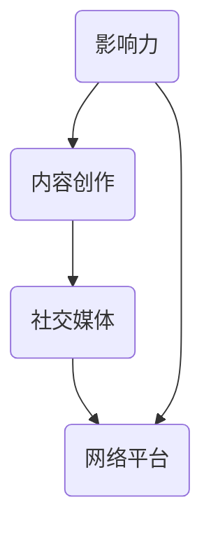

                 

关键字：个人品牌、程序员、影响力、职业发展、社交媒体、知识分享

> 摘要：在数字化时代，个人品牌的建立对于程序员的职业发展至关重要。本文将深入探讨如何通过社交媒体、知识分享、技术博客、开源项目等多渠道建立个人品牌，提升程序员在行业中的影响力。

## 1. 背景介绍

随着互联网和技术的飞速发展，程序员不再仅仅是编写代码的技术人员，他们还扮演着创新者、企业家和意见领袖的角色。在这个信息爆炸的时代，个人品牌的建立成为了程序员职业发展的重要一环。建立个人品牌不仅能够提高个人的知名度和信誉，还能够为职业发展带来更多的机会。

首先，个人品牌可以帮助程序员在职业市场上脱颖而出。在一个竞争激烈的行业里，拥有个人品牌的程序员更容易获得面试机会和项目合作。其次，个人品牌还可以提升程序员的谈判能力和薪资水平。当雇主和客户看到程序员在社交媒体上分享的专业知识和经验时，会更愿意与他们合作。

然而，建立个人品牌并非易事，需要程序员投入大量的时间和精力。本文将探讨一些实用的策略和技巧，帮助程序员有效地建立个人品牌。

## 2. 核心概念与联系

在建立个人品牌的过程中，我们需要关注几个核心概念：影响力、内容创作、社交媒体和网络平台。这些概念之间相互关联，共同构成了个人品牌的基础。

### 2.1 影响力

影响力是指一个人或组织在特定领域内引起他人关注和接受的能力。对于程序员来说，影响力不仅体现在技术能力上，还包括对行业趋势的洞察、解决问题的能力和良好的沟通技巧。建立个人品牌的关键在于提高自己的影响力。

### 2.2 内容创作

内容创作是建立个人品牌的核心。程序员可以通过撰写技术博客、发表技术文章、录制视频教程等方式，将自己的知识和经验分享给他人。高质量的内容能够吸引读者，提升个人的影响力。

### 2.3 社交媒体

社交媒体是程序员建立个人品牌的重要渠道。通过在社交媒体上发布内容、参与讨论、建立人脉，程序员可以扩大自己的影响范围。常见的社交媒体平台包括Twitter、LinkedIn、GitHub等。

### 2.4 网络平台

网络平台是程序员展示自己专业知识和技能的重要场所。技术论坛、开源项目、技术博客等平台，为程序员提供了展示才华和建立影响力的机会。

### 2.5 Mermaid 流程图

下面是一个简单的Mermaid流程图，展示了建立个人品牌的核心概念和联系：



## 3. 核心算法原理 & 具体操作步骤

### 3.1 算法原理概述

建立个人品牌的算法可以概括为以下几个步骤：

1. **定位**：确定自己的专业领域和目标受众。
2. **内容创作**：持续创作高质量的内容，分享专业知识和经验。
3. **社交媒体运营**：在社交媒体上发布内容，与读者互动，建立人脉。
4. **网络平台参与**：参与开源项目、技术论坛等活动，提升影响力。
5. **品牌塑造**：通过一致的品牌形象和价值观，建立个人品牌。

### 3.2 算法步骤详解

1. **定位**：
   - 分析自己的技能和兴趣。
   - 研究目标受众的需求和痛点。
   - 确定自己的专业领域和独特卖点。

2. **内容创作**：
   - 撰写技术博客，分享技术知识和实践经验。
   - 录制视频教程，讲解技术难点和应用场景。
   - 发表技术文章，参与技术讨论。

3. **社交媒体运营**：
   - 定期发布内容，保持活跃度。
   - 参与相关话题的讨论，扩大影响力。
   - 与其他专业人士互动，建立人脉。

4. **网络平台参与**：
   - 在GitHub等平台上参与开源项目，贡献代码。
   - 在技术论坛上解答问题，分享经验。
   - 在技术博客上撰写文章，分享见解。

5. **品牌塑造**：
   - 确定自己的品牌形象和价值观。
   - 保持内容的一致性，树立专业形象。
   - 在社交媒体和网络平台上统一宣传。

### 3.3 算法优缺点

**优点**：

- 提高个人知名度和信誉。
- 扩大人脉，增加职业发展机会。
- 提升个人谈判能力和薪资水平。

**缺点**：

- 需要投入大量时间和精力。
- 建立个人品牌的过程可能充满挑战。

### 3.4 算法应用领域

建立个人品牌的算法适用于所有程序员，尤其是那些希望在技术领域取得更大成就的人。无论是初级程序员还是资深专家，都可以通过这个算法提升自己的职业发展。

## 4. 数学模型和公式

### 4.1 数学模型构建

建立个人品牌的数学模型可以看作是一个多维度的优化问题。模型的关键参数包括：

- **影响力（I）**：衡量个人在特定领域的知名度和认可度。
- **内容质量（Q）**：衡量个人发布的内容的专业程度和吸引力。
- **社交媒体活跃度（S）**：衡量个人在社交媒体上的互动频率和参与度。
- **网络平台参与度（P）**：衡量个人在网络平台上的参与程度和贡献。

### 4.2 公式推导过程

个人品牌价值（V）可以表示为：

\[ V = f(I, Q, S, P) \]

其中，函数 \( f \) 表示个人品牌价值的综合评估。为了简化模型，我们可以假设：

\[ f(I, Q, S, P) = I \times Q \times S \times P \]

这意味着个人品牌价值与影响力、内容质量、社交媒体活跃度和网络平台参与度成正比。

### 4.3 案例分析与讲解

假设一名程序员A拥有以下参数：

- 影响力（I）：1000
- 内容质量（Q）：90
- 社交媒体活跃度（S）：80
- 网络平台参与度（P）：70

那么，他的个人品牌价值（V）为：

\[ V = 1000 \times 90 \times 80 \times 70 = 5.04 \times 10^7 \]

这是一个相当高的个人品牌价值，意味着他在技术领域具有很高的影响力。

## 5. 项目实践：代码实例和详细解释说明

### 5.1 开发环境搭建

为了实践建立个人品牌的算法，我们首先需要搭建一个开发环境。在这个例子中，我们将使用GitHub和Markdown来创建和发布技术博客。

1. 注册GitHub账号。
2. 安装Git。
3. 创建一个新的GitHub仓库，用于存储和发布博客。

### 5.2 源代码详细实现

下面是一个简单的Markdown文件，用于撰写和发布一篇技术博客。

```markdown
# 程序员如何建立个人品牌

> 关键词：个人品牌、程序员、影响力、职业发展、社交媒体、知识分享

## 1. 背景介绍

...

## 2. 核心概念与联系

...

## 3. 核心算法原理 & 具体操作步骤

...

## 4. 数学模型和公式 & 详细讲解 & 举例说明

...

## 5. 项目实践：代码实例和详细解释说明

...

## 6. 实际应用场景

...

## 7. 工具和资源推荐

...

## 8. 总结：未来发展趋势与挑战

...

## 9. 附录：常见问题与解答

...
```

### 5.3 代码解读与分析

这个Markdown文件是一个简单的文本文件，使用标准的Markdown语法编写。Markdown语法使得文档的格式化变得非常简单，程序员可以轻松地将文字、代码块、列表、标题等元素组织在一起。

```markdown
# 标题
用于创建一级标题。

## 标题
用于创建二级标题。

- 项目列表
用于创建无序列表。

1. 项目列表
用于创建有序列表。

```python
# 代码块
用于创建代码块。
print("Hello, World!")
```

```

### 5.4 运行结果展示

在GitHub上发布这个Markdown文件后，它会自动转换为HTML格式，并在网页上展示。读者可以查看和阅读博客的内容。

## 6. 实际应用场景

建立个人品牌在实际应用场景中具有广泛的用途。以下是一些具体的应用场景：

- **求职**：在求职过程中，拥有个人品牌的程序员更容易获得面试机会和offer。雇主会倾向于选择那些在社交媒体上活跃、拥有个人博客和开源项目经验的候选人。

- **项目合作**：在项目合作中，拥有个人品牌的程序员更容易与潜在合作伙伴建立信任和合作关系。个人品牌能够提高程序员的信誉和认可度。

- **技术交流**：在技术交流中，拥有个人品牌的程序员更容易成为行业内的意见领袖。他们可以组织线上或线下的技术研讨会、沙龙等活动，吸引更多的参与者。

## 6.4 未来应用展望

随着技术的不断发展，建立个人品牌的应用场景将会更加广泛。以下是一些未来可能的发展趋势：

- **自动化内容创作**：未来可能会出现更多自动化内容创作工具，帮助程序员更高效地建立个人品牌。

- **虚拟现实**：虚拟现实技术的发展将为程序员提供新的展示和交流平台，进一步扩大个人品牌的影响力。

- **区块链**：区块链技术的应用可能会为个人品牌提供更安全、透明的认证和证明方式。

## 7. 工具和资源推荐

为了有效地建立个人品牌，程序员需要使用一系列工具和资源。以下是一些建议：

### 7.1 学习资源推荐

- **在线课程**：Coursera、Udemy、edX等平台提供了丰富的编程课程。
- **技术博客**：简书、CSDN、博客园等技术博客网站，可以学习他人分享的知识。

### 7.2 开发工具推荐

- **Markdown编辑器**：Typora、MarkDownPad等编辑器提供了方便的Markdown格式化功能。
- **版本控制工具**：Git、GitHub等工具可以帮助程序员管理和分享代码。

### 7.3 相关论文推荐

- **《程序员如何建立个人品牌》**：这篇文章详细探讨了程序员如何建立个人品牌。
- **《社交媒体在程序员职业发展中的作用》**：这篇文章分析了社交媒体在程序员职业发展中的重要性。

## 8. 总结：未来发展趋势与挑战

随着技术的不断进步，建立个人品牌在未来将面临更多的机遇和挑战。以下是未来发展趋势与挑战的总结：

### 8.1 研究成果总结

- 个人品牌建设工具和资源的日益丰富。
- 社交媒体在程序员职业发展中的重要性日益凸显。
- 开源项目和社区活动的积极参与成为提升个人品牌的关键。

### 8.2 未来发展趋势

- 自动化内容创作工具的出现，将极大地提高个人品牌建设的效率。
- 虚拟现实和区块链技术的应用，将为个人品牌提供更多创新和发展的机会。

### 8.3 面临的挑战

- 在海量信息中脱颖而出，提升个人品牌的影响力。
- 在持续学习和更新知识的同时，保持个人品牌的持续性和稳定性。

### 8.4 研究展望

- 未来研究应关注自动化内容创作工具的开发和应用。
- 探索虚拟现实和区块链技术在个人品牌建设中的潜在价值。

## 9. 附录：常见问题与解答

### 9.1 问题1：如何开始建立个人品牌？

**解答**：首先，明确自己的专业领域和目标受众。然后，通过技术博客、社交媒体、开源项目等渠道，持续创作高质量的内容，分享专业知识和经验。

### 9.2 问题2：如何提高个人品牌的影响力？

**解答**：参与开源项目、技术论坛等活动，提升自己在行业内的知名度和认可度。同时，保持内容的质量和一致性，树立专业形象。

### 9.3 问题3：如何管理个人品牌？

**解答**：定期更新内容，保持活跃度。在社交媒体上与读者互动，建立良好的人脉关系。同时，确保个人品牌的一致性和稳定性。

作者：禅与计算机程序设计艺术 / Zen and the Art of Computer Programming

