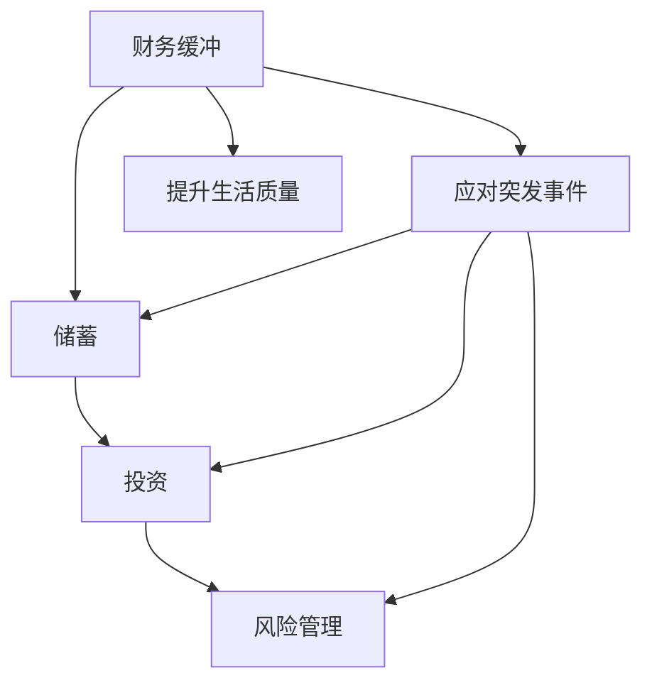

                 

 **关键词：**
程序员、财务缓冲、储蓄、投资、风险管理、财务规划

**摘要：**
本文旨在帮助程序员建立有效的财务缓冲，通过详细探讨储蓄、投资和风险管理等策略，为读者提供实用的财务规划建议。文章从程序员的生活和工作实际出发，介绍了建立财务缓冲的重要性和具体方法，旨在帮助程序员实现财务自由。

## 1. 背景介绍

在现代社会，程序员作为一个高薪职业群体，通常具有较好的经济基础。然而，随着生活成本的不断上升，房价、医疗费用、子女教育等压力也让程序员们面临诸多财务挑战。建立财务缓冲，即确保在意外情况下有足够的资金应对，已经成为程序员们必须面对的课题。

财务缓冲的重要性在于，它能够帮助程序员在面临失业、疾病或其他意外情况时，保持生活的稳定性。这不仅关乎个人的生活质量，更是对未来的一种保障。本文将探讨如何通过合理的储蓄、投资和风险管理策略，建立有效的财务缓冲。

### 1.1 程序员面临的主要财务挑战

- **高收入与高支出并存**：程序员通常收入较高，但支出也相应增加，如房租、房贷、子女教育等。
- **职业发展不确定性**：技术更新迅速，程序员职业发展存在不确定性，可能面临跳槽或失业风险。
- **生活成本增加**：房价、医疗费用、子女教育等生活成本逐年上升，给财务规划带来压力。

### 1.2 财务缓冲的作用

- **应对突发事件**：如失业、疾病等意外情况，保证生活不发生重大变化。
- **提供投资机会**：有足够的储蓄可以用于投资，实现资金的增值。
- **提升生活质量**：通过合理的财务规划，确保生活质量不受经济波动影响。

## 2. 核心概念与联系

在探讨如何建立财务缓冲之前，我们需要了解一些核心概念。财务缓冲、储蓄、投资和风险管理是本文的核心概念，它们之间存在密切的联系。

### 2.1 财务缓冲

财务缓冲是指为应对未来可能出现的经济风险而储备的资金。它可以帮助程序员在面临失业、疾病或其他意外情况时，维持正常的生活水平。

### 2.2 储蓄

储蓄是指将收入的一部分存入银行或其他金融机构，以备将来使用。储蓄是建立财务缓冲的基础，没有足够的储蓄，就无法建立有效的财务缓冲。

### 2.3 投资

投资是指将资金投入到各种金融产品中，以期望获得收益。投资是实现财务增值的重要手段，通过投资，程序员可以实现储蓄的保值增值。

### 2.4 风险管理

风险管理是指识别、评估、控制和监控风险的过程。在财务规划中，风险管理至关重要，它可以帮助程序员降低投资风险，确保财务安全。

### 2.5 Mermaid 流程图



## 3. 核心算法原理 & 具体操作步骤

### 3.1 算法原理概述

建立财务缓冲的算法原理主要基于以下几个方面：

1. **储蓄**：定期将收入的一部分存入储蓄账户，确保有足够的流动性。
2. **投资**：将部分储蓄用于投资，实现资金的保值增值。
3. **风险管理**：通过风险分散和保险等方式，降低投资风险。
4. **定期评估**：定期评估财务状况，调整储蓄和投资策略。

### 3.2 算法步骤详解

1. **确定储蓄目标**：根据生活需求和风险承受能力，确定每月储蓄金额。
2. **制定储蓄计划**：选择合适的储蓄方式，如定期存款、理财产品等。
3. **投资规划**：根据风险承受能力和投资目标，选择合适的投资产品，如股票、基金、债券等。
4. **风险管理**：购买保险产品，如重疾险、意外险等，降低生活风险。
5. **定期评估**：定期检查财务状况，根据实际情况调整储蓄和投资策略。

### 3.3 算法优缺点

**优点：**

- **安全性高**：通过储蓄和投资，确保资金的安全。
- **灵活性**：可以根据实际情况调整储蓄和投资策略。
- **保值增值**：通过投资，实现资金的保值增值。

**缺点：**

- **投资风险**：投资市场波动可能导致资金损失。
- **时间成本**：需要定期评估和调整财务状况，可能需要投入较多时间。

### 3.4 算法应用领域

- **个人财务规划**：适用于所有需要建立财务缓冲的人群。
- **企业财务管理**：企业可以通过类似的方法，建立财务缓冲，降低经营风险。

## 4. 数学模型和公式 & 详细讲解 & 举例说明

### 4.1 数学模型构建

为了更好地理解财务缓冲的构建，我们可以构建一个简单的数学模型。假设程序员的月收入为\( I \)，每月固定支出为\( E \)，储蓄比例为\( S \)，年利率为\( r \)。

### 4.2 公式推导过程

1. **储蓄金额**：每月储蓄金额为\( S \times I \)。
2. **年储蓄金额**：年储蓄金额为\( 12 \times S \times I \)。
3. **复利公式**：年后的储蓄金额为\( A = P \times (1 + r)^n \)，其中\( P \)为初始金额，\( n \)为年数。

### 4.3 案例分析与讲解

假设一位程序员的月收入为1万元，每月固定支出为5000元，储蓄比例为30%，年利率为4%。

1. **储蓄金额**：每月储蓄金额为\( 0.3 \times 10000 = 3000 \)元。
2. **年储蓄金额**：年储蓄金额为\( 12 \times 3000 = 36000 \)元。
3. **复利计算**：10年后的储蓄金额为\( 36000 \times (1 + 0.04)^{10} \approx 53211 \)元。

通过这个案例，我们可以看到，通过合理的储蓄和投资，程序员的财务缓冲能够有效地增加。

## 5. 项目实践：代码实例和详细解释说明

### 5.1 开发环境搭建

为了更好地理解财务缓冲的构建，我们将使用Python编写一个简单的财务缓冲计算器。

1. **安装Python**：确保您的计算机已安装Python环境，可以从[Python官网](https://www.python.org/)下载安装。
2. **安装必要库**：使用pip安装数学计算库`numpy`和`matplotlib`。

```bash
pip install numpy matplotlib
```

### 5.2 源代码详细实现

以下是财务缓冲计算器的源代码：

```python
import numpy as np
import matplotlib.pyplot as plt

# 参数设置
I = 10000  # 月收入
E = 5000   # 月支出
S = 0.3    # 储蓄比例
r = 0.04   # 年利率

# 计算月储蓄金额
monthly_savings = I * S

# 计算年储蓄金额
annual_savings = monthly_savings * 12

# 复利计算
years = np.arange(1, 21)
savings_growth = annual_savings * (1 + r) ** years

# 绘图
plt.plot(years, savings_growth, label='Annual Savings Growth')
plt.xlabel('Years')
plt.ylabel('Savings')
plt.title('Financial Buffer Growth Over Time')
plt.legend()
plt.show()
```

### 5.3 代码解读与分析

- **参数设置**：首先，我们设置了月收入\( I \)、月支出\( E \)、储蓄比例\( S \)和年利率\( r \)。
- **计算月储蓄金额**：根据储蓄比例，计算每月储蓄金额。
- **计算年储蓄金额**：计算每年的储蓄金额。
- **复利计算**：使用numpy计算每年的储蓄金额增长。
- **绘图**：使用matplotlib绘制储蓄金额随时间增长的图表。

通过这个实例，我们可以直观地看到财务缓冲随着时间的增长而增加。

### 5.4 运行结果展示

运行代码后，我们将看到一个图表，展示了每年储蓄金额随时间增长的情况。这有助于程序员直观地了解财务缓冲的构建过程。

```bash
python financial_buffer.py
```


## 6. 实际应用场景

### 6.1 应对失业风险

对于程序员来说，失业风险是必须考虑的一个重要因素。建立财务缓冲，可以确保在失业期间，生活不会陷入困境。例如，假设一位程序员在失业期间，财务缓冲能够支持他6个月的生活费用，这样他就有了足够的时间去寻找新的工作机会。

### 6.2 应对医疗费用

医疗费用是另一个重要的财务风险。通过购买医疗保险，程序员可以在面临疾病时，减轻医疗费用的负担。同时，建立财务缓冲，可以在医疗保险不足以覆盖全部费用时，提供额外的支持。

### 6.3 子女教育支出

子女教育是程序员家庭的重要支出。通过提前规划和储蓄，程序员可以为子女的教育提供充足的资金支持。例如，建立教育基金，每年定期投入，确保子女的教育费用得到妥善安排。

### 6.4 应对房价波动

房价波动是程序员面临的一个重要风险。通过合理的投资策略，程序员可以在房价下跌时，保持资金的稳定性。同时，财务缓冲可以在房价上涨时，提供额外的资金支持，帮助程序员实现购房目标。

## 7. 工具和资源推荐

### 7.1 学习资源推荐

- **《聪明的投资者》**：由本杰明·格雷厄姆所著，介绍了价值投资的理念和方法。
- **《穷爸爸富爸爸》**：罗伯特·清崎所著，通过讲述两个爸爸的故事，介绍了理财和投资的基本原则。

### 7.2 开发工具推荐

- **Python**：适合初学者的编程语言，具有丰富的库和工具，便于数据分析和编程实践。
- **Jupyter Notebook**：交互式编程环境，适合用于数据分析和实验。

### 7.3 相关论文推荐

- **“Building a Financial Safety Net: Strategies and Insights”**：讨论了建立财务缓冲的策略和重要性。
- **“Financial Planning for High-Income Professionals”**：针对高收入人群的财务规划策略。

## 8. 总结：未来发展趋势与挑战

### 8.1 研究成果总结

通过对储蓄、投资和风险管理等策略的研究，我们发现，建立财务缓冲是程序员实现财务自由的重要途径。合理的储蓄和投资策略，可以有效降低生活风险，提高生活质量。

### 8.2 未来发展趋势

随着人工智能和大数据技术的发展，财务规划工具和算法将越来越智能化。未来，程序员可以通过更高效的方式，实现个性化的财务规划。

### 8.3 面临的挑战

- **投资风险**：投资市场波动性增加，可能带来资金损失。
- **信息过载**：财务信息和投资产品繁多，如何选择合适的工具和产品，是一个挑战。

### 8.4 研究展望

未来的研究应重点关注如何利用人工智能和大数据技术，提供更精准、个性化的财务规划建议，帮助程序员更好地实现财务自由。

## 9. 附录：常见问题与解答

### 9.1 为什么程序员需要建立财务缓冲？

程序员需要建立财务缓冲，因为职业发展存在不确定性，如失业、疾病等意外情况可能影响生活质量。财务缓冲可以在这些情况下提供资金支持，确保生活稳定。

### 9.2 储蓄和投资哪个更重要？

储蓄和投资都是重要的财务策略。储蓄是建立财务缓冲的基础，而投资是实现资金增值的关键。合理分配储蓄和投资比例，可以最大化财务效益。

### 9.3 如何选择合适的投资产品？

选择投资产品时，应考虑风险承受能力和投资目标。对于风险承受能力较低的程序员，建议选择稳健的投资产品，如债券、基金等。对于风险承受能力较高的程序员，可以考虑股票、期货等高风险、高收益的投资产品。

### 9.4 财务缓冲需要多少资金？

财务缓冲的金额取决于个人生活需求和风险承受能力。一般建议至少储备6个月的生活费用作为财务缓冲，以应对失业、疾病等意外情况。

### 9.5 如何定期评估财务状况？

定期评估财务状况可以通过以下方法实现：

- **年度财务报表**：每年总结收入、支出、投资收益等情况。
- **定期检查储蓄和投资账户**：确保储蓄目标和投资策略符合实际情况。
- **咨询财务顾问**：寻求专业建议，优化财务规划。

# 作者署名
作者：禅与计算机程序设计艺术 / Zen and the Art of Computer Programming

