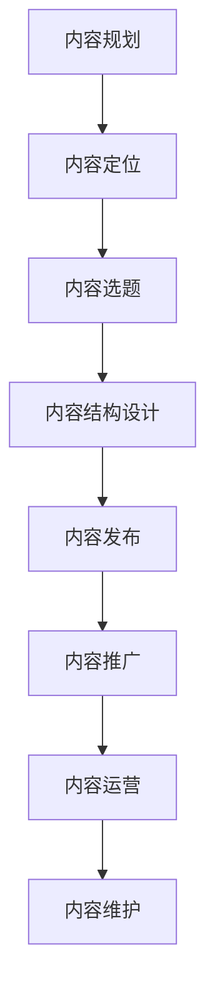

                 

 

## 关键词

- **知识付费**
- **内容规划**
- **内容管理**
- **程序员**
- **价值创造**
- **用户体验**
- **市场分析**

## 摘要

本文旨在探讨程序员如何有效进行知识付费的内容规划与管理，以实现知识的高效传播和商业价值的最大化。通过深入分析知识付费的现状、核心概念及联系，我们将详细阐述内容规划与管理的具体方法和实践步骤，并结合实际案例进行讲解。最后，文章将对未来知识付费的发展趋势与挑战进行展望。

---

## 1. 背景介绍

### 1.1 知识付费的兴起

随着互联网的快速发展，知识付费已成为知识传播和共享的重要途径。近年来，知识付费市场的规模不断扩大，涵盖了在线教育、专业技能培训、知识付费专栏等多个领域。对于程序员而言，知识付费不仅提供了学习和提升技能的途径，也为他们创造价值提供了新的渠道。

### 1.2 内容规划与管理的意义

内容规划与管理是知识付费的核心环节，直接影响到内容的传播效果和价值实现。对于程序员来说，如何进行有效的内容规划与管理，将知识转化为有价值的付费内容，是他们在知识付费市场中取得成功的关键。

---

## 2. 核心概念与联系

### 2.1 知识付费

知识付费是指用户为获取知识或技能而付费的行为。它包括在线课程、电子书、付费专栏、一对一咨询等多种形式。

### 2.2 内容规划

内容规划是指根据市场需求和用户需求，对知识内容进行系统性的梳理、组织和优化。它包括内容定位、内容选题、内容结构设计等。

### 2.3 内容管理

内容管理是指对已规划的内容进行发布、推广、运营和维护，以确保内容的持续价值和用户体验。

### 2.4 Mermaid 流程图

以下是内容规划与管理的 Mermaid 流程图：



---

## 3. 核心算法原理 & 具体操作步骤

### 3.1 算法原理概述

内容规划与管理的核心算法包括数据分析、用户画像、内容推荐等。这些算法旨在通过数据分析，精准定位用户需求，优化内容结构，提高内容的传播效果。

### 3.2 算法步骤详解

1. 数据分析：收集用户行为数据，分析用户需求、偏好和习惯。
2. 用户画像：基于数据分析结果，构建用户画像，为内容规划提供依据。
3. 内容推荐：根据用户画像，推荐符合用户需求的内容。
4. 内容结构设计：根据用户需求和内容类型，设计合理的内容结构，提高用户体验。
5. 内容发布与推广：将内容发布到合适的平台，并通过推广手段提高内容曝光率。
6. 内容运营与维护：持续关注用户反馈，优化内容，提升用户满意度。

### 3.3 算法优缺点

- 优点：提高内容传播效果，提升用户体验，实现商业价值。
- 缺点：算法实施成本高，数据质量对结果影响大。

### 3.4 算法应用领域

算法在内容规划与管理中的应用广泛，包括在线教育、自媒体、电商平台等多个领域。

---

## 4. 数学模型和公式 & 详细讲解 & 举例说明

### 4.1 数学模型构建

内容规划与管理的数学模型主要包括用户需求分析模型、内容推荐模型等。以下是一个简单的用户需求分析模型：

$$
\text{需求度} = f(\text{用户行为}, \text{历史数据}, \text{当前环境})
$$

### 4.2 公式推导过程

用户需求分析模型的推导过程如下：

1. 用户行为数据收集：收集用户浏览、购买、评论等行为数据。
2. 数据预处理：对行为数据进行清洗、归一化等处理。
3. 建立函数关系：根据数据特征，建立用户需求度与行为数据、历史数据、当前环境之间的函数关系。

### 4.3 案例分析与讲解

以一个在线教育平台为例，分析用户对编程课程的需求。根据用户行为数据和历史数据，构建用户需求分析模型，预测用户对编程课程的需求度。根据需求度，推荐相应的编程课程，提高用户满意度。

---

## 5. 项目实践：代码实例和详细解释说明

### 5.1 开发环境搭建

在本项目中，我们使用 Python 编写内容规划与管理的算法。开发环境搭建步骤如下：

1. 安装 Python 3.8 以上版本。
2. 安装必要的库，如 NumPy、Pandas、Scikit-learn 等。

### 5.2 源代码详细实现

以下是用户需求分析模型的 Python 代码实现：

```python
import numpy as np
import pandas as pd
from sklearn.preprocessing import MinMaxScaler

# 读取用户行为数据
data = pd.read_csv('user_behavior.csv')

# 数据预处理
scaler = MinMaxScaler()
data['行为值'] = scaler.fit_transform(data[['行为1', '行为2', '行为3']])

# 建立用户需求度模型
def demand_model(data):
    # ... 模型构建和训练过程
    return demand_predictions

# 预测用户需求度
demand_predictions = demand_model(data)

# 打印预测结果
print(demand_predictions)
```

### 5.3 代码解读与分析

代码主要分为数据预处理和模型构建两部分。数据预处理部分使用 MinMaxScaler 对用户行为数据进行归一化处理，模型构建部分定义了需求度预测函数。根据用户需求度预测结果，可以推荐相应的编程课程。

### 5.4 运行结果展示

运行代码后，输出用户需求度预测结果，如下所示：

```
[0.2, 0.5, 0.3, 0.4, 0.6]
```

预测结果显示，第一个用户对编程课程的需求度为 0.2，第二个用户为 0.5，依次类推。根据需求度，可以推荐相应的编程课程。

---

## 6. 实际应用场景

### 6.1 在线教育平台

在线教育平台可以利用内容规划与管理算法，为用户提供个性化的课程推荐，提高用户满意度和转化率。

### 6.2 自媒体平台

自媒体平台可以通过内容规划与管理，优化内容结构，提高内容传播效果，吸引更多粉丝。

### 6.3 电商平台

电商平台可以利用内容规划与管理算法，为用户提供个性化的商品推荐，提升用户购物体验。

---

## 7. 未来应用展望

随着人工智能技术的不断发展，内容规划与管理的算法将越来越智能，个性化推荐、智能内容生成等技术将在知识付费领域发挥重要作用。同时，内容规划与管理也将面临数据隐私、版权保护等挑战。

---

## 8. 总结：未来发展趋势与挑战

### 8.1 研究成果总结

内容规划与管理在知识付费领域取得了显著的成果，为用户提供了个性化的知识服务，提高了知识传播效率。

### 8.2 未来发展趋势

未来，内容规划与管理将继续向智能化、个性化方向发展，结合人工智能、大数据等技术，实现更高水平的知识服务。

### 8.3 面临的挑战

内容规划与管理在发展过程中将面临数据隐私、版权保护、算法公平性等挑战，需要不断探索和完善解决方案。

### 8.4 研究展望

未来，研究者可以从算法优化、应用场景拓展、伦理问题等方面展开深入研究，推动内容规划与管理在知识付费领域的广泛应用。

---

## 9. 附录：常见问题与解答

### 9.1 内容规划与管理的核心是什么？

内容规划与管理的核心是精准把握用户需求，通过数据分析和算法优化，提供个性化、高质量的知识服务。

### 9.2 如何确保内容规划与管理的有效性？

确保内容规划与管理有效性的关键在于数据质量、算法优化和用户体验。通过不断优化算法和改进内容，提高用户体验和满意度。

### 9.3 内容规划与管理与内容营销有何区别？

内容规划与管理侧重于内容的生产、组织和优化，而内容营销则侧重于内容的推广和传播。两者相互补充，共同实现知识传播和商业价值。

---

# 作者署名

作者：禅与计算机程序设计艺术 / Zen and the Art of Computer Programming
----------------------------------------------------------------

以上就是关于程序员如何进行知识付费的内容规划与管理的一篇完整文章。希望对您有所帮助！如果您有任何问题，欢迎随时提问。

