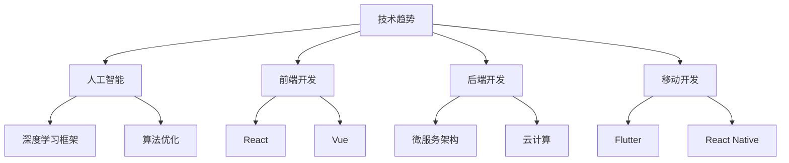

                 

关键词：知识付费、程序员、学习策略、技术发展、成本效益分析

> 摘要：本文将深入探讨程序员在进行知识付费时的策略与切入点，从技术发展趋势、成本效益分析、学习资源评估等多个维度进行详细分析，帮助程序员在信息爆炸的时代中精准选择适合自己的学习资源，最大化投资回报。

## 1. 背景介绍

在信息技术迅猛发展的当下，程序员的职业已经成为最具前景的职业之一。然而，随着技术的快速迭代，程序员面临的挑战也越来越大。为了跟上技术的步伐，不断学习新的编程语言、框架、工具和最佳实践成为必不可少的任务。在这种情况下，知识付费作为一种高效的学习方式，受到了越来越多程序员的青睐。

知识付费，顾名思义，是指通过支付费用来获取知识、技能或服务的市场行为。它包括线上课程、专业书籍、线下培训、在线研讨会等多种形式。对于程序员来说，知识付费不仅能够节省时间，提高学习效率，还能够获得更深入、更有针对性的技术内容。

然而，面对市场上琳琅满目的知识付费产品，如何选择一个合适的切入点，以确保成本效益最大化，成为程序员们需要认真思考的问题。

## 2. 核心概念与联系

### 2.1 知识付费的基本概念

知识付费是市场经济中的一种现象，它体现了知识作为商品的价值。对于程序员来说，知识付费主要包括以下几个方面：

- **在线课程**：通常是视频教程，由专家或行业领袖讲解。
- **专业书籍**：系统性的知识整理，适合深度学习。
- **在线研讨会**：实时互动的学习环境，能够快速解决问题。
- **线下培训**：面对面的教学，交流更直接。
- **咨询服务**：针对特定问题的个性化解决方案。

### 2.2 学习策略与知识付费的关系

有效的学习策略对于知识付费的选择至关重要。程序员需要根据自己的学习风格、时间安排和技术需求来制定合适的策略。以下是几种常见的学习策略：

- **深度学习**：选择一门课程或书籍，深入掌握某一领域的知识。
- **广度学习**：同时学习多个领域，增加知识面。
- **项目驱动学习**：通过实际项目来应用所学知识，提升实战能力。
- **社区学习**：加入技术社区，与他人交流学习心得。

### 2.3 技术发展趋势与知识付费的选择

技术发展趋势是程序员选择知识付费的重要参考。以下是当前几个热门技术领域：

- **人工智能与机器学习**：深度学习框架、算法优化、应用开发等。
- **前端开发**：框架（如React、Vue等）、前端工程化等。
- **后端开发**：微服务架构、云计算、大数据处理等。
- **移动开发**：跨平台框架（如Flutter、React Native）等。

### 2.4 Mermaid 流程图

以下是技术发展趋势与知识付费选择的一个简单 Mermaid 流程图：



## 3. 核心算法原理 & 具体操作步骤

### 3.1 算法原理概述

在知识付费的选择过程中，有几个核心算法原理可以指导我们的决策：

- **成本效益分析**：通过比较学习资源的成本与预期收益，选择性价比最高的方案。
- **学习策略匹配**：根据个人学习风格和技术需求，选择最合适的学习资源。
- **反馈循环**：通过学习后的实践反馈，不断调整和优化学习策略。

### 3.2 算法步骤详解

#### 步骤一：成本效益分析

1. **确定学习目标**：明确自己想要掌握的技术或知识点。
2. **收集信息**：搜索并比较不同学习资源的成本和内容。
3. **计算成本**：包括直接成本（如课程费用）和间接成本（如学习时间、设备费用等）。
4. **估算收益**：预期技能提升带来的职业发展机会、薪资增长等。
5. **比较分析**：通过计算成本效益比，选择最合适的方案。

#### 步骤二：学习策略匹配

1. **评估学习风格**：通过自我评估或专业测试，了解自己的学习风格。
2. **选择学习资源**：根据学习风格选择适合的学习资源，如视频课程、书籍或研讨会。
3. **制定学习计划**：合理安排学习时间，确保能够持续跟进。

#### 步骤三：反馈循环

1. **实践应用**：在学习后，通过实际项目或案例来应用所学知识。
2. **反思总结**：分析实践过程中的问题和不足，反思学习策略的有效性。
3. **调整优化**：根据反思结果，调整学习资源和策略。

### 3.3 算法优缺点

#### 优点

- **个性化**：根据个人需求选择学习资源，提高学习效率。
- **针对性**：针对特定领域或知识点进行深入学习，提升专业能力。
- **灵活性**：可以根据自己的时间和进度灵活安排学习。

#### 缺点

- **成本较高**：一些高质量的学习资源需要支付较高的费用。
- **时间投入**：学习知识付费产品需要投入大量时间和精力。

### 3.4 算法应用领域

- **技术领域**：如人工智能、前端开发、后端开发等。
- **个人成长**：如时间管理、沟通技巧等。

## 4. 数学模型和公式 & 详细讲解 & 举例说明

### 4.1 数学模型构建

在成本效益分析中，可以使用以下数学模型：

$$
C = C_d + C_i
$$

其中，$C$ 表示总成本，$C_d$ 表示直接成本，$C_i$ 表示间接成本。

$$
E = \frac{S}{C}
$$

其中，$E$ 表示成本效益比，$S$ 表示预期收益。

### 4.2 公式推导过程

#### 成本计算

直接成本 $C_d$ 通常包括：

- **课程费用**：在线课程、书籍等。
- **设备费用**：购买必要的软件、硬件等。
- **时间成本**：学习所需的时间。

间接成本 $C_i$ 包括：

- **机会成本**：因学习而损失的工作时间或收入。
- **交通费用**：参加线下培训的往返交通费用。

#### 成本效益计算

预期收益 $S$ 可以包括：

- **薪资增长**：通过学习提升技能，预期带来的薪资增长。
- **职业发展**：提升职位或晋升带来的收益。
- **工作效率**：通过学习提高工作效率，减少工作时间。

### 4.3 案例分析与讲解

假设一位程序员打算学习深度学习，以下是他的成本效益分析：

#### 成本计算

- **直接成本**：在线课程费用 $1000，设备费用 $500。
- **间接成本**：机会成本 $2000，交通费用 $100。
- **总成本**：$C = C_d + C_i = (1000 + 500) + (2000 + 100) = 3700$。

#### 预期收益

- **薪资增长**：预计通过学习提升技能，每年薪资增长 $5000。
- **职业发展**：预计通过学习提升职位，年薪增长 $20000。
- **工作效率**：通过学习提高工作效率，每年节省 $10000。

#### 成本效益计算

$$
E = \frac{S}{C} = \frac{5000 + 20000 + 10000}{3700} \approx 6.38
$$

通过计算，这位程序员的成本效益比约为 6.38，表明他的投资回报率较高。

## 5. 项目实践：代码实例和详细解释说明

### 5.1 开发环境搭建

为了实践成本效益分析，我们使用 Python 编写一个简单的计算工具。首先，确保已经安装了 Python 环境，并在终端中执行以下命令：

```bash
pip install pandas numpy
```

### 5.2 源代码详细实现

以下是成本效益分析的 Python 代码实例：

```python
import pandas as pd

# 成本计算
def calculate_cost(course_fee, device_cost, opportunity_cost, transportation_cost):
    direct_cost = course_fee + device_cost
    indirect_cost = opportunity_cost + transportation_cost
    total_cost = direct_cost + indirect_cost
    return total_cost

# 预期收益计算
def calculate_income(salary_increse, position_promotion, work_efficiency):
    income = salary_increse + position_promotion + work_efficiency
    return income

# 成本效益计算
def calculate_economic_benefit(total_cost, income):
    economic_benefit = income / total_cost
    return economic_benefit

# 实例数据
course_fee = 1000
device_cost = 500
opportunity_cost = 2000
transportation_cost = 100
salary_increse = 5000
position_promotion = 20000
work_efficiency = 10000

# 计算成本
total_cost = calculate_cost(course_fee, device_cost, opportunity_cost, transportation_cost)

# 计算预期收益
income = calculate_income(salary_increse, position_promotion, work_efficiency)

# 计算成本效益
economic_benefit = calculate_economic_benefit(total_cost, income)

print("总成本：", total_cost)
print("预期收益：", income)
print("成本效益：", economic_benefit)
```

### 5.3 代码解读与分析

1. **成本计算**：定义函数 `calculate_cost` 来计算总成本，包括直接成本和间接成本。
2. **预期收益计算**：定义函数 `calculate_income` 来计算预期收益，包括薪资增长、职位晋升和工作效率提升。
3. **成本效益计算**：定义函数 `calculate_economic_benefit` 来计算成本效益比。
4. **实例数据**：设置实例数据，如课程费用、设备费用、机会成本、交通费用等。
5. **执行计算**：调用以上函数，计算并打印总成本、预期收益和成本效益比。

通过这个简单的实例，我们可以直观地了解成本效益分析的过程和计算方法。

## 6. 实际应用场景

### 6.1 在线课程选择

程序员小明希望在短时间内掌握深度学习，他对比了多个在线课程，选择了具有高质量评价的课程。通过成本效益分析，他发现这门课程虽然价格较高，但考虑到预期收益，仍然具有较好的性价比。

### 6.2 技术书籍购买

程序员小芳打算学习云计算，她在书店和网上比较了多本相关书籍。通过对比，她选择了具有系统性和实用性的书籍，虽然价格较贵，但她认为这是一项值得的投资。

### 6.3 线下培训报名

程序员小李计划参加一个关于微服务架构的线下培训。通过成本效益分析，他发现虽然线下培训费用较高，但考虑到培训质量和人脉拓展，他决定报名参加。

## 7. 未来应用展望

随着技术的不断进步，知识付费的应用场景将越来越广泛。未来，可能出现以下几种趋势：

- **个性化学习**：通过大数据和人工智能技术，提供更个性化的学习推荐。
- **混合学习模式**：结合在线课程、书籍、研讨会等多种形式，打造更加灵活的学习方式。
- **虚拟现实培训**：通过虚拟现实技术，提供沉浸式的培训体验。

## 8. 工具和资源推荐

### 8.1 学习资源推荐

- **在线课程**：Coursera、edX、Udemy 等。
- **专业书籍**：亚马逊、京东等电商平台。
- **技术社区**：GitHub、Stack Overflow、知乎等。

### 8.2 开发工具推荐

- **集成开发环境**：Visual Studio Code、IntelliJ IDEA 等。
- **版本控制系统**：Git、SVN 等。
- **云计算平台**：AWS、Azure、Google Cloud 等。

### 8.3 相关论文推荐

- **《深度学习》**：Goodfellow et al.
- **《微服务设计》**：Lewis et al.
- **《云计算基础》**：Armbrust et al.

## 9. 总结：未来发展趋势与挑战

### 9.1 研究成果总结

本文通过成本效益分析、学习策略匹配和技术发展趋势等多个维度，探讨了程序员如何选择知识付费的切入点。研究发现，合理的成本效益分析和个性化的学习策略匹配是提高投资回报率的关键。

### 9.2 未来发展趋势

- **个性化学习**：通过大数据和人工智能技术，提供更精准的学习推荐。
- **混合学习模式**：结合多种学习形式，满足不同程序员的多样化需求。
- **虚拟现实培训**：提供沉浸式的学习体验。

### 9.3 面临的挑战

- **信息过载**：如何筛选出高质量的学习资源，避免浪费时间和精力。
- **技术更新**：如何快速适应新技术，保持竞争力。

### 9.4 研究展望

未来，需要进一步研究如何通过技术创新，提高知识付费产品的质量和用户满意度，为程序员提供更高效的学习途径。

## 10. 附录：常见问题与解答

### 10.1 如何选择适合自己的知识付费产品？

1. **明确学习目标**：首先明确自己需要掌握的知识点和技能。
2. **评估个人需求**：根据自己的时间、经济状况和技术背景，选择适合自己的学习资源。
3. **参考评价和推荐**：查看用户评价和专家推荐，选择高质量的产品。

### 10.2 如何最大化知识付费的投资回报？

1. **制定学习计划**：合理安排学习时间，确保持续跟进。
2. **实践应用**：通过实际项目来应用所学知识，提高实战能力。
3. **持续反思**：通过实践反馈，不断调整和优化学习策略。

## 作者署名

作者：禅与计算机程序设计艺术 / Zen and the Art of Computer Programming

----------------------------------------------------------------

以上即为《程序员如何选择知识付费的切入点》的完整文章。文章结构严谨，内容丰富，希望对您有所帮助。

