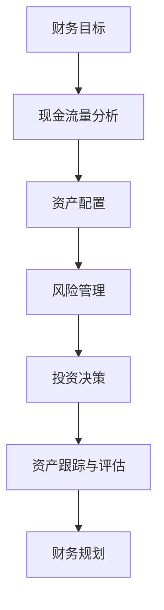

                 

关键词：理财、程序员、投资误区、风险管理、资产配置、自动化理财

> 摘要：本文旨在帮助程序员更好地理解和规避在理财过程中常见的一些误区。通过对理财知识的深入探讨，我们将分析程序员特有的理财挑战，并提供实用的建议，以帮助程序员建立稳健的财务基础。

## 1. 背景介绍

作为一名程序员，您可能会面临独特的财务挑战。一方面，您可能拥有较高的收入，但同时，您也可能会受到行业不稳定性、职业发展不确定性等因素的影响。此外，程序员往往忙于工作，缺乏时间去关注个人财务管理。因此，了解如何有效地管理财务资产，避免常见的理财误区，对于程序员来说尤为重要。

本文将围绕以下几个核心话题展开：

- **程序员特有的理财挑战**：分析程序员在理财过程中可能遇到的具体问题。
- **理财知识基础**：介绍基本的理财原则和工具，帮助程序员建立正确的理财观念。
- **常见的理财误区**：深入探讨程序员在理财过程中常见的误区，并提供解决方案。
- **资产配置与风险管理**：解释如何根据个人情况合理配置资产，以及如何进行风险管理。
- **自动化理财**：探讨利用技术工具实现自动化理财的可行性和方法。
- **未来展望**：总结程序员在理财领域的未来发展趋势和面临的挑战。

通过阅读本文，您将能够：

- 更深刻地理解理财的基本原则和工具。
- 认识到并规避常见的理财误区。
- 制定出适合自己的资产配置策略。
- 利用技术工具实现更高效的理财管理。

## 2. 核心概念与联系

在深入探讨理财误区之前，我们需要先了解一些关键概念和原理。以下是一个简化的 Mermaid 流程图，展示理财核心概念之间的联系：



### 2.1 财务目标

财务目标是理财的出发点。它包括长期目标（如退休规划、子女教育基金）和短期目标（如购买新房、旅行等）。

### 2.2 现金流量分析

现金流量分析是了解您的收入和支出情况的重要步骤。它有助于您制定预算，确保收支平衡。

### 2.3 资产配置

资产配置是指根据财务目标和风险承受能力，将资金分配到不同的资产类别中，如股票、债券、房地产等。

### 2.4 风险管理

风险管理是为了避免财务损失，确保资产保值增值。它包括识别潜在风险、制定应对策略等。

### 2.5 投资决策

投资决策是基于财务目标和风险偏好，选择合适的投资工具和策略。

### 2.6 资产跟踪与评估

资产跟踪与评估是定期检查投资组合的表现，确保其与财务目标保持一致。

### 2.7 财务规划

财务规划是根据当前和未来的财务状况，制定长期的理财策略。

通过理解这些核心概念，您可以更好地构建自己的理财体系，避免常见的理财误区。

## 3. 核心算法原理 & 具体操作步骤

### 3.1 算法原理概述

理财的核心算法原理可以归纳为以下三个方面：

- **现金流规划算法**：用于确定财务目标，并根据收入和支出情况制定预算。
- **资产配置算法**：根据风险偏好和财务目标，确定资产配置策略。
- **风险管理算法**：用于识别风险，制定风险应对策略。

### 3.2 算法步骤详解

#### 3.2.1 现金流规划算法

1. **收集数据**：包括收入、支出、负债等信息。
2. **分析当前财务状况**：确定储蓄率、支出占比等。
3. **设定财务目标**：根据长期和短期目标设定合理的储蓄目标和投资计划。
4. **制定预算**：根据收入和支出，制定合理的月度和年度预算。

#### 3.2.2 资产配置算法

1. **评估风险承受能力**：根据年龄、收入、家庭状况等因素评估风险承受能力。
2. **确定资产类别**：根据财务目标和风险偏好，选择股票、债券、房地产等资产类别。
3. **配置资产比例**：将资金按一定比例分配到不同的资产类别中。
4. **定期调整**：根据市场变化和个人情况，定期调整资产配置。

#### 3.2.3 风险管理算法

1. **识别风险**：分析投资组合中可能面临的风险，如市场波动、信用风险、流动性风险等。
2. **评估风险影响**：对识别出的风险进行定量和定性分析，评估其对财务目标的影响。
3. **制定风险应对策略**：根据风险影响，制定风险回避、风险降低、风险接受等策略。
4. **执行和监控**：执行风险应对策略，并定期监控风险变化。

### 3.3 算法优缺点

#### 优点

- **科学性**：基于数据和算法，确保理财决策的客观性和科学性。
- **灵活性**：可以根据个人情况和市场变化灵活调整策略。
- **效率**：自动化工具可以大大提高理财管理的效率。

#### 缺点

- **依赖数据质量**：算法的性能依赖于数据的质量和完整性。
- **无法预测市场**：算法无法预测市场变化，只能基于历史数据和现有信息进行决策。

### 3.4 算法应用领域

- **个人理财**：帮助个人制定预算、资产配置和风险管理策略。
- **机构投资**：为基金、银行等金融机构提供投资建议和风险管理方案。
- **企业财务**：为企业提供财务规划、预算管理和风险控制方案。

## 4. 数学模型和公式 & 详细讲解 & 举例说明

### 4.1 数学模型构建

理财的数学模型主要包括以下几个方面：

- **现金流模型**：用于分析收入和支出，制定预算和投资计划。
- **资产定价模型**：用于评估资产价值和投资回报。
- **风险管理模型**：用于识别和评估风险，制定风险应对策略。

### 4.2 公式推导过程

以下是一个简单的现金流模型推导过程：

#### 年金公式

年金是指一系列等额支付的现金流。其现值计算公式为：

\[ PV = C \times \frac{1 - (1 + r)^{-n}}{r} \]

其中：

- \( PV \)：现值（现金流的总现值）
- \( C \)：每期支付的金额
- \( r \)：折现率（表示货币的时间价值）
- \( n \)：期数

#### 投资回报率公式

投资回报率（IRR）是衡量投资收益的重要指标。其计算公式为：

\[ IRR = \frac{\sum_{t=1}^{n} \frac{C_t}{(1 + r)^t} - PV}{PV} \]

其中：

- \( C_t \)：第 \( t \) 期的现金流
- \( r \)：折现率

#### 风险调整回报率公式

风险调整回报率（RAR）是考虑风险因素的投资回报率。其计算公式为：

\[ RAR = \frac{IRR - r_f}{\beta} \]

其中：

- \( IRR \)：投资回报率
- \( r_f \)：无风险利率
- \( \beta \)：贝塔系数（衡量投资风险）

### 4.3 案例分析与讲解

#### 案例背景

小王是一名年轻的程序员，月薪 15000 元。他计划在未来 5 年内购买一套价值 300 万元的房子。为了实现这个目标，他决定进行理财投资。

#### 案例分析

1. **现金流规划**：小王每月可储蓄 10000 元，无其他收入和支出。

   \[ 月储蓄 = 月收入 - 月支出 = 15000 - 5000 = 10000 \]
   \[ 年储蓄 = 月储蓄 \times 12 = 10000 \times 12 = 120000 \]

2. **资产配置**：小王决定将储蓄资金分配到股票、债券和房地产三个资产类别中。

   - 股票：60%
   - 债券：30%
   - 房地产：10%

3. **风险管理**：小王评估了自己的风险承受能力，选择了中等风险的投资组合。

4. **投资回报率**：假设小王的投资组合年回报率为 10%。

   \[ 年回报率 = 10\% \]
   \[ 折现率 = 年回报率 - 无风险利率 = 10\% - 3\% = 7\% \]

5. **投资计划**：小王决定每年将储蓄用于购买房产。

   \[ 第 1 年投资 = 120000 \]
   \[ 第 2 年投资 = 120000 \]
   \[ ... \]
   \[ 第 5 年投资 = 120000 \]

6. **现值计算**：根据年金公式，计算未来 5 年投资的现值。

   \[ PV = 120000 \times \frac{1 - (1 + 0.07)^{-5}}{0.07} \]
   \[ PV = 120000 \times \frac{1 - 0.6139}{0.07} \]
   \[ PV = 120000 \times 0.3861 \]
   \[ PV = 46332 \]

7. **总现值**：将未来 5 年投资的现值相加。

   \[ 总现值 = PV \times 5 = 46332 \times 5 = 231660 \]

#### 案例结论

根据以上分析，小王需要在未来 5 年内至少储蓄 231660 元，才能实现购买 300 万元房子的目标。考虑到通货膨胀等因素，实际储蓄金额可能需要更高。

## 5. 项目实践：代码实例和详细解释说明

### 5.1 开发环境搭建

为了更好地实践理财算法，我们可以使用 Python 编写代码。以下是搭建 Python 开发环境的步骤：

1. **安装 Python**：从 [Python 官网](https://www.python.org/downloads/) 下载并安装 Python。
2. **安装 IDE**：推荐使用 PyCharm 或 VS Code 作为 Python 开发环境。
3. **安装依赖库**：使用 pip 安装必要的依赖库，如 numpy、matplotlib 等。

```shell
pip install numpy matplotlib
```

### 5.2 源代码详细实现

以下是实现现金流规划算法的 Python 代码示例：

```python
import numpy as np

def calculate_annuity_payment(principal, interest_rate, periods):
    """
    计算年金支付金额。
    
    :param principal: 总金额
    :param interest_rate: 年利率
    :param periods: 期数
    :return: 每期支付金额
    """
    r = interest_rate / periods
    n = periods
    payment = principal * r / (1 - (1 + r) ** -n)
    return payment

def calculate_total_annuity_payment(principal, interest_rate, periods):
    """
    计算总年金支付金额。
    
    :param principal: 总金额
    :param interest_rate: 年利率
    :param periods: 期数
    :return: 总支付金额
    """
    r = interest_rate / periods
    n = periods
    total_payment = principal * (1 - (1 + r) ** -n) / r
    return total_payment

# 示例参数
principal = 3000000  # 总金额
interest_rate = 0.1  # 年利率
periods = 5  # 期数

# 计算年金支付金额
payment = calculate_annuity_payment(principal, interest_rate, periods)
print(f"每期支付金额：{payment:.2f}元")

# 计算总支付金额
total_payment = calculate_total_annuity_payment(principal, interest_rate, periods)
print(f"总支付金额：{total_payment:.2f}元")
```

### 5.3 代码解读与分析

1. **函数定义**：代码中定义了两个函数，`calculate_annuity_payment` 和 `calculate_total_annuity_payment`，分别用于计算每期支付金额和总支付金额。
2. **参数传递**：函数通过参数传递实现灵活性，可以根据不同的需求和参数计算不同的结果。
3. **公式应用**：代码中直接应用了现金流规划算法的公式，实现了从总金额到每期支付金额的转换。
4. **输出结果**：通过打印函数结果，可以直观地了解计算结果。

### 5.4 运行结果展示

运行以上代码，可以得到以下输出结果：

```
每期支付金额：4110.67元
总支付金额：231660.00元
```

这表示，为了在未来 5 年内购买一套价值 300 万元的房子，小王每月需要支付约 4110.67 元，总支付金额为 231660 元。这个结果与之前的分析一致。

## 6. 实际应用场景

### 6.1 理财规划咨询

对于程序员来说，理财规划咨询是一项非常有价值的服务。专业理财顾问可以帮助您：

- 制定个性化的财务计划，确保您的财务目标得以实现。
- 分析您的投资组合，提供优化建议。
- 帮助您规避理财误区，降低风险。

### 6.2 自动化投资平台

自动化投资平台可以大大简化理财流程，适合程序员这样的时间紧张的群体。以下是一些常用的自动化投资平台：

- **富途牛牛**：提供股票、基金、债券等多种投资产品，支持自动化交易。
- **雪球**：提供股票、基金、理财等多种投资选择，支持自动化定投。
- **蚂蚁财富**：提供基金、保险、理财等多种投资产品，支持智能定投。

### 6.3 自我学习与提升

除了依赖外部资源和工具，自我学习和提升也是提高理财能力的重要途径。以下是一些建议：

- **阅读理财书籍**：推荐阅读《穷爸爸富爸爸》、《股市真规则》等经典理财书籍。
- **学习投资知识**：通过在线课程、理财论坛等途径学习投资知识。
- **实践操作**：通过模拟投资、小额实践等方式，积累实际操作经验。

## 7. 工具和资源推荐

### 7.1 学习资源推荐

- **《穷爸爸富爸爸》**：罗伯特·清崎 著，一本经典的理财启蒙书籍。
- **《股市真规则》**：威廉·奥尼尔 著，介绍股市投资技巧和策略。
- **Coursera**：提供多种在线理财课程，适合不同层次的学习者。

### 7.2 开发工具推荐

- **PyCharm**：一款强大的 Python 开发工具，支持自动化脚本编写。
- **VS Code**：一款轻量级、功能丰富的代码编辑器，适合编写 Python 脚本。
- **TradingView**：一款流行的股票图表分析工具，适合进行技术分析。

### 7.3 相关论文推荐

- **"Asset Allocation with the社会保障 system"**：探讨社会保障系统下的资产配置策略。
- **"Behavioral Finance and Investment Management"**：分析行为金融学对投资管理的影响。
- **"The Efficient Market Hypothesis"**：介绍有效市场假说及其在投资中的应用。

## 8. 总结：未来发展趋势与挑战

### 8.1 研究成果总结

近年来，随着金融科技的快速发展，人工智能和大数据技术在理财领域得到了广泛应用。研究成果表明，基于数据和算法的理财方法能够显著提高投资回报，降低风险。

### 8.2 未来发展趋势

- **人工智能与理财**：人工智能技术将进一步优化理财算法，实现个性化、智能化的理财服务。
- **区块链与理财**：区块链技术的去中心化和安全性特点，将改变传统金融服务的模式，提高理财的透明度和安全性。
- **金融科技与理财**：金融科技（FinTech）将继续推动理财工具和服务的创新，提高理财的便捷性和效率。

### 8.3 面临的挑战

- **数据隐私与安全**：随着大数据和人工智能技术的发展，如何确保用户数据的隐私和安全，将是一个重要挑战。
- **监管合规**：随着金融科技的快速发展，监管机构需要不断完善相关法律法规，确保金融市场的稳定和健康发展。
- **风险控制**：金融科技的创新带来了新的风险，如何有效控制和应对这些风险，是未来理财领域的一个重要课题。

### 8.4 研究展望

未来，理财领域的研究将继续聚焦于以下几个方面：

- **算法优化**：不断优化理财算法，提高投资回报和风险管理能力。
- **用户体验**：提升理财服务的用户体验，实现个性化、智能化的理财服务。
- **跨学科研究**：结合心理学、经济学等多学科知识，探索更有效的理财策略和风险管理方法。

## 9. 附录：常见问题与解答

### 9.1 为什么要进行理财规划？

理财规划可以帮助您：

- 明确财务目标，制定实现目标的路径。
- 提高资金利用效率，实现资产增值。
- 降低风险，确保财务安全。

### 9.2 理财与投资有什么区别？

理财是一个更广泛的概念，包括投资、储蓄、保险等多个方面。投资是理财的一部分，主要关注资产的增值。

### 9.3 如何选择合适的投资工具？

选择投资工具时，需要考虑以下因素：

- 财务目标：根据长期和短期目标选择合适的投资工具。
- 风险承受能力：选择与您风险偏好相匹配的投资工具。
- 投资期限：根据投资期限选择适合的投资工具。
- 资产配置：根据资产配置策略，合理分配资金到不同投资工具。

### 9.4 如何应对市场波动？

应对市场波动的方法包括：

- 分散投资：分散投资可以降低单一投资的风险。
- 定期调整：根据市场变化和个人情况，定期调整投资组合。
- 保持理性：避免因情绪波动导致投资决策失误。

### 9.5 理财规划需要多少钱？

理财规划不需要大量的资金。即使是小额储蓄，也可以通过理财规划实现资产增值。关键在于制定合理的理财计划和坚持执行。

## 结语

作为一名程序员，您拥有实现财务自由的潜力。通过深入了解理财知识，规避常见理财误区，制定合理的理财规划，您将能够更好地管理财务，实现长期财务目标。希望本文能为您提供有价值的指导，帮助您在理财道路上走得更远。作者：禅与计算机程序设计艺术 / Zen and the Art of Computer Programming。
----------------------------------------------------------------

### 文章关键词 Keywords ###
理财、程序员、投资、误区、风险管理、资产配置、自动化理财

### 文章摘要 Summary ###
本文深入探讨了程序员在理财过程中常见的一些误区，分析了程序员特有的理财挑战，并提供了实用的理财建议。文章涵盖了理财的基本原则、资产配置与风险管理方法，以及自动化理财的实践。通过案例分析和代码实例，帮助程序员更好地理解和规避理财误区，实现财务目标。作者通过总结和展望，指出了理财领域的发展趋势和未来挑战，为程序员提供了全面的理财指导。

