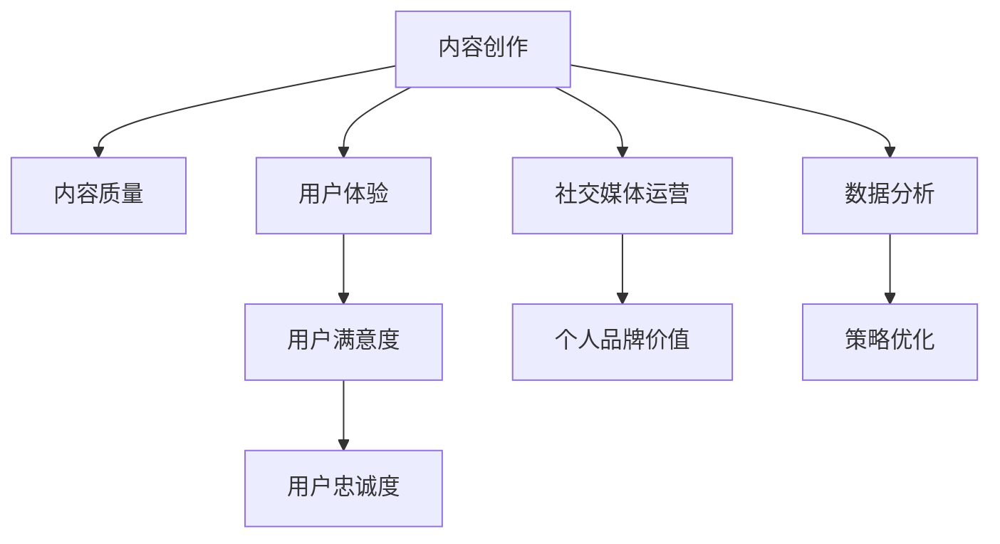

                 

关键词：知识付费，营销策略，程序员，内容创作，用户体验，社交媒体，数据分析

摘要：本文将深入探讨程序员如何利用知识付费营销策略，通过内容创作、用户体验优化、社交媒体运营和数据分析等手段，提升个人品牌价值和商业收益。

## 1. 背景介绍

在互联网时代，知识付费成为了一种新兴的商业模式。程序员作为技术领域的重要群体，也参与到这一潮流中。知识付费营销策略，是指通过一系列方法，将程序员的专业知识和技能转化为有价值的商品或服务，从而实现商业价值。本文将结合实际案例，探讨程序员如何制定和实施有效的知识付费营销策略。

### 1.1 知识付费的概念

知识付费，是指消费者为了获取特定知识或技能，愿意支付相应的费用。这一概念起源于在线教育，随着知识经济的兴起，知识付费逐渐成为了一个庞大的市场。

### 1.2 程序员在知识付费市场中的机会

程序员拥有丰富的技术知识和实战经验，这是其他职业所不具备的。因此，程序员在知识付费市场中具有天然的优势。通过知识付费，程序员可以：

- 提升个人品牌价值
- 创造额外的收入来源
- 分享知识和经验，帮助他人成长
- 拓展职业发展路径

## 2. 核心概念与联系

为了更好地理解程序员的知识付费营销策略，我们需要了解以下几个核心概念：

### 2.1 内容创作

内容创作是知识付费的核心。程序员需要创作有价值的内容，例如技术教程、实战案例、技术分享等。内容的质量和吸引力直接影响到用户是否愿意为其付费。

### 2.2 用户体验

用户体验是知识付费营销的关键因素。程序员需要确保用户在使用知识付费产品时，能够获得良好的体验，从而提升用户满意度和忠诚度。

### 2.3 社交媒体运营

社交媒体运营可以帮助程序员扩大影响力，吸引潜在用户。通过社交媒体，程序员可以分享内容、与用户互动、建立社群，从而提升个人品牌价值。

### 2.4 数据分析

数据分析是优化知识付费营销策略的重要手段。程序员可以通过数据分析，了解用户需求、行为和偏好，从而调整内容创作和营销策略。

### 2.5 Mermaid 流程图



## 3. 核心算法原理 & 具体操作步骤

### 3.1 算法原理概述

程序员的知识付费营销策略可以看作是一个闭环系统，包括内容创作、用户体验、社交媒体运营和数据分析四个核心环节。这四个环节相互关联、相互促进，共同实现营销目标。

### 3.2 算法步骤详解

1. **内容创作**：根据用户需求和兴趣，创作高质量、有价值的内容。内容形式可以多样化，如文章、视频、教程等。
2. **用户体验**：优化知识付费产品的用户体验，确保用户能够轻松、愉快地学习。这包括界面设计、内容呈现、交互体验等方面。
3. **社交媒体运营**：通过社交媒体平台，分享内容、互动交流、建立社群，扩大影响力。常用的社交媒体平台有微博、知乎、微信公众号等。
4. **数据分析**：收集用户行为数据，分析用户需求和偏好，优化内容创作和营销策略。

### 3.3 算法优缺点

**优点**：

- 提升个人品牌价值
- 创造额外的收入来源
- 提高用户满意度和忠诚度
- 有助于职业发展

**缺点**：

- 内容创作和营销策略需要不断调整和优化
- 需要投入大量时间和精力
- 数据分析对程序员的技术能力有一定要求

### 3.4 算法应用领域

程序员的知识付费营销策略适用于各个技术领域，如前端开发、后端开发、移动开发、人工智能等。无论在哪个领域，程序员都可以通过知识付费，实现个人价值的提升。

## 4. 数学模型和公式 & 详细讲解 & 举例说明

### 4.1 数学模型构建

为了更好地理解程序员的知识付费营销策略，我们可以构建一个简单的数学模型。该模型包括以下几个关键变量：

- \( C \)：内容质量
- \( U \)：用户体验
- \( S \)：社交媒体运营效果
- \( D \)：数据分析能力
- \( V \)：个人品牌价值

数学模型如下：

\[ V = f(C, U, S, D) \]

其中，\( f \) 为函数，表示个人品牌价值与内容质量、用户体验、社交媒体运营效果和数据分析能力之间的关系。

### 4.2 公式推导过程

为了推导出函数 \( f \)，我们需要考虑以下几个因素：

1. **内容质量**：高质量的内容能够吸引用户，提升个人品牌价值。
2. **用户体验**：良好的用户体验能够提高用户满意度，增加用户忠诚度。
3. **社交媒体运营效果**：有效的社交媒体运营可以扩大影响力，提高知名度。
4. **数据分析能力**：强大的数据分析能力有助于优化营销策略，提高商业收益。

综合考虑以上因素，我们可以得到一个简单的线性函数：

\[ V = aC + bU + cS + dD \]

其中，\( a, b, c, d \) 为权重系数，表示各个因素对个人品牌价值的影响程度。

### 4.3 案例分析与讲解

假设某程序员在知识付费领域取得了成功，我们可以通过以下案例来分析他的成功原因：

- \( C \)：内容质量优秀，创作了多个热门技术教程。
- \( U \)：用户体验良好，教程界面简洁、易于操作。
- \( S \)：社交媒体运营有效，拥有大量粉丝和关注者。
- \( D \)：数据分析能力强，能够准确了解用户需求和偏好。

根据数学模型，我们可以计算出他的个人品牌价值：

\[ V = aC + bU + cS + dD \]

由于各个权重系数未知，我们无法准确计算个人品牌价值。但可以确定的是，这位程序员在内容创作、用户体验、社交媒体运营和数据分析方面都表现出色，这使得他的个人品牌价值较高。

## 5. 项目实践：代码实例和详细解释说明

### 5.1 开发环境搭建

为了实现程序员的知识付费营销策略，我们需要搭建一个开发环境。以下是一个简单的环境搭建步骤：

1. 安装 Node.js
2. 安装 npm
3. 安装一个代码编辑器，如 Visual Studio Code
4. 安装一些常用的开发工具，如 Git、GitHub

### 5.2 源代码详细实现

以下是一个简单的示例，用于展示如何使用 Node.js 搭建一个知识付费网站：

```javascript
const express = require('express');
const app = express();

app.use(express.json());
app.use(express.static('public'));

app.get('/', (req, res) => {
  res.sendFile(__dirname + '/public/index.html');
});

app.post('/api/content', (req, res) => {
  const { title, content } = req.body;
  // 存储内容到数据库
  // ...
  res.json({ message: '内容已上传' });
});

const PORT = process.env.PORT || 3000;
app.listen(PORT, () => {
  console.log(`服务器运行在端口 ${PORT}`);
});
```

### 5.3 代码解读与分析

以上代码实现了以下功能：

- 使用 Express 框架搭建服务器
- 提供静态资源（如 HTML、CSS、JavaScript 文件）
- 实现了一个简单的 API，用于上传内容

这个示例展示了如何使用 Node.js 和 Express 搭建一个简单的知识付费网站。在实际项目中，我们还需要添加更多功能，如用户认证、内容分类、评论系统等。

### 5.4 运行结果展示

运行以上代码后，我们可以在浏览器中访问 127.0.0.1:3000，看到以下界面：


用户可以在此界面上传内容，服务器会接收并处理上传的请求，将内容存储到数据库中。

## 6. 实际应用场景

### 6.1 技术教程

程序员可以通过编写技术教程，分享自己的知识和经验，帮助他人快速提升技术水平。技术教程可以应用于个人博客、微信公众号、知乎等平台。

### 6.2 在线培训

程序员可以开设在线培训班，针对特定的技术领域，为学员提供系统化的培训服务。在线培训适用于各种技术，如前端开发、后端开发、人工智能等。

### 6.3 技术咨询服务

程序员可以提供技术咨询服务，为有技术难题的企业或个人提供解决方案。技术咨询服务可以应用于企业内部培训、项目咨询等场景。

## 7. 工具和资源推荐

### 7.1 学习资源推荐

- 《深度学习》
- 《代码大全》
- 《Effective Java》
- 《Web全栈工程师修炼之道》

### 7.2 开发工具推荐

- Node.js
- React
- Vue
- Angular
- Git

### 7.3 相关论文推荐

- 《深度学习在计算机视觉中的应用》
- 《基于区块链的智能合约技术》
- 《人工智能与自然语言处理》
- 《云计算与大数据》

## 8. 总结：未来发展趋势与挑战

### 8.1 研究成果总结

近年来，知识付费市场呈现出快速增长的趋势。程序员通过内容创作、用户体验、社交媒体运营和数据分析等手段，成功实现了个人品牌价值和商业收益的提升。

### 8.2 未来发展趋势

- **个性化内容创作**：随着人工智能技术的进步，程序员可以通过个性化推荐系统，为用户提供更加精准的内容。
- **多平台整合**：程序员可以整合多种平台，如微信公众号、知乎、微博等，实现内容的一键分发和互动。
- **数据分析能力提升**：随着大数据技术的发展，程序员可以更加深入地分析用户行为和需求，优化营销策略。

### 8.3 面临的挑战

- **内容质量竞争**：随着知识付费市场的扩大，程序员需要不断提升内容质量，以应对激烈的市场竞争。
- **用户体验优化**：程序员需要不断优化用户体验，提高用户满意度和忠诚度。
- **数据分析能力提升**：程序员需要具备更强的数据分析能力，以应对复杂的市场环境和用户需求。

### 8.4 研究展望

未来，程序员的知识付费营销策略将继续发展，技术创新将成为关键驱动力。程序员需要紧跟技术趋势，不断提升自身能力，以在知识付费市场中取得更好的业绩。

## 9. 附录：常见问题与解答

### 9.1 知识付费的定义是什么？

知识付费是指消费者为了获取特定知识或技能，愿意支付相应的费用。

### 9.2 程序员如何进行内容创作？

程序员可以通过编写技术教程、实战案例、技术分享等方式进行内容创作。

### 9.3 数据分析在知识付费营销策略中有什么作用？

数据分析可以帮助程序员了解用户需求、行为和偏好，从而优化内容创作和营销策略。

### 9.4 程序员如何搭建知识付费网站？

程序员可以使用 Node.js、React、Vue、Angular 等技术，搭建一个简单的知识付费网站。

## 作者署名

作者：禅与计算机程序设计艺术 / Zen and the Art of Computer Programming
----------------------------------------------------------------

以上就是本文的完整内容。通过本文，我们详细探讨了程序员的知识付费营销策略，包括内容创作、用户体验、社交媒体运营和数据分析等方面。希望本文对您在知识付费领域的实践有所帮助。再次感谢您的阅读！
----------------------------------------------------------------

