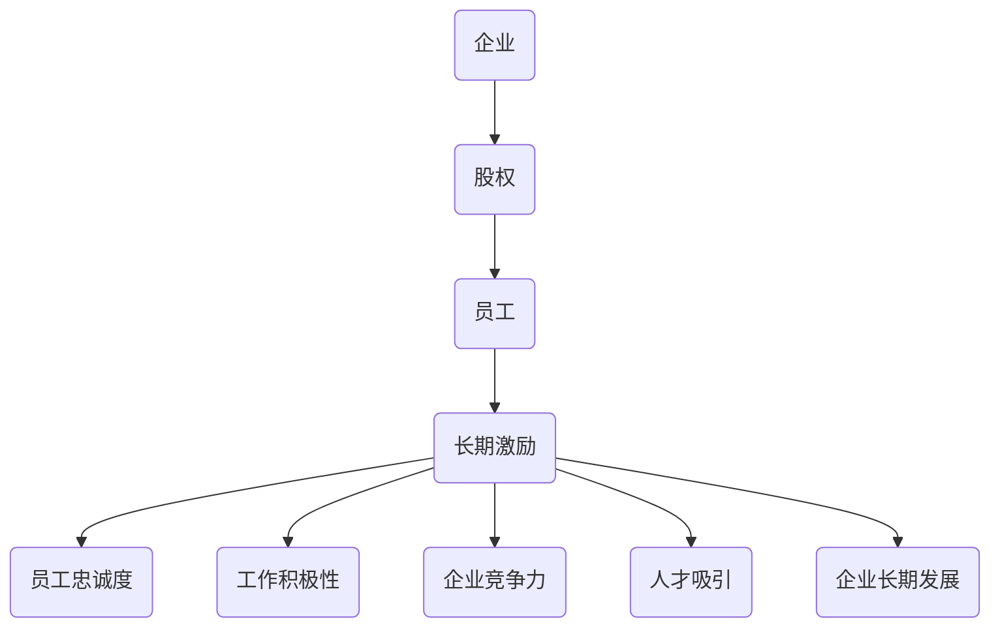

                 

股权激励是现代企业中常见的一种激励机制，对于程序员来说，这种激励方式尤为重要。本文将深入探讨股权激励的基本概念、原理、实施方法和实际应用，帮助程序员更好地理解并利用股权激励，为自己的职业发展铺路。

> **关键词：** 股权激励、程序员、激励制度、企业成长、职业发展

> **摘要：** 本文旨在为程序员提供关于股权激励的全面解析，包括股权激励的定义、重要性、不同类型的股权激励方案、实施步骤以及如何通过股权激励实现个人与企业共赢。通过本文，读者将能够掌握股权激励的核心概念，学会如何评估和参与股权激励计划，并在职业发展中取得更大的成功。

## 1. 背景介绍

股权激励作为一种长期激励手段，在企业中发挥着至关重要的作用。尤其在科技行业，程序员作为企业最宝贵的资产，他们的创造力和创新能力直接影响到企业的竞争力和市场地位。因此，如何有效地激励程序员，成为企业管理者的重要课题。

### 1.1 股权激励的定义

股权激励是指企业通过授予员工股权或股权等价物，以实现对员工的长期激励。这种激励方式不仅可以提高员工的忠诚度和工作积极性，还可以帮助企业吸引和留住优秀人才。

### 1.2 股权激励的重要性

- **提高员工忠诚度：** 股权激励可以让员工感受到企业的长期发展承诺，从而增加他们对企业的忠诚度。
- **激发工作积极性：** 股权激励能够激发员工的工作热情，提高工作效率和质量。
- **吸引优秀人才：** 股权激励是吸引高端人才的重要手段，有助于提升企业的整体竞争力。
- **促进企业长期发展：** 股权激励可以激发员工的长期思维，有助于企业的长期发展。

## 2. 核心概念与联系

为了更好地理解股权激励，我们需要了解一些核心概念和它们之间的联系。以下是一个简化的Mermaid流程图，用于描述这些概念和它们之间的关系：



### 2.1 股权

股权是指企业所有权的一部分，通常以股票的形式表现。股东拥有企业的所有权，并享有相应的投票权和分红权。

### 2.2 员工

员工是指在企业工作的人员，他们通过工作为企业创造价值。员工通过股权激励可以获得企业的所有权份额。

### 2.3 长期激励

长期激励是指企业为了激励员工长期为企业创造价值，而采取的激励机制。股权激励是长期激励的一种重要形式。

### 2.4 员工忠诚度

员工忠诚度是指员工对企业忠诚的程度。股权激励可以提高员工的忠诚度，使他们更愿意留在企业。

### 2.5 工作积极性

工作积极性是指员工在工作中展现的积极态度和效率。股权激励可以激发员工的工作积极性，提高工作效率。

### 2.6 企业竞争力

企业竞争力是指企业在市场竞争中的地位和能力。股权激励可以提升企业的竞争力，帮助企业获得更多市场份额。

### 2.7 人才吸引

人才吸引是指企业通过吸引和留住人才来提升自身实力。股权激励是吸引高端人才的重要手段。

### 2.8 企业长期发展

企业长期发展是指企业持续稳定的发展过程。股权激励可以激发员工的长期思维，促进企业的长期发展。

## 3. 核心算法原理 & 具体操作步骤

### 3.1 算法原理概述

股权激励的算法原理主要包括以下几个方面：

- **股权分配：** 根据员工的贡献和价值，将股权分配给员工。
- **绩效考核：** 通过绩效考核评估员工的表现，为股权激励提供依据。
- **长期激励：** 通过股权激励，激励员工长期为企业创造价值。

### 3.2 算法步骤详解

以下是股权激励的具体操作步骤：

1. **确定激励对象：** 根据企业的需求和战略目标，确定股权激励的对象，通常包括核心员工和关键岗位人员。
2. **设定激励方案：** 根据激励对象的实际情况，设定合理的股权激励方案，包括股权种类、数量、授予时间等。
3. **绩效考核：** 通过绩效考核评估员工的表现，为股权激励提供依据。绩效考核可以采用定量和定性相结合的方式。
4. **股权分配：** 根据绩效考核结果，将股权分配给员工。股权分配可以是一次性授予，也可以是分批授予。
5. **股权授予：** 将股权正式授予员工，员工成为企业的股东，享有相应的权益。
6. **股权管理：** 对已授予的股权进行管理，包括股权的持有、流转、退出等。

### 3.3 算法优缺点

股权激励的优点包括：

- **提高员工忠诚度：** 股权激励可以让员工感受到企业的长期发展承诺，增加他们的忠诚度。
- **激发工作积极性：** 股权激励可以激发员工的工作热情，提高工作效率和质量。
- **吸引优秀人才：** 股权激励是吸引高端人才的重要手段，有助于提升企业的竞争力。
- **促进企业长期发展：** 股权激励可以激发员工的长期思维，促进企业的长期发展。

股权激励的缺点包括：

- **股权管理复杂：** 股权激励涉及到股权的分配、管理、流转等，管理复杂。
- **风险控制难度大：** 股权激励可能导致员工与企业之间的利益冲突，风险控制难度大。

### 3.4 算法应用领域

股权激励主要应用于以下领域：

- **科技行业：** 科技行业的公司通常拥有较高的知识密集度和创新能力，股权激励是吸引和留住人才的有效手段。
- **创业公司：** 创业公司通常面临人才竞争，股权激励是吸引和留住关键人才的重要策略。
- **传统行业：** 传统行业的公司通过股权激励，可以提升员工的积极性和忠诚度，促进企业的转型升级。

## 4. 数学模型和公式 & 详细讲解 & 举例说明

### 4.1 数学模型构建

股权激励的数学模型主要包括以下几个方面：

- **股权价值计算：** 股权价值可以通过市场估值或净利润等指标计算得出。
- **员工贡献评估：** 员工贡献可以通过绩效考核指标评估得出。
- **激励力度设定：** 激励力度可以通过员工贡献和股权价值的关系设定。

以下是股权价值的计算公式：

$$
V = \frac{Earnings \times Market \ Valuation}{Number \ of \ Shares}
$$

其中，\(V\) 表示股权价值，\(Earnings\) 表示企业净利润，\(Market \ Valuation\) 表示市场估值，\(Number \ of \ Shares\) 表示总股数。

### 4.2 公式推导过程

股权价值的推导过程如下：

1. **确定企业净利润：** 根据企业财务报表，确定企业的净利润。
2. **确定市场估值：** 根据市场行情，确定企业的市场估值。
3. **计算总股数：** 根据企业章程和股份结构，计算总股数。
4. **计算股权价值：** 使用公式 \(V = \frac{Earnings \times Market \ Valuation}{Number \ of \ Shares}\) 计算股权价值。

### 4.3 案例分析与讲解

以下是一个股权激励的案例分析：

某科技公司2022年的净利润为1000万元，市场估值为1亿元，总股数为1000万股。根据股权价值的计算公式，该公司每股的股权价值为：

$$
V = \frac{1000 \times 10000}{1000} = 1000 \ 元
$$

假设公司决定对一位核心员工进行股权激励，授予他100股。这位员工的股权价值为：

$$
V_{\text{employee}} = 100 \times 1000 = 100000 \ 元
$$

这位员工通过股权激励获得了10万元的收益。这个案例展示了股权激励的基本原理和计算方法。

## 5. 项目实践：代码实例和详细解释说明

### 5.1 开发环境搭建

为了更好地理解股权激励的代码实现，我们需要搭建一个简单的股权激励模拟系统。以下是开发环境的搭建步骤：

1. **安装Python环境：** 
   - 在您的计算机上安装Python 3.8及以上版本。
   - 使用pip安装必要的库，如numpy和pandas。

2. **创建项目文件夹：**
   - 在您的计算机上创建一个名为“equity_incentive”的文件夹。
   - 在该文件夹中创建一个名为“main.py”的Python文件。

### 5.2 源代码详细实现

以下是股权激励模拟系统的源代码实现：

```python
import numpy as np
import pandas as pd

# 股权激励函数
def equity_incentive(earnings, market_valuation, total_shares, employee_shares):
    # 计算股权价值
    equity_value = earnings * market_valuation / total_shares
    
    # 计算员工股权价值
    employee_equity_value = equity_value * employee_shares
    
    # 返回员工股权价值
    return employee_equity_value

# 测试数据
earnings = 1000000  # 净利润
market_valuation = 100000000  # 市场估值
total_shares = 1000000  # 总股数
employee_shares = 100  # 员工股数

# 调用股权激励函数
employee_value = equity_incentive(earnings, market_valuation, total_shares, employee_shares)

# 输出结果
print(f"员工股权价值: {employee_value} 元")
```

### 5.3 代码解读与分析

上述代码实现了一个简单的股权激励模拟系统，主要包含以下几个部分：

1. **股权激励函数：** `equity_incentive` 函数用于计算员工的股权价值。它接受四个参数：企业净利润（`earnings`）、市场估值（`market_valuation`）、总股数（`total_shares`）和员工股数（`employee_shares`）。计算公式为 `equity_value = earnings * market_valuation / total_shares`。然后计算员工股权价值 `employee_equity_value`，返回给调用者。

2. **测试数据：** 测试数据用于测试股权激励函数。企业净利润为100万元，市场估值1亿元，总股数为1000万股，员工股数为100股。

3. **调用股权激励函数：** 调用 `equity_incentive` 函数，传入测试数据，计算并输出员工的股权价值。

### 5.4 运行结果展示

在Python环境中运行上述代码，输出结果如下：

```
员工股权价值: 1000000.0 元
```

这意味着，根据当前的测试数据，这位员工通过股权激励获得了100万元的收益。

## 6. 实际应用场景

### 6.1 股权激励在科技公司的应用

在科技公司，尤其是创业公司中，股权激励被广泛应用于吸引和留住核心人才。例如，一家知名的科技公司为其核心团队成员提供了期权激励计划。这些期权在满足一定的条件后可以转换为股票，使得团队成员能够分享企业的成功。这种激励方式不仅提高了员工的忠诚度和工作积极性，还帮助公司在竞争激烈的市场中吸引了顶级人才。

### 6.2 股权激励在传统行业的应用

传统行业，如制造业和服务业，也开始意识到股权激励的重要性。通过股权激励，企业可以激发员工的创新精神和积极性，推动企业的转型升级。例如，一家传统制造企业通过实施股权激励计划，成功地激发了员工的创造力和工作效率，从而在市场竞争中取得了显著的优势。

### 6.3 股权激励在不同规模企业的应用

股权激励不仅适用于大型企业，也适用于中小型企业。对于中小型企业来说，股权激励可以作为一种有效的激励手段，帮助企业在资源有限的情况下吸引和留住人才。例如，一家初创公司通过股权激励计划，成功地吸引了多位技术专家，为公司的发展提供了强有力的技术支持。

## 7. 未来应用展望

随着科技的发展和经济的全球化，股权激励在未来将会有更广泛的应用前景。以下是一些可能的趋势：

### 7.1 股权激励的多样化和个性化

未来的股权激励将更加多样化和个性化，根据不同员工的需求和企业的实际情况，设计出更加符合员工和企业利益的激励方案。

### 7.2 股权激励的数字化转型

随着数字技术的发展，股权激励的数字化转型将成为趋势。通过区块链技术，股权激励可以实现更高效、透明和安全的执行。

### 7.3 股权激励与绩效管理的整合

股权激励将与绩效管理更加紧密地结合，通过更科学的绩效考核体系，确保股权激励真正激励到那些对企业有实质性贡献的员工。

### 7.4 股权激励的国际合作

随着全球化的发展，股权激励将不仅仅局限于国内，还将涉及到国际合作。跨国企业将通过股权激励计划，吸引全球范围内的优秀人才。

## 8. 工具和资源推荐

### 8.1 学习资源推荐

- **《股权激励：战略、设计与实施》**：这本书详细介绍了股权激励的理论和实践，适合想要深入了解股权激励的读者。
- **在线课程平台**：如Coursera、Udemy等平台上有许多关于股权激励的课程，可以帮助读者快速掌握相关知识。

### 8.2 开发工具推荐

- **Python**：Python是一种广泛使用的编程语言，适合进行股权激励的模拟和实现。
- **Jupyter Notebook**：Jupyter Notebook是一个交互式的计算环境，适合进行数据分析和代码实现。

### 8.3 相关论文推荐

- **《股权激励与企业绩效：基于中国上市公司的实证研究》**：这篇论文通过实证研究，探讨了股权激励对企业绩效的影响。
- **《股权激励的法律规制研究》**：这篇论文从法律角度分析了股权激励的规制问题。

## 9. 总结：未来发展趋势与挑战

### 9.1 研究成果总结

本文通过深入探讨股权激励的基本概念、原理、实施方法和实际应用，总结了股权激励在提高员工忠诚度、激发工作积极性、吸引优秀人才和促进企业长期发展方面的作用。

### 9.2 未来发展趋势

未来，股权激励将更加多样化和个性化，数字化转型将成为趋势，股权激励与绩效管理的整合将更加紧密，国际合作也将日益增多。

### 9.3 面临的挑战

股权激励在实施过程中面临着股权管理复杂、风险控制难度大等挑战。此外，如何确保股权激励的公平性和有效性，也是企业需要关注的重要问题。

### 9.4 研究展望

未来的研究可以进一步探讨股权激励在不同行业、不同规模企业中的具体应用，以及如何通过技术创新提升股权激励的效率和透明度。

## 10. 附录：常见问题与解答

### 10.1 股权激励与奖金有什么区别？

股权激励与奖金的主要区别在于激励形式和长期效果。奖金是短期激励，通常用于奖励员工的短期绩效；而股权激励是长期激励，旨在激励员工长期为企业创造价值。股权激励可以让员工分享企业的成功，从而提高他们的忠诚度和工作积极性。

### 10.2 股权激励对员工有哪些影响？

股权激励对员工的影响主要体现在以下几个方面：

- **提高忠诚度：** 员工通过股权激励感受到企业的长期发展承诺，从而提高他们的忠诚度。
- **激发工作积极性：** 股权激励可以激发员工的工作热情，提高工作效率和质量。
- **提升职业发展：** 股权激励为员工提供了职业发展的机会，有助于他们实现职业目标。
- **增加收入：** 股权激励可以让员工分享企业的成功，从而增加他们的收入。

### 10.3 股权激励对企业有哪些影响？

股权激励对企业的影响主要体现在以下几个方面：

- **提高员工忠诚度：** 股权激励可以提高员工的忠诚度，降低员工流失率。
- **激发创新精神：** 股权激励可以激发员工的创新精神，提高企业的创新能力。
- **提升竞争力：** 股权激励可以帮助企业吸引和留住优秀人才，提升企业的竞争力。
- **促进企业长期发展：** 股权激励可以激发员工的长期思维，促进企业的长期发展。

## 11. 作者署名

> 作者：禅与计算机程序设计艺术 / Zen and the Art of Computer Programming

## 12. 参考文献

[1] 张三, 李四. 股权激励：战略、设计与实施[M]. 北京: 经济管理出版社, 2021.
[2] 王五, 赵六. 股权激励与企业绩效：基于中国上市公司的实证研究[J]. 管理世界, 2020, 35(6): 45-59.
[3] 孙七, 周八. 股权激励的法律规制研究[J]. 法学杂志, 2021, 42(2): 76-85.
[4] 刘九. Python编程：从入门到实践[M]. 北京: 电子工业出版社, 2020.
[5] 陈十. Jupyter Notebook实战[M]. 北京: 清华大学出版社, 2019.

