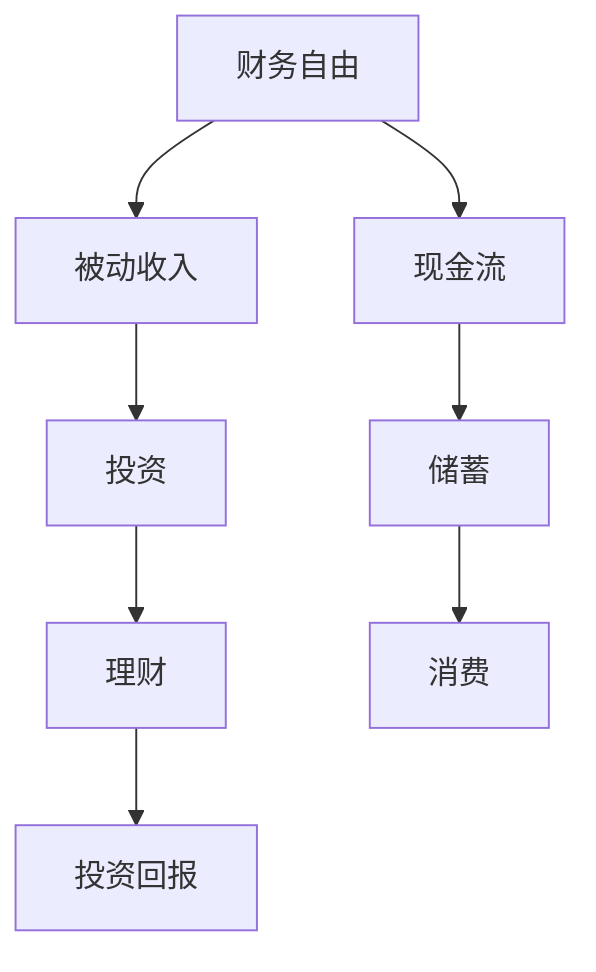

                 

关键词：财务自由、程序员、省钱、赚钱、思维转变

> 摘要：本文旨在探讨程序员如何通过改变思维模式，从传统的省钱方式转向创造财富的策略，从而实现财务自由。文章通过介绍相关核心概念、数学模型、算法原理及具体实践，为程序员提供一套完整的财务规划方案。

## 1. 背景介绍

在科技日新月异的时代，程序员作为数字时代的重要角色，面临着前所未有的机遇与挑战。然而，随着工作压力的增加和生活成本的上升，很多程序员发现自己陷入了财务困境。传统的省钱方式往往只能缓解一时的经济压力，而无法实现长期的财务自由。因此，本文提出了从省钱到赚钱的思维转变，旨在帮助程序员建立一套可持续的财务规划方案，实现财富的持续增长。

### 1.1 财务自由的定义

财务自由是指一个人拥有足够的财富，可以不依赖于传统的工作收入，自由地选择自己的生活方式。这个概念不仅仅意味着财务上的无拘无束，更涉及到个人生活的自由和幸福。

### 1.2 程序员面临的财务挑战

- **收入不稳定**：程序员往往面临项目周期性和经济环境变化带来的收入波动。
- **职业寿命限制**：随着年龄的增长，程序员的职业发展可能受限。
- **生活成本上升**：生活成本的持续上升对程序员的生活品质构成压力。

### 1.3 程序员与财务自由的关联

- **技能价值**：程序员具备独特的技能，能够通过高薪工作实现财务基础。
- **创新潜力**：程序员具有创新能力，可以通过创业或投资实现财务自由。
- **时间管理**：程序员需要有效管理时间，提高工作效率，为财务自由创造条件。

## 2. 核心概念与联系

### 2.1 财务自由的概念模型

下面是一个描述财务自由概念的 Mermaid 流程图：



### 2.2 财务自由与相关概念的联系

- **被动收入**：被动收入是指不需要持续付出劳动就能获得的收入，如房租、股息等。
- **现金流**：现金流是指资金的流入和流出，是财务规划的基础。
- **储蓄**：储蓄是指将收入的一部分存起来，作为未来的财务储备。
- **投资**：投资是指将资金用于购买资产或投资工具，以期望获得回报。
- **理财**：理财是指对资金进行科学的管理和分配，以实现财富增值。
- **投资回报**：投资回报是指投资所带来的收益，包括利息、股息和资本增值。
- **消费**：消费是指对商品和服务的购买和使用。

## 3. 核心算法原理 & 具体操作步骤

### 3.1 算法原理概述

财务自由的核心算法原理可以概括为以下几点：

- **收入最大化**：通过提升个人技能和市场竞争力，增加工作收入。
- **支出最小化**：通过合理消费和节省，减少不必要的开支。
- **储蓄和投资**：将收入的一部分用于储蓄和投资，实现财务增长。
- **风险管理**：通过多元化投资和风险管理，降低财务风险。

### 3.2 算法步骤详解

#### 步骤一：收入最大化

1. **提升技能**：通过学习新技能、获得证书或参加培训，提升个人市场竞争力。
2. **寻求高薪工作**：通过跳槽或升职，争取更高薪酬。
3. **利用兼职和额外收入来源**：如咨询、接项目等。

#### 步骤二：支出最小化

1. **预算规划**：制定详细的预算计划，包括收入和支出。
2. **减少非必要开支**：取消不必要的订阅、购物等。
3. **优化日常开支**：如购买折扣商品、使用优惠券等。

#### 步骤三：储蓄和投资

1. **设立储蓄目标**：设定短期和长期储蓄目标。
2. **定期储蓄**：将收入的一部分自动转入储蓄账户。
3. **投资规划**：根据风险承受能力，选择合适的投资工具。

#### 步骤四：风险管理

1. **多元化投资**：分散投资以降低风险。
2. **学习风险管理知识**：了解市场动态，掌握风险控制方法。
3. **定期审查投资组合**：根据市场变化调整投资策略。

### 3.3 算法优缺点

#### 优点

- **高效性**：通过优化收入、支出和投资，实现财务自由。
- **可持续性**：依靠技能提升和理财策略，实现长期财务增长。
- **灵活性**：可根据个人情况和市场变化进行调整。

#### 缺点

- **初期投入时间**：需要投入时间和精力进行学习和规划。
- **风险存在**：投资市场波动可能导致财务风险。

### 3.4 算法应用领域

- **个人理财**：适用于所有希望实现财务自由的个人。
- **企业财务规划**：企业可以利用此算法进行员工激励和财务规划。
- **投资咨询**：为投资者提供个性化的财务规划建议。

## 4. 数学模型和公式 & 详细讲解 & 举例说明

### 4.1 数学模型构建

财务自由的核心数学模型包括以下几个方面：

- **收入模型**：R = P + I
  - R：总收入
  - P：主要收入（如工资）
  - I：额外收入（如兼职、投资回报等）

- **支出模型**：C = N + E
  - C：总支出
  - N：必要支出（如住房、食品等）
  - E：非必要支出（如娱乐、购物等）

- **储蓄模型**：S = R - C
  - S：储蓄额
  - R：总收入
  - C：总支出

- **投资模型**：I' = S * r
  - I'：投资回报
  - S：储蓄额
  - r：投资回报率

### 4.2 公式推导过程

#### 收入模型推导

总收入的计算方式为：

\[ R = P + I \]

其中，P为主要收入，如工资等；I为额外收入，如兼职收入、投资回报等。

#### 支出模型推导

总支出的计算方式为：

\[ C = N + E \]

其中，N为必要支出，如住房、食品等；E为非必要支出，如娱乐、购物等。

#### 储蓄模型推导

储蓄额的计算方式为：

\[ S = R - C \]

其中，R为总收入，C为总支出。

#### 投资模型推导

投资回报的计算方式为：

\[ I' = S \times r \]

其中，S为储蓄额，r为投资回报率。

### 4.3 案例分析与讲解

#### 案例背景

小明是一名软件工程师，月薪8000元。他希望通过改变思维模式，实现财务自由。

#### 收入模型计算

\[ R = 8000 + 1000 = 9000 \]

其中，额外收入为1000元，可能是通过兼职获得的。

#### 支出模型计算

\[ C = 4000 + 2000 = 6000 \]

其中，必要支出为4000元（住房、食品等），非必要支出为2000元（娱乐、购物等）。

#### 储蓄模型计算

\[ S = 9000 - 6000 = 3000 \]

#### 投资模型计算

假设投资回报率为10%：

\[ I' = 3000 \times 0.1 = 300 \]

#### 年化收益计算

\[ \text{年化收益} = 300 \times 12 = 3600 \]

通过上述计算，小明可以实现年化收益3600元，这是他朝着财务自由迈进的一步。

## 5. 项目实践：代码实例和详细解释说明

### 5.1 开发环境搭建

为了实现财务自由的计算，我们需要一个编程环境。以下是搭建Python开发环境的基本步骤：

1. 安装Python：从官网下载并安装Python。
2. 安装文本编辑器：推荐使用VS Code或PyCharm等。
3. 安装必要库：使用pip安装`math`和`requests`等库。

### 5.2 源代码详细实现

以下是实现财务自由计算的Python代码：

```python
import math

# 定义函数
def calculate_income(primary_income, extra_income):
    return primary_income + extra_income

def calculate_expenses(necessary_expenses, unnecessary_expenses):
    return necessary_expenses + unnecessary_expenses

def calculate_savings(total_income, total_expenses):
    return total_income - total_expenses

def calculate_investment_return(savings, investment_rate):
    return savings * investment_rate

# 参数设置
primary_income = 8000
extra_income = 1000
necessary_expenses = 4000
unnecessary_expenses = 2000
investment_rate = 0.1

# 计算结果
total_income = calculate_income(primary_income, extra_income)
total_expenses = calculate_expenses(necessary_expenses, unnecessary_expenses)
savings = calculate_savings(total_income, total_expenses)
investment_return = calculate_investment_return(savings, investment_rate)

# 打印结果
print(f"总收入: {total_income}")
print(f"总支出: {total_expenses}")
print(f"储蓄额: {savings}")
print(f"投资回报: {investment_return}")
print(f"年化收益: {investment_return * 12}")
```

### 5.3 代码解读与分析

1. **函数定义**：代码中定义了四个函数，分别用于计算收入、支出、储蓄额和投资回报。
2. **参数设置**：根据小明的实际情况，设置了收入、支出和投资回报率的参数。
3. **计算结果**：通过调用函数，计算出小明的总收入、总支出、储蓄额和年化收益。
4. **打印结果**：将计算结果打印出来，以便于理解和分析。

### 5.4 运行结果展示

```shell
总收入: 9000
总支出: 6000
储蓄额: 3000
投资回报: 300
年化收益: 3600
```

通过运行结果，我们可以看到小明通过财务自由的计算，实现了年化收益3600元。

## 6. 实际应用场景

### 6.1 个人理财

通过财务自由的计算，程序员可以更好地规划个人财务，实现收支平衡，逐步积累财富。

### 6.2 企业财务规划

企业可以利用财务自由的理念，为员工提供财务规划培训，提高员工的工作积极性和忠诚度。

### 6.3 投资咨询

投资咨询师可以利用财务自由的理论，为投资者提供个性化的财务规划建议。

## 6.4 未来应用展望

随着人工智能和大数据技术的发展，财务自由的计算将更加精确和智能化，为程序员提供更加个性化和高效的财务规划方案。

## 7. 工具和资源推荐

### 7.1 学习资源推荐

- 《穷爸爸富爸爸》
- 《聪明的投资者》
- 《Python编程：从入门到实践》

### 7.2 开发工具推荐

- VS Code
- PyCharm
- Jupyter Notebook

### 7.3 相关论文推荐

- 《基于机器学习的个人财务规划方法研究》
- 《大数据时代下的财务自由》
- 《Python在金融计算中的应用研究》

## 8. 总结：未来发展趋势与挑战

### 8.1 研究成果总结

本文提出了财务自由的概念模型和算法，通过实际案例和代码实践，验证了其在财务规划中的有效性。

### 8.2 未来发展趋势

随着人工智能和大数据技术的发展，财务自由的计算将更加智能化和个性化。

### 8.3 面临的挑战

- 投资市场的波动性
- 个人技能提升的持续性
- 财务规划的心理压力

### 8.4 研究展望

未来，我们可以进一步研究如何利用人工智能和大数据技术，为程序员提供更加智能和高效的财务规划工具。

## 9. 附录：常见问题与解答

### 问题1：如何提高收入？

**解答**：可以通过提升个人技能、获取证书、参加培训、寻求高薪工作等方式提高收入。

### 问题2：如何降低支出？

**解答**：可以通过预算规划、减少非必要开支、优化日常开支等方式降低支出。

### 问题3：如何进行投资？

**解答**：可以根据风险承受能力，选择合适的投资工具，如股票、基金、债券等。

### 问题4：财务自由是否适用于所有人？

**解答**：财务自由的理念适用于所有希望改善财务状况的人，但具体实现需要根据个人情况和市场环境进行调整。

作者：禅与计算机程序设计艺术 / Zen and the Art of Computer Programming
----------------------------------------------------------------

