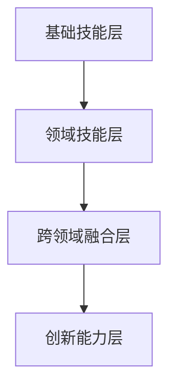

                 

关键词：跨界学习，拓宽收入渠道，技能提升，职业发展

> 摘要：本文旨在探讨程序员如何在保持专业素养的同时，通过跨界学习来拓宽自己的收入渠道，提高个人职业竞争力。文章将结合实际案例，详细分析程序员可以尝试的跨界领域，并给出实用的学习建议。

## 1. 背景介绍

随着科技的快速发展，互联网、大数据、人工智能等新兴领域不断涌现，程序员面临的挑战和机遇也日益增加。虽然程序员在技术领域具有明显的优势，但仅仅局限于编程技能可能无法满足日益复杂的市场需求。因此，跨界学习成为程序员提升职业竞争力、拓宽收入渠道的重要途径。

本文将探讨以下几个方面的内容：

- 程序员跨界学习的必要性
- 可尝试的跨界领域及核心技能
- 跨界学习的策略与方法
- 跨界学习在实际项目中的应用
- 跨界学习的未来趋势与挑战

通过以上内容的阐述，希望能为程序员提供一些有益的启示和指导。

## 2. 核心概念与联系

### 2.1 跨界学习的定义

跨界学习是指在不同领域之间进行知识、技能和经验的交流和融合，通过跨领域的学习和实践，拓展个人的知识边界，提升跨领域的综合能力。

### 2.2 跨界学习的意义

跨界学习对于程序员来说具有重要意义：

- 提升综合素质：跨界学习有助于程序员形成跨领域的知识结构，提升解决问题的能力。
- 拓宽职业道路：跨界学习可以为程序员打开新的职业发展通道，拓宽收入渠道。
- 增强竞争力：跨界学习使程序员在专业领域具备更多优势，提高个人市场竞争力。

### 2.3 跨界学习的架构

跨界学习的架构主要包括以下几个层次：

1. **基础技能层**：包括编程语言、算法和数据结构等基础技术。
2. **领域技能层**：根据个人兴趣和职业规划，学习相关领域的知识，如数据分析、人工智能、前端开发等。
3. **跨领域融合层**：通过项目实践，将不同领域的知识进行融合，解决复杂问题。
4. **创新能力层**：培养创新思维，将跨界知识应用于实际项目，实现突破。

下面是跨界学习的 Mermaid 流程图：



## 3. 核心算法原理 & 具体操作步骤

### 3.1 算法原理概述

跨界学习并非一蹴而就，需要遵循一定的原则和策略。以下是一些核心算法原理：

1. **分而治之**：将复杂问题分解为若干个简单子问题，分别解决，再合并结果。
2. **迭代学习**：通过重复实践和反馈，逐步提升跨领域的知识和技能。
3. **思维导图**：运用思维导图工具，梳理跨界学习的知识结构，形成系统化的认知。
4. **项目管理**：掌握项目管理的核心技能，确保跨界学习项目的顺利进行。

### 3.2 算法步骤详解

1. **确定跨界方向**：根据个人兴趣和市场需求，选择合适的跨界领域。
2. **制定学习计划**：制定详细的学习计划，包括学习目标、时间安排、学习资源等。
3. **系统学习**：按照学习计划，系统学习跨界领域的知识。
4. **实践应用**：通过实际项目，将所学知识应用于实践，提高跨领域的实际操作能力。
5. **反馈优化**：根据实践中的问题和反馈，不断调整学习策略，优化跨界学习效果。

### 3.3 算法优缺点

**优点**：

- 提高综合素质：跨界学习有助于程序员形成跨领域的知识结构，提升解决问题的能力。
- 拓宽职业道路：跨界学习可以为程序员打开新的职业发展通道，拓宽收入渠道。
- 增强竞争力：跨界学习使程序员在专业领域具备更多优势，提高个人市场竞争力。

**缺点**：

- 学习难度较大：跨界学习需要掌握多个领域的知识和技能，难度较高。
- 时间成本较高：跨界学习需要投入大量时间和精力，可能影响其他方面的发展。

### 3.4 算法应用领域

跨界学习在以下领域具有广泛的应用：

- **互联网行业**：如前端开发、后端开发、移动开发等。
- **人工智能领域**：如机器学习、深度学习、自然语言处理等。
- **大数据领域**：如数据挖掘、数据分析、数据可视化等。
- **区块链领域**：如区块链开发、智能合约编写等。

## 4. 数学模型和公式 & 详细讲解 & 举例说明

### 4.1 数学模型构建

在跨界学习过程中，数学模型构建是关键步骤之一。以下是一个简单的数学模型示例：

- **目标函数**：最大化收入
- **约束条件**：时间资源、技能要求等

具体公式为：

$$
\max \sum_{i=1}^{n} p_i \cdot x_i
$$

其中，$p_i$ 表示第 $i$ 个项目的收入，$x_i$ 表示参与第 $i$ 个项目的概率。

### 4.2 公式推导过程

公式的推导过程如下：

1. **确定收入来源**：根据市场需求和个人能力，确定跨界学习的项目。
2. **评估项目价值**：对每个项目进行收入评估，确定 $p_i$ 的值。
3. **设定约束条件**：根据个人时间和技能要求，设定约束条件。
4. **构建目标函数**：将收入评估结果代入目标函数，构建优化问题。

### 4.3 案例分析与讲解

假设程序员小张想拓宽收入渠道，他有以下几个项目可以选择：

- **A项目**：前端开发，预计收入 10000 元，需要 2 个月时间。
- **B项目**：人工智能开发，预计收入 15000 元，需要 3 个月时间。
- **C项目**：区块链开发，预计收入 12000 元，需要 2.5 个月时间。

根据小张的时间安排和技能要求，他可以设定以下约束条件：

$$
\begin{cases}
x_1 + x_2 + x_3 \leq 6 \\
x_1 \geq 0 \\
x_2 \geq 0 \\
x_3 \geq 0
\end{cases}
$$

其中，$x_1$、$x_2$、$x_3$ 分别表示参与 A 项目、B 项目、C 项目的概率。

根据目标函数，我们可以得到以下优化问题：

$$
\max \sum_{i=1}^{3} p_i \cdot x_i
$$

其中，$p_1 = 10000$，$p_2 = 15000$，$p_3 = 12000$。

通过求解优化问题，我们可以得到最佳的项目参与策略。

## 5. 项目实践：代码实例和详细解释说明

### 5.1 开发环境搭建

在进行跨界学习项目实践时，首先需要搭建合适的开发环境。以下是一个基于 Python 的前端开发项目环境搭建步骤：

1. **安装 Python**：下载并安装 Python 3.8 以上版本。
2. **安装 Vue.js**：使用 npm 命令安装 Vue.js 框架。
3. **配置项目目录**：创建项目目录，并设置相应的目录结构。

### 5.2 源代码详细实现

以下是一个简单的 Vue.js 前端项目代码示例：

```html
<!DOCTYPE html>
<html>
<head>
    <title>Vue.js 项目实践</title>
    <script src="https://cdn.jsdelivr.net/npm/vue@2.6.14/dist/vue.min.js"></script>
</head>
<body>
    <div id="app">
        <h1>{{ message }}</h1>
        <button @click="changeMessage">点我</button>
    </div>

    <script>
        var app = new Vue({
            el: '#app',
            data: {
                message: 'Hello Vue.js!'
            },
            methods: {
                changeMessage: function() {
                    this.message = '你好，Vue.js!';
                }
            }
        });
    </script>
</body>
</html>
```

### 5.3 代码解读与分析

以上代码实现了一个简单的 Vue.js 前端项目，主要包括以下部分：

1. **HTML 结构**：定义了一个包含标题和按钮的 HTML 结构。
2. **Vue 实例**：通过 new Vue() 创建了一个 Vue 实例，用于绑定数据和事件处理函数。
3. **数据绑定**：使用双花括号（{{ }}）实现数据绑定，将 message 数据属性显示在页面上。
4. **事件处理**：使用 @click 指令绑定了一个点击事件，当按钮被点击时，会调用 changeMessage 方法改变 message 数据属性。

### 5.4 运行结果展示

通过以上代码实现，我们可以得到以下运行结果：

- 页面显示初始标题为 "Hello Vue.js!"。
- 点击按钮后，标题会变为 "你好，Vue.js!"。

## 6. 实际应用场景

### 6.1 在线教育平台

随着在线教育的发展，程序员可以通过学习前端开发、人工智能等技术，参与到在线教育平台的开发中，成为课程讲师或技术开发人员。

### 6.2 企业信息化建设

企业信息化建设需要大量的前端开发和后端开发人员，程序员可以通过学习相关技术，为企业提供定制化的信息化解决方案。

### 6.3 区块链应用开发

区块链技术的应用越来越广泛，程序员可以通过学习区块链开发，参与区块链应用的开发和推广。

### 6.4 未来应用展望

随着科技的进步，跨界学习在程序员中的地位将越来越重要。未来，程序员将不仅限于编程技能，还需要具备跨领域的综合能力，以应对更加复杂的市场需求。

## 7. 工具和资源推荐

### 7.1 学习资源推荐

1. **《Vue.js 实战》**：一本深入浅出的 Vue.js 教程，适合初学者入门。
2. **《深度学习》**：一本经典的深度学习教材，适合对人工智能感兴趣的程序员。
3. **《区块链技术指南》**：一本涵盖区块链基础和应用的教程，适合想学习区块链技术的程序员。

### 7.2 开发工具推荐

1. **Visual Studio Code**：一款功能强大的代码编辑器，适合进行前端开发和后端开发。
2. **PyCharm**：一款流行的 Python 集成开发环境，适合进行 Python 开发。
3. **Git**：一款强大的版本控制工具，适合进行团队协作和代码管理。

### 7.3 相关论文推荐

1. **《深度学习在自然语言处理中的应用》**：一篇关于深度学习在自然语言处理领域应用的综述论文。
2. **《区块链技术的安全性分析》**：一篇关于区块链技术安全性的研究论文。
3. **《前端开发技术趋势》**：一篇关于前端开发技术发展趋势的论文。

## 8. 总结：未来发展趋势与挑战

### 8.1 研究成果总结

随着科技的快速发展，跨界学习在程序员中的地位日益重要。通过跨界学习，程序员不仅能够提升自身的综合素质，还能拓宽职业道路，提高收入水平。本文探讨了跨界学习的核心算法原理、策略与方法，并分析了跨界学习在实际项目中的应用和未来发展趋势。

### 8.2 未来发展趋势

1. **跨领域知识的融合**：跨界学习将越来越重视跨领域知识的融合，形成系统化的认知结构。
2. **人工智能与编程的结合**：随着人工智能技术的发展，程序员需要具备一定的机器学习、深度学习等技能。
3. **区块链技术的应用**：区块链技术将在更多领域得到应用，程序员需要掌握相关技术。

### 8.3 面临的挑战

1. **学习难度大**：跨界学习需要掌握多个领域的知识和技能，难度较高。
2. **时间成本高**：跨界学习需要投入大量时间和精力，可能影响其他方面的发展。
3. **技术更新快**：随着科技的发展，程序员需要不断学习新技术，以适应市场需求。

### 8.4 研究展望

未来，跨界学习将成为程序员提升职业竞争力的重要途径。通过深入研究跨界学习的算法原理和策略，不断完善跨界学习体系，将为程序员提供更加有效的学习方法和实践途径。

## 9. 附录：常见问题与解答

### 9.1 跨界学习是否适合所有人？

**答案**：是的，跨界学习适合所有程序员。无论你的专业背景如何，都可以通过跨界学习提升自身的综合素质和职业竞争力。

### 9.2 如何选择跨界领域？

**答案**：选择跨界领域时，可以从以下几个方面进行考虑：

1. **市场需求**：选择市场需求量大、发展前景好的领域。
2. **个人兴趣**：选择自己感兴趣的领域，提高学习动力。
3. **技能匹配**：选择与现有技能有一定关联的领域，降低学习难度。

### 9.3 跨界学习需要多长时间？

**答案**：跨界学习的时间因人而异，取决于个人的学习速度和投入的时间。一般来说，掌握一个领域的核心知识和技能需要 6 个月到 1 年的时间。

作者：禅与计算机程序设计艺术 / Zen and the Art of Computer Programming
----------------------------------------------------------------

以上就是按照要求撰写的完整文章。文章涵盖了跨界学习的必要性、核心概念、算法原理、数学模型、项目实践、实际应用场景、工具和资源推荐、未来发展趋势与挑战以及常见问题与解答等内容。希望对您有所帮助。如果您有其他需求或疑问，请随时告诉我。作者：禅与计算机程序设计艺术 / Zen and the Art of Computer Programming。

