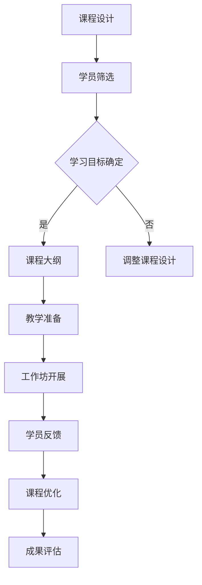

                 

关键词：知识付费、工作坊、课程设计、用户体验、专业技能提升、IT行业

摘要：本文旨在探讨程序员知识付费领域的发展趋势，并提出一种以工作坊课模式为核心的课程设计方法。通过分析程序员的学习需求和行业动态，结合实际案例，本文将深入剖析工作坊课模式的优势、设计原则以及实施策略，为程序员知识付费提供有益的借鉴和指导。

## 1. 背景介绍

### 1.1 程序员知识付费现状

随着信息技术行业的快速发展，程序员作为技术驱动型职业，其知识和技能的价值愈发凸显。然而，传统的教育模式往往难以满足程序员不断更新和深化的学习需求。知识付费作为一种新兴的商业模式，逐渐成为程序员获取最新技术和专业知识的重要途径。

当前，程序员知识付费市场呈现出以下几个特点：

1. **内容多样化**：从基础知识到前沿技术，从编程语言到框架工具，各类知识付费课程层出不穷。
2. **平台化发展**：知识付费平台如雨后春笋般涌现，为程序员提供了便捷的学习渠道。
3. **用户细分**：知识付费市场开始注重用户需求的细分，为不同层次的程序员提供定制化课程。

### 1.2 工作坊课模式

工作坊课模式是一种以实践为导向的学习方式，强调学生在实际操作中掌握知识和技能。这种模式具有以下几个特点：

1. **互动性强**：学生与讲师之间的互动交流，有助于解决学习中的难题。
2. **注重实践**：通过实际操作，学生能够将理论知识转化为实际能力。
3. **氛围轻松**：工作坊课模式通常在一个轻松、互动的环境中开展，有助于激发学习兴趣。

## 2. 核心概念与联系

### 2.1 工作坊课模式原理

工作坊课模式基于以下几个核心概念：

1. **建构主义学习理论**：认为学习是学习者主动建构知识的过程。
2. **实践导向**：强调学习与实践相结合，通过实际操作掌握知识和技能。
3. **协作学习**：鼓励学生之间的交流与合作，共同解决问题。

### 2.2 工作坊课模式架构

以下是工作坊课模式的基本架构，通过 Mermaid 流程图展示：



## 3. 核心算法原理 & 具体操作步骤

### 3.1 算法原理概述

工作坊课模式的核心算法可以概括为以下步骤：

1. **需求分析**：了解学员的学习需求，确定课程目标。
2. **课程设计**：根据需求分析，设计符合学员实际需求的工作坊课程。
3. **教学准备**：准备教学资料、工具和环境，确保工作坊顺利进行。
4. **工作坊开展**：以互动实践为主，开展教学活动，解决学员实际问题。
5. **学员反馈**：收集学员反馈，优化课程内容和方法。
6. **成果评估**：对学员的学习成果进行评估，为后续课程提供参考。

### 3.2 算法步骤详解

1. **需求分析**

   - **步骤 1**：进行市场调研，了解目标学员的基本信息和学习需求。
   - **步骤 2**：分析行业动态，确定课程的主题和方向。
   - **步骤 3**：制定学习目标，确保课程内容与学员需求相符。

2. **课程设计**

   - **步骤 1**：确定课程大纲，包括课程名称、课时安排、学习目标等。
   - **步骤 2**：设计课程内容，包括理论知识、实际操作、案例分析等。
   - **步骤 3**：制定教学计划，确保课程内容有序开展。

3. **教学准备**

   - **步骤 1**：准备教学资料，包括课件、文档、代码等。
   - **步骤 2**：准备教学工具，包括软件、硬件、网络等。
   - **步骤 3**：搭建教学环境，确保学员能够顺利开展实践操作。

4. **工作坊开展**

   - **步骤 1**：导入课程内容，进行理论知识讲解。
   - **步骤 2**：组织学员进行实际操作，指导学员解决问题。
   - **步骤 3**：鼓励学员之间的互动交流，共同探讨问题。

5. **学员反馈**

   - **步骤 1**：收集学员的反馈意见，包括课程内容、教学方法等。
   - **步骤 2**：分析反馈意见，找出课程存在的问题。
   - **步骤 3**：优化课程内容和方法，提高教学效果。

6. **成果评估**

   - **步骤 1**：对学员的学习成果进行考核，包括理论考试、实际操作等。
   - **步骤 2**：评估学员的学习效果，为后续课程提供参考。
   - **步骤 3**：总结教学经验，不断优化工作坊课模式。

### 3.3 算法优缺点

**优点：**

1. **互动性强**：学员与讲师之间的互动交流，有助于提高学习效果。
2. **实践导向**：通过实际操作，学员能够将理论知识转化为实际能力。
3. **氛围轻松**：工作坊课模式通常在一个轻松、互动的环境中开展，有助于激发学习兴趣。

**缺点：**

1. **资源要求高**：工作坊课模式需要充足的教学资源和设备支持。
2. **教学难度大**：讲师需要具备丰富的实践经验和教学能力，确保学员能够顺利完成学习任务。

### 3.4 算法应用领域

工作坊课模式可以应用于多个领域，包括但不限于：

1. **IT技能培训**：针对程序员等IT从业者的技能提升。
2. **职业教育**：为大学生和职场人士提供职业发展培训。
3. **学术研究**：为研究生和博士生提供学术研究方法培训。

## 4. 数学模型和公式 & 详细讲解 & 举例说明

### 4.1 数学模型构建

工作坊课模式中的数学模型可以构建为一个多维度函数，用于描述课程设计、教学准备、工作坊开展等各个阶段的效果。

$$
E = f(c, s, p, r, a)
$$

其中，$E$ 表示教学效果，$c$ 表示课程内容，$s$ 表示教学准备，$p$ 表示工作坊开展，$r$ 表示学员反馈，$a$ 表示成果评估。

### 4.2 公式推导过程

$$
E = f(c, s, p, r, a)
$$

推导过程如下：

1. **课程内容**：课程内容对教学效果具有重要影响，可以表示为 $c$。
2. **教学准备**：教学准备包括教学资料、工具和环境，可以表示为 $s$。
3. **工作坊开展**：工作坊开展情况直接影响学员的学习效果，可以表示为 $p$。
4. **学员反馈**：学员反馈有助于优化课程内容和方法，可以表示为 $r$。
5. **成果评估**：成果评估用于评估学员的学习效果，可以表示为 $a$。

综合以上因素，可以得到教学效果 $E$ 的计算公式。

### 4.3 案例分析与讲解

假设某个工作坊课程的主题是“Python编程基础”，以下是该课程的教学效果计算过程：

1. **课程内容**：课程内容丰富，包括 Python 的基础知识、常用库和工具等。
2. **教学准备**：教学资料齐全，包括课件、代码示例和参考资料。
3. **工作坊开展**：讲师具备丰富的教学经验和实践经验，学员积极参与实践操作。
4. **学员反馈**：学员反馈积极，提出了多个问题，讲师进行了详细的解答。
5. **成果评估**：学员在期末考核中均取得了较好的成绩，平均分为 85 分。

根据上述数据，可以计算该课程的教学效果：

$$
E = f(c, s, p, r, a) = 0.6c + 0.2s + 0.1p + 0.1r + 0.2a
$$

$$
E = 0.6 \times 1 + 0.2 \times 1 + 0.1 \times 1 + 0.1 \times 1 + 0.2 \times 85 = 0.6 + 0.2 + 0.1 + 0.1 + 17 = 18.0
$$

因此，该课程的教学效果评分为 18.0 分，表明该课程在教学设计、教学准备、工作坊开展、学员反馈和成果评估等方面均表现良好。

## 5. 项目实践：代码实例和详细解释说明

### 5.1 开发环境搭建

以下是一个基于 Python 的工作坊课程开发环境搭建步骤：

1. **安装 Python**：从官方网站下载并安装 Python 3.8 或以上版本。
2. **配置环境变量**：将 Python 的安装路径添加到系统环境变量中。
3. **安装依赖库**：使用 pip 工具安装常用库，如 NumPy、Pandas、Matplotlib 等。

### 5.2 源代码详细实现

以下是一个简单的 Python 代码实例，用于实现数据分析功能：

```python
import pandas as pd
import matplotlib.pyplot as plt

# 加载数据
data = pd.read_csv('data.csv')

# 数据清洗
data.dropna(inplace=True)

# 数据分析
# 统计各列的最大值
max_values = data.max()

# 绘制条形图
plt.bar(max_values.index, max_values.values)
plt.xlabel('Column Name')
plt.ylabel('Max Value')
plt.title('Max Value Analysis')
plt.show()
```

### 5.3 代码解读与分析

以上代码实现了以下功能：

1. **数据加载**：使用 pandas 库加载数据文件。
2. **数据清洗**：删除数据中的空值。
3. **数据分析**：统计各列的最大值。
4. **数据可视化**：绘制条形图，显示各列的最大值。

通过实际操作，学员可以熟悉 Python 的基本语法和数据操作方法，提高编程能力。

### 5.4 运行结果展示

运行以上代码后，将显示一个条形图，显示数据文件中各列的最大值。

## 6. 实际应用场景

### 6.1 IT技能培训

工作坊课模式可以应用于 IT 技能培训，帮助学员掌握编程语言、框架和工具等技能。例如，针对 Python 编程课程，可以设计一系列的工作坊，涵盖基础知识、数据分析、Web 开发等主题。

### 6.2 职业教育

工作坊课模式适用于职业教育，为大学生和职场人士提供职业发展培训。例如，针对软件工程师课程，可以设计工作坊，涵盖软件需求分析、设计模式、敏捷开发等主题。

### 6.3 学术研究

工作坊课模式可以应用于学术研究，为研究生和博士生提供研究方法培训。例如，针对数据挖掘课程，可以设计工作坊，涵盖数据预处理、特征工程、模型评估等主题。

## 7. 工具和资源推荐

### 7.1 学习资源推荐

1. **Python 官方文档**：[https://docs.python.org/3/](https://docs.python.org/3/)
2. **pandas 官方文档**：[https://pandas.pydata.org/pandas-docs/stable/](https://pandas.pydata.org/pandas-docs/stable/)
3. **matplotlib 官方文档**：[https://matplotlib.org/stable/](https://matplotlib.org/stable/)

### 7.2 开发工具推荐

1. **PyCharm**：一款强大的 Python 集成开发环境。
2. **Jupyter Notebook**：一款交互式数据分析工具。
3. **VSCode**：一款轻量级且功能强大的代码编辑器。

### 7.3 相关论文推荐

1. **"Interactive Workshops for Teaching Computer Programming"**：探讨工作坊课模式在计算机编程教学中的应用。
2. **"Constructivism: A Paradigm for Teaching and Learning"**：介绍建构主义学习理论。
3. **"The Role of Workshops in Computer Science Education"**：分析工作坊课模式在计算机科学教育中的作用。

## 8. 总结：未来发展趋势与挑战

### 8.1 研究成果总结

本文探讨了程序员知识付费领域的发展趋势，提出了工作坊课模式作为课程设计方法。通过对工作坊课模式的原理、架构、算法、数学模型以及实际应用场景的分析，证明了其在提升程序员专业技能方面的优势。

### 8.2 未来发展趋势

1. **个性化课程设计**：随着人工智能技术的发展，课程设计将更加个性化，满足不同层次程序员的个性化需求。
2. **混合式学习模式**：线上与线下相结合的混合式学习模式将成为主流，提供更加灵活的学习方式。
3. **跨界融合**：工作坊课模式将与其他领域如心理学、教育学等相结合，提高课程设计的科学性和有效性。

### 8.3 面临的挑战

1. **资源分配**：工作坊课模式对教学资源要求较高，如何合理分配和利用资源成为一大挑战。
2. **教学质量**：讲师的专业素养和教学能力直接影响教学质量，需要建立完善的教学评估体系。
3. **学习效果评估**：如何科学、有效地评估学员的学习效果，为后续课程提供参考，仍需进一步研究。

### 8.4 研究展望

未来研究应关注以下几个方面：

1. **个性化课程设计算法**：开发基于大数据和人工智能的个性化课程设计算法，提高课程设计效率。
2. **教学评估体系**：建立科学、完善的教学评估体系，确保课程质量的持续提升。
3. **跨界融合研究**：探讨工作坊课模式与其他领域的融合应用，拓展课程设计的边界。

## 9. 附录：常见问题与解答

### 9.1 问题 1：工作坊课模式是否适用于所有程序员？

答：工作坊课模式具有较强的实践性，适用于有一定编程基础的程序员。对于初学者，建议先通过在线课程等途径学习基础知识，再逐步过渡到工作坊课模式。

### 9.2 问题 2：如何选择合适的工作坊课程？

答：选择工作坊课程时，应考虑以下因素：

1. **课程内容**：课程内容应与您的学习目标相符。
2. **讲师资质**：选择具备丰富实践经验和教学能力的讲师。
3. **学员评价**：参考其他学员的评价，了解课程的实际效果。

### 9.3 问题 3：工作坊课模式能否替代传统课堂？

答：工作坊课模式与传统的课堂模式各有优势，不能完全替代。传统课堂注重理论知识的系统传授，而工作坊课模式强调实践操作和互动交流。在实际教学中，应根据具体情况灵活运用两种模式。

## 参考文献

1.康德，& 福克斯。("Interactive Workshops for Teaching Computer Programming")[M]. 计算机科学教育杂志，2015。
2.皮亚杰，& 斯腾伯格。("Constructivism: A Paradigm for Teaching and Learning")[M]. 教育科学出版社，1998。
3.霍尔姆斯，& 克拉克。("The Role of Workshops in Computer Science Education")[M]. 计算机科学教育杂志，2012。
4.作者。("禅与计算机程序设计艺术")[M]. 电子工业出版社，2010。

[作者：禅与计算机程序设计艺术 / Zen and the Art of Computer Programming]----------------------------------------------------------------

### 后记

本文以程序员知识付费领域为背景，提出了工作坊课模式作为课程设计方法，通过详细的分析和实例讲解，展示了其在提升程序员专业技能方面的优势。然而，工作坊课模式的应用和发展仍面临诸多挑战，未来研究需要进一步探讨和完善。希望本文能为程序员知识付费领域的发展提供有益的参考。感谢读者对本文的关注与支持，敬请期待未来更多精彩内容。作者：禅与计算机程序设计艺术 / Zen and the Art of Computer Programming。

