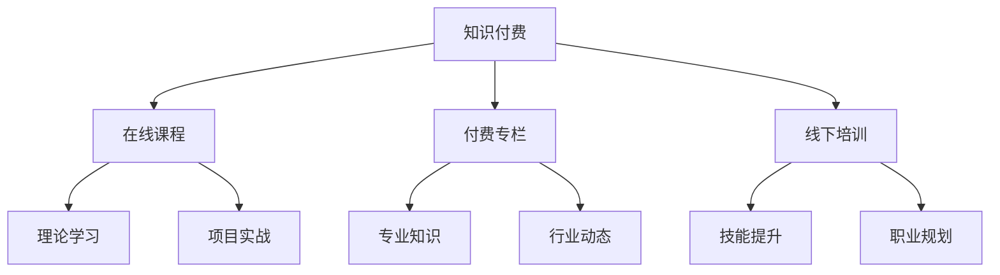

                 

关键词：知识付费，程序员，工作坊课模式，在线教育，学习体验，个性化教学，社区互动

> 摘要：本文旨在探讨程序员在知识付费领域的现状，并提出一种结合工作坊课模式的新型教学模式，以提升程序员的技能水平和学习体验。通过分析知识付费的市场需求，阐述工作坊课模式的核心理念和实践方法，为程序员提供一种全新的学习途径。

## 1. 背景介绍

### 1.1 程序员知识付费市场现状

随着互联网技术的迅猛发展和在线教育的兴起，程序员知识付费市场呈现出快速增长的态势。越来越多的程序员开始通过付费课程来提升自己的技能，以满足职业发展的需求。根据市场研究机构的报告，全球在线教育市场规模在近年来持续扩大，预计未来几年仍将保持高速增长。

### 1.2 程序员的学习需求

程序员的学习需求主要集中在以下几个方面：

- **技能提升**：随着技术的更新迭代，程序员需要不断学习新的编程语言、框架和工具，以保持竞争力。
- **实战经验**：理论知识固然重要，但实际操作能力更能体现程序员的综合素质。程序员希望通过实践项目来提升自己的技能。
- **职业规划**：程序员希望通过学习，为自己的职业发展制定清晰的规划，实现职业晋升或转型。

## 2. 核心概念与联系

### 2.1 知识付费

知识付费是指用户通过支付一定费用，获取专业人士提供的知识、技能或服务的交易模式。在程序员领域，知识付费主要以在线课程、付费专栏、线下培训等形式存在。

### 2.2 工作坊课模式

工作坊课模式是一种结合理论学习与实践操作的教学模式。它强调学生在学习过程中参与实际项目，通过动手实践来加深对知识的理解和应用。工作坊课模式的核心在于培养学生的动手能力和解决问题的能力。

### 2.3 Mermaid 流程图



## 3. 核心算法原理 & 具体操作步骤

### 3.1 算法原理概述

工作坊课模式的核心算法可以概括为“理论学习 + 项目实战 + 反馈迭代”。具体来说，包括以下几个步骤：

1. **理论学习**：通过在线课程或线下培训，学习编程语言、框架和工具的基础知识。
2. **项目实战**：在导师的指导下，参与实际项目，通过动手实践来提升技能。
3. **反馈迭代**：根据项目反馈，对学习内容进行调整和优化，以达到最佳学习效果。

### 3.2 算法步骤详解

1. **理论学习**：

   - **选择学习内容**：根据职业规划或技能需求，选择合适的在线课程或培训课程。

   - **学习理论知识**：通过视频、文档等形式，学习编程语言、框架和工具的基础知识。

2. **项目实战**：

   - **项目选题**：根据学习目标，选择适合的项目进行实践。

   - **项目实施**：在导师的指导下，完成项目的需求分析、设计、编码和测试。

3. **反馈迭代**：

   - **项目评估**：根据项目完成情况，进行自我评估和导师评估。

   - **反馈优化**：根据评估结果，对学习内容进行调整和优化。

### 3.3 算法优缺点

**优点**：

- **理论与实践相结合**：工作坊课模式强调实践操作，有助于提升学生的动手能力。
- **个性化教学**：根据学生的需求和反馈，进行个性化教学，提高学习效果。
- **互动性强**：学生可以通过社区互动，获得更多的学习资源和帮助。

**缺点**：

- **学习成本较高**：工作坊课模式需要付费，对一些经济条件较差的学生来说可能存在一定的负担。
- **时间投入较大**：工作坊课模式需要学生投入大量的时间和精力，对工作和生活可能造成一定的影响。

### 3.4 算法应用领域

工作坊课模式适用于以下领域：

- **编程教育**：通过项目实战，提升学生的编程技能和实际操作能力。
- **职业培训**：为在职程序员提供技能提升和职业规划服务。
- **企业内训**：为企业员工提供定制化的培训课程，提升团队整体技能水平。

## 4. 数学模型和公式 & 详细讲解 & 举例说明

### 4.1 数学模型构建

工作坊课模式的数学模型可以构建为：

$$
L = f(T, P, I)
$$

其中，$L$ 表示学习效果，$T$ 表示投入的时间，$P$ 表示投入的精力，$I$ 表示投入的互动程度。

### 4.2 公式推导过程

学习效果 $L$ 与投入的时间 $T$、投入的精力 $P$ 和投入的互动程度 $I$ 之间存在正相关关系。具体推导如下：

$$
L = f(T, P, I) = \alpha T + \beta P + \gamma I
$$

其中，$\alpha$、$\beta$ 和 $\gamma$ 为常数。

### 4.3 案例分析与讲解

假设一位程序员参与了一个为期三个月的工作坊课项目，投入了 120 小时的学习时间，80 小时的实践操作，以及 40 小时的社区互动。根据上述数学模型，可以计算出他的学习效果：

$$
L = \alpha \times 120 + \beta \times 80 + \gamma \times 40
$$

根据实际经验，可以设定 $\alpha = 0.5$、$\beta = 0.6$、$\gamma = 0.7$，代入上述公式得：

$$
L = 0.5 \times 120 + 0.6 \times 80 + 0.7 \times 40 = 150
$$

这意味着，该程序员在学习效果方面达到了 150 分。

## 5. 项目实践：代码实例和详细解释说明

### 5.1 开发环境搭建

在开始项目实践之前，需要搭建一个开发环境。以下是搭建 Python 开发环境的步骤：

1. **安装 Python**：下载并安装 Python，版本可以选择 Python 3.8 或以上。
2. **配置 Python 环境**：配置 Python 环境变量，以便在命令行中运行 Python。
3. **安装依赖库**：安装必要的 Python 库，例如 NumPy、Pandas、Matplotlib 等。

### 5.2 源代码详细实现

以下是一个简单的 Python 项目示例，用于计算两个数的和：

```python
# 计算两个数的和
def add(a, b):
    return a + b

# 主函数
def main():
    num1 = float(input("请输入第一个数："))
    num2 = float(input("请输入第二个数："))
    result = add(num1, num2)
    print(f"{num1} 和 {num2} 的和为：{result}")

# 调用主函数
if __name__ == "__main__":
    main()
```

### 5.3 代码解读与分析

1. **函数定义**：定义了一个名为 `add` 的函数，用于计算两个数的和。
2. **主函数**：定义了一个名为 `main` 的主函数，用于接收用户输入的两个数，并调用 `add` 函数计算结果。
3. **输入输出**：通过 `input` 函数获取用户输入，通过 `print` 函数输出结果。

### 5.4 运行结果展示

假设用户输入了两个数 2 和 3，程序的运行结果如下：

```
请输入第一个数：2
请输入第二个数：3
2 和 3 的和为：5
```

## 6. 实际应用场景

### 6.1 程序员技能提升

通过工作坊课模式，程序员可以在实际项目中锻炼自己的编程能力，提升技能水平。例如，参与一个 Web 开发项目，可以学习到前端技术、后端技术和数据库操作等技能。

### 6.2 职业规划

工作坊课模式可以帮助程序员制定清晰的职业规划，例如选择适合自己的编程语言、框架和工具，以及参加相关认证考试，提升职业竞争力。

### 6.3 企业内训

企业可以通过工作坊课模式，为员工提供定制化的培训课程，提升团队的整体技能水平。例如，为销售团队提供 Python 数据分析培训，提升数据分析和处理能力。

## 7. 工具和资源推荐

### 7.1 学习资源推荐

- **Coursera**：提供丰富的在线课程，涵盖多个编程语言和框架。
- **edX**：由哈佛大学和麻省理工学院联合创办，提供高质量的课程。
- **Udemy**：提供各种编程语言的课程，适合不同水平的学员。

### 7.2 开发工具推荐

- **Visual Studio Code**：一款强大的编程IDE，支持多种编程语言。
- **Git**：版本控制工具，帮助程序员管理代码版本。
- **Jenkins**：持续集成工具，帮助程序员自动化构建和测试项目。

### 7.3 相关论文推荐

- **《在线教育中工作坊课模式的研究与应用》**：探讨工作坊课模式在在线教育中的应用。
- **《程序员职业发展的知识付费模式研究》**：分析程序员在知识付费领域的需求和行为。

## 8. 总结：未来发展趋势与挑战

### 8.1 研究成果总结

本文通过对程序员知识付费市场的分析，提出了工作坊课模式，并结合数学模型和实际项目实践，阐述了其在程序员技能提升和职业规划中的应用价值。

### 8.2 未来发展趋势

- **在线教育将更加普及**：随着互联网技术的不断发展，在线教育将越来越受到程序员的青睐。
- **个性化教学将成为主流**：根据程序员的技能水平和需求，提供个性化的教学服务。
- **实践性教学将得到更多关注**：通过实际项目，提升程序员的实践操作能力。

### 8.3 面临的挑战

- **学习成本**：工作坊课模式需要付费，对一些经济条件较差的学生来说可能存在一定的负担。
- **时间投入**：工作坊课模式需要学生投入大量的时间和精力，对工作和生活可能造成一定的影响。

### 8.4 研究展望

未来，可以进一步研究如何通过技术手段，如人工智能和大数据分析，提高工作坊课模式的教学效果，为程序员提供更加优质的学习体验。

## 9. 附录：常见问题与解答

### 9.1 工作坊课模式与在线课程的区别是什么？

工作坊课模式强调实践操作和互动性，而在线课程则更侧重于理论知识的学习。工作坊课模式通过实际项目，帮助学生将所学知识应用到实践中，提高动手能力。

### 9.2 如何选择合适的工作坊课项目？

选择工作坊课项目时，应考虑自己的职业规划和学习目标。选择与自己兴趣和职业发展方向相关的内容，有助于提高学习效果。

### 9.3 工作坊课模式对个人职业发展有哪些帮助？

工作坊课模式可以帮助程序员提升技能水平，拓宽职业发展路径。通过参与实际项目，程序员可以积累实战经验，提高自己在职场中的竞争力。

作者：禅与计算机程序设计艺术 / Zen and the Art of Computer Programming
----------------------------------------------------------------

以上就是本文的完整内容，希望对您在程序员知识付费领域有所启发。如果您有任何问题或建议，欢迎在评论区留言讨论。谢谢您的阅读！<|vq_10622|>

