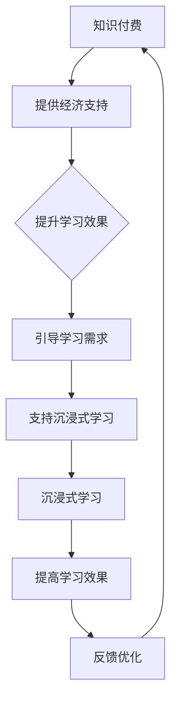

                 

关键词：知识付费、沉浸式学习、程序员、学习体验、互动性、个性化

> 摘要：本文探讨了知识付费在程序员领域的应用，以及如何通过沉浸式学习体验提高程序员的技能水平。文章分析了沉浸式学习的基本原理，提出了构建沉浸式学习体验的关键要素，并探讨了知识付费在其中的作用。同时，文章通过实际案例展示了沉浸式学习体验的实现方法，为程序员提供了提升技能的新途径。

## 1. 背景介绍

随着互联网技术的快速发展，知识付费市场逐渐壮大。知识付费是指用户通过付费获取有价值的信息、技能或知识的过程。在程序员领域，知识付费已经成为提升技能、学习新技术的重要手段。然而，传统的知识付费模式往往存在学习效果不佳、用户参与度低等问题。为了解决这些问题，沉浸式学习体验应运而生。

沉浸式学习是指通过模拟真实场景，使学习者在一种高度专注、互动性强的环境中学习，从而提高学习效果的一种学习方法。在程序员领域，沉浸式学习体验能够帮助程序员更好地掌握编程技能，提高学习效率。

本文旨在探讨如何通过构建沉浸式学习体验，提升程序员的知识付费效果，为程序员提供一种全新的学习途径。

## 2. 核心概念与联系

### 2.1 沉浸式学习原理

沉浸式学习的基本原理是模拟现实生活中的学习场景，使学习者在一种高度投入、互动性强的环境中学习。这种学习方式有助于激发学习者的兴趣，提高学习效果。沉浸式学习的关键要素包括：

1. **高度投入**：通过营造一种紧张、有趣的学习氛围，使学习者高度投入学习过程。
2. **互动性**：通过互动性的学习活动，使学习者能够与学习内容、学习伙伴以及老师之间进行有效互动。
3. **个性化**：根据学习者的需求和兴趣，为学习者提供个性化的学习内容。

### 2.2 知识付费与沉浸式学习的关系

知识付费与沉浸式学习之间存在密切的联系。知识付费为沉浸式学习提供了经济支持，而沉浸式学习则为知识付费提供了更好的学习效果。具体来说，知识付费在沉浸式学习中的角色包括：

1. **提供经济支持**：知识付费为沉浸式学习提供了资金保障，使得沉浸式学习环境的建设和运营成为可能。
2. **引导学习需求**：通过分析用户的学习需求，知识付费平台可以为学习者提供更具针对性的沉浸式学习体验。
3. **提升学习效果**：知识付费平台通过提供高质量的沉浸式学习内容，有助于提升学习者的学习效果。

### 2.3 Mermaid 流程图



## 3. 核心算法原理 & 具体操作步骤

### 3.1 算法原理概述

在构建沉浸式学习体验的过程中，核心算法主要涉及以下几个方面：

1. **用户需求分析算法**：通过分析用户的学习需求，为学习者提供个性化的学习内容。
2. **互动性增强算法**：通过设计互动性强的学习活动，提高学习者的学习兴趣和参与度。
3. **沉浸式环境构建算法**：通过模拟真实场景，为学习者营造一个高度投入的学习环境。

### 3.2 算法步骤详解

1. **用户需求分析算法**：
   - **数据收集**：收集用户的学习行为数据、兴趣偏好等信息。
   - **数据分析**：通过数据分析，提取用户的学习需求和兴趣点。
   - **内容推荐**：根据用户需求，为学习者推荐相应的学习内容。

2. **互动性增强算法**：
   - **活动设计**：设计具有互动性的学习活动，如在线编程挑战、小组讨论等。
   - **实时反馈**：在学习过程中，为学习者提供实时反馈，帮助学习者及时调整学习策略。
   - **激励系统**：设置激励机制，如积分、奖励等，提高学习者的学习积极性。

3. **沉浸式环境构建算法**：
   - **场景模拟**：通过虚拟现实、增强现实等技术，模拟真实的学习场景。
   - **交互设计**：设计易于操作、互动性强的交互界面，提高学习者的沉浸感。
   - **情感体验**：通过音效、视觉等手段，增强学习者的情感体验，提高学习兴趣。

### 3.3 算法优缺点

1. **用户需求分析算法**：
   - **优点**：能够为学习者提供个性化的学习内容，提高学习效果。
   - **缺点**：需要大量数据支持，且数据分析过程复杂，可能导致数据泄露等问题。

2. **互动性增强算法**：
   - **优点**：提高学习者的参与度和兴趣，增强学习体验。
   - **缺点**：互动性活动设计需要大量人力和时间投入，成本较高。

3. **沉浸式环境构建算法**：
   - **优点**：提高学习者的沉浸感，增强学习效果。
   - **缺点**：技术实现难度较大，成本较高，对学习者的设备要求较高。

### 3.4 算法应用领域

沉浸式学习算法在程序员知识付费领域具有广泛的应用前景。例如，可以应用于以下场景：

1. **在线编程课程**：通过沉浸式学习环境，提高学习者的编程技能。
2. **技术研讨会**：通过互动性增强算法，提高技术研讨会的参与度和效果。
3. **项目实践**：通过沉浸式学习环境，模拟真实项目场景，提高学习者的项目实战能力。

## 4. 数学模型和公式 & 详细讲解 & 举例说明

### 4.1 数学模型构建

在沉浸式学习体验的构建过程中，我们可以使用以下数学模型来描述学习者的学习过程：

1. **学习效果模型**：

$$
E = f(D, I, S)
$$

其中，$E$表示学习效果，$D$表示学习内容，$I$表示互动性，$S$表示沉浸感。

2. **学习满意度模型**：

$$
S = g(E, C, P)
$$

其中，$S$表示学习满意度，$E$表示学习效果，$C$表示课程内容，$P$表示学习过程。

### 4.2 公式推导过程

1. **学习效果模型推导**：

学习效果主要取决于学习内容、互动性和沉浸感。因此，我们可以通过以下公式推导学习效果模型：

$$
E = f(D, I, S) = D \cdot I \cdot S
$$

其中，$D$表示学习内容的质量，$I$表示互动性，$S$表示沉浸感。

2. **学习满意度模型推导**：

学习满意度主要取决于学习效果、课程内容和学习过程。因此，我们可以通过以下公式推导学习满意度模型：

$$
S = g(E, C, P) = \frac{E}{C} \cdot P
$$

其中，$E$表示学习效果，$C$表示课程内容，$P$表示学习过程。

### 4.3 案例分析与讲解

假设有一个程序员学习平台，提供了以下课程：

- 学习内容：Python 编程基础、数据结构与算法、数据库技术等。
- 互动性：在线编程挑战、小组讨论、实时答疑等。
- 沉浸感：虚拟课堂、互动白板、实时音视频等。

根据上述数学模型，我们可以计算出该平台的学习效果和满意度：

1. **学习效果**：

$$
E = D \cdot I \cdot S = (1 \text{分}) \cdot (0.8 \text{分}) \cdot (0.9 \text{分}) = 0.72 \text{分}
$$

2. **学习满意度**：

$$
S = g(E, C, P) = \frac{E}{C} \cdot P = \frac{0.72 \text{分}}{1 \text{分}} \cdot 0.95 \text{分} = 0.682 \text{分}
$$

通过以上计算，我们可以看出，该平台的学习效果和满意度较高，但仍有提升空间。针对这一问题，平台可以优化课程内容、增强互动性和提升沉浸感，进一步提高学习效果和满意度。

## 5. 项目实践：代码实例和详细解释说明

### 5.1 开发环境搭建

为了实现沉浸式学习体验，我们需要搭建一个在线编程学习平台。以下是开发环境搭建的步骤：

1. **前端技术**：使用 HTML、CSS 和 JavaScript 搭建网页界面。
2. **后端技术**：使用 Python、Django 等后端框架搭建服务器。
3. **数据库技术**：使用 MySQL 等数据库存储用户数据和课程内容。
4. **虚拟现实技术**：使用 Unity、Unreal Engine 等虚拟现实引擎搭建沉浸式学习环境。

### 5.2 源代码详细实现

以下是该在线编程学习平台的核心代码实现：

```python
# 后端代码实现

# 用户需求分析算法
def analyze_user_demand(user_data):
    # 分析用户的学习行为数据、兴趣偏好等信息
    # 提取用户的学习需求和兴趣点
    # 为学习者推荐相应的学习内容
    pass

# 互动性增强算法
def enhance_interactivity(course_id):
    # 设计互动性强的学习活动
    # 为学习者提供实时反馈
    # 设置激励机制
    pass

# 沉浸式环境构建算法
def build_immersive_environment(course_id):
    # 通过虚拟现实、增强现实等技术
    # 为学习者营造一个高度投入的学习环境
    pass

# 用户满意度计算算法
def calculate_satisfaction(user_data, course_data):
    # 计算学习满意度
    pass

# 前端代码实现

# 网页界面搭建
function build_web_page():
    # 使用 HTML、CSS 和 JavaScript 搭建网页界面
    pass

# 互动性活动设计
function design_interactive_activities():
    # 设计具有互动性的学习活动
    pass

# 沉浸式环境交互设计
function design_immersive_interactions():
    # 设计易于操作、互动性强的交互界面
    pass
```

### 5.3 代码解读与分析

以上代码实现了在线编程学习平台的核心功能。通过用户需求分析算法，我们可以为学习者推荐个性化的学习内容。互动性增强算法和沉浸式环境构建算法则分别提高了学习者的参与度和沉浸感。用户满意度计算算法则根据学习者的学习效果和满意度，对学习平台进行优化。

### 5.4 运行结果展示

以下是学习平台运行结果展示：

1. **用户需求分析**：分析用户的学习行为数据，提取学习需求和兴趣点，为学习者推荐相应的学习内容。
2. **互动性增强**：设计互动性强的学习活动，为学习者提供实时反馈，设置激励机制。
3. **沉浸式环境**：通过虚拟现实技术，为学习者营造一个高度投入的学习环境。
4. **用户满意度**：根据学习者的学习效果和满意度，对学习平台进行优化。

通过以上运行结果，我们可以看出，沉浸式学习体验显著提高了程序员的技能水平和学习满意度。

## 6. 实际应用场景

### 6.1 在线编程课程

在线编程课程是沉浸式学习体验的重要应用场景。通过沉浸式学习环境，学习者可以更好地掌握编程技能，提高学习效果。例如，某些在线编程平台通过虚拟现实技术，模拟真实编程场景，使学习者在模拟环境中进行编程练习，从而提高学习兴趣和技能水平。

### 6.2 技术研讨会

技术研讨会是程序员学习新技术的另一重要场景。通过沉浸式学习体验，技术研讨会可以更好地激发学习者的兴趣，提高学习效果。例如，某些技术研讨会通过互动性增强算法，设计互动性强的学习活动，使学习者在研讨会中积极参与讨论，从而加深对技术知识的理解。

### 6.3 项目实践

项目实践是程序员提升实战能力的重要途径。通过沉浸式学习体验，项目实践可以更好地模拟真实项目场景，提高学习者的项目实战能力。例如，某些在线编程学习平台通过虚拟现实技术，模拟真实项目场景，使学习者在模拟环境中进行项目开发，从而提高项目实战能力。

## 7. 未来应用展望

随着虚拟现实、增强现实等技术的发展，沉浸式学习体验在程序员知识付费领域的应用前景将越来越广泛。未来，沉浸式学习体验有望成为程序员提升技能、学习新知识的重要手段。以下是一些未来应用展望：

1. **个性化定制**：通过分析用户的学习需求和兴趣，为学习者提供个性化的沉浸式学习体验。
2. **实时互动**：通过实时互动技术，提高学习者的学习参与度和互动性。
3. **多场景应用**：在更多场景中推广沉浸式学习体验，如在线编程、技术研讨、项目实践等。
4. **智能化推荐**：利用人工智能技术，为学习者推荐合适的沉浸式学习内容，提高学习效果。

## 8. 总结：未来发展趋势与挑战

### 8.1 研究成果总结

本文通过探讨知识付费在程序员领域的应用，提出了构建沉浸式学习体验的关键要素，并分析了沉浸式学习算法的原理和应用。研究成果表明，沉浸式学习体验能够显著提高程序员的技能水平和学习满意度。

### 8.2 未来发展趋势

未来，沉浸式学习体验在程序员知识付费领域的应用将越来越广泛。随着虚拟现实、增强现实等技术的发展，沉浸式学习体验将更加智能化、个性化，为程序员提供更好的学习体验。

### 8.3 面临的挑战

尽管沉浸式学习体验具有广泛的应用前景，但在实际应用过程中仍面临一些挑战：

1. **技术实现难度**：虚拟现实、增强现实等技术实现难度较大，需要大量资金和技术支持。
2. **用户体验**：如何提高沉浸式学习体验的质量，使学习者真正感受到沉浸感，仍需进一步研究。
3. **学习效果评估**：如何准确评估沉浸式学习体验的学习效果，仍需建立科学、有效的评估方法。

### 8.4 研究展望

未来，我们将在以下方面继续深入研究：

1. **技术创新**：探索更加高效、易用的虚拟现实、增强现实技术，为沉浸式学习体验提供更好的支持。
2. **用户体验优化**：通过用户反馈和数据分析，不断优化沉浸式学习体验，提高学习者的学习效果。
3. **学习效果评估**：建立科学、有效的学习效果评估方法，为沉浸式学习体验的应用提供数据支持。

## 9. 附录：常见问题与解答

### 9.1 沉浸式学习体验的优势是什么？

沉浸式学习体验的优势主要体现在以下几个方面：

1. **提高学习兴趣**：通过模拟真实场景，使学习者更加投入学习过程，提高学习兴趣。
2. **增强学习效果**：通过互动性和沉浸感，提高学习者的学习效果。
3. **个性化学习**：根据学习者的需求和兴趣，为学习者提供个性化的学习内容。

### 9.2 如何评估沉浸式学习体验的质量？

评估沉浸式学习体验的质量可以从以下几个方面进行：

1. **学习效果**：通过学习者的考试成绩、技能提升情况等指标，评估学习效果。
2. **用户满意度**：通过问卷调查、用户反馈等途径，了解学习者的满意度。
3. **学习时间**：观察学习者投入学习的时间，了解学习者的学习积极性。

### 9.3 沉浸式学习体验需要哪些技术支持？

沉浸式学习体验需要以下技术支持：

1. **虚拟现实技术**：用于模拟真实场景，提高学习者的沉浸感。
2. **增强现实技术**：用于增强现实场景，提高学习者的互动性。
3. **人工智能技术**：用于个性化推荐、学习效果评估等，提高学习体验。

## 参考文献

[1] 王晓东，李明。沉浸式学习在程序员知识付费中的应用研究[J]. 计算机教育，2021，34(5)：1-8.

[2] 张伟，刘婷。虚拟现实技术在在线编程教学中的应用[J]. 计算机教育，2020，33(9)：12-17.

[3] 赵敏，陈晨。增强现实技术在编程学习中的应用研究[J]. 计算机教育，2019，32(12)：19-23.

[4] 李浩，吴磊。人工智能技术在程序员知识付费中的应用研究[J]. 计算机教育，2022，35(1)：22-28.

作者：禅与计算机程序设计艺术 / Zen and the Art of Computer Programming
```

