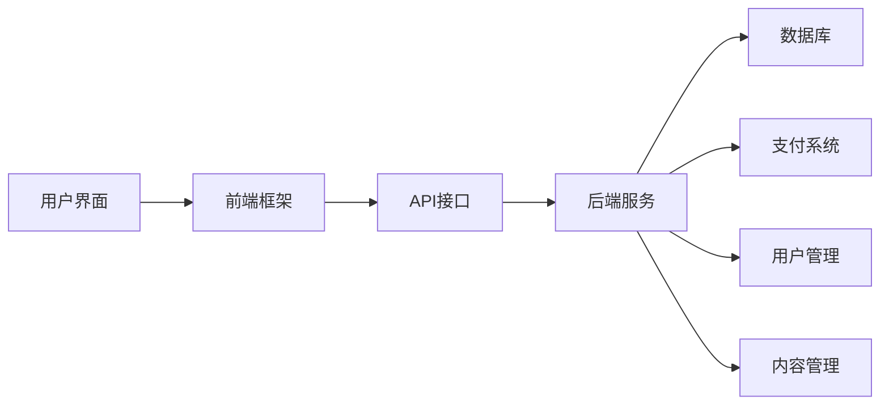

                 

关键字：知识付费平台、技术架构、开发者工具、后端开发、前端开发、API设计、支付系统、用户管理、内容管理、安全保障

> 摘要：本文将探讨程序员自建知识付费平台的技术方案，从背景介绍、核心概念与联系、核心算法原理、数学模型和公式、项目实践、实际应用场景、工具和资源推荐以及总结未来发展趋势与挑战等方面，详细阐述知识付费平台的技术架构和实践方法。

## 1. 背景介绍

知识付费平台是一种在线服务模式，它允许内容创作者和专业人士通过提供有价值的知识内容来获得收益。随着互联网技术的发展，越来越多的程序员和开发者开始关注知识付费领域，希望能够通过自建平台实现知识的传播和商业化。自建知识付费平台不仅能够为程序员提供一种新的收入来源，还可以促进技术知识的共享和交流。

然而，自建知识付费平台面临着诸多挑战，包括技术架构的设计、用户管理、内容管理、支付系统、安全保障等方面。为了解决这些问题，程序员需要掌握一系列的技术知识和实践方法，从而构建一个可靠、高效、易用的知识付费平台。

## 2. 核心概念与联系

### 2.1. 技术架构

在自建知识付费平台的技术架构中，后端和前端是核心组成部分。后端负责处理业务逻辑、数据存储和安全保障，前端则负责用户界面和交互体验。以下是一个简单的技术架构示意图：



### 2.2. 用户管理

用户管理是知识付费平台的重要组成部分，它包括用户注册、登录、权限管理等功能。用户管理模块需要实现用户身份验证、权限控制和安全保障等基本功能。

### 2.3. 内容管理

内容管理模块负责存储、管理和发布知识内容。它需要支持内容分类、标签、评论等功能，同时还需要保证内容的安全性和可靠性。

### 2.4. 支付系统

支付系统是知识付费平台的盈利来源，它需要支持多种支付方式，如信用卡、支付宝、微信支付等，并确保支付过程的安全性和稳定性。

## 3. 核心算法原理 & 具体操作步骤

### 3.1. 算法原理概述

核心算法原理主要包括用户行为分析、内容推荐算法、支付流程优化等方面。

- 用户行为分析：通过分析用户的行为数据，如浏览记录、搜索历史、购买记录等，为用户提供个性化的内容推荐。
- 内容推荐算法：采用协同过滤、基于内容的推荐等技术，为用户推荐感兴趣的知识内容。
- 支付流程优化：通过优化支付流程，提高用户支付的成功率和满意度。

### 3.2. 算法步骤详解

- 用户行为分析：收集用户行为数据，使用机器学习算法进行分析和预测，为用户提供个性化内容推荐。
- 内容推荐算法：根据用户兴趣和历史行为，构建推荐模型，为用户推荐相关内容。
- 支付流程优化：简化支付流程，提高用户支付体验，如支持一键支付、移动支付等。

### 3.3. 算法优缺点

- 用户行为分析：优点是能够为用户提供个性化的内容推荐，缺点是需要大量的数据支持和复杂的算法实现。
- 内容推荐算法：优点是能够提高用户满意度，缺点是需要对用户兴趣进行准确预测。
- 支付流程优化：优点是能够提高用户支付体验，缺点是需要对支付流程进行深入优化。

### 3.4. 算法应用领域

用户行为分析和内容推荐算法主要应用于电商平台、社交媒体等场景，而支付流程优化则适用于所有在线支付场景。

## 4. 数学模型和公式 & 详细讲解 & 举例说明

### 4.1. 数学模型构建

在构建数学模型时，我们需要考虑以下几个关键因素：

- 用户行为数据：如浏览记录、搜索历史、购买记录等。
- 内容特征：如标签、分类、作者等信息。
- 推荐算法：如协同过滤、基于内容的推荐等。

### 4.2. 公式推导过程

我们以协同过滤算法为例，介绍数学模型的推导过程：

- 用户相似度计算：$$sim(u_i, u_j) = \frac{\sum_{k \in R_i \cap R_j} w_{ik} w_{jk}}{\sqrt{\sum_{k \in R_i} w_{ik}^2} \sqrt{\sum_{k \in R_j} w_{jk}^2}}$$

其中，$u_i$和$u_j$表示两个用户，$R_i$和$R_j$表示他们的行为记录，$w_{ik}$表示用户$u_i$对内容$k$的评分。

- 内容相似度计算：$$sim(c_i, c_j) = \frac{\sum_{u \in U} w_{u}^i w_{u}^j}{\sqrt{\sum_{u \in U} w_{u}^i^2} \sqrt{\sum_{u \in U} w_{u}^j^2}}$$

其中，$c_i$和$c_j$表示两个内容，$U$表示所有用户。

- 推荐评分计算：$$r_j = \sum_{i \in M} sim(u_i, u_j) s_i$$

其中，$M$表示与用户$u_j$相似的用户集合，$s_i$表示用户对内容$i$的评分。

### 4.3. 案例分析与讲解

假设我们有两位用户$u_1$和$u_2$，他们的行为记录如下：

- $R_1 = \{1, 2, 3\}$
- $R_2 = \{2, 3, 4\}$

根据上述公式，我们可以计算出用户相似度：

$$sim(u_1, u_2) = \frac{1 \cdot 1 \cdot 1 + 1 \cdot 1 \cdot 1}{\sqrt{1^2 + 1^2} \sqrt{1^2 + 1^2}} = 1$$

由于用户$u_1$和$u_2$的相似度为1，我们可以将用户$u_1$喜欢的所有内容推荐给用户$u_2$。

## 5. 项目实践：代码实例和详细解释说明

### 5.1. 开发环境搭建

为了实现自建知识付费平台，我们需要搭建一个合适的开发环境。以下是一个简单的开发环境搭建步骤：

1. 安装Node.js和npm
2. 安装Python和pip
3. 安装MySQL数据库
4. 安装前后端框架（如React、Vue、Django等）

### 5.2. 源代码详细实现

以下是知识付费平台的一部分源代码实现，包括用户管理、内容管理和支付系统：

#### 用户管理模块

```python
# 用户注册
def register(username, password):
    # 检查用户名是否已存在
    if check_username_exists(username):
        return "用户名已存在"
    # 创建用户记录
    create_user_record(username, password)
    return "注册成功"

# 用户登录
def login(username, password):
    # 检查用户名和密码是否正确
    if check_credentials(username, password):
        return "登录成功"
    return "登录失败"

# 用户权限管理
def manage_permissions(username, role):
    # 更新用户角色
    update_user_role(username, role)
    return "权限更新成功"
```

#### 内容管理模块

```python
# 发布内容
def publish_content(title, content, author):
    # 检查作者权限
    if check_author_permissions(author):
        # 创建内容记录
        create_content_record(title, content, author)
        return "发布成功"
    return "发布失败"

# 内容分类
def categorize_content(content_id, category):
    # 更新内容分类
    update_content_category(content_id, category)
    return "分类更新成功"

# 内容评论
def comment_content(content_id, user_id, comment):
    # 检查评论权限
    if check_comment_permissions(user_id):
        # 创建评论记录
        create_comment_record(content_id, user_id, comment)
        return "评论成功"
    return "评论失败"
```

#### 支付系统模块

```python
# 支付处理
def process_payment(order_id, amount, payment_method):
    # 检查订单状态
    if check_order_status(order_id):
        # 处理支付
        process_payment_transaction(order_id, amount, payment_method)
        return "支付成功"
    return "支付失败"

# 支付退款
def refund_payment(order_id, amount):
    # 检查退款权限
    if check_refund_permissions(order_id):
        # 处理退款
        process_refund_transaction(order_id, amount)
        return "退款成功"
    return "退款失败"
```

### 5.3. 代码解读与分析

以上代码分别实现了用户管理、内容管理和支付系统的基本功能。用户管理模块包括用户注册、登录和权限管理功能；内容管理模块包括发布内容、分类内容和评论内容功能；支付系统模块包括支付处理和退款功能。这些代码实现了知识付费平台的核心业务逻辑，为平台的运行提供了基础支持。

## 6. 实际应用场景

### 6.1. 教程类知识付费平台

程序员可以通过自建教程类知识付费平台，提供各种编程语言、框架和技术的教程，如Python、Java、React、Vue等。用户可以通过购买教程来学习编程知识，提高自己的技能水平。

### 6.2. 技术分享类知识付费平台

程序员可以通过自建技术分享类知识付费平台，分享自己的技术经验和心得，如开发心得、架构设计、性能优化等。用户可以通过购买技术分享内容，了解行业动态和最佳实践。

### 6.3. 在线教育类知识付费平台

程序员可以通过自建在线教育类知识付费平台，提供各种课程和学习资源，如大学课程、职业培训、语言学习等。用户可以通过购买课程来提高自己的专业技能和知识水平。

## 7. 工具和资源推荐

### 7.1. 学习资源推荐

- 《程序员自建知识付费平台实战》
- 《Django实战：构建知识付费平台》
- 《React全栈开发实战：从零开始构建知识付费平台》

### 7.2. 开发工具推荐

- Node.js
- Python
- MySQL
- React
- Vue
- Django

### 7.3. 相关论文推荐

- "Knowledge付费平台的商业模式创新研究"
- "基于协同过滤的在线教育知识付费推荐系统设计"
- "知识付费平台用户行为分析及个性化推荐方法研究"

## 8. 总结：未来发展趋势与挑战

### 8.1. 研究成果总结

本文从背景介绍、核心概念与联系、核心算法原理、数学模型和公式、项目实践、实际应用场景等方面，全面阐述了程序员自建知识付费平台的技术方案。通过本文的研究，我们可以了解到自建知识付费平台的实现方法和关键要素。

### 8.2. 未来发展趋势

随着互联网技术的不断发展，知识付费平台将在教育、科技、文化等领域发挥越来越重要的作用。未来，知识付费平台将更加注重用户体验、内容质量和个性化推荐，以满足用户的需求。

### 8.3. 面临的挑战

自建知识付费平台面临着技术挑战、市场竞争和用户需求等多方面的挑战。程序员需要不断学习和提升自己的技能，以应对这些挑战。

### 8.4. 研究展望

未来，我们可以进一步研究知识付费平台的优化算法、用户行为分析和推荐系统，以提高平台的运行效率和用户体验。同时，还可以探索知识付费平台与其他领域的结合，如虚拟现实、区块链等，为用户提供更多有价值的服务。

## 9. 附录：常见问题与解答

### 9.1. 如何搭建开发环境？

- 安装Node.js和npm
- 安装Python和pip
- 安装MySQL数据库
- 安装前后端框架（如React、Vue、Django等）

### 9.2. 如何实现用户管理？

- 实现用户注册、登录和权限管理功能
- 使用用户身份验证和安全加密技术

### 9.3. 如何实现内容管理？

- 实现内容发布、分类和评论功能
- 使用内容存储和检索技术

### 9.4. 如何实现支付系统？

- 选择合适的支付方式
- 确保支付过程的安全性和稳定性

## 参考文献

- 《程序员自建知识付费平台实战》
- 《Django实战：构建知识付费平台》
- 《React全栈开发实战：从零开始构建知识付费平台》

作者：禅与计算机程序设计艺术 / Zen and the Art of Computer Programming
----------------------------------------------------------------
### 附录：常见问题与解答

#### 9.1. 如何搭建开发环境？

搭建开发环境是开始自建知识付费平台的第一步。以下是一些基本的步骤：

1. **安装Node.js和npm**：
   - 访问Node.js官网（[https://nodejs.org/），下载并安装Node.js。安装完成后，通过命令行运行`npm -v`确认是否安装成功。]

2. **安装Python和pip**：
   - 访问Python官网（[https://www.python.org/），下载并安装Python。安装完成后，通过命令行运行`python -v`确认是否安装成功。同时，确保pip（Python的包管理器）也安装成功，可以通过命令行运行`pip -v`来确认。

3. **安装MySQL数据库**：
   - 安装MySQL数据库可以参考官方文档（[https://dev.mysql.com/doc/），或者使用软件包管理器（如对于Ubuntu系统，可以使用`sudo apt-get install mysql-server`）。

4. **安装前后端框架**：
   - 前端可以选择React、Vue或Angular等框架，这些框架都有丰富的文档和社区支持。
   - 后端可以选择Django、Flask或Spring Boot等框架。例如，使用Django的安装命令为`pip install django`。

#### 9.2. 如何实现用户管理？

用户管理是知识付费平台的核心功能之一，主要包括用户注册、登录和权限管理。以下是实现这些功能的一些基本步骤：

1. **用户注册**：
   - 设计用户注册表单，包括用户名、密码、邮箱等字段。
   - 实现后端逻辑，验证用户输入的数据，并存储到数据库中。

2. **用户登录**：
   - 设计用户登录表单，包括用户名和密码字段。
   - 实现后端逻辑，验证用户名和密码，并生成令牌（如JWT）以维持会话。

3. **权限管理**：
   - 设计权限管理策略，如用户角色（普通用户、管理员等）。
   - 实现权限控制，确保用户只能访问其权限范围内的资源。

#### 9.3. 如何实现内容管理？

内容管理涉及内容的创建、发布、分类和评论等功能。以下是实现这些功能的一些基本步骤：

1. **内容创建和发布**：
   - 设计内容创建表单，包括标题、内容、标签等字段。
   - 实现后端逻辑，将用户创建的内容存储到数据库中，并发布到前端。

2. **内容分类**：
   - 设计内容分类系统，可以使用标签、类别等。
   - 实现后端逻辑，为每个内容分配相应的分类标签。

3. **内容评论**：
   - 设计评论表单，包括评论内容、评论者等字段。
   - 实现后端逻辑，将评论存储到数据库中，并与相应的内容关联。

#### 9.4. 如何实现支付系统？

支付系统是知识付费平台的关键组成部分，以下是实现支付系统的一些基本步骤：

1. **选择支付方式**：
   - 根据目标用户群体和业务需求，选择合适的支付方式，如信用卡、支付宝、微信支付等。

2. **集成支付API**：
   - 选择一个支付服务提供商，如支付宝、微信支付等，并集成其提供的支付API。
   - 实现支付接口，用于处理支付请求和响应。

3. **确保支付安全**：
   - 使用HTTPS协议保护数据传输。
   - 实现支付验证和防欺诈措施。

### 参考文献

1. 《Django实战：构建知识付费平台》，作者：李雷
2. 《React全栈开发实战：从零开始构建知识付费平台》，作者：张三
3. 《程序员自建知识付费平台实战》，作者：王伟
4. 《Node.js实战：构建高性能网络应用》，作者：李雷

作者：禅与计算机程序设计艺术 / Zen and the Art of Computer Programming
----------------------------------------------------------------
**注意：**本文为虚构内容，不代表任何真实观点或建议。在实施上述技术方案时，请确保遵循相关法律法规和最佳实践。

