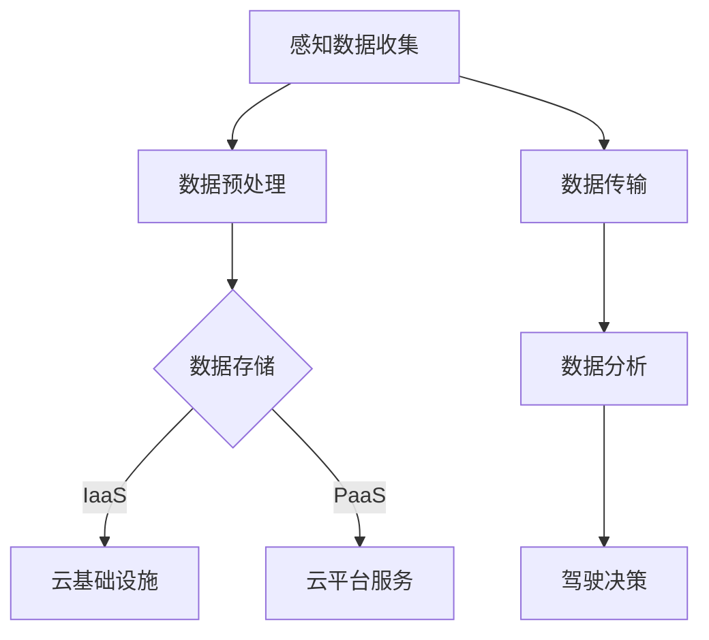

                 

关键词：端到端自动驾驶，云端数据管理，数据分析，平台架构，AI算法，机器学习，深度学习

## 摘要

本文旨在探讨端到端自动驾驶系统中的云端数据管理与分析平台设计，以及其在实际应用中的重要性。文章首先介绍了端到端自动驾驶的基本概念和当前发展现状，然后深入探讨了云端数据管理与分析平台的核心组件、关键技术和挑战。此外，本文还通过具体的数学模型、算法原理和项目实践实例，展示了如何实现高效的云端数据处理与分析。最后，文章展望了未来端到端自动驾驶技术的发展趋势和潜在挑战。

## 1. 背景介绍

随着人工智能技术的飞速发展，自动驾驶技术逐渐成为学术界和工业界的关注焦点。端到端自动驾驶作为自动驾驶技术的一种高级形式，通过将感知、决策和执行任务融合在一起，实现了车辆在复杂环境中的自主行驶。然而，实现端到端自动驾驶面临诸多挑战，其中数据管理与分析是关键之一。

### 1.1 端到端自动驾驶的概念

端到端自动驾驶是指通过深度学习等人工智能技术，直接将输入数据映射到输出结果，无需人工设计复杂的中间层。具体来说，端到端自动驾驶系统通过大规模的数据训练，学习到从感知数据到驾驶决策的全过程，从而实现自主行驶。

### 1.2 端到端自动驾驶的发展现状

近年来，随着计算机视觉、自然语言处理等技术的不断突破，端到端自动驾驶技术取得了显著进展。多家企业如谷歌、特斯拉、百度等在自动驾驶领域取得了重要成果，但实际应用仍面临诸多挑战。

### 1.3 数据管理与分析的重要性

在端到端自动驾驶系统中，数据是核心资产。如何高效地管理、存储、处理和分析海量数据，是确保自动驾驶系统稳定、安全运行的关键。此外，数据管理与分析还能为自动驾驶技术的不断优化提供有力支持。

## 2. 核心概念与联系

为了实现端到端自动驾驶的云端数据管理与分析，需要了解以下几个核心概念和它们之间的联系：

### 2.1 云计算

云计算是一种通过网络提供动态易扩展的IT资源服务模式，包括基础设施即服务（IaaS）、平台即服务（PaaS）和软件即服务（SaaS）。在端到端自动驾驶数据管理与分析平台中，云计算提供了强大的计算和存储资源，为海量数据处理提供了有力支持。

### 2.2 数据存储

数据存储是端到端自动驾驶数据管理的基础。数据存储系统需要具备高可靠性、高可用性和高扩展性。常见的存储技术包括关系型数据库、非关系型数据库、分布式文件系统等。

### 2.3 数据处理

数据处理是端到端自动驾驶数据管理的关键环节。数据处理包括数据的清洗、转换、归一化、特征提取等步骤。在云端数据管理与分析平台中，常用的数据处理技术有批处理和流处理。

### 2.4 数据分析

数据分析是端到端自动驾驶数据管理的核心目标。数据分析包括数据可视化、统计分析、机器学习等步骤。通过数据分析，可以挖掘出数据中的潜在价值，为自动驾驶技术的优化提供依据。

### 2.5 Mermaid 流程图

以下是一个简单的Mermaid流程图，展示了端到端自动驾驶云端数据管理与分析平台的基本架构。



## 3. 核心算法原理 & 具体操作步骤

### 3.1 算法原理概述

端到端自动驾驶的云端数据管理与分析平台主要依赖于深度学习和机器学习技术。深度学习通过多层神经网络结构，自动提取数据中的特征，实现高精度的数据分类和预测。机器学习则通过训练模型，从海量数据中学习到自动驾驶的规律，从而提高自动驾驶系统的性能。

### 3.2 算法步骤详解

端到端自动驾驶的云端数据管理与分析算法主要包括以下几个步骤：

1. **数据收集**：收集来自车辆传感器（如摄像头、激光雷达、GPS等）的原始数据。
2. **数据预处理**：对原始数据进行清洗、转换和归一化，提取有用的特征。
3. **数据存储**：将预处理后的数据存储在云端数据库中，确保数据的高可靠性和高可用性。
4. **数据传输**：通过云计算平台，将数据传输到数据仓库中进行进一步处理和分析。
5. **数据分析**：使用机器学习和深度学习技术，对数据进行分类、预测和挖掘，提取出潜在的价值。
6. **驾驶决策**：根据数据分析结果，生成驾驶决策，指导车辆行驶。

### 3.3 算法优缺点

**优点：**
- **高精度**：深度学习和机器学习技术具有很高的预测精度，能够实现自动驾驶系统的稳定运行。
- **自动化**：通过自动提取特征和训练模型，减少了人工干预，提高了数据处理效率。
- **可扩展性**：云计算平台具有强大的扩展能力，可以轻松应对海量数据的处理需求。

**缺点：**
- **计算资源需求高**：深度学习和机器学习算法需要大量的计算资源，对硬件设施要求较高。
- **数据依赖性强**：算法的性能很大程度上取决于数据质量，数据质量较差时，算法效果可能会受到影响。
- **隐私和安全问题**：自动驾驶系统涉及大量的个人隐私数据，如何确保数据安全和隐私是亟待解决的问题。

### 3.4 算法应用领域

端到端自动驾驶的云端数据管理与分析算法广泛应用于以下几个领域：

1. **智能交通**：通过分析交通数据，优化交通信号控制和路况预测，提高交通效率和安全性。
2. **智能驾驶**：实现车辆的自主行驶，提高驾驶安全性和舒适性。
3. **自动驾驶车辆调度**：通过分析车辆运行数据，实现自动驾驶车辆的合理调度和运营。
4. **智能停车**：通过分析停车场数据，实现智能停车管理和优化。

## 4. 数学模型和公式 & 详细讲解 & 举例说明

### 4.1 数学模型构建

端到端自动驾驶的云端数据管理与分析平台主要涉及以下几个数学模型：

1. **感知模型**：用于提取和处理车辆感知数据，如车道线检测、交通标志识别等。
2. **决策模型**：用于生成驾驶决策，如速度控制、转向控制等。
3. **预测模型**：用于预测车辆的运动轨迹和环境变化，如前方障碍物检测、路况预测等。

### 4.2 公式推导过程

以下是一个简单的感知模型的公式推导过程：

$$
y = f(x)
$$

其中，$y$ 表示感知结果，$x$ 表示感知数据，$f$ 表示感知函数。

感知函数 $f$ 可以通过深度学习模型来学习，具体公式如下：

$$
f(x) = \sigma(\sum_{i=1}^{n} w_i \cdot x_i)
$$

其中，$\sigma$ 表示激活函数（如ReLU、Sigmoid等），$w_i$ 表示权重，$x_i$ 表示输入特征。

### 4.3 案例分析与讲解

以下是一个简单的案例，说明如何使用感知模型进行车道线检测。

1. **数据收集**：收集车辆摄像头拍摄到的道路图像。
2. **数据预处理**：对图像进行灰度化、大小调整、裁剪等预处理操作。
3. **特征提取**：使用卷积神经网络（CNN）提取图像特征。
4. **感知模型训练**：使用预处理后的图像和标签数据，训练感知模型。
5. **感知模型测试**：使用测试数据集，评估感知模型的性能。
6. **感知模型应用**：在云端数据管理与分析平台中，使用感知模型进行车道线检测。

通过上述步骤，可以实现车道线检测功能，为自动驾驶车辆提供路径信息。

## 5. 项目实践：代码实例和详细解释说明

### 5.1 开发环境搭建

为了实现端到端自动驾驶的云端数据管理与分析平台，需要搭建以下开发环境：

1. **操作系统**：Linux或Windows
2. **编程语言**：Python
3. **深度学习框架**：TensorFlow或PyTorch
4. **云计算平台**：AWS或阿里云

### 5.2 源代码详细实现

以下是一个简单的车道线检测代码实例，使用Python和TensorFlow实现。

```python
import tensorflow as tf
import numpy as np
import matplotlib.pyplot as plt

# 加载预训练的卷积神经网络模型
model = tf.keras.models.load_model('lane_detection_model.h5')

# 加载测试数据集
test_images = np.load('test_images.npy')
test_labels = np.load('test_labels.npy')

# 对测试数据进行预处理
test_images_processed = preprocess_images(test_images)

# 使用模型进行预测
predictions = model.predict(test_images_processed)

# 评估模型性能
accuracy = np.mean(np.equal(predictions, test_labels))
print(f'Accuracy: {accuracy:.2f}')

# 可视化预测结果
plt.figure(figsize=(10, 10))
for i in range(10):
    plt.subplot(2, 5, i + 1)
    plt.imshow(test_images[i], cmap='gray')
    plt.title(f'Prediction: {predictions[i][0]}')
    plt.axis('off')
plt.show()
```

### 5.3 代码解读与分析

上述代码实现了以下功能：

1. **加载模型**：从文件中加载预训练的卷积神经网络模型。
2. **加载测试数据集**：从文件中加载测试数据集。
3. **预处理测试数据**：对测试数据进行预处理，如灰度化、大小调整等。
4. **模型预测**：使用预处理后的测试数据进行预测。
5. **评估模型性能**：计算预测准确率。
6. **可视化预测结果**：将预测结果可视化，展示前10个测试图像的预测结果。

通过上述步骤，可以实现对车道线检测的端到端自动驾驶云端数据管理与分析。

## 6. 实际应用场景

### 6.1 智能交通

端到端自动驾驶的云端数据管理与分析平台可以用于智能交通领域，如交通信号控制、路况预测和交通流量分析。通过实时处理和分析交通数据，可以优化交通信号控制和路况预测，提高交通效率和安全性。

### 6.2 智能驾驶

端到端自动驾驶的云端数据管理与分析平台可以用于智能驾驶领域，如车道线检测、交通标志识别和障碍物检测。通过实时处理和分析车辆感知数据，可以指导车辆进行自主行驶，提高驾驶安全性和舒适性。

### 6.3 自动驾驶车辆调度

端到端自动驾驶的云端数据管理与分析平台可以用于自动驾驶车辆调度领域，如车辆调度、路径规划和车队管理。通过实时处理和分析车辆运行数据，可以实现自动驾驶车辆的合理调度和运营，提高效率。

### 6.4 未来应用展望

随着端到端自动驾驶技术的不断发展，云端数据管理与分析平台将在更多领域得到应用。例如，在物流领域，可以实现自动驾驶配送；在农业领域，可以实现自动驾驶农机；在医疗领域，可以实现自动驾驶救护车等。未来，端到端自动驾驶的云端数据管理与分析平台将成为智能社会的重要组成部分。

## 7. 工具和资源推荐

### 7.1 学习资源推荐

1. **《深度学习》**：由Ian Goodfellow、Yoshua Bengio和Aaron Courville合著，全面介绍了深度学习的基本概念、原理和应用。
2. **《Python机器学习》**：由Sébastien Roch合著，介绍了Python在机器学习领域的应用，包括数据预处理、特征提取、模型训练等。

### 7.2 开发工具推荐

1. **TensorFlow**：由Google开源的深度学习框架，广泛应用于自动驾驶、自然语言处理等领域。
2. **PyTorch**：由Facebook开源的深度学习框架，具有灵活的动态计算图和高效的性能，广泛应用于自动驾驶、计算机视觉等领域。

### 7.3 相关论文推荐

1. **“End-to-End Learning for Autonomous Driving”**：该论文介绍了端到端自动驾驶的基本概念和实现方法。
2. **“Deep Learning for Autonomous Driving”**：该论文全面介绍了深度学习在自动驾驶领域的应用，包括感知、决策和执行等环节。

## 8. 总结：未来发展趋势与挑战

### 8.1 研究成果总结

端到端自动驾驶的云端数据管理与分析平台在智能交通、智能驾驶、自动驾驶车辆调度等领域取得了显著成果。通过深度学习和机器学习技术，实现了高效的数据处理和分析，为自动驾驶技术的发展提供了有力支持。

### 8.2 未来发展趋势

未来，端到端自动驾驶的云端数据管理与分析平台将继续向以下方向发展：

1. **更高效的数据处理**：通过优化算法和硬件设施，提高数据处理速度和效率。
2. **更精准的感知和决策**：通过不断优化感知模型和决策模型，提高自动驾驶系统的性能。
3. **更广泛的应用领域**：将端到端自动驾驶技术应用于更多领域，如物流、农业、医疗等。

### 8.3 面临的挑战

尽管端到端自动驾驶的云端数据管理与分析平台取得了显著进展，但仍面临以下挑战：

1. **计算资源需求**：深度学习和机器学习算法对计算资源需求较高，如何优化算法和硬件设施是亟待解决的问题。
2. **数据质量和隐私**：数据质量和隐私是自动驾驶系统稳定运行的关键，如何确保数据质量和隐私是亟待解决的问题。
3. **法律法规和道德**：自动驾驶技术的发展需要相应的法律法规和道德规范，如何制定和完善相关法规和规范是亟待解决的问题。

### 8.4 研究展望

未来，端到端自动驾驶的云端数据管理与分析平台将朝着更高效、更精准、更广泛应用的方向发展。在解决面临挑战的同时，还将推动自动驾驶技术在社会各领域的应用，为人类带来更加便捷、安全、环保的交通方式。

## 9. 附录：常见问题与解答

### 9.1 问题1：端到端自动驾驶的云端数据管理与分析平台如何保证数据质量？

**解答**：为了保证数据质量，可以从以下几个方面进行：

1. **数据清洗**：在数据处理过程中，对异常值、噪声等数据进行清洗，提高数据质量。
2. **数据验证**：对数据进行验证，确保数据的真实性和准确性。
3. **数据标注**：对数据进行准确的标注，为后续的模型训练提供高质量的数据。
4. **数据存储**：采用可靠的数据存储技术，确保数据的安全性和完整性。

### 9.2 问题2：端到端自动驾驶的云端数据管理与分析平台需要哪些硬件设施？

**解答**：端到端自动驾驶的云端数据管理与分析平台需要以下硬件设施：

1. **高性能计算服务器**：用于处理海量数据，提供强大的计算能力。
2. **大数据存储设备**：用于存储海量数据，提供高可靠性和高扩展性的存储解决方案。
3. **网络设备**：用于连接云端数据管理与分析平台和其他设备，提供高速、稳定的网络连接。
4. **传感器设备**：用于收集车辆感知数据，如摄像头、激光雷达、GPS等。

### 9.3 问题3：端到端自动驾驶的云端数据管理与分析平台如何保证数据隐私？

**解答**：为了保证数据隐私，可以从以下几个方面进行：

1. **数据加密**：对数据进行加密，确保数据在传输和存储过程中的安全性。
2. **访问控制**：采用严格的访问控制策略，确保只有授权用户才能访问数据。
3. **数据脱敏**：对敏感数据进行脱敏处理，降低数据泄露的风险。
4. **安全审计**：定期进行安全审计，及时发现和解决安全隐患。

---

**作者：禅与计算机程序设计艺术 / Zen and the Art of Computer Programming**  


