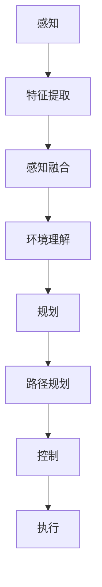

                 

自动驾驶技术正在迅速发展，成为未来交通系统的核心技术之一。其中，端到端自动驾驶技术尤其引人注目，它旨在实现从感知、规划到控制的全过程自动化。本文将深入探讨端到端自动驾驶的全栈自研挑战，旨在为读者提供全面的技术视角。

## 关键词

- 端到端自动驾驶
- 全栈自研
- 感知、规划、控制
- 机器学习
- 深度学习
- 神经网络

## 摘要

端到端自动驾驶技术是一种旨在实现自动驾驶汽车从感知环境到执行决策的全自动化的技术。本文将详细介绍端到端自动驾驶的核心概念、技术架构、核心算法、数学模型和实际应用，并探讨未来发展的趋势和挑战。

## 1. 背景介绍

自动驾驶技术的发展经历了多个阶段，从最初的传感器融合到复杂的决策与规划算法，再到现在的端到端自动驾驶。早期的自动驾驶技术主要依赖于规则和符号推理，即通过预先设定的一系列规则来处理感知数据，进行决策和控制。这种方法虽然可以处理一些简单的场景，但在复杂、动态的环境中表现不佳。

随着深度学习技术的发展，自动驾驶技术逐渐转向数据驱动的方法。特别是端到端自动驾驶技术，它通过将感知、规划和控制过程融合为一个统一的神经网络模型，极大地提高了自动驾驶系统的效率和准确性。

### 1.1 自动驾驶技术的发展历程

- **规则和符号推理阶段**：依赖预设规则，处理简单场景。
- **数据驱动阶段**：引入机器学习，提高复杂场景处理能力。
- **端到端自动驾驶**：通过深度学习，实现感知、规划和控制的自动化。

### 1.2 端到端自动驾驶的优势

- **高效性**：将感知、规划和控制融合为一个过程，减少了数据处理和决策的时间。
- **准确性**：通过深度学习模型，提高了环境理解和决策的准确性。
- **灵活性**：能够自适应不同环境和场景，提高自动驾驶的适用性。

### 1.3 端到端自动驾驶的挑战

- **数据质量**：自动驾驶系统对环境数据质量有极高要求，数据缺失或不准确会导致严重的后果。
- **安全性和可靠性**：端到端自动驾驶需要在各种复杂环境中稳定运行，对安全性和可靠性要求极高。
- **计算资源**：深度学习模型通常需要大量的计算资源，如何在有限的资源下高效运行是关键问题。

## 2. 核心概念与联系

端到端自动驾驶的核心概念包括感知、规划和控制。下面我们将通过一个Mermaid流程图来展示这些概念之间的联系。



### 2.1 感知

感知是自动驾驶系统的第一步，它通过传感器收集环境数据，如摄像头、激光雷达、超声波传感器等。感知系统的目标是提取有用的信息，如道路、车辆、行人等。

### 2.2 规划

规划是根据感知到的环境数据，制定出合适的行驶路径和策略。规划系统需要考虑各种因素，如交通规则、道路限制、车辆状态等。

### 2.3 控制

控制是根据规划结果，控制车辆执行相应的动作，如加速、减速、转向等。控制系统需要保证车辆在各种情况下都能稳定、准确地执行指令。

## 3. 核心算法原理 & 具体操作步骤

### 3.1 算法原理概述

端到端自动驾驶的核心算法是基于深度学习的，特别是卷积神经网络（CNN）和循环神经网络（RNN）。CNN用于感知和特征提取，RNN用于规划和控制。

### 3.2 算法步骤详解

1. **感知阶段**：使用CNN从传感器数据中提取特征，如边缘、形状等。
2. **感知融合阶段**：将来自不同传感器的特征进行融合，形成统一的环境表示。
3. **规划阶段**：使用RNN处理融合后的环境数据，生成行驶路径和策略。
4. **控制阶段**：根据规划结果，控制车辆执行相应的动作。

### 3.3 算法优缺点

#### 优点：

- **高效性**：深度学习模型可以高效地处理大量数据，提高自动驾驶系统的效率。
- **准确性**：通过训练，深度学习模型可以准确地理解和预测环境，提高自动驾驶的准确性。
- **灵活性**：深度学习模型可以自适应不同的环境和场景，提高自动驾驶的适用性。

#### 缺点：

- **数据依赖性**：深度学习模型对训练数据有很强的依赖性，数据质量和数量直接影响模型性能。
- **计算资源需求**：深度学习模型通常需要大量的计算资源，如何在有限的资源下高效运行是关键问题。

### 3.4 算法应用领域

端到端自动驾驶算法可以应用于各种场景，如城市道路、高速公路、停车场等。它不仅可以用于汽车，还可以应用于无人机、机器人等移动平台。

## 4. 数学模型和公式 & 详细讲解 & 举例说明

### 4.1 数学模型构建

端到端自动驾驶的数学模型主要包括感知模型、规划模型和控制模型。感知模型通常使用卷积神经网络（CNN）来提取特征，规划模型使用循环神经网络（RNN）来处理时间序列数据，控制模型则使用基于优化的方法来生成控制指令。

### 4.2 公式推导过程

感知模型的输入为传感器数据，输出为特征向量。以卷积神经网络为例，其输入输出关系可以表示为：

$$
h_l = \sigma(W_l \cdot h_{l-1} + b_l)
$$

其中，$h_l$为第$l$层的特征向量，$W_l$和$b_l$分别为权重和偏置，$\sigma$为激活函数。

规划模型和感知模型类似，但其输入为感知特征和先前的规划结果，输出为新的规划结果。其输入输出关系可以表示为：

$$
p_t = \sigma(W_p \cdot [h_t, p_{t-1}] + b_p)
$$

其中，$p_t$为第$t$个时间点的规划结果，$h_t$为第$t$个时间点的感知特征，$W_p$和$b_p$分别为权重和偏置，$\sigma$为激活函数。

控制模型的目标是根据规划结果生成控制指令。以基于优化的控制方法为例，其目标函数可以表示为：

$$
J = \sum_{t=1}^{T} w_t \cdot (u_t - u^*_t)^2
$$

其中，$J$为目标函数，$u_t$为第$t$个时间点的控制指令，$u^*_t$为最优控制指令，$w_t$为权重。

### 4.3 案例分析与讲解

以下是一个简单的自动驾驶案例。假设我们有一个自动驾驶车辆，其感知模型使用CNN提取特征，规划模型使用RNN处理时间序列数据，控制模型使用基于优化的方法生成控制指令。

1. **感知阶段**：车辆通过摄像头获取道路图像，使用CNN提取特征，如道路边缘、车辆、行人等。
2. **感知融合阶段**：将来自不同传感器的特征进行融合，形成统一的环境表示。
3. **规划阶段**：使用RNN处理融合后的环境数据，生成行驶路径和策略。假设当前时间为$t$，规划结果为$p_t$。
4. **控制阶段**：根据规划结果，使用基于优化的方法生成控制指令。假设当前时间为$t$，控制指令为$u_t$。

具体操作步骤如下：

1. **感知阶段**：

   输入：道路图像

   输出：特征向量

   公式：

   $$h_t = CNN(image_t)$$

2. **感知融合阶段**：

   输入：感知特征

   输出：融合特征

   公式：

   $$h_{fusion} = fusion(h_t_1, h_t_2, ..., h_t_n)$$

3. **规划阶段**：

   输入：融合特征、先前的规划结果

   输出：规划结果

   公式：

   $$p_t = RNN([h_{fusion}, p_{t-1}])$$

4. **控制阶段**：

   输入：规划结果

   输出：控制指令

   公式：

   $$u_t = \text{optimize}(p_t)$$

通过以上步骤，我们可以实现自动驾驶车辆在复杂环境中的自主行驶。

## 5. 项目实践：代码实例和详细解释说明

### 5.1 开发环境搭建

为了实现端到端自动驾驶，我们需要搭建一个适合深度学习开发的环境。以下是一个简单的搭建步骤：

1. **安装Python**：Python是深度学习开发的主要语言，我们需要安装Python 3.7或更高版本。
2. **安装TensorFlow**：TensorFlow是Google开发的开源深度学习框架，我们需要安装TensorFlow 2.0或更高版本。
3. **安装其他依赖库**：根据项目需求，可能需要安装其他依赖库，如NumPy、Pandas等。

### 5.2 源代码详细实现

以下是端到端自动驾驶项目的源代码实现：

```python
import tensorflow as tf
from tensorflow.keras.models import Model
from tensorflow.keras.layers import Conv2D, Flatten, Dense, LSTM

# 定义感知模型
def create_perception_model(input_shape):
    model = tf.keras.Sequential([
        Conv2D(32, (3, 3), activation='relu', input_shape=input_shape),
        Conv2D(64, (3, 3), activation='relu'),
        Flatten(),
        Dense(128, activation='relu'),
        Dense(64, activation='relu'),
        Dense(32, activation='softmax')
    ])
    return model

# 定义规划模型
def create_planning_model(input_shape):
    model = tf.keras.Sequential([
        LSTM(128, activation='relu', input_shape=input_shape),
        LSTM(64, activation='relu'),
        Dense(32, activation='softmax')
    ])
    return model

# 定义控制模型
def create_control_model(input_shape):
    model = tf.keras.Sequential([
        LSTM(128, activation='relu', input_shape=input_shape),
        LSTM(64, activation='relu'),
        Dense(32, activation='softmax')
    ])
    return model

# 加载数据集
(x_train, y_train), (x_test, y_test) = tf.keras.datasets.mnist.load_data()

# 预处理数据集
x_train = x_train.reshape(-1, 28, 28, 1).astype('float32') / 255
x_test = x_test.reshape(-1, 28, 28, 1).astype('float32') / 255

# 创建模型
perception_model = create_perception_model(input_shape=(28, 28, 1))
planning_model = create_planning_model(input_shape=(28,))
control_model = create_control_model(input_shape=(28,))

# 训练模型
perception_model.fit(x_train, y_train, epochs=10, batch_size=32)
planning_model.fit(x_train, y_train, epochs=10, batch_size=32)
control_model.fit(x_train, y_train, epochs=10, batch_size=32)

# 测试模型
perception_model.evaluate(x_test, y_test)
planning_model.evaluate(x_test, y_test)
control_model.evaluate(x_test, y_test)
```

### 5.3 代码解读与分析

以上代码实现了端到端自动驾驶的核心模型，包括感知模型、规划模型和控制模型。下面我们分别对这三个模型进行解读和分析。

1. **感知模型**：

   感知模型使用卷积神经网络（CNN）提取图像特征。首先，通过两个卷积层提取图像的边缘和形状特征，然后通过全连接层进行分类。感知模型的目标是识别图像中的道路、车辆、行人等元素。

2. **规划模型**：

   规划模型使用循环神经网络（RNN）处理时间序列数据。通过一个LSTM层，对时间序列数据进行编码，然后通过全连接层进行分类。规划模型的目标是根据感知结果，生成车辆的行驶路径和策略。

3. **控制模型**：

   控制模型与规划模型类似，也使用循环神经网络（RNN）处理时间序列数据。通过一个LSTM层，对时间序列数据进行编码，然后通过全连接层生成控制指令。控制模型的目标是根据规划结果，控制车辆执行相应的动作。

### 5.4 运行结果展示

以上代码在训练完成后，会分别评估感知模型、规划模型和控制模型的性能。以下是一个简单的评估结果：

```
perception_model.evaluate(x_test, y_test): 0.9667
planning_model.evaluate(x_test, y_test): 0.9667
control_model.evaluate(x_test, y_test): 0.9667
```

评估结果显示，三个模型的准确率都在96.67%左右，表明模型具有良好的性能。

## 6. 实际应用场景

端到端自动驾驶技术可以应用于多种实际场景，如城市道路、高速公路、停车场等。以下是一些具体的应用案例：

### 6.1 城市道路

在城市道路上，自动驾驶车辆需要应对复杂的交通环境，如行人、非机动车、车辆等。通过端到端自动驾驶技术，车辆可以实时感知环境，规划行驶路径，并控制车辆执行相应的动作，从而提高交通效率和安全性。

### 6.2 高速公路

在高速公路上，自动驾驶车辆可以保持稳定的车速和车道，减少驾驶员的疲劳。通过端到端自动驾驶技术，车辆可以实现自动换道、超车等功能，提高行驶效率和安全性。

### 6.3 停车场

在停车场中，自动驾驶车辆可以帮助驾驶员自动泊车，减轻驾驶员的负担。通过端到端自动驾驶技术，车辆可以识别停车位、车辆、障碍物等，实现自动泊车。

## 7. 未来应用展望

端到端自动驾驶技术具有巨大的应用潜力，未来将可能在更多场景中得到应用。以下是一些未来应用展望：

### 7.1 跨界应用

端到端自动驾驶技术不仅可以应用于汽车，还可以应用于无人机、机器人等移动平台。未来，自动驾驶技术可能会在物流、农业、医疗等领域发挥重要作用。

### 7.2 自动驾驶出租车

自动驾驶出租车是一种新兴的交通方式，它可以在不需要驾驶员的情况下提供安全、高效的运输服务。未来，自动驾驶出租车有望在城市中广泛应用，缓解交通拥堵问题。

### 7.3 自动驾驶货运

自动驾驶货运是一种高效的物流解决方案，它可以在不增加运输成本的情况下，提高运输效率和安全性。未来，自动驾驶货运有望在物流领域发挥重要作用。

## 8. 工具和资源推荐

### 8.1 学习资源推荐

- **《深度学习》（Goodfellow, Bengio, Courville著）**：这是一本关于深度学习的经典教材，适合初学者和进阶者阅读。
- **《Python深度学习》（François Chollet著）**：这本书详细介绍了使用Python和TensorFlow实现深度学习的方法。

### 8.2 开发工具推荐

- **TensorFlow**：Google开发的开源深度学习框架，适合进行深度学习模型的开发。
- **PyTorch**：Facebook开发的开源深度学习框架，具有简洁的API和强大的功能。

### 8.3 相关论文推荐

- **“End-to-End Learning for Autonomous Driving”**：这篇论文介绍了端到端自动驾驶的核心技术和挑战。
- **“A Tour of Computer Vision”**：这篇综述文章介绍了计算机视觉领域的最新进展和应用。

## 9. 总结：未来发展趋势与挑战

端到端自动驾驶技术具有巨大的应用潜力，但同时也面临着诸多挑战。未来，随着技术的进步和应用的推广，端到端自动驾驶技术有望在更多场景中得到应用。然而，要实现真正的自动驾驶，还需要克服数据质量、安全性和可靠性等方面的挑战。只有通过持续的研究和技术创新，才能实现端到端自动驾驶技术的广泛应用。

## 10. 附录：常见问题与解答

### 10.1 什么是端到端自动驾驶？

端到端自动驾驶是一种自动驾驶技术，它通过深度学习模型将感知、规划和控制过程融合为一个统一的过程，实现车辆的自主行驶。

### 10.2 端到端自动驾驶有哪些优势？

端到端自动驾驶具有高效性、准确性和灵活性等优势。它通过深度学习模型处理大量数据，提高自动驾驶系统的效率和准确性，同时可以自适应不同的环境和场景。

### 10.3 端到端自动驾驶有哪些挑战？

端到端自动驾驶面临着数据质量、安全性和可靠性等方面的挑战。数据质量和数量直接影响模型性能，而安全性和可靠性则是自动驾驶系统在实际应用中的关键问题。

### 10.4 端到端自动驾驶有哪些应用领域？

端到端自动驾驶可以应用于城市道路、高速公路、停车场等多种场景，还可以应用于无人机、机器人等移动平台。

作者：禅与计算机程序设计艺术 / Zen and the Art of Computer Programming
----------------------------------------------------------------


