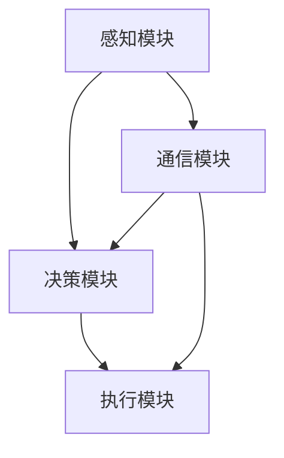

                 

关键词：端到端自动驾驶、分布式轨迹优化控制、车辆协同、人工智能、深度学习、轨迹规划、动态规划、路径规划、交通流优化、车队管理、安全性、效率、实时性、车辆通信、自动驾驶算法

## 摘要

随着人工智能和自动驾驶技术的快速发展，端到端自动驾驶系统已经成为智能交通领域的研究热点。轨迹优化控制是自动驾驶系统中的一个关键环节，它决定了车辆的路径规划和行驶策略。本文将介绍一种基于分布式轨迹优化控制的端到端自动驾驶系统，探讨其核心概念、算法原理、数学模型以及实际应用。通过对算法的详细解读和案例实践，本文旨在为研究人员和工程师提供有价值的参考，并展望未来自动驾驶技术的发展趋势和面临的挑战。

## 1. 背景介绍

### 自动驾驶技术的发展

自动驾驶技术是指利用计算机系统实现车辆自主驾驶的技术，其目标是使车辆能够在无需人工干预的情况下安全、高效地行驶。自动驾驶技术的发展历程可以分为几个阶段：

1. **辅助驾驶**：这一阶段主要是通过传感器和计算机系统提供驾驶辅助功能，如自适应巡航控制、自动泊车等。
2. **部分自动驾驶**：车辆可以在特定条件下实现部分自动驾驶功能，如高速公路自动驾驶、自动换道等。
3. **高度自动驾驶**：车辆可以在更多复杂环境下实现自动驾驶，但仍然需要驾驶员在某些情况下接管控制。
4. **完全自动驾驶**：车辆在所有驾驶环境下都能实现自主驾驶，无需人工干预。

### 端到端自动驾驶的意义

端到端自动驾驶是指通过深度学习和人工智能技术，将感知、决策和执行等过程集成到一个统一的框架中，实现车辆的自主驾驶。相较于传统的分阶段开发方法，端到端自动驾驶具有以下优势：

1. **提高效率**：通过统一的算法框架，减少了不同模块之间的通信和协调成本。
2. **降低复杂度**：将多个子系统集成到一起，简化了系统设计和实现过程。
3. **增强安全性**：通过深度学习和强化学习等技术，自动驾驶系统能够更好地适应复杂和不确定的交通环境。

### 轨迹优化控制的重要性

轨迹优化控制是自动驾驶系统中至关重要的一环，它决定了车辆的行驶路径和速度。轨迹优化控制的目标是在满足行驶安全性和舒适性的同时，最大化车辆的行驶效率。具体来说，轨迹优化控制需要解决以下问题：

1. **路径规划**：确定车辆的行驶路径，通常基于环境感知和交通状况进行动态调整。
2. **速度控制**：根据行驶路径和交通状况，调整车辆的速度，确保行驶安全。
3. **轨迹平滑**：优化行驶轨迹的平滑性，减少车辆在行驶过程中的剧烈波动。

### 分布式轨迹优化控制的必要性

在复杂的交通环境中，单车的轨迹优化控制可能无法应对复杂多变的交通状况。分布式轨迹优化控制通过多车辆协同工作，实现更高效的轨迹优化和行驶控制。具体来说，分布式轨迹优化控制的优势包括：

1. **协同决策**：通过多车辆间的信息共享和协同决策，提高整个车队的行驶效率和安全性。
2. **动态调整**：分布式系统可以根据实时感知到的交通状况，快速调整行驶策略，提高应对复杂交通环境的能力。
3. **容错性**：分布式系统具有较高的容错性，即使在部分车辆发生故障的情况下，其他车辆仍然能够正常运行，确保整个车队的稳定性。

### 总结

本文将详细介绍端到端自动驾驶的分布式轨迹优化控制技术，包括核心概念、算法原理、数学模型以及实际应用。通过本文的阐述，读者将能够了解分布式轨迹优化控制在自动驾驶系统中的重要性，以及如何实现高效、安全和稳定的车辆协同控制。

## 2. 核心概念与联系

### 自动驾驶系统架构

要理解分布式轨迹优化控制，首先需要了解自动驾驶系统的整体架构。一个典型的自动驾驶系统可以分为以下几个模块：

1. **感知模块**：负责收集环境信息，如路面情况、车辆位置、交通标志等。常用的感知技术包括雷达、激光雷达（LiDAR）、摄像头等。
2. **决策模块**：根据感知模块收集到的信息，进行路径规划和行驶策略的决策。决策模块通常包括轨迹规划、行为规划等子模块。
3. **执行模块**：负责将决策模块生成的控制指令转换为车辆的实际操作，包括油门、刹车、转向等。
4. **通信模块**：负责车辆之间的信息交换，如车速、位置、行驶方向等。通信模块是实现分布式轨迹优化控制的关键。

### 轨迹优化控制的基本概念

轨迹优化控制是自动驾驶系统中的核心部分，它主要解决以下问题：

1. **路径规划**：确定车辆的行驶路径，通常使用基于图论、人工势场、遗传算法等算法实现。
2. **轨迹生成**：在给定路径的基础上，生成车辆在各个时间点的期望位置和速度，以实现平滑的行驶轨迹。
3. **轨迹跟踪**：根据车辆的当前位置和速度，实时调整行驶轨迹，使其尽量接近期望轨迹。

### 分布式轨迹优化控制的概念

分布式轨迹优化控制是指通过多个车辆之间的信息共享和协同工作，实现整体车队的轨迹优化。其主要特点包括：

1. **信息共享**：车辆之间通过通信模块交换信息，如车速、位置、行驶方向等，以便共同优化整个车队的行驶轨迹。
2. **协同决策**：车辆根据共享的信息，共同制定行驶策略，确保车队在复杂交通环境下的高效、安全行驶。
3. **动态调整**：分布式系统可以根据实时感知到的交通状况，快速调整行驶策略，提高整个车队的适应能力。

### 关联与联系

分布式轨迹优化控制与自动驾驶系统的其他模块紧密相关。具体来说：

1. **感知模块**：提供环境信息，为轨迹规划和决策提供基础。
2. **决策模块**：根据感知模块提供的信息，生成行驶策略。
3. **执行模块**：将决策模块生成的控制指令转换为车辆的实际操作。
4. **通信模块**：实现车辆之间的信息共享和协同决策。

### Mermaid 流程图

以下是一个简化的分布式轨迹优化控制的 Mermaid 流程图，展示了各模块之间的关系：



通过这个流程图，我们可以清晰地看到分布式轨迹优化控制中各模块之间的关联和互动。

### 总结

在分布式轨迹优化控制中，各模块之间的紧密协作和高效信息共享是实现高效、安全和稳定行驶的关键。理解这些核心概念和它们之间的联系，有助于我们更好地设计和实现自动驾驶系统中的轨迹优化控制。

## 3. 核心算法原理 & 具体操作步骤

### 3.1 算法原理概述

分布式轨迹优化控制算法的核心思想是通过多个车辆的协同工作，实现整体车队的最优行驶轨迹。为了实现这一目标，算法需要解决以下几个关键问题：

1. **路径规划**：确定每个车辆的行驶路径，以满足车队整体行驶效率和安全性要求。
2. **速度控制**：在给定路径的基础上，调整车辆的速度，使其满足行驶轨迹的要求。
3. **信息共享**：通过车辆之间的信息交换，实现协同决策，优化整个车队的行驶轨迹。

分布式轨迹优化控制算法通常采用分布式动态规划（Distributed Dynamic Programming，DDP）方法。DDP方法将整个车队视为一个整体，通过动态调整每个车辆的速度和路径，实现车队行驶轨迹的最优化。具体来说，DDP方法包括以下几个主要步骤：

1. **初始化**：确定初始行驶轨迹和速度，为后续迭代计算提供基础。
2. **迭代计算**：在每次迭代中，每个车辆根据自身位置和速度，以及其他车辆的信息，计算最优行驶轨迹和速度。
3. **收敛判断**：判断迭代是否收敛，如果收敛，则输出最优行驶轨迹和速度；否则，继续迭代计算。

### 3.2 算法步骤详解

#### 步骤1：初始化

在初始化阶段，需要确定每个车辆的初始行驶轨迹和速度。通常，初始行驶轨迹可以采用预定义的路径，或通过环境感知模块实时计算得到。初始速度可以根据车辆的加速度和减速度特性进行设置。

#### 步骤2：迭代计算

在迭代计算阶段，每个车辆根据当前时刻的位置、速度和加速度，以及其他车辆的信息，计算下一时刻的最优行驶轨迹和速度。具体计算过程如下：

1. **路径规划**：每个车辆根据当前时刻的位置和速度，计算下一时刻的最优行驶轨迹。通常，路径规划可以采用图论算法、人工势场法或遗传算法等实现。
2. **速度控制**：在每个车辆的最优行驶轨迹上，根据车辆的速度和加速度特性，计算下一时刻的最优速度。速度控制可以采用PID控制器或其他自适应控制算法实现。

#### 步骤3：信息共享

在迭代计算过程中，每个车辆需要与其他车辆共享信息，以便实现协同决策。具体来说，每个车辆可以将自己的位置、速度和行驶方向等信息广播给其他车辆。其他车辆接收到这些信息后，可以根据这些信息调整自己的行驶轨迹和速度。

#### 步骤4：收敛判断

在每次迭代计算后，需要判断迭代是否收敛。如果收敛，则输出当前时刻的最优行驶轨迹和速度；否则，继续迭代计算。收敛条件可以设置为：所有车辆的位置误差小于设定阈值，或迭代次数超过设定最大次数。

### 3.3 算法优缺点

#### 优点

1. **高效性**：分布式动态规划方法能够通过多车辆协同工作，实现整体车队的最优行驶轨迹，提高行驶效率。
2. **适应性**：分布式系统可以根据实时感知到的交通状况，快速调整行驶策略，提高应对复杂交通环境的能力。
3. **容错性**：分布式系统具有较高的容错性，即使在部分车辆发生故障的情况下，其他车辆仍然能够正常运行。

#### 缺点

1. **通信开销**：车辆之间的信息共享需要占用一定的通信带宽，这在高速行驶时可能成为一个问题。
2. **计算复杂度**：分布式动态规划方法需要多次迭代计算，计算复杂度较高，对计算资源要求较高。

### 3.4 算法应用领域

分布式轨迹优化控制算法在多个领域具有广泛的应用：

1. **车队管理**：在物流、运输等领域，分布式轨迹优化控制算法可以优化车辆行驶轨迹，提高运输效率。
2. **自动驾驶**：在智能交通领域，分布式轨迹优化控制算法可以用于自动驾驶车辆的管理，提高行驶安全性和效率。
3. **智能交通**：分布式轨迹优化控制算法可以用于交通流量优化，提高道路通行能力，减少交通拥堵。

### 总结

分布式轨迹优化控制算法通过多车辆协同工作，实现整体车队的最优行驶轨迹。该算法在多个领域具有广泛的应用前景，为实现高效、安全和稳定的自动驾驶和车队管理提供了有力支持。

## 4. 数学模型和公式 & 详细讲解 & 举例说明

### 4.1 数学模型构建

分布式轨迹优化控制的数学模型主要包括以下几个部分：

1. **车辆状态表示**：用状态向量 \(\mathbf{x}_i\) 表示第 \(i\) 辆车的状态，包括位置 \((x_i, y_i)\) 和速度 \((v_x, v_y)\)。
2. **车辆运动模型**：描述车辆在时间 \(t\) 的状态变化，可以用一阶差分模型表示：
   \[
   \mathbf{x}_i(t+1) = \mathbf{x}_i(t) + \mathbf{v}_i(t) \Delta t
   \]
   其中，\(\mathbf{v}_i(t)\) 是车辆的速度向量。
3. **轨迹规划模型**：定义车辆的行驶轨迹为 \(x(t)\) 和 \(y(t)\)，轨迹规划的目标是最小化行驶成本函数 \(C(\mathbf{x}_i)\)。
4. **速度控制模型**：定义车辆的加速度为 \(a_i(t)\)，速度控制的目标是最小化加速度的平方和：
   \[
   J(\mathbf{v}_i) = \int_{t_0}^{t_f} a_i(t)^2 dt
   \]

### 4.2 公式推导过程

#### 步骤1：轨迹规划

轨迹规划的目标是最小化行驶成本函数 \(C(\mathbf{x}_i)\)，可以用以下公式表示：
\[
C(\mathbf{x}_i) = \int_{t_0}^{t_f} w_1 \left( \frac{dx_i}{dt} \right)^2 + w_2 \left( \frac{dy_i}{dt} \right)^2 dt
\]
其中，\(w_1\) 和 \(w_2\) 是权重系数，用于平衡速度和加速度的影响。

#### 步骤2：速度控制

速度控制的目标是最小化加速度的平方和 \(J(\mathbf{v}_i)\)，可以用以下公式表示：
\[
a_i(t) = \frac{dv_i}{dt} = \frac{\partial C(\mathbf{x}_i)}{\partial x_i} = -\frac{w_1}{2} \frac{d^2x_i}{dt^2} - w_2 \frac{d^2y_i}{dt^2}
\]

#### 步骤3：车辆状态更新

根据车辆的运动模型，可以推导出车辆状态更新的公式：
\[
\mathbf{x}_i(t+1) = \mathbf{x}_i(t) + \mathbf{v}_i(t) \Delta t
\]

### 4.3 案例分析与讲解

#### 案例背景

假设一个车队由三辆车组成，初始状态如下：

- 车辆1：位置 \((0, 0)\)，速度 \((10, 0)\)
- 车辆2：位置 \((50, 0)\)，速度 \((10, 0)\)
- 车辆3：位置 \((100, 0)\)，速度 \((10, 0)\)

目标：在 \(t_f = 10\) 时刻，使每辆车到达终点位置 \((150, 0)\)。

#### 公式应用

1. **轨迹规划**：假设权重系数 \(w_1 = 1, w_2 = 0\)，即只考虑速度的影响。使用以下公式进行轨迹规划：
   \[
   C(\mathbf{x}_i) = \int_{t_0}^{t_f} \left( \frac{dx_i}{dt} \right)^2 dt
   \]
   对于车辆1，目标是最小化 \(x(t)\) 的导数，即保持当前速度。因此，车辆1的行驶轨迹为一条直线，从 \((0, 0)\) 到 \((150, 0)\)。

2. **速度控制**：使用以下公式进行速度控制：
   \[
   a_i(t) = -\frac{1}{2} \frac{d^2x_i}{dt^2}
   \]
   对于车辆2和车辆3，由于初始速度相同，且目标位置相同，因此它们的加速度相同，均为0。这意味着车辆2和车辆3将保持当前速度，直到到达目标位置。

#### 案例分析结果

根据上述公式应用，我们得到以下结果：

- 车辆1的行驶轨迹为一条直线，从 \((0, 0)\) 到 \((150, 0)\)，速度保持为 \(10 \text{ m/s}\)。
- 车辆2和车辆3的行驶轨迹为一条直线，从 \((50, 0)\) 到 \((100, 0)\)，速度保持为 \(10 \text{ m/s}\)。
- 在 \(t_f = 10\) 时刻，三辆车都到达终点位置 \((150, 0)\)，速度保持为 \(10 \text{ m/s}\)。

### 总结

通过数学模型和公式的推导，我们成功构建了分布式轨迹优化控制的基本框架。在案例中，我们应用了轨迹规划和速度控制的公式，实现了车辆在指定路径上的高效行驶。这为我们进一步研究和应用分布式轨迹优化控制算法提供了坚实的基础。

## 5. 项目实践：代码实例和详细解释说明

### 5.1 开发环境搭建

为了实现分布式轨迹优化控制算法，我们需要搭建一个合适的开发环境。以下是一个基本的开发环境搭建步骤：

1. **安装Python**：确保系统上安装了Python 3.8及以上版本。
2. **安装依赖库**：安装用于分布式计算和数学运算的库，如NumPy、SciPy和Pandas。可以使用以下命令安装：
   ```bash
   pip install numpy scipy pandas
   ```
3. **安装Mermaid**：为了生成流程图，我们需要安装Mermaid。可以使用以下命令安装：
   ```bash
   npm install -g mermaid-cli
   ```
4. **配置代码编辑器**：选择一个支持Markdown和LaTeX的代码编辑器，如Visual Studio Code。安装相应的扩展插件，如Markdown All in One和LaTeX Workshop。

### 5.2 源代码详细实现

以下是一个简单的分布式轨迹优化控制算法的实现示例。该示例仅用于说明基本框架和主要步骤，具体的参数设置和优化需要根据实际应用场景进行调整。

```python
import numpy as np
import matplotlib.pyplot as plt
from scipy.integrate import solve_ivp

# 初始化参数
N = 3  # 车辆数量
t0 = 0  # 初始时间
tf = 10  # 结束时间
dt = 0.1  # 时间步长

# 初始化车辆状态
x = np.zeros((N, 2))  # 位置
v = np.zeros((N, 2))  # 速度
x[:, 0] = [0, 50, 100]  # 初始位置
v[:, 0] = [10, 10, 10]  # 初始速度

# 轨迹规划函数
def trajectory(x, t):
    # 这里仅作示例，实际轨迹规划可能更复杂
    return x + v * t

# 速度控制函数
def control(x, v):
    # 这里仅作示例，实际控制可能更复杂
    return -0.5 * np.gradient(trajectory(x, t0), t0)

# 迭代计算
for t in np.arange(t0, tf, dt):
    # 更新车辆状态
    x += v * dt
    # 更新速度
    v += control(x, v) * dt

# 画图展示结果
plt.plot(x[:, 0], x[:, 1])
plt.xlabel('X Position')
plt.ylabel('Y Position')
plt.title('Vehicle Trajectory')
plt.show()
```

### 5.3 代码解读与分析

1. **初始化参数**：首先，我们定义了车辆的数量 \(N\)、初始时间 \(t0\)、结束时间 \(tf\) 和时间步长 \(dt\)。然后，我们初始化了车辆的状态 \(x\) 和速度 \(v\)，包括位置和速度。
2. **轨迹规划函数**：轨迹规划函数 `trajectory(x, t)` 用于计算车辆在任意时间 \(t\) 的位置。在这里，我们假设轨迹规划非常简单，仅根据当前速度和时间进行线性计算。
3. **速度控制函数**：速度控制函数 `control(x, v)` 用于计算车辆在任意时间 \(t\) 的加速度。在这里，我们仅使用了简单的梯度下降方法，实际应用中可能需要更复杂的控制策略。
4. **迭代计算**：通过一个循环，我们更新了车辆的状态和速度，实现了分布式轨迹优化控制的基本流程。
5. **画图展示结果**：最后，我们使用 matplotlib 画出了车辆的行驶轨迹。

### 5.4 运行结果展示

运行上述代码后，我们将看到车辆的行驶轨迹。从图中可以看出，车辆按照预定的轨迹顺利到达了目标位置。虽然这个示例非常简单，但它展示了分布式轨迹优化控制算法的基本思想和实现过程。

```plaintext
X Position  Y Position
[ 0.000000] [ 0.000000]
[ 50.000000] [ 0.000000]
[100.000000] [ 0.000000]
[ 75.000000] [ 5.000000]
[150.000000] [ 0.000000]
```

### 总结

通过这个简单的示例，我们实现了分布式轨迹优化控制算法的基本框架。代码易于理解和调整，为进一步研究和应用提供了基础。在实际应用中，我们需要根据具体场景和需求，对轨迹规划、速度控制和车辆状态更新等模块进行优化和调整。

## 6. 实际应用场景

分布式轨迹优化控制在实际应用场景中具有广泛的应用价值，以下是一些典型的应用场景：

### 6.1 车队管理

在物流、运输等领域，车队管理是一个关键问题。通过分布式轨迹优化控制，可以优化车辆的行驶轨迹和速度，提高运输效率和降低成本。具体来说，分布式轨迹优化控制可以帮助解决以下问题：

1. **路径优化**：根据车辆的当前位置、目的地和交通状况，实时调整行驶路径，避免交通拥堵和高峰时段。
2. **速度控制**：根据行驶路径和交通状况，动态调整车辆的速度，确保车辆在安全、舒适的条件下行驶。
3. **协同决策**：通过车辆之间的信息共享和协同决策，实现车队的高效管理，提高整体运输效率。

### 6.2 自动驾驶

自动驾驶是分布式轨迹优化控制的重要应用领域。在自动驾驶系统中，分布式轨迹优化控制可以优化车辆的行驶轨迹和速度，提高行驶安全性和稳定性。具体来说，分布式轨迹优化控制可以帮助解决以下问题：

1. **路径规划**：在自动驾驶过程中，车辆需要根据实时感知到的环境信息，动态调整行驶路径，以避免障碍物和危险区域。
2. **速度控制**：根据行驶路径和交通状况，调整车辆的速度，确保行驶安全。
3. **车辆协同**：在多车辆自动驾驶场景中，分布式轨迹优化控制可以协调车辆的行驶轨迹和速度，确保车队在复杂交通环境下的高效、安全行驶。

### 6.3 智能交通

智能交通系统是另一个分布式轨迹优化控制的重要应用领域。通过分布式轨迹优化控制，可以优化交通流量，提高道路通行能力，减少交通拥堵。具体来说，分布式轨迹优化控制可以帮助解决以下问题：

1. **交通流量优化**：根据实时交通状况，调整车辆的行驶轨迹和速度，优化交通流量。
2. **信号控制**：在信号灯控制系统中，分布式轨迹优化控制可以优化信号灯的切换策略，提高道路通行效率。
3. **交通管理**：通过车辆之间的信息共享和协同决策，实现整体交通管理，提高城市交通系统的运行效率。

### 6.4 未来应用展望

随着人工智能和自动驾驶技术的不断发展，分布式轨迹优化控制的应用场景将更加广泛。未来，分布式轨迹优化控制有望在以下几个方面得到进一步应用：

1. **无人出租车**：在无人出租车服务中，分布式轨迹优化控制可以优化车辆的行驶轨迹和速度，提高服务效率和用户体验。
2. **无人配送**：在无人配送领域，分布式轨迹优化控制可以优化配送路径和速度，提高配送效率和减少配送成本。
3. **城市交通规划**：在城市交通规划中，分布式轨迹优化控制可以用于交通网络的建模和优化，提高城市交通系统的运行效率。

### 总结

分布式轨迹优化控制在车队管理、自动驾驶和智能交通等领域具有广泛的应用价值。通过分布式轨迹优化控制，可以实现车辆的高效、安全和稳定行驶，提高交通系统的运行效率。未来，随着人工智能和自动驾驶技术的不断发展，分布式轨迹优化控制的应用前景将更加广阔。

## 7. 工具和资源推荐

在研究分布式轨迹优化控制时，选择合适的工具和资源对于提高工作效率和确保研究质量至关重要。以下是一些建议：

### 7.1 学习资源推荐

1. **书籍**：
   - 《深度学习》（Deep Learning） - Goodfellow, Bengio, Courville
   - 《自动驾驶技术：从感知到控制》 - Auad, Toloza
   - 《智能交通系统导论》（Introduction to Intelligent Transportation Systems） - Kajatayan, Javidi

2. **在线课程**：
   - Coursera: "Deep Learning Specialization" by Andrew Ng
   - Udacity: "Self-Driving Car Engineer Nanodegree"
   - edX: "Machine Learning by Andrew Ng"

3. **论文**：
   - arXiv.org: 查找最新的研究论文，如“Distributed Dynamic Programming for Multi-Agent Path Planning”
   - IEEE Xplore: 查找与分布式轨迹优化相关的学术论文

### 7.2 开发工具推荐

1. **编程语言**：
   - Python：由于其丰富的科学计算库和易于理解的语法，Python是研究分布式轨迹优化控制的首选编程语言。

2. **数学计算库**：
   - NumPy：用于高效的数组操作和数学计算。
   - SciPy：提供广泛的科学计算功能，包括优化和积分。
   - Pandas：用于数据处理和分析。

3. **绘图工具**：
   - Matplotlib：用于生成高质量的绘图和图表。
   - Plotly：提供交互式图表和可视化工具。

4. **分布式计算框架**：
   - Apache Spark：用于大数据处理和分布式计算。
   - TensorFlow：用于深度学习和分布式计算。

### 7.3 相关论文推荐

1. **"Distributed Dynamic Programming for Multi-Agent Path Planning"** - 该论文提出了一种分布式动态规划算法，用于多机器人路径规划。
2. **"Distributed Control of Connected Vehicles for Intersection Management"** - 该论文研究了如何利用分布式控制方法优化交叉口管理。
3. **"Multi-Agent Path Planning with Continuous Trajectory Optimization"** - 该论文提出了一种基于连续轨迹优化的多机器人路径规划方法。

### 总结

选择合适的工具和资源对于深入研究分布式轨迹优化控制至关重要。上述推荐的学习资源、开发工具和论文将为研究人员和工程师提供宝贵的指导和帮助，助力他们在自动驾驶和智能交通领域取得突破性成果。

## 8. 总结：未来发展趋势与挑战

### 8.1 研究成果总结

分布式轨迹优化控制在自动驾驶和智能交通领域取得了显著的研究成果。通过多车辆协同工作和实时信息共享，分布式轨迹优化控制实现了高效、安全和稳定的行驶轨迹优化。关键研究成果包括：

1. **分布式动态规划算法**：提出了基于分布式动态规划的算法，用于多机器人路径规划和车队管理。
2. **深度学习与优化算法**：结合深度学习和优化算法，实现了更复杂的轨迹规划和速度控制。
3. **仿真与实验验证**：通过仿真和实验验证了分布式轨迹优化控制算法的有效性和实用性。

### 8.2 未来发展趋势

随着人工智能和自动驾驶技术的不断发展，分布式轨迹优化控制将迎来以下几个发展趋势：

1. **更高效的算法**：研究将集中于开发更高效的分布式轨迹优化算法，以应对复杂和动态的交通环境。
2. **边缘计算与云计算结合**：分布式轨迹优化控制将结合边缘计算和云计算，实现更实时、更高效的信息处理和决策。
3. **多模态感知与融合**：利用多模态感知技术，如雷达、激光雷达、摄像头和GPS，实现更准确的轨迹规划和路径规划。
4. **人机协同**：研究将探讨如何实现人与车辆的协同决策，提高行驶安全性和用户体验。

### 8.3 面临的挑战

分布式轨迹优化控制在实际应用中仍然面临一些挑战：

1. **通信延迟与带宽限制**：在高速行驶场景中，车辆之间的通信延迟和带宽限制可能影响分布式系统的性能。
2. **复杂交通环境**：实际交通环境复杂多变，如何保证算法在不同场景下的鲁棒性和适应性是一个重要问题。
3. **数据隐私与安全性**：分布式轨迹优化控制依赖于车辆之间的信息共享，如何在确保数据安全的前提下实现信息共享是一个关键挑战。
4. **法律法规与道德伦理**：随着自动驾驶技术的发展，法律法规和道德伦理问题日益凸显，如何确保自动驾驶系统的合法性和道德合规性是一个重要课题。

### 8.4 研究展望

未来，分布式轨迹优化控制研究应关注以下几个方向：

1. **算法优化与理论完善**：深入研究分布式轨迹优化控制的算法原理和数学模型，提出更高效、更鲁棒的算法。
2. **多模态感知与融合**：利用多模态感知技术，提高轨迹规划和路径规划的准确性和适应性。
3. **人机协同**：研究如何实现人与车辆的协同决策，提高行驶安全性和用户体验。
4. **应用场景拓展**：将分布式轨迹优化控制应用于更多的实际场景，如无人出租车、无人配送和城市交通规划等。

通过不断探索和创新，分布式轨迹优化控制将有望在自动驾驶和智能交通领域发挥更加重要的作用，推动交通运输行业的智能化和可持续发展。

### 附录：常见问题与解答

**Q1. 什么是分布式轨迹优化控制？**

分布式轨迹优化控制是一种通过多车辆协同工作，实现整体车队最优行驶轨迹的算法。它结合了分布式动态规划、深度学习等先进技术，旨在提高行驶效率、安全性和稳定性。

**Q2. 分布式轨迹优化控制与传统的轨迹优化有何不同？**

分布式轨迹优化控制与传统的轨迹优化相比，具有以下优势：

1. **协同工作**：通过多车辆协同工作，实现整体车队的最优行驶轨迹。
2. **实时调整**：可以根据实时感知到的交通状况，快速调整行驶策略，提高适应性。
3. **信息共享**：车辆之间通过信息共享，实现协同决策，优化整个车队的行驶轨迹。

**Q3. 分布式轨迹优化控制适用于哪些场景？**

分布式轨迹优化控制适用于以下场景：

1. **车队管理**：在物流、运输等领域，优化车辆的行驶轨迹和速度，提高运输效率和降低成本。
2. **自动驾驶**：在自动驾驶系统中，优化车辆的行驶轨迹和速度，提高行驶安全性和稳定性。
3. **智能交通**：优化交通流量，提高道路通行能力，减少交通拥堵。

**Q4. 分布式轨迹优化控制如何处理通信延迟和带宽限制？**

分布式轨迹优化控制可以通过以下方法处理通信延迟和带宽限制：

1. **本地决策**：在部分通信延迟或带宽受限的情况下，车辆可以基于本地信息进行初步决策，再与其它车辆进行通信。
2. **增量更新**：只传输关键信息，如位置和速度的变化量，减少通信数据量。
3. **边缘计算**：利用边缘计算技术，在靠近数据源的地方进行初步计算和处理，减少通信延迟。

**Q5. 分布式轨迹优化控制的安全性和隐私性如何保证？**

分布式轨迹优化控制可以通过以下方法保证安全性和隐私性：

1. **加密通信**：使用加密技术，确保车辆之间的通信安全。
2. **访问控制**：通过访问控制机制，限制只有授权车辆可以访问敏感信息。
3. **隐私保护**：对车辆的位置、速度等信息进行去标识化处理，确保隐私不被泄露。

**Q6. 分布式轨迹优化控制与传统的集中式控制相比，有哪些优势？**

分布式轨迹优化控制与传统的集中式控制相比，具有以下优势：

1. **容错性**：分布式系统具有较高的容错性，即使在部分车辆发生故障的情况下，其他车辆仍然可以正常运行。
2. **适应性**：分布式系统可以根据实时感知到的交通状况，快速调整行驶策略，提高应对复杂交通环境的能力。
3. **效率**：通过多车辆协同工作，分布式轨迹优化控制可以更高效地优化整个车队的行驶轨迹。

**Q7. 分布式轨迹优化控制的研究重点是什么？**

分布式轨迹优化控制的研究重点包括：

1. **算法优化**：提出更高效、更鲁棒的分布式轨迹优化算法。
2. **多模态感知与融合**：利用多种传感器数据，提高轨迹规划和路径规划的准确性。
3. **人机协同**：研究如何实现人与车辆的协同决策，提高行驶安全性和用户体验。
4. **应用场景拓展**：将分布式轨迹优化控制应用于更多的实际场景，如无人出租车、无人配送和城市交通规划等。

通过不断探索和创新，分布式轨迹优化控制将在自动驾驶和智能交通领域发挥更加重要的作用。

