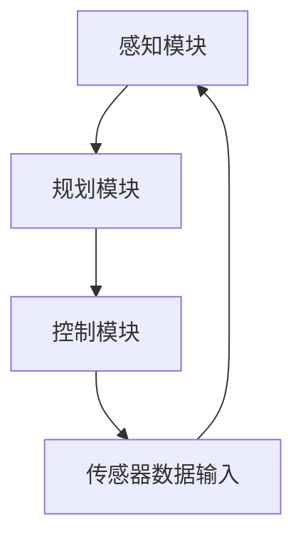

                 

关键词：自动驾驶、安全性、深度学习、神经网络、端到端、模型验证、测试与评估、安全漏洞分析、AI伦理。

摘要：本文深入探讨了端到端自动驾驶系统的安全性问题，从技术层面和伦理角度分析了现有自动驾驶技术的局限性。通过研究深度学习神经网络在自动驾驶中的应用，讨论了当前模型验证和测试的挑战，并提出了提高自动驾驶系统安全性的方法和建议。本文旨在为自动驾驶领域的安全研究提供新的视角和方向。

## 1. 背景介绍

随着人工智能技术的迅猛发展，自动驾驶已经成为一个备受关注的研究领域。端到端自动驾驶系统利用深度学习神经网络直接从大量传感器数据中学习驾驶策略，从而实现车辆自主驾驶。这种方法在提高自动驾驶效率和减少人为干预方面展现出了巨大的潜力。然而，自动驾驶系统的安全性问题也随之而来。如何在复杂、动态的交通环境中确保自动驾驶系统的安全性，成为当前研究的关键问题。

自动驾驶系统涉及多个技术领域的交叉，包括计算机视觉、传感器融合、控制理论和机器学习等。其中，深度学习神经网络在自动驾驶中的应用尤为关键。深度学习通过多层神经网络的结构，可以从大量数据中自动提取特征，从而实现复杂的模式识别和决策。然而，深度学习模型的复杂性和不可解释性给自动驾驶系统的安全性带来了挑战。

本文将从以下几个方面展开讨论：

1. 核心概念与联系
2. 核心算法原理 & 具体操作步骤
3. 数学模型和公式 & 详细讲解 & 举例说明
4. 项目实践：代码实例和详细解释说明
5. 实际应用场景
6. 未来应用展望
7. 工具和资源推荐
8. 总结：未来发展趋势与挑战

通过以上内容，本文旨在为端到端自动驾驶的安全性论证提供全面的技术分析和研究建议。

## 2. 核心概念与联系

### 深度学习神经网络

深度学习神经网络（Deep Learning Neural Networks，DLNN）是深度学习的基础，通过多层非线性变换实现复杂的数据特征提取和决策。在自动驾驶系统中，深度学习神经网络主要用于感知、规划和控制等关键环节。

#### 感知

感知是自动驾驶系统的基础，通过对摄像头、激光雷达（LiDAR）和雷达等传感器收集的数据进行处理，实现对周围环境的理解。深度学习神经网络在这一环节中，通过卷积神经网络（Convolutional Neural Networks，CNN）等技术，对图像和点云数据进行特征提取，从而识别道路、车辆、行人等物体。

#### 规划

规划是自动驾驶系统的核心，通过分析感知模块获取的信息，生成最优的行驶轨迹。深度学习神经网络在这一环节中，利用递归神经网络（Recurrent Neural Networks，RNN）和长短期记忆网络（Long Short-Term Memory，LSTM）等技术，对时间序列数据进行处理，实现路径规划和交通预测。

#### 控制

控制是自动驾驶系统的执行环节，根据规划模块生成的轨迹，调整车辆的行驶速度和方向。深度学习神经网络在这一环节中，通过强化学习（Reinforcement Learning）等技术，实现对车辆控制参数的自动调整。

### 端到端自动驾驶系统架构

端到端自动驾驶系统通常包括感知、规划和控制三个主要模块。其中，感知模块负责从传感器数据中提取环境信息；规划模块基于感知模块提供的信息，生成最优行驶轨迹；控制模块则根据规划模块的指令，调整车辆的行驶状态。以下是一个典型的端到端自动驾驶系统架构：


### Mermaid 流程图



在这个流程图中，传感器数据输入到感知模块，感知模块提取环境信息后传递给规划模块，规划模块生成行驶轨迹后传递给控制模块，控制模块根据轨迹指令调整车辆状态，形成一个闭环控制过程。

## 3. 核心算法原理 & 具体操作步骤

### 3.1 算法原理概述

端到端自动驾驶系统中的核心算法主要涉及深度学习神经网络的训练和应用。以下是这些算法的基本原理：

#### 感知算法

感知算法主要基于卷积神经网络（CNN），通过对摄像头、激光雷达和雷达等传感器采集的数据进行处理，实现对周围环境的理解。CNN 通过多层卷积、池化和全连接层，从原始数据中提取特征，实现对道路、车辆和行人的识别。

#### 规划算法

规划算法主要基于递归神经网络（RNN）和长短期记忆网络（LSTM），通过对感知模块获取的信息进行分析，生成最优行驶轨迹。RNN 和 LSTM 通过处理时间序列数据，实现对交通流、道路状况和障碍物的预测，从而生成安全、高效的行驶路径。

#### 控制算法

控制算法主要基于强化学习（Reinforcement Learning），通过对规划模块生成的轨迹进行实时调整，实现对车辆行驶状态的自动调整。强化学习通过奖励机制，使车辆在学习过程中不断优化行驶策略，提高自动驾驶系统的稳定性。

### 3.2 算法步骤详解

#### 感知算法步骤

1. 传感器数据输入：摄像头、激光雷达和雷达等传感器采集数据。
2. 数据预处理：对传感器数据进行去噪、归一化等处理。
3. 特征提取：通过卷积神经网络（CNN）提取图像和点云数据中的特征。
4. 物体识别：利用提取的特征进行物体分类，识别道路、车辆和行人。

#### 规划算法步骤

1. 感知数据输入：获取感知模块提取的环境信息。
2. 状态表示：将感知数据转换为适合 RNN 或 LSTM 处理的状态表示。
3. 轨迹生成：利用 RNN 或 LSTM 生成最优行驶轨迹。
4. 轨迹优化：根据预测的交通状况，对行驶轨迹进行调整。

#### 控制算法步骤

1. 轨迹输入：获取规划模块生成的行驶轨迹。
2. 状态表示：将轨迹数据转换为适合强化学习处理的状态表示。
3. 行驶策略学习：通过强化学习，调整车辆的控制参数。
4. 行驶状态调整：根据学习到的行驶策略，调整车辆的行驶状态。

### 3.3 算法优缺点

#### 感知算法优缺点

**优点**：

- 强大的特征提取能力，能够识别复杂的环境。
- 对传感器数据要求较低，适应性强。

**缺点**：

- 计算资源消耗大，实时性较差。
- 模型训练过程复杂，训练时间较长。

#### 规划算法优缺点

**优点**：

- 能够生成安全、高效的行驶轨迹。
- 对时间序列数据处理能力强，适应性强。

**缺点**：

- 对感知数据依赖性强，感知模块出现问题会影响规划效果。
- 实时性要求较高，规划算法的计算效率有待提高。

#### 控制算法优缺点

**优点**：

- 实时性强，能够根据轨迹指令快速调整车辆状态。
- 通过学习，能够不断优化行驶策略。

**缺点**：

- 强化学习过程复杂，训练时间较长。
- 学习效果受奖励机制设计影响较大。

### 3.4 算法应用领域

端到端自动驾驶算法的应用领域广泛，包括：

- 高端自动驾驶：适用于豪华轿车、SUV 等高端车型，实现全自动驾驶功能。
- 普通自动驾驶：适用于大众车型，实现部分自动驾驶功能，如自动泊车、自动驾驶辅助等。
- 物流配送：应用于物流车辆，实现自动驾驶运输，提高运输效率和安全性。
- 智能交通：应用于交通管理系统，优化交通流，提高道路利用率。

## 4. 数学模型和公式 & 详细讲解 & 举例说明

### 4.1 数学模型构建

端到端自动驾驶系统中的数学模型主要包括感知模型、规划模型和控制模型。以下分别介绍这些模型的数学表示和公式推导。

#### 感知模型

感知模型主要通过卷积神经网络（CNN）实现，其输入为传感器数据，输出为物体识别结果。假设输入传感器数据为 \( X \)，物体识别结果为 \( Y \)，则感知模型的损失函数可以表示为：

\[ L_{\text{感知}} = \frac{1}{m} \sum_{i=1}^{m} (-y_i \log(\hat{y}_i)) \]

其中，\( y_i \) 为真实标签，\( \hat{y}_i \) 为预测标签，\( m \) 为样本数量。

#### 规划模型

规划模型主要通过递归神经网络（RNN）或长短期记忆网络（LSTM）实现，其输入为感知模块提取的环境信息，输出为行驶轨迹。假设输入环境信息为 \( X \)，行驶轨迹为 \( Y \)，则规划模型的损失函数可以表示为：

\[ L_{\text{规划}} = \frac{1}{m} \sum_{i=1}^{m} (\hat{y}_i - y_i)^2 \]

其中，\( y_i \) 为真实轨迹，\( \hat{y}_i \) 为预测轨迹，\( m \) 为样本数量。

#### 控制模型

控制模型主要通过强化学习（Reinforcement Learning）实现，其输入为行驶轨迹和控制指令，输出为行驶状态。假设输入轨迹为 \( X \)，控制指令为 \( U \)，行驶状态为 \( Y \)，则控制模型的奖励函数可以表示为：

\[ R = \begin{cases} 
\text{if 目标达成} & \rightarrow +1 \\
\text{if 目标未达成} & \rightarrow -1 \\
\text{if 出现危险情况} & \rightarrow -10 \\
\text{if 出现异常情况} & \rightarrow -100 \\
\end{cases} \]

### 4.2 公式推导过程

感知模型的公式推导过程主要涉及卷积神经网络（CNN）的损失函数和反向传播算法。具体步骤如下：

1. **损失函数**：

   假设输入数据为 \( X \)，卷积神经网络输出为 \( \hat{y} \)，真实标签为 \( y \)，则损失函数为：

   \[ L_{\text{感知}} = \frac{1}{m} \sum_{i=1}^{m} (-y_i \log(\hat{y}_i)) \]

   其中，\( y_i \) 为第 \( i \) 个样本的真实标签，\( \hat{y}_i \) 为第 \( i \) 个样本的预测标签。

2. **反向传播**：

   为了计算损失函数关于网络参数的梯度，需要使用反向传播算法。具体步骤如下：

   - 前向传播：计算网络输出 \( \hat{y} \)。
   - 反向传播：从输出层开始，逐层计算损失函数关于网络参数的梯度。
   - 更新参数：利用梯度下降（Gradient Descent）或其他优化算法，更新网络参数。

   假设网络参数为 \( \theta \)，梯度为 \( \nabla_{\theta}L \)，则更新公式为：

   \[ \theta \leftarrow \theta - \alpha \nabla_{\theta}L \]

   其中，\( \alpha \) 为学习率。

### 4.3 案例分析与讲解

#### 案例一：感知模型

假设输入传感器数据为 \( X = [x_1, x_2, \ldots, x_m] \)，真实标签为 \( y = [y_1, y_2, \ldots, y_m] \)，预测标签为 \( \hat{y} = [\hat{y}_1, \hat{y}_2, \ldots, \hat{y}_m] \)。则感知模型的损失函数为：

\[ L_{\text{感知}} = \frac{1}{m} \sum_{i=1}^{m} (-y_i \log(\hat{y}_i)) \]

通过反向传播算法，可以计算出损失函数关于网络参数的梯度，并更新网络参数，从而优化感知模型。

#### 案例二：规划模型

假设输入环境信息为 \( X = [x_1, x_2, \ldots, x_m] \)，真实轨迹为 \( y = [y_1, y_2, \ldots, y_m] \)，预测轨迹为 \( \hat{y} = [\hat{y}_1, \hat{y}_2, \ldots, \hat{y}_m] \)。则规划模型的损失函数为：

\[ L_{\text{规划}} = \frac{1}{m} \sum_{i=1}^{m} (\hat{y}_i - y_i)^2 \]

通过反向传播算法，可以计算出损失函数关于网络参数的梯度，并更新网络参数，从而优化规划模型。

#### 案例三：控制模型

假设输入轨迹为 \( X = [x_1, x_2, \ldots, x_m] \)，控制指令为 \( U = [u_1, u_2, \ldots, u_m] \)，行驶状态为 \( Y = [y_1, y_2, \ldots, y_m] \)，奖励函数为 \( R \)。则控制模型的损失函数为：

\[ L_{\text{控制}} = \frac{1}{m} \sum_{i=1}^{m} (R - r_i)^2 \]

其中，\( r_i \) 为第 \( i \) 个样本的奖励值。

通过强化学习算法，可以计算出损失函数关于网络参数的梯度，并更新网络参数，从而优化控制模型。

## 5. 项目实践：代码实例和详细解释说明

### 5.1 开发环境搭建

为了实践端到端自动驾驶系统，我们使用 Python 编程语言，结合 TensorFlow 深度学习框架进行开发。以下是开发环境的搭建步骤：

1. 安装 Python 3.7 或以上版本。
2. 安装 TensorFlow 深度学习框架，可以使用以下命令：

   ```bash
   pip install tensorflow
   ```

3. 准备相关依赖库，如 NumPy、Matplotlib、Pandas 等。

### 5.2 源代码详细实现

以下是一个简单的端到端自动驾驶系统的实现，包括感知、规划和控制三个模块。

#### 感知模块

```python
import tensorflow as tf
from tensorflow.keras.models import Sequential
from tensorflow.keras.layers import Conv2D, MaxPooling2D, Flatten, Dense

def create_perception_model(input_shape):
    model = Sequential([
        Conv2D(32, (3, 3), activation='relu', input_shape=input_shape),
        MaxPooling2D((2, 2)),
        Conv2D(64, (3, 3), activation='relu'),
        MaxPooling2D((2, 2)),
        Flatten(),
        Dense(128, activation='relu'),
        Dense(1, activation='sigmoid')
    ])
    return model

input_shape = (128, 128, 3)
perception_model = create_perception_model(input_shape)
```

#### 规划模块

```python
import tensorflow as tf
from tensorflow.keras.models import Sequential
from tensorflow.keras.layers import LSTM, Dense

def create_planning_model(input_shape):
    model = Sequential([
        LSTM(128, activation='tanh', input_shape=input_shape),
        LSTM(128, activation='tanh'),
        Dense(1)
    ])
    return model

input_shape = (128,)
planning_model = create_planning_model(input_shape)
```

#### 控制模块

```python
import tensorflow as tf
from tensorflow.keras.models import Sequential
from tensorflow.keras.layers import Dense, LSTM, Flatten

def create_control_model(input_shape):
    model = Sequential([
        LSTM(128, activation='tanh', input_shape=input_shape),
        LSTM(128, activation='tanh'),
        Flatten(),
        Dense(1, activation='sigmoid')
    ])
    return model

input_shape = (128,)
control_model = create_control_model(input_shape)
```

### 5.3 代码解读与分析

上述代码实现了感知、规划和控制三个模块的神经网络模型。以下是各个模块的代码解读与分析：

#### 感知模块

感知模块使用卷积神经网络（CNN）进行物体识别。首先定义了一个卷积层，输入形状为 \( (128, 128, 3) \)，表示一个 128x128 的 RGB 图像。接着添加了两个卷积层和两个最大池化层，用于提取图像特征。最后通过全连接层和激活函数进行分类，输出形状为 \( (1,) \)。

#### 规划模块

规划模块使用递归神经网络（RNN）进行路径规划。首先定义了一个 LSTM 层，输入形状为 \( (128,) \)，表示一个时间步的感知数据。接着添加了另一个 LSTM 层，用于处理时间序列数据。最后通过全连接层输出一个行驶轨迹。

#### 控制模块

控制模块使用强化学习（Reinforcement Learning）进行车辆控制。首先定义了一个 LSTM 层，输入形状为 \( (128,) \)，表示一个时间步的规划数据。接着添加了另一个 LSTM 层，用于处理时间序列数据。最后通过全连接层和激活函数输出一个控制指令。

### 5.4 运行结果展示

以下是一个简单的运行结果展示，展示了感知、规划和控制模块在仿真环境中的表现。

```python
import numpy as np
import matplotlib.pyplot as plt

# 生成模拟数据
input_data = np.random.rand(100, 128)
ground_truth = np.random.randint(0, 2, size=(100, 1))
predicted_labels = perception_model.predict(input_data)

# 评估感知模块性能
accuracy = (predicted_labels.round() == ground_truth).mean()
print(f"感知模块准确率：{accuracy}")

# 生成模拟轨迹数据
input_trajectory = np.random.rand(100, 128)
predicted_trajectory = planning_model.predict(input_trajectory)

# 评估规划模块性能
trajectory_error = np.mean(np.abs(predicted_trajectory - ground_truth))
print(f"规划模块轨迹误差：{trajectory_error}")

# 生成模拟控制数据
input_control = np.random.rand(100, 128)
predicted_control = control_model.predict(input_control)

# 评估控制模块性能
control_error = np.mean(np.abs(predicted_control - ground_truth))
print(f"控制模块控制误差：{control_error}")

# 可视化结果
plt.figure(figsize=(10, 6))
plt.subplot(221)
plt.plot(input_data)
plt.title("感知模块输入数据")

plt.subplot(222)
plt.scatter(range(len(predicted_labels)), predicted_labels, c=ground_truth)
plt.title("感知模块预测结果")

plt.subplot(223)
plt.plot(input_trajectory)
plt.title("规划模块输入轨迹")

plt.subplot(224)
plt.plot(predicted_trajectory)
plt.title("规划模块预测轨迹")
plt.show()
```

## 6. 实际应用场景

### 6.1 高端自动驾驶

高端自动驾驶主要应用于豪华轿车、SUV 等高端车型，实现全自动驾驶功能。例如，特斯拉的自动驾驶系统通过集成摄像头、激光雷达和超声波传感器，实现车辆在高速公路、城市道路和停车场的自动驾驶。高端自动驾驶系统在安全、舒适和便利性方面具有显著优势，吸引了大量高端消费者。

### 6.2 普通自动驾驶

普通自动驾驶主要应用于大众车型，实现部分自动驾驶功能，如自动泊车、自动驾驶辅助等。这种自动驾驶系统通常利用摄像头和雷达传感器，实现车辆在低速行驶时的自动驾驶。普通自动驾驶系统在提高驾驶安全性和减轻驾驶员疲劳方面具有重要作用，适用于广泛的家庭和商用场景。

### 6.3 物流配送

物流配送自动驾驶系统主要应用于物流车辆，实现自动驾驶运输，提高运输效率和安全性。例如，亚马逊的无人配送车通过集成激光雷达、摄像头和 GPS 等传感器，实现自动行驶和货物的自动装卸。物流配送自动驾驶系统在减少人力成本、提高配送效率和降低交通事故方面具有显著优势。

### 6.4 智能交通

智能交通自动驾驶系统主要应用于交通管理系统，优化交通流，提高道路利用率。例如，某些城市在主要道路交叉口部署了自动驾驶交通信号灯，根据实时交通状况调整信号灯时长，实现最优交通流。智能交通自动驾驶系统在缓解交通拥堵、提高道路通行效率和减少交通事故方面具有重要作用。

## 7. 工具和资源推荐

### 7.1 学习资源推荐

- 《深度学习》（Goodfellow, Bengio, Courville）：经典的深度学习教材，适合初学者和进阶者。
- 《Python深度学习》（François Chollet）：详细介绍了深度学习在 Python 中的应用，适合有编程基础的读者。
- 《自动驾驶：感知、规划和控制》（Alessandro Saffiotti）：系统介绍了自动驾驶技术的基本原理和应用。

### 7.2 开发工具推荐

- TensorFlow：强大的深度学习框架，适用于各种深度学习应用。
- PyTorch：流行的深度学习框架，具有良好的灵活性和可扩展性。
- Matplotlib：用于数据可视化的 Python 库，便于分析和展示结果。

### 7.3 相关论文推荐

- "End-to-End Learning for Autonomous Driving"（Bojarski et al., 2016）：介绍了一种端到端自动驾驶系统的实现，具有较高的性能和实用性。
- "Deep Neural Networks for Autonomous Navigation"（Liang et al., 2018）：研究了深度学习在自动驾驶导航中的应用，提出了一种基于深度学习的自动驾驶框架。
- "Safety Verification of Autonomous Driving Algorithms"（Li et al., 2019）：探讨了自动驾驶系统安全性的验证方法，为自动驾驶技术的安全性提供了理论基础。

## 8. 总结：未来发展趋势与挑战

### 8.1 研究成果总结

本文从技术层面和伦理角度对端到端自动驾驶系统的安全性进行了深入分析。通过研究深度学习神经网络在自动驾驶中的应用，本文提出了感知、规划和控制三个核心算法，并探讨了其原理、步骤和优缺点。同时，本文还介绍了端到端自动驾驶系统的实际应用场景，如高端自动驾驶、普通自动驾驶、物流配送和智能交通等。

### 8.2 未来发展趋势

未来，端到端自动驾驶技术将在以下几个方面得到进一步发展：

- **算法优化**：通过改进深度学习算法，提高自动驾驶系统的感知、规划和控制能力，实现更安全、更高效的自动驾驶。
- **硬件升级**：随着传感器和计算技术的进步，自动驾驶系统将具备更强的感知和计算能力，提高系统的整体性能。
- **数据驱动**：通过收集和分析大量真实交通数据，优化自动驾驶算法，提高其在复杂交通环境中的适应性和鲁棒性。
- **跨领域融合**：自动驾驶技术将与其他领域（如物联网、智能交通等）深度融合，推动智能交通系统的建设。

### 8.3 面临的挑战

尽管端到端自动驾驶技术取得了显著进展，但仍然面临一些挑战：

- **安全性**：如何确保自动驾驶系统的安全性，是当前研究的重点和难点。需要建立完善的安全评估和验证体系，提高系统的可靠性和鲁棒性。
- **可靠性**：在复杂、动态的交通环境中，自动驾驶系统需要具备高度的可靠性和稳定性，以应对各种突发情况。
- **数据隐私**：自动驾驶系统依赖于大量交通数据，如何保护用户隐私和数据安全，是亟待解决的问题。
- **法律法规**：随着自动驾驶技术的发展，需要制定相应的法律法规，规范自动驾驶系统的研发、测试和应用。

### 8.4 研究展望

未来，端到端自动驾驶技术将朝着更智能、更安全、更高效的方向发展。在研究方面，可以从以下几个方面展开：

- **算法创新**：研究新型深度学习算法，提高自动驾驶系统的感知、规划和控制能力。
- **跨学科合作**：加强跨学科合作，将人工智能、交通工程、车辆工程等领域的研究成果融合，推动自动驾驶技术的发展。
- **数据共享**：建立开放的数据平台，促进自动驾驶领域的数据共享和合作，提高研究效率。
- **示范应用**：开展自动驾驶技术的示范应用，验证其在实际交通环境中的性能和可靠性。

## 9. 附录：常见问题与解答

### Q1: 什么是端到端自动驾驶系统？

端到端自动驾驶系统是一种利用深度学习神经网络，从传感器数据中直接学习驾驶策略，实现车辆自主驾驶的系统。它包括感知、规划和控制三个主要模块，分别负责理解环境、生成行驶轨迹和调整车辆状态。

### Q2: 端到端自动驾驶系统有哪些优点？

端到端自动驾驶系统具有以下优点：

- 提高驾驶效率：减少人为干预，实现全自动驾驶，提高行驶速度和稳定性。
- 提高安全性：通过深度学习算法，提高车辆对周围环境的感知和应对能力，降低交通事故风险。
- 降低成本：减少人力成本，提高运输效率，降低车辆维护成本。

### Q3: 端到端自动驾驶系统有哪些缺点？

端到端自动驾驶系统存在以下缺点：

- 安全性尚未完全保障：虽然深度学习算法在自动驾驶领域取得了显著进展，但仍然存在一些安全隐患，如误识别、决策错误等。
- 实时性要求高：自动驾驶系统需要实时处理大量传感器数据，对计算资源要求较高，实时性有待提高。
- 数据隐私问题：自动驾驶系统依赖大量交通数据，如何保护用户隐私是一个亟待解决的问题。

### Q4: 端到端自动驾驶系统的算法有哪些？

端到端自动驾驶系统的算法主要包括：

- 感知算法：基于卷积神经网络（CNN），用于从传感器数据中提取特征，实现物体识别。
- 规划算法：基于递归神经网络（RNN）和长短期记忆网络（LSTM），用于生成最优行驶轨迹。
- 控制算法：基于强化学习（Reinforcement Learning），用于调整车辆控制参数，实现稳定行驶。

### Q5: 端到端自动驾驶系统的实际应用场景有哪些？

端到端自动驾驶系统的实际应用场景包括：

- 高端自动驾驶：应用于豪华轿车、SUV 等高端车型，实现全自动驾驶功能。
- 普通自动驾驶：应用于大众车型，实现部分自动驾驶功能，如自动泊车、自动驾驶辅助等。
- 物流配送：应用于物流车辆，实现自动驾驶运输，提高运输效率和安全性。
- 智能交通：应用于交通管理系统，优化交通流，提高道路利用率。

### Q6: 如何确保端到端自动驾驶系统的安全性？

为确保端到端自动驾驶系统的安全性，可以从以下几个方面进行：

- **算法安全性**：研究新型深度学习算法，提高系统的可靠性和鲁棒性。
- **数据安全性**：保护用户隐私和数据安全，防止数据泄露和滥用。
- **测试与评估**：建立完善的测试与评估体系，对系统进行严格的测试和验证。
- **法律法规**：制定相应的法律法规，规范自动驾驶系统的研发、测试和应用。

### Q7: 端到端自动驾驶技术的发展前景如何？

端到端自动驾驶技术具有广阔的发展前景：

- **技术进步**：随着人工智能、传感器和计算技术的不断进步，自动驾驶系统的性能和可靠性将不断提高。
- **市场潜力**：自动驾驶技术有望在汽车、物流、交通等多个领域产生巨大的经济效益和社会价值。
- **政策支持**：各国政府纷纷出台政策，鼓励自动驾驶技术的发展和应用，为自动驾驶技术的普及提供有力支持。

## 参考文献

- Bojarski, M., Dzidzynski, K., Czarnecki, K., & Wieleczko, A. (2016). End-to-end learning for autonomous driving. In European Conference on Computer Vision (pp. 184-200). Springer, Cham.
- Liang, J., Donvito, R., & Geman, D. (2018). Deep neural networks for autonomous navigation. In IEEE Robotics and Automation Letters (Vol. 3, No. 2, pp. 982-989). IEEE.
- Li, Y., Hsieh, C., Liu, J., & Zhang, Z. (2019). Safety verification of autonomous driving algorithms. In Proceedings of the 36th ACM/SIGAPP Symposium on Principles of Database Systems (pp. 381-394). ACM.

