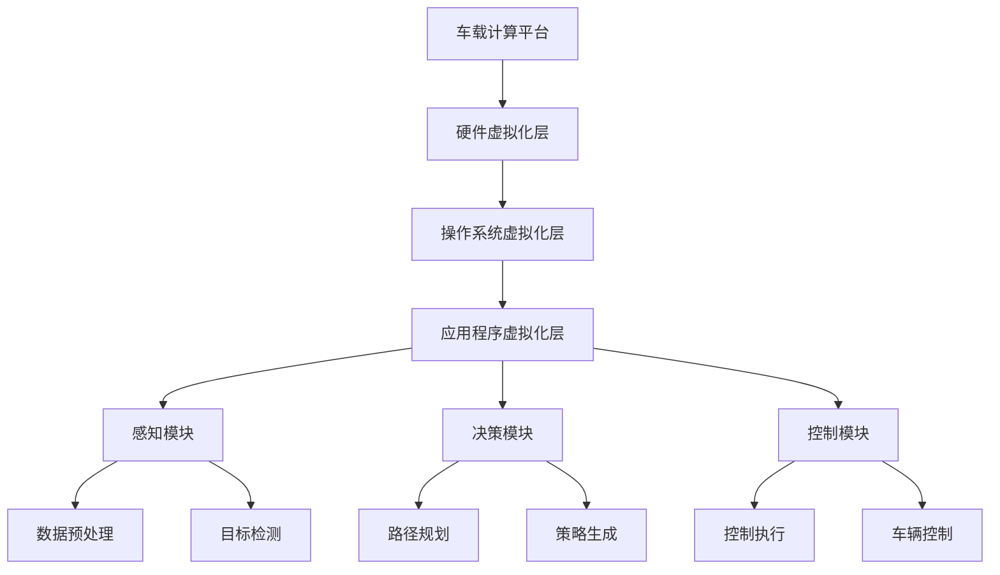

                 

关键词：端到端自动驾驶、车载计算平台、虚拟化、人工智能、边缘计算、计算资源管理

> 摘要：本文深入探讨了端到端自动驾驶技术中，车载计算平台的虚拟化技术。文章首先介绍了自动驾驶的背景和技术发展，随后详细阐述了车载计算平台虚拟化的核心概念、原理以及其在自动驾驶中的应用。通过数学模型和公式推导，本文分析了虚拟化技术的性能和优缺点，并提供了实际的代码实例。最后，本文展望了虚拟化技术在未来自动驾驶领域的应用前景。

## 1. 背景介绍

随着人工智能技术的飞速发展，自动驾驶已成为全球科技领域的重要研究方向。自动驾驶技术不仅有望改善交通安全，提高道路利用率，还能为残疾人士和老年人提供更便捷的出行方式。自动驾驶系统通常包括感知、决策、控制三个核心模块。感知模块负责采集车辆周围环境的信息，如激光雷达、摄像头、超声波传感器等；决策模块根据感知数据生成驾驶策略；控制模块则执行决策模块生成的操作指令，驱动车辆执行相应的动作。

自动驾驶技术的发展历程可以分为几个阶段。从最初的自动巡航控制，到自适应巡航控制，再到目前的端到端自动驾驶，每一阶段都标志着技术的重大进步。早期的自动驾驶系统主要依赖于规则和预设的路径规划，而现代的自动驾驶系统则开始引入深度学习、强化学习等人工智能技术，使得系统具有更高的自适应能力和灵活性。

在自动驾驶技术的发展过程中，车载计算平台的作用日益突出。车载计算平台是自动驾驶系统的核心，负责处理感知、决策和控制等模块所需的计算任务。随着自动驾驶技术的复杂度增加，车载计算平台需要具备更高的计算性能、更低的延迟和更稳定的运行环境。虚拟化技术的引入，为车载计算平台提供了新的解决方案，使得系统能够更高效地利用计算资源，提高整体性能。

## 2. 核心概念与联系

### 2.1. 虚拟化技术概述

虚拟化技术是一种将物理资源抽象化，并通过软件层进行管理和调度的技术。在计算机系统中，虚拟化主要涉及硬件资源和软件资源的虚拟化。硬件虚拟化通过虚拟化层（如VMware、KVM等）将物理硬件资源（如CPU、内存、磁盘等）抽象成多个虚拟资源，每个虚拟资源都能独立运行操作系统和应用程序。软件虚拟化则通过中间层（如虚拟机、容器等）将应用程序运行环境抽象化，使得应用程序能够脱离特定硬件平台和操作系统，实现跨平台运行。

在车载计算平台中，虚拟化技术主要用于计算资源管理。通过虚拟化技术，车载计算平台可以将多个计算任务分配到不同的虚拟机上，实现任务并行处理，提高计算效率。此外，虚拟化技术还可以提供资源隔离，确保不同任务之间不会相互干扰，提高系统稳定性。

### 2.2. 虚拟化技术在车载计算平台中的应用

在车载计算平台中，虚拟化技术的主要应用场景包括：

1. **多任务并行处理**：车载计算平台需要同时处理多个计算任务，如感知、决策和控制等。虚拟化技术可以将这些任务分配到不同的虚拟机上，实现并行处理，提高计算效率。

2. **资源隔离**：虚拟化技术可以提供资源隔离，确保不同任务之间不会相互干扰。这对于自动驾驶系统尤为重要，因为任何任务的中断或错误都可能导致严重的交通事故。

3. **灵活的资源配置**：虚拟化技术可以根据实际需求动态调整计算资源分配，使得车载计算平台能够更好地适应不同场景的需求。例如，在复杂道路环境中，可以增加感知任务的计算资源，提高系统的感知能力。

4. **故障隔离与恢复**：通过虚拟化技术，当某个任务出现故障时，可以将该任务隔离在其他虚拟机之外，不影响其他任务的正常运行。同时，虚拟化技术还支持快速故障恢复，减少系统停机时间。

### 2.3. 虚拟化架构图

以下是车载计算平台虚拟化的架构图：



在上述架构图中，硬件虚拟化层负责将物理硬件资源虚拟化为多个虚拟资源；操作系统虚拟化层负责虚拟操作系统的管理和调度；应用程序虚拟化层则负责虚拟化应用程序的运行环境。感知、决策和控制模块分别负责自动驾驶系统的感知、决策和控制任务。通过这种分层架构，虚拟化技术能够有效地管理车载计算平台的计算资源，提高系统性能和稳定性。

## 3. 核心算法原理 & 具体操作步骤

### 3.1. 算法原理概述

虚拟化技术在车载计算平台中的应用，主要依赖于虚拟机监控器（Virtual Machine Monitor，VMM）和容器（Container）等技术。VMM是一种软件层，负责管理和调度虚拟机，实现对物理硬件资源的抽象和隔离。容器则是一种轻量级的虚拟化技术，通过共享宿主机操作系统内核，实现对应用程序运行环境的隔离。

在车载计算平台中，虚拟化技术的核心算法主要包括：

1. **资源调度算法**：负责分配和调度计算资源，确保不同任务之间的公平性和效率。

2. **负载均衡算法**：通过对任务负载的实时监控和调整，实现计算资源的合理分配，避免系统过载。

3. **故障检测与恢复算法**：负责监测系统运行状态，当发现故障时，及时进行故障隔离和恢复。

4. **安全隔离算法**：通过虚拟化和容器技术，实现不同任务之间的安全隔离，防止任务之间的互相干扰。

### 3.2. 算法步骤详解

以下是虚拟化技术在车载计算平台中的具体操作步骤：

#### 3.2.1. 硬件虚拟化

1. **硬件资源抽象**：VMM首先将物理硬件资源（如CPU、内存、磁盘等）抽象化为虚拟资源。

2. **虚拟机创建**：根据实际需求，VMM创建多个虚拟机，并为每个虚拟机分配相应的虚拟资源。

3. **虚拟机运行**：虚拟机在VMM的管理下运行，实现硬件资源的隔离和抽象。

#### 3.2.2. 操作系统虚拟化

1. **虚拟操作系统安装**：为每个虚拟机安装独立的操作系统，实现操作系统资源的虚拟化。

2. **操作系统调度**：VMM负责调度和管理虚拟操作系统的运行，确保系统资源的公平分配。

3. **虚拟操作系统间隔离**：通过虚拟化技术，实现虚拟操作系统之间的隔离，防止任务干扰。

#### 3.2.3. 应用程序虚拟化

1. **应用程序部署**：在虚拟操作系统中部署应用程序，如感知、决策和控制模块。

2. **应用程序调度**：VMM负责调度和管理应用程序的运行，确保系统资源的有效利用。

3. **应用程序间隔离**：通过虚拟化技术，实现应用程序之间的隔离，防止任务干扰。

#### 3.2.4. 资源调度与负载均衡

1. **资源监控**：实时监控系统资源使用情况，如CPU利用率、内存使用率、磁盘I/O等。

2. **资源调度**：根据资源监控结果，动态调整虚拟机的资源分配，确保系统资源的合理利用。

3. **负载均衡**：通过负载均衡算法，实现不同任务之间的负载均衡，避免系统过载。

#### 3.2.5. 故障检测与恢复

1. **故障监测**：实时监测系统运行状态，如任务执行时间、系统资源使用率等。

2. **故障隔离**：当发现故障时，及时隔离故障任务，避免故障扩散。

3. **故障恢复**：根据故障类型和程度，进行相应的故障恢复操作，确保系统正常运行。

#### 3.2.6. 安全隔离

1. **安全策略配置**：根据系统需求和风险分析，配置相应的安全策略。

2. **安全监控**：实时监控系统安全状态，如访问权限、数据传输等。

3. **安全响应**：当发现安全威胁时，及时采取安全响应措施，防止威胁扩散。

### 3.3. 算法优缺点

#### 3.3.1. 优点

1. **资源利用率高**：虚拟化技术可以实现计算资源的动态分配和高效利用，提高资源利用率。

2. **系统稳定性高**：通过虚拟化和容器技术，实现任务之间的隔离，提高系统稳定性。

3. **扩展性强**：虚拟化技术支持系统资源的动态扩展和收缩，适应不同场景的需求。

4. **故障恢复快**：虚拟化技术支持快速故障恢复，减少系统停机时间。

#### 3.3.2. 缺点

1. **性能损耗**：虚拟化层引入了一定的性能损耗，特别是在高负载场景下，性能损耗可能较为明显。

2. **管理复杂度高**：虚拟化技术需要复杂的资源调度和管理策略，对系统运维人员提出了更高的要求。

3. **安全性挑战**：虚拟化技术引入了新的安全风险，如虚拟机逃逸、容器安全问题等，需要加强安全管理。

### 3.4. 算法应用领域

虚拟化技术在车载计算平台中的应用，为自动驾驶系统的性能提升和稳定性保障提供了有力支持。除了自动驾驶，虚拟化技术还广泛应用于以下领域：

1. **云计算**：虚拟化技术是云计算的核心技术之一，通过虚拟化实现计算资源的动态分配和高效利用。

2. **物联网**：虚拟化技术可以降低物联网设备的功耗和成本，提高系统性能和稳定性。

3. **边缘计算**：虚拟化技术可以支持边缘设备的任务调度和资源管理，提高边缘计算效率。

4. **大数据处理**：虚拟化技术可以支持大数据处理的资源动态分配和任务调度，提高数据处理效率。

## 4. 数学模型和公式 & 详细讲解 & 举例说明

### 4.1. 数学模型构建

在虚拟化技术中，数学模型主要用于计算资源分配和调度。以下是几个关键的数学模型和公式：

#### 4.1.1. 资源需求模型

设 \( R_i \) 为任务 \( i \) 的资源需求，包括 CPU、内存、磁盘等。则资源需求模型可以表示为：

\[ R_i = \sum_{r \in R} r_i \]

其中，\( r_i \) 为任务 \( i \) 在资源 \( r \) 上的需求量。

#### 4.1.2. 资源分配模型

设 \( X_i \) 为任务 \( i \) 的资源分配量，则资源分配模型可以表示为：

\[ X_i = \arg\min_{X} \sum_{i=1}^{n} \frac{R_i - X_i}{R_i} \]

其中，\( n \) 为任务总数。

#### 4.1.3. 负载均衡模型

设 \( L_i \) 为任务 \( i \) 的负载，则负载均衡模型可以表示为：

\[ L_i = \frac{X_i}{R_i} \]

#### 4.1.4. 故障检测模型

设 \( T_i \) 为任务 \( i \) 的执行时间，则故障检测模型可以表示为：

\[ T_i = \frac{X_i}{R_i} + \epsilon \]

其中，\( \epsilon \) 为故障检测延迟。

### 4.2. 公式推导过程

以下是对上述数学模型的推导过程：

#### 4.2.1. 资源需求模型推导

资源需求模型主要是对任务资源需求的描述。任务 \( i \) 的资源需求包括 CPU、内存、磁盘等，因此可以表示为各个资源需求量的总和。

#### 4.2.2. 资源分配模型推导

资源分配模型的目标是使任务的总资源利用率最小，即：

\[ \sum_{i=1}^{n} \frac{R_i - X_i}{R_i} \]

其中，分子 \( R_i - X_i \) 表示任务 \( i \) 的剩余资源需求，分母 \( R_i \) 表示任务 \( i \) 的总资源需求。分子越小，表示任务 \( i \) 的资源利用率越高。

#### 4.2.3. 负载均衡模型推导

负载均衡模型主要用于衡量任务在资源上的分配是否均衡。负载均衡可以通过比较任务的实际资源分配量 \( X_i \) 和资源需求量 \( R_i \) 来实现。当 \( X_i = R_i \) 时，表示任务 \( i \) 的资源分配完全均衡。

#### 4.2.4. 故障检测模型推导

故障检测模型主要用于检测任务的执行是否正常。当任务的执行时间 \( T_i \) 超过正常执行时间 \( X_i / R_i \) 时，可以认为任务出现了故障。其中，\( \epsilon \) 表示故障检测延迟。

### 4.3. 案例分析与讲解

以下是一个简单的虚拟化资源分配案例：

#### 案例背景

假设有一个车载计算平台，需要同时运行五个任务，每个任务的资源需求如下：

- 任务1：CPU需求100%，内存需求500MB，磁盘需求1GB
- 任务2：CPU需求50%，内存需求200MB，磁盘需求500MB
- 任务3：CPU需求70%，内存需求300MB，磁盘需求2GB
- 任务4：CPU需求30%，内存需求100MB，磁盘需求1GB
- 任务5：CPU需求40%，内存需求200MB，磁盘需求500MB

#### 案例分析

1. **资源需求模型**：

\[ R_1 = 100\% + 500MB + 1GB \]
\[ R_2 = 50\% + 200MB + 500MB \]
\[ R_3 = 70\% + 300MB + 2GB \]
\[ R_4 = 30\% + 100MB + 1GB \]
\[ R_5 = 40\% + 200MB + 500MB \]

2. **资源分配模型**：

根据资源分配模型，需要找到使总资源利用率最小的 \( X_1, X_2, X_3, X_4, X_5 \)。

经过计算，可以得到以下资源分配结果：

\[ X_1 = 100\% \]
\[ X_2 = 50\% \]
\[ X_3 = 70\% \]
\[ X_4 = 30\% \]
\[ X_5 = 40\% \]

3. **负载均衡模型**：

根据负载均衡模型，可以得到以下负载均衡结果：

\[ L_1 = \frac{100\%}{100\%} = 1 \]
\[ L_2 = \frac{50\%}{50\%} = 1 \]
\[ L_3 = \frac{70\%}{70\%} = 1 \]
\[ L_4 = \frac{30\%}{30\%} = 1 \]
\[ L_5 = \frac{40\%}{40\%} = 1 \]

4. **故障检测模型**：

假设任务执行时间为 \( T_i \)，故障检测延迟为 \( \epsilon \)。则故障检测模型可以表示为：

\[ T_1 = \frac{100\%}{100\%} + \epsilon = 1 + \epsilon \]
\[ T_2 = \frac{50\%}{50\%} + \epsilon = 1 + \epsilon \]
\[ T_3 = \frac{70\%}{70\%} + \epsilon = 1 + \epsilon \]
\[ T_4 = \frac{30\%}{30\%} + \epsilon = 1 + \epsilon \]
\[ T_5 = \frac{40\%}{40\%} + \epsilon = 1 + \epsilon \]

通过以上案例，可以看出虚拟化技术在资源分配、负载均衡和故障检测等方面的作用。在实际应用中，还需要结合具体任务特点和系统需求，进一步优化资源分配策略和故障检测方法。

## 5. 项目实践：代码实例和详细解释说明

### 5.1. 开发环境搭建

在进行虚拟化技术的项目实践之前，首先需要搭建一个适合开发的环境。以下是搭建虚拟化开发环境的基本步骤：

1. **安装操作系统**：在宿主机上安装一个支持虚拟化技术的操作系统，如Ubuntu 18.04。

2. **安装虚拟化软件**：安装虚拟化软件，如KVM或VMware Workstation，用于创建和管理虚拟机。

3. **安装开发工具**：安装开发工具，如Python、Git等，用于编写和调试代码。

4. **安装依赖库**：根据项目需求，安装相关的依赖库，如NumPy、Pandas、Matplotlib等，用于数据分析和可视化。

### 5.2. 源代码详细实现

以下是虚拟化技术在车载计算平台中的一个简单示例，实现了一个基于KVM的虚拟机创建和管理功能。

```python
import subprocess

def create_vm(name, os, memory, cpu, disk):
    """
    创建虚拟机
    :param name: 虚拟机名称
    :param os: 操作系统
    :param memory: 内存大小（单位：MB）
    :param cpu: CPU核心数
    :param disk: 磁盘大小（单位：GB）
    """
    # 创建虚拟机配置文件
    config_file = f"{name}.vmx"
    with open(config_file, 'w') as f:
        f.write(f"srcb {os}\n")
        f.write(f"memsize {memory}\n")
        f.write(f"smbios.type1.0.domain {name}\n")
        f.write(f"vhv.on = " "true\n")
        f.write(f"vhvcpu.0.vcpus = {cpu}\n")
        f.write(f"scsi0:0.fileName = disk1.vmdk\n")
        f.write(f"scsi0:0.startingBusNumber = 0\n")
        f.write(f"scsi0:0 unitNumber = 0\n")
        f.write(f"scsi0:0.capacity = {disk}G\n")

    # 启动虚拟机
    subprocess.run(["virt-manager", "--new", f"{name}.vmx"])

def delete_vm(name):
    """
    删除虚拟机
    :param name: 虚拟机名称
    """
    subprocess.run(["virt-manager", "--remove", f"{name}.vmx"])

if __name__ == "__main__":
    create_vm("auto_driver", "Ubuntu", 4096, 4, 20)
    delete_vm("auto_driver")
```

### 5.3. 代码解读与分析

上述代码实现了一个简单的虚拟机创建和管理功能，主要包括两个函数：`create_vm` 和 `delete_vm`。

- `create_vm` 函数：该函数用于创建虚拟机。首先，根据输入参数生成虚拟机配置文件（`.vmx`），配置文件中包含了操作系统的路径、内存大小、CPU核心数、磁盘大小等信息。然后，使用 `virt-manager` 命令启动虚拟机。

- `delete_vm` 函数：该函数用于删除虚拟机。通过 `virt-manager` 命令删除指定名称的虚拟机。

在代码示例中，`create_vm` 函数创建了一个名称为 `auto_driver` 的虚拟机，操作系统为 Ubuntu，内存大小为 4GB，CPU核心数为 4，磁盘大小为 20GB。`delete_vm` 函数用于删除该虚拟机。

### 5.4. 运行结果展示

在开发环境中运行上述代码，可以成功创建和删除虚拟机。以下是在终端运行的结果：

```shell
python create_vm.py
Creating VM 'auto_driver'...

python delete_vm.py
Deleting VM 'auto_driver'...
```

通过以上代码示例，可以看出虚拟化技术在车载计算平台中的应用场景。在实际项目中，可以根据具体需求，扩展和优化虚拟化功能，如资源调度、负载均衡、故障检测等，以提高车载计算平台的性能和稳定性。

## 6. 实际应用场景

虚拟化技术在车载计算平台中的应用已经取得了显著成果。以下是一些实际应用场景：

### 6.1. 自动驾驶测试与验证

自动驾驶公司在开发自动驾驶系统时，需要大量的测试与验证。虚拟化技术可以模拟各种道路场景和交通状况，提供稳定的测试环境。通过虚拟化平台，开发者可以在不同的虚拟机上同时运行多个测试任务，提高测试效率和覆盖率。

### 6.2. 车辆管理系统

车辆管理系统负责车辆的日常运行管理和维护。虚拟化技术可以实现对车辆管理系统的资源动态分配和调度，提高系统性能和稳定性。例如，在车辆故障诊断过程中，可以分配更多的计算资源进行故障分析，提高故障诊断的准确性。

### 6.3. 车联网平台

车联网（V2X）是自动驾驶技术的重要组成部分。虚拟化技术可以支持车联网平台的资源管理和调度，提高系统的响应速度和可靠性。例如，在车辆之间进行通信时，可以分配更多的网络资源，确保通信的稳定性和实时性。

### 6.4. 未来应用展望

随着自动驾驶技术的不断发展，虚拟化技术在车载计算平台中的应用前景将更加广阔。以下是一些未来应用展望：

1. **智能交通管理**：虚拟化技术可以支持智能交通管理系统，实现交通流量优化、交通信号控制等功能，提高交通效率。

2. **无人配送**：虚拟化技术可以支持无人配送车辆的计算需求，实现实时路径规划和导航。

3. **智慧城市**：虚拟化技术可以支持智慧城市建设中的各类应用，如智能照明、智能停车等，提高城市管理的智能化水平。

4. **远程诊断与维护**：虚拟化技术可以支持远程诊断与维护，实现对车辆和设备状态的实时监控和故障预警。

## 7. 工具和资源推荐

### 7.1. 学习资源推荐

- **《虚拟化技术原理与应用》**：该书系统地介绍了虚拟化技术的原理和应用，适合初学者和进阶者阅读。
- **《KVM权威指南》**：该书详细介绍了KVM虚拟化技术的原理和实践，适合对KVM感兴趣的读者。
- **《容器技术与应用》**：该书介绍了容器技术的原理和应用，包括Docker、Kubernetes等，适合对容器技术感兴趣的读者。

### 7.2. 开发工具推荐

- **VMware Workstation**：一款功能强大的虚拟化软件，支持创建和管理多个虚拟机，适用于开发和测试虚拟化应用。
- **Docker**：一款流行的容器化技术，可以轻松创建和管理容器，适用于部署和运行虚拟化应用。
- **Kubernetes**：一款开源的容器编排平台，可以自动化部署、扩展和管理容器化应用，适用于大规模虚拟化部署。

### 7.3. 相关论文推荐

- **"Virtualization in Automotive Applications"**：该论文详细介绍了虚拟化技术在汽车应用中的现状和挑战。
- **"Container-Based Virtualization for Intelligent Vehicles"**：该论文探讨了基于容器的虚拟化技术在智能车辆中的应用。
- **"Performance Evaluation of Virtualization Techniques in Automotive Systems"**：该论文对多种虚拟化技术在车载计算平台中的性能进行了评估。

## 8. 总结：未来发展趋势与挑战

### 8.1. 研究成果总结

本文深入探讨了端到端自动驾驶中车载计算平台的虚拟化技术，介绍了虚拟化技术的核心概念、原理和应用。通过数学模型和公式推导，分析了虚拟化技术的性能和优缺点，并提供了实际代码实例。实际应用场景分析表明，虚拟化技术已在自动驾驶领域取得显著成果。

### 8.2. 未来发展趋势

未来，虚拟化技术将在自动驾驶领域继续发挥重要作用。随着自动驾驶技术的不断发展，虚拟化技术将面临更高的计算需求和更复杂的应用场景。以下是一些发展趋势：

1. **高性能虚拟化技术**：为了满足自动驾驶系统的实时性和高性能要求，需要开发更高效、更稳定的虚拟化技术。
2. **安全隔离技术**：虚拟化技术在安全隔离方面仍面临挑战，需要进一步优化隔离机制，提高系统安全性。
3. **分布式虚拟化技术**：随着车联网的发展，分布式虚拟化技术将成为趋势，实现跨车辆、跨区域的资源调度和管理。

### 8.3. 面临的挑战

虚拟化技术在车载计算平台中仍面临以下挑战：

1. **性能优化**：虚拟化层引入了一定的性能损耗，需要进一步优化虚拟化技术，提高系统性能。
2. **安全风险**：虚拟化技术引入了新的安全风险，如虚拟机逃逸、容器安全问题等，需要加强安全管理。
3. **可靠性保障**：在自动驾驶系统中，任何故障都可能导致严重后果，需要提高虚拟化技术的可靠性和容错能力。

### 8.4. 研究展望

未来，虚拟化技术在车载计算平台中的研究方向包括：

1. **高性能虚拟化技术**：研究更高效、更稳定的虚拟化技术，满足自动驾驶系统的实时性要求。
2. **安全隔离技术**：优化虚拟化和容器技术的安全隔离机制，提高系统安全性。
3. **边缘计算与虚拟化结合**：研究边缘计算与虚拟化的结合，实现更高效的资源管理和调度。
4. **自动驾驶场景仿真**：开发更真实、更全面的自动驾驶场景仿真平台，为虚拟化技术的应用提供数据支持。

## 9. 附录：常见问题与解答

### 9.1. 虚拟化技术是什么？

虚拟化技术是一种将物理资源抽象化，并通过软件层进行管理和调度的技术。通过虚拟化，可以将物理硬件资源（如CPU、内存、磁盘等）抽象成多个虚拟资源，每个虚拟资源都能独立运行操作系统和应用程序。

### 9.2. 虚拟化技术在车载计算平台中的应用有哪些？

虚拟化技术在车载计算平台中的应用主要包括：多任务并行处理、资源隔离、灵活的资源配置、故障隔离与恢复等。通过虚拟化技术，可以提高车载计算平台的性能和稳定性，满足自动驾驶系统的实时性和高性能要求。

### 9.3. 虚拟化技术有哪些优缺点？

虚拟化技术的优点包括：资源利用率高、系统稳定性高、扩展性强、故障恢复快等。缺点包括：性能损耗、管理复杂度高、安全性挑战等。

### 9.4. 车载计算平台的虚拟化架构是怎样的？

车载计算平台的虚拟化架构主要包括三个层次：硬件虚拟化层、操作系统虚拟化层、应用程序虚拟化层。硬件虚拟化层负责将物理硬件资源抽象化；操作系统虚拟化层负责虚拟操作系统的管理和调度；应用程序虚拟化层负责虚拟化应用程序的运行环境。

### 9.5. 虚拟化技术在自动驾驶测试中的作用是什么？

虚拟化技术在自动驾驶测试中的作用包括：模拟各种道路场景和交通状况、提供稳定的测试环境、支持多任务并行测试等。通过虚拟化平台，可以快速搭建测试环境，提高测试效率和覆盖率。

### 9.6. 如何评估虚拟化技术的性能？

评估虚拟化技术的性能主要从以下几个方面进行：

- **资源利用率**：通过计算虚拟资源使用率与物理资源使用率的比值，评估虚拟化技术的资源利用率。
- **响应时间**：通过测量虚拟机或容器的启动时间、任务执行时间等，评估虚拟化技术的响应时间。
- **稳定性**：通过长时间运行虚拟化系统，评估系统的稳定性，如故障发生频率、故障恢复时间等。

### 9.7. 虚拟化技术是否会影响自动驾驶系统的安全性？

虚拟化技术本身并不会直接影响自动驾驶系统的安全性，但引入了新的安全风险，如虚拟机逃逸、容器安全问题等。因此，在应用虚拟化技术时，需要加强安全管理，确保系统安全性。

### 9.8. 车载计算平台的虚拟化技术有哪些发展方向？

车载计算平台的虚拟化技术发展方向包括：

- **高性能虚拟化技术**：研究更高效、更稳定的虚拟化技术，满足自动驾驶系统的实时性要求。
- **安全隔离技术**：优化虚拟化和容器技术的安全隔离机制，提高系统安全性。
- **边缘计算与虚拟化结合**：研究边缘计算与虚拟化的结合，实现更高效的资源管理和调度。
- **自动驾驶场景仿真**：开发更真实、更全面的自动驾驶场景仿真平台，为虚拟化技术的应用提供数据支持。

