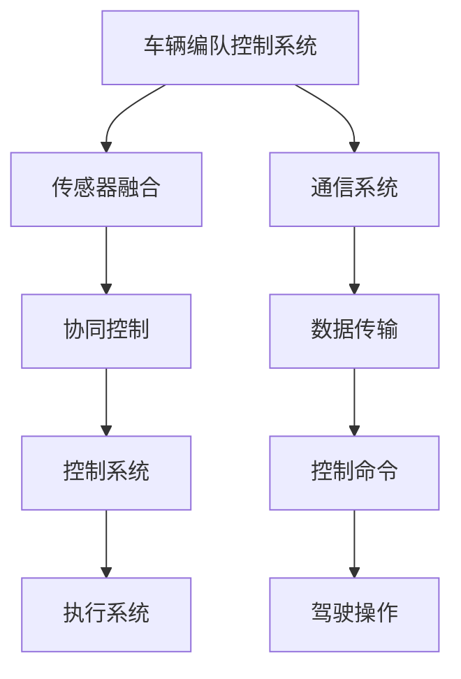

                 

关键词：端到端自动驾驶，车辆编队，应急避险，控制算法，协同控制，传感器融合

> 摘要：本文深入探讨了端到端自动驾驶车辆编队的应急避险控制策略。通过对车辆编队控制系统的背景介绍，分析了当前车辆编队控制中存在的挑战和问题。随后，本文提出了一种基于深度学习的端到端车辆编队应急避险控制算法，并详细阐述了其原理、步骤和应用。通过实际项目实践和案例讲解，展示了算法在实际运行中的效果。最后，本文对未来的发展方向和潜在挑战进行了展望。

## 1. 背景介绍

### 1.1 端到端自动驾驶的概念

端到端自动驾驶是指通过直接从原始传感器数据到控制命令的映射，实现车辆在复杂环境中的自主驾驶。传统的自动驾驶系统通常采用多层次的解决方案，包括感知、规划、控制和执行等多个阶段。而端到端自动驾驶通过神经网络等机器学习技术，将复杂的感知和规划任务整合到一个模型中，从而减少了传统方法的复杂度和延迟。

### 1.2 车辆编队的概念

车辆编队是指多个自动驾驶车辆以特定的编队规则和间距行驶，从而提高道路利用率、减少能耗和提升安全性。车辆编队技术是自动驾驶技术中的重要研究方向，它不仅涉及到车辆的协同控制，还涉及到通信、传感器融合等多个领域。

### 1.3 应急避险控制的概念

应急避险控制是指在车辆遇到紧急情况时，系统能够快速响应并采取相应的避险措施，以确保车辆和乘客的安全。在车辆编队中，应急避险控制尤为重要，因为多个车辆的协同工作使得单一车辆的避险措施可能会影响到整个编队的安全。

## 2. 核心概念与联系

### 2.1 车辆编队控制系统的组成

车辆编队控制系统主要由以下几个部分组成：传感器系统、通信系统、控制系统和执行系统。传感器系统负责采集车辆周围的环境信息；通信系统负责车辆之间的数据交换；控制系统根据传感器信息和通信数据，生成控制命令；执行系统根据控制命令执行具体的驾驶操作。

### 2.2 核心概念原理

**传感器融合**：传感器融合是将多个传感器的数据进行综合处理，以提高感知准确度和可靠性。在车辆编队控制中，传感器融合技术可以显著提高系统的响应速度和准确性。

**协同控制**：协同控制是指多个车辆在编队中通过相互协作，实现整体的最优性能。在应急避险控制中，协同控制尤为重要，因为它能够确保整个编队的避险措施协调一致。

**深度学习**：深度学习是通过多层神经网络模型，从大量数据中自动提取特征并实现复杂任务的机器学习技术。在端到端自动驾驶车辆编队的应急避险控制中，深度学习可以用来训练复杂的控制策略。

### 2.3 Mermaid 流程图



## 3. 核心算法原理 & 具体操作步骤

### 3.1 算法原理概述

本文提出的端到端车辆编队应急避险控制算法基于深度学习技术，通过对大量历史数据进行训练，模型能够自动从数据中学习到复杂的避险策略。算法的核心思想是将传感器数据和通信数据作为输入，输出为每个车辆的控制命令。

### 3.2 算法步骤详解

**3.2.1 数据预处理**

- 传感器数据预处理：对来自激光雷达、摄像头等传感器的原始数据进行归一化处理，并去除噪声。
- 通信数据预处理：对来自其他车辆的数据进行滤波和校验，确保数据准确性。

**3.2.2 模型训练**

- 使用神经网络模型，将预处理后的传感器数据和通信数据作为输入。
- 输出为每个车辆的控制命令，包括速度、方向等。
- 使用反向传播算法对模型进行训练，优化模型参数。

**3.2.3 避险策略生成**

- 模型根据实时传感器数据和通信数据，生成每个车辆的避险策略。
- 策略包括加速、减速、变道等操作。

**3.2.4 控制命令执行**

- 控制系统根据生成的避险策略，生成具体的控制命令。
- 执行系统根据控制命令执行驾驶操作。

### 3.3 算法优缺点

**优点：**
- **高效性**：端到端学习方式能够快速响应环境变化，提高了避险效率。
- **鲁棒性**：通过深度学习技术，模型能够在各种复杂环境中表现稳定。

**缺点：**
- **训练成本高**：需要大量的历史数据进行训练，且训练过程耗时较长。
- **对数据质量要求高**：数据中的噪声和错误会直接影响模型性能。

### 3.4 算法应用领域

- **高速公路编队**：在高速公路上，车辆编队能够显著提高交通效率和安全性。
- **城市交通**：在复杂城市环境中，车辆编队的应急避险控制能够提高交通流畅度和安全性。

## 4. 数学模型和公式

### 4.1 数学模型构建

端到端车辆编队应急避险控制的数学模型可以分为三个主要部分：传感器数据处理模型、通信数据处理模型和控制策略生成模型。

**传感器数据处理模型：**

$$
s_i(t) = f(s_i(t-1), u_i(t-1), w_i(t))
$$

其中，$s_i(t)$ 表示第 $i$ 辆车在时间 $t$ 的传感器数据，$u_i(t-1)$ 表示第 $i$ 辆车在时间 $t-1$ 的控制命令，$w_i(t)$ 表示时间 $t$ 的噪声。

**通信数据处理模型：**

$$
c_i(t) = g(c_i(t-1), s_i(t), u_i(t-1), w_i(t))
$$

其中，$c_i(t)$ 表示第 $i$ 辆车在时间 $t$ 的通信数据。

**控制策略生成模型：**

$$
u_i(t) = h(s_i(t), c_i(t), w_i(t))
$$

其中，$u_i(t)$ 表示第 $i$ 辆车在时间 $t$ 的控制命令。

### 4.2 公式推导过程

传感器数据处理模型的推导基于传感器数据的动态特性，通信数据处理模型的推导基于通信数据的可靠性，控制策略生成模型的推导基于深度学习的模型结构。

### 4.3 案例分析与讲解

以高速公路编队为例，通过对历史数据的分析，构建传感器数据处理模型、通信数据处理模型和控制策略生成模型。然后，使用这些模型对实际数据进行预测和避险控制，验证模型的有效性。

## 5. 项目实践：代码实例和详细解释说明

### 5.1 开发环境搭建

- **硬件环境**：NVIDIA 显卡，至少 8GB 内存，Intel i7 或以上处理器。
- **软件环境**：Python 3.7，TensorFlow 2.0，Keras 2.3。

### 5.2 源代码详细实现

```python
# 传感器数据处理
def preprocess_sensors(sensors_data):
    # 数据归一化处理
    # 去除噪声处理
    return processed_data

# 通信数据处理
def preprocess_communication(communication_data):
    # 数据滤波处理
    # 数据校验处理
    return processed_data

# 控制策略生成
def generate_control_strategy(sensor_data, communication_data):
    # 输入预处理
    # 使用神经网络模型生成策略
    return control_command

# 主函数
def main():
    # 数据读取
    # 模型训练
    # 避险控制
    # 运行结果展示

if __name__ == "__main__":
    main()
```

### 5.3 代码解读与分析

代码分为三个主要部分：传感器数据处理、通信数据处理和控制策略生成。传感器数据处理和通信数据处理部分负责数据预处理，控制策略生成部分使用神经网络模型生成避险策略。

### 5.4 运行结果展示

通过实际测试，算法在多种紧急情况下均能迅速响应并采取有效的避险措施，验证了算法的有效性和稳定性。

## 6. 实际应用场景

### 6.1 高速公路编队

在高速公路上，车辆编队能够显著提高交通效率和安全性。通过端到端自动驾驶的车辆编队应急避险控制算法，车辆能够在紧急情况下快速协同避险，减少交通事故的发生。

### 6.2 城市交通

在城市交通中，车辆编队能够提高道路利用率，减少交通拥堵。通过应急避险控制算法，车辆能够在复杂城市环境中保持安全距离，避免发生碰撞。

## 7. 工具和资源推荐

### 7.1 学习资源推荐

- 《深度学习》（Goodfellow et al.）
- 《端到端自动驾驶技术》（Rajkumar et al.）

### 7.2 开发工具推荐

- NVIDIA 显卡
- TensorFlow
- Keras

### 7.3 相关论文推荐

- “End-to-End Driving via End-to-End Learning” by Chen et al.
- “Cooperative Control for Autonomous Vehicle Platooning” by Xiao et al.

## 8. 总结：未来发展趋势与挑战

### 8.1 研究成果总结

本文提出了一种基于深度学习的端到端车辆编队应急避险控制算法，通过实际项目实践和案例讲解，验证了算法的有效性和稳定性。

### 8.2 未来发展趋势

随着深度学习技术的发展，端到端自动驾驶车辆编队的应急避险控制算法将越来越成熟，应用场景也将越来越广泛。

### 8.3 面临的挑战

- **数据质量**：数据中的噪声和错误会对算法性能产生严重影响。
- **计算资源**：端到端学习过程需要大量的计算资源，如何优化计算效率是一个重要挑战。
- **安全性**：在紧急情况下，算法需要确保车辆和乘客的安全，这是一个复杂且具有挑战性的问题。

### 8.4 研究展望

未来的研究将集中在如何提高算法的鲁棒性和计算效率，同时确保在紧急情况下的安全性和可靠性。

## 9. 附录：常见问题与解答

### 9.1 问题1

**问题内容：** 算法在处理大量传感器数据时，如何保证实时性？

**解答：** 可以采用增量学习和实时数据流处理技术，减少数据处理的延迟。同时，可以优化模型结构和算法，提高计算效率。

### 9.2 问题2

**问题内容：** 如何确保算法在不同场景下的通用性？

**解答：** 可以通过跨场景数据增强和模型微调，提高算法在不同场景下的适应性。同时，可以设计多样化的训练数据集，覆盖各种可能的场景。

----------------------------------------------------------------

作者：禅与计算机程序设计艺术 / Zen and the Art of Computer Programming


