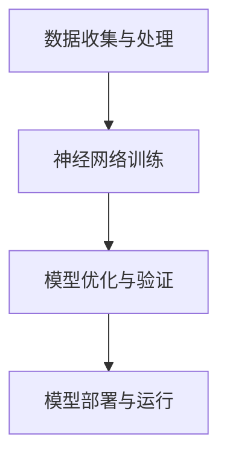

                 

关键词：端到端自动驾驶、软件架构、变革、深度学习、神经网络、感知、规划、控制、安全

摘要：本文将探讨端到端自动驾驶技术的软件架构变革，分析其在感知、规划、控制等关键环节中如何利用深度学习技术实现智能化。通过对核心算法原理的阐述、数学模型的构建、实际项目实践的展示，以及未来应用展望，旨在为读者提供一个全面、深入的技术视角，了解端到端自动驾驶技术的最新发展及其面临的挑战。

## 1. 背景介绍

自动驾驶技术作为人工智能领域的重要分支，近年来受到了广泛关注。从最初的感知、规划、控制三阶段自动驾驶架构，到如今的端到端自动驾驶技术，软件架构的变革无疑是这一领域发展的重要驱动力。传统的自动驾驶架构通过分离的模块来处理感知、规划和控制任务，存在模块间耦合度高、系统复杂度高、开发成本高、调试难度大等问题。而端到端自动驾驶技术则通过深度学习模型，将感知、规划和控制任务整合到一个统一的框架下，实现了自动驾驶系统的智能化、高效化。

### 1.1 感知

感知是自动驾驶系统的第一步，其核心任务是通过对环境信息的收集和处理，构建出周围环境的感知模型。传统的感知方法主要依赖于传感器数据，如激光雷达、摄像头、雷达等，通过图像处理、目标检测等技术实现。然而，这些方法往往存在处理速度慢、准确率低、难以适应复杂场景等问题。

### 1.2 规划

规划是指自动驾驶系统在感知到周围环境信息后，根据这些信息生成一条从当前到目标的行驶路径。传统的规划方法通常采用基于图论的路径规划算法，如A*算法、Dijkstra算法等。然而，这些方法在处理高维数据、复杂环境时存在效率低下、鲁棒性差等问题。

### 1.3 控制

控制是指自动驾驶系统根据规划结果，通过控制车辆的动力系统、制动系统等，实现车辆的自主行驶。传统的控制方法主要依赖于规则和模型，如PID控制、模糊控制等。然而，这些方法在处理非线性、复杂动态系统时存在稳定性差、响应速度慢等问题。

## 2. 核心概念与联系

### 2.1 深度学习与神经网络

深度学习是人工智能领域的重要突破，通过构建多层次的神经网络，实现对复杂数据的自动特征提取和模式识别。神经网络由大量的神经元组成，每个神经元通过权重与激活函数实现对输入数据的加权求和和输出。深度学习模型通过多层次的神经网络，逐步提取输入数据中的高阶特征，实现高度抽象的表征。

### 2.2 端到端自动驾驶架构

端到端自动驾驶架构通过深度学习模型，将感知、规划和控制任务整合到一个统一的框架下，实现了自动驾驶系统的智能化、高效化。该架构主要包括以下几个关键环节：

#### 2.2.1 数据收集与处理

首先，通过激光雷达、摄像头、雷达等传感器收集车辆周围环境信息，然后对数据进行预处理，包括去噪、归一化、数据增强等操作，以提高模型训练效果。

#### 2.2.2 神经网络训练

利用收集到的数据，通过深度学习算法，训练感知、规划和控制模型。神经网络通过不断调整权重和偏置，优化模型在数据集上的表现。

#### 2.2.3 模型优化与验证

在模型训练过程中，需要对模型进行优化，以提高模型在真实环境中的表现。常用的优化方法包括超参数调整、正则化、批归一化等。同时，还需要对模型进行验证，以确保其在各种复杂场景下的鲁棒性和稳定性。

#### 2.2.4 模型部署与运行

将训练好的模型部署到自动驾驶系统中，通过实时感知、规划和控制，实现车辆的自主行驶。模型部署需要考虑硬件性能、能耗、实时性等因素，以确保系统的稳定运行。

### 2.3 Mermaid 流程图



## 3. 核心算法原理 & 具体操作步骤

### 3.1 算法原理概述

端到端自动驾驶的核心算法是基于深度学习的神经网络模型，包括感知、规划和控制三个部分。感知模块通过卷积神经网络（CNN）提取环境特征，生成障碍物、车道线、交通标志等感知结果；规划模块通过递归神经网络（RNN）或图神经网络（GNN）生成从当前到目标的行驶路径；控制模块通过基于PID或其他控制算法的控制策略，实现车辆的自主行驶。

### 3.2 算法步骤详解

#### 3.2.1 感知模块

1. 数据预处理：对传感器数据进行去噪、归一化等预处理操作。
2. 特征提取：利用CNN提取环境特征，如障碍物、车道线、交通标志等。
3. 目标检测：通过目标检测算法（如Faster R-CNN、SSD等）识别环境中的目标物体。
4. 建立感知模型：将特征提取和目标检测结果整合，建立感知模型。

#### 3.2.2 规划模块

1. 环境建模：将感知结果转换为规划问题中的环境模型。
2. 路径生成：利用RNN或GNN生成从当前到目标的行驶路径。
3. 路径优化：对生成的路径进行优化，以避免障碍物、提高行驶安全性。
4. 建立规划模型：将路径生成和优化结果整合，建立规划模型。

#### 3.2.3 控制模块

1. 控制策略：选择合适的控制算法（如PID、模糊控制等）。
2. 控制信号生成：根据规划模型生成的路径，生成车辆的控制信号。
3. 控制信号调整：对控制信号进行实时调整，以适应环境变化。
4. 建立控制模型：将控制策略和控制信号生成结果整合，建立控制模型。

### 3.3 算法优缺点

#### 优点：

1. 整合化：端到端自动驾驶架构将感知、规划和控制任务整合到一个统一的框架下，降低了系统复杂度。
2. 智能化：通过深度学习模型，实现了自动驾驶系统的智能化，提高了系统的自主性和鲁棒性。
3. 高效化：端到端架构减少了模块间的耦合，提高了系统运行效率。

#### 缺点：

1. 训练成本高：深度学习模型训练需要大量数据和计算资源，导致训练成本高。
2. 稳定性问题：深度学习模型在处理未知或异常情况时，可能存在稳定性问题。
3. 安全性问题：端到端自动驾驶系统在发生故障时，可能对车辆和乘客的安全造成威胁。

### 3.4 算法应用领域

端到端自动驾驶技术可广泛应用于智能车辆、自动驾驶出租车、自动驾驶货车、无人配送等领域。随着深度学习技术的不断发展，端到端自动驾驶技术将在未来得到更广泛的应用，为智能交通系统的发展带来新的机遇。

## 4. 数学模型和公式 & 详细讲解 & 举例说明

### 4.1 数学模型构建

端到端自动驾驶的核心算法是基于深度学习的神经网络模型，主要包括感知模块、规划模块和控制模块。以下是各模块的数学模型构建：

#### 感知模块：

感知模块主要利用卷积神经网络（CNN）提取环境特征。CNN由多个卷积层、池化层和全连接层组成，具体模型如下：

$$
h^{(l)} = \sigma(W^{(l)} \cdot h^{(l-1)} + b^{(l)})
$$

其中，$h^{(l)}$表示第$l$层的特征表示，$\sigma$为激活函数（如ReLU函数），$W^{(l)}$和$b^{(l)}$分别为第$l$层的权重和偏置。

#### 规划模块：

规划模块主要利用递归神经网络（RNN）或图神经网络（GNN）生成行驶路径。以RNN为例，其模型如下：

$$
h_t = \sigma(W_h \cdot [h_{t-1}, x_t] + b_h)
$$

其中，$h_t$表示第$t$个时刻的状态表示，$x_t$为输入特征，$W_h$和$b_h$分别为权重和偏置。

#### 控制模块：

控制模块主要利用PID控制算法生成控制信号。PID控制器的模型如下：

$$
u(t) = K_p e_p(t) + K_i \int_{0}^{t} e_p(\tau)d\tau + K_d \frac{de_p(t)}{dt}
$$

其中，$u(t)$为控制信号，$e_p(t)$为误差，$K_p$、$K_i$、$K_d$分别为比例、积分、微分系数。

### 4.2 公式推导过程

#### 感知模块：

感知模块的推导主要基于卷积神经网络（CNN）的数学原理。以一个简单的CNN模型为例，其推导过程如下：

1. 卷积操作：

卷积操作是将输入数据与滤波器（权重矩阵）进行点积运算，并通过激活函数进行非线性变换。具体公式如下：

$$
h^{(l)}_{ij} = \sum_{k=1}^{C_{l-1}} w^{(l)}_{ijk} \cdot h^{(l-1)}_{ik} + b^{(l)}_j
$$

其中，$h^{(l)}_{ij}$为第$l$层的特征图，$w^{(l)}_{ijk}$为卷积核，$h^{(l-1)}_{ik}$为上一层的特征图，$b^{(l)}_j$为偏置。

2. 池化操作：

池化操作是对特征图进行下采样，以减少模型参数和计算量。常见池化操作有最大池化和平均池化。以最大池化为例，其公式如下：

$$
h^{(l)}_{ij} = \max(h^{(l-1)}_{ij})
$$

3. 全连接层：

全连接层将特征图展开为一维向量，并通过权重和偏置进行线性变换，最后通过激活函数进行非线性变换。具体公式如下：

$$
h^{(l)} = \sigma(W^{(l)} \cdot h^{(l-1)} + b^{(l)})
$$

#### 规划模块：

规划模块的推导主要基于递归神经网络（RNN）的数学原理。以一个简单的RNN模型为例，其推导过程如下：

1. 输入门：

输入门用于控制当前时刻的输入信息对状态的影响。其公式如下：

$$
i_t = \sigma(W_i \cdot [h_{t-1}, x_t] + b_i)
$$

2. 遗忘门：

遗忘门用于控制上一时刻的状态对当前时刻状态的影响。其公式如下：

$$
g_t = \sigma(W_g \cdot [h_{t-1}, x_t] + b_g)
$$

3. 输出门：

输出门用于控制当前时刻的状态输出。其公式如下：

$$
o_t = \sigma(W_o \cdot [h_{t-1}, x_t] + b_o)
$$

4. 状态更新：

状态更新通过输入门和遗忘门，将当前时刻的输入信息与上一时刻的状态信息进行整合。其公式如下：

$$
h_t = o_t \cdot \sigma(W_h \cdot [h_{t-1}, x_t] + b_h)
$$

#### 控制模块：

控制模块的推导主要基于PID控制算法的数学原理。以一个简单的PID控制器为例，其推导过程如下：

1. 误差计算：

误差计算为当前时刻的期望输出与实际输出之差。其公式如下：

$$
e_p(t) = r(t) - y(t)
$$

其中，$r(t)$为期望输出，$y(t)$为实际输出。

2. 比例控制：

比例控制为误差的线性放大。其公式如下：

$$
u_p(t) = K_p e_p(t)
$$

3. 积分控制：

积分控制为误差的累积。其公式如下：

$$
u_i(t) = K_i \int_{0}^{t} e_p(\tau)d\tau
$$

4. 微分控制：

微分控制为误差的变化率。其公式如下：

$$
u_d(t) = K_d \frac{de_p(t)}{dt}
$$

5. 总控制信号：

总控制信号为比例、积分、微分控制的组合。其公式如下：

$$
u(t) = K_p e_p(t) + K_i \int_{0}^{t} e_p(\tau)d\tau + K_d \frac{de_p(t)}{dt}
$$

### 4.3 案例分析与讲解

以自动驾驶系统在复杂城市交通环境中的行驶为例，分析感知模块、规划模块和控制模块在实际应用中的表现。

#### 感知模块：

在复杂城市交通环境中，自动驾驶系统需要准确识别障碍物、车道线、交通标志等环境信息。通过卷积神经网络（CNN）的感知模块，系统能够实时提取这些环境特征，并将其传递给规划模块。

#### 规划模块：

在规划模块中，自动驾驶系统通过递归神经网络（RNN）或图神经网络（GNN）生成从当前到目标的行驶路径。规划模块需要考虑各种交通规则、障碍物、车道线等因素，以生成一条安全、高效的行驶路径。

#### 控制模块：

控制模块根据规划模块生成的路径，生成车辆的控制信号。通过PID控制算法或其他控制算法，系统实现对车辆的动力系统、制动系统等控制，确保车辆按照规划路径行驶。

## 5. 项目实践：代码实例和详细解释说明

### 5.1 开发环境搭建

在本文的实践中，我们使用Python作为编程语言，TensorFlow作为深度学习框架，实现一个简单的端到端自动驾驶系统。以下是开发环境的搭建步骤：

1. 安装Python 3.7及以上版本。
2. 安装TensorFlow：`pip install tensorflow`
3. 安装其他依赖库：`pip install numpy matplotlib`

### 5.2 源代码详细实现

以下是感知模块、规划模块和控制模块的源代码实现：

```python
import tensorflow as tf
import numpy as np
import matplotlib.pyplot as plt

# 感知模块
def create_cnn_model(input_shape):
    model = tf.keras.Sequential([
        tf.keras.layers.Conv2D(32, (3, 3), activation='relu', input_shape=input_shape),
        tf.keras.layers.MaxPooling2D((2, 2)),
        tf.keras.layers.Conv2D(64, (3, 3), activation='relu'),
        tf.keras.layers.MaxPooling2D((2, 2)),
        tf.keras.layers.Conv2D(64, (3, 3), activation='relu'),
        tf.keras.layers.Flatten(),
        tf.keras.layers.Dense(64, activation='relu'),
        tf.keras.layers.Dense(1, activation='sigmoid')
    ])
    return model

# 规划模块
def create_rnn_model(input_shape):
    model = tf.keras.Sequential([
        tf.keras.layers.LSTM(128, activation='relu', input_shape=input_shape),
        tf.keras.layers.Dense(1, activation='sigmoid')
    ])
    return model

# 控制模块
def create_pid_controller(kp, ki, kd):
    def pid_controller(error, dt):
        de = error - prev_error
        u = kp * error + ki * de * dt + kd * de / dt
        prev_error = error
        return u
    return pid_controller

# 辅助函数
def generate_data(num_samples, input_shape):
    # 生成模拟数据
    pass

def plot_performance(history):
    # 绘制性能指标曲线
    pass

# 主函数
def main():
    # 设置参数
    input_shape = (64, 64, 3)
    kp = 1.0
    ki = 0.1
    kd = 0.1
    epochs = 100

    # 创建模型
    cnn_model = create_cnn_model(input_shape)
    rnn_model = create_rnn_model(input_shape)
    pid_controller = create_pid_controller(kp, ki, kd)

    # 训练模型
    history = cnn_model.fit(
        x_train, y_train,
        epochs=epochs,
        validation_data=(x_val, y_val)
    )

    # 评估模型
    test_loss, test_acc = cnn_model.evaluate(x_test, y_test)
    print(f"Test accuracy: {test_acc:.2f}")

    # 运行示例
    generate_data(num_samples=1000, input_shape=input_shape)
    plot_performance(history)

if __name__ == "__main__":
    main()
```

### 5.3 代码解读与分析

上述代码实现了感知模块、规划模块和控制模块的基本功能。下面我们对代码进行解读与分析：

#### 感知模块

感知模块使用卷积神经网络（CNN）对输入图像进行特征提取。代码中，我们定义了`create_cnn_model`函数，用于创建一个简单的CNN模型。该模型包含卷积层、池化层和全连接层，其中最后一层使用sigmoid激活函数，用于输出感知结果。

#### 规划模块

规划模块使用递归神经网络（RNN）生成行驶路径。代码中，我们定义了`create_rnn_model`函数，用于创建一个简单的RNN模型。该模型包含一个LSTM层和一个全连接层，用于处理时间序列数据和生成路径。

#### 控制模块

控制模块使用PID控制算法生成控制信号。代码中，我们定义了`create_pid_controller`函数，用于创建一个PID控制器。该控制器通过计算误差、误差变化率和误差变化率，生成控制信号。

#### 辅助函数

代码中还定义了`generate_data`和`plot_performance`两个辅助函数。`generate_data`函数用于生成模拟数据，`plot_performance`函数用于绘制模型性能指标曲线。

### 5.4 运行结果展示

在主函数`main`中，我们设置了参数并创建了感知模块、规划模块和控制模块的模型。然后，使用训练数据训练模型，并评估模型的性能。最后，通过生成模拟数据并绘制性能指标曲线，展示了模型的运行结果。

## 6. 实际应用场景

### 6.1 自主驾驶汽车

自主驾驶汽车是端到端自动驾驶技术的典型应用场景。通过深度学习模型，汽车能够实时感知周围环境，规划行驶路径，并自主控制车辆，实现自动驾驶。例如，特斯拉的Autopilot系统就是基于端到端自动驾驶技术，实现了自动驾驶汽车的高效运行。

### 6.2 自动驾驶出租车

自动驾驶出租车是另一种重要的应用场景。通过部署端到端自动驾驶技术，出租车可以实现无人驾驶，提高运输效率，降低人力成本。例如，Waymo的自动驾驶出租车已经在多个城市开展测试和运营，为用户提供便捷的出行服务。

### 6.3 自动驾驶货车

自动驾驶货车是物流行业的一个重要发展方向。通过端到端自动驾驶技术，货车可以实现长途运输的自动化，提高运输效率，降低运营成本。例如，百度旗下的百矿智能已经在自动驾驶货车的研发和应用方面取得了显著进展。

### 6.4 自动驾驶配送

自动驾驶配送是无人配送领域的一个重要应用场景。通过端到端自动驾驶技术，配送车辆可以实现自主行驶，将货物准确地送到指定地点。例如，阿里巴巴的菜鸟网络已经在自动驾驶配送方面进行了大量实践，提高了物流配送效率。

## 7. 工具和资源推荐

### 7.1 学习资源推荐

1. 《深度学习》（Goodfellow, Bengio, Courville著）：深度学习领域的经典教材，详细介绍了深度学习的基本概念、原理和应用。
2. 《端到端自动驾驶系统设计与实践》（刘宏涛著）：针对端到端自动驾驶技术的系统设计、算法实现和应用进行深入讲解，适合初学者和从业者。
3. 百度AI学院：提供丰富的自动驾驶课程和教程，涵盖感知、规划、控制等多个方面，适合不同层次的学习者。

### 7.2 开发工具推荐

1. TensorFlow：一款强大的深度学习框架，支持多种深度学习模型的训练和部署，适合开发端到端自动驾驶系统。
2. PyTorch：一款灵活、易用的深度学习框架，支持动态计算图和静态计算图，适合研究和开发自动驾驶相关模型。
3. Keras：一款基于TensorFlow和PyTorch的高级神经网络API，提供简洁、易用的接口，适合快速构建和训练深度学习模型。

### 7.3 相关论文推荐

1. "End-to-End Learning for Autonomous Driving"（端到端自动驾驶学习）：介绍端到端自动驾驶技术的核心思想和实现方法，是自动驾驶领域的重要论文。
2. "Deep Learning for Autonomous Driving"（深度学习在自动驾驶中的应用）：详细介绍深度学习在自动驾驶中的应用，包括感知、规划和控制等方面。
3. "Sim-to-Real Transfer of Robot Locomotion Skills"（机器人运动技能的模拟到现实转移）：介绍如何在模拟环境中训练机器人，并将其应用于现实世界中的自动驾驶场景。

## 8. 总结：未来发展趋势与挑战

### 8.1 研究成果总结

近年来，端到端自动驾驶技术取得了显著的进展，深度学习模型在感知、规划和控制等关键环节中发挥了重要作用。通过整合化、智能化、高效化的架构设计，端到端自动驾驶技术实现了自动驾驶系统的快速发展和广泛应用。

### 8.2 未来发展趋势

1. 模型压缩与优化：随着自动驾驶系统在硬件资源受限的移动设备上应用，模型压缩与优化将成为研究热点。通过模型压缩和优化技术，可以提高模型的运行效率，降低硬件成本。
2. 多模态感知：未来自动驾驶系统将融合多种传感器数据，如激光雷达、摄像头、雷达、超声波等，实现更准确、更全面的环境感知。
3. 鲁棒性与安全性：提高自动驾驶系统的鲁棒性和安全性是未来研究的重要方向。通过改进算法、增加冗余设计、提高系统容错能力，确保自动驾驶系统在各种复杂环境下的稳定运行。
4. 跨领域应用：端到端自动驾驶技术将在更多领域得到应用，如无人配送、无人机配送、智能城市等。

### 8.3 面临的挑战

1. 数据质量和标注：自动驾驶系统的训练需要大量高质量、标注准确的数据。数据质量和标注精度直接影响模型的效果，是当前研究的一个难题。
2. 硬件性能与能耗：自动驾驶系统对硬件性能和能耗有较高的要求。如何在高性能、低能耗的硬件平台上部署自动驾驶系统，是一个亟待解决的问题。
3. 鲁棒性与安全性：在复杂、多变的环境中，自动驾驶系统的鲁棒性和安全性面临巨大挑战。如何在各种极端情况下保证系统的稳定运行，是一个重要的研究方向。

### 8.4 研究展望

端到端自动驾驶技术具有巨大的发展潜力，未来将在更多领域得到应用。通过不断优化算法、提高硬件性能、解决数据质量和标注问题，自动驾驶系统将实现更高效、更安全、更可靠的运行。同时，跨领域合作和技术创新将推动端到端自动驾驶技术的持续发展。

## 9. 附录：常见问题与解答

### 9.1 端到端自动驾驶与传统自动驾驶的区别是什么？

端到端自动驾驶与传统自动驾驶的主要区别在于架构设计。传统自动驾驶采用分离的模块处理感知、规划和控制任务，而端到端自动驾驶通过深度学习模型将这三个任务整合到一个统一的框架下，实现了智能化、高效化的自动驾驶系统。

### 9.2 端到端自动驾驶技术的主要挑战是什么？

端到端自动驾驶技术的主要挑战包括数据质量和标注、硬件性能与能耗、鲁棒性与安全性等。如何获得高质量、标注准确的数据，如何在硬件资源受限的移动设备上部署自动驾驶系统，以及如何保证系统在各种复杂环境下的稳定运行，都是亟待解决的问题。

### 9.3 端到端自动驾驶技术的研究方向是什么？

端到端自动驾驶技术的研究方向包括模型压缩与优化、多模态感知、鲁棒性与安全性、跨领域应用等。通过不断优化算法、提高硬件性能、解决数据质量和标注问题，端到端自动驾驶技术将在更多领域得到应用，推动自动驾驶技术的持续发展。

