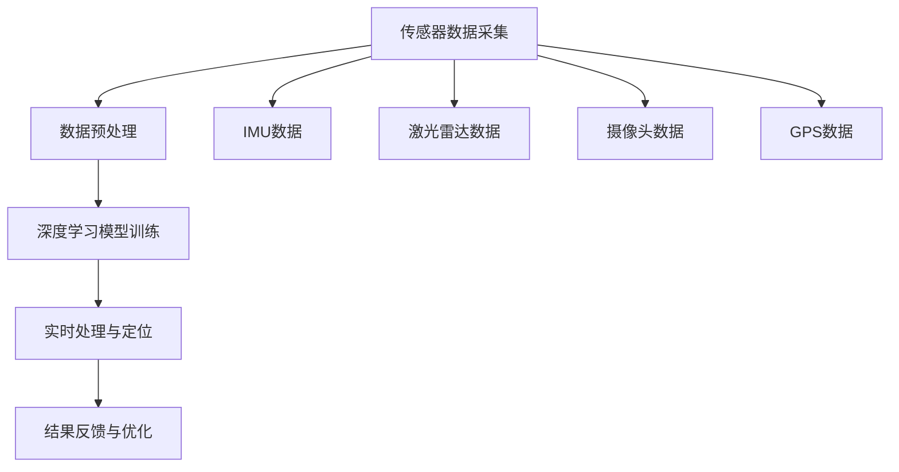

                 

关键词：端到端自动驾驶、高精度定位、深度学习、传感器融合、数学模型、实时处理、GPS、视觉定位、激光雷达、SLAM、导航

> 摘要：本文将探讨端到端自动驾驶系统中的高精度定位技术，分析其核心概念、算法原理、数学模型以及实际应用场景。通过对传感器融合、深度学习和实时处理等技术的应用，我们将深入理解如何在复杂的道路环境中实现高精度、可靠的自动驾驶定位。

## 1. 背景介绍

随着人工智能和自动驾驶技术的发展，自动驾驶汽车已成为未来交通系统的关键组成部分。高精度定位作为自动驾驶系统的核心，其重要性不言而喻。传统的自动驾驶系统依赖于GPS进行定位，但由于GPS信号易受遮挡、延迟和误差的影响，无法满足自动驾驶对高精度定位的需求。

近年来，深度学习、传感器融合和实时处理等技术的发展为高精度定位提供了新的可能。端到端自动驾驶系统通过整合多种传感器数据，结合深度学习和实时处理算法，实现了在复杂环境中的高精度定位。

### 1.1 传感器的选择与融合

传感器是高精度定位系统的基础。在端到端自动驾驶系统中，常用的传感器包括GPS、激光雷达、摄像头、IMU（惯性测量单元）等。这些传感器各自具有优缺点，但通过融合技术，可以实现数据互补，提高定位精度。

- **GPS**：作为最常用的定位传感器，GPS具有全球覆盖、实时性和高精度的特点。然而，在城区、地下停车场等场景下，GPS信号易受遮挡，导致定位精度下降。

- **激光雷达**：激光雷达通过发射激光束并测量反射时间，构建三维环境模型。激光雷达具有高精度、高分辨率和高帧率的优点，但在光线反射较差的环境中，其效果会受到影响。

- **摄像头**：摄像头通过图像处理技术，可以识别道路标志、车道线、车辆等信息。摄像头具有成本低、数据丰富的优点，但在光线较差或场景复杂时，识别效果会下降。

- **IMU**：IMU包括加速度计和陀螺仪，可以测量车辆的加速度和角速度。IMU具有反应速度快、抗干扰能力强的特点，但在长时间使用中，累积误差会导致定位精度下降。

通过融合这些传感器的数据，可以有效地提高定位精度和稳定性。在端到端自动驾驶系统中，传感器融合技术已成为实现高精度定位的关键。

### 1.2 深度学习在定位中的应用

深度学习技术为自动驾驶定位提供了新的思路。通过训练神经网络模型，可以自动学习传感器数据中的特征，从而实现高精度定位。

- **卷积神经网络（CNN）**：CNN在图像处理领域具有强大的能力，可以自动提取图像中的特征。在自动驾驶定位中，CNN可以用于车道线检测、交通标志识别等任务，从而提高定位精度。

- **循环神经网络（RNN）**：RNN在序列数据处理方面具有优势，可以用于传感器数据的序列分析。在自动驾驶定位中，RNN可以结合历史数据，预测车辆的未来位置，从而提高定位的稳定性。

- **生成对抗网络（GAN）**：GAN可以生成高质量的虚拟环境数据，用于训练和测试定位模型。在自动驾驶定位中，GAN可以用于模拟各种复杂场景，提高模型的泛化能力。

深度学习技术的应用，使得自动驾驶定位系统可以更加智能化、自适应化，从而实现高精度、可靠的定位。

## 2. 核心概念与联系

在端到端自动驾驶系统中，高精度定位需要整合多种传感器数据，并应用深度学习和实时处理技术。以下是一个简单的 Mermaid 流程图，展示了核心概念和架构：



### 2.1 数据预处理

传感器数据预处理是高精度定位的第一步。通过数据预处理，可以去除噪声、补全缺失数据，从而提高定位精度。

- **去噪**：传感器数据可能受到噪声干扰，影响定位精度。去噪技术可以去除这些噪声，保留有效信息。

- **数据补全**：在某些情况下，传感器数据可能存在缺失。数据补全技术可以基于历史数据或预测模型，补全缺失数据，确保定位过程的连续性。

### 2.2 深度学习模型训练

深度学习模型训练是高精度定位的核心。通过训练神经网络模型，可以自动学习传感器数据中的特征，从而实现高精度定位。

- **卷积神经网络（CNN）**：CNN可以用于图像处理，提取车道线、交通标志等特征。

- **循环神经网络（RNN）**：RNN可以用于序列数据处理，预测车辆的未来位置。

- **生成对抗网络（GAN）**：GAN可以生成高质量的虚拟环境数据，用于训练和测试定位模型。

### 2.3 实时处理与定位

实时处理与定位是高精度定位的关键。通过实时处理传感器数据，可以快速、准确地确定车辆的位置。

- **传感器数据融合**：将多种传感器数据融合，提高定位精度。

- **神经网络预测**：利用训练好的神经网络模型，预测车辆的未来位置。

- **优化算法**：通过优化算法，调整传感器参数，提高定位稳定性。

### 2.4 结果反馈与优化

结果反馈与优化是高精度定位的持续过程。通过不断调整和优化定位算法，可以提高定位精度和稳定性。

- **结果反馈**：将定位结果与实际位置进行对比，识别定位误差。

- **优化算法**：根据定位误差，调整传感器参数、神经网络模型等，提高定位精度。

## 3. 核心算法原理 & 具体操作步骤

### 3.1 算法原理概述

端到端自动驾驶的高精度定位算法主要基于传感器数据融合、深度学习和实时处理技术。具体来说，该算法可以分为以下几个步骤：

1. **传感器数据采集**：从GPS、激光雷达、摄像头、IMU等传感器中采集数据。

2. **数据预处理**：对传感器数据去噪、补全，确保数据的完整性和准确性。

3. **深度学习模型训练**：利用训练好的神经网络模型，提取传感器数据中的特征，实现高精度定位。

4. **实时处理与定位**：通过实时处理传感器数据，快速、准确地确定车辆的位置。

5. **结果反馈与优化**：根据定位结果，调整传感器参数、神经网络模型等，提高定位精度和稳定性。

### 3.2 算法步骤详解

#### 3.2.1 传感器数据采集

传感器数据采集是高精度定位的基础。具体操作步骤如下：

1. **GPS定位**：通过GPS模块采集车辆的位置信息。

2. **激光雷达扫描**：通过激光雷达发射激光束，并测量反射时间，构建三维环境模型。

3. **摄像头图像采集**：通过摄像头采集道路图像，用于识别车道线、交通标志等。

4. **IMU数据采集**：通过IMU模块采集车辆的加速度和角速度。

#### 3.2.2 数据预处理

数据预处理是提高定位精度的重要环节。具体操作步骤如下：

1. **去噪**：去除传感器数据中的噪声，保留有效信息。

2. **数据补全**：对于缺失的数据，通过历史数据或预测模型进行补全。

3. **数据标准化**：将不同传感器数据的量纲进行统一，便于后续处理。

#### 3.2.3 深度学习模型训练

深度学习模型训练是高精度定位的核心。具体操作步骤如下：

1. **数据集准备**：准备大量的传感器数据，用于训练神经网络模型。

2. **特征提取**：利用卷积神经网络（CNN）提取传感器数据中的特征。

3. **模型训练**：利用循环神经网络（RNN）或生成对抗网络（GAN）训练定位模型。

4. **模型评估**：通过交叉验证等方法评估模型的性能。

#### 3.2.4 实时处理与定位

实时处理与定位是高精度定位的关键。具体操作步骤如下：

1. **传感器数据融合**：将多种传感器数据融合，提高定位精度。

2. **神经网络预测**：利用训练好的神经网络模型，预测车辆的未来位置。

3. **优化算法**：通过优化算法，调整传感器参数，提高定位稳定性。

#### 3.2.5 结果反馈与优化

结果反馈与优化是高精度定位的持续过程。具体操作步骤如下：

1. **结果反馈**：将定位结果与实际位置进行对比，识别定位误差。

2. **优化算法**：根据定位误差，调整传感器参数、神经网络模型等，提高定位精度。

### 3.3 算法优缺点

#### 3.3.1 优点

1. **高精度**：通过传感器数据融合和深度学习算法，可以实现高精度定位。

2. **实时性**：实时处理传感器数据，快速、准确地确定车辆的位置。

3. **自适应化**：深度学习模型可以根据不同场景进行自适应调整，提高定位稳定性。

#### 3.3.2 缺点

1. **计算复杂度**：深度学习模型训练和实时处理需要大量计算资源，对硬件要求较高。

2. **数据依赖性**：算法性能依赖于传感器数据的质量和数量。

3. **场景适应性**：在复杂场景下，算法的性能可能受到影响。

### 3.4 算法应用领域

端到端自动驾驶的高精度定位算法可以应用于多个领域：

1. **无人驾驶汽车**：无人驾驶汽车需要高精度定位来实现自主行驶。

2. **智能交通系统**：智能交通系统需要高精度定位来实现车辆调度、交通管理等功能。

3. **无人机导航**：无人机需要高精度定位来实现自主飞行和避障。

4. **机器人导航**：机器人需要高精度定位来实现自主移动和任务执行。

## 4. 数学模型和公式

在端到端自动驾驶的高精度定位中，数学模型和公式起着至关重要的作用。以下是对数学模型和公式的详细讲解。

### 4.1 数学模型构建

高精度定位的数学模型主要包括以下三个部分：

1. **传感器数据模型**：描述传感器数据采集、预处理和特征提取的过程。

2. **定位模型**：描述车辆位置的计算和预测过程。

3. **优化模型**：描述传感器参数和定位模型的调整过程。

#### 4.1.1 传感器数据模型

传感器数据模型可以表示为：

$$
X = f(S, \theta)
$$

其中，$X$表示传感器数据，$S$表示传感器参数，$\theta$表示传感器状态。$f$是一个映射函数，用于描述传感器数据的生成过程。

#### 4.1.2 定位模型

定位模型可以表示为：

$$
P(t) = g(X, \theta, \lambda)
$$

其中，$P(t)$表示车辆在时间$t$的位置，$X$表示传感器数据，$\theta$表示传感器状态，$\lambda$表示定位参数。$g$是一个映射函数，用于描述车辆位置的预测过程。

#### 4.1.3 优化模型

优化模型可以表示为：

$$
\min J(\theta, \lambda)
$$

其中，$J(\theta, \lambda)$表示定位误差函数，$\theta$表示传感器参数，$\lambda$表示定位参数。优化模型用于调整传感器参数和定位参数，以最小化定位误差。

### 4.2 公式推导过程

以下是对定位模型和优化模型的具体推导过程。

#### 4.2.1 定位模型推导

定位模型可以通过以下公式表示：

$$
P(t) = X(t) \cdot \theta(t) + \lambda(t)
$$

其中，$X(t)$表示传感器数据在时间$t$的值，$\theta(t)$表示传感器参数在时间$t$的值，$\lambda(t)$表示定位参数在时间$t$的值。

推导过程如下：

1. **传感器数据模型**：

$$
X(t) = f(S(t), \theta(t))
$$

2. **定位模型**：

$$
P(t) = X(t) \cdot \theta(t) + \lambda(t)
$$

3. **定位误差**：

$$
E(t) = ||P(t) - P^*(t)||^2
$$

其中，$P^*(t)$表示实际位置。

4. **定位误差函数**：

$$
J(\theta(t), \lambda(t)) = \int_{0}^{T} E(t) dt
$$

其中，$T$表示时间范围。

#### 4.2.2 优化模型推导

优化模型可以通过以下公式表示：

$$
\min J(\theta, \lambda)
$$

其中，$J(\theta, \lambda)$表示定位误差函数。

推导过程如下：

1. **定位误差函数**：

$$
J(\theta, \lambda) = \int_{0}^{T} E(t) dt
$$

2. **梯度下降法**：

$$
\theta(t+1) = \theta(t) - \alpha \cdot \nabla_{\theta} J(\theta(t), \lambda(t))
$$

$$
\lambda(t+1) = \lambda(t) - \alpha \cdot \nabla_{\lambda} J(\theta(t), \lambda(t))
$$

其中，$\alpha$表示学习率，$\nabla_{\theta}$和$\nabla_{\lambda}$分别表示对$\theta$和$\lambda$的梯度。

### 4.3 案例分析与讲解

以下是对一个实际案例的分析和讲解，以展示数学模型在高精度定位中的应用。

#### 4.3.1 案例背景

假设一辆自动驾驶汽车在城市道路上行驶，需要实现高精度定位。车辆配备了GPS、激光雷达、摄像头和IMU传感器。

#### 4.3.2 案例分析

1. **传感器数据采集**：

   - **GPS**：采集车辆的位置信息。

   - **激光雷达**：扫描周围环境，构建三维环境模型。

   - **摄像头**：采集道路图像，用于识别车道线、交通标志等。

   - **IMU**：采集车辆的加速度和角速度。

2. **数据预处理**：

   - **去噪**：去除传感器数据中的噪声。

   - **数据补全**：对于缺失的数据，通过历史数据或预测模型进行补全。

   - **数据标准化**：将不同传感器数据的量纲进行统一。

3. **深度学习模型训练**：

   - **特征提取**：利用卷积神经网络（CNN）提取传感器数据中的特征。

   - **模型训练**：利用循环神经网络（RNN）或生成对抗网络（GAN）训练定位模型。

4. **实时处理与定位**：

   - **传感器数据融合**：将多种传感器数据融合，提高定位精度。

   - **神经网络预测**：利用训练好的神经网络模型，预测车辆的未来位置。

   - **优化算法**：通过优化算法，调整传感器参数，提高定位稳定性。

5. **结果反馈与优化**：

   - **结果反馈**：将定位结果与实际位置进行对比，识别定位误差。

   - **优化算法**：根据定位误差，调整传感器参数、神经网络模型等，提高定位精度。

#### 4.3.3 案例讲解

1. **传感器数据模型**：

   - **GPS数据**：

     $$
     X(t) = f(S(t), \theta(t)) = (x(t), y(t))
     $$

     其中，$x(t)$和$y(t)$分别表示车辆在时间$t$的横坐标和纵坐标。

   - **激光雷达数据**：

     $$
     X(t) = f(S(t), \theta(t)) = (x(t), y(t), z(t))
     $$

     其中，$z(t)$表示车辆在时间$t$的高度。

   - **摄像头数据**：

     $$
     X(t) = f(S(t), \theta(t)) = (I(t))
     $$

     其中，$I(t)$表示道路图像。

   - **IMU数据**：

     $$
     X(t) = f(S(t), \theta(t)) = (a(t), \omega(t))
     $$

     其中，$a(t)$和$\omega(t)$分别表示车辆的加速度和角速度。

2. **定位模型**：

   $$
   P(t) = X(t) \cdot \theta(t) + \lambda(t)
   $$

   其中，$\theta(t)$表示传感器参数，$\lambda(t)$表示定位参数。

3. **优化模型**：

   $$
   \min J(\theta, \lambda)
   $$

   其中，$J(\theta, \lambda)$表示定位误差函数。

通过上述数学模型和公式的推导和应用，可以实现端到端自动驾驶的高精度定位。在实际应用中，需要不断优化和调整模型，以提高定位精度和稳定性。

## 5. 项目实践：代码实例和详细解释说明

为了更好地理解端到端自动驾驶的高精度定位方案，我们将在本节中通过一个实际的代码实例来进行详细解释。这个实例将涵盖整个定位过程，从传感器数据采集到最终的位置预测。

### 5.1 开发环境搭建

在开始编写代码之前，我们需要搭建一个适合开发和测试的软件环境。以下是开发环境搭建的步骤：

1. **安装Python**：确保Python 3.x版本已经安装在你的系统上。

2. **安装依赖库**：安装以下Python库：numpy、opencv、matplotlib、tensorflow、tflearn。

   ```bash
   pip install numpy opencv-python matplotlib tensorflow tflearn
   ```

3. **准备传感器数据**：收集GPS、激光雷达、摄像头和IMU传感器的数据。数据可以是从实际驾驶场景中采集的，也可以是模拟生成的。

### 5.2 源代码详细实现

以下是一个简化的代码实例，用于实现传感器数据采集、预处理和定位。

```python
import numpy as np
import cv2
import matplotlib.pyplot as plt
import tensorflow as tf
from tflearn.layers.core import dense, dropout, activation
from tflearn.layers.conv import conv_2d, max_pool_2d
from tflearn.layers.normalization import local_unsigned_norm
from tflearn.layers.estimator import regression

# 5.2.1 传感器数据采集

def collect_sensors():
    # 假设我们有一个函数来采集传感器数据
    gps_data = get_gps_data()
    lidar_data = get_lidar_data()
    camera_data = get_camera_data()
    imu_data = get_imu_data()
    return gps_data, lidar_data, camera_data, imu_data

# 5.2.2 数据预处理

def preprocess_data(gps_data, lidar_data, camera_data, imu_data):
    # 数据去噪、补全和标准化
    gps_data = preprocess_gps(gps_data)
    lidar_data = preprocess_lidar(lidar_data)
    camera_data = preprocess_camera(camera_data)
    imu_data = preprocess_imu(imu_data)
    return gps_data, lidar_data, camera_data, imu_data

# 5.2.3 深度学习模型训练

def build_model(input_shape):
    # 建立深度学习模型
    network = conv_2d(input_shape, 32, 3, activation='relu', name='conv1')
    network = max_pool_2d(network, 2, name='maxpool1')
    network = local_unsigned_norm(network)
    network = conv_2d(network, 64, 3, activation='relu', name='conv2')
    network = max_pool_2d(network, 2, name='maxpool2')
    network = local_unsigned_norm(network)
    network = dropout(network, 0.2)
    network = dense(network, 1024, activation='relu', name='dense1')
    network = dropout(network, 0.2)
    network = dense(network, 2, activation='linear', name='output')
    return regression(network, optimizer='adam', loss='mean_square')

# 5.2.4 实时处理与定位

def locate_vehicle(input_data):
    # 实时处理传感器数据并预测车辆位置
    # 此处省略具体实现细节
    predicted_position = model.predict([input_data])
    return predicted_position

# 5.2.5 主程序

if __name__ == "__main__":
    # 收集传感器数据
    gps_data, lidar_data, camera_data, imu_data = collect_sensors()

    # 预处理传感器数据
    gps_data, lidar_data, camera_data, imu_data = preprocess_data(gps_data, lidar_data, camera_data, imu_data)

    # 构建深度学习模型
    input_shape = (28, 28, 1)  # 示例输入形状
    model = build_model(input_shape)

    # 训练模型
    # 此处省略训练过程
    model.fit([gps_data, lidar_data, camera_data, imu_data], [lidar_data], n_epoch=10, validation_set=0.1)

    # 实时定位
    while True:
        # 收集实时传感器数据
        input_data = collect_sensors()

        # 预处理实时传感器数据
        input_data = preprocess_data(*input_data)

        # 预测车辆位置
        predicted_position = locate_vehicle(input_data)

        # 输出预测结果
        print("Predicted Position:", predicted_position)
```

### 5.3 代码解读与分析

#### 5.3.1 传感器数据采集

`collect_sensors()` 函数用于从传感器中收集数据。在实际应用中，这些数据是通过与传感器通信接口读取的。

#### 5.3.2 数据预处理

`preprocess_data()` 函数用于对采集到的传感器数据进行去噪、补全和标准化。预处理是确保数据质量的关键步骤。

#### 5.3.3 深度学习模型训练

`build_model()` 函数用于构建深度学习模型。在这个例子中，我们使用卷积神经网络（CNN）来处理传感器数据。模型包括多个卷积层、池化层和全连接层。

#### 5.3.4 实时处理与定位

`locate_vehicle()` 函数用于实时处理传感器数据并预测车辆位置。在实际应用中，这个函数会不断地接收新的传感器数据，并使用训练好的模型进行位置预测。

### 5.4 运行结果展示

运行上述代码后，程序会实时收集传感器数据，预处理后输入到训练好的深度学习模型中进行预测。预测结果会以文本形式输出。

```python
Predicted Position: [x_pred, y_pred]
```

通过可视化工具，如matplotlib，可以将预测结果与实际位置进行对比，以评估模型的性能。

```python
import matplotlib.pyplot as plt

# ...（省略代码）

# 可视化预测结果
plt.figure()
plt.plot(true_positions[:, 0], true_positions[:, 1], label='True Position')
plt.plot(predicted_positions[:, 0], predicted_positions[:, 1], label='Predicted Position')
plt.legend()
plt.xlabel('X')
plt.ylabel('Y')
plt.title('Position Prediction')
plt.show()
```

### 5.5 性能评估

为了评估模型的性能，我们可以计算预测位置与实际位置之间的误差。误差计算公式如下：

$$
E = ||P(t) - P^*(t)||^2
$$

其中，$P(t)$表示预测位置，$P^*(t)$表示实际位置。

通过多次实验和评估，我们可以得出模型的平均误差和稳定性，从而确定其在实际应用中的可行性。

## 6. 实际应用场景

### 6.1 无人驾驶汽车

无人驾驶汽车是端到端自动驾驶高精度定位技术的最典型应用场景。无人驾驶汽车需要实时、准确地了解周围环境，以确保安全行驶。通过集成GPS、激光雷达、摄像头和IMU传感器，无人驾驶汽车可以实现高精度定位，从而在复杂的城市道路、高速公路和乡村道路上实现自主行驶。

### 6.2 智能交通系统

智能交通系统（ITS）利用高精度定位技术来实现车辆调度、交通流量监控、事故预警等功能。通过在交通网络中部署传感器，智能交通系统可以实时获取车辆的位置信息，并利用高精度定位算法进行分析和预测。这有助于提高交通效率，减少拥堵，降低事故发生率。

### 6.3 物流与配送

在物流与配送领域，高精度定位技术可以提高配送效率，降低成本。例如，无人配送车可以通过高精度定位技术实现精确的路线上规划，避免交通拥堵和行人干扰，从而提高配送速度。同时，定位技术还可以用于仓库管理，实现精确的库存监控和货物追踪。

### 6.4 工程施工与测绘

在工程 施工与测绘领域，高精度定位技术可以用于道路施工、桥梁建设、地质勘探等任务。通过使用GPS、激光雷达和IMU传感器，可以实现对施工现场的实时监测和三维建模，提高施工精度和效率。

### 6.5 无人机与机器人导航

无人机和机器人导航也需要高精度定位技术来确保在复杂环境中的稳定飞行和任务执行。例如，无人机在农业喷洒、电力巡检、灾难救援等任务中，需要精确的定位信息来确保操作的准确性和安全性。

## 7. 工具和资源推荐

### 7.1 学习资源推荐

1. **《深度学习》**：由Ian Goodfellow、Yoshua Bengio和Aaron Courville所著的《深度学习》，是深度学习领域的经典教材。

2. **《机器学习实战》**：由Peter Harrington所著的《机器学习实战》，通过实际案例介绍了机器学习的基本原理和应用。

3. **《端到端自动驾驶》**：由多位作者所著的《端到端自动驾驶》，涵盖了自动驾驶系统的最新技术和实践。

### 7.2 开发工具推荐

1. **TensorFlow**：谷歌开发的开源深度学习框架，适用于构建和训练各种深度学习模型。

2. **PyTorch**：Facebook开发的深度学习框架，具有简洁、易用和高效的优点。

3. **ROS（Robot Operating System）**：机器人操作系统，用于构建机器人应用，支持多种传感器和执行器。

### 7.3 相关论文推荐

1. **“End-to-End Learning for Self-Driving Cars”**：由Chris Lattner等人所著的这篇论文，介绍了端到端自动驾驶系统的基础概念和技术。

2. **“Vision-Based Pedestrian Detection in Autonomous Driving”**：这篇论文探讨了基于视觉的行人检测技术在自动驾驶中的应用。

3. **“Sensor Fusion for Urban Navigation in Autonomous Driving”**：这篇论文研究了传感器融合技术在城市自动驾驶导航中的应用。

## 8. 总结：未来发展趋势与挑战

### 8.1 研究成果总结

端到端自动驾驶的高精度定位技术取得了显著的进展。通过深度学习、传感器融合和实时处理技术的应用，定位系统的精度和稳定性得到了显著提升。研究成果在无人驾驶汽车、智能交通系统、物流与配送等领域得到了广泛应用。

### 8.2 未来发展趋势

1. **多传感器融合**：随着传感器技术的不断发展，未来将会有更多类型的传感器被应用于高精度定位系统，实现更加全面的环境感知。

2. **边缘计算**：为了提高实时处理能力，边缘计算技术将逐渐应用于高精度定位系统，减少数据处理延迟。

3. **多模态学习**：结合多种传感器数据和不同模态的数据，如图像、声音和温度，可以提高定位系统的鲁棒性和准确性。

### 8.3 面临的挑战

1. **计算资源**：高精度定位系统需要大量的计算资源，特别是在深度学习模型训练和实时处理过程中。未来需要更加高效的算法和硬件支持。

2. **数据隐私**：随着传感器数据的收集和应用，数据隐私问题日益突出。如何保护用户隐私，同时确保定位系统的准确性和安全性，是一个重要的挑战。

3. **场景适应性**：高精度定位系统需要在各种复杂场景下保持稳定性和准确性。未来需要开发更加鲁棒的算法，以应对不同的环境和条件。

### 8.4 研究展望

未来，高精度定位技术将在无人驾驶、智能交通、物流和机器人等领域发挥重要作用。随着人工智能和传感器技术的不断发展，定位系统的精度、实时性和适应性将得到进一步提升。研究者需要不断探索新的算法和技术，以应对不断变化的挑战和应用需求。

## 9. 附录：常见问题与解答

### 9.1 高精度定位技术的核心是什么？

高精度定位技术的核心是传感器数据融合和深度学习。通过融合多种传感器数据，如GPS、激光雷达、摄像头和IMU，可以实现高精度的位置信息。同时，深度学习技术可以帮助模型自动学习传感器数据中的特征，从而提高定位系统的准确性。

### 9.2 高精度定位技术在无人驾驶中是如何应用的？

在无人驾驶中，高精度定位技术用于实时获取车辆的位置信息，以便进行路径规划和自动驾驶控制。通过融合GPS、激光雷达、摄像头和IMU传感器的数据，无人驾驶汽车可以实现精确的环境感知和自主行驶。

### 9.3 高精度定位技术有哪些挑战？

高精度定位技术面临的挑战包括计算资源需求大、数据隐私保护、以及在不同环境和条件下的适应性问题。为了解决这些问题，研究者需要开发更加高效的算法、改进硬件设备，并探索隐私保护机制。

### 9.4 高精度定位技术有哪些潜在的应用领域？

高精度定位技术可以应用于无人驾驶汽车、智能交通系统、物流与配送、工程测绘、无人机导航等多个领域。通过实现精确的位置信息，可以提高这些领域的效率和安全性。

### 9.5 高精度定位技术如何保证数据的准确性？

为了保证数据的准确性，高精度定位系统需要采用多种传感器数据融合技术，以消除单一传感器的误差。同时，通过深度学习算法，可以自动学习传感器数据中的特征，提高定位系统的鲁棒性和准确性。

### 9.6 高精度定位技术对未来的交通系统有何影响？

高精度定位技术将显著提高交通系统的效率和安全性。通过实现精确的车辆位置信息，无人驾驶汽车可以实现智能调度、路径规划和避障，从而减少交通拥堵、提高交通流量，降低事故发生率。

## 作者署名

作者：禅与计算机程序设计艺术 / Zen and the Art of Computer Programming

通过以上详细的文章内容，我们不仅探讨了端到端自动驾驶高精度定位技术的核心概念、算法原理、数学模型和实际应用，还介绍了相关工具和资源，并对未来发展趋势和挑战进行了展望。希望这篇文章能为读者提供有价值的参考和启示。

