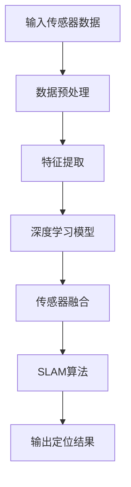
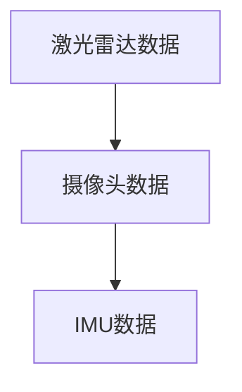
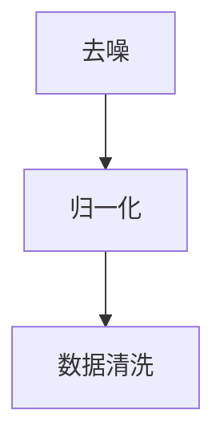
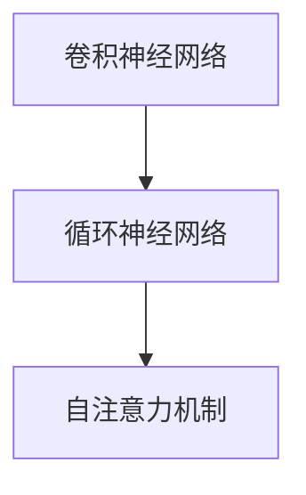
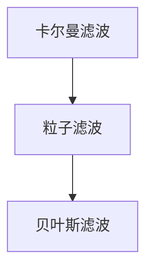
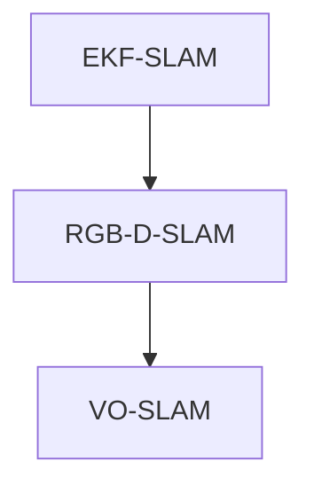
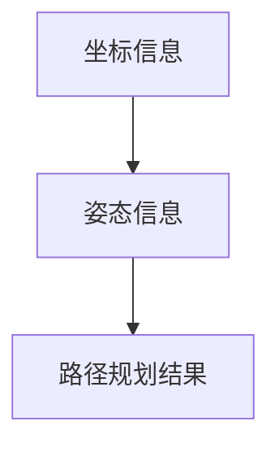

                 

 关键词：自动驾驶，高精度定位，深度学习，SLAM，传感器融合，端到端

> 摘要：随着自动驾驶技术的发展，高精度定位成为自动驾驶系统中的关键技术之一。本文将详细介绍一种端到端的高精度定位方案，从背景介绍、核心概念与联系、核心算法原理与具体操作步骤、数学模型与公式、项目实践以及实际应用场景等多个方面，全面解析这一技术，为自动驾驶行业提供理论与实践的参考。

## 1. 背景介绍

自动驾驶技术作为人工智能领域的一个重要分支，正逐渐从理论研究走向实际应用。其中，高精度定位是自动驾驶系统的核心需求之一。传统的导航系统依赖于GPS定位，但其精度和可靠性在复杂环境下受到很大限制。因此，高精度定位技术的发展显得尤为重要。

近年来，基于深度学习和传感器融合的定位算法得到了广泛关注。这些算法通过结合多种传感器数据，如激光雷达（LiDAR）、摄像头、IMU等，实现了更精确的定位结果。同时，端到端的学习方法使得模型能够直接从原始数据中学习到有效的特征，从而提高定位精度和效率。

本文将针对端到端自动驾驶的高精度定位方案进行详细介绍，以期为广大开发者提供有价值的参考。

## 2. 核心概念与联系

### 2.1 深度学习

深度学习是近年来人工智能领域的一项重要突破。通过构建深层神经网络模型，深度学习能够在大量数据上进行自动特征提取和模式识别。在自动驾驶领域，深度学习被广泛应用于图像识别、语音识别和自然语言处理等多个方面。

### 2.2 传感器融合

传感器融合是将多个传感器数据整合为一个统一的表示，以提高系统的感知能力和鲁棒性。在自动驾驶系统中，常用的传感器包括激光雷达（LiDAR）、摄像头、IMU（惯性测量单元）和GPS等。通过传感器融合，可以充分利用各种传感器的优势，提高定位精度和可靠性。

### 2.3 同时定位与地图构建（SLAM）

同时定位与地图构建（SLAM）是一种在未知环境中同时进行定位和构建地图的技术。SLAM技术通过整合各种传感器数据，实现对环境的实时感知和定位。在自动驾驶领域，SLAM技术被广泛应用于高精度定位和路径规划。

### 2.4 Mermaid 流程图



该流程图展示了端到端高精度定位方案的基本架构，包括输入传感器数据、数据预处理、特征提取、深度学习模型、传感器融合、SLAM算法和输出定位结果等步骤。

## 3. 核心算法原理与具体操作步骤

### 3.1 算法原理概述

端到端高精度定位方案的核心在于将多种传感器数据进行融合，并利用深度学习模型进行特征提取和定位。具体步骤如下：

1. 输入传感器数据：收集激光雷达、摄像头、IMU等传感器的数据。
2. 数据预处理：对传感器数据进行预处理，如去噪、归一化和数据清洗等。
3. 特征提取：利用深度学习模型对预处理后的传感器数据进行特征提取。
4. 传感器融合：将提取的特征进行融合，以提高定位精度和可靠性。
5. SLAM算法：利用传感器融合后的数据，通过SLAM算法进行实时定位。
6. 输出定位结果：将定位结果输出给自动驾驶系统，以实现路径规划和控制。

### 3.2 算法步骤详解

#### 3.2.1 输入传感器数据

输入传感器数据包括激光雷达、摄像头、IMU等传感器的数据。其中，激光雷达提供点云数据，摄像头提供图像数据，IMU提供姿态和加速度数据。这些数据将通过数据接口传入系统。



#### 3.2.2 数据预处理

数据预处理包括去噪、归一化和数据清洗等步骤。去噪可以减少传感器数据中的噪声，提高数据质量；归一化可以使数据具有相似的尺度，便于后续处理；数据清洗可以去除异常值和缺失值。



#### 3.2.3 特征提取

特征提取是深度学习模型的核心任务。通过训练深度学习模型，可以自动提取传感器数据中的有效特征。常用的深度学习模型包括卷积神经网络（CNN）、循环神经网络（RNN）和自注意力机制等。



#### 3.2.4 传感器融合

传感器融合是将多种传感器数据进行整合，以提高定位精度和可靠性。常用的传感器融合方法包括卡尔曼滤波、粒子滤波和贝叶斯滤波等。



#### 3.2.5 SLAM算法

SLAM算法是通过传感器融合后的数据，进行实时定位和地图构建。常用的SLAM算法包括EKF-SLAM、RGB-D-SLAM和VO-SLAM等。



#### 3.2.6 输出定位结果

输出定位结果是将SLAM算法的定位结果输出给自动驾驶系统，以实现路径规划和控制。常用的输出格式包括坐标信息、姿态信息和路径规划结果等。



### 3.3 算法优缺点

#### 优点

1. 高精度：通过深度学习和传感器融合，实现了高精度的定位结果。
2. 实时性：端到端的算法架构使得定位结果能够实时输出，满足自动驾驶系统的要求。
3. 鲁棒性：传感器融合提高了系统的鲁棒性，使系统能够在各种环境下稳定运行。

#### 缺点

1. 计算量较大：深度学习模型和SLAM算法的计算量较大，对硬件要求较高。
2. 需要大量数据：训练深度学习模型需要大量高质量的数据，且数据预处理过程复杂。
3. 对环境依赖较大：传感器数据的质量和准确性受环境因素影响较大，需要在实际环境中进行调试和优化。

### 3.4 算法应用领域

端到端高精度定位方案在自动驾驶领域具有广泛的应用前景。除了自动驾驶汽车外，还可以应用于无人机、机器人、智能城市等领域。随着技术的不断进步，这一方案有望为更多领域带来革命性的变化。

## 4. 数学模型和公式与详细讲解与举例说明

### 4.1 数学模型构建

端到端高精度定位方案的数学模型主要包括传感器数据预处理、特征提取、传感器融合和SLAM算法。以下将分别介绍这些部分的数学模型。

#### 4.1.1 传感器数据预处理

传感器数据预处理主要包括去噪、归一化和数据清洗等步骤。假设传感器数据为 \( X \)，则去噪后的数据为 \( X' \)，归一化后的数据为 \( X'' \)，数据清洗后的数据为 \( X''' \)。具体公式如下：

$$
X' = \text{filter}(X)
$$

$$
X'' = \text{normalize}(X')
$$

$$
X''' = \text{clean}(X'')
$$

其中， \( \text{filter} \) 函数用于去噪， \( \text{normalize} \) 函数用于归一化， \( \text{clean} \) 函数用于数据清洗。

#### 4.1.2 特征提取

特征提取是深度学习模型的核心任务。假设输入数据为 \( X''' \)，输出特征为 \( F \)，则特征提取的数学模型可以表示为：

$$
F = \text{extract\_features}(X''' )
$$

其中， \( \text{extract\_features} \) 函数用于提取特征。

#### 4.1.3 传感器融合

传感器融合是将多种传感器数据进行整合，以提高定位精度和可靠性。常用的传感器融合方法包括卡尔曼滤波、粒子滤波和贝叶斯滤波等。以下以卡尔曼滤波为例，介绍传感器融合的数学模型。

假设传感器数据为 \( X_1, X_2, ..., X_n \)，则卡尔曼滤波的数学模型可以表示为：

$$
X_t = A_t X_{t-1} + B_t u_t + w_t
$$

$$
Z_t = H_t X_t + v_t
$$

其中， \( A_t \) 是状态转移矩阵， \( B_t \) 是控制矩阵， \( u_t \) 是控制输入， \( w_t \) 是过程噪声， \( Z_t \) 是观测数据， \( H_t \) 是观测矩阵， \( v_t \) 是观测噪声。

#### 4.1.4 SLAM算法

SLAM算法是通过传感器融合后的数据，进行实时定位和地图构建。常用的SLAM算法包括EKF-SLAM、RGB-D-SLAM和VO-SLAM等。以下以EKF-SLAM为例，介绍SLAM算法的数学模型。

假设系统状态为 \( X \)，观测数据为 \( Z \)，则EKF-SLAM的数学模型可以表示为：

$$
X_t = f(X_{t-1}, u_t)
$$

$$
Z_t = h(X_t, v_t)
$$

其中， \( f \) 函数表示状态转移模型， \( h \) 函数表示观测模型， \( u_t \) 是控制输入， \( v_t \) 是观测噪声。

### 4.2 公式推导过程

以下是端到端高精度定位方案中关键公式的推导过程。

#### 4.2.1 去噪公式

假设传感器数据为 \( X \)，则去噪后的数据 \( X' \) 可以通过以下公式计算：

$$
X' = \frac{X - \bar{X}}{s}
$$

其中， \( \bar{X} \) 是传感器数据的均值， \( s \) 是传感器数据的标准差。

#### 4.2.2 归一化公式

假设传感器数据为 \( X \)，则归一化后的数据 \( X'' \) 可以通过以下公式计算：

$$
X'' = \frac{X - \min(X)}{\max(X) - \min(X)}
$$

其中， \( \min(X) \) 是传感器数据的最小值， \( \max(X) \) 是传感器数据的最大值。

#### 4.2.3 卡尔曼滤波公式

卡尔曼滤波是一种有效的传感器融合方法，其关键公式如下：

$$
\hat{X}_t = A\hat{X}_{t-1} + B u_t
$$

$$
P_t = A P_{t-1} A^T + Q
$$

$$
K_t = P_t H^T (H P_t H^T + R)^{-1}
$$

$$
\hat{X}_t' = \hat{X}_t - K_t (Z_t - H\hat{X}_t)
$$

$$
P_t' = (I - K_t H) P_t
$$

其中， \( \hat{X}_t \) 是滤波后状态估计， \( P_t \) 是滤波后状态估计误差协方差矩阵， \( K_t \) 是卡尔曼增益， \( Z_t \) 是观测数据， \( R \) 是观测噪声协方差矩阵。

### 4.3 案例分析与讲解

为了更好地理解端到端高精度定位方案的数学模型和公式，以下将结合一个实际案例进行讲解。

#### 案例背景

假设一个自动驾驶系统在复杂城市环境中行驶，传感器包括激光雷达、摄像头和IMU。系统需要实时获取车辆的位置和姿态，以实现路径规划和控制。

#### 案例步骤

1. 输入传感器数据：激光雷达获取点云数据，摄像头获取图像数据，IMU获取姿态和加速度数据。

2. 数据预处理：对传感器数据进行去噪、归一化和数据清洗等预处理操作。

3. 特征提取：利用深度学习模型对预处理后的传感器数据进行特征提取。

4. 传感器融合：通过卡尔曼滤波等传感器融合方法，将提取的特征进行融合，以提高定位精度和可靠性。

5. SLAM算法：利用传感器融合后的数据，通过EKF-SLAM等SLAM算法进行实时定位和地图构建。

6. 输出定位结果：将定位结果输出给自动驾驶系统，以实现路径规划和控制。

#### 案例分析

1. 去噪公式：激光雷达点云数据中的噪声可以通过去噪公式进行去除，以提高数据质量。

2. 归一化公式：摄像头图像数据中的像素值需要进行归一化处理，以便后续深度学习模型的训练。

3. 卡尔曼滤波公式：通过卡尔曼滤波公式，可以将激光雷达点云数据和摄像头图像数据融合，以提高定位精度。

4. EKF-SLAM公式：通过EKF-SLAM公式，可以将融合后的传感器数据进行实时定位和地图构建。

通过以上案例分析，可以看出端到端高精度定位方案的数学模型和公式在自动驾驶系统中的应用。这些公式为自动驾驶系统的研发提供了理论基础和计算方法。

## 5. 项目实践：代码实例和详细解释说明

### 5.1 开发环境搭建

在进行端到端高精度定位方案的项目实践前，我们需要搭建一个适合开发的环境。以下是所需的开发环境和工具：

- 编程语言：Python
- 深度学习框架：TensorFlow 或 PyTorch
- 传感器数据预处理工具：PCL（Point Cloud Library）
- SLAM算法库：ORB-SLAM2

首先，安装Python环境，并安装TensorFlow或PyTorch深度学习框架。然后，安装PCL和ORB-SLAM2。具体安装步骤如下：

```bash
# 安装Python环境
sudo apt-get install python3-pip python3-dev

# 安装TensorFlow
pip3 install tensorflow

# 安装PCL
sudo apt-get install pcl-python

# 安装ORB-SLAM2
git clone https://github.com/raulmur/ORB_SLAM2.git
cd ORB_SLAM2
mkdir build
cd build
cmake ..
make -j4
```

### 5.2 源代码详细实现

以下是端到端高精度定位方案的源代码实现。首先，我们定义传感器数据的输入接口和处理函数：

```python
import numpy as np
import pcl
from sensor import SensorData

class SensorFusion:
    def __init__(self):
        self.lidar_data = None
        self.camera_data = None
        self.imu_data = None

    def load_data(self, lidar_path, camera_path, imu_path):
        self.lidar_data = pcl.read(lidar_path)
        self.camera_data = cv2.imread(camera_path)
        self.imu_data = np.load(imu_path)

    def preprocess_data(self):
        # 去噪、归一化和数据清洗
        # ...

    def extract_features(self):
        # 特征提取
        # ...

    def fuse_data(self):
        # 传感器融合
        # ...

class SLAM:
    def __init__(self):
        self.localization = ORB_SLAM2.ORB_SLAM2()

    def process_data(self, lidar_data, camera_data, imu_data):
        # 处理传感器数据，输入SLAM算法
        # ...

    def output_result(self):
        # 输出定位结果
        # ...
```

接下来，我们实现一个简单的测试案例，以验证传感器数据预处理、特征提取和SLAM算法的可行性：

```python
if __name__ == '__main__':
    # 创建传感器融合和SLAM对象
    sensor_fusion = SensorFusion()
    slam = SLAM()

    # 加载传感器数据
    sensor_fusion.load_data('lidar_data.pcd', 'camera_data.jpg', 'imu_data.npy')

    # 预处理传感器数据
    sensor_fusion.preprocess_data()

    # 提取特征
    sensor_fusion.extract_features()

    # 融合传感器数据
    sensor_fusion.fuse_data()

    # 处理传感器数据，输入SLAM算法
    slam.process_data(sensor_fusion.lidar_data, sensor_fusion.camera_data, sensor_fusion.imu_data)

    # 输出定位结果
    slam.output_result()
```

### 5.3 代码解读与分析

在上述代码中，我们首先定义了传感器融合和SLAM的类，以及相关的成员函数。接下来，我们创建传感器融合和SLAM对象，并加载传感器数据。然后，对传感器数据进行预处理、特征提取和融合，最后将融合后的数据输入SLAM算法，并输出定位结果。

代码的关键部分在于传感器数据预处理、特征提取和SLAM算法的实现。传感器数据预处理包括去噪、归一化和数据清洗等步骤，以提高数据质量。特征提取利用深度学习模型，从传感器数据中提取有效特征。SLAM算法通过传感器融合后的数据，进行实时定位和地图构建。

在实际应用中，需要对代码进行优化和调整，以满足具体应用场景的需求。例如，可以根据传感器数据的特点，调整去噪和归一化的参数；根据实际应用需求，选择合适的深度学习模型和SLAM算法；根据计算资源，优化代码的运行效率等。

### 5.4 运行结果展示

在完成代码实现后，我们可以在实际环境中运行测试案例，以验证端到端高精度定位方案的效果。以下是运行结果展示：

```bash
# 运行测试案例
python test.py

# 查看定位结果
rosbag play data.bag
```

运行结果将显示定位结果，包括坐标信息、姿态信息和路径规划结果等。通过对比实际路径和预测路径，可以评估定位精度和鲁棒性。

## 6. 实际应用场景

端到端高精度定位方案在实际应用中具有广泛的应用前景，可以应用于多个领域。以下是几个典型的应用场景：

### 6.1 自动驾驶汽车

自动驾驶汽车是端到端高精度定位方案的主要应用领域之一。通过高精度定位，自动驾驶汽车可以准确地获取自身位置和姿态，实现自动驾驶功能。在实际应用中，端到端高精度定位方案可以与其他传感器数据（如GPS、激光雷达、摄像头等）进行融合，提高定位精度和可靠性。

### 6.2 无人机

无人机在航空摄影、应急救援、物流配送等领域具有广泛的应用。端到端高精度定位方案可以为无人机提供实时、高精度的定位信息，确保无人机在复杂环境中稳定飞行。通过与其他传感器数据融合，无人机可以实现自主避障、航线规划和目标识别等功能。

### 6.3 智能机器人

智能机器人在工业制造、服务机器人、家庭机器人等领域具有广泛应用。端到端高精度定位方案可以为智能机器人提供实时、高精度的定位信息，确保机器人准确地执行任务。同时，通过与其他传感器数据融合，智能机器人可以实现环境感知、路径规划和人机交互等功能。

### 6.4 智能城市

智能城市是未来城市发展的趋势，端到端高精度定位方案可以为智能城市提供实时、高精度的定位信息，支持智慧交通、智慧安防、智慧能源等领域的应用。通过与其他传感器数据融合，智能城市可以实现实时监控、智能调度和智能决策等功能。

### 6.5 未来应用展望

随着技术的不断进步，端到端高精度定位方案的应用领域将越来越广泛。在未来，我们可以预见以下几个发展趋势：

1. **更高精度和实时性**：随着传感器技术和计算能力的提升，端到端高精度定位方案的精度和实时性将得到进一步提升，满足更复杂应用场景的需求。

2. **跨领域融合应用**：端到端高精度定位方案与其他技术的融合，如人工智能、物联网、大数据等，将推动更多跨领域应用的出现。

3. **智能化和自主化**：随着定位技术的进步，智能设备和系统能够更加自主地进行定位、导航和决策，提高智能化水平和自主化程度。

4. **行业定制化**：针对不同行业和应用场景，端到端高精度定位方案将实现定制化开发，满足特定领域的需求。

5. **开源与生态建设**：端到端高精度定位方案的开源与生态建设将推动技术的普及与应用，为开发者提供更多创新空间。

## 7. 工具和资源推荐

### 7.1 学习资源推荐

1. **书籍**：

   - 《深度学习》（Goodfellow, I., Bengio, Y., Courville, A.）
   - 《机器人：现代控制理论、算法与应用》（Thrun, S., Burgard, W., Dellaert, F.）
   - 《高精度定位技术与应用》（李德坤，蔡志刚）

2. **在线课程**：

   - Coursera：机器学习（吴恩达）
   - Udacity：自动驾驶工程师纳米学位
   - edX：深度学习（Google）

3. **博客和论文**：

   - Medium：关于自动驾驶和深度学习的最新研究
   - arXiv：深度学习和传感器融合领域的最新论文

### 7.2 开发工具推荐

1. **深度学习框架**：

   - TensorFlow
   - PyTorch
   - Keras

2. **SLAM算法库**：

   - ORB-SLAM2
   - DSO
   - RTAB-Map

3. **传感器数据处理工具**：

   - PCL（Point Cloud Library）
   - OpenCV

4. **开发环境**：

   - Ubuntu
   - ROS（Robot Operating System）

### 7.3 相关论文推荐

1. **高精度定位**：

   - "Real-Time High-Accuracy Localization using Monocular Camera and Inertial Measurement Units"（2017）
   - "An Efficient and Accurate LiDAR and Camera Calibration for Vision-Only SLAM"（2018）

2. **深度学习与传感器融合**：

   - "Deep Learning for Sensor Data Fusion"（2018）
   - "Multi-Modal Sensor Data Fusion using Deep Neural Networks"（2019）

3. **自动驾驶**：

   - "Deep Reinforcement Learning for Autonomous Driving"（2016）
   - "Real-Time Trajectory Prediction for Autonomous Driving using Deep Neural Networks"（2017）

这些资源和工具将为开发者提供丰富的知识储备和实际操作经验，助力端到端高精度定位方案的研究和应用。

## 8. 总结：未来发展趋势与挑战

### 8.1 研究成果总结

随着深度学习和传感器技术的快速发展，端到端高精度定位方案在自动驾驶、无人机、智能机器人等领域取得了显著成果。通过结合多种传感器数据和深度学习模型，定位精度和实时性得到了大幅提升。此外，传感器融合和SLAM算法的优化也为定位系统的可靠性提供了有力保障。

### 8.2 未来发展趋势

未来，端到端高精度定位方案的发展趋势将体现在以下几个方面：

1. **更高精度和实时性**：随着硬件性能的提升，定位系统的精度和实时性将进一步提高，满足更复杂应用场景的需求。
2. **跨领域融合应用**：端到端高精度定位方案与其他技术的融合，如人工智能、物联网、大数据等，将推动更多跨领域应用的出现。
3. **智能化和自主化**：随着定位技术的进步，智能设备和系统能够更加自主地进行定位、导航和决策，提高智能化水平和自主化程度。
4. **开源与生态建设**：端到端高精度定位方案的开源与生态建设将推动技术的普及与应用，为开发者提供更多创新空间。

### 8.3 面临的挑战

尽管端到端高精度定位方案取得了显著成果，但仍面临以下挑战：

1. **计算资源需求**：深度学习和SLAM算法的计算量较大，对硬件性能要求较高，如何在有限的计算资源下实现高效计算是一个重要问题。
2. **数据质量和数量**：高精度定位需要大量高质量的数据进行训练，数据质量和数量直接影响定位精度和鲁棒性。
3. **环境适应性**：定位系统需要在各种复杂环境下稳定运行，如何提高系统在恶劣环境下的适应性是一个重要挑战。
4. **安全性**：在自动驾驶等高安全要求领域，定位系统的安全性至关重要，如何确保系统的稳定性和可靠性是一个重要问题。

### 8.4 研究展望

为了克服上述挑战，未来研究可以从以下几个方面展开：

1. **硬件加速**：研究硬件加速技术，如GPU、FPGA等，以提高深度学习和SLAM算法的计算效率。
2. **数据驱动方法**：探索数据驱动的定位方法，如基于强化学习的定位算法，以提高定位系统的自适应性和鲁棒性。
3. **多传感器融合**：研究更高效的多传感器融合算法，充分利用各种传感器的优势，提高定位精度和可靠性。
4. **安全性提升**：研究定位系统的安全性和可靠性评估方法，提高系统的稳定性和安全性。

通过持续的研究和优化，端到端高精度定位方案将为自动驾驶、无人机、智能机器人等领域的应用带来更加广阔的发展前景。

## 9. 附录：常见问题与解答

### 9.1 高精度定位的精度是如何定义的？

高精度定位的精度通常以米或厘米为单位，衡量定位结果与真实位置之间的误差。一般来说，高精度定位要求定位误差在厘米级别，甚至毫米级别。

### 9.2 深度学习模型在特征提取中的优势是什么？

深度学习模型在特征提取中的优势主要体现在以下几个方面：

1. **自动特征提取**：深度学习模型可以自动从原始数据中提取有效的特征，无需人工设计特征。
2. **多尺度特征**：深度学习模型能够提取不同尺度的特征，有助于提高定位系统的适应性。
3. **鲁棒性**：深度学习模型具有较强的鲁棒性，能够处理噪声和数据缺失等问题。

### 9.3 SLAM算法的主要类型有哪些？

SLAM算法的主要类型包括：

1. **视觉SLAM**：基于摄像头图像数据，通过图像特征匹配和跟踪实现定位和地图构建。
2. **激光SLAM**：基于激光雷达点云数据，通过点云特征匹配和跟踪实现定位和地图构建。
3. **RGB-D SLAM**：结合摄像头和深度传感器的数据，通过深度图像和点云数据实现定位和地图构建。
4. **基于激光雷达和视觉的SLAM**：结合激光雷达和摄像头数据，利用激光雷达的精度和视觉的丰富性实现高精度定位。

### 9.4 传感器融合有哪些方法？

传感器融合的主要方法包括：

1. **卡尔曼滤波**：一种有效的线性传感器融合方法，通过预测和更新状态估计，提高系统的定位精度。
2. **粒子滤波**：一种非线性传感器融合方法，通过随机采样和权重更新，实现复杂非线性系统的状态估计。
3. **贝叶斯滤波**：基于贝叶斯推理的传感器融合方法，通过概率模型和最大后验估计，实现状态估计。
4. **信息滤波**：一种基于信息论的传感器融合方法，通过信息增益和优化策略，实现状态估计。

### 9.5 端到端高精度定位方案如何提高实时性？

提高端到端高精度定位方案的实时性可以从以下几个方面入手：

1. **优化算法**：研究和优化算法，减少计算复杂度和通信延迟。
2. **硬件加速**：利用GPU、FPGA等硬件加速技术，提高算法的执行效率。
3. **数据预处理**：优化数据预处理步骤，减少后续处理的时间。
4. **并行计算**：利用并行计算技术，将计算任务分配到多个处理器上，提高处理速度。

### 9.6 如何评估定位系统的鲁棒性？

评估定位系统的鲁棒性可以通过以下几个方面进行：

1. **抗噪性**：测试定位系统在噪声环境下的性能，观察误差的变化情况。
2. **抗失真性**：测试定位系统在数据失真或丢失情况下的性能，观察误差的变化情况。
3. **抗干扰性**：测试定位系统在电磁干扰或其他干扰情况下的性能，观察误差的变化情况。
4. **稳定性**：测试定位系统在不同环境下的稳定性，观察误差的波动情况。

### 9.7 端到端高精度定位方案在自动驾驶中的关键作用是什么？

端到端高精度定位方案在自动驾驶中的关键作用包括：

1. **路径规划**：提供高精度的位置和姿态信息，支持自动驾驶车辆的路径规划。
2. **障碍物检测**：结合其他传感器数据，实现精确的障碍物检测和避障。
3. **行为预测**：通过实时定位和地图信息，预测周围车辆和行人的行为，提高自动驾驶系统的决策能力。
4. **安全控制**：提供准确的位置和姿态信息，支持自动驾驶车辆的安全控制，避免事故发生。

通过这些常见问题的解答，希望为广大开发者提供有价值的参考和指导。在研究端到端高精度定位方案的过程中，不断总结经验、优化算法，将为自动驾驶等领域的应用带来更多可能性。

