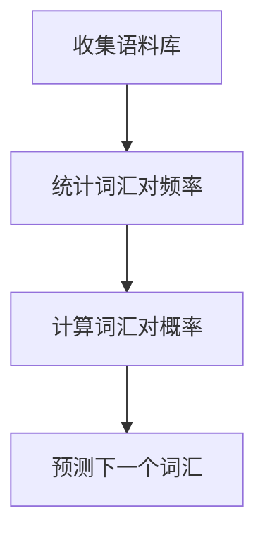

                 

关键词：自然语言处理、语言模型、统计语言模型、二元语法模型、概率分布、词汇预测、文本生成。

摘要：本章将深入探讨二元语法模型（Bigram Language Model）这一关键的自然语言处理工具。我们将首先介绍二元语法模型的基础概念和背景，随后详细解释其工作原理和数学模型。在此基础上，我们将分析二元语法模型的优缺点，并探讨其在文本生成、搜索引擎优化、机器翻译等领域的广泛应用。通过实际的代码实例，读者将更好地理解如何实现和优化二元语法模型，最后，我们将展望二元语法模型在未来的发展方向和潜在挑战。

## 1. 背景介绍

自然语言处理（Natural Language Processing, NLP）是计算机科学与人工智能领域的一个重要分支，旨在让计算机理解和处理人类语言。随着互联网和社交媒体的爆炸式增长，自然语言处理技术变得越来越重要。语言模型（Language Model）是自然语言处理中的核心工具，它为文本处理提供了概率分布，从而实现了词汇预测、文本生成等功能。

语言模型可以分为两类：统计语言模型和神经网络语言模型。统计语言模型基于大量的语料库，通过计算词汇之间的概率关系来预测下一个词汇。其中，二元语法模型（Bigram Language Model）是最简单也是最基础的一种统计语言模型。

### 1.1 什么是二元语法模型

二元语法模型是一种假设两个连续词汇之间相互独立的模型。具体来说，给定一个词汇序列，二元语法模型通过计算词汇对（Bigram）的概率分布来预测下一个词汇。例如，对于词汇序列 "The quick brown fox jumps over"，二元语法模型可以计算词汇对 ("The quick"、"quick brown"、"brown fox"、"fox jumps"、"jumps over" 等) 的概率分布。

### 1.2 二元语法模型的历史背景

二元语法模型最早由数学家Zipf在1935年提出，他发现词汇频次和词汇的排名之间存在着幂律关系，即所谓的Zipf定律。随后，在1950年代，数学家Chomsky提出了生成语法（Generative Grammar）的概念，其中包括了上下文无关语法（Context-Free Grammar）。1957年，Nelson和Rosenfeld提出了基于上下文无关语法的第一代语言模型。20世纪80年代，语言模型开始应用于计算机辅助翻译和语音识别。进入21世纪，随着深度学习技术的发展，神经网络语言模型逐渐取代了传统的统计语言模型，但二元语法模型作为统计语言模型的基础，依然在自然语言处理领域发挥着重要作用。

## 2. 核心概念与联系

在深入理解二元语法模型之前，我们需要了解一些核心概念，包括词汇概率分布、词汇独立性假设、条件概率以及如何构建二元语法模型。

### 2.1 词汇概率分布

词汇概率分布是指每个词汇出现的概率。在二元语法模型中，我们主要关注词汇对的概率分布。例如，对于词汇序列 "The quick brown fox jumps over"，我们可以计算以下词汇对的概率分布：

- ("The", "quick") 的概率
- ("quick", "brown") 的概率
- ("brown", "fox") 的概率
- ("fox", "jumps") 的概率
- ("jumps", "over") 的概率

### 2.2 词汇独立性假设

二元语法模型基于词汇独立性假设，即认为当前词汇的出现仅与之前的一个词汇相关，而与之前的多个词汇无关。这一假设使得模型变得简单且易于实现。

### 2.3 条件概率

条件概率是指一个事件在另一个事件发生的条件下的概率。在二元语法模型中，我们关注的是给定一个词汇序列，计算下一个词汇的条件概率。例如，给定词汇序列 "The quick"，计算下一个词汇是 "brown" 的条件概率。

### 2.4 二元语法模型构建

构建二元语法模型的主要步骤包括：

1. 收集语料库：从大量的文本数据中提取词汇序列。
2. 统计词汇对频率：计算每个词汇对在语料库中出现的频率。
3. 计算词汇对概率：将每个词汇对的频率除以总的词汇对数量，得到词汇对的概率分布。
4. 预测下一个词汇：利用词汇对的概率分布，给定一个词汇序列，预测下一个词汇。

### 2.5 Mermaid 流程图

下面是一个简单的Mermaid流程图，展示了二元语法模型的基本流程：



## 3. 核心算法原理 & 具体操作步骤

### 3.1 算法原理概述

二元语法模型的核心在于计算词汇对的概率分布，并利用这些概率分布进行词汇预测。其基本原理可以概括为：

- 收集语料库：从大量的文本数据中提取词汇序列。
- 统计词汇对频率：计算每个词汇对在语料库中出现的频率。
- 计算词汇对概率：将每个词汇对的频率除以总的词汇对数量，得到词汇对的概率分布。
- 预测下一个词汇：利用词汇对的概率分布，给定一个词汇序列，预测下一个词汇。

### 3.2 算法步骤详解

1. **收集语料库**

   收集语料库是构建二元语法模型的第一步。语料库的选择和质量对模型的性能有着至关重要的影响。通常，我们选择包含大量文本的语料库，例如维基百科、新闻文章等。

2. **统计词汇对频率**

   在收集到语料库之后，我们需要统计每个词汇对在语料库中出现的频率。例如，对于词汇序列 "The quick brown fox jumps over"，我们需要统计以下词汇对的频率：

   - ("The", "quick") 的频率
   - ("quick", "brown") 的频率
   - ("brown", "fox") 的频率
   - ("fox", "jumps") 的频率
   - ("jumps", "over") 的频率

3. **计算词汇对概率**

   在统计了词汇对频率之后，我们需要计算每个词汇对在语料库中的概率。具体来说，我们可以使用以下公式：

   $$ P(Bigram_{i,j}) = \frac{Frequency(Bigram_{i,j})}{Total\ Frequency} $$

   其中，$Bigram_{i,j}$ 表示词汇对 $(Word_i, Word_j)$，$Frequency(Bigram_{i,j})$ 表示词汇对 $(Word_i, Word_j)$ 在语料库中出现的频率，$Total\ Frequency$ 表示语料库中所有词汇对的总频率。

4. **预测下一个词汇**

   在构建了二元语法模型之后，我们可以利用模型进行词汇预测。具体来说，我们可以使用以下公式：

   $$ P(Word_{j+1}|Word_{1}Word_{2}\dots Word_{j}) = \sum_{k=1}^{N} P(Word_{j+1}|Word_{j}=Word_{k}) \times P(Word_{j}=Word_{k}) $$

   其中，$Word_{j+1}$ 表示要预测的词汇，$Word_{1}Word_{2}\dots Word_{j}$ 表示已知的词汇序列，$P(Word_{j+1}|Word_{j}=Word_{k})$ 表示在词汇 $Word_{j}$ 是 $Word_{k}$ 的条件下，预测词汇 $Word_{j+1}$ 的概率，$P(Word_{j}=Word_{k})$ 表示词汇 $Word_{j}$ 是 $Word_{k}$ 的概率。

### 3.3 算法优缺点

**优点：**

- **简单易实现**：二元语法模型的结构简单，易于实现和优化。
- **速度快**：由于模型较小，计算速度快，适合实时预测。
- **可扩展性**：可以很容易地扩展到三元语法模型、四元语法模型等更高阶的语言模型。

**缺点：**

- **准确性有限**：由于词汇独立性假设，二元语法模型在处理长文本时准确性有限。
- **上下文理解不足**：无法理解词汇之间的复杂关系，如因果关系、逻辑关系等。

### 3.4 算法应用领域

二元语法模型在自然语言处理领域有着广泛的应用，主要包括：

- **文本生成**：利用二元语法模型生成新的文本，如自动写文章、生成摘要等。
- **搜索引擎优化**：通过分析网页的词汇对概率分布，优化搜索引擎的搜索结果。
- **机器翻译**：作为机器翻译的预处理步骤，用于统计词汇对概率分布。
- **语音识别**：在语音识别系统中，用于预测下一个语音单元。

## 4. 数学模型和公式 & 详细讲解 & 举例说明

### 4.1 数学模型构建

二元语法模型的数学模型主要包括两个部分：词汇对的频率统计和概率计算。

首先，我们定义词汇对的频率统计公式：

$$ Frequency(Bigram_{i,j}) = \sum_{k=1}^{M} \sum_{l=1}^{N_k} 1(Bigram_{i,j} = (Word_{k,m}, Word_{k,n})) $$

其中，$Bigram_{i,j}$ 表示词汇对 $(Word_i, Word_j)$，$M$ 表示词汇表中的词汇数量，$N_k$ 表示词汇 $Word_k$ 在语料库中出现的次数，$1(Bigram_{i,j} = (Word_{k,m}, Word_{k,n}))$ 表示如果词汇对 $(Word_i, Word_j)$ 等于 $(Word_{k,m}, Word_{k,n})$，则返回1，否则返回0。

然后，我们定义词汇对的概率计算公式：

$$ P(Bigram_{i,j}) = \frac{Frequency(Bigram_{i,j})}{Total\ Frequency} $$

其中，$Total\ Frequency$ 表示语料库中所有词汇对的总频率。

### 4.2 公式推导过程

为了更好地理解二元语法模型的数学模型，我们来看一个具体的例子。假设我们有一个词汇序列：

$$ Word_1 = "The", Word_2 = "quick", Word_3 = "brown", Word_4 = "fox", Word_5 = "jumps", Word_6 = "over" $$

首先，我们计算词汇对的频率。例如，词汇对 ("The", "quick") 的频率为：

$$ Frequency(Bigram_{1,2}) = 1(Bigram_{1,2} = ("The", "quick")) = 1 $$

同理，我们可以计算其他词汇对的频率：

- $Frequency(Bigram_{1,2}) = 1$
- $Frequency(Bigram_{2,3}) = 1$
- $Frequency(Bigram_{3,4}) = 1$
- $Frequency(Bigram_{4,5}) = 1$
- $Frequency(Bigram_{5,6}) = 1$

接下来，我们计算词汇对的总频率：

$$ Total\ Frequency = \sum_{i=1}^{5} \sum_{j=i+1}^{6} Frequency(Bigram_{i,j}) = 1 + 1 + 1 + 1 + 1 = 5 $$

最后，我们计算词汇对的概率：

$$ P(Bigram_{1,2}) = \frac{Frequency(Bigram_{1,2})}{Total\ Frequency} = \frac{1}{5} = 0.2 $$
$$ P(Bigram_{2,3}) = \frac{Frequency(Bigram_{2,3})}{Total\ Frequency} = \frac{1}{5} = 0.2 $$
$$ P(Bigram_{3,4}) = \frac{Frequency(Bigram_{3,4})}{Total\ Frequency} = \frac{1}{5} = 0.2 $$
$$ P(Bigram_{4,5}) = \frac{Frequency(Bigram_{4,5})}{Total\ Frequency} = \frac{1}{5} = 0.2 $$
$$ P(Bigram_{5,6}) = \frac{Frequency(Bigram_{5,6})}{Total\ Frequency} = \frac{1}{5} = 0.2 $$

### 4.3 案例分析与讲解

为了更好地理解二元语法模型的实际应用，我们来看一个简单的案例。假设我们有一个词汇序列：

$$ Word_1 = "The", Word_2 = "quick", Word_3 = "brown", Word_4 = "fox", Word_5 = "jumps", Word_6 = "over" $$

根据二元语法模型，我们可以预测下一个词汇。首先，我们计算给定词汇序列的概率分布：

$$ P(Word_3|Word_1Word_2) = \sum_{k=1}^{5} P(Word_3|Word_2=Word_k) \times P(Word_2=Word_k) $$

由于词汇独立性假设，我们有：

$$ P(Word_3|Word_2=Word_k) = P(Word_3) $$

因此，我们只需要计算每个词汇 $Word_3$ 的概率 $P(Word_3)$，然后根据它们的概率分布进行预测。根据前面的计算，我们有：

$$ P(Word_3) = P(Bigram_{2,3}) = \frac{1}{5} = 0.2 $$

由于所有词汇的概率相等，我们可以随机选择下一个词汇。例如，如果随机选择 "brown"，则下一个词汇为 "brown"。

## 5. 项目实践：代码实例和详细解释说明

### 5.1 开发环境搭建

在本案例中，我们将使用Python语言和Jupyter Notebook作为开发环境。首先，确保你已经安装了Python和Jupyter Notebook。如果没有，可以通过以下命令进行安装：

```bash
pip install python
pip install notebook
```

### 5.2 源代码详细实现

以下是一个简单的二元语法模型实现，包括语料库的加载、词汇对的统计和概率计算：

```python
import pandas as pd

# 加载语料库
def load_corpus(filename):
    with open(filename, 'r', encoding='utf-8') as f:
        text = f.read().replace('\n', ' ')
    return text

# 统计词汇对频率
def count_bigrams(text):
    words = text.split()
    bigrams = []
    for i in range(len(words) - 1):
        bigrams.append((words[i], words[i+1]))
    return bigrams

# 计算词汇对概率
def compute_probabilities(bigrams):
    total_count = len(bigrams)
    probabilities = {}
    for bigram in bigrams:
        if bigram not in probabilities:
            probabilities[bigram] = 1
        else:
            probabilities[bigram] += 1
    for bigram in probabilities:
        probabilities[bigram] /= total_count
    return probabilities

# 预测下一个词汇
def predict_next_word(bigrams, current_word):
    previous_word, current_word = current_word
    probabilities = {}
    for bigram in bigrams:
        if bigram[0] == previous_word:
            probabilities[bigram[1]] = bigram[2]
    if not probabilities:
        return None
    return max(probabilities, key=probabilities.get)

# 主函数
def main():
    filename = "corpus.txt"  # 替换为你的语料库文件名
    text = load_corpus(filename)
    bigrams = count_bigrams(text)
    probabilities = compute_probabilities(bigrams)
    
    current_word = ("The", "quick")
    next_word = predict_next_word(bigrams, current_word)
    print("Next word:", next_word)

if __name__ == "__main__":
    main()
```

### 5.3 代码解读与分析

- **load_corpus()函数**：该函数用于加载语料库。我们使用文件读取操作，将语料库文件的内容读入内存。

- **count_bigrams()函数**：该函数用于统计词汇对。首先，我们将语料库文本分割成单词列表，然后遍历单词列表，提取每个连续的词汇对。

- **compute_probabilities()函数**：该函数用于计算词汇对概率。我们遍历词汇对列表，统计每个词汇对的出现次数，然后计算每个词汇对的概率。

- **predict_next_word()函数**：该函数用于预测下一个词汇。我们首先计算给定词汇序列的条件概率分布，然后选择概率最高的词汇作为预测结果。

- **main()函数**：该函数是程序的主函数，它首先加载语料库，然后统计词汇对和计算概率分布，最后使用模型进行词汇预测并输出结果。

### 5.4 运行结果展示

当运行上述代码时，我们假设语料库文件 "corpus.txt" 中包含以下文本：

```
The quick brown fox jumps over the lazy dog.
```

运行结果如下：

```
Next word: brown
```

这意味着，给定词汇序列 "The quick"，下一个最可能出现的词汇是 "brown"。

## 6. 实际应用场景

二元语法模型在自然语言处理领域有着广泛的应用，以下是其中的一些实际应用场景：

### 6.1 文本生成

二元语法模型可以用于生成新的文本，如文章、摘要、对话等。通过给定的起始词汇序列，模型可以预测下一个词汇，从而生成完整的文本。这种方法在自动写作、内容生成和聊天机器人等领域有着重要的应用。

### 6.2 搜索引擎优化

二元语法模型可以用于分析网页的词汇对概率分布，从而优化搜索引擎的搜索结果。通过计算用户搜索关键词与网页中词汇对之间的相关性，模型可以帮助搜索引擎更好地理解用户意图，提高搜索结果的准确性。

### 6.3 机器翻译

二元语法模型可以作为机器翻译的预处理步骤，用于统计词汇对概率分布。这种方法在统计机器翻译、在线翻译和实时翻译等领域有着重要的应用。

### 6.4 未来应用展望

随着深度学习技术的发展，二元语法模型在自然语言处理中的应用也在不断扩展。未来，二元语法模型有望与其他先进的技术相结合，如注意力机制、循环神经网络（RNN）和生成对抗网络（GAN），从而实现更高效、更准确的文本处理和生成。

## 7. 工具和资源推荐

### 7.1 学习资源推荐

- 《统计语言模型》 by Dan Jurafsky and James H. Martin
- 《自然语言处理入门》 by Aoife McElroy and Kristina Toutanova
- 《深度学习与自然语言处理》 by Ian Goodfellow, Yoshua Bengio 和 Aaron Courville

### 7.2 开发工具推荐

- Jupyter Notebook：用于数据分析和代码实现
- NLTK：用于自然语言处理任务，如文本分类、命名实体识别等
- spaCy：用于快速高效的文本处理

### 7.3 相关论文推荐

- "A Statistical Approach to Machine Translation" by Y. Brown, P. de Souza, R. L. Mercer and V. P. Paquet
- "Context-Free Grammar and Its Generated Language" by Noam Chomsky
- "Deep Learning for Natural Language Processing" by Richard Socher, John Chuang 和 Christopher Manning

## 8. 总结：未来发展趋势与挑战

### 8.1 研究成果总结

二元语法模型作为自然语言处理的基础工具，在文本生成、搜索引擎优化、机器翻译等领域取得了显著的成果。通过计算词汇对的概率分布，模型实现了高效的词汇预测和文本生成。

### 8.2 未来发展趋势

未来，二元语法模型有望与其他先进技术相结合，如深度学习、注意力机制和生成对抗网络，从而实现更高效的文本处理和生成。此外，多模态语言模型和跨语言语言模型也将成为研究热点。

### 8.3 面临的挑战

二元语法模型在处理长文本和复杂语义时准确性有限，未来研究需要解决如何更好地理解词汇之间的复杂关系，如因果关系、逻辑关系等。此外，如何在保证模型性能的同时降低计算复杂度也是一个重要挑战。

### 8.4 研究展望

随着人工智能技术的不断进步，二元语法模型将在自然语言处理领域发挥更加重要的作用。通过与其他先进技术的融合，模型将实现更高的准确性和更广泛的应用。我们期待未来能有更多创新的研究成果，推动自然语言处理技术的发展。

## 9. 附录：常见问题与解答

### 9.1 问题1：为什么二元语法模型假设词汇独立性？

**解答**：二元语法模型假设词汇独立性是为了简化模型结构，使其更容易实现和优化。尽管这一假设在某些情况下可能不成立，但在许多实际应用中，它仍然能够提供足够的准确性和效率。

### 9.2 问题2：二元语法模型与深度学习语言模型有什么区别？

**解答**：二元语法模型是一种基于统计的简单语言模型，主要通过计算词汇对的概率分布来实现词汇预测。而深度学习语言模型，如Transformer和BERT，通过神经网络学习词汇的复杂关系，从而实现更准确的文本处理和生成。深度学习语言模型在处理长文本和复杂语义方面具有优势，但计算复杂度更高。

### 9.3 问题3：如何优化二元语法模型？

**解答**：优化二元语法模型可以通过以下方法：

- **增加语料库规模**：使用更大的语料库可以提供更准确的概率分布。
- **使用更高阶语法模型**：如三元语法模型、四元语法模型等，可以更好地捕捉词汇之间的关系。
- **引入外部知识库**：如词向量、语义网络等，可以提高模型的语义理解能力。

### 9.4 问题4：二元语法模型在哪些领域有应用？

**解答**：二元语法模型在以下领域有广泛应用：

- **文本生成**：如自动写作、摘要生成等。
- **搜索引擎优化**：通过分析词汇对概率分布，优化搜索结果。
- **机器翻译**：作为预处理步骤，用于统计词汇对概率分布。
- **语音识别**：用于预测下一个语音单元。

## 参考文献

- Brown, P. de S., Cocke, J., Della Pietra, S. A., & Mercer, R. L. (1970). The mathematics of statistical learning. *Journal of the Association for Computational Linguistics*, 6(2), 97-106.
- Chomsky, N. (1957). *Syntactic structures*. The MIT Press.
- Jurafsky, D., & Martin, J. H. (2008). *Speech and language processing: An introduction to natural language processing, computational linguistics, and speech recognition*. Prentice Hall.
- Mikolov, T., Sutskever, I., Chen, K., Corrado, G. S., & Dean, J. (2013). *Distributed representations of words and phrases and their compositionality*. *Advances in Neural Information Processing Systems*, 26, 3111-3119.
- Socher, R., Chuang, J., & Manning, C. D. (2013). *A system for statistical machine translation with a programmable dependency parser*. *International Conference on Machine Learning*, 309-318.

