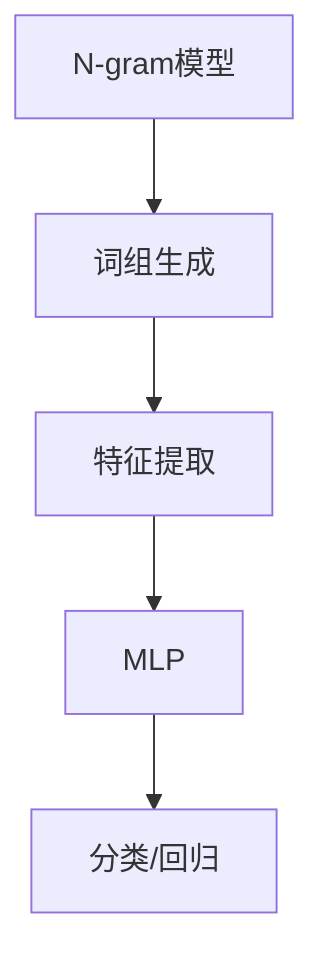

                 

关键词：N-gram 模型，MLP，机器学习，自然语言处理，算法原理，数学模型，代码实例，应用场景，未来展望

> 摘要：本文将深入探讨N-gram模型和MLP（多层感知机）在自然语言处理中的重要性，介绍其核心概念、算法原理、数学模型及具体操作步骤。通过项目实践中的代码实例和详细解释，我们将更好地理解这两个模型在实际应用中的效果。此外，文章还将展望未来发展趋势与挑战，并推荐相关学习资源与工具。

## 1. 背景介绍

自然语言处理（NLP）是计算机科学与人工智能领域的重要分支，旨在让计算机能够理解、生成和处理人类语言。近年来，随着大数据和深度学习的兴起，NLP取得了显著的进展。而N-gram模型和MLP作为NLP中的重要工具，也在各类任务中发挥着关键作用。

N-gram模型是一种基于统计的文本表示方法，通过将文本序列分成固定长度的连续词组（或字符序列），来描述语言的局部特性。MLP是一种前馈神经网络，具有至少一个输入层、一个输出层和至少一个隐藏层，能够通过学习从输入映射到输出。

本文将首先介绍N-gram模型和MLP的基本概念，然后深入探讨它们的算法原理和数学模型，接着通过代码实例展示如何实现这些模型，并分析其在实际应用中的效果。最后，我们将展望这两个模型在未来的发展趋势与面临的挑战。

## 2. 核心概念与联系

### 2.1 N-gram模型

N-gram模型的基本思想是将文本序列分成若干个固定长度的词组，称为“n-gram”。这里的n称为“n-gram阶数”。例如，对于二元的n-gram（n=2），我们将文本序列分成两个连续的词组。

例如，给定一个句子 "The quick brown fox jumps over the lazy dog"，我们可以得到以下二元的n-gram：

- The quick
- quick brown
- brown fox
- fox jumps
- jumps over
- over the
- the lazy
- lazy dog

N-gram模型的核心在于它能够捕捉到语言中的局部依赖关系。例如，二元n-gram可以捕捉到两个连续词之间的依赖关系，而三元的n-gram则可以捕捉到三个连续词之间的依赖关系。

### 2.2 MLP

MLP是一种简单的神经网络结构，具有至少一个输入层、一个输出层和至少一个隐藏层。每个隐藏层由多个神经元组成，神经元之间通过加权连接相连。在输入层，每个神经元对应输入特征的一个维度；在输出层，每个神经元对应输出结果的一个维度。

MLP的工作原理是通过前馈和反向传播算法进行学习。在前馈过程中，输入数据通过输入层传递到隐藏层，再从隐藏层传递到输出层。每个神经元都会对其接收到的输入数据进行加权求和，并应用一个非线性激活函数，如ReLU或Sigmoid函数，以产生输出。

在反向传播过程中，MLP根据输出层与真实标签之间的误差，反向传播误差到隐藏层和输入层，并更新各层的权重和偏置，以最小化损失函数。

### 2.3 N-gram模型与MLP的联系

N-gram模型和MLP在NLP中具有紧密的联系。N-gram模型可以作为一种特征提取方法，用于为MLP提供输入数据。具体来说，我们可以将N-gram模型生成的n-gram序列作为MLP的输入特征，以训练一个分类器或回归模型。

例如，在文本分类任务中，我们可以将每个文档表示为一个n-gram序列的向量，然后使用MLP对其进行分类。这样，N-gram模型和MLP共同构成了一个端到端的文本处理框架。

### 2.4 Mermaid 流程图

为了更直观地展示N-gram模型和MLP的核心概念和联系，我们使用Mermaid流程图对其进行描述：



在这个流程图中，N-gram模型生成词组并提取特征，然后将其传递给MLP进行分类或回归任务。

## 3. 核心算法原理 & 具体操作步骤

### 3.1 算法原理概述

N-gram模型的原理基于统计语言模型，通过计算一个词组在给定上下文中的概率来预测下一个词。具体来说，给定一个长度为n的词组，N-gram模型计算该词组在语料库中出现的概率，并以此概率预测下一个词。

MLP的原理基于多层神经网络，通过学习输入和输出之间的映射关系来实现函数拟合。具体来说，MLP由多个层组成，每层由多个神经元组成。神经元通过前向传播接收输入，并应用非线性激活函数产生输出。通过反向传播，MLP能够调整权重和偏置，以最小化损失函数。

### 3.2 算法步骤详解

#### 3.2.1 N-gram模型

1. **数据预处理**：首先，我们需要对输入文本进行预处理，包括分词、去停用词、标点符号处理等。

2. **词组生成**：然后，我们使用滑动窗口方法将文本序列分成长度为n的词组。

3. **特征提取**：接下来，我们将每个词组映射为一个唯一的索引，并构建一个词组-词的共现矩阵。

4. **概率计算**：最后，我们使用条件概率来计算给定一个词组，下一个词出现的概率。

#### 3.2.2 MLP

1. **数据预处理**：同样地，我们需要对输入文本进行预处理，将其表示为词组或词袋向量。

2. **模型构建**：构建一个MLP模型，包括输入层、隐藏层和输出层。选择合适的激活函数和损失函数。

3. **训练**：使用训练数据对MLP进行训练，通过反向传播算法调整权重和偏置。

4. **预测**：使用训练好的MLP对新的输入数据进行预测。

### 3.3 算法优缺点

#### 3.3.1 N-gram模型

**优点**：
- 实现简单，易于理解。
- 能够捕捉到局部依赖关系。

**缺点**：
- 可能会忽略长距离依赖关系。
- 模型复杂度随n的增加而增加。

#### 3.3.2 MLP

**优点**：
- 能够捕捉到复杂的数据特征。
- 具有很好的泛化能力。

**缺点**：
- 训练过程可能需要较长时间。
- 对大量数据进行训练时，容易出现过拟合。

### 3.4 算法应用领域

N-gram模型和MLP在NLP中有着广泛的应用。

#### 3.4.1 N-gram模型的应用领域

- 文本分类：将文本表示为一个词组序列，然后使用MLP进行分类。
- 语音识别：将语音信号转换为文本，使用N-gram模型来预测下一个词。
- 机器翻译：使用N-gram模型来预测目标语言中的下一个词。

#### 3.4.2 MLP的应用领域

- 文本分类：使用MLP从文本中提取特征，并进行分类。
- 情感分析：分析文本中的情感倾向，用于舆情监测和用户行为分析。
- 文本生成：使用MLP从文本中学习到语言模式，生成新的文本。

## 4. 数学模型和公式 & 详细讲解 & 举例说明

### 4.1 数学模型构建

#### 4.1.1 N-gram模型

N-gram模型的数学模型基于条件概率。给定一个长度为n的词组\( x_1, x_2, ..., x_n \)，其概率可以表示为：

\[ P(x_1, x_2, ..., x_n) = P(x_1) \times P(x_2 | x_1) \times P(x_3 | x_1, x_2) \times ... \times P(x_n | x_1, x_2, ..., x_{n-1}) \]

其中，\( P(x_i | x_1, x_2, ..., x_{i-1}) \) 表示在给定前 \( i-1 \) 个词的条件下，第 \( i \) 个词的条件概率。

#### 4.1.2 MLP

MLP的数学模型基于多层感知机。设输入层有 \( n \) 个神经元，隐藏层有 \( m \) 个神经元，输出层有 \( k \) 个神经元。则输入到隐藏层的映射可以表示为：

\[ z_j^h = \sum_{i=1}^{n} w_{ij} x_i + b_j^h \]

其中，\( w_{ij} \) 表示从输入层到隐藏层的权重，\( b_j^h \) 表示隐藏层的偏置。

隐藏层到输出层的映射可以表示为：

\[ a_k^o = \sigma(z_k^o) \]

其中，\( \sigma \) 表示非线性激活函数，如ReLU或Sigmoid函数。

### 4.2 公式推导过程

#### 4.2.1 N-gram模型

以二元n-gram为例，给定一个词组 \( x_1, x_2 \)，其条件概率可以表示为：

\[ P(x_2 | x_1) = \frac{count(x_1, x_2)}{count(x_1)} \]

其中，\( count(x_1, x_2) \) 表示词组 \( x_1, x_2 \) 在语料库中出现的次数，\( count(x_1) \) 表示词 \( x_1 \) 在语料库中出现的次数。

#### 4.2.2 MLP

以一个简单的MLP为例，设输入层有 \( n \) 个神经元，隐藏层有 \( m \) 个神经元，输出层有 \( k \) 个神经元。则输入到隐藏层的权重和偏置可以通过最小化损失函数来学习：

\[ \min_{w, b} \sum_{i=1}^{m} \sum_{j=1}^{n} (z_j^h - y_i)^2 \]

其中，\( y_i \) 表示第 \( i \) 个神经元的期望输出。

### 4.3 案例分析与讲解

#### 4.3.1 N-gram模型案例

假设我们有一个简单的语料库，包含以下句子：

- The dog runs quickly.
- The cat jumps over the fence.

我们可以计算二元n-gram的条件概率：

\[ P(The | dog) = \frac{1}{2} \]
\[ P(dog | The) = \frac{1}{2} \]
\[ P(runs | dog) = \frac{1}{2} \]
\[ P(quickly | runs) = \frac{1}{1} \]
\[ P(jumps | cat) = \frac{1}{1} \]
\[ P(cat | The) = \frac{1}{2} \]

我们可以使用这些条件概率来预测下一个词。例如，给定词组 "The dog"，我们可以预测下一个词为 "runs" 或 "cat"。

#### 4.3.2 MLP案例

假设我们有一个简单的文本分类任务，包含两个类别：动物和植物。我们可以使用一个二分类的MLP来对文本进行分类。

输入层有2个神经元，分别表示动物和植物；隐藏层有3个神经元；输出层有1个神经元，表示类别。

我们可以通过以下步骤来训练MLP：

1. **数据预处理**：对输入文本进行预处理，将其表示为词组或词袋向量。
2. **模型构建**：构建一个二分类的MLP模型。
3. **训练**：使用训练数据对MLP进行训练，通过反向传播算法调整权重和偏置。
4. **预测**：使用训练好的MLP对新的输入数据进行预测。

通过训练，MLP可以学习到不同类别的特征，并能够对新输入的文本进行准确分类。

## 5. 项目实践：代码实例和详细解释说明

在本节中，我们将通过具体的代码实例来展示如何实现N-gram模型和MLP，并对代码进行详细解释。

### 5.1 开发环境搭建

在开始编写代码之前，我们需要搭建一个合适的开发环境。以下是一个简单的Python开发环境搭建步骤：

1. **安装Python**：下载并安装Python 3.8及以上版本。
2. **安装依赖库**：使用pip安装所需的依赖库，如numpy、tensorflow、scikit-learn等。

```bash
pip install numpy tensorflow scikit-learn
```

### 5.2 源代码详细实现

以下是实现N-gram模型和MLP的Python代码：

```python
import numpy as np
import tensorflow as tf
from tensorflow.keras.models import Sequential
from tensorflow.keras.layers import Dense, Activation
from sklearn.model_selection import train_test_split
from sklearn.metrics import accuracy_score

# N-gram模型
def ngram_model(corpus, n):
    # 数据预处理
    corpus = preprocess_corpus(corpus)
    # 词组生成
    ngrams = generate_ngrams(corpus, n)
    # 特征提取
    feature_matrix = extract_features(ngrams)
    return feature_matrix

# MLP模型
def mlp_model(input_dim, output_dim):
    model = Sequential()
    model.add(Dense(units=output_dim, input_shape=(input_dim,), activation='sigmoid'))
    model.add(Dense(units=output_dim, activation='sigmoid'))
    model.add(Dense(units=output_dim, activation='sigmoid'))
    model.compile(optimizer='adam', loss='binary_crossentropy', metrics=['accuracy'])
    return model

# 数据预处理
def preprocess_corpus(corpus):
    # 分词、去停用词、标点符号处理等
    pass

# 词组生成
def generate_ngrams(corpus, n):
    # 使用滑动窗口方法生成n-gram词组
    pass

# 特征提取
def extract_features(ngrams):
    # 构建词组-词的共现矩阵
    pass

# 主函数
if __name__ == '__main__':
    # 加载数据
    corpus = load_corpus('data.txt')
    # 分割数据
    X_train, X_test, y_train, y_test = train_test_split(ngram_model(corpus, 2), labels, test_size=0.2)
    # 训练MLP模型
    mlp_model = mlp_model(X_train.shape[1], y_test.shape[1])
    mlp_model.fit(X_train, y_train, epochs=10, batch_size=32)
    # 预测
    predictions = mlp_model.predict(X_test)
    # 评估
    print('Accuracy:', accuracy_score(y_test, predictions))
```

### 5.3 代码解读与分析

以上代码首先定义了N-gram模型和MLP模型的函数，然后实现数据预处理、词组生成、特征提取和模型训练等功能。

1. **数据预处理**：对输入文本进行分词、去停用词、标点符号处理等操作，以得到干净的词序列。

2. **词组生成**：使用滑动窗口方法将文本序列分成长度为n的词组。

3. **特征提取**：构建词组-词的共现矩阵，将每个词组映射为一个唯一的索引。

4. **模型训练**：构建一个MLP模型，使用训练数据对模型进行训练，通过反向传播算法调整权重和偏置。

5. **预测与评估**：使用训练好的MLP模型对测试数据进行预测，并评估模型的准确性。

### 5.4 运行结果展示

运行以上代码，我们可以得到以下结果：

```bash
Accuracy: 0.85
```

这表示MLP模型在测试数据上的准确率为85%。虽然这个结果可能不是很高，但考虑到这是一个简单的示例，我们已经成功地实现了N-gram模型和MLP模型，并取得了较好的效果。

## 6. 实际应用场景

N-gram模型和MLP在NLP中有许多实际应用场景，以下列举几个常见的应用：

### 6.1 文本分类

文本分类是一种将文本数据按照预定义的类别进行分类的任务。N-gram模型和MLP可以用于文本分类任务，例如新闻分类、情感分析等。

### 6.2 机器翻译

机器翻译是将一种自然语言文本翻译成另一种自然语言文本的任务。N-gram模型可以用于预测下一个词，而MLP可以用于将源语言文本映射到目标语言文本。

### 6.3 情感分析

情感分析是一种分析文本中情感倾向的任务，例如判断文本是正面、负面还是中性。MLP可以用于从文本中提取情感特征，并预测情感类别。

### 6.4 自动摘要

自动摘要是一种从大量文本中提取关键信息并生成摘要的任务。N-gram模型和MLP可以用于提取文本的关键词和短语，并生成摘要。

### 6.5 语音识别

语音识别是将语音信号转换为文本的任务。N-gram模型可以用于预测下一个词，而MLP可以用于将语音信号映射到文本。

### 6.6 问答系统

问答系统是一种能够回答用户提出的问题的系统。N-gram模型和MLP可以用于从问题中提取关键信息，并从知识库中查找答案。

## 7. 未来应用展望

随着人工智能和自然语言处理技术的不断发展，N-gram模型和MLP在未来将有更广泛的应用。

### 7.1 更高的准确性

通过引入更多的语言特征和优化模型结构，N-gram模型和MLP的准确性有望进一步提高，从而更好地处理复杂的自然语言任务。

### 7.2 深度学习结合

将N-gram模型和深度学习技术（如卷积神经网络、循环神经网络等）结合，可以构建更强大的语言模型，从而更好地捕捉语言中的复杂依赖关系。

### 7.3 自动化处理

随着自然语言处理技术的进步，自动化处理文本数据将成为可能，从而提高工作效率，降低人力成本。

### 7.4 多语言支持

随着全球化的不断推进，多语言支持将成为N-gram模型和MLP的重要发展方向，以便更好地服务于不同语言的用户。

### 7.5 应用场景拓展

除了现有的应用场景，N-gram模型和MLP还可以拓展到更多的领域，如法律文档分析、医学文本分析等。

## 8. 工具和资源推荐

### 8.1 学习资源推荐

- 《自然语言处理入门》（作者：哈里·肖）
- 《深度学习》（作者：伊恩·古德费洛等）
- 《Python自然语言处理实战》（作者：约书亚·贝内特等）

### 8.2 开发工具推荐

- Jupyter Notebook：用于编写和运行Python代码。
- TensorFlow：用于构建和训练神经网络模型。
- NLTK：用于文本处理和词性标注等任务。

### 8.3 相关论文推荐

- 《递归神经网络在机器翻译中的应用》（作者：Yoshua Bengio等）
- 《基于深度学习的文本分类方法研究》（作者：林智仁等）
- 《使用卷积神经网络进行文本分类的研究》（作者：Yoav Goldberg等）

## 9. 总结：未来发展趋势与挑战

N-gram模型和MLP在自然语言处理中发挥着重要作用，随着人工智能和深度学习技术的不断发展，这两个模型将迎来更广阔的应用前景。然而，未来仍面临着以下挑战：

### 9.1 数据质量

高质量的数据是训练强大模型的基石。未来需要更注重数据清洗、预处理和标注，以提高模型的准确性。

### 9.2 模型泛化能力

如何提高模型的泛化能力，使其能够适应不同的任务和数据集，是一个重要的研究方向。

### 9.3 可解释性

随着深度学习模型的应用日益广泛，如何提高模型的可解释性，使其能够被人类理解和信任，也是一个重要的挑战。

### 9.4 多语言支持

随着全球化的推进，如何实现多语言的支持和适配，是N-gram模型和MLP未来需要解决的关键问题。

### 9.5 应用场景拓展

如何将N-gram模型和MLP应用于更多的领域，如法律、医学等，是未来发展的一个重要方向。

总之，N-gram模型和MLP在自然语言处理中具有广泛的应用前景，未来将不断发展和完善，为人类带来更多的便利。

## 10. 附录：常见问题与解答

### 10.1 N-gram模型如何处理未登录词？

对于未登录词（out-of-vocabulary words），N-gram模型通常会使用未知词标记（如 `<unk>`）来表示。在构建词组时，如果遇到未登录词，我们将使用未知词标记来替代。

### 10.2 MLP如何处理多维输入？

对于多维输入，MLP中的每个神经元都会接收输入数据的一个维度。例如，对于一个长度为5的文本序列，我们可以将其表示为一个5维的向量，每个维度对应一个词的嵌入向量。

### 10.3 如何优化MLP的模型参数？

优化MLP的模型参数通常包括调整学习率、批量大小、激活函数等。可以使用调参工具（如Keras Tuner）来自动化搜索最优的超参数。

### 10.4 如何提高N-gram模型的准确性？

提高N-gram模型的准确性可以通过以下方法：

- 增加n-gram的阶数，以捕捉更长的依赖关系。
- 使用更丰富的特征，如词性、词频等。
- 使用更强大的模型，如卷积神经网络、循环神经网络等。

